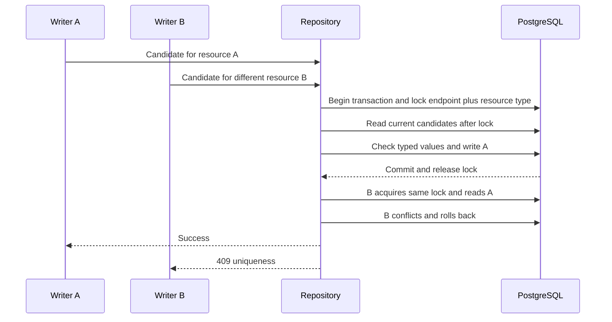
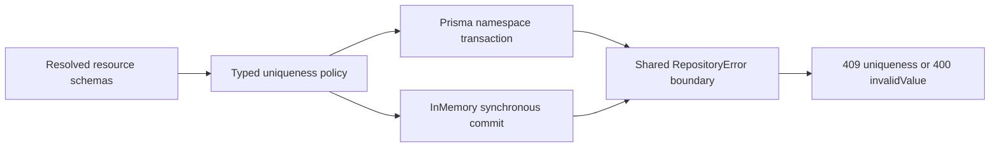

# Atomic schema-driven uniqueness

**Last verified:** 2026-09-28

**Status:** P3b local implementation on P4 tip `66a7229f`. Integration,
release metadata, exact-tip CI and deployment remain parent-owned.

> **Integration acceptance hold (2026-09-29):** the atomic-write core is
> assembled, but the as-committed policies below are not all approved.
> The original six no-write probes remain historical evidence. Follow-up
> `cefb540b` corrects unsupported-type uniqueness and reference exactness.
> Valid numeric/MV custom-core displayName server promises are still rejected
> by convenience-column assumptions, and generic candidate fields are still
> overwritten by promoted columns. These remaining custom-schema discrepancies
> belong to P3b; P7 separately
> owns common top-level externalId. Do not deploy or interpret the passing
> package counts as acceptance of those policies. See
> [integration disposition](SCIM_CORRECTNESS_DESIGN_AND_IMPLEMENTATION.md#1116-p3b-core-assembly-with-contract-corrections-open).

**Integrated RFC correction, not a full acceptance claim:** reference values are inherently
case-exact under [RFC 7643 section 2.3.7](https://www.rfc-editor.org/rfc/rfc7643.html#section-2.3.7).
Follow-up `cefb540b` removes reference folding and rejects inconsistent server
uniqueness on Boolean/dateTime/binary/whole-complex attributes. P7 owns matching
admission checks. Source-package RED/GREEN evidence is linked below; final
integrated acceptance and the custom-core displayName/active authority hold
remain separate.

**Registration is a separate open guarantee.** Runtime rejection does not
prove the endpoint profile/discovery rejects unsupported uniqueness promises.
P7 owns type- and namespace-qualified admission checks for genuinely
unsupported declarations. The current generic promoted-column restriction
must not become a blanket admission rule for otherwise valid custom-core
displayName/active or extension homonyms.
No committed P7 admission closure is established here. The P3b worker reports
no additional edits underway; remaining admission and candidate-authority
items therefore require explicit parent ownership/disposition rather than an
assumption that either worker has completed them.

## Client-visible outcome

Two different resources cannot acquire the same declared unique value by
passing simultaneous service checks. POST, PUT and PATCH return one success
and one SCIM **409 / uniqueness**, and storage contains exactly one owner.
The losing update consumes no version and changes no Group members.

This applies to Users, Groups and registered custom resource types, including
their extensions. It is not a claim of uniqueness across unrelated endpoints,
resource types, provider installations or external organizations.

## Namespace and equality contract

The source package expressed the following behavior in competing-resource
fixtures before production changes. This describes the committed implementation;
the integration acceptance hold above supersedes any claim that every policy
has been approved. Its namespace is:

`endpoint id + resource type + core-or-extension schema identity + attribute path`

Resource id identifies an owner, not a uniqueness namespace. Repeating a value
within one resource is not a conflict with another owner. A multi-valued leaf
reserves each distinct value, not an ordered array or an entire complex object.

| Characteristic / shape | As-committed behavior, subject to the hold above |
|---|---|
| Missing `uniqueness`, or `none` | No added constraint. User `externalId` and `displayName`, and custom names, are not made unique by their spelling. |
| `server` | The namespace above. Core and extension attributes with the same name remain separate. |
| `global` | Unsupported capability, not an RFC prohibition. This server cannot prove uniqueness beyond its own storage; P7 owns admission rejection. Runtime compilation fails closed. |
| String | Exact text when `caseExact:true`; otherwise JavaScript lowercase equality, without trimming or a new Unicode normalization policy. |
| Reference | Intrinsically case exact under RFC 7643 section 2.3.7, regardless of omitted or false `caseExact` metadata. No URI normalization is introduced. |
| Integer / decimal | Finite JSON numeric equality, not lexical equality; integers must be safely representable. |
| Boolean, dateTime, binary | These types have no uniqueness under RFC 7643 sections 2.3.2, 2.3.5 and 2.3.6. `server` declarations are inconsistent and fail closed; ordinary repeated values without the declaration remain accepted. |
| Multi-valued scalar | Any overlap with another owner's values conflicts. Empty arrays reserve nothing. |
| Scalar child of complex SV or MV | Walk the declared parent shape and compare each scalar leaf. Works in core or extension schemas. |
| Null or absent | No reservation. Removal/null releases a previous value; unchanged self-values do not conflict. |
| Inactive / soft-deleted resource | Remains an owner until the stored record or value is removed, preserving existing policy. |
| Case-aliased keys on a constrained path | Rejected with 400 / invalidValue; JSONB key ordering must not change the meaning of a checked value. |

The intrinsic User `userName` lowercase/CITEXT rule remains in force, including
when a profile would otherwise ask for a weaker comparison. This preserves the
existing provider tightening rather than redesigning collation. PostgreSQL
collation behavior and JavaScript lowercase are not claimed to implement a new
universal Unicode normalization standard.

Group `displayName` stays unique under the current published `server` baseline.
The old unconditional case-insensitive precheck now runs only for a resolved
case-insensitive unique Group name. A valid caseExact tightening is left to the
policy-aware commit check. The existing profile tighten-only rule still decides
whether an operator may relax the Group baseline; P3b does not change it.

## Explicit unsupported declarations and compatibility

| Declaration | Decision and impact |
|---|---|
| Uniqueness on an entire complex object | Unsupported: tuple/object equality is not defined by this implementation. Declare supported scalar child constraints instead. |
| Uniqueness on boolean, dateTime or binary | Inconsistent with their RFC type definitions, not an invitation to add bespoke equality. Remove the characteristic; repeated values are legitimate. |
| Computed core `meta`, `schemas`, User `groups`, Group `members.$ref` | Unsupported: these values are synthesized, not owned by the resource writer. |
| Core promoted string fields declared numeric, complex or MV; uniqueness on `active` | Unsupported: the existing column/response model cannot preserve an incompatible shape, and boolean has no uniqueness. The same names in extensions remain supported when their declared type supports uniqueness. |
| Unknown scalar type | Unsupported. Do not publish a constraint whose equality cannot be evaluated. |
| Malformed value in a unique field with strict validation off | Rejected with 400 / invalidValue. Disabling general strict validation does not disable a promised uniqueness invariant. |

P7 owns profile registration validation. Until those commits are consolidated,
this package alone may still admit an unsupported profile, but its affected
resource writes fail with 400 rather than silently succeeding without the
promise. Existing unsupported profiles must be corrected explicitly. No profile
or resource is silently rewritten.

Pre-existing duplicate or malformed unique values are not repaired automatically.
A write that retains a conflicting value fails; an operator can remove/change
the value or delete an owner. Review existing data before tightening a profile.
Atomic profile changes and cross-process profile freshness are P8 work: these
guarantees assume writers use the same resolved characteristic policy. P3b
does not claim to solve concurrent writes using different profile revisions.

## Storage implementation



* [Typed policy](../api/src/domain/repositories/uniqueness-policy.ts) resolves
  schema identity, scalar equality, MV traversal and promoted-column ownership.
* [Prisma wrapper](../api/src/infrastructure/repositories/prisma/prisma-uniqueness.ts)
  uses a PostgreSQL transaction advisory lock. Hash collisions can serialize
  unrelated namespaces, but cannot allow a duplicate. The lock is database-owned,
  works across application pools/replicas and releases on commit or rollback.
* READ COMMITTED reads after lock acquisition. A waiting transaction must see
  the previous writer's commit, not an earlier snapshot.
* Conditional versions are checked again under the lock and remain predicates
  on the real mutation. This preserves P3's one-winner version contract.
* Group create, replacement and append use the complete scalar/member candidate.
  All mutations use the same transaction client; P4 rollback remains intact.
* InMemory performs comparison and staged publication synchronously. Its
  repository instance is its storage boundary; separate instances intentionally
  do not share data.
* Services pass resolved policies through repository ports. The old schema
  scans are removed from production write flows; retained name prechecks are
  diagnostic conveniences, not correctness protection.



No migration is required: the existing resource/member tables already carry
the compared values. The protocol covers these repository writers, not direct
SQL, maintenance scripts that omit policies, or arbitrary external database
clients. New resource write paths must pass the current policy. The retained
member append port now requires that decision explicitly.

**Cost:** schema uniqueness scans the complete endpoint/resource-type namespace
under its write lock. This favors correctness and avoids data-repair migration
scope at current scale, but is O(resources x constrained leaves), not an indexed
high-throughput claim. Different namespaces remain independent. If measured
scale requires a reservation index, that is a separate migration with existing
data analysis and replay evidence, not an unreviewed optimization here.

## Evidence and reproduction

Final RFC-corrected run: **`postgres-85aea7a5dee16b2d`**. [Sanitized durable receipt](evidence/scim-uniqueness-rfc-20260929.json)
records the exact API/scripts hash and cleanup identity. Focused unit:
**640 passed / 10 suites**. HTTP: **144 PostgreSQL passed**, **142 InMemory
passed plus two N/A** (native foreign key and independent database pools).
Each backend also runs **21 new uniqueness live assertions**, plus the existing
33 conditional and 69 Group aggregate live assertions.

API build passes. Changed-source lint is **0 errors / 137 warnings**, down
from the identical-path HEAD baseline **0 / 142**. Both new diagrams render
under strict security in light and dark themes. Content and freshness gates
pass for all 26 manifest documents. Release/full integration gates remain
parent-owned, not implied by this focused evidence.

The RFC follow-up changed policy files independently lint at **0 errors / 0
warnings**, and its narrow independent review reports no significant issues.
The [initial receipt](evidence/scim-uniqueness-20260928.json) remains preserved
for audit history rather than rewritten as if it tested the corrected policy.

| Layer | Evidence |
|---|---|
| RED before implementation | Both backends: 44 failing HTTP cases, including two successful conflicting creates. `postgres-2890528fbe4e0fe6`. |
| Pure policy and repository units | Typed equality, null/absence, MV overlap, self updates, direct races, member rollback, unsupported shapes and case-alias order. |
| HTTP/controller | Every resource family: POST/PUT/PATCH competing different owners for scalar, MV, complex child and promoted/extension-colliding names; key-allowlisted errors and stored versions. |
| PostgreSQL | Actual 17.8, separate application connection pools, Group relational members, all 22 existing migrations replayed. |
| Live HTTP | Dedicated PowerShell smoke: 21 assertions per backend for MV conflicts, scalar SCIM errors and unchanged loser state. |
| Neighbor regressions | P3 conditional/ETag suites, existing schema-driven uniqueness, P4 aggregate rollback and live scripts. |
| Review | Three independent high-confidence findings reproduced RED and closed: aliased keys, extension identity, member append participation. [RCA ledger](SCIM_UNIQUENESS_EXECUTION_RCA.md). |

Run only against task-owned disposable storage:

```powershell
$env:PERSISTENCE_TEST_SUITE = 'atomic-uniqueness'
node .\scripts\scim-conditional-writes\check-safety.cjs
node .\scripts\scim-conditional-writes\run.cjs
```

The runner rejects existing database markers and supplied database targets,
uses a uniquely labeled loopback-only PostgreSQL container with ephemeral
storage, checks server/cluster/ownership before migrations and tests, and
removes the exact container id in `finally`. No shared database or estate is
contacted. Its sanitized receipt records source hashes, migrations, cases and
cleanup. No version, dependency manifest, lockfile, deployment or live data
change belongs to this package.

## RFC rationale and design disposition

[RFC 7643 section 2.2](https://www.rfc-editor.org/rfc/rfc7643#section-2.2)
defines `none`, `server`, `global`, defaults and caseExact.
[Section 2.3](https://www.rfc-editor.org/rfc/rfc7643#section-2.3)
limits which types have uniqueness and makes references intrinsically case
exact; those restrictions take precedence over generic characteristic defaults.
[Section 2.4](https://www.rfc-editor.org/rfc/rfc7643#section-2.4)
describes multi-valued values, and
[section 7](https://www.rfc-editor.org/rfc/rfc7643#section-7)
permits documented provider tightening.
[RFC 7644 section 3.12](https://www.rfc-editor.org/rfc/rfc7644#section-3.12)
defines 409 / uniqueness;
[section 3.5.2](https://www.rfc-editor.org/rfc/rfc7644#section-3.5.2)
requires atomic PATCH processing.

Design disposition: **applied**. Three real resource families and two backends
justify one typed policy and one Prisma transaction wrapper. Services remain
orchestrators; no policy language, global service mutex or speculative storage
engine is added. Test improvement: **applied**, distinguish different-owner
invariant races from same-owner optimistic concurrency tests and verify stored
outcomes, not merely successful HTTP statuses.

**Standards follow-up:** the first P3b commit implemented comparison for
boolean/dateTime/binary values before consulting their type-specific RFC
restrictions. P7's independent review identified that overpromise. The
follow-up removes those policies instead of claiming extra RFC guarantees,
and makes reference equality intrinsically exact. The existing implementation
is preserved in Git; no history is rewritten.
