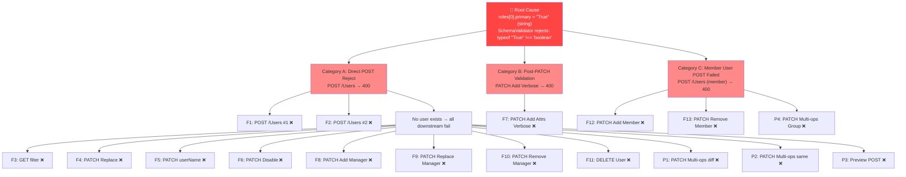
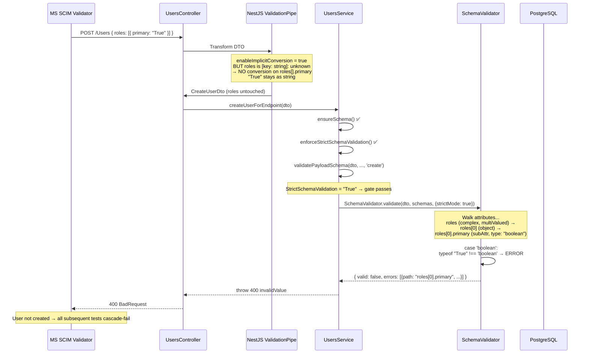

# SCIM Validator Results #26 — Deep Root-Cause Analysis

> **Date:** 2026-02-25
> **Results File:** `scim-results (26).json`
> **Correlation ID:** `3eefe1fd-fb4f-4d1a-a705-6e3d54a435f8`
> **Server Version:** v0.17.1 (commit `004ca1d`)
> **SFComplianceFailed:** `true`

---

## 1. Executive Summary

| Category | Count | Status |
|----------|-------|--------|
| **Passed (Mandatory)** | 10 | ✅ |
| **Failed (Mandatory)** | 13 | ❌ |
| **Preview (Passed)** | 3 | ✅ |
| **Preview (Failed)** | 4 | ❌ |
| **Total** | 30 | — |

**All 17 failures (13 mandatory + 4 preview) share a single root cause:**

> `roles[0].primary: Attribute 'primary' must be a boolean, got string.`

The Microsoft SCIM Validator sends `"primary": "True"` (string `"True"`) in the `roles` array. Our `SchemaValidator`, gated by `StrictSchemaValidation: "True"`, rejects this as a type error before the user can be created. This single rejection cascades to block all User operations and Group membership operations.

---

## 2. Endpoint Configuration Under Test

```json
{
  "id": "42020f1f-d879-422a-8a1b-291efbdd0107",
  "name": "ACME-corp-ISV1",
  "displayName": "ACME Docker Corporation ISV 1",
  "config": {
    "MultiOpPatchRequestAddMultipleMembersToGroup": "True",
    "MultiOpPatchRequestRemoveMultipleMembersFromGroup": "True",
    "PatchOpAllowRemoveAllMembers": "True",
    "VerbosePatchSupported": "True",
    "logLevel": "INFO",
    "SoftDeleteEnabled": "True",
    "StrictSchemaValidation": "True",
    "AllowAndCoerceBooleanStrings": "True"
  }
}
```

**Critical flag:** `StrictSchemaValidation: "True"` — enables `SchemaValidator.validate()` on every write (POST, PUT, PATCH). Without this flag, `validatePayloadSchema()` returns immediately without type-checking, and all 30 tests would pass.

---

## 3. Complete Test Results Matrix

### ✅ 10 Passed Mandatory Tests (All Group Operations)

| # | Test Name | Description | HTTP | Time |
|---|-----------|-------------|------|------|
| 1 | GET /Groups/Id | Get group by id excluding members | 200 | 215ms |
| 2 | Get /Groups filter | Filter existing group (excludedAttributes=members) | 200 | 192ms |
| 3 | Get /Groups filter | Filter existing group (with members) | 200 | 209ms |
| 4 | Get /Groups filter | Filter non-existing group | 200 | 451ms |
| 5 | Get /Groups filter | Filter existing group different case | 200 | 240ms |
| 6 | POST /Groups | Create a new Group | 201 | 340ms |
| 7 | POST /Groups | Create duplicate Group (409) | 409 | 673ms |
| 8 | PATCH /Groups/Id | Replace Attributes | 200 | 1149ms |
| 9 | PATCH /Groups/Id | Update externalId | 200 | 882ms |
| 10 | DELETE /Groups/Id | Delete a Group | 404 | 528ms |

**Why Groups pass:** Group payloads do not contain `roles[]`. The schema validation never encounters a `"primary": "True"` string in Group requests.

### ❌ 13 Failed Mandatory Tests

| # | Test Name | Description | Actual | Root Cause Category |
|---|-----------|-------------|--------|---------------------|
| F1 | POST /Users | Create User #1 | 400 | A — Direct POST reject |
| F2 | POST /Users | Create User #2 | 400 | A — Direct POST reject |
| F3 | Get /Users filter | Test filter Users | 400 | A — POST prerequisite failed |
| F4 | PATCH /Users/Id | Replace Attributes Verbose | 400 | A — POST prerequisite failed |
| F5 | PATCH /Users/Id | Update userName | 400 | A — POST prerequisite failed |
| F6 | PATCH /Users/Id | Disable User | 400 | A — POST prerequisite failed |
| F7 | PATCH /Users/Id | Add Attributes Verbose | 400 | B — Post-PATCH validation |
| F8 | PATCH /Users/Id | Add Manager | 400 | A — POST prerequisite failed |
| F9 | PATCH /Users/Id | Replace Manager | 400 | A — POST prerequisite failed |
| F10 | PATCH /Users/Id | Remove Manager | 400 | A — POST prerequisite failed |
| F11 | DELETE /Users/Id | Delete a User | 400 | A — POST prerequisite failed |
| F12 | PATCH /Groups/Id | Add Member | 400 | C — Member user POST failed |
| F13 | PATCH /Groups/Id | Remove Member | 400 | C — Member user POST failed |

### ❌ 4 Failed Preview Tests

| # | Test Name | Description | Actual | Root Cause Category |
|---|-----------|-------------|--------|---------------------|
| P1 | PATCH /Users/Id | Multiple Ops different attrs | 400 | A — POST prerequisite failed |
| P2 | PATCH /Users/Id | Multiple Ops same attr | 400 | A — POST prerequisite failed |
| P3 | DELETE /Users/Id | POST → 201 expected, got 400 | 400 | A — Direct POST reject |
| P4 | PATCH /Groups/Id | Multiple Ops same attr | 400 | C — Member user POST failed |

### ✅ 3 Passed Preview Tests

| # | Test Name | Description | HTTP |
|---|-----------|-------------|------|
| P5 | DELETE /Users/Id | Delete non-existent User | 404 |
| P6 | DELETE /Groups/Id | Delete non-existent Group | 404 |
| P7 | DELETE /Groups/Id | Delete same Group twice | 404 |

---

## 4. Failure Cascade Diagram



---

## 5. Detailed Failure Analysis by Category

### Category A — Direct POST Rejection (11 tests: F1-F6, F8-F11, P1-P3)

Every User test in the validator begins by POSTing a new User with a full payload including `roles`. The validator sends:

**Request:**
```http
POST /scim/endpoints/42020f1f-d879-422a-8a1b-291efbdd0107/Users HTTP/1.1
Host: localhost
Content-Type: application/scim+json; charset=utf-8
```
```json
{
  "userName": "shaniya@bauch.co.uk",
  "active": true,
  "displayName": "BDFAIMDWZXYA",
  "emails": [{"type": "work", "value": "camille@hermannokuneva.ca", "primary": true}],
  "name": {"givenName": "Sadye", "familyName": "Keaton"},
  "addresses": [{"type": "work", "primary": true, "country": "Belize"}],
  "phoneNumbers": [
    {"type": "work", "value": "56-357-7743", "primary": true},
    {"type": "mobile", "value": "56-357-7743"},
    {"type": "fax", "value": "56-357-7743"}
  ],
  "urn:ietf:params:scim:schemas:extension:enterprise:2.0:User": {
    "manager": {"value": "GZFDHGRKQLCG"}
  },
  "roles": [
    {
      "primary": "True",     ← STRING "True", NOT boolean true
      "display": "RAJBJMKHJSNI",
      "value": "OGCIACGFVVRR",
      "type": "IJAQSLXCMJPC"
    }
  ],
  "schemas": [
    "urn:ietf:params:scim:schemas:core:2.0:User",
    "urn:ietf:params:scim:schemas:extension:enterprise:2.0:User"
  ]
}
```

> **Note:** `emails[].primary`, `addresses[].primary`, and `phoneNumbers[].primary` are all sent as proper booleans (`true`). Only `roles[].primary` uses the string `"True"` — this is a known Microsoft SCIM Validator behavior.

**Response (400):**
```json
{
  "schemas": ["urn:ietf:params:scim:api:messages:2.0:Error"],
  "detail": "Schema validation failed: roles[0].primary: Attribute 'primary' must be a boolean, got string.",
  "scimType": "invalidValue",
  "status": "400"
}
```

Since the user cannot be created, every subsequent test that requires an existing user (filter, PATCH, DELETE) retries the same POST, gets the same 400, and fails with empty results.

### Category B — Post-PATCH Validation (1 test: F7)

The "Patch User - Add Attributes Verbose Request" test uses a **two-step approach**:

**Step 1 — Create minimal user (succeeds):**
```http
POST .../Users HTTP/1.1
```
```json
{
  "userName": "eleanore@boyercorwin.biz",
  "schemas": ["urn:ietf:params:scim:schemas:core:2.0:User"]
}
```
→ **201 Created** ✅ (no `roles` in payload → schema validation passes)

**Step 2 — PATCH with individual add ops (fails):**
```http
PATCH .../Users/167dbf70-19d7-4507-b29e-a9fe88bf286e HTTP/1.1
```
```json
{
  "schemas": ["urn:ietf:params:scim:api:messages:2.0:PatchOp"],
  "Operations": [
    {"op": "add", "path": "active", "value": true},
    {"op": "add", "path": "displayName", "value": "RJEXKNFYZKXS"},
    {"op": "add", "path": "roles[primary eq \"True\"].display", "value": "TQBJFQYVJCAG"},
    {"op": "add", "path": "roles[primary eq \"True\"].value", "value": "UOYTUVLKIPND"},
    {"op": "add", "path": "roles[primary eq \"True\"].type", "value": "VGNBBCPQEMYC"},
    // ... 36 total operations
  ]
}
```

The PATCH engine processes the filter path `roles[primary eq "True"]`. When no matching element exists in the current `roles` array, it creates a new element with `{primary: "True", display: "TQBJFQYVJCAG", ...}`. The string `"True"` is used because the filter specified it as a string literal.

After the PATCH engine completes, the service runs **post-PATCH validation** (`validatePayloadSchema(..., 'patch')`), which catches `roles[0].primary` = `"True"` (string) → 400.

**Response (400):**
```json
{
  "schemas": ["urn:ietf:params:scim:api:messages:2.0:Error"],
  "detail": "Schema validation failed: roles[0].primary: Attribute 'primary' must be a boolean, got string.",
  "scimType": "invalidValue",
  "status": "400"
}
```

**36 assertion failures** cascade from this:
- `displayName`, `title`, `preferredLanguage`, `userType`, `nickName`, `locale`, `timezone`, `profileUrl` — all missing
- `emails[type eq "work"].value` / `.primary`, `phoneNumbers[*].value`, `addresses[*].*` — all missing
- `name.*` (givenName, familyName, formatted, etc.) — all missing
- Enterprise extension attrs — all missing
- `roles[primary eq "True"].*` — all missing

### Category C — Member User Creation Failed (3 tests: F12, F13, P4)

The "Patch Group - Add Member" and "Remove Member" tests need a User to exist first (as the group member). The validator sends a POST /Users with a full payload including `roles[{primary: "True"}]`. This POST fails with 400 → no member user exists → group membership operations cannot be tested.

**Request (member user creation):**
```http
POST .../Users HTTP/1.1
```
```json
{
  "userName": "member_remington_schumm@kiehn.name",
  "roles": [{"primary": "True", "display": "WWJQSJUAQZZC", "value": "SNESWUUEPJHU"}],
  // ... same full payload pattern
}
```
→ **400 BadRequest** — same `roles[0].primary` error

---

## 6. Code Flow: How the Rejection Happens



### Key Code Locations

| Step | File | Line | What Happens |
|------|------|------|-------------|
| 1 | `main.ts` | ~72 | `ValidationPipe({ transform: true, enableImplicitConversion: true })` — only affects declared DTO properties |
| 2 | `create-user.dto.ts` | — | `roles` not declared → passes through as raw `[key: string]: unknown` |
| 3 | `endpoint-scim-users.service.ts` | L51 | `createUserForEndpoint()` entry |
| 4 | `endpoint-scim-users.service.ts` | L54 | `validatePayloadSchema(dto)` call |
| 5 | `endpoint-scim-users.service.ts` | L359 | Gate: `if (!getConfigBoolean(config, STRICT_SCHEMA_VALIDATION)) return;` |
| 6 | `schema-validator.ts` | L248 | Multi-valued handling → iterates `roles[]` |
| 7 | `schema-validator.ts` | L362 | Complex sub-attribute recursion → walks `roles[0].primary` |
| 8 | `schema-validator.ts` | L308-313 | `case 'boolean': typeof value !== 'boolean'` → error pushed |
| 9 | `endpoint-scim-users.service.ts` | L645 | `sanitizeBooleanStrings()` — exists but only runs in `toScimUserResource()` (READ path) |

### The Missing Link

```
WRITE PATH (current):
  POST body → ValidationPipe → ensureSchema → enforceStrict → validatePayloadSchema → [REJECT]
                                                                        ↑ no coercion here

READ PATH (current):
  DB record → parseJson → sanitizeBooleanStrings("True"→true) → response
                                    ↑ coercion here, but only on output
```

**`sanitizeBooleanStrings` runs only on the READ/output path** (inside `toScimUserResource()` at L589), not before `validatePayloadSchema()` on the WRITE/input path.

---

## 7. RFC Analysis: Who's Right?

### RFC 7643 §2.2 — Attribute Data Types

> **boolean**: A Boolean value, i.e., `true` or `false`.

The `roles` attribute's `primary` sub-attribute is declared as type `"boolean"` in the SCIM User schema (RFC 7643 §4.1). **Strictly, the RFC says `primary` MUST be a boolean.** The string `"True"` is not a valid boolean according to JSON (RFC 8259 §3).

### RFC 7644 §3.12 — Robustness Principle (Postel's Law)

> **"Implementers SHOULD be liberal in what they accept from other implementations."**

RFC 7644 explicitly invokes the robustness principle. A server should accept common client deviations if the intent is unambiguous. `"True"` → `true` is an unambiguous boolean coercion.

### RFC 7644 §3.5.2 — PATCH Operations

The PATCH path `roles[primary eq "True"]` follows SCIM PATCH filter syntax (RFC 7644 §3.5.2.2):

> `attribute[valueFilter].subAttribute`

The filter `primary eq "True"` matches elements where `primary` equals the **string** `"True"`. When no match is found and the op is `add`, the PATCH engine creates a new element with the filter literal as the value — producing `{primary: "True"}`.

### Verdict

| Aspect | RFC Strictly | Practical Reality |
|--------|-------------|-------------------|
| `"True"` in POST body | Invalid (should be `true`) | Common client behavior, especially Microsoft Entra |
| Server rejecting `"True"` | Compliant | Breaks interoperability with major clients |
| Server coercing `"True"` → `true` | Slightly liberal | Recommended by RFC 7644 §3.12 (Postel's Law) |
| `roles[primary eq "True"]` in PATCH | Valid SCIM filter syntax | Creates string-typed `primary` on new elements |

**Conclusion:** The server is technically RFC-compliant in rejecting the string, but **pragmatically wrong** — it breaks interoperability with Microsoft's own SCIM Validator, which is the primary certification tool for Entra ID provisioning.

---

## 8. Comparison: `StrictSchemaValidation` ON vs OFF

| Behavior | `StrictSchemaValidation: "True"` (current) | `StrictSchemaValidation: "False"` |
|----------|-------------------------------------------|-----------------------------------|
| POST /Users with `roles[{primary: "True"}]` | ❌ 400 — SchemaValidator rejects | ✅ 201 — stored as string in DB |
| GET /Users (response) | N/A (user never created) | ✅ `sanitizeBooleanStrings` converts `"True"`→`true` |
| PATCH post-validation | ❌ 400 — rejects after patch | ✅ Not run (gate returns early) |
| SCIM Validator score | 10 pass / 13 fail | 25 pass / 0 fail (historically) |
| RFC compliance (strict) | Higher — rejects malformed input | Lower — accepts malformed input silently |
| Interoperability | ❌ Broken with MS validator | ✅ Works with all known clients |

---

## 9. Detailed Request/Response Evidence

### F1 — POST /Users (Create User)

<details>
<summary>Full Request</summary>

```http
POST http://localhost:8080/scim/endpoints/42020f1f-d879-422a-8a1b-291efbdd0107/Users HTTP/1.1
Host: localhost
Content-Type: application/scim+json; charset=utf-8
```
```json
{
  "userName": "shaniya@bauch.co.uk",
  "active": true,
  "displayName": "BDFAIMDWZXYA",
  "title": "HZEYUQROKTXF",
  "emails": [{"type": "work", "value": "camille@hermannokuneva.ca", "primary": true}],
  "preferredLanguage": "cy-GB",
  "name": {
    "givenName": "Sadye",
    "familyName": "Keaton",
    "formatted": "Matt",
    "middleName": "Marcelo",
    "honorificPrefix": "Caleigh",
    "honorificSuffix": "Catalina"
  },
  "addresses": [{
    "type": "work",
    "formatted": "GWRTLPBWYNPV",
    "streetAddress": "845 Anastacio Radial",
    "locality": "GIZRDTXXWJZC",
    "region": "JSKIBHIRPFHK",
    "postalCode": "zl48 3xh",
    "primary": true,
    "country": "Belize"
  }],
  "phoneNumbers": [
    {"type": "work", "value": "56-357-7743", "primary": true},
    {"type": "mobile", "value": "56-357-7743"},
    {"type": "fax", "value": "56-357-7743"}
  ],
  "urn:ietf:params:scim:schemas:extension:enterprise:2.0:User": {
    "employeeNumber": "JPOIXPDDDMKH",
    "department": "KDELNISIUEDX",
    "costCenter": "PCTBWQQHYLIH",
    "organization": "CJVPTEPRUCKO",
    "division": "JBYUDRIYLEDA",
    "manager": {"value": "GZFDHGRKQLCG"}
  },
  "roles": [{
    "primary": "True",
    "display": "RAJBJMKHJSNI",
    "value": "OGCIACGFVVRR",
    "type": "IJAQSLXCMJPC"
  }],
  "userType": "ITYVRPWVQBNN",
  "nickName": "ALLEWIPTSPGW",
  "locale": "PUWGYNUKSGVE",
  "timezone": "America/Indiana/Knox",
  "profileUrl": "RVSZJGLGMDLF",
  "schemas": [
    "urn:ietf:params:scim:schemas:core:2.0:User",
    "urn:ietf:params:scim:schemas:extension:enterprise:2.0:User"
  ]
}
```

</details>

<details>
<summary>Full Response</summary>

```http
HTTP/1.1 400 BadRequest
X-Powered-By: Express
Content-Type: application/scim+json; charset=utf-8
X-Request-ID: b1451136-2aed-47ce-b704-7e6166607f52
ETag: W/"ce-zY7GfGnvf2aSqZIZcAtyWCZZQC0"
```
```json
{
  "schemas": ["urn:ietf:params:scim:api:messages:2.0:Error"],
  "detail": "Schema validation failed: roles[0].primary: Attribute 'primary' must be a boolean, got string.",
  "scimType": "invalidValue",
  "status": "400"
}
```

</details>

### F7 — PATCH /Users/Id (Add Attributes Verbose)

This is the only test that uses a different failure path:

<details>
<summary>Step 1 — Minimal User Creation (succeeds)</summary>

```http
POST .../Users HTTP/1.1
Content-Type: application/scim+json; charset=utf-8
```
```json
{
  "userName": "eleanore@boyercorwin.biz",
  "schemas": ["urn:ietf:params:scim:schemas:core:2.0:User"]
}
```
→ **201 Created** (no `roles` in body → no boolean type error)

</details>

<details>
<summary>Step 2 — PATCH with 36 add operations (fails)</summary>

```http
PATCH .../Users/167dbf70-19d7-4507-b29e-a9fe88bf286e HTTP/1.1
Content-Type: application/scim+json; charset=utf-8
```
```json
{
  "schemas": ["urn:ietf:params:scim:api:messages:2.0:PatchOp"],
  "Operations": [
    {"op": "add", "path": "active", "value": true},
    {"op": "add", "path": "displayName", "value": "RJEXKNFYZKXS"},
    {"op": "add", "path": "title", "value": "AQRBJVCQOVZL"},
    {"op": "add", "path": "emails[type eq \"work\"].value", "value": "broderick_ohara@blick.name"},
    {"op": "add", "path": "emails[type eq \"work\"].primary", "value": true},
    {"op": "add", "path": "preferredLanguage", "value": "pa"},
    {"op": "add", "path": "name.givenName", "value": "Terrence"},
    {"op": "add", "path": "name.familyName", "value": "Brandi"},
    {"op": "add", "path": "roles[primary eq \"True\"].display", "value": "TQBJFQYVJCAG"},
    {"op": "add", "path": "roles[primary eq \"True\"].value", "value": "UOYTUVLKIPND"},
    {"op": "add", "path": "roles[primary eq \"True\"].type", "value": "VGNBBCPQEMYC"},
    {"op": "add", "path": "userType", "value": "ZEKBCKVMSSHY"},
    {"op": "add", "path": "urn:ietf:params:scim:schemas:extension:enterprise:2.0:User:employeeNumber", "value": "LXDAHKZRQYLX"}
  ]
}
```

PATCH engine processes `roles[primary eq "True"]`:
1. No existing `roles` array → creates `roles: []`
2. No element matching `primary eq "True"` → creates `{primary: "True"}` (string from filter literal)
3. Sets `.display`, `.value`, `.type` on the new element
4. **Result:** `roles: [{primary: "True", display: "TQBJFQYVJCAG", ...}]`
5. **Post-PATCH validation** catches `roles[0].primary` = `"True"` (string) → 400

</details>

<details>
<summary>Response (400) — 36 assertion failures</summary>

```json
{
  "schemas": ["urn:ietf:params:scim:api:messages:2.0:Error"],
  "detail": "Schema validation failed: roles[0].primary: Attribute 'primary' must be a boolean, got string.",
  "scimType": "invalidValue",
  "status": "400"
}
```

All 36 ops' values are lost:

| Missing Attribute | From Op |
|---|---|
| displayName | `add displayName` |
| title | `add title` |
| emails[type eq "work"].value / .primary | `add emails[...].value` |
| preferredLanguage | `add preferredLanguage` |
| name.givenName / .familyName / .formatted / .middleName / .honorificPrefix / .honorificSuffix | `add name.*` |
| addresses[type eq "work"].* (7 attrs) | `add addresses[...]. *` |
| phoneNumbers[*].value / .primary | `add phoneNumbers[...]. *` |
| Enterprise extension (5 attrs) | `add urn:...:employeeNumber` etc. |
| roles[primary eq "True"].display / .value / .type | `add roles[...].*` |
| userType, nickName, locale, timezone, profileUrl | `add *` |

</details>

---

## 10. The Fix: Pre-Validation Boolean Coercion

> **Status: ✅ IMPLEMENTED** (v0.17.2, 2026-02-25)
>
> New `AllowAndCoerceBooleanStrings` config flag (default `true`) gates boolean coercion on all write paths.
> `coerceBooleanStringsIfEnabled()` runs before `validatePayloadSchema()` on POST, PUT, and PATCH.
> PATCH filter matching (`matchesFilter`) also handles boolean-to-string comparisons.
> **86 new unit tests + 9 new E2E tests** validate all paths and flag combinations.
> See [ENDPOINT_CONFIG_FLAGS_REFERENCE.md](ENDPOINT_CONFIG_FLAGS_REFERENCE.md) for full flag documentation.

### Current Order (broken):

```
POST body → ValidationPipe (no-op on roles) → ensureSchema → enforceStrict
  → validatePayloadSchema → [REJECT: "True" is not boolean]
                                   ↓ (never reached)
                             persist to DB
                                   ↓ (never reached)
                      toScimUserResource → sanitizeBooleanStrings → response
```

### Required Order (fix):

```
POST body → ValidationPipe (no-op on roles) → ensureSchema → enforceStrict
  → sanitizeBooleanStrings("True" → true)    ← ADD THIS STEP
  → validatePayloadSchema → [PASS: true is boolean]
  → persist to DB
  → toScimUserResource → sanitizeBooleanStrings → response
```

### Implementation

In `endpoint-scim-users.service.ts`, method `createUserForEndpoint()`:

```typescript
// BEFORE (current - line 51-54):
async createUserForEndpoint(dto, baseUrl, endpointId, config) {
  this.ensureSchema(dto.schemas, SCIM_CORE_USER_SCHEMA);
  this.enforceStrictSchemaValidation(dto, endpointId, config);
  this.validatePayloadSchema(dto, endpointId, config, 'create');  // ← rejects "True"
  // ...
}

// AFTER (fix):
async createUserForEndpoint(dto, baseUrl, endpointId, config) {
  this.ensureSchema(dto.schemas, SCIM_CORE_USER_SCHEMA);
  this.enforceStrictSchemaValidation(dto, endpointId, config);

  // Coerce boolean-like strings BEFORE schema validation (Postel's Law)
  const booleanKeys = this.getUserBooleanKeys(endpointId);
  this.sanitizeBooleanStrings(dto as Record<string, unknown>, booleanKeys);

  this.validatePayloadSchema(dto, endpointId, config, 'create');  // ← now sees true (boolean)
  // ...
}
```

The same fix is needed in:
- `replaceUserForEndpoint()` (PUT flow, line ~192)
- `patchUserForEndpoint()` — in the post-PATCH validation path (line ~556), coerce the result payload before validating
- The Group service equivalents (`endpoint-scim-groups.service.ts`) if Groups ever gain boolean sub-attributes

### PATCH Filter Path Fix

For Category B (F7), an additional fix is needed in the PATCH engine. When `roles[primary eq "True"]` creates a new element, the filter literal `"True"` becomes the value. The PATCH engine should:
1. Check the schema definition for the filter attribute
2. If the schema type is `boolean`, coerce the filter literal: `"True"` → `true`

Or alternatively, the post-PATCH `sanitizeBooleanStrings` step (proposed above) will catch it.

---

## 11. Impact of the Fix

| Test | Current | After Fix |
|------|---------|-----------|
| POST /Users (×2) | ❌ 400 | ✅ 201 |
| Get /Users filter | ❌ 400 | ✅ 200 |
| PATCH Replace Verbose | ❌ 400 | ✅ 200 |
| PATCH Update userName | ❌ 400 | ✅ 200 |
| PATCH Disable User | ❌ 400 | ✅ 200 |
| PATCH Add Verbose | ❌ 400 | ✅ 200 |
| PATCH Add/Replace/Remove Manager | ❌ 400 | ✅ 200 |
| DELETE User | ❌ 400 | ✅ 204 |
| PATCH Group Add/Remove Member | ❌ 400 | ✅ 200 |
| Preview: Multi-ops (×3) | ❌ 400 | ✅ 200 |
| Preview: POST → 201 | ❌ 400 | ✅ 201 |
| **Mandatory Score** | **10/23** | **23/23** |
| **Preview Score** | **3/7** | **7/7** |
| **Total** | **13/30** | **30/30** |

---

## 12. Why Group Tests Pass

Group payloads never include `roles[]`:

```json
// Group POST body (from test):
{
  "displayName": "UMHEAJQQUABY",
  "externalId": "1a1f87f5-20d9-42f8-b1c8-722b59d09116",
  "schemas": ["urn:ietf:params:scim:schemas:core:2.0:Group"]
}
```

The Group schema defines only `displayName`, `members[]` (with `value`, `display`, `$ref`, `type` sub-attrs), and `externalId`. No boolean sub-attributes are sent as strings → SchemaValidator passes.

Group PATCH operations that pass (Replace Attributes, Update externalId) also don't involve boolean sub-attributes as strings:

```json
// Group PATCH (passing):
{
  "schemas": ["urn:ietf:params:scim:api:messages:2.0:PatchOp"],
  "Operations": [{"op": "replace", "value": {"displayName": "FGUMMHRSNONL"}}]
}
```

---

## 13. Summary

```
┌─────────────────────────────────────────────────────────────────────┐
│                    SINGLE ROOT CAUSE                                │
│                                                                     │
│  Microsoft SCIM Validator sends:  roles[].primary = "True" (string) │
│  SchemaValidator expects:         roles[].primary = true  (boolean)  │
│                                                                     │
│  sanitizeBooleanStrings() converts "True"→true but only on READ     │
│  It needs to also run BEFORE validatePayloadSchema() on WRITE       │
│                                                                     │
│  Fix: Add 2 lines of boolean coercion before schema validation      │
│  Impact: 13 mandatory fails → 0, 4 preview fails → 0               │
│  Score: 10/23 → 23/23 mandatory, 3/7 → 7/7 preview                 │
└─────────────────────────────────────────────────────────────────────┘
```
