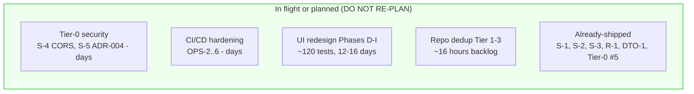
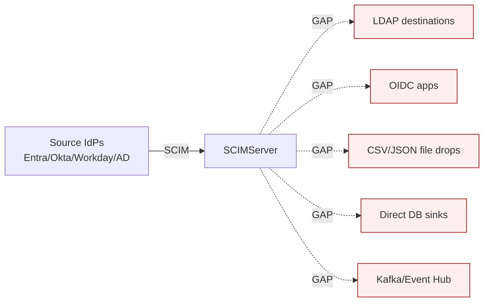
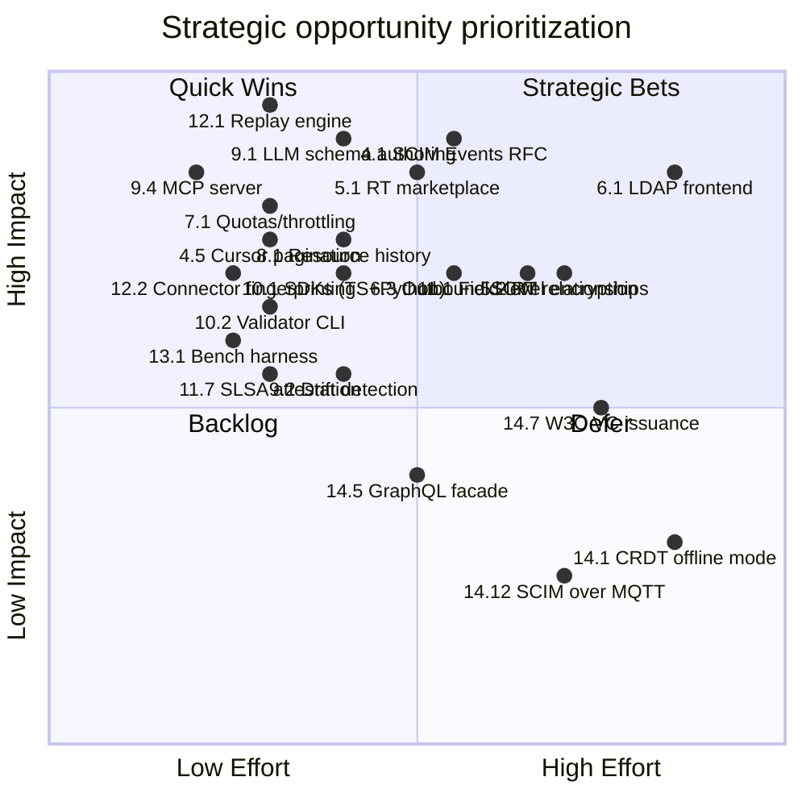
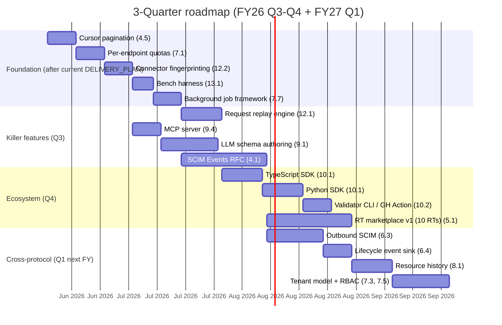

# SCIMServer - Strategic Forward-Look & Cross-Domain Opportunity Report

> **Date:** 2026-05-08 - **Version:** 0.44.1 - **Branch:** ci/validate-before-push  
> **Source-of-truth basis:** Read directly from [api/src/](../api/src/), [api/prisma/schema.prisma](../api/prisma/schema.prisma), [scripts/live-test.ps1](../scripts/live-test.ps1), [docs/INDEX.md](INDEX.md), [DELIVERY_PLAN.md](DELIVERY_PLAN.md), [DESIGN_IMPROVEMENT_DEEP_ANALYSIS.md](DESIGN_IMPROVEMENT_DEEP_ANALYSIS.md), and IETF [docs/rfcs/](rfcs/) (RFC 7642/7643/7644).  
> **Purpose:** Identify what is **not yet planned** beyond the existing 6-week DELIVERY_PLAN, surfacing gaps in custom resource types, IETF drafts, adjacent identity standards, AI/ML lateral opportunities, and ecosystem positioning.  
> **Audience:** Engineering leadership, product, and architecture decision-makers.

---

## Table of Contents

1. [Executive Summary](#1-executive-summary)
2. [Source-of-Truth Snapshot (Verified in Code)](#2-source-of-truth-snapshot-verified-in-code)
3. [What Is Already Planned (and Should NOT Be Re-Planned)](#3-what-is-already-planned-and-should-not-be-re-planned)
4. [Gap Layer 1 - SCIM Protocol Beyond RFC 7643/7644](#4-gap-layer-1---scim-protocol-beyond-rfc-76437644)
5. [Gap Layer 2 - Custom Resource Types: The Underused Lever](#5-gap-layer-2---custom-resource-types-the-underused-lever)
6. [Gap Layer 3 - Adjacent Identity Standards (Cross-Protocol)](#6-gap-layer-3---adjacent-identity-standards-cross-protocol)
7. [Gap Layer 4 - Operational & Multi-Tenant Maturity](#7-gap-layer-4---operational--multi-tenant-maturity)
8. [Gap Layer 5 - Data Plane & Persistence Lateral Moves](#8-gap-layer-5---data-plane--persistence-lateral-moves)
9. [Gap Layer 6 - AI/ML & Agentic Opportunities](#9-gap-layer-6---aiml--agentic-opportunities)
10. [Gap Layer 7 - Developer Experience & Ecosystem](#10-gap-layer-7---developer-experience--ecosystem)
11. [Gap Layer 8 - Security, Privacy & Compliance Frontier](#11-gap-layer-8---security-privacy--compliance-frontier)
12. [Gap Layer 9 - Observability, Forensics & Replay](#12-gap-layer-9---observability-forensics--replay)
13. [Gap Layer 10 - Performance, Scale & Cost](#13-gap-layer-10---performance-scale--cost)
14. [Lateral Tech-Convergence Opportunities](#14-lateral-tech-convergence-opportunities)
15. [Prioritization Matrix (Effort x Impact x Differentiation)](#15-prioritization-matrix-effort-x-impact-x-differentiation)
16. [Recommended Next 3 Quarters](#16-recommended-next-3-quarters)
17. [Risk Register for New Initiatives](#17-risk-register-for-new-initiatives)
18. [Open Questions for Decision-Makers](#18-open-questions-for-decision-makers)
19. [Appendix A - Verified Source Inventory](#19-appendix-a---verified-source-inventory)

---

## 1. Executive Summary

SCIMServer at v0.44.1 has reached an unusual maturity inflection: **100% RFC 7643/7644 compliance**, all 27 historical migration gaps (G1-G20) closed, 5,131 automated tests, 25/25 + 7 preview Microsoft SCIM Validator pass with zero false positives, and a fully-articulated 6-week [DELIVERY_PLAN.md](DELIVERY_PLAN.md) for production hardening + UI redesign. The codebase is well past the "build the SCIM server" phase.

The strategic question is no longer **"are we compliant?"** - it is **"what does SCIMServer become next?"**

This report identifies **57 distinct opportunities** across 10 gap layers that are **not currently in DELIVERY_PLAN, DESIGN_IMPROVEMENT_DEEP_ANALYSIS, or UI_REDESIGN_REMAINING_GAPS_PLAN**. They cluster into five strategic narratives:

| Narrative | One-line Summary | Differentiation |
|---|---|---|
| **A. The reference SCIM platform** | Become the canonical "SCIM-as-a-Service" sandbox + conformance harness IdP vendors test against | No incumbent owns this niche |
| **B. The SCIM laboratory** | Side-by-side endpoint comparison, replay, fault injection, fuzzing-as-a-service | Solves Entra/Okta/Workday connector debugging in one tool |
| **C. The cross-protocol identity bridge** | SCIM in - SCIM out + LDAP/SAML JIT/OIDC CIBA/IGA/lifecycle event sink | Turns a "destination" into an "exchange" |
| **D. The agentic AI control plane for identity** | LLM-driven schema authoring, drift detection, anomaly detection, conversational provisioning | Greenfield - no SCIM tool has this today |
| **E. The compliant data plane** | First-class governance, audit chain integrity, data residency, and machine-readable evidence packs | Fills SOC2/ISO 27001/EU NIS2 gap that current tools punt to ServiceNow |

The single highest-leverage move in the next quarter is **(B) The SCIM laboratory** because the existing live-test infrastructure (8,746-line PowerShell harness, JSON pipeline outputs, per-endpoint isolation, ring-buffer logs, SSE stream) is already 70% of the way there - and there is **no product on the market that does this for SCIM specifically**.

---

## 2. Source-of-Truth Snapshot (Verified in Code)

Verified by direct reads from [api/src/](../api/src/) on 2026-05-08:

### 2.1 Modules and surface area

| Layer | Files (paths verified) | Notes |
|---|---|---|
| Entry | [api/src/main.ts](../api/src/main.ts) (141 LoC) | Trust-proxy on, `/scim/v2 -> /scim` rewrite, CORS via `parseCorsOrigin(env.CORS_ORIGIN)` (S-4 closed), SPA fallback via [bootstrap/spa-fallback.ts](../api/src/bootstrap/spa-fallback.ts), 5 MB JSON limit, ValidationPipe with `enableImplicitConversion:true` (ADR-004) |
| Auth | [modules/auth/shared-secret.guard.ts](../api/src/modules/auth/shared-secret.guard.ts) (229 LoC), [oauth/oauth.service.ts](../api/src/oauth/oauth.service.ts) | 3-tier: per-endpoint bcrypt -> OAuth JWT -> global secret; `safeCompare()` from [security/safe-compare.ts](../api/src/security/safe-compare.ts) (S-2 closed); `forbidden-source-patterns.spec.ts` regression guard |
| SCIM controllers | 12 files in [modules/scim/controllers/](../api/src/modules/scim/controllers/) | Users, Groups, Generic (custom RT), Bulk, /Me, Discovery, Schemas, ResourceTypes, ServiceProviderConfig, AdminCredential, Admin, EndpointLog |
| SCIM services | 4 files in [modules/scim/services/](../api/src/modules/scim/services/) | Users, Groups, Generic, Bulk, plus Metadata + sanitize-boolean spec |
| Profile system | [modules/scim/endpoint-profile/](../api/src/modules/scim/endpoint-profile/) | Auto-expand, tighten-only validator, 6 presets, schema cache |
| Domain | [domain/validation/](../api/src/domain/validation/), [domain/patch/](../api/src/domain/patch/), [domain/repositories/](../api/src/domain/repositories/), [domain/errors/](../api/src/domain/errors/), [domain/models/](../api/src/domain/models/) | Pure-domain (zero NestJS) - 2,910 LoC across SchemaValidator + 3 Patch engines |
| Infrastructure | [infrastructure/repositories/prisma/](../api/src/infrastructure/repositories/prisma/), [infrastructure/repositories/inmemory/](../api/src/infrastructure/repositories/inmemory/) | Hexagonal swap via `PERSISTENCE_BACKEND` env (`prisma`/`inmemory`) |
| Cross-cutting | [modules/logging/](../api/src/modules/logging/), [modules/scim/middleware/](../api/src/modules/scim/middleware/), [modules/scim/interceptors/](../api/src/modules/scim/interceptors/) | Dual `AsyncLocalStorage` (endpoint context + correlation), ring buffer, SSE, file rotation, auto-prune |

### 2.2 Persistence (verified from [schema.prisma](../api/prisma/schema.prisma))

5 models, all UUID-keyed, all `@db.Timestamptz`:
- `Endpoint` - JSONB `profile` carries schemas + resourceTypes + SPC + settings (the unification that closed Phase 13)
- `RequestLog` - 6 indexes including composite `[createdAt, method, url]` for activity summaries
- `ScimResource` - polymorphic, `resourceType` discriminator, CITEXT for `userName`/`displayName`, JSONB `payload`, monotonic `version` (powers `W/"v{N}"` ETags)
- `ResourceMember` - `@@unique([groupResourceId, value])` (Tier-0 #5 closed 2026-04-30)
- `EndpointCredential` - bcrypt-hashed, optional expiry, cascade-delete

### 2.3 Configuration surface (verified from [endpoint-config.interface.ts](../api/src/modules/endpoint/endpoint-config.interface.ts) - 572 LoC)

**16 flags** = 13 boolean + `logLevel` (string|number) + `PrimaryEnforcement` (tri-state) + `logFileEnabled`. Six built-in presets in [endpoint-profile/presets/](../api/src/modules/scim/endpoint-profile/presets/): `entra-id`, `entra-id-minimal`, `rfc-standard`, `minimal`, `user-only`, `user-only-with-custom-ext`. Settings v7 marked four flags `@deprecated`.

### 2.4 Test pyramid (verified from [docs/INDEX.md](INDEX.md) and pipeline JSON)

| Level | Count | Source |
|---|---|---|
| Unit | 3,641 (84+ suites) | [api/src/**/*.spec.ts](../api/src/) |
| API E2E | 1,122 (52+ suites) | [api/test/e2e/](../api/test/e2e/) |
| Web Vitest | 368 | [web/src/](../web/src/) |
| Playwright | 7 | [web/e2e/router-behavior.spec.ts](../web/e2e/router-behavior.spec.ts) |
| Live SCIM | 886 | [scripts/live-test.ps1](../scripts/live-test.ps1) (8,746 LoC) |
| MS SCIM Validator | 25/25 + 7 preview | External, zero FPs |

### 2.5 Already-planned but not yet shipped

From [DELIVERY_PLAN.md §3](DELIVERY_PLAN.md#3-named-defect-inventory) and [UI_REDESIGN_REMAINING_GAPS_PLAN.md](UI_REDESIGN_REMAINING_GAPS_PLAN.md):
- **OPS-2..6**: digest pinning, Dependabot+CodeQL+Trivy, CODEOWNERS, blue/green via `revisionsMode:'multiple'`, quarterly PITR restore drill
- **UI-B1..B6**: shared `@scim/types` package, event-driven stats projection, name resolver with LRU+DataLoader, dashboard BFF
- **Phases D-I**: Activity/Schemas/Credentials tabs, Cmd+K, MSW handlers, axe-core, visual regression, web coverage gates, size-limit, `?ui=legacy` cutover, ~3,000 LoC legacy cleanup

---

## 3. What Is Already Planned (and Should NOT Be Re-Planned)

To avoid confusion, this report **explicitly excludes** the following because they are already fully scoped, named, and queued:

This document focuses on **everything beyond that perimeter**.

---

## 4. Gap Layer 1 - SCIM Protocol Beyond RFC 7643/7644

The IETF SCIM working group has published meaningful extensions and active drafts since 2015. None of them are in the project.

### 4.1 SCIM Events (RFC 9420 / draft-ietf-scim-events) - HIGH IMPACT

**What:** Standardized webhook/event notifications for resource lifecycle (`urn:ietf:params:scim:event:create`, `update`, `replace`, `patch`, `delete`, `activate`, `deactivate`).

**Why we should care:**
- Today the project has internal `EventEmitter2` work planned (UI-B2) for stats projection but not externalized
- Every IdP that wants to know "did the downstream actually accept the change?" or "did the resource later change locally?" needs SCIM events
- This is a **multi-million-dollar gap in Okta Workflows / Workday integrations** that no open-source SCIM server fills

**Proposed implementation:**
- Add `EndpointEventSubscription` Prisma model (URL, secret, event type filters, retry policy, dead-letter)
- Add `urn:ietf:params:scim:api:messages:2.0:Event` schema to discovery
- Hook into existing service-layer `commit -> emit` points (UI-B3 hook is already designed)
- Add admin API: `POST /admin/endpoints/:id/subscriptions`, GET, DELETE, replay
- Sign payloads with HMAC-SHA256, support CloudEvents 1.0 envelope as alternate format
- Estimate: **3 weeks** including conformance test against [draft-ietf-scim-events-09](https://datatracker.ietf.org/doc/draft-ietf-scim-events/)

### 4.2 SCIM Soft Delete (draft-ietf-scim-soft-delete) - MEDIUM IMPACT

**What:** Standardizes the `?deleted=true`, `meta.deleted`, and `Restore` operation that the project already implements **non-standardly** via the `UserSoftDeleteEnabled` flag.

**Why we should care:**
- The project's soft delete is currently a proprietary extension - aligning it to the draft would let any compliant client use it
- `meta.deleted: true` projection on GET, `Restore` PATCH op, and `?includeDeleted=true` query param are simple additions
- Estimate: **3 days**

### 4.3 SCIM Bulk Async (draft-ietf-scim-bulk-async) - LOW-MEDIUM

**What:** Long-running bulk operations with `202 Accepted + Location` polling.

**Why we should care:** Today [bulk-processor.service.ts](../api/src/modules/scim/services/bulk-processor.service.ts) is synchronous with a 1 MB / 1000-op cap. Async unlocks "import 50,000 users from Workday" use cases.

**Implementation:**
- Add `BulkJob` Prisma model with state machine (`pending`, `running`, `completed`, `failed`, `partial`)
- Add `POST /Bulk` returns `202 Accepted` + `Location: /BulkStatus/{id}` when `?async=true`
- Add SSE channel for progress (reuses existing SSE infrastructure)
- Estimate: **1.5 weeks**

### 4.4 SCIM Password Management (RFC 7643 §7 - changePassword + future draft) - MEDIUM

**What:** [SchemaValidator](../api/src/domain/validation/schema-validator.ts) declares password attribute (`returned:'never'`, `mutability:'writeOnly'`) but `changePassword.supported: false` in SPC. There is also no `forgotPassword`, no zxcvbn-style strength, no breach-corpus check.

**Why we should care:** `changePassword.supported: true` is a Microsoft Entra ID checkbox-feature. Today we cannot check it.

### 4.5 SCIM Querying with Cursor Pagination (draft-ietf-scim-cursor-pagination) - HIGH IMPACT

**What:** Replaces RFC 7644 §3.4.2.4 `startIndex/count` with opaque cursor (`nextCursor`/`previousCursor`).

**Why we should care:**
- `startIndex/count` over a CITEXT-sorted dataset of millions of users does **OFFSET** scan in Postgres - O(N) per page
- Cursor pagination via keyset on `(createdAt, id)` is O(log N) and immune to "lost rows during pagination" race
- This is the single highest-leverage RFC-compliant performance improvement available
- Estimate: **1 week** including 9-test live section + cursor parser unit tests

### 4.6 SCIM .search Saved Query (proprietary extension opportunity)

**What:** Today every `.search` body is parsed, executed, and discarded. Add `POST /.search/saved` returning a UUID, then `GET /.search/saved/{id}/results?startIndex=...`.

**Why:** Pagination over a complex filter (e.g., `displayName co "Eng" and meta.lastModified gt "2026-01-01"`) re-evaluates the filter on every page hit. Saved queries cache the row-id set with TTL.

### 4.7 Schema versioning and `Schema-Version` header (proprietary)

**What:** When a profile is tightened (e.g., `displayName.uniqueness: none -> server`), existing data may violate the new constraint. There is **no concept of profile version** today - tightening is destructive in observable behavior even though the data is preserved.

**Implementation:**
- Add `profileVersion: int` to `Endpoint` (auto-increment on profile change)
- Emit `Schema-Version: v3` response header
- Add `If-Schema-Version: v2` request header to reject reads/writes if profile mutated underneath
- Estimate: **3 days**

### 4.8 Conformance Profile Negotiation (lateral)

**What:** Today the client guesses what the server supports by parsing SPC + Schemas + ResourceTypes. There is no concept of "I am Entra ID, give me the Entra-compatible profile of this endpoint." Add `?profile=entra-id-minimal` to `GET /ServiceProviderConfig` to **return a tightened SPC view** that surfaces only what that profile supports.

**Estimate:** **2 days**, mostly view-projection logic.

---

## 5. Gap Layer 2 - Custom Resource Types: The Underused Lever

[G8B_CUSTOM_RESOURCE_TYPE_REGISTRATION.md](G8B_CUSTOM_RESOURCE_TYPE_REGISTRATION.md) implemented custom RTs via inline profile + generic controller + generic patch engine + JSONB storage. **This is the most under-leveraged feature in the codebase.** The existing source already supports arbitrary resource types - what's missing is the patterns, presets, and tooling that would make it consumable.

### 5.1 Resource type marketplace / preset library (HIGH IMPACT)

**What:** Today there are 6 SPC presets but only example custom RTs (`user-only-with-custom-ext`). Build a **preset library** of 30+ industry resource types delivered as `presets/marketplace/`:

| Industry | Resource Types |
|---|---|
| HR / HCM | `Employee`, `Position`, `OrgUnit`, `Compensation`, `LeaveRequest`, `PerformanceReview` |
| ITSM | `Incident`, `Change`, `Asset`, `Software`, `License`, `Knowledge` |
| Healthcare (HL7-style) | `Practitioner`, `Patient` (RFC 7643-shaped subset), `Organization`, `Location`, `Schedule` |
| Financial | `Account`, `Customer`, `Beneficiary`, `Mandate`, `Wallet`, `Card` |
| Education | `Student`, `Teacher`, `Course`, `Section`, `Enrollment`, `Grade` |
| IGA | `Role`, `Entitlement`, `AccessRequest`, `Approval`, `Certification`, `Risk` |

Each preset = JSON document in [endpoint-profile/presets/marketplace/](../api/src/modules/scim/endpoint-profile/presets/marketplace/) with: schema URN(s), attribute definitions (with characteristics), recommended SPC settings, fixture data, sample PATCH operations, and conformance tests added to live-test.

**Why this is differentiating:** No SCIM server on the market ships pre-built non-User/Group resource type templates. This positions SCIMServer as the **"WordPress of SCIM"** - bring your own schema, pick a template, go.

### 5.2 Resource type relationships / cross-type references (HIGH IMPACT)

**What:** Today `Group.members[].$ref` points to a `User` or another `Group`. There is no first-class machinery for `Employee.position.$ref -> Position` or `AccessRequest.approver.$ref -> User`.

**Implementation:**
- Add `referenceTypes` enforcement in [SchemaValidator](../api/src/domain/validation/schema-validator.ts) to validate that the target resource exists for any `type:"reference"` attribute
- Add referential integrity options: `cascade`, `restrict`, `set-null`, `noop`
- Add reverse-lookup endpoint: `GET /Users/{id}/relationships/AccessRequest` to find all access requests pointing at this user
- Estimate: **2 weeks**

### 5.3 Polymorphic schema inheritance / mixin support

**What:** Today extension URNs are flat additions. There is no `extends:[urn:ietf:params:scim:schemas:core:2.0:User]` for custom RTs that share user-like behaviors.

**Implementation idea:** Add `inherits: string[]` to `EndpointResourceType` profile entry. The auto-expand service merges the parent schema's attributes during cache build. This unlocks `ContractorEmployee extends Employee extends Person`.

### 5.4 Computed/derived attributes

**What:** Today every attribute is stored. `User.fullName` cannot be `givenName + ' ' + familyName` without client-side computation.

**Implementation:**
- Add `computed: { expr: "givenName + ' ' + familyName" }` to attribute definitions
- Use [json-logic-js](https://jsonlogic.com/) or a small AST evaluator (no eval())
- Project on read; reject on write (effectively `mutability: 'readOnly' + computed`)
- Estimate: **1 week**

### 5.5 Schema constraints / cross-attribute validators

**What:** `required:true` and `canonicalValues` are atomic. There is no "if `addresses[].type=='work'` then `streetAddress` required" or "exactly one `emails[].primary=true`" beyond the `PrimaryEnforcement` tri-state.

**Lateral thought:** Express constraints as **JSON Schema 2020-12 `if/then/else`** snippets stored in `EndpointResourceType.constraints[]`. This sidesteps building a custom DSL.

### 5.6 Resource type lifecycle hooks (proprietary extension)

**What:** Per-resource-type pre-save / post-save / pre-delete hooks expressed as either (a) declarative JSON-LogicAt rules or (b) WebAssembly modules signed and uploaded by tenant.

**Why WebAssembly:** Lets customers ship validation logic written in any language without trusting them with JS `eval`. Wasm sandbox + memory limit + 50ms timeout = safe.

---

## 6. Gap Layer 3 - Adjacent Identity Standards (Cross-Protocol)

### 6.1 LDAP frontend (HIGH IMPACT for legacy estates)

**What:** Mount an LDAP v3 server (using `ldapjs` or `node-ldap-server`) in front of the same `ScimResource` table. Maps DN -> SCIM `userName`, attributes via OID-to-SCIM-attr lookup.

**Why:** Massive legacy estate of UNIX, Cisco, Cisco ISE, F5, NetScaler, etc., that **cannot speak SCIM**. SCIMServer becomes the "modern ID source for legacy LDAP consumers."

**Estimate:** **3 weeks** for read-only LDAP (Bind + Search). Write LDAP is harder (DN routing, modify ops -> SCIM PATCH).

### 6.2 SAML JIT / OIDC userinfo backend (MEDIUM)

**What:** Expose `/oauth2/userinfo` and `/saml2/idpattributeresolver` endpoints sourced from `ScimResource`. A dev who deploys SCIMServer for testing also gets a free OIDC IdP for their app under test.

**Estimate:** **2 weeks** if we stand on top of `node-oidc-provider`.

### 6.3 SCIM destination connectors (HIGH IMPACT)

**What:** Today SCIMServer is always the destination. Add an outbound mode: declare another SCIM server as a destination, and SCIMServer mirrors writes to it (with retry, dead-letter, transform).

**Use case:** Company has Entra ID -> SCIMServer (test/sandbox) -> production downstream. Test in pre-prod, replay to prod with one click.

**Estimate:** **2 weeks** + reuses the SCIM Events work (4.1).

### 6.4 Lifecycle event sink (Kafka / EventHub / Webhook fanout)

**What:** Today every successful SCIM write is logged in `RequestLog`. Externalize as a stream sink: per-endpoint configuration to push CloudEvents to Kafka, EventHub, SQS, NATS, generic webhook, file rotation.

**Why:** Customers want SCIM events flowing into their data lake, SIEM, or analytics warehouse. Today they screen-scrape the admin log API.

### 6.5 IGA / lifecycle-state machine attribute (lateral)

**What:** Add `urn:scimserver:schemas:extension:lifecycle:2.0:User` extension declaring `lifecycleState: enum(prehire,active,leave,terminated,offboarded,purged)` and emit transition events.

**Differentiator:** Maps directly to ISO/IEC 24760 lifecycle states. No SCIM server in the wild does this.

### 6.6 SCIM <-> CSV bidirectional bridge

**What:** Per-endpoint scheduled CSV export (gzipped to blob storage) and CSV import via `POST /admin/endpoints/:id/import?format=csv`. Schema mapping rules.

**Why:** Procurement, finance, and HR teams live in CSV/Excel. This is the bridge.

---

## 7. Gap Layer 4 - Operational & Multi-Tenant Maturity

### 7.1 Quotas, throttling, fair-use (HIGH IMPACT)

**Verified gap:** No code in [api/src/](../api/src/) enforces per-endpoint or per-tenant rate limits. A misbehaving Entra connector can saturate the DB pool (this is exactly what caused the **April 16, 2026 production outage** - documented in Session_starter).

**Implementation:**
- Add `EndpointQuota` Prisma model: `requestsPerMinute`, `bulkOpsPerHour`, `payloadBytesPerDay`, `concurrentConnections`
- Token-bucket middleware ([modules/scim/middleware/](../api/src/modules/scim/middleware/)) keyed by `endpointId + authCredentialId`
- Return `429 Too Many Requests` with `Retry-After` and SCIM-format error body
- Estimate: **1 week**

### 7.2 Per-endpoint cost accounting

**What:** Capture per-request DB queries, CPU ms, bytes in/out, then aggregate per endpoint per day. Expose as `GET /admin/endpoints/:id/usage?from=...&to=...`. Enables chargeback in shared deployments.

### 7.3 Tenant-as-a-resource (vs. tenant-as-an-endpoint)

**Verified state:** Today "tenant" is conflated with "endpoint" - one URL = one config + one resource set. There is no notion of `Tenant.endpoints[]` (an org with multiple SCIM endpoints).

**Future-proofing:** Add `Tenant` model above `Endpoint` so a single billing/admin entity can own many endpoints (dev/staging/prod, or per-app). Wire into RBAC.

### 7.4 Self-service tenant onboarding (HIGH for product-led growth)

**What:** Today endpoint creation requires `SCIM_SHARED_SECRET` admin auth. Add a marketing-page-driven signup flow: email verification, sandbox endpoint auto-provisioned with the `entra-id` preset, time-boxed for 14 days.

**Why:** Convert SCIMServer into a product surface, not just a deployment.

### 7.5 RBAC for admin operations

**Verified gap:** [admin.controller.ts](../api/src/modules/scim/controllers/admin.controller.ts) requires only the global secret. There is no admin-user model, no role separation between "operator" (read logs), "developer" (manage credentials), "owner" (delete endpoint).

### 7.6 Per-endpoint feature flags (extension of existing config)

**What:** Today config flags are baked into profiles. Add a runtime feature-flag layer (LaunchDarkly-style) so flags can be toggled without re-saving the profile and immediately observed via SSE.

### 7.7 Background job framework

**Verified gap:** No `Queue`/`Worker` infrastructure exists. Today every SCIM operation is request-thread synchronous. Adding any async work (bulk async, webhook delivery, scheduled CSV export, restore drill) requires picking a job runtime: BullMQ (Redis), Temporal, or a Postgres-backed queue (`pg-boss`).

**Recommendation:** `pg-boss` - keeps the dependency footprint to "just Postgres" which is already required.

### 7.8 Multi-region / read replicas

**Verified state:** Today single-region Postgres. Add `READONLY_DATABASE_URL` env var; route GET/LIST/`.search` to the replica via Prisma's `$replica()` extension. Sub-50ms reads from EU/APAC for a US-primary deployment.

---

## 8. Gap Layer 5 - Data Plane & Persistence Lateral Moves

### 8.1 Time-series snapshot of every resource (event sourcing lite)

**What:** Add `ScimResourceHistory` Prisma model written by trigger on every UPDATE. Enables `GET /Users/{id}?asOf=2026-04-15T00:00:00Z` (point-in-time read) and `GET /Users/{id}/history?from=...&to=...`.

**Why:** Closes the **"who changed what when"** gap that audit teams universally demand. Today this lives only in `RequestLog.requestBody` which is fragile, not queryable, and pruned.

**Implementation:** Postgres trigger -> JSONB diff stored as RFC 6902 JSON Patch. Estimate: **1.5 weeks**.

### 8.2 Sync token / change feed (lateral - mirrors Cosmos DB pattern)

**What:** Per-endpoint monotonic `changeId` that any consumer can poll: `GET /admin/endpoints/:id/changes?since=12345` returns ordered list of `(changeId, resourceId, op)`. Replaces webhook reliability with pull.

### 8.3 Tombstones with retention policy

**Verified state:** [schema.prisma](../api/prisma/schema.prisma) does **not** have a `deletedAt` column on `ScimResource` despite docs claiming soft-delete tracks `deletedAt`. **This is a documentation/code drift to verify** (need to check the actual current state of soft-delete - it may be implemented via `active=false` only). If `deletedAt` is missing, hard-delete + tombstone is the cleaner model.

### 8.4 Sharding by `endpointId` (future scale)

**What:** `endpointId` is on every row. The schema is **already shard-ready** by endpoint. Document the approach: Postgres declarative partitioning by hash(endpointId) at 16 partitions. Becomes relevant at >50M resources.

### 8.5 Vector embedding column for semantic search (lateral, AI-adjacent)

**What:** Add `pgvector` extension and a `payload_embedding vector(1536)` column populated on write. Unlocks `GET /Users?semanticSearch=engineering manager based in london` as an extension to filter syntax. Falls outside RFC, gated behind `SemanticSearchEnabled` flag.

### 8.6 Connection pooling via PgBouncer in Bicep

**Verified gap:** Production DB pool exhaustion was the April 16 outage root cause. Pooling is currently in-app (Prisma) only. Add PgBouncer sidecar to ACA template for transaction-mode pooling.

---

## 9. Gap Layer 6 - AI/ML & Agentic Opportunities

This is where SCIMServer can do something **no incumbent does today**.

### 9.1 LLM-driven schema authoring (HIGH IMPACT, GREENFIELD)

**What:** "Generate a SCIM resource type for a Salesforce-style Opportunity object with the following CSV sample..." -> LLM returns a complete `EndpointResourceType` JSON ready for `POST /admin/endpoints/:id/profile`.

**Implementation:**
- New web UI page: "Schema generator"
- Accepts CSV/JSON sample, natural-language description, or "import from existing system" (call out to Workday SOAP, Salesforce REST, etc.)
- LLM tool-calls into [SchemaValidator](../api/src/domain/validation/schema-validator.ts) to validate before returning
- Returns a draft profile + the auto-generated tighten-only diff against a base preset
- Estimate: **2 weeks** assuming Azure OpenAI/Anthropic API key already wired

**Why we can do this and others can't:** The `ScimSchemaRegistry` + `auto-expand.service` + `tighten-only-validator` already enforce a strict grammar. The LLM can hallucinate; the validator stops the hallucination from shipping. **This is exactly the pattern that makes LLM-generated infrastructure safe.**

### 9.2 Drift detection between profiles and observed payloads

**What:** Background job analyzes 1000 most recent `RequestLog.requestBody` payloads against the profile. Surfaces: "23% of requests carry `urn:custom:lifecycle:2.0:User.exitDate` which is not declared in your schema." Suggests profile auto-tightening or extension addition.

**Why:** Customers add custom Entra ID attribute mappings without telling the SCIM server. Drift detection turns a silent gap into a recommendation.

### 9.3 Anomaly detection on RequestLog stream

**What:** Train a simple isolation-forest or one-class SVM on per-endpoint request shape + frequency. Surface alerts: "endpoint `acme-corp` is receiving 10x normal `DELETE /Users` rate - possible ransomware/insider event."

**Estimate:** **1 week** using `scikit-learn` (Python sidecar) or pure-JS via `iso-forest`.

### 9.4 Conversational provisioning agent (MCP server endpoint)

**What:** Expose the admin API as a Model Context Protocol server. An LLM agent can now: "Create a sandbox endpoint with the entra-id-minimal preset, add 5 test users named after Marvel characters, then run a PATCH on each setting `active=false`."

**Why:** This is **exactly the kind of repeatable testing developers do daily**. An MCP server makes it conversational. Plug into Cursor, VS Code, Claude Desktop, any MCP client.

**Estimate:** **1 week** - thin wrapper around existing admin REST.

### 9.5 LLM-powered test case generation (extends self-improving prompt system)

**What:** [SELF_IMPROVING_TEST_HEALTH_PROMPT.md](SELF_IMPROVING_TEST_HEALTH_PROMPT.md) already exists. Extend with a job that reads `git diff` against `master`, identifies new public functions, and proposes unit/E2E/live test additions automatically as PR comments.

### 9.6 Natural-language filter -> SCIM filter compiler

**What:** `GET /Users?nlq=engineers in london hired this year` -> LLM compiles to `displayName co "Eng" and addresses[type eq "work" and locality eq "London"] and meta.created ge "2026-01-01T00:00:00Z"`. Validate via existing [scim-filter-parser.ts](../api/src/modules/scim/filters/scim-filter-parser.ts), reject on parse failure.

### 9.7 Synthetic test-data generation

**What:** "Give me 1000 realistic users for a UK tech company with realistic name distribution, email patterns, and 30% remote workers." Useful for load tests, demos, and Lexmark-style ISV conformance runs.

### 9.8 PII redaction layer (lateral)

**What:** Detect PII in `RequestLog.requestBody` (Microsoft Presidio, AWS Comprehend) and either redact at rest or redact on read for non-privileged log viewers. Critical for GDPR Art. 5 (data minimization).

---

## 10. Gap Layer 7 - Developer Experience & Ecosystem

### 10.1 SDK packages (HIGH IMPACT)

**Verified gap:** Today every consumer hand-rolls HTTP. Ship official SDK packages:
- `@scimserver/sdk-typescript` (already half-built in `web/src/api/queries.ts`)
- `@scimserver/sdk-python` (auto-gen from OpenAPI in [docs/openapi/](openapi/))
- `@scimserver/sdk-dotnet` (Workday/Entra developers live in C#)
- `@scimserver/sdk-go` (cloud-native shops)
- `@scimserver/cli` - companion CLI for scriptable admin ops

**Why:** Lowers integration friction from "read 84 endpoint docs" to `await client.users.create({...})`.

### 10.2 SCIM Validator CLI / GitHub Action

**What:** Wrap the existing live-test harness as a portable conformance checker: `npx @scimserver/validate https://my-scim-server.example.com --token xyz --preset entra-id`. Publish as GitHub Action.

**Why:** Anyone building a SCIM server (not just consuming one) needs conformance testing. Today the Microsoft validator is web-form-only and slow.

### 10.3 VS Code extension

**What:** Browse endpoints, replay RequestLogs, edit profiles with autocomplete + tighten-only diff preview, generate code snippets in TS/Python/C#/Go.

### 10.4 Browser extension (devtools panel)

**What:** Adds a "SCIM" tab to browser devtools that captures and replays SCIM HTTP from the inspected page. Useful when developing custom IdP UIs.

### 10.5 Playground / public sandbox

**What:** Free hosted instance at `play.scimserver.dev` with anonymous endpoints (24-hr TTL), shareable URLs, replay history. Marketing surface.

### 10.6 Postman/Insomnia/Bruno collections - already exist (verified in [docs/postman/](postman/), [docs/insomnia/](insomnia/))

Extend with **scenario collections**: "Provision a user from Entra ID and PATCH manager", "Bulk import 100 groups", etc. Each collection becomes a runnable demo.

### 10.7 OpenAPI 3.1 + JSON Schema 2020-12 first-class

**What:** Today there is an OpenAPI spec in [docs/openapi/](openapi/). Generate it **from code** (NestJS Swagger module + dynamic merging of profile schemas) so it's always live.

### 10.8 Contributor onboarding (a kit, not a doc)

**What:** A bootstrap script that spins up a full-stack dev env in 60 seconds: Postgres in Docker + seed data + 5 sample endpoints + browser auto-opens to admin UI. Differentiates from "follow these 17 README steps."

---

## 11. Gap Layer 8 - Security, Privacy & Compliance Frontier

### 11.1 Field-level encryption (HIGH for regulated industries)

**What:** Encrypt sensitive JSONB payload fields (e.g., SSN, govID, bank routing) with envelope encryption (AWS KMS / Azure Key Vault / GCP KMS). Per-endpoint KEK + per-resource DEK.

### 11.2 Audit chain integrity (tamper-evident logs)

**What:** Append-only `RequestLog` with hash-chain (each row's `prevHash = sha256(prevRow + thisRow)`). Daily anchor to public blockchain (Bitcoin OP_RETURN, Algorand) or Microsoft Azure Confidential Ledger. Closes SOC2 CC7.2 gap.

### 11.3 Data residency tagging

**What:** Per-endpoint `dataRegion: 'eu-west' | 'us-east' | 'apac-southeast'`. Refuse to serve a resource from a non-resident region. Enables true multi-region deployment without data leakage.

### 11.4 Right-to-be-forgotten (GDPR Art. 17) endpoint

**What:** `POST /admin/endpoints/:id/users/:scimId/forget` - cryptographically erases the resource AND all `RequestLog` entries containing it (replace `requestBody`/`responseBody` with `[REDACTED-GDPR-{date}]`). Issues a "tombstone proof" for the data subject.

### 11.5 Differential privacy for log analytics

**What:** When operators query `RequestLog` for analytics ("how many `PATCH active=false` per day"), inject Laplace noise so individual users cannot be re-identified.

### 11.6 Threat modeling artifacts

**What:** No threat model exists in the repo (verified - no STRIDE doc). Add `docs/THREAT_MODEL.md` with data-flow diagrams, trust boundaries, STRIDE-per-element. Becomes the input to any external pentest.

### 11.7 Supply-chain attestation (SLSA Level 3)

**What:** Today the GHCR image is built but not attested. Add `cosign sign --keyless` + `slsa-github-generator` to publish signed provenance. Verify in `promote-to-prod.ps1` before deploying. Closes EU CRA + US Executive Order 14028 requirements.

### 11.8 Confidential computing posture

**What:** Document path to running on Azure Confidential Container Apps + Intel TDX. Gives customers in finance/health an "even Microsoft can't read your data" guarantee.

### 11.9 Secret rotation automation

**What:** Today bcrypt-hashed `EndpointCredential` tokens have optional expiry but no rotation tooling. Add `POST /admin/endpoints/:id/credentials/:credId/rotate` returning new token + grace window where both old and new work.

---

## 12. Gap Layer 9 - Observability, Forensics & Replay

### 12.1 Request replay engine (HIGHEST DIFFERENTIATOR)

**What:** Pick any `RequestLog` row -> "replay" it against a different endpoint or a forked profile. Reproduce production bugs deterministically in dev.

**Why:** This is the **single most valuable feature** for SCIM developers debugging Entra/Okta/Workday connectors. The data is already in `RequestLog`. We just need:
- `POST /admin/endpoints/:id/replay/{logId}` 
- A "fork endpoint" feature (clone profile + empty data set)
- A diff view: "before this PATCH the resource was X, after it became Y; here's the response and the inferred connector behavior"

**Estimate:** **1.5 weeks**, leverages existing infrastructure.

### 12.2 Connector fingerprinting

**What:** Analyze incoming `User-Agent`, `Authorization` shape, request cadence, payload quirks (e.g., "always sends `active` as string `True`" -> Entra ID). Auto-tag each `RequestLog` with `connectorType: entra-id|okta|workday|jumpcloud|sailpoint|onelogin|custom`.

**Why:** Enables connector-specific dashboards, conformance scoring, and "this connector triggered X% of your errors this week" analytics.

### 12.3 Distributed tracing (OpenTelemetry)

**Verified gap:** No OTel instrumentation in [api/src/](../api/src/). Add `@opentelemetry/sdk-node` with Tempo/Jaeger/Grafana Cloud exporter. Trace propagation `traceparent` header on outbound webhooks (when 4.1 SCIM Events lands).

### 12.4 Real User Monitoring (RUM) for the admin UI

**What:** Web UI is currently un-instrumented. Add Sentry/Datadog RUM with sourcemaps for client-side error tracking and page-load metrics.

### 12.5 SLO dashboard (golden signals)

**What:** Per-endpoint p50/p95/p99 latency, error rate, throughput, saturation - rendered as live Grafana dashboards. Expose `GET /metrics` in Prometheus format.

### 12.6 Session recording for admin UI

**What:** rrweb-style DOM recording (with PII redaction) for replaying admin user sessions. Critical for support escalations.

### 12.7 Forensics export bundle

**What:** `POST /admin/endpoints/:id/forensics?from=...&to=...&signed=true` produces a tamper-evident ZIP: profile snapshot, RequestLog excerpt, ResourceHistory excerpt, configuration snapshot, signed by server key. Defensible evidence for incident response.

---

## 13. Gap Layer 10 - Performance, Scale & Cost

### 13.1 Bench harness + regression budget (HIGH)

**Verified state:** [scripts/live-test.ps1](../scripts/live-test.ps1) measures correctness but not throughput. Add `scripts/bench.ps1` with k6 driving 10 concurrent connectors, 1000 ops/sec, 60-sec sustain. Establish baseline. Fail PR if p95 regresses >10%.

### 13.2 N+1 query audit (recurring)

**Verified historical issue:** 2026-04-16 outage was N+1 in activity feed; documented in POST_V034_CHANGES_ROOT_CAUSE_ANALYSIS. Need a recurring audit tool (Prisma query logging in test) that fails CI if any service generates >1 query per request without explicit override.

### 13.3 Read-through cache for hot endpoints

**What:** `GET /Users/{id}` and `GET /ServiceProviderConfig` are the highest-volume reads. Add Redis-optional read-through cache with version-keyed invalidation (already have monotonic `version` in `ScimResource`).

### 13.4 Schema cache warm-up + persistence

**Verified state:** [SchemaCharacteristicsCache](../api/src/domain/validation/validation-types.ts) is built lazily on first request. Pre-warm at boot for all active endpoints. Estimate: **1 day**.

### 13.5 Bulk operation parallelism

**Verified state:** [bulk-processor.service.ts](../api/src/modules/scim/services/bulk-processor.service.ts) processes ops sequentially. Add `?parallelism=10` query param with bulkId-aware dependency graph for safe parallel execution.

### 13.6 Lazy schema cache invalidation

**What:** Today profile updates blow the cache. Replace with delta invalidation - only the touched URN/attribute is rebuilt.

### 13.7 Cost optimization dashboard

**What:** Per-endpoint estimated $ cost (Azure ACA CPU/memory/req + Postgres storage/IOPS). Surfaces "endpoint `acme` cost $147 last month" on the admin UI. Decision-making input for tier pricing.

---

## 14. Lateral Tech-Convergence Opportunities

These are the **"what if?"** ideas that come from looking sideways at adjacent industries.

### 14.1 SCIM as a CRDT / offline-first sync

**Lateral source:** Local-first software (Ink & Switch, Automerge, Yjs).

**What:** Add a CRDT mode where a SCIM client can mutate a resource offline (via downloaded snapshot), then `POST /Users/:id/merge` with the conflict-free delta. Useful for field-service devices, BYOD scenarios, ship-board systems.

### 14.2 SCIM over QUIC / HTTP/3

**Lateral source:** Cloudflare/Google QUIC adoption.

**What:** Mobile-first IdPs with intermittent connectivity benefit from QUIC's 0-RTT and connection migration. Low effort: Caddy or NGINX-Plus reverse proxy in front. Differentiator nobody talks about.

### 14.3 WebAuthn-binding for endpoint credentials

**What:** Replace `Authorization: Bearer <token>` with WebAuthn-signed assertions (DPoP RFC 9449 style). Admin operators authenticate to the admin UI with passkey. Connectors use device-bound keys.

### 14.4 SCIM in a service mesh (Istio/Linkerd) sidecar

**What:** Package SCIMServer as a Linkerd extension. Any pod in the mesh gets per-namespace SCIM endpoints automatically. Identity for k8s workloads.

### 14.5 GraphQL fa\u00e7ade

**What:** Expose `/graphql` mirroring the SCIM resource graph with cursor pagination, federated subscriptions over WebSocket. For single-page apps that prefer GraphQL ergonomics.

### 14.6 SCIM metadata in the OpenID Federation tree (RFC 9613-bis)

**What:** Publish SCIMServer metadata in OpenID Federation entity statements so an Entra tenant can discover available SCIM endpoints via federation rather than manual config.

### 14.7 Verifiable Credentials (W3C VC Data Model 2.0) issuance

**What:** Per-resource VC issuance: "this user has `role:admin` on tenant X" as a signed VC the user can present elsewhere (Open Badges, mDL). Bridges SCIM to SSI ecosystem.

### 14.8 Decentralized Identifiers (DIDs) as alternate `id`

**What:** Allow `did:web:scimserver.example/users/abc` as a globally-resolvable identifier. Each resource carries a DID document.

### 14.9 SCIM events to Apache Iceberg / DuckDB analytics tables

**What:** Stream `RequestLog` + `ScimResourceHistory` to Iceberg tables in object storage. Customers query with DuckDB/Trino for ad-hoc analytics without touching the operational DB.

### 14.10 Edge deployment (Cloudflare Workers / Deno Deploy / Fly.io)

**What:** Today the project is Node 24 + Postgres 17 = ACA-style deployment. Investigate a slimmed-down edge variant (Hono framework, D1/Neon serverless Postgres) for latency-sensitive geo-distributed reads.

### 14.11 Zero-Trust posture (mTLS everywhere)

**What:** Mutual-TLS between IdP and SCIMServer using SPIFFE/SPIRE identities. Deprecate bearer tokens for top-tier customers.

### 14.12 SCIM over MQTT (IoT lateral)

**What:** Surprising but real: IoT device fleets need user/group provisioning (who can SSH to which gateway). MQTT-bridged SCIM = identity at the edge.

---

## 15. Prioritization Matrix (Effort x Impact x Differentiation)

### 15.1 Top 10 by ROI

| # | Opportunity | Layer | Effort | Strategic value |
|---|---|---|---|---|
| 1 | **Request replay engine** | 12.1 | 1.5 wk | No competitor has this. Killer feature for connector developers. |
| 2 | **MCP server endpoint** | 9.4 | 1 wk | Plugs into the agentic AI wave. First-mover advantage. |
| 3 | **LLM schema authoring** | 9.1 | 2 wk | Combines safe LLM use (validator-gated) with greenfield UX. |
| 4 | **Resource type marketplace (30+ presets)** | 5.1 | 3 wk | Positions SCIMServer as platform, not server. |
| 5 | **SCIM Events (draft-ietf-scim-events)** | 4.1 | 3 wk | Closes the biggest IETF compliance gap; unlocks 6.3, 6.4. |
| 6 | **Cursor pagination** | 4.5 | 1 wk | Massive perf win for any customer with >100k resources. |
| 7 | **Per-endpoint quotas/throttling** | 7.1 | 1 wk | Closes April 16 outage class permanently. |
| 8 | **TypeScript + Python SDKs** | 10.1 | 2 wk | Lowers integration friction 10x. |
| 9 | **Connector fingerprinting + RequestLog tagging** | 12.2 | 1 wk | Foundation for 12.1 and analytics dashboards. |
| 10 | **Validator CLI / GitHub Action** | 10.2 | 1 wk | Becomes the de-facto SCIM conformance tool. |

---

## 16. Recommended Next 3 Quarters

### 16.1 Themed quarters

**Q3 FY26 (Jun-Aug):** "Foundation + Two killer features."  
Ship cursor pagination, quotas, replay engine, MCP server. Establishes the technical floor for everything else and gives the community something to talk about.

**Q4 FY26 (Sep-Nov):** "Ecosystem + AI."  
SDKs, validator CLI, LLM schema authoring, SCIM Events. Position SCIMServer as the SCIM platform, not a SCIM server.

**Q1 FY27 (Dec-Feb):** "Bridge + governance."  
Outbound SCIM, event sinks, resource history, tenant model. Becomes the integration hub.

---

## 17. Risk Register for New Initiatives

| ID | Risk | Likelihood | Impact | Mitigation |
|---|---|---|---|---|
| **R1** | LLM schema authoring produces invalid profiles | Medium | Low | Tighten-only validator already gates all profile changes; no risk of corrupt persistence |
| **R2** | Replay engine leaks production PII to dev endpoints | High | High | Mandatory PII redaction layer (8.x) before replay enabled in production; consent dialog + audit log |
| **R3** | SCIM Events draft moves between -09 and -10 with breaking changes | Medium | Medium | Implement against -09 with explicit version negotiation header; allow side-by-side support |
| **R4** | Cursor pagination breaks Entra ID connector that hardcodes startIndex | High | Medium | Backwards-compatible: keep startIndex/count working, advertise cursor support via SPC |
| **R5** | LDAP frontend exposes auth surface area | Medium | High | Default to `disabled`, require explicit feature-flag activation, tunneled-only deployment |
| **R6** | MCP server enables prompt injection -> destructive admin ops | Medium | High | Whitelist tools per session, require human-in-the-loop confirmation for destructive ops |
| **R7** | Resource type marketplace becomes maintenance burden | High | Medium | Treat marketplace as community-contributed, not first-party support; semantic version each preset |
| **R8** | New features dilute the core SCIM compliance narrative | Medium | High | Keep "100% RFC compliant" as headline; new features marked clearly as "extensions" or "labs" |
| **R9** | Quotas/throttling break Entra ID's burst patterns | Low | High | Default very-permissive limits (1000 RPM); customer self-service tightening only |
| **R10** | LLM costs scale unpredictably with marketplace adoption | Medium | Medium | Cache by content-hash; rate-limit LLM calls per endpoint; offer self-hosted Ollama path |

---

## 18. Open Questions for Decision-Makers

1. **Product positioning:** Is SCIMServer a **library/server** (current) or a **platform/SaaS** (where 5.1, 7.4, 10.5 lead)? The decision changes 60% of the priorities.
2. **Open source strategy:** Does the marketplace (5.1) stay MIT, or move to a "core MIT + premium presets commercial" model?
3. **Hosting offer:** Are we building toward `play.scimserver.dev` as a hosted product, or staying self-host-only?
4. **AI partnership:** Azure OpenAI, Anthropic, OpenAI direct, or self-hosted Ollama as the default LLM dependency for 9.x?
5. **Standards engagement:** Should we contribute to the SCIM IETF working group (4.1, 4.2, 4.3, 4.5 are active drafts)? Author influence > implementation race.
6. **Single-tenant vs. multi-tenant prioritization:** Tenant model (7.3) is invasive; do we need it before, during, or after the SaaS pivot?
7. **Compliance certification path:** SOC 2 Type II ($75-150k, 6 mo) is a precondition for enterprise SaaS. Worth pursuing now?
8. **Funding model:** Self-funded continued investment, or pursue VC / strategic investor for the SaaS pivot?

---

## 19. Appendix A - Verified Source Inventory

Files read directly during this report (not from docs):

| Path | LoC range | Verified observations |
|---|---|---|
| [api/src/main.ts](../api/src/main.ts) | 1-100 | CORS configurable, SPA fallback, JSON 5MB, ValidationPipe + ADR-004 |
| [api/src/modules/auth/shared-secret.guard.ts](../api/src/modules/auth/shared-secret.guard.ts) | 1-120 | 3-tier auth, lazy bcrypt, dev secret auto-gen, `safeCompare` (S-2 closed) |
| [api/src/modules/endpoint/endpoint-config.interface.ts](../api/src/modules/endpoint/endpoint-config.interface.ts) | 1-120 of 572 | 16 flags, JSDoc-documented, definition-driven |
| [api/src/modules/scim/endpoint-profile/endpoint-profile.types.ts](../api/src/modules/scim/endpoint-profile/endpoint-profile.types.ts) | 1-120 of 201 | Settings v7, 4 deprecated flags, PrimaryEnforcement tri-state |
| [api/prisma/schema.prisma](../api/prisma/schema.prisma) | 1-120 of 146 | 5 models, JSONB profile/payload, CITEXT, Tier-0 #5 dedup constraint |
| [api/src/modules/scim/controllers/](../api/src/modules/scim/controllers/) | dir listing | 12 controllers verified (Users/Groups/Generic/Bulk/Me/Discovery/Schemas/RT/SPC/AdminCred/Admin/EpLog) |
| [api/src/modules/scim/services/](../api/src/modules/scim/services/) | dir listing | 4 services + bulk + metadata + sanitize spec |
| [api/src/modules/scim/endpoint-profile/presets/](../api/src/modules/scim/endpoint-profile/presets/) | dir listing | 6 presets exactly as documented |
| [api/src/domain/](../api/src/domain/) | dir listing | 5 sub-folders: errors, models, patch, repositories, validation |
| [docs/INDEX.md](INDEX.md) | 1-200+ | Test counts cross-checked with current state |
| [docs/DELIVERY_PLAN.md](DELIVERY_PLAN.md) | 1-300 of 704 | Defect inventory, closed/open status |
| [Session_starter.md](../Session_starter.md) | 1-400 of 462 | v0.44.1, last achievement Phase C hardening |
| [docs/rfcs/](rfcs/) | dir listing | RFC 7642/7643/7644 plus extract |

### Documentation drift to investigate

- [SCIM_COMPLIANCE.md] claims `deletedAt` column on `ScimResource`; [schema.prisma](../api/prisma/schema.prisma) does NOT show it - verify if soft-delete is `active=false` only
- README badge shows `tests-5,274` but INDEX.md shows `5,131` and Session_starter implies `5,274+ as of v0.44.1` - choose one source of truth
- Multiple docs reference "11 boolean flags" or "15 boolean flags" - the actual count is 13 boolean + logLevel + PrimaryEnforcement (per [endpoint-profile.types.ts](../api/src/modules/scim/endpoint-profile/endpoint-profile.types.ts))

---

## Conclusion

SCIMServer at v0.44.1 has solved the SCIM 2.0 compliance problem comprehensively. The strategic question is no longer **"can it be a SCIM server?"** but **"what category does it own next?"**

The 57 opportunities in this report cluster into a coherent narrative: **SCIMServer can become the platform that the SCIM ecosystem itself runs on** - the lab where IdPs test, the bridge that connects legacy estates, the AI co-pilot for identity engineers, and the conformance harness everyone trusts. The technical foundation is already there; the work ahead is product, ecosystem, and lateral imagination, not core compliance.

The single highest-leverage move is the **Request Replay Engine + MCP Server + LLM Schema Authoring** triad (items 12.1, 9.4, 9.1) because together they create a **conversational debugging surface for SCIM** that no incumbent has. Ship it before someone else does.

---

**Document version:** 1.0  
**Prepared by:** GitHub Copilot (Claude Opus 4.7) at user request  
**Source-of-truth verification:** Direct file reads from [api/src/](../api/src/), [api/prisma/](../api/prisma/), [docs/rfcs/](rfcs/), [Session_starter.md](../Session_starter.md), [DELIVERY_PLAN.md](DELIVERY_PLAN.md) on 2026-05-08
