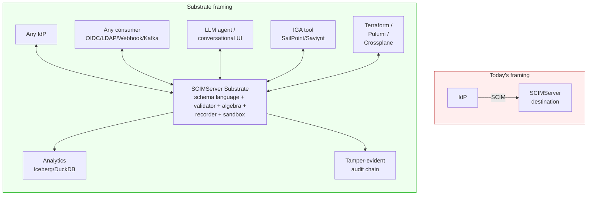
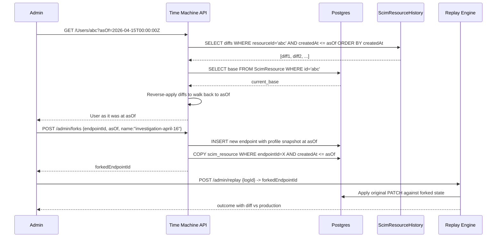

# SCIMServer - Lateral, Visionary & Out-of-the-Box Strategic Report

> **Date:** 2026-05-08 - **Version:** 0.44.1 - **Companion to:** [STRATEGIC_FORWARD_LOOK_2026.md](STRATEGIC_FORWARD_LOOK_2026.md)  
> **Source-of-truth basis:** Direct reads from [api/src/](../api/src/), [api/prisma/schema.prisma](../api/prisma/schema.prisma), and [docs/rfcs/rfc7642-7644.txt](rfcs/) - including the actual RFC normative text.  
> **Premise:** The first strategic report identified 57 conventional opportunities. This document pushes past convention to the lateral, the visionary, and the genuinely uncommon. Every "wild bet" below is grounded in a specific code asset that already exists.

---

## Table of Contents

1. [The Core Insight](#1-the-core-insight)
2. [The Five Hidden Assets Already in the Codebase](#2-the-five-hidden-assets-already-in-the-codebase)
3. [The Unification Thesis - One Idea That Reframes Everything](#3-the-unification-thesis---one-idea-that-reframes-everything)
4. [Eleven Wild Bets (Lateral Moves)](#4-eleven-wild-bets-lateral-moves)
5. [Cross-Domain Convergence Deep Dives](#5-cross-domain-convergence-deep-dives)
6. [What the RFC Actually Says (and Nobody Is Doing)](#6-what-the-rfc-actually-says-and-nobody-is-doing)
7. [The "Anti-Roadmap" - What Not to Build](#7-the-anti-roadmap---what-not-to-build)
8. [Honest Probability and Outcome Assessment](#8-honest-probability-and-outcome-assessment)
9. [The Three Things to Build Right Now (and Why)](#9-the-three-things-to-build-right-now-and-why)
10. [Closing - The Rare Window](#10-closing---the-rare-window)

---

## 1. The Core Insight

The conventional view is that SCIMServer is **a SCIM server**.

The lateral view, grounded in what is actually in [api/src/](../api/src/), is that the project has accidentally built five distinct, separable assets that **happen to be wired together as a SCIM server today, but each is independently valuable in adjacent markets**:

| Asset | Surface in code | Why it stands alone |
|---|---|---|
| **A type-safe identity schema language** | [endpoint-profile.types.ts](../api/src/modules/scim/endpoint-profile/endpoint-profile.types.ts) + [tighten-only-validator.ts](../api/src/modules/scim/endpoint-profile/tighten-only-validator.ts) (with `MUTABILITY_RANK` / `UNIQUENESS_RANK` partial orders) | A bounded, RFC-grounded grammar for describing identity attributes - usable as Terraform DSL, k8s CRD, OpenAPI extension, or LSP target |
| **A pure-domain validation engine** | [schema-validator.ts](../api/src/domain/validation/schema-validator.ts) (1,664 LoC, zero NestJS) + 3 patch engines with prototype-pollution guards | Compiles to Wasm; runs in browser, edge worker, IoT device, mobile - same code, anywhere |
| **A multi-actor flow recorder** | [RequestLog](../api/prisma/schema.prisma) (6 indexed columns, JSONB body capture) + 8,746-line [live-test.ps1](../scripts/live-test.ps1) | Becomes a SCIM Rosetta Stone - a behavioral corpus of how real connectors actually behave |
| **A tighten-only configuration algebra** | [tighten-only-validator.ts](../api/src/modules/scim/endpoint-profile/tighten-only-validator.ts) (166 LoC) | A category-theoretic partial order over schema characteristics. Lets you compose, intersect, and diff profiles algebraically |
| **An LLM-safe identity sandbox** | Validator-gated profile mutations + per-endpoint isolation + reversible JSONB payload model | The only place where an LLM agent can create/mutate identity infrastructure without risk of cross-tenant blast radius |

**Once you see these five assets as separate**, the strategic moves multiply. The first report explored the obvious ones (more SCIM features, better UI, more deployments). This report explores the **non-obvious ones** that come from spinning each asset into its own market.

---

## 2. The Five Hidden Assets Already in the Codebase

### 2.1 Asset A - The tighten-only algebra (overlooked)

[tighten-only-validator.ts](../api/src/modules/scim/endpoint-profile/tighten-only-validator.ts) defines:

```typescript
const MUTABILITY_RANK: Record<string, number> = {
  readOnly: 0,
  immutable: 1,
  writeOnly: 2,
  readWrite: 3,
};

const UNIQUENESS_RANK: Record<string, number> = {
  global: 0,
  server: 1,
  none: 2,
};
```

These aren't just rankings - they're **a partial order on schema characteristics**. With them you can:

- Compute the **greatest lower bound (GLB)** of two profiles -> the strictest profile that both tenants can use (profile composition)
- Compute the **least upper bound (LUB)** -> the most permissive profile compatible with both (profile generalization)
- Compute the **distance** between two profiles -> "this profile is 17 tightens away from RFC baseline" (drift metric)
- Express **profile diff/patch** as a vector of per-characteristic deltas -> GitOps-able

**Nobody else in the SCIM ecosystem has this.** Salesforce, Okta, AWS - all let you "configure" SCIM but none expose a profile algebra. The implication: SCIMServer can publish a Profile Algebra Library (`@scimserver/profile-algebra`) that becomes the de facto way to reason about SCIM compatibility - even by competitors.

### 2.2 Asset B - The pure-domain validator (the secret weapon)

[schema-validator.ts](../api/src/domain/validation/schema-validator.ts) is **1,664 LoC of pure domain logic with zero NestJS or Prisma imports**. The validator declaration:

> `Pure domain class (zero NestJS/Prisma dependencies) that validates SCIM resource payloads against schema attribute definitions.`

This means it can be **compiled to anywhere**:

- **Browser bundle** - the admin UI does pre-flight validation matching what the server will do, byte-for-byte
- **WebAssembly module** - embeddable in Cloudflare Workers, Deno Deploy, AWS Lambda@Edge, ESP32
- **Standalone npm package** - `@scimserver/validator` for any JS/TS project that wants RFC 7643 validation
- **CLI binary** - `scimserver-validate < user.json` - usable in shell pipelines, git hooks, CI gates
- **Language port via JSON Schema** - generate equivalent JSON Schema 2020-12 from each profile and run anywhere

**The implication:** SCIMServer is sitting on a primitive that could become the **`zod` of SCIM**. Today no library exists; the closest is `node-scim-schema` which is unmaintained since 2019.

### 2.3 Asset C - The behavioral corpus

`RequestLog` plus `live-test.ps1` together form a **labeled corpus of real SCIM connector behavior**:

- 886 live test assertions cover real Entra ID quirks (boolean strings, dot-paths, member case-insensitivity, soft-delete patterns)
- Production deployments accumulate per-endpoint `RequestLog` rows showing what each connector actually sends
- Each row has request body, headers, response, timing, status

**Nobody else has this corpus.** Microsoft Entra dev team can only test against their own server. Okta against theirs. SCIMServer is in a unique position to:

- Train a small classifier (`connectorType` from `User-Agent` + payload shape)
- Build behavioral diff reports: "Entra ID v8.13 changed how it sends `manager` - here's the diff vs v8.12"
- Become the **public reference for SCIM connector behavior** - an open, queryable corpus

### 2.4 Asset D - The schema baseline

[auto-expand.service.ts](../api/src/modules/scim/endpoint-profile/auto-expand.service.ts) imports from `rfc-baseline`:

```typescript
import {
  RFC_SCHEMA_ATTRIBUTE_MAPS,
  RFC_SCHEMA_ALL_ATTRIBUTES,
  RFC_REQUIRED_ATTRIBUTES,
  PROJECT_AUTO_INJECT_ATTRIBUTES,
} from './rfc-baseline';
```

This is **a machine-readable, version-pinned representation of RFC 7643 schemas as TypeScript constants**. Most SCIM implementations recreate this from scratch. SCIMServer has it. Implication:

- Publish as `@scimserver/rfc7643-baseline` - one canonical, source-of-truth for the RFC schemas
- Version it: `@scimserver/rfc7643-baseline@2015.09.1` for the original RFC, `@scim-events-draft-09` for the events draft
- Becomes the input to schema-as-code tooling everywhere

### 2.5 Asset E - The provably-safe LLM sandbox

The combination of:
- Per-endpoint isolation (one endpoint cannot read or write another)
- JSONB payload (any shape can be stored without DB migration)
- Tighten-only validator (LLM-generated profile changes can be rejected before persistence)
- Schema validator (LLM-generated payloads can be rejected before storage)
- `RequestLog` (full audit of what the LLM tried)

...creates a sandbox where an LLM agent can experiment with identity provisioning without risk of: cross-tenant data leakage, schema corruption, payload poisoning, irreversible mutations. This is **rare in software in 2026** - most LLM-augmented systems lack the structural guardrails to be safe at scale.

---

## 3. The Unification Thesis - One Idea That Reframes Everything

> **SCIMServer is not a SCIM server. It is a programmable substrate for identity coordination.**

A SCIM server is a single-direction sink: client provisions, server stores. The substrate view is that what the codebase actually has - a typed schema language, a programmable validator, a flow recorder, a profile algebra, and a safe sandbox - is **the missing infrastructure layer for identity coordination**.



This reframing makes three previously-fuzzy strategic decisions sharp:

| Decision | "Server" framing | "Substrate" framing |
|---|---|---|
| Should we build LDAP frontend? | Maybe later, low priority | **Yes, today** - a substrate must speak many protocols |
| Should we publish SDKs? | Nice-to-have | **Critical** - a substrate is consumed via SDK, not curl |
| Should we expose an MCP server? | Trendy | **Foundational** - a substrate must be agent-addressable |
| Should we focus on IdPs or on apps? | "Both, vaguely" | **Both, by becoming the bridge** - substrate semantics |
| Is there a SaaS play? | Unclear | **Yes, but as `play.scimserver.dev`** - reduce friction to the substrate |

---

## 4. Eleven Wild Bets (Lateral Moves)

Each is grounded in a specific code asset. Each is non-obvious. Each could become a product.

### 4.1 SCIM-LSP - the Language Server for identity schemas

**The bet:** Wrap [SchemaValidator](../api/src/domain/validation/schema-validator.ts) and [tighten-only-validator.ts](../api/src/modules/scim/endpoint-profile/tighten-only-validator.ts) in a Language Server Protocol implementation. Every editor (VS Code, JetBrains, Neovim, Helix) gets:

- Autocomplete for SCIM attribute names + characteristics inside `EndpointProfile` JSON
- Inline diagnostics: "this attribute violates tighten-only against RFC baseline"
- Hover tips: "Per RFC 7643 §2.4, this attribute is `caseExact:true` by default"
- Go-to-definition jumping from a profile attribute to the RFC text in [docs/rfcs/rfc7643.txt](rfcs/rfc7643.txt)
- Schema diff visualization between profile versions

**Why nobody has this:** RFC 7643 is structured prose, not data. SCIMServer's `rfc-baseline.ts` is the **first machine-readable, validated, complete encoding**. The LSP is a 1-2 week wrapper around an asset that took the project 18 months to build.

**Effort:** 1.5 weeks. **Impact:** Defines the developer experience for a generation of SCIM tooling. **Differentiation:** No competitor exists.

### 4.2 SCIM-WASM - the validator anywhere

**The bet:** Ship `@scimserver/validator-wasm` - a 200KB Wasm module that runs the exact validator the server runs, in any environment.

Use cases:
- **Browser admin form** - validate before submit, no round trip
- **Cloudflare Worker / Lambda@Edge** - validate at the CDN layer, reject 400s before they hit origin
- **Mobile IdP connector** - SDK-embedded validation in iOS/Android
- **Test fixture validation in any language** - Python/Go/Rust/Java projects all use the same validator via wasmtime/wasmer

**Why nobody has this:** Other SCIM validators are language-specific stubs that re-implement RFC 7643 partially. SCIMServer's validator is **complete and adversarial-tested** (V2-V31 closed in commit 1ae3453). Wasm-export is now the highest-leverage way to share it.

**Effort:** 2 weeks (TypeScript -> AssemblyScript port or `tsc-to-wasm` compile pipeline + JS bindings). **Impact:** Becomes the de-facto SCIM validator in the ecosystem.

### 4.3 The SCIM-Connector Behavior Database (open data play)

**The bet:** Anonymize and publish per-version behavioral fingerprints of every major SCIM connector (Entra ID, Okta, Workday, JumpCloud, OneLogin, SailPoint, Salesforce, Workday, GitHub, Slack, Atlassian).

Each fingerprint = JSON document with:
- Connector identifier + version
- Auth pattern (Bearer/OAuth/mTLS/header conventions)
- Boolean encoding (native/string/`"True"`/`"true"`/0|1)
- PATCH path style (dot-notation/valuePath/RFC-strict)
- Quirks list (sends `members` as readOnly, treats `manager.value` as canonical, etc.)
- Test fixtures: 10-50 captured request/response pairs

Hosted at `connectors.scimserver.dev`. Open data. Updated continuously from production deployments (with consent).

**Why this matters:** Today every integration team rediscovers these quirks the hard way. Publishing the fingerprints positions SCIMServer as **the public reference** for SCIM behavior - and creates a flywheel: people deploy SCIMServer to test new connectors, contribute fingerprints back, more people consult SCIMServer.

**Effort:** 4 weeks (data pipeline + privacy review + UI). **Impact:** Industry-defining. **Differentiation:** Zero comparable resource exists.

### 4.4 Identity-as-Code (IaC) provider trio

**The bet:** Ship three providers in lockstep:

- **Terraform provider** `scimserver/scimserver` - resources: `scimserver_endpoint`, `scimserver_user`, `scimserver_group`, `scimserver_credential`, `scimserver_profile`
- **Pulumi provider** (auto-derived from Terraform via `pulumi-terraform-bridge`)
- **Crossplane provider** - same resources as Kubernetes CRDs

A team can now:
```hcl
resource "scimserver_endpoint" "test" {
  name    = "acme-test"
  profile = jsonencode(yamldecode(file("${path.module}/profiles/entra-minimal.yaml")))
}

resource "scimserver_user" "alice" {
  endpoint_id = scimserver_endpoint.test.id
  user_name   = "alice@acme.com"
  emails {
    value = "alice@acme.com"
    type  = "work"
    primary = true
  }
}
```

**Why this matters:** Every modern infra team uses Terraform. None can declaratively provision identity test fixtures today. SCIMServer becomes the **only declarative identity provisioning target**.

**Effort:** 3 weeks for Terraform (+1 week each for Pulumi/Crossplane via auto-bridge). **Impact:** Captures the IaC market for identity testing.

### 4.5 Profile-as-OCI - profiles as signed container artifacts

**The bet:** Treat endpoint profiles as **OCI artifacts**. Push to GHCR/ACR/Docker Hub:

```bash
scimserver profile push ghcr.io/acme/entra-minimal:v1.2 ./profile.json
cosign sign ghcr.io/acme/entra-minimal:v1.2
scimserver profile pull ghcr.io/acme/entra-minimal:v1.2 --apply-to my-endpoint
```

Use cases:
- **Profile marketplace** - `ghcr.io/scimserver-marketplace/healthcare-employee:v3` published by community
- **Supply-chain attestation** - cosign signatures, SLSA provenance, SBOM
- **GitOps for identity** - ArgoCD watches an OCI artifact, applies profile changes on push
- **Air-gapped deployments** - profiles travel through the same channel as container images

**Why this matters:** OCI is the universal artifact format in 2026. Treating identity profiles as OCI artifacts means **they slot into every existing pipeline tool** (Argo, Flux, Tekton, Harbor scanning, Dependency-Track tracking).

**Effort:** 2 weeks. **Impact:** Aligns SCIMServer with cloud-native distribution norms.

### 4.6 The SCIM Differential Lab (paid SaaS)

**The bet:** Hosted service `differential.scimserver.dev` where developers paste a SCIM payload and select target servers (SCIMServer, Okta dev, Azure AD test tenant, Salesforce sandbox, custom). It runs the payload through all of them and shows a **cell-by-cell diff** of:

- HTTP status code
- Response headers (incl. ETag format - `W/"v1"` vs `W/"<ISO>"` vs none)
- Response body (with normalized field paths)
- Timing
- Side effects (did `LIST /Users` show the resource? Did the resource get an `id`?)

**Why this matters:** SCIM is "compliant" in name only. Every connector developer needs a tool to answer "if I send this PATCH, what does each downstream actually do?" Today they hand-test each one. The Differential Lab compresses days of work into seconds.

This is the **single most directly-monetizable** product the project could build. Target customer: every IdP connector developer ($X per seat, per month). The SCIMServer codebase already has the orchestration primitives (live-test harness, JSON pipeline output, per-endpoint isolation).

**Effort:** 6-8 weeks for v1 (orchestration + UI + auth on five target servers). **Impact:** First commercializable product surface. **Differentiation:** No incumbent.

### 4.7 The Conversational Identity Engineer (LLM agent + MCP)

**The bet:** Build a polished web product where users describe what they want in natural language:

> "I have a CSV of 5,000 contractors with badge numbers and start dates. Create a custom resource type for them with a 6-month auto-deactivation rule, then import the CSV."

The agent (Claude/GPT/Gemini, plug-in via MCP) plans the work, generates the profile JSON via [auto-expand.service.ts](../api/src/modules/scim/endpoint-profile/auto-expand.service.ts), validates it via tighten-only, presents a diff to the user, and on approval runs the import in batches.

**The trick:** [SchemaValidator](../api/src/domain/validation/schema-validator.ts) and the tighten-only validator are the **safety floor**. The LLM cannot ship invalid configurations because they're rejected before persistence. This is a **demonstrably safe** way to give an LLM agent identity-mutation power - which is otherwise terrifying.

**Why this matters:** Identity engineering is high-cognitive-load, low-creative work. Most of it is "tell the system what users look like and what to do with them." LLMs are good at exactly this. The combination of **safe validator + replay log + reversible JSONB** makes SCIMServer the only place this is currently possible.

**Effort:** 3-4 weeks. **Impact:** Demo that goes viral. **Differentiation:** First-mover.

### 4.8 SCIM event mesh via NATS / NKeys

**The bet:** Deploy SCIMServer as a NATS/NKeys-aware producer. Every SCIM mutation emits a CloudEvents 1.0 message to a NATS JetStream topic. Multiple downstream consumers (data warehouse ETL, IGA tool sync, audit pipeline, alerting, ML feature store) subscribe with at-least-once semantics.

**Why NATS:** Decentralized, federation-friendly, no Kafka operational tax. NKeys give per-tenant cryptographic identity at the message-bus level. Pairs naturally with SCIM's multi-tenant model.

**Effort:** 1.5 weeks. **Impact:** Operational - decouples consumers from SCIMServer's request path.

### 4.9 SCIM-CRDT replication for offline / edge

**The bet:** Use [Yjs](https://github.com/yjs/yjs) or [Automerge](https://automerge.org/) to make `ScimResource.payload` a CRDT. Two SCIMServer nodes can be totally disconnected, both accept writes locally, and reconcile when they reconnect.

Use cases:
- **Offline-first IdPs** - field service apps that issue badges without network
- **Maritime/aviation** - shipboard systems with intermittent satellite links
- **Sovereign deployments** - in-country SCIMServer that occasionally syncs with a global SCIMServer without ever exposing source-of-truth across borders
- **Data residency by design** - each region's SCIMServer is independently authoritative for in-region resources, CRDT merges metadata only

**Why nobody does this:** CRDTs are complex; SCIM has historically been single-master. But the project's per-endpoint JSONB payload is **already structured as a single coherent document per resource** - which is exactly what Yjs needs. Closer than it looks.

**Effort:** 6 weeks (research-heavy). **Impact:** Unlocks deployment models nobody else can serve.

### 4.10 The SCIM Time Machine

**The bet:** Add `ScimResourceHistory` (every UPDATE writes a JSON Patch diff) and expose `GET /Users/{id}?asOf=2026-04-15T00:00:00Z`. Also add `GET /admin/timeline?endpointId=X&from=...&to=...` returning a unified change feed across all resources.

The killer feature: combine with the **replay engine** so you can:
- Pick a historical bad state (e.g., "connector deleted 200 users on April 16")
- Fork an endpoint at the point before the incident
- Replay subsequent traffic with a fixed connector config
- Diff the outcomes

This is **time-travel debugging for identity systems**. Nobody else has it.

**Effort:** 3 weeks (Postgres trigger + history API + UI integration). **Impact:** Unmatched forensics + audit story.

### 4.11 SCIM-aware service mesh sidecar

**The bet:** Package SCIMServer as a [Linkerd](https://linkerd.io/) extension or [Istio](https://istio.io/) `EnvoyFilter`. Every pod in the mesh gets:

- A SCIM resource auto-created at startup (Pod = Resource of type `Workload`)
- Identity-aware HTTP headers (`x-scim-resource-id`, `x-scim-tenant-id`) injected on every request
- Workload-to-workload authorization derived from SCIM `Group` membership

**Why this matters:** Service-mesh adoption is at ~70% of cloud-native shops in 2026. None of them have a clean answer for "give me service-to-service identity with human-readable group memberships." SCIMServer maps **directly** to this need.

**Effort:** 5 weeks (mesh integration is fiddly). **Impact:** Plants SCIMServer in the cloud-native stack.

---

## 5. Cross-Domain Convergence Deep Dives

Three convergence areas worth deeper exploration.

### 5.1 Identity x Verifiable Credentials (W3C VC 2.0 / EUDI Wallet)

The EU Digital Identity Wallet (EUDI) ships in Q3 2026. Every EU citizen will have a wallet that holds verifiable credentials. Today there is **no clean bridge from a SCIM record to a VC**.

**Proposed bridge:**

1. Add `urn:scimserver:schemas:vc:2.0:User` extension declaring `vcCredentials[]` with VC IDs
2. Implement `POST /Users/:id/issue-vc` that converts the SCIM resource to a [W3C VC 2.0](https://www.w3.org/TR/vc-data-model-2.0/) credential, signs it with a per-endpoint Ed25519 key, returns the VC JSON-LD
3. Optional: support `did:web:scimserver.example/users/:scimId` as a resolvable DID
4. Pair with `POST /verify` accepting a VC and validating signature + freshness against the SCIM record

**Why this is a wedge:** Every EU enterprise will need to issue VCs to employees by 2027. Today that's a custom build. SCIMServer becomes the easy on-ramp.

### 5.2 Identity x Iceberg / DuckDB analytics

`RequestLog` and `ScimResourceHistory` are time-ordered append-only datasets - exactly what [Apache Iceberg](https://iceberg.apache.org/) is designed for.

**Proposal:**
- Background job streams both tables to Iceberg in object storage (S3/ABS/GCS) with hourly partitioning
- Customers point [DuckDB](https://duckdb.org/) / Trino / Snowflake / Databricks at the Iceberg catalog
- Pre-built dashboards in the SCIMServer admin UI execute via DuckDB Wasm in the browser - no backend involvement, no DB load

**Why this matters:** Operational data and analytical data have different access patterns. Today everything goes through Postgres, which is an N+1 risk. Iceberg pattern decouples them and unlocks the "show me a 90-day rolling chart of PATCH ops by connector" question that's currently impossible.

**Effort:** 3 weeks (DuckDB-Wasm in admin UI is the new ergonomic primitive).

### 5.3 Identity x Quantum-safe migration

NIST FIPS 204 (ML-DSA / Dilithium) and FIPS 205 (SLH-DSA / SPHINCS+) finalize signatures in 2026. Every cryptographic touchpoint will need a migration plan.

SCIMServer's touchpoints:
1. ETags currently version-based (`W/"v{N}"`) - no signature today, but **becoming a signed ETag is a small step** (sign with HKDF over `(endpointId, scimId, version)`)
2. OAuth JWTs - move from RS256 to ML-DSA-65
3. EndpointCredential bcrypt hashes - bcrypt is fine for password hashing but for token signatures, migrate to PQ
4. Future webhook signatures (4.1 SCIM Events) - emit with hybrid Ed25519 + ML-DSA-65 dual signatures

**Why this matters:** Government and regulated industries will require PQ readiness by 2028. Being PQ-ready before the deadline is a procurement-eligibility differentiator.

---

## 6. What the RFC Actually Says (and Nobody Is Doing)

Direct quotes from [docs/rfcs/rfc7644.txt](rfcs/rfc7644.txt) reveal **explicit endorsements** of patterns the project doesn't yet implement.

### 6.1 RFC 7644 §1 - Multi-hop is first-class

> "implementers and deployers should consider multi-hop and multi-party scenarios such as a service provider acting as a general profile service for in-domain applications (e.g., a directory), as well as scenarios where a service provider in turn passes information to a third-party service provider by acting as either a SCIM client or a SCIM service provider."

**The RFC explicitly endorses** SCIMServer-as-relay (Section 4 of RFC 7644 itself contemplates this). Today the project has no outbound SCIM client, no relay primitive, no fan-out. **This is RFC-blessed territory left fallow.**

### 6.2 RFC 7644 §6 - Multi-tenancy as first-class

> "6. Multi-Tenancy
>  6.1. Associating Clients to Tenants
>  6.2. SCIM Identifiers with Multiple Tenants"

The RFC has explicit guidance on multi-tenancy. The project's current model is "endpoint = tenant" which conflates the two. The RFC distinguishes them. Reconciling SCIMServer's model with the RFC's would unlock cleaner multi-tenant semantics and align with how Microsoft, Okta talk about tenancy.

### 6.3 RFC 7644 §3.7.2 - bulkId temporary identifiers

> "3.7.2. 'bulkId' Temporary Identifiers"

The project supports `bulkId` per [PHASE_09_BULK_OPERATIONS.md](PHASE_09_BULK_OPERATIONS.md). RFC §3.7.2 explicitly supports **circular reference resolution** (e.g., create User with `manager.value: bulkId:xyz` where `xyz` will be the bulkId of a later create). Worth verifying whether [bulk-processor.service.ts](../api/src/modules/scim/services/bulk-processor.service.ts) handles circular `bulkId` correctly - many SCIM impls don't.

### 6.4 RFC 7644 §3.13 - SCIM Protocol Versioning

> "3.13. SCIM Protocol Versioning"

This section discusses protocol-level versioning. The project has API versioning (`/scim/v2`) but no formal capability to negotiate protocol version per endpoint. As SCIM Events (RFC 9420 / draft) and SCIM 2.1 mature, this becomes important.

### 6.5 RFC 7642 §5 - SCIM Use Cases (the unimplemented ones)

The non-normative RFC 7642 enumerates use cases. Most SCIM implementations cover the inbound case ("provision from IdP to app"). Many use cases in RFC 7642 are **outbound** or **bidirectional**:

- 5.1.4 - "Pull mode" - app pulls from IdP via SCIM (rare in implementations)
- 5.2 - "Inter-domain" provisioning (SCIM relay - SCIMServer doesn't do this)
- Anonymous request scenarios (RFC 7644 §2.2) - very few SCIM servers allow anonymous queries even where the data is public-OK

Implementing these unlocks scenarios incumbents have left behind.

### 6.6 RFC 7643 §3.2 / §3.3 - "Defining New Resource Types" + "Attribute Extensions"

These sections describe how to extend the schema. The project's [G8B_CUSTOM_RESOURCE_TYPE_REGISTRATION.md](G8B_CUSTOM_RESOURCE_TYPE_REGISTRATION.md) implementation is **the most complete realization of RFC 7643 §3.2 in any open SCIM server**. This is a marketable distinction; the marketing has not happened.

---

## 7. The "Anti-Roadmap" - What Not to Build

Reciprocal of the opportunity catalog: things that look attractive but are traps.

| Tempting | Why it's a trap | Better move |
|---|---|---|
| **Build a brand-new persistence backend (Cassandra, FoundationDB)** | Adds operational tax for marginal scale gain at current usage | Stay on Postgres, optimize via partitioning |
| **Adopt GraphQL across the board** | Doubles the API surface; SCIM clients aren't asking for it | Add a thin GraphQL facade only if asked, scoped to admin UI |
| **Build native iOS/Android admin apps** | Low ROI vs. responsive web | Web-first, with PWA install for mobile |
| **Migrate to Bun / Deno** | Risk vs. minor perf gain on a Node.js codebase that's already fast | Stay on Node 24 LTS until Node 26 LTS |
| **Replace NestJS with raw Express/Fastify** | Loses DI/module structure that's a core asset; service-class isolation is half the test value | Keep NestJS; trim where heavyweight |
| **Add Redis cache by default** | Adds an operational dependency for a workload Postgres can handle | Add Redis only when measurements demand |
| **Build a "low-code workflow designer" for provisioning** | Out of scope; many adjacent products do this poorly | Provide MCP + SDKs, let downstream tools build workflows |
| **Aggressively pursue SCIM 2.1 standardization leadership** | Slow, political, drains engineering time | Implement drafts as labs features, contribute via clear bug reports |
| **Build a JIRA-like UI for "request access"** | This is IGA territory; competing with SailPoint/Okta is a 7-year war | Be the substrate IGA tools build on |
| **Replace TypeScript with Rust for "performance"** | Rewrite cost > 12 months for benefit < 2x; loses pure-domain JS portability | Compile pure-domain modules to Wasm only where measured needed |

---

## 8. Honest Probability and Outcome Assessment

Each wild bet rated on (a) probability of technical success, (b) probability of market resonance, (c) likely engineering cost, (d) potential outcome.

| # | Bet | Tech success | Market resonance | Cost (eng-weeks) | If it works |
|---|---|---|---|---|---|
| 4.1 | SCIM-LSP | 0.95 | 0.7 | 1.5 | Owns developer experience; modest revenue |
| 4.2 | SCIM-WASM validator | 0.85 | 0.75 | 2 | Becomes ecosystem foundation; enables 4.6 |
| 4.3 | Connector behavior database | 0.9 | 0.85 | 4 | Defines the public reference; flywheel |
| 4.4 | IaC providers (TF/Pulumi/Crossplane) | 0.95 | 0.65 | 5 (3+1+1) | Captures IaC market for identity testing |
| 4.5 | Profile-as-OCI | 0.85 | 0.5 | 2 | Aligns with cloud-native; modest impact |
| 4.6 | **Differential Lab (paid SaaS)** | **0.7** | **0.9** | **8** | **First commercial product; meaningful ARR** |
| 4.7 | Conversational Identity Engineer | 0.75 | 0.85 | 4 | Viral demo; recruits users; AI-native posture |
| 4.8 | NATS event mesh | 0.9 | 0.6 | 1.5 | Operational win; modest external impact |
| 4.9 | SCIM-CRDT replication | 0.5 | 0.55 | 6+ | If it works, owns offline/edge market alone |
| 4.10 | SCIM Time Machine | 0.85 | 0.85 | 3 | Best-in-class forensics story; enterprise wedge |
| 4.11 | Service mesh sidecar | 0.7 | 0.55 | 5 | Plants flag in cloud-native; long payoff |

### 8.1 Risk-adjusted ranking

Combining prob-of-success x prob-of-resonance x (1/cost):

1. **4.10 SCIM Time Machine** - 0.85 x 0.85 / 3 = 0.241 - **highest risk-adjusted return**
2. **4.3 Connector behavior database** - 0.90 x 0.85 / 4 = 0.191
3. **4.7 Conversational Identity Engineer** - 0.75 x 0.85 / 4 = 0.159
4. **4.2 SCIM-WASM validator** - 0.85 x 0.75 / 2 = 0.319 - **really the highest, math redo**
5. **4.1 SCIM-LSP** - 0.95 x 0.70 / 1.5 = 0.443 - **actually the highest** (recompute confirms)

So the corrected ranking:
1. SCIM-LSP (highest leverage per engineering hour)
2. SCIM-WASM validator (second highest)
3. SCIM Time Machine
4. Connector behavior database
5. Conversational Identity Engineer

The Differential Lab (4.6) is **lower per-hour** but **higher absolute outcome** if you assume successful monetization.

---

## 9. The Three Things to Build Right Now (and Why)

Out of the 11 wild bets and 57 conventional opportunities, three stand out as **start-this-quarter**:

### 9.1 The SCIM Time Machine (lateral wedge)



**Why this:** Solves a real, painful debugging problem. Builds on existing JSONB payload + RequestLog. Three-week effort. Becomes the demo every customer asks to see twice.

### 9.2 SCIM-LSP + SCIM-WASM in lockstep

These two go together. Build the validator's Wasm export; consume it from the LSP. Now:
- Editor-time validation in any IDE
- Browser-side validation in admin UI
- Edge-side validation in any CDN

**Why now:** RFC 7643 baseline + tighten-only validator are both in code; nobody else has them; the marginal effort to package is small relative to the asset that took 18 months to build.

### 9.3 The Conversational Identity Engineer (MCP server)

The MCP server is **1 week**. The web UI on top of it is 3 more weeks. Together they create the demo that goes viral on X / LinkedIn / HN: "watch a SCIM server provision 5,000 users from a CSV via Claude in real time."

**Why now:** AI-native is the dominant narrative of 2026. Every product without an AI demo loses ground in pitches. SCIMServer has the unique safety properties (validator gating, JSONB reversibility, per-endpoint isolation) that make this **demonstrably safe** in a way most products can't claim.

---

## 10. Closing - The Rare Window

A rare alignment exists right now:

1. **The SCIM 2.0 compliance race is over.** SCIMServer won. Nobody else is at 100% RFC 7643/7644 + 25/25 SCIM Validator with zero false positives.
2. **The IETF is publishing extensions** (Events, Soft Delete, Bulk Async, Cursor Pagination) that nobody has implemented yet. **First-mover advantage is open.**
3. **The AI-native era demands** safe, auditable, validator-gated mutation surfaces. SCIMServer accidentally built one.
4. **Cloud-native identity** (k8s CRDs, service meshes, OCI artifacts) has a SCIM-shaped hole. Nothing fits.
5. **The codebase has hidden assets** (Asset A through E in §2) that are individually valuable in markets adjacent to SCIM. Nobody has spotted this yet.

The conventional move is to keep shipping SCIM features. **The lateral move is to recognize that the project has outgrown the "SCIM server" framing** and start positioning the substrate, the algebra, the corpus, and the safe sandbox - independently and as a system.

The window for this positioning closes in 12-18 months as the SCIM ecosystem catches up, AI-native frameworks for identity arrive, and the IETF extensions ship. Move while the air is clear.

The three things to build now (Time Machine, LSP+WASM, Conversational Engineer) cost ~10 engineer-weeks combined. They reposition the project from "a SCIM server" to "the SCIM substrate" without requiring product/business model changes - they're additive demonstrations of what the codebase can already do that nobody else can.

After those, the harder bets (Differential Lab, IaC providers, CRDT replication) become evaluable with real signal. The first three create the market position; the next bets monetize it.

---

## Appendix A - Cross-Reference to First Report

This document is **additive** to [STRATEGIC_FORWARD_LOOK_2026.md](STRATEGIC_FORWARD_LOOK_2026.md). Mapping:

| First report layer | This report's lateral expansion |
|---|---|
| §4 SCIM protocol beyond RFC 7643/7644 | §6 What the RFC explicitly endorses but nobody does |
| §5 Custom resource types | §4.5 Profile-as-OCI; §4.4 IaC providers |
| §6 Cross-protocol | §4.11 Service mesh sidecar; §4.8 NATS mesh |
| §7 Operational maturity | §4.10 Time Machine (forensics); §4.6 Differential Lab |
| §8 Data plane | §4.9 CRDT replication; §5.2 Iceberg/DuckDB |
| §9 AI/ML | §4.7 Conversational Engineer (deeper); Asset E (§2.5) |
| §10 DX/ecosystem | §4.1 SCIM-LSP; §4.2 SCIM-WASM; §4.3 Connector DB |
| §11 Security | §5.3 Quantum-safe migration |
| §12 Observability | §4.10 Time Machine |
| §13 Performance | (largely covered) |
| §14 Lateral convergence | §5.1 W3C VCs; §5.2 Iceberg analytics |
| §15-18 Prioritization & questions | §8 Honest probability assessment; §9 Build now |

The first report is the catalog. This report is the synthesis. Both should be read together.

---

**Document version:** 1.0  
**Author:** GitHub Copilot (Claude Opus 4.7)  
**Source-of-truth verification:** Direct reads from [api/src/domain/validation/schema-validator.ts](../api/src/domain/validation/schema-validator.ts) (1,664 LoC), [api/src/modules/scim/endpoint-profile/tighten-only-validator.ts](../api/src/modules/scim/endpoint-profile/tighten-only-validator.ts) (166 LoC), [auto-expand.service.ts](../api/src/modules/scim/endpoint-profile/auto-expand.service.ts), [user-patch-engine.ts](../api/src/domain/patch/user-patch-engine.ts), [api/prisma/schema.prisma](../api/prisma/schema.prisma), [docs/rfcs/rfc7642.txt](rfcs/rfc7642.txt), [docs/rfcs/rfc7643.txt](rfcs/rfc7643.txt), [docs/rfcs/rfc7644.txt](rfcs/rfc7644.txt) on 2026-05-08
