# Technical Design Document

> **Version:** 0.38.0 - **Updated:** April 24, 2026  
> As-built architecture documentation derived from source code

---

## Table of Contents

- [System Architecture](#system-architecture)
- [Module Structure](#module-structure)
- [Domain Layer](#domain-layer)
- [Infrastructure Layer](#infrastructure-layer)
- [Request Lifecycle](#request-lifecycle)
- [Data Model](#data-model)
- [Multi-Tenant Isolation](#multi-tenant-isolation)
- [Profile Engine](#profile-engine)
- [Schema Validation Engine](#schema-validation-engine)
- [PATCH Engine Architecture](#patch-engine-architecture)
- [Filter & Sort Engine](#filter--sort-engine)
- [Authentication Architecture](#authentication-architecture)
- [Logging Architecture](#logging-architecture)
- [Error Handling Architecture](#error-handling-architecture)
- [Technology Stack](#technology-stack)

---

## System Architecture

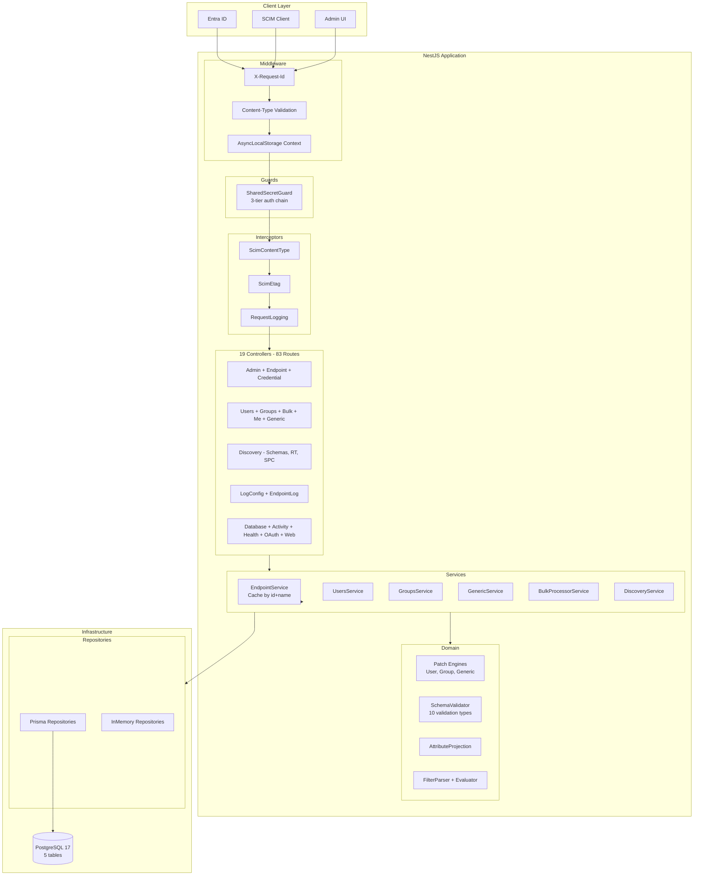

---

## Module Structure

The NestJS application is composed of 11 modules:

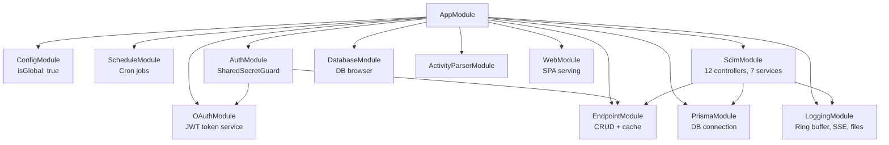

### ScimModule Internals

The largest module registers:

- **12 controllers** (EndpointScimGenericController registered LAST to avoid path shadowing)
- **7 services** (Users, Groups, Generic, Bulk, Discovery, Metadata, SchemaRegistry)
- **2 global filters** (GlobalExceptionFilter, ScimExceptionFilter)
- **2 global interceptors** (ScimContentTypeInterceptor, ScimEtagInterceptor)
- **2 middleware** (EndpointContextStorage on all routes, ContentTypeValidation on endpoint routes)

---

## Domain Layer

Pure business logic with zero NestJS/Prisma dependencies:

```
api/src/domain/
+-- patch/
|   +-- user-patch-engine.ts       # User PATCH logic (454 lines)
|   +-- group-patch-engine.ts      # Group PATCH logic (372 lines)
|   +-- generic-patch-engine.ts    # Custom resource PATCH (shares user engine)
|   +-- patch-types.ts             # PatchOperation, PatchConfig, PatchResult
|   +-- patch-error.ts             # Typed PATCH errors
+-- validation/
|   +-- schema-validator.ts        # 10 validation types (1,664 lines)
|   +-- validation-types.ts        # Validation options and results
+-- models/
|   +-- user.model.ts              # User domain model
|   +-- group.model.ts             # Group domain model
|   +-- generic-resource.model.ts  # Custom resource model
|   +-- endpoint-credential.model.ts
|   +-- endpoint-resource-type.model.ts
+-- repositories/
|   +-- user.repository.interface.ts
|   +-- group.repository.interface.ts
|   +-- generic-resource.repository.interface.ts
|   +-- endpoint-credential.repository.interface.ts
|   +-- repository.tokens.ts       # DI tokens
+-- errors/
    +-- repository-error.ts        # Domain error types
```

### Design Principles

- **Domain isolation**: Patch engines and schema validator have zero framework dependencies
- **Repository pattern**: Interfaces in domain, implementations in infrastructure
- **DI tokens**: NestJS injection tokens defined in `repository.tokens.ts`

---

## Infrastructure Layer

```
api/src/infrastructure/repositories/
+-- repository.module.ts           # Dynamic registration (prisma vs inmemory)
+-- prisma/
|   +-- prisma-user.repository.ts
|   +-- prisma-group.repository.ts
|   +-- prisma-generic-resource.repository.ts
|   +-- prisma-endpoint-credential.repository.ts
|   +-- prisma-error.util.ts       # Prisma error mapping
|   +-- uuid-guard.ts              # UUID format validation
+-- inmemory/
    +-- inmemory-user.repository.ts
    +-- inmemory-group.repository.ts
    +-- inmemory-generic-resource.repository.ts
    +-- prisma-filter-evaluator.ts  # In-memory filter evaluation
```

### Repository Selection

Controlled by `PERSISTENCE_BACKEND` env var:

| Value | Backend | Use Case |
|-------|---------|----------|
| `prisma` | PostgreSQL via Prisma ORM | Production, Docker |
| `inmemory` | In-memory Maps | Unit tests, E2E tests |

---

## Request Lifecycle

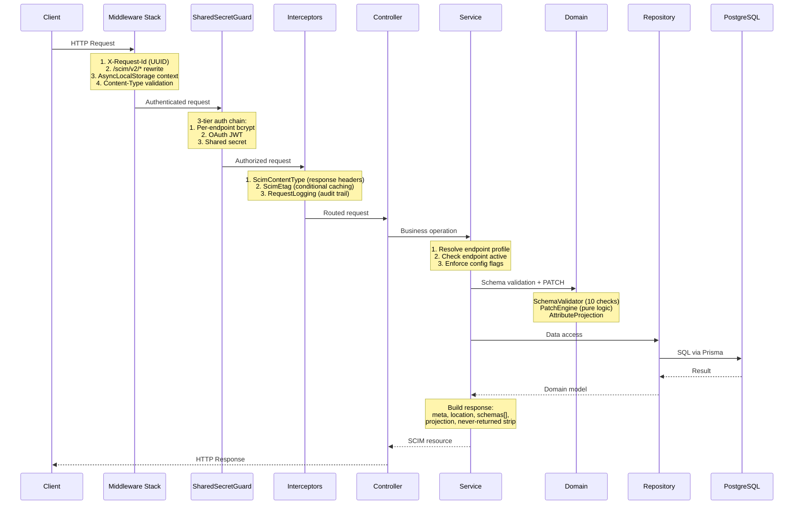

---

## Data Model

5 tables in PostgreSQL 17 with 3 extensions (`citext`, `pgcrypto`, `pg_trgm`):

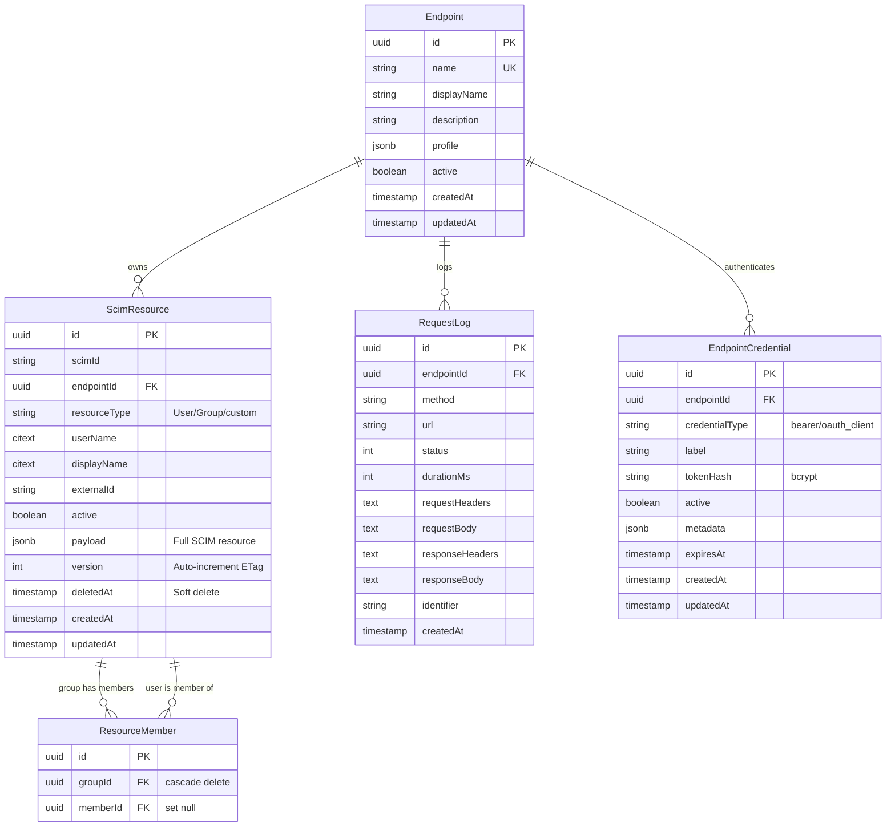

### Key Indexes

| Index | Columns | Purpose |
|-------|---------|---------|
| ScimResource unique | `[endpointId, scimId]` | SCIM ID uniqueness per endpoint |
| ScimResource unique | `[endpointId, userName]` | userName uniqueness per endpoint |
| RequestLog composite | `[endpointId, createdAt]` | Endpoint-scoped log queries |
| RequestLog composite | `[endpointId, identifier, createdAt]` | Activity feed queries |
| RequestLog composite | `[status, createdAt]` | Error log filtering |

### Polymorphic Storage

`ScimResource` uses a polymorphic pattern with `resourceType` discriminator:

| resourceType | First-Class Columns Used |
|-------------|-------------------------|
| `User` | userName, displayName, externalId, active |
| `Group` | displayName, externalId, active |
| Custom types | displayName, externalId (userName used for custom uniqueness) |

The `payload` JSONB column stores the full SCIM resource representation. First-class columns are extracted for indexing, filtering, and uniqueness enforcement.

---

## Multi-Tenant Isolation

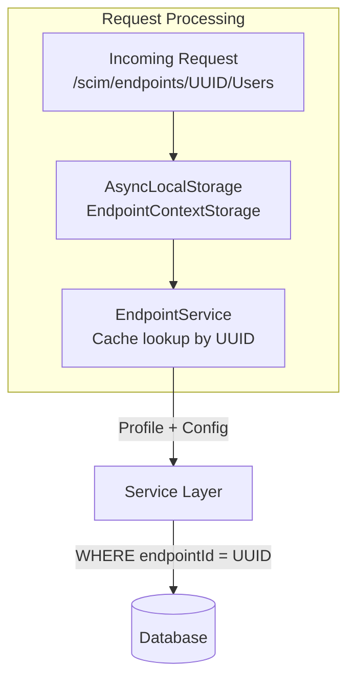

### Isolation Mechanisms

1. **URL-based scoping**: All SCIM operations include `:endpointId` in the URL path
2. **AsyncLocalStorage**: Per-request endpoint context stored in Node.js ALS (zero-overhead thread-local)
3. **Database WHERE clause**: Every repository query includes `endpointId` filter
4. **Composite unique indexes**: userName uniqueness is per-endpoint, not global
5. **Cascade delete**: Deleting an endpoint cascades to all its resources, logs, and credentials
6. **In-memory cache**: EndpointService maintains a Map by ID and by name for fast lookups

---

## Profile Engine

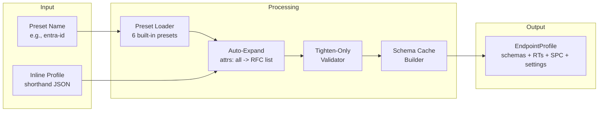

### Components

| Component | File | Responsibility |
|-----------|------|---------------|
| Built-in presets | `built-in-presets.ts` + `presets/*.json` | 6 compiled preset definitions |
| Auto-expand service | `auto-expand.service.ts` | Expand "all", merge partial attrs with RFC baseline |
| Tighten-only validator | `tighten-only-validator.ts` | Reject loosening of attribute characteristics |
| RFC baseline | `rfc-baseline.ts` | Canonical RFC 7643 attribute definitions |
| Endpoint profile service | `endpoint-profile.service.ts` | Orchestrate expansion + validation |

---

## Schema Validation Engine

The `SchemaValidator` (1,664 lines) performs 10 validation types:

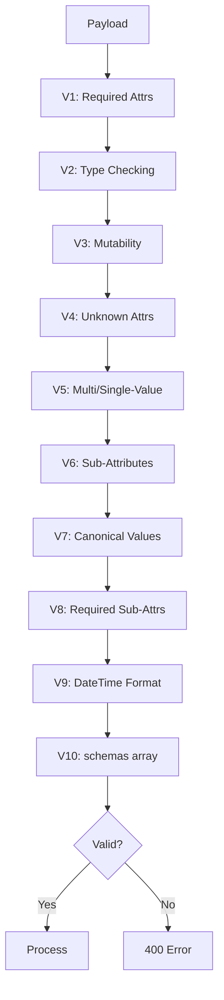

### Validation Contexts

| Context | Required Check | ReadOnly Check | Unknown Attr Check |
|---------|---------------|----------------|-------------------|
| `create` | Yes | Strip | Yes (strict mode) |
| `replace` | Yes | Strip | Yes (strict mode) |
| `patch` (per-op) | No | Reject or strip | No |
| `patch` (post-merge) | Yes | N/A | Yes (strict mode) |

---

## PATCH Engine Architecture

Three pure-domain PATCH engines with shared infrastructure:

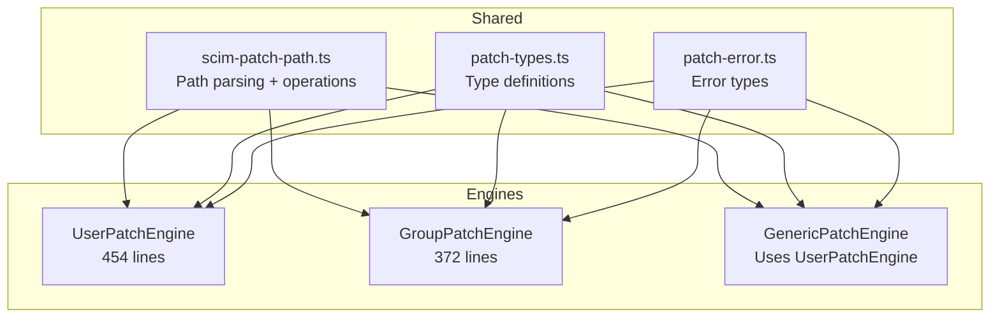

### Path Types Supported

| Type | Example | Parser |
|------|---------|--------|
| Simple | `displayName` | Direct key lookup |
| ValuePath | `emails[type eq "work"].value` | `parseValuePath()` regex |
| Extension URN | `urn:...:enterprise:2.0:User:dept` | `parseExtensionPath()` |
| Dot-notation | `name.givenName` | Requires `VerbosePatchSupported` flag |
| No-path | `{"op":"replace","value":{...}}` | `resolveNoPathValue()` |

---

## Filter & Sort Engine

### Filter Parser

The `scim-filter-parser.ts` (608 lines) implements a recursive-descent parser for the SCIM filter grammar (RFC 7644 S3.4.2.2):

```
filter     = attrPath SP compareOp SP value
           / attrPath SP "pr"
           / filter SP ("and" / "or") SP filter
           / "not" SP "(" filter ")"
           / "(" filter ")"
           / attrPath "[" valFilter "]"
```

### Filter Evaluation Strategy

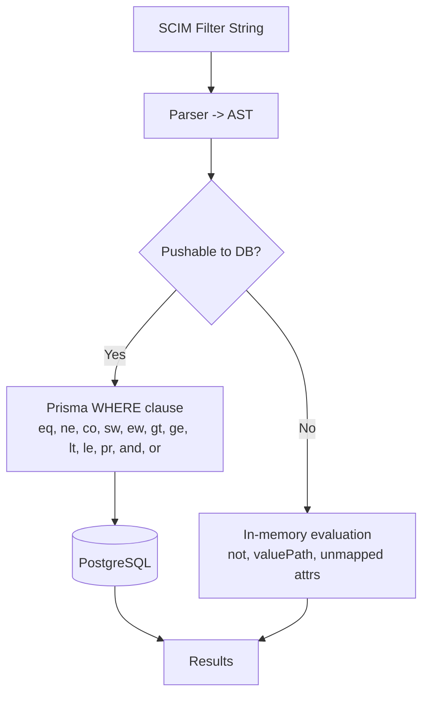

### Sort Resolution

| SCIM sortBy | User DB Column | Group DB Column |
|-------------|---------------|-----------------|
| `id` | `scimId` | `scimId` |
| `userName` | `userName` | N/A |
| `displayName` | `displayName` | `displayName` |
| `externalId` | `externalId` | `externalId` |
| `active` | `active` | N/A |
| `meta.created` | `createdAt` | `createdAt` |
| `meta.lastModified` | `updatedAt` | `updatedAt` |

Default: `createdAt ascending`

---

## Authentication Architecture

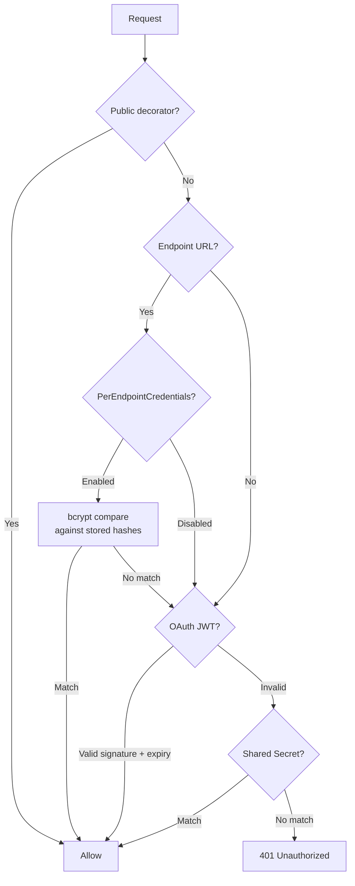

### Auth Types Set on Request

| Auth Method | `req.authType` | `/Me` Support |
|-------------|---------------|---------------|
| Per-endpoint credential | `'endpoint'` | No (404) |
| OAuth JWT | `'oauth'` | Yes (sub claim) |
| Shared secret | `'legacy'` | No (404) |

---

## Logging Architecture

### Components

| Component | File | Responsibility |
|-----------|------|---------------|
| ScimLogger | `scim-logger.service.ts` | Central structured logger |
| Ring Buffer | Built into ScimLogger | In-memory circular buffer |
| SSE Emitter | Built into ScimLogger | Live stream via Server-Sent Events |
| File Writer | `rotating-file-writer.ts` | Rotating log file output |
| Request Interceptor | `request-logging.interceptor.ts` | HTTP audit trail to RequestLog table |
| Log Query Service | `log-query.service.ts` | Query ring buffer and DB logs |

### Log Levels

`TRACE` (0) < `DEBUG` (1) < `INFO` (2) < `WARN` (3) < `ERROR` (4) < `FATAL` (5)

### Per-Endpoint Log Isolation

Each endpoint can have:
- Independent log level override via `logLevel` setting
- Dedicated log file under `logs/endpoints/{endpointId}/`
- Filtered SSE stream at `/scim/endpoints/{id}/logs/stream`
- Filtered ring buffer at `/scim/endpoints/{id}/logs/recent`

---

## Error Handling Architecture

Two-layer exception filter chain (NestJS processes in reverse registration order):

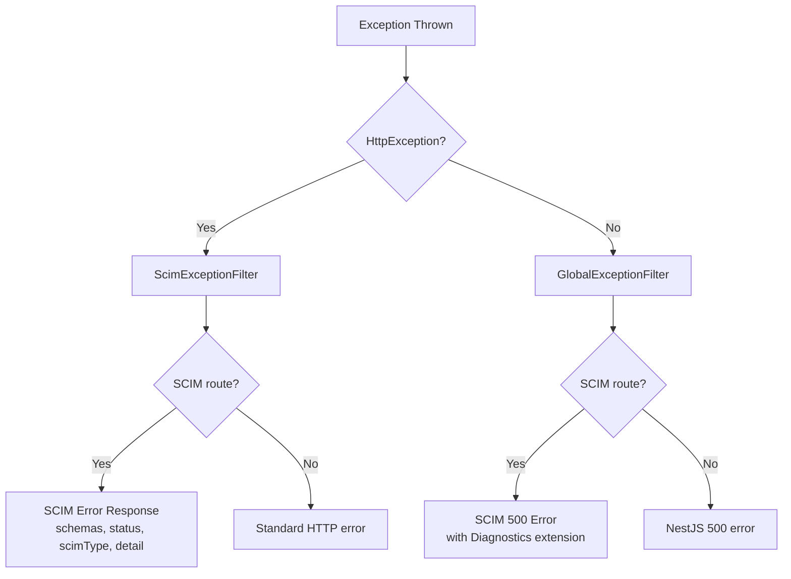

### Diagnostics Extension

All SCIM errors are enriched with `urn:scimserver:api:messages:2.0:Diagnostics`:

```json
{
  "requestId": "X-Request-Id correlation UUID",
  "endpointId": "endpoint UUID",
  "logsUrl": "/scim/endpoints/{id}/logs/recent?requestId={rid}"
}
```

---

## Technology Stack

| Layer | Technology | Version | Purpose |
|-------|-----------|---------|---------|
| Runtime | Node.js | 24 | JavaScript runtime |
| Framework | NestJS | 11.1 | DI, modules, HTTP, guards |
| Language | TypeScript | 5.9 | Type safety |
| ORM | Prisma | 7.4 | Type-safe database access |
| Database | PostgreSQL | 17 | Primary data store |
| PG Extensions | citext, pgcrypto, pg_trgm | - | Case-insensitive, crypto, trigram |
| Auth | @nestjs/jwt, bcrypt | - | JWT signing, password hashing |
| Validation | class-validator, class-transformer | - | DTO validation |
| Testing | Jest | 30.2 | Unit + E2E testing |
| E2E HTTP | Supertest | 7.2 | HTTP testing |
| Frontend | React, Vite | 19, 7 | Admin UI |
| Container | Docker (node:24-alpine) | - | Production deployment |
| Infrastructure | Azure Bicep | - | Azure Container Apps |
