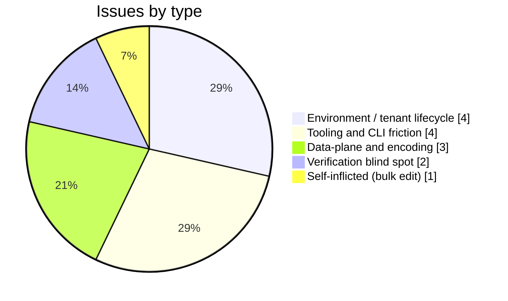
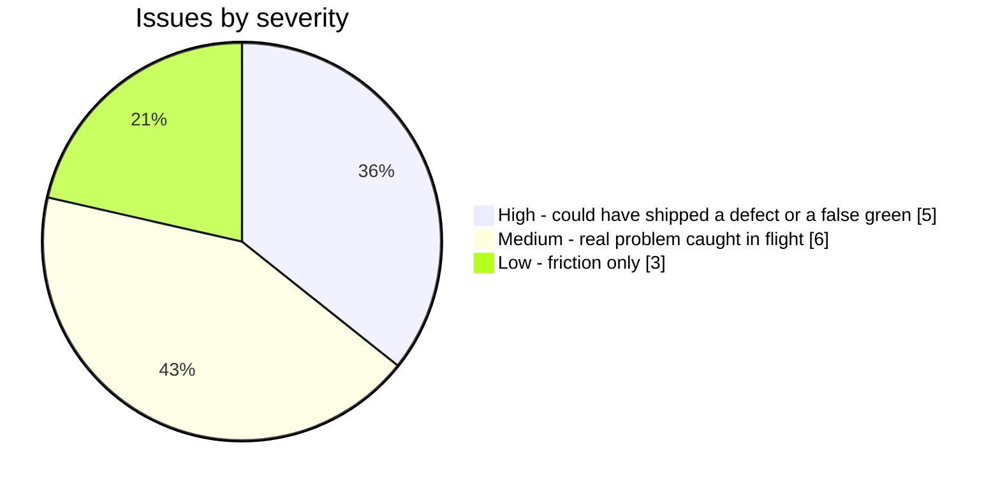

# Tenant 08 -> 09 Migration: Execution Issues and RCA

> **Status:** Complete - **Created:** 2026-08-12 - **Last verified:** 2026-08-12 - **Repo version at capture:** `api/package.json` = `0.55.3`
>
> Companion to [TENANT_09_MIGRATION_PLAN.md](TENANT_09_MIGRATION_PLAN.md). The plan records *what was intended and what shipped*; this ledger records *what went wrong on the way, why, and what stops the next one*. Written per the standing Execution Issue RCA Ledger rule in [.github/copilot-instructions.md](../.github/copilot-instructions.md).

---

## 1. Why this ledger exists

None of the 14 issues below appear in the migration plan, because none of them were foreseeable from the design. They came from unforeseen combinations: an expiring control plane racing an in-flight copy, percent-encoding in a generated password, a CLI storing extensions per-profile, two subscriptions sharing a display name, and a cache that only reloads on write.

The migration itself succeeded on every measurable axis - 58 endpoints, 728 and 734 users, 347 groups per estate, IDs preserved, live SCIM **1387/1387** on dev, Playwright **207/0** in a real browser, deep-verify **OVERALL PASS** on both estates. The value of this document is entirely in the failures.

**This is a recurring operation.** The subscription is ephemeral and lasted roughly 80 days, so this migration happens 4 to 5 times a year. Every hour spent here is repaid at the next rollover.

---

## 2. Issue distribution

---

## 3. Master dashboard

| # | Type | Sev | Symptom (one line) | Resolution |
|---|---|---|---|---|
| I1 | Environment | **High** | Tenant-08 ARM expired mid-migration; estate unmanageable | Recovered from pre-captured connection strings |
| I2 | Verification | **High** | Every count matched but the JWKS allow-list had silently reverted | Carried the rows + fixed the seed + added per-host assertions |
| I3 | Data plane | **High** | 0-byte `pg_dump` plus `rc=0` restore emptied the target | Empty-dump guard, `exit 90` under 10 000 bytes |
| I4 | Data plane | **High** | Percent-encoding in passwords broke the copy in both directions | Try raw and decoded, probe which authenticates |
| I5 | Self-inflicted | **High** | Bulk GUID replace rewrote the *retiring* tenant's map entry to the *new* tenant's IDs | Reverted by hand; rule added |
| I6 | Tooling | Medium | `az containerapp` reported `'environment' is misspelled` on a healthy estate | Shared `AZURE_EXTENSION_DIR` |
| I7 | Environment | Medium | Two subscriptions share the name `ProvIAM_Subscription` | Resolve by subscription **ID**, error on ambiguity |
| I8 | Environment | Medium | Deploy SP is Contributor, cannot create the `AcrPull` role assignment | Use anonymous GHCR, as customer prod already does |
| I9 | Data plane | Medium | `pg_dump` emits `CREATE EXTENSION "uuid-ossp"`; target rejected it | Provision the superset of extensions |
| I10 | Tooling | Medium | `az containerapp update` exited 1 *after* the write applied | Never trust the exit code; re-read state |
| I11 | Verification | Medium | Template image differed from the served image | Authority is `revision list` + `/scim/admin/version` |
| I12 | Tooling | Low | Container Apps job logs unreadable; Log Analytics empty | Built a self-reporting channel into the target DB |
| I13 | Tooling | Low | `$pid` is a read-only automatic variable in PowerShell | Renamed |
| I14 | Environment | Low | `--min-replicas 0` hangs on Multiple-revision apps | Quiesce by deactivating revisions |

---

## 4. The five that matter

### I1 - The control plane expired in the middle of the migration

**Symptom.** On 2026-08-11, part-way through the carry, every `az` call against subscription `5738ea6a-...` began failing. The tenant-08 estate could no longer be listed, read, scaled or exported.

**Root cause.** The subscription was ephemeral with a fixed lifetime, and the migration crossed that boundary. There was no warning and no grace period on the management plane.

**What saved it.** The PostgreSQL connection strings for both source databases had already been captured into a file *outside* the tenant. **Subscription expiry terminates the ARM control plane but not the PostgreSQL data plane** - the servers kept accepting connections on their public endpoints, so `pg_dump` still worked with no Azure credentials involved at all.

**Why the fix works.** It removes the dependency entirely. A dump needs a host, a user, a password and a database; none of those are ARM objects. Capturing them early converts a hard deadline into a soft one.

**Prevention.** At the *start* of any migration off a time-limited subscription, capture and externally store every data-plane connection string before touching anything else. This is now the first step of the generalized replication tool.

> The corollary is uncomfortable and worth stating: the old estates are **still serving traffic today** on `proudbush-ae90986e` and cannot be stopped, patched or deleted. An expired subscription is not an off switch. Anything still pointed at those URLs keeps working and therefore never notices it is on a dead estate. That is gap **G16**.

### I2 - Every count matched and the migration had still lost security state

**Symptom.** Post-carry verification passed comprehensively: 58 endpoints on each estate, matching user and group counts, primary keys preserved, all 6 per-endpoint surfaces valid across all 58 endpoints, 296 and 319 attribute definitions RFC-valid. Then a targeted check found the JWKS host allow-list holding its **seeded defaults** rather than the operator-curated list, missing `login.windows.net`.

**Root cause.** Two independent faults stacked. First, the mirroring script [mirror-prod-to-dev.ts](../api/src/scripts/mirror-prod-to-dev.ts) enumerated resource models but not **server-level** models, so DEKs, JWKS hosts and server settings were never copied, and `secretEnvelope` was silently dropped from credential rows. Second, `login.windows.net` (the **v1** Entra issuer host) was not in `WELL_KNOWN_JWKS_HOST_SEED`, so a fresh estate could not even seed it.

**Why this is the most important entry here.** Every verification the migration performed was **resource-shaped** - count endpoints, count users, walk each endpoint's surfaces. Server-level singletons are invisible to all of it. A security-relevant trust boundary reverted to default and the entire verification suite stayed green.

**Fix.** `mirrorDeks`, `mirrorJwksHosts` and `mirrorServerSettings` added, plus `secretEnvelope` in the credential copy. `login.windows.net` added to the seed. A new [mirror-prod-to-dev.coverage.spec.ts](../api/src/scripts/mirror-prod-to-dev.coverage.spec.ts) pins the mirrored model list against the models declared in the Prisma schema, with negative controls, so **a model added to the schema and forgotten in the mirror fails a test**.

**Why the fix works.** It inverts the relationship. The mirror no longer carries a hand-maintained list that drifts; the schema is the source of truth and the test fails on divergence.

**Prevention.** The existing allow-list test iterated the seed constant and asserted each entry was well-formed - which by construction can never detect a **removal**. It now carries explicit `it.each` assertions naming all 7 hosts individually. **A test that iterates the thing it is testing is not a regression lock.**

### I3 - A silent no-op that emptied the target

**Symptom.** A restore reported `rc=0` and the target database came back empty.

**Root cause.** The `pg_dump` half of the `pg_dump | psql` pipeline produced 0 bytes (it had failed to authenticate, see I4), and `psql` cheerfully applied an empty input and exited 0. The pipeline reported the exit status of the *last* command.

**Fix.** An explicit byte-count guard between the two halves: `if [ "$BYTES" -lt 10000 ]; then exit 90; fi`.

**Why it works.** It asserts on the artifact rather than the exit status. Any real dump of this schema is far larger than 10 KB, so the threshold cannot produce a false failure while catching every empty or truncated dump.

**Prevention.** **Never chain a producer into a consumer without asserting the artifact between them.** The same shape has bitten this repo before - a gate with no exit statement, a manifest prefix matching nothing - all of them green because they could not fail.

### I4 - Percent-encoding, requiring opposite handling per estate

**Symptom.** The dev carry worked and the prod carry failed with an authentication error, on identical code.

**Root cause.** Generated admin passwords are embedded in a `postgresql://` URI. The prod password contained `%s`, which is not a valid percent-escape, so libpq rejected the whole URI and the password had to be passed **raw**. The dev password contained `%99`, which *is* a valid escape, so libpq decoded it and the password had to be passed **decoded**. Two estates required exactly opposite handling, from the same generator.

**Fix.** [rotate-tenant-data.ps1](../scripts/rotate-tenant-data.ps1) decomposes the URI itself (anchoring on the **last** `@` and splitting credentials on the **first** `:`), computes both the raw and percent-decoded password, passes both as secrets, and a shell `pick_pw()` probes which one authenticates.

**Why it works.** It stops guessing the encoding convention and measures it instead.

**Prevention.** Treat any credential embedded in a URI as ambiguous unless the generator's escaping is known. Better: do not embed credentials in URIs at all.

### I5 - A bulk find/replace corrupted the tenant registry

**Symptom.** After a scripted repo-wide redirect, `scripts/az-tenant.ps1` showed the **retiring** tenant-08 entry carrying tenant-09's tenant ID and subscription ID.

**Root cause.** The redirect replaced old identity GUIDs with new ones across all operational files. `az-tenant.ps1` is the one file whose legitimate job is to hold **both** identities, so a global replace destroyed exactly the distinction it exists to maintain.

**Impact if missed.** `Resolve-ScimTenantEntry` would have had two entries with identical subscription IDs. Its ambiguity check keys on subscription ID, so a lookup could have silently returned the wrong tenant - and the operation most likely to follow a tenant lookup is a deployment.

**Fix.** Reverted by hand; caught by reading the file rather than by any gate.

**Prevention.** **Exclude the identity registry from any bulk identity replace, and diff it by hand.** More generally, a bulk edit must be followed by `git diff --numstat` and an inspection of every file whose *purpose* is to record the thing being replaced. This is the same discipline as the large-file editing rule: assert the shape of the diff, do not trust the aggregate summary.

---

## 5. Detection-stage escape analysis

| # | Caught by | Earliest gate that *could* have | Escape |
|---|---|---|---|
| I1 | Operator observation, mid-flight | A pre-migration expiry check on the source subscription | **1 stage** |
| I2 | A deliberate targeted check after the carry | The mirror coverage test, which did not exist | **all stages** |
| I3 | Target verification | The guard inside the tool | 1 stage |
| I4 | Prod carry failure | Same, on the dev carry, had the tool probed | 1 stage |
| I5 | Manual file read | A post-bulk-edit registry diff, which did not exist | **all stages** |
| I6 | Manual diagnosis | The doctor pattern already used for Mermaid | all stages |
| I7 | Design-time reasoning | n/a - caught before it fired | 0 |
| I8 | Role-assignment failure | A pre-flight permission probe | 1 stage |
| I9 | Prod carry failure | Gap G9, which had predicted it and was rated Low | **it was written down and not acted on** |
| I10-I14 | In-flight | various | low impact |

**Two escapes are total** (I2, I5) - no gate at any stage could have caught them, because no gate looked at server-level state or at registry integrity after a bulk edit. Both now have one.

**I9 is the most instructive.** The `azure.extensions` drift was documented on 2026-07-29 as gap **G9**, severity **Low**, with a prediction that it would break a migration. It then broke this migration, in the opposite direction to the prediction, which made a **data**-specific fault present as an **environment**-specific one. A written-down risk with no owner and no gate is not mitigated. **Severity should reflect the blast radius when it fires, not the probability that it will.**

---

## 6. Standing conventions harvested

1. **Capture data-plane connection strings before crossing a lifecycle boundary**, and store them outside the resource being retired.
2. **Verify server-level singletons explicitly.** Resource counts and per-resource surface walks cannot see them.
3. **A test that iterates a constant cannot detect a removal from that constant.** Name the members individually.
4. **Assert the artifact between a producer and a consumer**, never just the pipeline exit status.
5. **Resolve cloud identity by ID, never by display name.** Names are not unique across tenants.
6. **Exclude identity registries from bulk identity replaces**, and hand-diff them afterwards.
7. **`az` stores extensions under `AZURE_CONFIG_DIR`.** Isolated profiles need `AZURE_EXTENSION_DIR` pinned to a shared directory, or every extension command fails with a message that names neither.
8. **Never trust an `az containerapp` exit code.** Re-read the resource.
9. **Provision the superset of database extensions**, so a dump from any estate restores into any other.
10. **A Low-severity gap that predicts a migration failure is not Low.**

---

## 7. Self-improvement disposition (R7)

**What this run revealed that the rule set did not cover:** verification was entirely resource-shaped, so server-level state could revert with every gate green (I2); and no gate existed for registry integrity after a bulk edit (I5).

**Disposition: (a) applied** - mirror coverage test with negative controls, per-host JWKS assertions, the empty-dump guard, dual-password probing, superset extensions, shared extension directory, ID-based tenant resolution. **(b) scheduled** - a pre-migration subscription-expiry probe and a pre-flight permission probe, both folded into the generalized replication tool.

## 8. Design and architecture gate disposition

**SRP / coupling / pattern consistency / open-closed.** [rotate-tenant-data.ps1](../scripts/rotate-tenant-data.ps1) is a single-purpose tool with one responsibility (move a database between tenants) and no coupling to the deployment scripts. [infra/containerapp.bicep](../infra/containerapp.bicep) gained an optional `environmentResourceId` parameter with a conditional `existing` resource - an **extension** point, so the next cross-resource-group estate needs no edit. `az-tenant.ps1` grew `Set-ScimAzExtensionDir` as a small named function called from the three profile-switch sites rather than three copies of one line.

**YAGNI counter-check.** The generalized, role-keyed replication tool (`active` / `next` / `retiring` / `permanent`) is deliberately **not** built in this change. It has exactly one proven use so far. It is justified only because a second is scheduled and known - the subscription is ephemeral - and it will be proven against a throwaway estate before it is trusted.

**Disposition: (a) applied** for the durable fixes above, **(b) scheduled** for the generalization.
