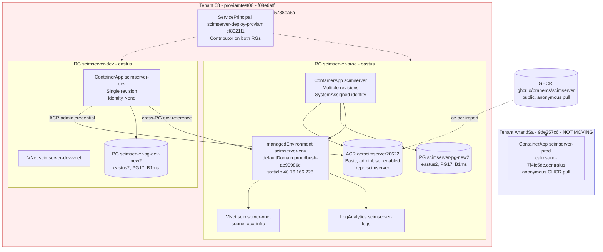
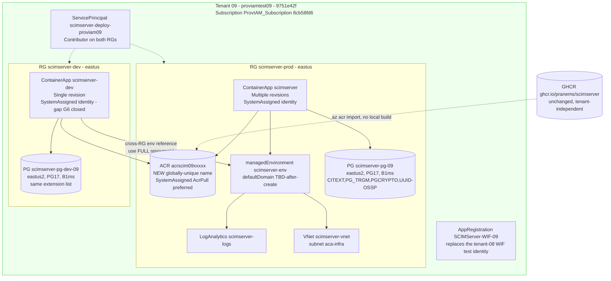
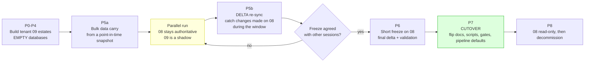
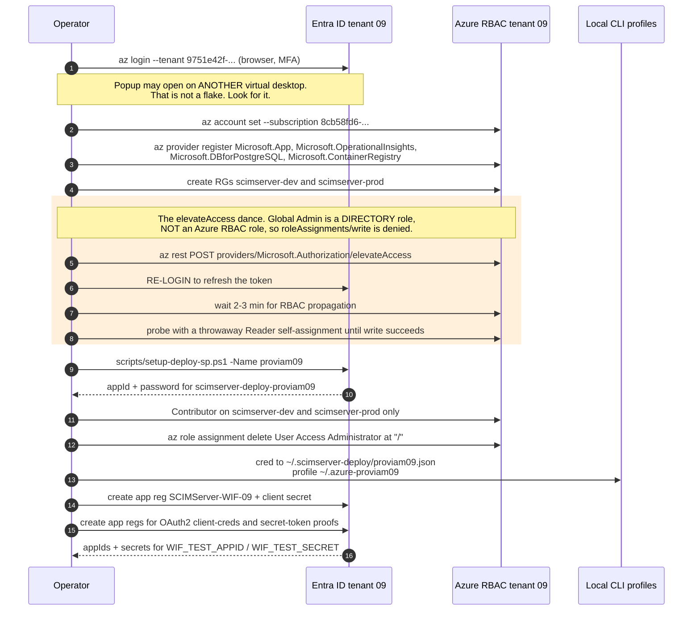
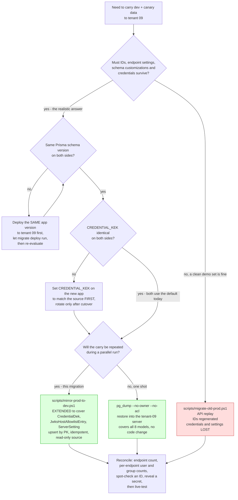
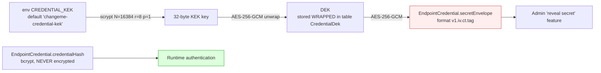
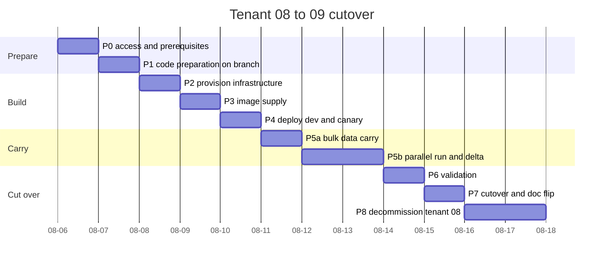
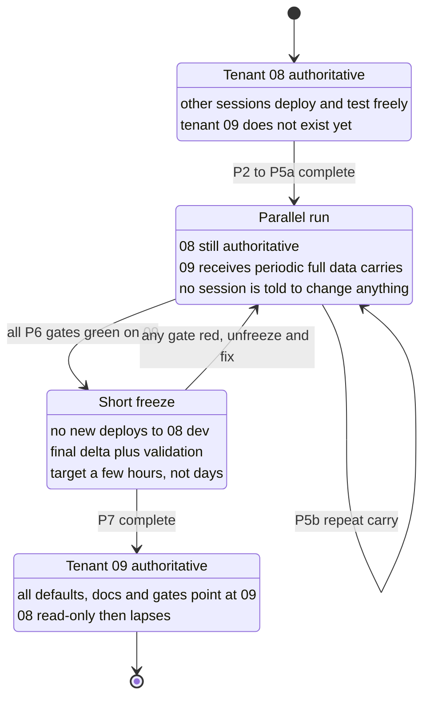

# Ephemeral Tenant Cutover: ProvIAM 08 to ProvIAM 09

> **Last verified:** 2026-08-05
> **Scope:** move the **dev** estate and the **parallel / canary prod** estate from the expiring ephemeral tenant `proviamtest08` to the new ephemeral tenant `proviamtest09`.
> **Explicitly out of scope:** the customer-facing prod (`calmsand`, tenant `9de357c6-...`, subscription `AnandSa-Test-150`). It does not move and must not be touched by this work.
> **Standing constraint:** other sessions are actively developing against the live tenant-08 dev and canary prod **right now**. This is therefore a **parallel build followed by a cutover**, never an in-place edit.

---

## Table of Contents

1. [Executive summary](#1-executive-summary)
2. [Tenant facts, old and new](#2-tenant-facts-old-and-new)
3. [Measured current state of tenant 08](#3-measured-current-state-of-tenant-08)
4. [Topology: current, target, and the parallel-run window](#4-topology-current-target-and-the-parallel-run-window)
5. [The coupling register: every place the tenant is named](#5-the-coupling-register-every-place-the-tenant-is-named)
6. [Identity, permissions, roles, logins](#6-identity-permissions-roles-logins)
7. [Secrets, headers, URLs, and connection material](#7-secrets-headers-urls-and-connection-material)
8. [Data migration: what moves, what does not, and the three strategies](#8-data-migration-what-moves-what-does-not-and-the-three-strategies)
9. [The credential encryption problem (CREDENTIAL_KEK)](#9-the-credential-encryption-problem-credential_kek)
10. [Gates that will fire, and how to keep them green](#10-gates-that-will-fire-and-how-to-keep-them-green)
11. [The plan: phases P0 to P8](#11-the-plan-phases-p0-to-p8)
12. [Coordinating with the in-flight work on tenant 08](#12-coordinating-with-the-in-flight-work-on-tenant-08)
13. [Known-issue playbook carried from the 07 to 08 move](#13-known-issue-playbook-carried-from-the-07-to-08-move)
14. [Risk register](#14-risk-register)
15. [Effort estimates](#15-effort-estimates)
16. [Acceptance criteria and verification matrix](#16-acceptance-criteria-and-verification-matrix)
17. [Decommissioning tenant 08](#17-decommissioning-tenant-08)
18. [Appendix A: command reference](#appendix-a-command-reference)
19. [Appendix B: payload and config reference](#appendix-b-payload-and-config-reference)

---

## 1. Executive summary

The ephemeral tenant `proviamtest08` expires within days. Two of the three live SCIMServer estates live inside it: **dev** and the **parallel / canary prod**. Both must be rebuilt in `proviamtest09` and their data carried across before the old tenant lapses.

The good news, measured rather than assumed:

| Layer | Tenant coupling | Consequence |
|---|---|---|
| `api/src/**`, `web/src/**` | **None** | No application code changes are required. The server is tenant-agnostic; all issuer / JWKS / trust configuration is per-endpoint runtime data in the database. |
| `infra/*.bicep` | **None** | Every template is fully parameterized. The same templates provision tenant 09. |
| `.github/workflows/**` | **None** | No workflow touches Azure. There are no OIDC federated credentials to re-create. Images go to GHCR with the built-in `GITHUB_TOKEN`. |
| `scripts/**` | **Yes, concentrated** | One blocking file (`az-tenant.ps1`), three gate/pipeline files, and a set of defaults and comments. |
| `docs/**` | **Yes, broad but shallow** | 136 occurrences of the tenant GUID or the `proudbush` domain across ~40 files. Mostly example hosts in prose. |

The hard parts are not code. They are:

1. **Identity bootstrap in a brand-new tenant** - a deployment service principal needs an Azure RBAC role assignment, and the operator's Global Administrator role is an Entra *directory* role, not an Azure RBAC role. This required a root-scope `elevateAccess` dance last time and will again.
2. **Data fidelity** - the supported migration script replays resources over the SCIM API and therefore **regenerates every ID** and carries **no endpoint credentials, settings, or schema customizations**. That is a much bigger deal now (63 endpoints, 735 users, 347 groups on dev) than it was at the 07-to-08 move (36 / 297 / 40). A better tool already exists in the repository, but it has a coverage gap that must be closed first.
3. **Running the cutover without disturbing other sessions' in-flight work** on the current dev.

The recommended strategy is a **parallel build with a row-level Prisma mirror** ([scripts/mirror-prod-to-dev.ps1](../scripts/mirror-prod-to-dev.ps1)), extended to cover three models it does not currently touch. It preserves IDs, endpoint settings and credentials, and because it upserts by primary key it doubles as the repeatable delta mechanism the parallel run needs. `pg_dump` is the fallback and the API replay is the last resort.

---

## 2. Tenant facts, old and new

### 2.1 The three tenants in play

| | **Tenant 08 (expiring)** | **Tenant 09 (target)** | **AnandSa (untouched)** |
|---|---|---|---|
| Display name | Provisioning IAM Team 08 | Provisioning IAM Team 09 | AnandSa-Test-150 |
| Domain | `proviamtest08.onmicrosoft.com` | `proviamtest09.onmicrosoft.com` | n/a |
| Tenant ID | `f08e6aff-ca0f-4f11-81fa-1ffd43323373` | `9751e42f-78f3-42f4-8b8a-6e73845aceae` | `9de357c6-4488-4a8d-bd2f-14696f1af950` |
| Subscription name | `ProvIAM_Subscription` | `ProvIAM_Subscription` | `AnandSa-Test-150` |
| Subscription ID | `5738ea6a-533b-4c0d-a18a-d322f2094475` | `8cb58fd6-cf6f-4334-9fe0-3b12f93a6596` | `e299a87a-9e41-4f3e-b17f-64cd123758a0` |
| Operator role | Owner | Owner | Global Admin, Owner after elevation |
| Plan | Azure Plan | Azure Plan | Azure Plan |
| Activated | (prior) | 2026-08-05 21:32 | (prior) |
| Estates hosted | dev, canary prod | **dev, canary prod (target)** | customer-facing prod |
| Status after cutover | decommission | live | unchanged |

### 2.2 The name collision that will bite

**Both** the tenant-08 subscription and the tenant-09 subscription are named `ProvIAM_Subscription`. The tenant helper resolves entries by subscription **name**:

```powershell
# scripts/az-tenant.ps1 - Resolve-ScimTenantEntry
if ($Subscription) {
    foreach ($e in $map.Values) { if ($e.Subscription -eq $Subscription) { return $e } }
}
```

If a `proviam09` entry is added alongside the existing `proviam` entry, any call that passes `-Subscription ProvIAM_Subscription` silently resolves to **whichever entry is first in the ordered map**. `scripts/promote-to-prod.ps1` takes exactly such a `-Subscription` parameter.

**Mandatory fix before any deploy:** key the tenant map on **subscription ID**, not name. See [P1.1](#p1-code-preparation-on-the-branch).

---

## 3. Measured current state of tenant 08

All values below were read live from the ARM control plane and the running estates on 2026-08-05. Nothing here is inferred.

### 3.1 Full resource inventory (34 resources in the subscription)

SCIMServer-owned resources:

| Resource group | Name | Type | Location |
|---|---|---|---|
| `scimserver-prod` | `acrscimserver20622` | `Microsoft.ContainerRegistry/registries` | eastus |
| `scimserver-prod` | `scimserver` | `Microsoft.App/containerApps` | eastus |
| `scimserver-prod` | `scimserver-env` | `Microsoft.App/managedEnvironments` | eastus |
| `scimserver-prod` | `scimserver-logs` | `Microsoft.OperationalInsights/workspaces` | eastus |
| `scimserver-prod` | `scimserver-pg-new2` | `Microsoft.DBforPostgreSQL/flexibleServers` | **eastus2** |
| `scimserver-prod` | `scimserver-vnet` | `Microsoft.Network/virtualNetworks` | eastus |
| `scimserver-dev` | `scimserver-dev` | `Microsoft.App/containerApps` | eastus |
| `scimserver-dev` | `scimserver-dev-vnet` | `Microsoft.Network/virtualNetworks` | eastus |
| `scimserver-dev` | `scimserver-pg-dev-new2` | `Microsoft.DBforPostgreSQL/flexibleServers` | **eastus2** |
| `ME_scimserver-env_scimserver-prod_eastus` | `capp-svc-lb`, `capp-svc-lb-ip` | platform-managed load balancer and public IP | eastus |

**Not owned by SCIMServer** but sharing the subscription, and therefore also affected by the tenant expiry (owners must be told separately, they are out of scope here):

| Resource group | What it is |
|---|---|
| `rg-scim-validation` | SCIM validation Logic Apps and web apps, App Insights, storage |
| `rg-scim-validation-08` | ditto, the "08" generation |
| `rg-scim-validation-westus2` | ditto, westus2 |
| `NetworkWatcherRG` | platform Network Watchers (eastus, eastus2) |

### 3.2 Container Apps managed environment

| Property | Value |
|---|---|
| Name | `scimserver-env` |
| Resource group | `scimserver-prod` |
| Location | East US |
| **Default domain** | `proudbush-ae90986e.eastus.azurecontainerapps.io` |
| Static IP | `40.76.166.228` |
| Zone redundant | `False` |
| Infrastructure subnet | `scimserver-vnet/aca-infra` (in RG `scimserver-prod`) |
| Log destination | `log-analytics` (workspace `scimserver-logs`) |

**Critical structural fact:** the **dev** container app lives in resource group `scimserver-dev` but references the managed environment in resource group `scimserver-prod`. This cross-resource-group arrangement exists because a subscription is capped at a small number of Container Apps environments, and it is the direct cause of issues 2 and 3 in the previous migration. It must be reproduced deliberately in tenant 09, using a **full resource ID** for `--environment`.

### 3.3 Container apps

| Property | **dev** | **prod (canary)** |
|---|---|---|
| App name | `scimserver-dev` | `scimserver` |
| Resource group | `scimserver-dev` | `scimserver-prod` |
| FQDN | `scimserver-dev.proudbush-ae90986e.eastus.azurecontainerapps.io` | `scimserver.proudbush-ae90986e.eastus.azurecontainerapps.io` |
| Ingress | external, targetPort 8080, transport Auto | external, targetPort 8080, transport Auto |
| Managed identity | **None** | **SystemAssigned** |
| Revision mode | **Single** | **Multiple** (required for blue/green) |
| Image at capture | `acrscimserver20622.azurecr.io/scimserver:0.55.3` | `acrscimserver20622.azurecr.io/scimserver:0.55.1-edcb330f` |
| Resources | 0.5 vCPU / 1 GiB | 0.5 vCPU / 1 GiB |
| Scale | min 1, max 1 | min 1, max 1 |
| Secrets | `scim-shared-secret`, `jwt-secret`, `oauth-client-secret`, `database-url`, `acrscimserver20622azurecrio-acrscimserver20622` | `oauth-client-secret`, `scim-shared-secret`, `database-url`, `ghcr-password`, `jwt-secret` |
| Registry | `acrscimserver20622.azurecr.io`, username `acrscimserver20622` (admin credential) | same server entry, but the running image has been GHCR-sourced at times |
| Reported app version | `0.55.3` | `0.55.1` |
| Reported Node | `v24.19.0` | `v24.18.1` |

Environment variables differ between the two. Dev carries the minimal set; prod additionally carries the self-reference and logging block:

| Variable | dev | prod |
|---|---|---|
| `SCIM_SHARED_SECRET` | secretRef `scim-shared-secret` | secretRef `scim-shared-secret` |
| `JWT_SECRET` | secretRef `jwt-secret` | secretRef `jwt-secret` |
| `OAUTH_CLIENT_SECRET` | secretRef `oauth-client-secret` | secretRef `oauth-client-secret` |
| `DATABASE_URL` | secretRef `database-url` | secretRef `database-url` |
| `PERSISTENCE_BACKEND` | `prisma` | `prisma` |
| `NODE_ENV` | `production` | `production` |
| `PORT` | `8080` | `8080` |
| `CORS_ORIGIN` | empty | empty |
| `LOG_LEVEL` | `DEBUG` | `DEBUG` |
| `LOG_FORMAT` | `json` | `json` |
| `LOG_FILE` | not set | empty |
| `LOG_RING_BUFFER_SIZE` | not set | `5000` |
| `LOG_RETENTION_DAYS` | not set | `30` |
| `LOG_SLOW_REQUEST_MS` | not set | `1000` |
| `SCIM_RG` | not set | `scimserver-prod` |
| `SCIM_APP` | not set | `scimserver` |
| `SCIM_REGISTRY` | not set | `acrscimserver20622.azurecr.io` |
| `SCIM_CURRENT_IMAGE` | not set | `acrscimserver20622.azurecr.io/scimserver:0.52.0-alpha.3` (stale, see gap below) |
| `CREDENTIAL_KEK` | **not set** | **not set** |

Two observations worth carrying into the rebuild:

- `SCIM_CURRENT_IMAGE` on prod still reads `0.52.0-alpha.3` while the app actually runs `0.55.1-edcb330f`. It is a display-only self-reference used by the "Copy Update Command" affordance, but it is wrong today. Set it correctly in tenant 09 or stop setting it.
- `CREDENTIAL_KEK` is set on **neither** estate, so both run the built-in default. Section [9](#9-the-credential-encryption-problem-credential_kek) explains why that is simultaneously a security gap and the thing that makes a database-level carry viable.

### 3.4 PostgreSQL flexible servers

Both servers sit in **East US 2** while the apps sit in **East US**. This split was a quota workaround at the 07-to-08 move and is preserved by the `-PgLocation` parameter.

| Property | `scimserver-pg-new2` (prod) | `scimserver-pg-dev-new2` (dev) |
|---|---|---|
| Resource group | `scimserver-prod` | `scimserver-dev` |
| Location | East US 2 | East US 2 |
| PostgreSQL version | 17 | 17 |
| SKU | `Standard_B1ms` / Burstable | `Standard_B1ms` / Burstable |
| Storage | 32 GB | 32 GB |
| Admin login | `scimadmin` | `scimadmin` |
| FQDN | `scimserver-pg-new2.postgres.database.azure.com` | `scimserver-pg-dev-new2.postgres.database.azure.com` |
| Backup | 7 days, geo-redundant disabled | 7 days, geo-redundant disabled |
| Public access | Enabled | Enabled |
| `azure.extensions` | `CITEXT,PG_TRGM,PGCRYPTO,UUID-OSSP` | `CITEXT,PG_TRGM,PGCRYPTO` |
| Firewall rules | `AllowMyIP-temp` (40.117.66.214), `AllowAllAzureServices` (0.0.0.0) | `AllowMyIP-temp` (40.117.66.210), `AllowAzureServices`, `AllowAllAzureServices` |

Note the **drift**: prod allow-lists `UUID-OSSP` and dev does not. Standardise on the prod value in tenant 09.

### 3.5 Container registry

| Property | Value |
|---|---|
| Name | `acrscimserver20622` |
| Login server | `acrscimserver20622.azurecr.io` |
| SKU | Basic |
| Admin user | **Enabled** |
| Public network access | Enabled |
| Repositories | one: `scimserver` |
| Ten most recent tags | `0.55.3`, `0.55.1-edcb330f`, `0.55.1`, `0.55.0`, `0.54.0-alpha.12`, `0.54.86`, `0.54.85`, `0.54.84`, `0.54.81`, `0.54.80` |

The ACR name is globally unique, so tenant 09 needs a **new registry name**. Pick it deliberately, and note that the string `acrscimserver20622` contains the retired token `scimserver2`, which the C10 documentation gate has a special case for. Choosing a name without that substring removes a standing footgun.

### 3.6 Live data volume, and how it compares to last time

| | endpoints | users | groups | app version | Node |
|---|---|---|---|---|---|
| **dev** (tenant 08) | **63** | **735** | **347** | 0.55.3 | v24.19.0 |
| **prod canary** (tenant 08) | **58** | **728** | **347** | 0.55.1 | v24.18.1 |
| *07-to-08 move, for comparison* | *36* | *297* | *40* | *0.52.0-alpha.3* | *n/a* |

Scaling factor versus the last move: **1.75x endpoints, 2.5x users, 8.7x groups**, and it must be done for **two** targets rather than being a one-way copy from a single old prod. Group growth is the sharpest, and groups are the expensive part of an API replay because every `members[].value` must be remapped.

---

## 4. Topology: current, target, and the parallel-run window

### 4.1 Current topology (tenant 08)



### 4.2 Target topology (tenant 09)

Structurally identical, with new names where global uniqueness demands it. The unknown at planning time is the new environment's **default domain**, which Azure assigns; it is discovered after the environment is created and then propagated everywhere.



### 4.3 The parallel-run window

Because other sessions are working on tenant-08 dev while this proceeds, tenant 09 is built to the side and only becomes authoritative at an explicit cutover moment.



The delta re-sync in P5b is what makes the parallel run safe. It is the step the 07-to-08 move did not need, because the old prod was already frozen.

---

## 5. The coupling register: every place the tenant is named

Classification:

- **B (Blocking)** - the migration cannot complete, or a gate hard-fails, until this changes.
- **F (Functional)** - works but points at the wrong estate, producing wrong results silently.
- **C (Cosmetic)** - prose, comments, examples. Wrong but harmless at runtime.

### 5.1 Blocking and functional items

| Class | File | Line(s) | What is coupled | Required change |
|---|---|---|---|---|
| **B** | [scripts/az-tenant.ps1](../scripts/az-tenant.ps1) | 45-52 | `proviam` map entry: tenant GUID `f08e6aff-...`, subscription **name** `ProvIAM_Subscription`, `ConfigDir` `~/.azure-proviam`, `CredFile` `~/.scimserver-deploy/proviam.json`, `Scopes` `scimserver-dev` + `scimserver-prod` | Add a `proviam09` entry. **Re-key resolution on subscription ID** so the duplicated name cannot mis-resolve. Keep `proviam` (08) during the parallel run, retire it after cutover. |
| **B** | [scripts/az-tenant.ps1](../scripts/az-tenant.ps1) | `Resolve-ScimTenantEntry` | Resolves by subscription **name**, which is now ambiguous across two tenants | Match on `SubscriptionId` first, fall back to name only when unambiguous |
| **B** | [scripts/audit-deployment-doc.ps1](../scripts/audit-deployment-doc.ps1) | 162-164 | Hardcoded live-estate probe list, including both `proudbush` FQDNs | Add the tenant-09 FQDNs. During the parallel run probe **both**. After cutover remove the 08 pair. |
| **F** | [scripts/dev-deployment-pipeline.ps1](../scripts/dev-deployment-pipeline.ps1) | 122 | `-RegistryAcr` default `acrscimserver20622.azurecr.io` | New registry login server |
| **F** | [scripts/dev-deployment-pipeline.ps1](../scripts/dev-deployment-pipeline.ps1) | 124-125 | `-DevResourceGroup` / `-DevAppName` defaults `scimserver-dev` | Unchanged if the same names are reused in tenant 09 (recommended) |
| **F** | [scripts/dev-deployment-pipeline.ps1](../scripts/dev-deployment-pipeline.ps1) | 132-133 | `-CanaryResourceGroup` `scimserver-prod`, `-CanaryAppName` `scimserver` | Unchanged if names are reused |
| **F** | [scripts/dev-deployment-pipeline.ps1](../scripts/dev-deployment-pipeline.ps1) | 275 | `-DevFqdn` fallback `scimserver-dev.proudbush-...` | New dev FQDN |
| **F** | [scripts/run-all-gates.ps1](../scripts/run-all-gates.ps1) | 382, 404 | Live-test and Playwright commands pinned to the `proudbush` dev FQDN | New dev FQDN |
| **F** | [scripts/wif-e2e-proof.ps1](../scripts/wif-e2e-proof.ps1) | 55 | `-BaseUrl` default is the `proudbush` dev FQDN; the script also consumes `WIF_TEST_APPID` / `WIF_TEST_TENANT` / `WIF_TEST_SECRET`, which point at a **real Entra app registration in tenant 08** | New FQDN default, **and a new app registration in tenant 09** with a fresh client secret |
| **F** | [scripts/capture-ui-guide.ps1](../scripts/capture-ui-guide.ps1), [scripts/capture-auth-guide.ps1](../scripts/capture-auth-guide.ps1) | 20, 31, 74 | Example dev FQDN, and `capture-ui-guide.ps1` pins endpoint id `e8edd907-0dfb-415d-b834-abf0d20eb0e0` | New FQDN; **the endpoint id only survives if the database-level carry is used**. Under an API replay the id is regenerated and this default breaks. |
| **F** | [scripts/migrate-old-prod.ps1](../scripts/migrate-old-prod.ps1) | 18, 40-41 | Source defaults to the long-retired `scimserver2.yellowsmoke-*`; target defaults are the two `proudbush` FQDNs | Repoint or always pass explicit `-SourceBaseUrl` / `-TargetBaseUrls`. Do not rely on defaults. |
| **F** | [scripts/audit-doc-content.mjs](../scripts/audit-doc-content.mjs) | 262-265 | `RETIRED` token list: `scimserver2`, `yellowsmoke-af7a3fff`, `yellowrock-b029dcc6`, `scimserver-rg-dev` | **After** cutover add `proudbush-ae90986e`. Doing it before cutover would fail every doc that legitimately describes the live estate. |

### 5.2 Cosmetic items (prose, comments, examples)

136 occurrences across roughly 40 files. Grouped:

| Group | Files | Nature |
|---|---|---|
| Repository instructions | [.github/copilot-instructions.md](../.github/copilot-instructions.md) lines 260, 445, 527, 636-680 | Deployment topology tables and the Stage 4.4 / Stage 5.3 gate commands |
| Prompt files | `.github/prompts/deployAndPromote.prompt.md`, `.github/prompts/devDeploymentPipeline.prompt.md` | Estate tables and copy-paste commands |
| Canonical infra doc | [docs/DEPLOYMENT_INFRASTRUCTURE_AND_FORM_FACTORS.md](DEPLOYMENT_INFRASTRUCTURE_AND_FORM_FACTORS.md) | Every measured fact in section 3 above appears here and must be re-measured |
| Auth docs | [docs/AUTHENTICATION_GUIDE.md](AUTHENTICATION_GUIDE.md), [docs/auth/WIF_END_TO_END_PROOF_AND_AUTH_METHOD_REFERENCE.md](auth/WIF_END_TO_END_PROOF_AND_AUTH_METHOD_REFERENCE.md), [docs/auth/AUTH_ERROR_DIAGNOSTICS_AND_OBSERVABILITY.md](auth/AUTH_ERROR_DIAGNOSTICS_AND_OBSERVABILITY.md), [docs/perf/WIF_TOKEN_MINT_LATENCY_ANALYSIS.md](perf/WIF_TOKEN_MINT_LATENCY_ANALYSIS.md) | Real tenant-08 GUIDs inside sample issuers, JWKS URIs, and decoded token claims |
| Operator guides | [docs/REMOTE_DEBUGGING_AND_DIAGNOSIS.md](REMOTE_DEBUGGING_AND_DIAGNOSIS.md), [docs/UI_GUIDE.md](UI_GUIDE.md), [docs/ENDPOINT_CREATION_WIKI.md](ENDPOINT_CREATION_WIKI.md), [docs/ENDPOINT_SETTINGS_OPERATOR_GUIDE.md](ENDPOINT_SETTINGS_OPERATOR_GUIDE.md), [docs/PATCH_OPERATIONS_COMPLETE_GUIDE.md](PATCH_OPERATIONS_COMPLETE_GUIDE.md), [docs/OBSERVABILITY_TRACEABILITY_AND_DIAGNOSTICS.md](OBSERVABILITY_TRACEABILITY_AND_DIAGNOSTICS.md), [docs/SCHEMA_ATTRIBUTE_CUSTOMIZATION_GUIDE.md](SCHEMA_ATTRIBUTE_CUSTOMIZATION_GUIDE.md) | Example `Host:` headers and base URLs |
| Playwright spec headers | `web/e2e/{endpoint-crud,export,security-headers,token-gate,workbench-layout}.spec.ts` | JSDoc run instructions only. The specs themselves read `E2E_BASE_URL`. |
| History | [CHANGELOG.md](../CHANGELOG.md), [Session_starter.md](../Session_starter.md), [docs/NEW_TENANT_DEPLOY_RCA_2026-05-19.md](NEW_TENANT_DEPLOY_RCA_2026-05-19.md), [docs/auth/EXECUTION_LEDGER.md](auth/EXECUTION_LEDGER.md) | **Do not rewrite.** These are historical records of what was true at the time. |

### 5.3 The live-test tenant GUIDs are stale, not broken

[scripts/live-test.ps1](../scripts/live-test.ps1) embeds the tenant-08 GUID at lines 12335, 12336, 12344, 12357 (section `9z-AV`), 13187 (`9z-BH`) and 13337 (`9z-BK`).

These sections test **string handling**, not live federation: `9z-BH` asserts that `allowedTenantId` is *gleaned* from an issuer or JWKS URI, and `9z-BK` builds a trust from an issuer string. The server never calls Entra during these tests. Consequently they **continue to pass** after the tenant change.

They are still worth updating, for one reason: a reader debugging a real WIF problem will copy a GUID out of the test suite and chase a tenant that no longer exists. Treat these as **F**, fix them in the same pass, and consider parameterising the GUID via a script variable so the next tenant move is a one-line change.

### 5.4 What needs no change at all

Verified by inspection, not assumption:

- **`api/src/**` and `web/src/**`** contain no Azure AD tenant GUID, no `login.microsoftonline.com` in runtime code, and no Azure host names. Issuer, JWKS URI, audience, and allowed tenant are per-endpoint database rows.
- **`infra/*.bicep`** are fully parameterized on `appName`, `caeName`, `lawName`, `acrName`, `serverName`, `location`, `infrastructureSubnetId`, and address prefixes. The `.json` siblings are compiled outputs.
- **`.github/workflows/**`** never authenticate to Azure. There is **no Azure OIDC federated credential anywhere**, so there is nothing tenant-bound to re-create in CI. Images publish to GHCR under `GITHUB_TOKEN`.
- **`api/prisma/**`** contains schema and DDL only. No seeded tenant data.

---

## 6. Identity, permissions, roles, logins

### 6.1 What exists in tenant 08 today

**Deployment service principal**

| Field | Value |
|---|---|
| Display name | `scimserver-deploy-proviam` |
| Application (client) ID | `ef8921f1-653d-4cc8-af08-b695746e8a3f` |
| Application object ID | `f1deed57-6634-4725-8c29-e408b4ce6785` |
| Service principal object ID | `eccdfe4d-86fa-444c-b250-bba13d101320` |
| Role assignments | `Contributor` on `/subscriptions/5738ea6a-.../resourceGroups/scimserver-dev` and `.../scimserver-prod` |
| Credential file | `~/.scimserver-deploy/proviam.json` (created 2026-06-24) |
| Isolated CLI profile | `~/.azure-proviam` |

**Application registrations relevant to SCIMServer** (the tenant holds 203 in total, the rest belong to other team workstreams):

| Display name | App ID | Object ID | Federated credentials | Purpose |
|---|---|---|---|---|
| `SCIMServer-Calmsand-WIF` | `70a79486-167b-42f8-a2c5-de85a3f4e229` | `5362a164-9b4e-4275-9c70-bac4b107e140` | **0** | Entra-side identity used to mint a real token for the WIF end-to-end proof |
| `SCIMServer-Calmsand-OAuth2ClientCreds` | `5b6cead5-46ad-4bb0-9326-0376932daa57` | `6a1b20b3-e116-4fa1-a679-ffd955085427` | n/a | OAuth2 client-credentials proof identity |
| `SCIMServer-Calmsand-SecretToken` | `384fcd71-e854-4d7b-9fee-1cc1291c0cfa` | `74634cab-53ca-4cd6-a135-5b495ef48ee1` | n/a | Secret-token proof identity |
| `scimserver-deploy-proviam` | `ef8921f1-653d-4cc8-af08-b695746e8a3f` | `f1deed57-6634-4725-8c29-e408b4ce6785` | n/a | Deployment SP above |

The `SCIMServer-Calmsand-*` names are misleading. They live in **tenant 08** and are the identities the WIF and OAuth proofs authenticate *as*, regardless of which SCIMServer estate is the relying party. All three expire with the tenant and must be recreated in tenant 09.

Note that `SCIMServer-Calmsand-WIF` has **zero federated identity credentials**. The WIF proof works by acquiring a normal client-credentials token from tenant 08 and presenting it to SCIMServer as an assertion. That means recreating it requires an app registration **plus a client secret**, not a federated credential.

**Recreation is scripted, not manual: [scripts/setup-auth-proof-apps.ps1](../scripts/setup-auth-proof-apps.ps1).** These identities live in the directory rather than in the database, so `rotate-tenant-data.ps1` cannot carry them and they must be rebuilt at every rollover - which makes this a recurring task worth automating. The script creates all three with client secrets, is idempotent (it reuses an app that already exists), and writes the results to `~/.scimserver-deploy/<tenant>-authproofs.json`, outside the repository because the file holds secrets.

It requires an **interactive user sign-in** (`Connect-ScimUser -Name proviam09`) and refuses to run without one. The deployment service principal cannot do this job: it is scoped as an Azure RBAC Contributor with no Microsoft Graph application permissions, so `az ad app create` returns `Insufficient privileges to complete the operation`. Creating an app registration needs a user holding the Application Developer or Application Administrator directory role.

The new names are **generation-free** - `SCIMServer-Proof-WIF`, `SCIMServer-Proof-OAuth2Creds`, `SCIMServer-Proof-SecretToken`. The old ones encoded `Calmsand`, an estate they never belonged to, and this is the same class of defect as gap **G15**: a name that encodes a fact which expires.

**Subscription role assignments** (tenant 08, shows this is a shared team tenant):

| Role | Principal | Scope |
|---|---|---|
| Contributor | SP `ef8921f1-...` (deploy) | RG `scimserver-dev` |
| Contributor | SP `ef8921f1-...` (deploy) | RG `scimserver-prod` |
| Owner | User `v-prasrane_microsoft.com#EXT#@proviamtest08.onmicrosoft.com` | subscription |
| Owner | Users `hsaini`, `garggarima`, `v-vishnudesu`, `CloudAppAdmin-MFA`, `vishnu_test`, `admin` | subscription |
| Contributor | User `v-vishnudesu` | subscription |
| Owner, Logic App Contributor, Website Contributor | SPs `08c421a9-...`, `9a5f445e-...`, `b3a9f891-...`, `c9984f78-...` | validation resource groups |

Only the two `Contributor` rows and the operator's `Owner` are SCIMServer's concern. The rest belong to the SCIM validation workstreams and are somebody else's migration.

### 6.2 What must be created in tenant 09



The `elevateAccess` sequence is the single most likely place to lose an hour. It is documented from the AnandSa bootstrap on 2026-06-24 and applies identically to any fresh tenant where the operator holds Global Administrator but no Azure RBAC ownership at root. In tenant 09 the operator is listed as **Owner** on the subscription, so `roleAssignments/write` at resource-group scope may already work; **try the plain path first** and only fall back to elevation if `AuthorizationFailed` appears.

### 6.3 Isolated CLI profile scheme

The existing scheme gives each tenant its own `AZURE_CONFIG_DIR` so that logging into one does not evict the other's token. Extend it rather than replace it, because during the parallel run **all three** tenants must be simultaneously reachable.

| Key | Tenant | `AZURE_CONFIG_DIR` | Credential file |
|---|---|---|---|
| `proviam` | 08 (expiring) | `~/.azure-proviam` | `~/.scimserver-deploy/proviam.json` |
| `proviam09` | **09 (new)** | `~/.azure-proviam09` | `~/.scimserver-deploy/proviam09.json` |
| `anandsa` | AnandSa | `~/.azure-anandsa` | `~/.scimserver-deploy/anandsa.json` |

Login resolution order per tenant is unchanged: cached token, then service principal, then interactive browser.

---

## 7. Secrets, headers, URLs, and connection material

### 7.1 Secret inventory

| Secret | Where it lives now | Value in dev/canary | Carry or regenerate |
|---|---|---|---|
| `SCIM_SHARED_SECRET` | container app secret `scim-shared-secret` | `changeme-scim` | **Carry.** Every doc, Playwright run and live-test invocation assumes it. |
| `OAUTH_CLIENT_SECRET` | container app secret `oauth-client-secret` | `changeme-oauth` | **Carry.** Same reason. |
| `JWT_SECRET` | container app secret `jwt-secret` | generated | Regenerate. Nothing external depends on it. |
| `DATABASE_URL` | container app secret `database-url` | generated at provision | Regenerate, it points at the new PG server. |
| PostgreSQL admin password | `scripts/state/deploy-state-*.json` | generated | Regenerate. **Exclude `$` from the charset** (issue 5 from the last move). |
| ACR admin credential | container app secret `acrscimserver20622azurecrio-acrscimserver20622` | ACR admin user | **Do not recreate.** Use a SystemAssigned identity with `AcrPull` instead, closing gap G6. |
| `ghcr-password` | container app secret on prod | GitHub PAT | Only needed for private GHCR pulls. The repo image is public, so omit unless a pull actually requires it. |
| `CREDENTIAL_KEK` | **not set anywhere** | default `changeme-credential-kek` | See section [9](#9-the-credential-encryption-problem-credential_kek). Decide deliberately. |
| WIF proof client secret | Entra app `SCIMServer-Calmsand-WIF` | operator-held | **Regenerate** in tenant 09. |

`changeme-scim` and `changeme-oauth` are non-secrets by design: they are the published defaults for a demonstration server and appear throughout the documentation and gate commands. Preserving them is what keeps the entire documentation corpus and every gate command valid after the move. This is a deliberate decision, not an oversight, and it is safe only because these estates hold no real customer data. Do **not** apply the same reasoning to calmsand.

### 7.2 URLs before and after

| Purpose | Tenant 08 (today) | Tenant 09 (after) |
|---|---|---|
| dev base URL | `https://scimserver-dev.proudbush-ae90986e.eastus.azurecontainerapps.io` | `https://scimserver-dev.<newdomain>.eastus.azurecontainerapps.io` |
| canary prod base URL | `https://scimserver.proudbush-ae90986e.eastus.azurecontainerapps.io` | `https://scimserver.<newdomain>.eastus.azurecontainerapps.io` |
| blue/green soak URL | `https://scimserver---green.proudbush-ae90986e.eastus.azurecontainerapps.io` | `https://scimserver---green.<newdomain>.eastus.azurecontainerapps.io` |
| customer prod | `https://scimserver-prod.calmsand-7f4fc5dc.centralus.azurecontainerapps.io` | **unchanged** |
| registry | `acrscimserver20622.azurecr.io` | `<newacr>.azurecr.io` |
| dev PostgreSQL | `scimserver-pg-dev-new2.postgres.database.azure.com` | `<newname>.postgres.database.azure.com` |
| prod PostgreSQL | `scimserver-pg-new2.postgres.database.azure.com` | `<newname>.postgres.database.azure.com` |

`<newdomain>` is assigned by Azure when the managed environment is created and cannot be predicted. Discovering it is an explicit step ([P2.4](#p2-provision-the-tenant-09-infrastructure)) and it gates every downstream text substitution.

### 7.3 Representative request shapes

The wire contract does not change. These are the shapes every gate and doc uses, shown against the new dev host so they can be copied after cutover.

Admin version probe, the exact call the C4 live check makes:

```http
GET /scim/admin/version HTTP/1.1
Host: scimserver-dev.<newdomain>.eastus.azurecontainerapps.io
Authorization: Bearer changeme-scim
Accept: application/json
```

```json
{
  "version": "0.55.3",
  "runtime": {
    "node": "v24.19.0",
    "platform": "linux"
  }
}
```

OAuth client-credentials token, used by `live-test.ps1` and `migrate-old-prod.ps1`:

```http
POST /scim/oauth/token HTTP/1.1
Host: scimserver-dev.<newdomain>.eastus.azurecontainerapps.io
Content-Type: application/x-www-form-urlencoded

grant_type=client_credentials&client_id=scimserver-client&client_secret=changeme-oauth
```

A SCIM user create against a migrated endpoint:

```http
POST /scim/endpoints/{endpointId}/Users HTTP/1.1
Host: scimserver-dev.<newdomain>.eastus.azurecontainerapps.io
Authorization: Bearer changeme-scim
Content-Type: application/scim+json
```

```json
{
  "schemas": [
    "urn:ietf:params:scim:schemas:core:2.0:User"
  ],
  "userName": "ada.lovelace@example.com",
  "active": true,
  "name": {
    "givenName": "Ada",
    "familyName": "Lovelace"
  },
  "emails": [
    {
      "value": "ada.lovelace@example.com",
      "type": "work",
      "primary": true
    }
  ]
}
```

A WIF trust as it is stored on an endpoint credential. After the move the tenant GUID inside `expectedIssuer`, `jwksUri` and `allowedTenantId` becomes the **tenant-09** GUID for any trust that federates with the ephemeral tenant:

```json
{
  "credentialType": "wif",
  "label": "tenant-09 workload identity",
  "wif": {
    "assertionProfile": "jwt-bearer",
    "expectedIssuer": "https://login.microsoftonline.com/9751e42f-78f3-42f4-8b8a-6e73845aceae/v2.0",
    "expectedSubject": "<service principal object id>",
    "expectedAudience": "api://scimserver",
    "jwksUri": "https://login.microsoftonline.com/9751e42f-78f3-42f4-8b8a-6e73845aceae/discovery/v2.0/keys",
    "allowedTenantId": "9751e42f-78f3-42f4-8b8a-6e73845aceae"
  }
}
```

The JWKS host allow-list already seeds `login.microsoftonline.com`, so no allow-list change is needed for an Entra-federated trust. A trust pointing at `login.windows.net` (as the tenant-08 sample in `live-test.ps1` does) needs that host allow-listed separately.

---

## 8. Data migration: what moves, what does not, and the three strategies

Three mechanisms exist. They are not equivalent, and the difference is measured against the eight Prisma models, not guessed.

### 8.0 Model coverage matrix

`api/prisma/schema.prisma` declares exactly eight models. This is what each strategy carries:

| Prisma model | What it holds | API replay | Prisma mirror | `pg_dump` |
|---|---|---|---|---|
| `Endpoint` | endpoints, settings, flags, schema customizations, profile | **partial** - only `name`, `displayName`, `description`, `profile` | **yes**, upsert by `id` | **yes** |
| `ScimResource` | users and groups | **partial** - re-created, **new IDs** | **yes**, upsert by `id` | **yes** |
| `ResourceMember` | group membership edges | **partial** - remapped, unmapped members dropped | **yes**, upsert by `id` | **yes** |
| `EndpointCredential` | bearer tokens, OAuth client credentials, WIF trusts | **no** | **yes**, upsert by `id` | **yes** |
| `RequestLog` | request history | **no** | **yes**, capped by `LOG_DAYS` (7) and `LOG_LIMIT` (50000) | **yes** |
| `JwksHostAllowlistEntry` | JWKS host allow-list | **no** | **NO - gap** | **yes** |
| `CredentialDek` | the **wrapped data-encryption key** | **no** | **NO - gap, and this one is dangerous** | **yes** |
| `ServerSetting` | server-level settings | **no** | **NO - gap** | **yes** |

The `CredentialDek` omission is the important one. The mirror copies `EndpointCredential` rows **including their `secretEnvelope`**, but not the DEK those envelopes were encrypted under. The target then generates its own DEK, and every copied envelope becomes undecryptable. Authentication keeps working, because that path uses the bcrypt `credentialHash`, so **the failure is silent** and surfaces only when somebody tries to reveal a secret. See [section 9](#9-the-credential-encryption-problem-credential_kek).

### 8.1 What the API-replay script actually carries

[scripts/migrate-old-prod.ps1](../scripts/migrate-old-prod.ps1) authenticates with OAuth client credentials, enumerates source endpoints, and replays them into one or more targets.

**Carried:**

| Entity | Fields |
|---|---|
| Endpoint | `name`, `displayName`, `description`, `profile` |
| User | every SCIM attribute in the source payload, minus `id` and `meta` |
| Group | `displayName`, all other SCIM attributes minus `id` and `meta`, and `members[].value` rewritten through an in-memory source-to-target user id map |

**Not carried, and this list is the reason a row-level carry is preferred:**

| Not carried | Consequence |
|---|---|
| Resource **IDs** | Every endpoint, user and group gets a new UUID. Any external system, saved URL, screenshot, doc example, or script default holding an old id breaks. `scripts/capture-ui-guide.ps1` pins endpoint `e8edd907-...` and would break immediately. |
| Endpoint **settings and flags** | The 14-flag configuration plus `logLevel` reverts to preset defaults on every endpoint. |
| **Schema customizations** | Custom attributes, characteristic overrides, and custom extension URNs are lost. |
| **Auth methods and credentials** | The entire `EndpointCredential` set: bearer tokens, OAuth client credentials, WIF trusts. Every provisioning partner would have to be re-onboarded by hand. |
| **JWKS host allow-list** entries | Per-server configuration, silently reverts to seed. |
| `meta.created`, `meta.lastModified`, `meta.version` | ETag-based concurrency restarts. Audit history of when a resource appeared is lost. |
| Request logs, activity feed | Historical observability data gone. |
| Group members that did not map | Any member referencing an unmapped user is **dropped with a warning**, not an error. |

Idempotency is by endpoint **name** only. Re-running skips endpoints that already exist and therefore does **not** back-fill users or groups added since. That makes it usable for the bulk pass but unsuitable as-is for the P5b delta pass.

Pagination is fixed at 100 per page. Errors at user or group level are logged and skipped, not fatal, so a partial migration can look successful. **Always reconcile counts afterwards.**

### 8.1a The Prisma mirror, which already exists and was built for exactly this shape of problem

[scripts/mirror-prod-to-dev.ps1](../scripts/mirror-prod-to-dev.ps1) plus [api/src/scripts/mirror-prod-to-dev.ts](../api/src/scripts/mirror-prod-to-dev.ts) open **two `PrismaClient` instances** and copy row by row, upserting on the primary key. It was written to mirror prod into dev with IDs intact, and its properties happen to be exactly the ones a cross-tenant carry needs. See [docs/PROD_TO_DEV_MIRRORING_AND_FIXTURES.md](PROD_TO_DEV_MIRRORING_AND_FIXTURES.md).

Why it fits:

| Property | Why it matters here |
|---|---|
| **Upsert by primary key** | IDs are preserved, and re-running is idempotent. That makes the same command serve both the P5a bulk pass and every P5b delta pass. |
| **Reads only from the source** | The tenant-08 estates are never written to, which is the hard constraint imposed by the other sessions' in-flight work. |
| **No `psql` or `pg_dump` dependency** | Nothing extra to install, and no version skew between client and server tooling. |
| **Orphan filtering** | A `ScimResource` whose endpoint is missing is skipped rather than copied or silently repaired, so referential drift surfaces instead of hiding. |
| **Existing target rows are not wiped** | A partial or interrupted run is safe to repeat. |
| **Temporary firewall rules tagged and removed in `finally`** | Rules are named `mirror-tmp-<rand>` and cleaned up even on failure. |
| **Connection strings scrubbed from the shell on exit** | No credential residue. |
| **`-DryRun`** | Prints planned counts without writing. |

What must be added before it can be trusted for this migration:

1. **`CredentialDek`** - copy it, or accept that every retained secret becomes unreadable. Copying it is correct only when the target's `CREDENTIAL_KEK` matches the source's, which today it does because both use the default.
2. **`JwksHostAllowlistEntry`** - otherwise the allow-list silently reverts to seed and any trust using a non-seeded JWKS host starts failing.
3. **`ServerSetting`** - otherwise server-level configuration reverts to defaults.

The cross-tenant wrinkle: the orchestrator resolves both database URLs from Container App secrets in the **current** Azure context, which cannot span two tenants in one session. Use the documented bring-your-own connection string path and supply both URLs explicitly.

### 8.2 The blunt alternative: database-level carry

Both estates run PostgreSQL 17 Flexible Server with the same extension set and the same Prisma schema at the same application version. A `pg_dump` from tenant 08 restored into tenant 09 preserves everything, including the three models the mirror misses, with no code change at all.



Practical notes for the dump path:

- Both servers have `publicNetworkAccess: Enabled` and an `AllowAllAzureServices` firewall rule, so a dump and restore can be driven from a workstation after adding a temporary client-IP firewall rule on both sides. Remove the temporary rules afterwards.
- Use `--no-owner --no-acl`, because the role names differ between servers.
- Restore into a **freshly provisioned, migrated** database. Let the new app boot once so `prisma migrate deploy` applies the baseline and creates the schema, then restore data only, or restore the full dump into an empty database and let the app's `migrate deploy` see an already-current `_prisma_migrations` table. Prefer the latter, it is what `pg_dump` naturally produces.
- The `CredentialDek` table travels with the dump. Because both estates currently run the **default** `CREDENTIAL_KEK`, the wrapped DEK unwraps successfully on the new side. This is the single condition that makes credential carry work; verify it, do not assume it.

### 8.3 Recommendation

**Primary: the Prisma mirror, extended to eight-model coverage.** It preserves IDs and credentials, only reads from the source, and is idempotent, which is precisely what a repeated parallel-run delta needs. Extending it to `CredentialDek`, `JwksHostAllowlistEntry` and `ServerSetting` is a small, well-bounded change, and it fixes a latent gap that also affects ordinary prod-to-dev mirroring, so the work pays for itself beyond this migration.

**Fallback: `pg_dump` and `pg_restore`.** Full fidelity with zero code change. Use it if the mirror extension is not ready, if a schema mismatch appears, or as the belt-and-braces final carry at P7.2.

**Last resort: the API replay.** Only if a deliberate decision is made to start from a clean data set, accepting the loss of IDs, settings, schema customizations and every credential.

Whichever is used, verification is the same. After the carry, reconcile endpoint, user and group counts against [section 3.6](#36-live-data-volume-and-how-it-compares-to-last-time), spot-check that a known endpoint id still resolves, and **reveal one retained secret** to prove the DEK travelled.

---

## 9. The credential encryption problem (CREDENTIAL_KEK)

This deserves its own section because it is the one place where a wrong move destroys data irrecoverably.



Facts, measured:

| Question | Answer |
|---|---|
| Where does the KEK come from? | Environment variable `CREDENTIAL_KEK`, in `api/src/security/credential-kek.ts`. |
| What if it is unset? | Falls back to the literal default `changeme-credential-kek`. |
| Is it set on any Azure estate? | **No.** `infra/containerapp.bicep` never emits it. All three estates run the default. This is tracked as gap **G12**. |
| What does it protect? | Only `EndpointCredential.secretEnvelope`, the retained plaintext of a bearer token or OAuth client secret, used by the admin reveal feature. |
| What does it **not** protect? | `credentialHash` (bcrypt), `credentialType`, `label`, `metadata` (which holds the WIF issuer, JWKS URI and claims), `active`, timestamps. |
| Does authentication break if the KEK is wrong? | **No.** Runtime auth compares against the bcrypt hash. Only the reveal feature fails. |
| Is there a rotate or re-wrap path? | **No.** There is no admin endpoint and no script. `CredentialDekRepository` exposes only `create` and `findActive`. |
| Does the existing mirror tool copy the DEK? | **No.** [api/src/scripts/mirror-prod-to-dev.ts](../api/src/scripts/mirror-prod-to-dev.ts) copies `EndpointCredential` but not `CredentialDek`, so envelopes arrive at the target orphaned from the key that opens them. |

**The trap, stated plainly.** Copy `EndpointCredential` without `CredentialDek` and the result looks perfect: the credential is listed, it is `active`, and it authenticates, because authentication compares a bcrypt hash that is not encrypted. The only thing that fails is the reveal, and only when somebody asks for it, possibly weeks later. This is a silent-corruption shape, and it is the reason [section 8.0](#80-model-coverage-matrix) exists.

Consequences for this migration:

1. Because both sides currently use the **default** KEK, a full carry preserves reveal capability with no extra step, **provided `CredentialDek` is actually carried**. Verify the source value on the day rather than trusting the file, since another session could legitimately set `CREDENTIAL_KEK` on tenant-08 dev between now and the cutover.
2. If a distinct KEK is ever introduced on the source, the new estate must be given the **same** value before the restore, otherwise `unwrapDek` fails, the service logs an error, continues with a null DEK, and every reveal call throws "Credential encryption is unavailable". The encrypted bytes are then unrecoverable.
3. This migration is a natural moment to **close G12**: add `CREDENTIAL_KEK` to `infra/containerapp.bicep` as a secret-backed environment variable. Do it as a **follow-up commit after** the cutover is green, not during, so that a KEK change is never entangled with a data move. Record it in the plan as a scheduled improvement.

---

## 10. Gates that will fire, and how to keep them green

The pre-push hook runs 12 gates in Fast mode, roughly 94 seconds. Four of them are directly implicated.

| Gate | Script | Why it fires | How to keep it green |
|---|---|---|---|
| `infra: deployment doc current` | [scripts/audit-deployment-doc.ps1](../scripts/audit-deployment-doc.ps1) **C1** | Any change under `infra/`, `.github/workflows/`, `Dockerfile*`, `docker-compose*`, or `scripts/{deploy-azure,promote-to-prod,dev-deployment-pipeline,verify-deployment,build-standalone,audit-base-images}.ps1` demands a same-push update to [docs/DEPLOYMENT_INFRASTRUCTURE_AND_FORM_FACTORS.md](DEPLOYMENT_INFRASTRUCTURE_AND_FORM_FACTORS.md) | Update section 3 CI catalogue, add a section 15 change-log row, and bump `**Last verified:**` in the same commit |
| same, **C2** | | The doc's `Last verified` date must be within 90 days | Bump it |
| same, **C3** | | Every `Dockerfile*`, `docker-compose*.yml` and `infra/*.bicep` on disk must be named in the doc | Only matters if new templates are added |
| same, **C4** (`-Live`) | lines 162-164 | Probes the hardcoded estate URLs and checks the reported Node major against the LTS table | During the parallel run, list **both** old and new FQDNs. A not-yet-live FQDN warns rather than fails, so adding tenant-09 URLs early is safe |
| `docs: user-facing docs current` | [scripts/audit-doc-freshness.ps1](../scripts/audit-doc-freshness.ps1) **F4** | [docs/.doc-manifest.json](.doc-manifest.json) binds `DEPLOYMENT.md` and `docs/AZURE_DEPLOYMENT_AND_USAGE_GUIDE.md` to `scripts/deploy-azure.ps1` and `infra/`. Editing either forces those docs to change too | Update both docs in the same push and refresh their `Last verified` |
| `docs: doc claims match source` | [scripts/audit-doc-content.mjs](../scripts/audit-doc-content.mjs) **C10** | Retired-infrastructure mention detection. `proudbush-ae90986e` is **not** in the retired list today | **Do not add it until after cutover.** Adding early fails every doc that correctly describes the live estate |
| `docs: mermaid diagrams render` | [scripts/render-mermaid.mjs](../scripts/render-mermaid.mjs) | This document adds diagrams | Run `npm run docs:mermaid:render` before pushing |

Sequencing matters. The safe order is:

1. Add tenant-09 URLs **alongside** tenant-08 URLs everywhere a list exists.
2. Cut over.
3. Only then remove tenant-08 URLs and add `proudbush-ae90986e` to the C10 `RETIRED` list, in one commit, with every doc that mentions it either updated or explicitly marked retired.

Doing step 3 early is the fastest way to a red pre-push that takes an hour to unpick.

---

## 11. The plan: phases P0 to P8



### P0: access and prerequisites

| # | Step | Notes |
|---|---|---|
| P0.1 | Confirm the operator can sign in to tenant 09 and see the subscription | `az login --tenant 9751e42f-78f3-42f4-8b8a-6e73845aceae` into an **isolated profile** (`AZURE_CONFIG_DIR=~/.azure-proviam09`) so the tenant-08 and AnandSa sessions are not evicted. The browser popup can open on a different virtual desktop. |
| P0.2 | Register resource providers | `Microsoft.App`, `Microsoft.OperationalInsights`, `Microsoft.DBforPostgreSQL`, `Microsoft.ContainerRegistry`, `Microsoft.Network`. A fresh subscription has none of them registered and registration takes minutes. |
| P0.3 | Check the Container Apps environment quota | The last move hit `MaxNumberOfGlobalEnvironmentsInSub`. Plan for **one** environment shared cross-resource-group, exactly as tenant 08 does. |
| P0.4 | Check the PostgreSQL regional quota | Tenant 08 put both servers in **eastus2** while the apps are in **eastus** precisely because of a quota constraint. Assume the same and use `-PgLocation eastus2` unless eastus proves available. |
| P0.5 | Create the deployment service principal | `pwsh scripts/setup-deploy-sp.ps1 -Name proviam09`. If `AuthorizationFailed` appears, run the `elevateAccess` sequence in [6.2](#62-what-must-be-created-in-tenant-09), wait for propagation, retry, then **remove** the root elevation. |
| P0.6 | Create the Entra app registrations for the auth proofs | `SCIMServer-WIF-09` plus client secret, and equivalents for the OAuth2 client-credentials and secret-token proofs. Capture appId, tenantId and secret for `WIF_TEST_APPID` / `WIF_TEST_TENANT` / `WIF_TEST_SECRET`. |
| P0.7 | Choose global-unique names | New ACR name and two new PostgreSQL server names. Avoid the substring `scimserver2`. |
| P0.8 | Notify the other sessions | Announce the parallel-build window, and that a short freeze will be requested at P6. |

**Exit criteria:** a non-interactive `Connect-ScimTenant -Name proviam09` succeeds and can read the subscription.

### P1: code preparation on the branch

Work happens in the worktree `SCIMServer-tenant09` on branch `feat/tenant-migration-09`. Everything here is **additive**: tenant 08 continues to work throughout.

| # | Step | File |
|---|---|---|
| P1.1 | Add a `proviam09` tenant entry **and** re-key `Resolve-ScimTenantEntry` on subscription **ID** | [scripts/az-tenant.ps1](../scripts/az-tenant.ps1) |
| P1.2 | Add `-Subscription` / `-Tenant` pass-through so the pipeline can target either tenant without editing defaults | [scripts/dev-deployment-pipeline.ps1](../scripts/dev-deployment-pipeline.ps1) |
| P1.3 | Extend the C4 estate list to probe **both** tenants' FQDNs | [scripts/audit-deployment-doc.ps1](../scripts/audit-deployment-doc.ps1) lines 162-164 |
| P1.4 | Promote the WIF tenant GUID in the live tests to a single script-scope variable | [scripts/live-test.ps1](../scripts/live-test.ps1) sections `9z-AV`, `9z-BH`, `9z-BK` |
| P1.5 | **Extend the Prisma mirror to full eight-model coverage**: add `CredentialDek`, `JwksHostAllowlistEntry` and `ServerSetting`. Add a unit test asserting that the set of copied models equals the set declared in `schema.prisma`, so the next model added cannot silently fall out of the mirror | [api/src/scripts/mirror-prod-to-dev.ts](../api/src/scripts/mirror-prod-to-dev.ts) |
| P1.5a | Allow the mirror orchestrator to take both connection strings explicitly, since one Azure session cannot span two tenants | [scripts/mirror-prod-to-dev.ps1](../scripts/mirror-prod-to-dev.ps1) |
| P1.6 | Update `DEPLOYMENT.md` and `docs/AZURE_DEPLOYMENT_AND_USAGE_GUIDE.md` because F4 couples them to `scripts/deploy-azure.ps1` and `infra/` | both docs |
| P1.7 | Update [docs/DEPLOYMENT_INFRASTRUCTURE_AND_FORM_FACTORS.md](DEPLOYMENT_INFRASTRUCTURE_AND_FORM_FACTORS.md) for C1 and C2 | that doc |

**Exit criteria:** pre-push runs green with tenant 08 still authoritative.

### P2: provision the tenant 09 infrastructure

Driven by [scripts/deploy-azure.ps1](../scripts/deploy-azure.ps1), which already carries the preventatives for issues 1 through 5 of the last move.

| # | Step | Detail |
|---|---|---|
| P2.1 | Resource groups | `scimserver-prod` and `scimserver-dev`, both `eastus` |
| P2.2 | Networking | `scimserver-vnet` with subnets `aca-infra` (10.40.0.0/21), `aca-runtime` (10.40.8.0/21), `private-endpoints` (10.40.16.0/24), private-endpoint network policies disabled |
| P2.3 | Log Analytics + Container Apps environment | `scimserver-logs` and `scimserver-env`, both in `scimserver-prod`, bound to `aca-infra` |
| P2.4 | **Discover the assigned default domain** | `az containerapp env show -n scimserver-env -g scimserver-prod --query properties.defaultDomain -o tsv`. **Everything downstream depends on this value.** Record it immediately. |
| P2.5 | PostgreSQL, prod | New server in `eastus2`, PG 17, `Standard_B1ms`, 32 GB, admin `scimadmin`. Set `azure.extensions=CITEXT,PG_TRGM,PGCRYPTO,UUID-OSSP`, then **restart**. |
| P2.6 | PostgreSQL, dev | Same, same extension list (removing the drift noted in [3.4](#34-postgresql-flexible-servers)) |
| P2.7 | Firewall | `AllowAllAzureServices` on both, plus a temporary client-IP rule for the data carry. Remove the temporary rule at P8. |
| P2.8 | Container registry | New ACR, Basic. **Prefer `adminUserEnabled: false`** and grant `AcrPull` to each app's SystemAssigned identity, closing gap G6. |

**Exit criteria:** `az resource list` in tenant 09 shows the same shape as [3.1](#31-full-resource-inventory-34-resources-in-the-subscription), and the default domain is recorded.

### P3: image supply

**Do not build locally.** Local Docker builds on this machine OOM during `npm ci`, and the failure mode is silent: the pipeline then tags a *stale* local image and pushes it, so a deploy "succeeds" while serving old code.

| # | Step |
|---|---|
| P3.1 | Ensure the target version is on GHCR: `gh workflow run publish-ghcr.yml --ref <branch> -f version=<ver> -f pushLatest=false`, then `gh run watch <id> --exit-status` |
| P3.2 | Import into the new ACR without a local build: `az acr import --name <newacr> --source ghcr.io/pranems/scimserver:<ver> --image scimserver:<ver>` |
| P3.3 | Verify the tag landed: `az acr repository show-tags -n <newacr> --repository scimserver --orderby time_desc --top 5` |

**Exit criteria:** the intended tag exists in the new ACR and its digest matches GHCR.

### P4: deploy dev and canary

| # | Step | Detail |
|---|---|---|
| P4.1 | Deploy `scimserver` into `scimserver-prod` | Multiple-revision mode, SystemAssigned identity, the prod environment-variable set from [3.3](#33-container-apps) with a **correct** `SCIM_CURRENT_IMAGE` |
| P4.2 | Deploy `scimserver-dev` into `scimserver-dev` | Reference the environment by **full resource ID**, not by name, because it lives in another resource group. This was issue 3 last time. |
| P4.3 | Give the dev app a SystemAssigned identity with `AcrPull` | Closes gap G6, which tenant 08 still carries |
| P4.4 | Confirm `prisma migrate deploy` applied cleanly on both | Watch for `P3009`. The `azure.extensions` step at P2.5 and P2.6 is what prevents it. |
| P4.5 | Health probe both | `GET /scim/health` and `GET /scim/admin/version` |

**Exit criteria:** both apps report `Running` and `Healthy`, and `/scim/admin/version` returns the expected version and a supported Node major.

### P5: data carry

**P5a, bulk.** Per the decision in [8.3](#83-recommendation), run the extended Prisma mirror from each tenant-08 database into its tenant-09 counterpart, with explicit connection strings on both sides. Do dev and canary independently; they are separate databases with different contents. Run with `-DryRun` first and compare the planned counts against [section 3.6](#36-live-data-volume-and-how-it-compares-to-last-time).

**P5b, parallel run and delta.** Tenant 08 stays authoritative. Other sessions keep working. Re-run the same mirror command periodically so the shadow does not drift. Because it upserts by primary key it is naturally incremental and safe to repeat, which is the property that makes the parallel run workable at all.

One caveat carried from the mirror's design: it **never deletes**. A resource deleted on tenant 08 during the window will still exist on tenant 09 after a re-run. Either accept that, since these estates hold synthetic data, or reconcile deletions explicitly at P7.2 with a final `pg_dump` restore, which is a true replace.

**Reconciliation after every pass:**

```powershell
# Compare endpoint / user / group counts between the two estates.
# Expect exact equality after a dump-restore, and endpoint-count equality
# plus per-endpoint user and group equality after an API replay.
pwsh scripts/verify-deployment.ps1 -BaseUrl <tenant-08 dev url> -SnapshotOnly -Label t08-dev
pwsh scripts/verify-deployment.ps1 -BaseUrl <tenant-09 dev url> -SnapshotOnly -Label t09-dev
```

**Exit criteria:** counts match, and a spot-checked endpoint id from tenant 08 resolves on tenant 09.

### P6: validation

Run the full mandatory gate set against tenant 09 while tenant 08 is still live, so a failure costs nothing.

| Gate | Command |
|---|---|
| Live SCIM, dev | `pwsh scripts/live-test.ps1 -BaseUrl https://scimserver-dev.<newdomain>.eastus.azurecontainerapps.io -ClientSecret "changeme-oauth"` |
| Live SCIM, canary | same with the canary FQDN |
| Playwright, dev | `$env:E2E_BASE_URL='https://scimserver-dev.<newdomain>...'; $env:E2E_TOKEN='changeme-scim'; npx playwright test --reporter=line` |
| WIF end-to-end proof | `pwsh scripts/wif-e2e-proof.ps1 -BaseUrl <new dev url>` with the tenant-09 `WIF_TEST_*` values |
| Infra doc live check | `pwsh scripts/audit-deployment-doc.ps1 -Live` |
| Blue/green rehearsal | `pwsh scripts/promote-to-prod.ps1 -BlueGreen -DryRun` against the new canary |

Expect the live-test baseline to match the tenant-08 number for the same application version. A **lower** count means a test section silently skipped; investigate rather than accept.

**Exit criteria:** every gate green on tenant 09, with per-gate PASS recorded in `test-results/tenant09-cutover-<timestamp>.md`.

### P7: cutover

The only irreversible-feeling step, and it is still just text.

| # | Step |
|---|---|
| P7.1 | Request and receive the agreed short freeze from the other sessions |
| P7.2 | Final delta carry, then re-run P6 validation |
| P7.3 | Flip defaults: `dev-deployment-pipeline.ps1`, `run-all-gates.ps1`, `wif-e2e-proof.ps1`, `capture-*.ps1`, `migrate-old-prod.ps1` |
| P7.4 | Flip prose: `.github/copilot-instructions.md`, both prompt files, and every doc in [5.2](#52-cosmetic-items-prose-comments-examples) except the historical records |
| P7.5 | Re-measure and rewrite [docs/DEPLOYMENT_INFRASTRUCTURE_AND_FORM_FACTORS.md](DEPLOYMENT_INFRASTRUCTURE_AND_FORM_FACTORS.md) against tenant 09, bump `Last verified` |
| P7.6 | Add `proudbush-ae90986e` to the C10 `RETIRED` list in [scripts/audit-doc-content.mjs](../scripts/audit-doc-content.mjs), and mark the historical mentions as retired |
| P7.7 | Remove the tenant-08 URLs from the C4 estate list |
| P7.8 | Re-capture screenshots that show a host name: `scripts/capture-ui-guide.ps1`, `scripts/capture-auth-guide.ps1` |
| P7.9 | CHANGELOG entry, `Session_starter.md` row, `docs/CONTEXT_INSTRUCTIONS.md` |
| P7.10 | Full pre-push gate run, then push and merge |

**Exit criteria:** pre-push green with tenant 09 as the only ProvIAM estate named.

### P8: decommission tenant 08

| # | Step |
|---|---|
| P8.1 | Announce that tenant 08 is read-only |
| P8.2 | Take a final `pg_dump` of both tenant-08 databases and store it outside the tenant |
| P8.3 | Remove the temporary client-IP firewall rules on the tenant-09 servers |
| P8.4 | Retire the `proviam` (08) entry from `scripts/az-tenant.ps1` and delete `~/.azure-proviam` and `~/.scimserver-deploy/proviam.json` |
| P8.5 | Let the tenant lapse. Do not spend effort deleting resources in an expiring tenant beyond removing anything holding a real secret. |
| P8.6 | Write the execution-issue RCA ledger for this move, per the standing rule |

---

## 12. Coordinating with the in-flight work on tenant 08

This is the constraint that most changes the shape of the plan versus the 07-to-08 move, where the source was already frozen.



Rules for the window:

1. **Never edit tenant-08 resources as part of this work.** Read-only inspection only. Every command in this plan that touches tenant 08 is a `show`, a `list`, or a `pg_dump`.
2. **All repository changes are additive until P7.** A `proviam09` entry is added next to `proviam`; tenant-09 URLs are added next to tenant-08 URLs. Nothing existing is removed until cutover.
3. **The branch stays rebased on master.** Other sessions are committing. `feat/tenant-migration-09` should be refreshed from master regularly so the P7 text flip does not become a conflict festival. Note the standing conflict map in repository memory.
4. **The freeze is short and explicitly requested.** Aim for a few hours covering P7.2 and P7.10, not a multi-day stop.
5. **Data written to tenant-08 dev during the window survives** because P5b repeats the full carry. Data written *during the freeze* does not exist by definition, which is what makes the freeze necessary.
6. **If another session ships a schema migration during the window**, the tenant-09 estates must be redeployed to the same application version before the next carry. Add a version-equality check to the reconciliation step.

---

## 13. Known-issue playbook carried from the 07 to 08 move

From [docs/NEW_TENANT_DEPLOY_RCA_2026-05-19.md](NEW_TENANT_DEPLOY_RCA_2026-05-19.md). Five of the eight have code-level preventatives now; the table records whether each can still bite.

| # | Issue | Severity then | Preventative shipped | Can it recur? |
|---|---|---|---|---|
| 1 | `P3009` Prisma baseline failure because `citext` is not in `azure.extensions` | Critical | Idempotent allow-list set plus restart baked into `deploy-azure.ps1` | **Only if PG is provisioned outside the script.** If provisioning by hand, set `azure.extensions` and restart before the first app boot. The failure is silent on the first deploy and crash-loops on the second. |
| 2 | `MaxNumberOfGlobalEnvironmentsInSub` | High | Reuse one environment across resource groups | **Yes.** A fresh subscription has the same cap. Plan for one environment. |
| 3 | Cross-resource-group environment reference fails with `--environment <name>` | High | Use the full `resourceId` | **Yes**, if the deploy is done by hand rather than through the script. |
| 4 | PowerShell case-insensitive variable shadow (`$ImageRepository` versus `$imageRepository`) | Medium | Local renamed to `$ghcrAuthCheckRepo` | Fixed. Watch for the pattern in any new script written during this move. |
| 5 | `$` in a generated password broke the `cmd` parser feeding `PGPASSWORD` | Medium | `$` excluded from the charset | Fixed. Do not hand-generate a password containing `$`. |
| 6 | Four users rejected for carrying an undeclared extension URN under strict schema validation | Low, data | Resolved by stripping the undeclared URN | **Yes under an API replay.** Not applicable under a database carry, which does not re-validate. |
| 7 | One transient live-test failure, clean on retry | Low | none | Yes. Retry once before investigating. |
| 8 | Duplicate CHANGELOG heading created by an edit | Trivial | none | Yes. See the large-file editing rule: verify the diff shape with `git diff --numstat`. |

New issue classes that did not exist at the 07-to-08 move and should be watched for:

| Class | Why it is new |
|---|---|
| Documentation gates | `audit-deployment-doc.ps1`, `audit-doc-freshness.ps1` and `audit-doc-content.mjs` all post-date May 2026. They will block a push that changes infra without changing docs. |
| Duplicate subscription **name** | Both ProvIAM subscriptions share a name. Nothing in May 2026 had this ambiguity. |
| Blue/green promotion | `promote-to-prod.ps1 -BlueGreen` and the named-revision ingress model post-date the last move. The canary must be re-proven in the new environment. |
| WIF and auth estate | The entire workload-identity feature set, its Entra app registrations and the JWKS allow-list post-date the last move. |
| Local Docker OOM | Building locally now fails on this machine and silently tags a stale image. Use `az acr import`. |
| Revision sprawl | The revision-hygiene rule requires pruning to the newest two after every deploy. Wire `prune-revisions.ps1` into the new estates from day one. |

---

## 14. Risk register

| ID | Risk | Likelihood | Impact | Mitigation |
|---|---|---|---|---|
| R1 | Tenant 08 expires before the carry completes | Medium | **Critical**, permanent data loss | Take an out-of-tenant `pg_dump` of both databases **on day one**, before any other work. This is the single highest-value early action. |
| R2 | Subscription-name ambiguity routes a deploy at the wrong tenant | Medium | High | Re-key `Resolve-ScimTenantEntry` on subscription ID at P1.1, before any deploy |
| R3 | Container Apps environment quota blocks the second environment | Medium | Medium | Plan for one shared environment from the start, exactly as tenant 08 does |
| R4 | PostgreSQL regional quota in eastus | Medium | Low | Use eastus2, matching the current arrangement |
| R5 | `roleAssignments/write` denied when creating the deployment SP | Medium | Medium | The `elevateAccess` sequence, with a 2 to 3 minute propagation wait and a probe assignment |
| R6 | API replay loses endpoint settings, schema customizations and credentials | High **if replay is chosen** | High | Choose the Prisma mirror or `pg_dump`. Keep replay as last resort only. |
| R6a | **Mirror copies `EndpointCredential` but not `CredentialDek`, so every retained secret becomes silently undecryptable** | **High if unaddressed** | **High** | P1.5 extends the mirror to all eight models, with a test pinning model coverage to the schema. Acceptance criterion A7 proves it by revealing a secret. |
| R6b | Mirror never deletes, so resources removed on tenant 08 during the window survive on tenant 09 | Medium | Low | Accept, or do a final `pg_dump` replace at P7.2 |
| R7 | `CREDENTIAL_KEK` differs between source and target | Low today | High | Verify the source value on the day. Both currently use the default. |
| R8 | Another session ships a schema migration mid-window | Medium | Medium | Version-equality check in the reconciliation step; redeploy tenant 09 to match before the next carry |
| R9 | Documentation gates block the cutover push | High | Low | Follow the sequencing in [section 10](#10-gates-that-will-fire-and-how-to-keep-them-green): add before removing, retire tokens only after cutover |
| R10 | Local Docker build OOM silently deploys a stale image | High if a local build is attempted | High | `az acr import` only. Verify the served version from the web banner or `/scim/admin/version`, never from the deploy exit code. |
| R11 | Screenshots and pinned IDs in docs break | High under replay, low under carry | Low | Database carry preserves IDs. Otherwise re-capture and re-pin. |
| R12 | The other SCIM validation workstreams in the same subscription are forgotten | Medium | Out of scope but reputationally relevant | Notify their owners that the tenant expires; they are not this plan's responsibility |
| R13 | Freeze window slips and the parallel run drifts far | Medium | Medium | Repeat the full carry on a schedule; the carry is cheap at this data size |

---

## 15. Effort estimates

### 15.1 Baseline from the previous move

The 07-to-08 migration is the only comparable data point. From the commit record:

| Marker | Time |
|---|---|
| `f8ffae62` infra cross-tenant deploy plus PG citext fix plus migration script | 2026-05-18 20:38 |
| `2e8c8c61` RCA report written | 2026-05-19 00:07 |
| `346645e6` data issue 6 resolved, 111/111 users on both targets | 2026-05-19 00:15 |

That is roughly **4 hours of active execution** from the deploy commit to the data fix, with the analysis and scripting that preceded `f8ffae62` on top. Eight issues surfaced, five of which now have preventatives. Data volume was 36 endpoints, 297 users, 40 groups, copied one way from a single already-frozen source.

### 15.2 Scaling factors for this move

| Factor | Direction | Multiplier |
|---|---|---|
| Preventatives for issues 1 to 5 already in `deploy-azure.ps1` | **Faster** | x0.6 on provisioning |
| Data volume: 1.75x endpoints, 2.5x users, 8.7x groups | Slower | x1.5 on the carry, less if the database path is used |
| Two source estates instead of one, each needing its own carry | Slower | x1.8 on the carry |
| Documentation gate surface added since May 2026 | Slower | new work, roughly 2 to 3 hours |
| Closing the mirror's three-model coverage gap, with a test | Slower | new work, roughly 1 to 1.5 hours, and it is reusable beyond this migration |
| Entra app registrations plus service principal bootstrap in a fresh tenant | Slower | new work, roughly 1 to 2 hours |
| WIF and auth estate re-proof | Slower | new work, roughly 1 hour |
| Parallel run with in-flight work: repeated carries plus coordination | Slower | new work, roughly 2 to 4 hours across the window |
| Blue/green canary re-proof in the new environment | Slower | new work, roughly 1 hour |

### 15.3 Phase estimates

Active working time, excluding waiting that can be overlapped. **P50** is the expected case; **P80** assumes two or three of the risks land.

| Phase | P50 | P80 | Dominant cost |
|---|---|---|---|
| P0 access and prerequisites | 1.5 h | 3.5 h | `elevateAccess` and RBAC propagation, provider registration, MFA popups |
| P1 code preparation | 3.0 h | 5.0 h | Tenant-map re-keying, gate list updates, F4-coupled doc updates, **and the eight-model mirror extension with its coverage test** |
| P2 provision infrastructure | 1.5 h | 3.0 h | PostgreSQL creation is 5 to 10 minutes each, environment creation similar, plus quota surprises |
| P3 image supply | 0.5 h | 1.0 h | GHCR workflow run plus `az acr import` |
| P4 deploy dev and canary | 1.0 h | 2.0 h | Cross-resource-group environment reference, first-boot `migrate deploy` |
| P5a bulk data carry | 1.0 h | 2.5 h | Two mirror runs, firewall rules, reconciliation. Cheaper than a dump pair once the mirror is extended. |
| P5b parallel run deltas | 1.0 h | 2.5 h | Spread across the window, roughly 10 to 15 minutes per repeat |
| P6 validation | 2.0 h | 4.0 h | Live tests are roughly 75 s each but failures are slow to diagnose; Playwright plus WIF proof |
| P7 cutover and doc flip | 3.0 h | 5.0 h | 136 occurrences across 40 files, screenshot re-capture, gate sequencing |
| P8 decommission and RCA | 1.0 h | 2.0 h | Final dump, cleanup, RCA ledger |
| **Total active** | **15.5 h** | **30 h** | |
### 15.4 Calendar

| | Estimate |
|---|---|
| Active engineering time | **2 to 4 working days** at P50, up to a week at P80 |
| Elapsed calendar time | **3 to 5 days**, dominated by the parallel-run window and the wait for a freeze slot |
| Minimum viable path if the tenant is about to lapse | **1 long day**: take the out-of-tenant dumps immediately (R1), then P0 to P5a in one sitting, and defer the P7 documentation flip to afterwards |

### 15.5 Comparison at a glance

| | 07 to 08 (May 2026) | 08 to 09 (this plan) |
|---|---|---|
| Active execution | ~4 h | 15.5 h at P50 |
| Source estates | 1, already frozen | 2, both live and in use |
| Endpoints / users / groups | 36 / 297 / 40 | 63 / 735 / 347 per estate |
| Documentation gates in force | 0 | 4 |
| Entra objects to recreate | 0 | 4 |
| Issues surfaced | 8 | expect 4 to 8, five classes now prevented |

The tenfold-looking increase is mostly not the migration itself. It is the documentation, gate, and identity surface that the project has deliberately grown since May, plus the fact that the source is live rather than frozen.

---

## 16. Acceptance criteria and verification matrix

The migration is complete when every row is green.

| # | Criterion | How it is proven |
|---|---|---|
| A1 | Both tenant-09 estates report the expected application version and a supported Node major | `GET /scim/admin/version` on both |
| A2 | Endpoint, user and group counts on tenant-09 dev equal tenant-08 dev at freeze | `verify-deployment.ps1 -SnapshotOnly` diff |
| A3 | Same for canary prod | same |
| A4 | Endpoint IDs preserved, or a documented decision that they were not | spot-check a known id |
| A5 | Endpoint settings and schema customizations preserved | compare a customized endpoint's `?view=full` on both |
| A6 | Endpoint credentials present and authenticating | authenticate with a pre-existing bearer credential against tenant 09 |
| A7 | Credential reveal works, proving the KEK and DEK survived | admin reveal on a retained secret |
| A8 | Live SCIM suite green on both new estates | `live-test.ps1`, count matches the tenant-08 baseline for the same version |
| A9 | Playwright green against the new dev | `npx playwright test --reporter=line` |
| A10 | WIF end-to-end proof green against the tenant-09 app registration | `wif-e2e-proof.ps1` |
| A11 | Blue/green promote proven on the new canary | `promote-to-prod.ps1 -BlueGreen` with verification |
| A12 | `audit-deployment-doc.ps1 -Live` green, probing only tenant-09 and calmsand | gate output |
| A13 | Full pre-push gate set green | 12 gates |
| A14 | No non-historical document names a tenant-08 host without a retired marker | C10 with `proudbush-ae90986e` in the retired list |
| A15 | calmsand untouched and still green | `live-test.ps1` against calmsand, unchanged version |
| A16 | Revisions pruned to the newest two on both new estates | `prune-revisions.ps1` |
| A17 | Execution-issue RCA ledger written | a doc under `docs/` |

---

## 17. Decommissioning tenant 08

Deliberately minimal, because an expiring tenant deletes itself.

1. Take the final out-of-tenant `pg_dump` of both databases and store it where it outlives the tenant.
2. Delete anything holding a **real** secret. In practice that is nothing here: `changeme-scim` and `changeme-oauth` are published defaults and the databases hold synthetic data.
3. Remove the local artefacts: `~/.azure-proviam`, `~/.scimserver-deploy/proviam.json`, and the `scripts/state/deploy-state-*` files that reference tenant-08 resource groups.
4. Retire the `proviam` entry from `scripts/az-tenant.ps1`.
5. Leave the resources to lapse with the tenant. Do not spend a day deleting resource groups in a tenant that expires next week.
6. Tell the owners of `rg-scim-validation`, `rg-scim-validation-08` and `rg-scim-validation-westus2` that the tenant is expiring. Those workloads are not part of this plan.

---

## Appendix A: command reference

### A.1 Tenant context

```powershell
# Dot-source so the AZURE_CONFIG_DIR change persists in the shell.
. .\scripts\az-tenant.ps1

Use-ProvIAM09          # after the P1.1 change adds this function
Show-AzTenant          # confirm which tenant and subscription are active
Show-ScimDeployStatus  # login and service-principal status for every tenant
```

### A.2 Read-only inspection of tenant 08

```powershell
$sub08 = '5738ea6a-533b-4c0d-a18a-d322f2094475'

az resource list --subscription $sub08 --query "[].{rg:resourceGroup,name:name,type:type}" -o table
az containerapp env show -n scimserver-env -g scimserver-prod --subscription $sub08 -o json
az containerapp show -n scimserver-dev -g scimserver-dev --subscription $sub08 -o json
az containerapp show -n scimserver -g scimserver-prod --subscription $sub08 -o json
az postgres flexible-server show -n scimserver-pg-dev-new2 -g scimserver-dev --subscription $sub08 -o json
az acr repository show-tags -n acrscimserver20622 --repository scimserver --orderby time_desc --top 10 -o tsv
```

### A.3 Provisioning tenant 09

```powershell
$sub09 = '8cb58fd6-cf6f-4334-9fe0-3b12f93a6596'

az account set --subscription $sub09

foreach ($p in 'Microsoft.App','Microsoft.OperationalInsights','Microsoft.DBforPostgreSQL','Microsoft.ContainerRegistry','Microsoft.Network') {
    az provider register --namespace $p --wait
}

az group create --name scimserver-prod --location eastus
az group create --name scimserver-dev  --location eastus

# The script carries the preventatives for issues 1 to 5 of the previous move.
pwsh scripts/deploy-azure.ps1 `
    -ResourceGroup scimserver-prod `
    -AppName scimserver `
    -Location eastus `
    -PgLocation eastus2 `
    -ProvisionPostgres `
    -PgServerName scimserver-pg-09 `
    -ScimSecret 'changeme-scim' `
    -OauthClientSecret 'changeme-oauth'

# Record the assigned domain. Everything downstream depends on it.
$newDomain = az containerapp env show -n scimserver-env -g scimserver-prod `
    --query properties.defaultDomain -o tsv
$newDomain
```

### A.4 Image supply without a local build

```powershell
gh workflow run publish-ghcr.yml --ref feat/tenant-migration-09 -f version=0.55.3 -f pushLatest=false
gh run watch <runId> --exit-status

az acr import --name <newacr> --source ghcr.io/pranems/scimserver:0.55.3 --image scimserver:0.55.3
az acr repository show-tags -n <newacr> --repository scimserver --orderby time_desc --top 5 -o tsv
```

### A.5a Prisma mirror, the primary path

```powershell
# Supply both connection strings explicitly. One Azure CLI session cannot span
# two tenants, so the Container-App-secret resolution path is not usable here.
$env:SOURCE_DATABASE_URL = '<tenant-08 dev DATABASE_URL>'
$env:TARGET_DATABASE_URL = '<tenant-09 dev DATABASE_URL>'

# Preview first. Compare the planned counts against section 3.6.
.\scripts\mirror-prod-to-dev.ps1 -DryRun -SkipShapes

# Real run. Repeat this exact command for every P5b delta pass; it upserts by
# primary key, so re-running is safe and incremental.
.\scripts\mirror-prod-to-dev.ps1 -SkipShapes -RestartDevApp
```

`-SkipShapes` matters: the synthetic `shape-` fixtures are a dev convenience, not migration data, and seeding them into a canary prod would pollute it.

### A.5b Database carry, the fallback

```powershell
# Add a temporary client-IP firewall rule on BOTH servers first, and remove it afterwards.
$myIp = (Invoke-RestMethod https://api.ipify.org?format=json).ip

az postgres flexible-server firewall-rule create `
    -g scimserver-dev -n scimserver-pg-dev-new2 `
    --rule-name carry-temp --start-ip-address $myIp --end-ip-address $myIp `
    --subscription 5738ea6a-533b-4c0d-a18a-d322f2094475

# Dump from tenant 08, restore into tenant 09. --no-owner and --no-acl because
# the role names differ between servers.
$env:PGPASSWORD = '<source admin password>'
pg_dump --no-owner --no-acl --format=custom `
    --host scimserver-pg-dev-new2.postgres.database.azure.com `
    --username scimadmin --dbname scimdb `
    --file t08-dev.dump

$env:PGPASSWORD = '<target admin password>'
pg_restore --no-owner --no-acl --clean --if-exists `
    --host <new dev pg>.postgres.database.azure.com `
    --username scimadmin --dbname scimdb `
    t08-dev.dump
```

### A.6 API replay, last resort

```powershell
pwsh scripts/migrate-old-prod.ps1 `
    -SourceBaseUrl 'https://scimserver-dev.proudbush-ae90986e.eastus.azurecontainerapps.io' `
    -SourceClientSecret 'changeme-oauth' `
    -TargetBaseUrls @('https://scimserver-dev.<newdomain>.eastus.azurecontainerapps.io') `
    -TargetClientSecret 'changeme-oauth' `
    -DryRun
```

Remove `-DryRun` for the real run. Reconcile counts afterwards; per-resource failures are logged, not fatal.

### A.7 Validation

```powershell
$dev09 = 'https://scimserver-dev.<newdomain>.eastus.azurecontainerapps.io'

pwsh scripts/live-test.ps1 -BaseUrl $dev09 -ClientSecret 'changeme-oauth'

Push-Location web
$env:E2E_BASE_URL = $dev09
$env:E2E_TOKEN    = 'changeme-scim'
npx playwright test --reporter=line
Pop-Location

pwsh scripts/audit-deployment-doc.ps1 -Live
pwsh scripts/prune-revisions.ps1 -ResourceGroup scimserver-dev -AppName scimserver-dev -Keep 2
```

---

## Appendix B: payload and config reference

### B.1 The tenant map after P1.1

Schematic shape, showing subscription-ID keying and the parallel-run coexistence of all three tenants:

```jsonc
// Schematic shape of Get-ScimTenantMap after the P1.1 change.
// Resolution MUST prefer SubscriptionId, because two entries share the
// subscription NAME "ProvIAM_Subscription".
{
  "proviam": {
    "Name": "ProvIAM 08 (retiring)",
    "Tenant": "f08e6aff-ca0f-4f11-81fa-1ffd43323373",
    "Subscription": "ProvIAM_Subscription",
    "SubscriptionId": "5738ea6a-533b-4c0d-a18a-d322f2094475",
    "ConfigDir": "~/.azure-proviam",
    "CredFile": "~/.scimserver-deploy/proviam.json",
    "Scopes": ["scimserver-dev", "scimserver-prod"]
  },
  "proviam09": {
    "Name": "ProvIAM 09 (dev + canary prod)",
    "Tenant": "9751e42f-78f3-42f4-8b8a-6e73845aceae",
    "Subscription": "ProvIAM_Subscription",
    "SubscriptionId": "8cb58fd6-cf6f-4334-9fe0-3b12f93a6596",
    "ConfigDir": "~/.azure-proviam09",
    "CredFile": "~/.scimserver-deploy/proviam09.json",
    "Scopes": ["scimserver-dev", "scimserver-prod"]
  },
  "anandsa": {
    "Name": "AnandSa (calmsand customer-facing prod)",
    "Tenant": "9de357c6-4488-4a8d-bd2f-14696f1af950",
    "Subscription": "AnandSa-Test-150",
    "SubscriptionId": "e299a87a-9e41-4f3e-b17f-64cd123758a0",
    "ConfigDir": "~/.azure-anandsa",
    "CredFile": "~/.scimserver-deploy/anandsa.json",
    "Scopes": ["scimserver-rg-prod"]
  }
}
```

### B.2 The C4 estate list during the parallel run

```jsonc
// Schematic shape of the estate array in scripts/audit-deployment-doc.ps1
// lines 162-164. During the parallel run BOTH tenants are probed; a
// not-yet-live FQDN warns rather than fails. Remove the 08 pair at P7.7.
[
  { "Name": "dev (08, retiring)",   "Url": "https://scimserver-dev.proudbush-ae90986e.eastus.azurecontainerapps.io" },
  { "Name": "prod canary (08)",     "Url": "https://scimserver.proudbush-ae90986e.eastus.azurecontainerapps.io" },
  { "Name": "dev (09)",             "Url": "https://scimserver-dev.<newdomain>.eastus.azurecontainerapps.io" },
  { "Name": "prod canary (09)",     "Url": "https://scimserver.<newdomain>.eastus.azurecontainerapps.io" },
  { "Name": "prod customer",        "Url": "https://scimserver-prod.calmsand-7f4fc5dc.centralus.azurecontainerapps.io" }
]
```

### B.3 Container app environment variables to reproduce

Dev:

```json
{
  "PERSISTENCE_BACKEND": "prisma",
  "NODE_ENV": "production",
  "PORT": "8080",
  "CORS_ORIGIN": "",
  "LOG_LEVEL": "DEBUG",
  "LOG_FORMAT": "json"
}
```

Canary prod, which additionally carries the self-reference and logging block:

```json
{
  "PERSISTENCE_BACKEND": "prisma",
  "NODE_ENV": "production",
  "PORT": "8080",
  "CORS_ORIGIN": "",
  "LOG_LEVEL": "DEBUG",
  "LOG_FORMAT": "json",
  "LOG_FILE": "",
  "LOG_RING_BUFFER_SIZE": "5000",
  "LOG_RETENTION_DAYS": "30",
  "LOG_SLOW_REQUEST_MS": "1000",
  "SCIM_RG": "scimserver-prod",
  "SCIM_APP": "scimserver",
  "SCIM_REGISTRY": "<newacr>.azurecr.io",
  "SCIM_CURRENT_IMAGE": "<newacr>.azurecr.io/scimserver:0.55.3"
}
```

Secrets are supplied by `secretRef` and are not shown as literals. `CREDENTIAL_KEK` is absent from both today; see [section 9](#9-the-credential-encryption-problem-credential_kek) before deciding to add it.

### B.4 PostgreSQL server parameters to reproduce

```json
{
  "version": "17",
  "sku": "Standard_B1ms",
  "tier": "Burstable",
  "storageSizeGb": 32,
  "location": "eastus2",
  "administratorLogin": "scimadmin",
  "backupRetentionDays": 7,
  "geoRedundantBackup": "Disabled",
  "publicNetworkAccess": "Enabled",
  "azure.extensions": "CITEXT,PG_TRGM,PGCRYPTO,UUID-OSSP"
}
```

`azure.extensions` is a **static** parameter. Setting it requires a server restart, and the restart must complete before the application first runs `prisma migrate deploy`. Skipping the restart is what produced the `P3009` crash loop last time.

---

## Related documents

- [docs/NEW_TENANT_DEPLOY_RCA_2026-05-19.md](NEW_TENANT_DEPLOY_RCA_2026-05-19.md) - the 07 to 08 move, eight issues with root causes and preventatives
- [docs/PROD_TO_DEV_MIRRORING_AND_FIXTURES.md](PROD_TO_DEV_MIRRORING_AND_FIXTURES.md) - the Prisma mirror this plan adopts as its primary data-carry mechanism
- [docs/DEPLOYMENT_INFRASTRUCTURE_AND_FORM_FACTORS.md](DEPLOYMENT_INFRASTRUCTURE_AND_FORM_FACTORS.md) - canonical infrastructure reference, must be rewritten at P7.5
- [DEPLOYMENT.md](../DEPLOYMENT.md) - public deployment path, F4-coupled to `scripts/deploy-azure.ps1`
- [docs/AZURE_DEPLOYMENT_AND_USAGE_GUIDE.md](AZURE_DEPLOYMENT_AND_USAGE_GUIDE.md) - F4-coupled to `infra/` and the deploy scripts
- [docs/AZURE_DEPLOYMENT_ISSUES_AND_FIXES.md](AZURE_DEPLOYMENT_ISSUES_AND_FIXES.md) - accumulated Azure failure modes
- [docs/auth/WIF_END_TO_END_PROOF_AND_AUTH_METHOD_REFERENCE.md](auth/WIF_END_TO_END_PROOF_AND_AUTH_METHOD_REFERENCE.md) - the WIF proof that depends on a tenant app registration
- [docs/strategy/ENGINEERING_LESSONS_AND_PATTERNS.md](strategy/ENGINEERING_LESSONS_AND_PATTERNS.md) - consult before execution, per the standing rule
