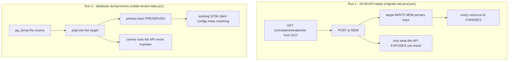
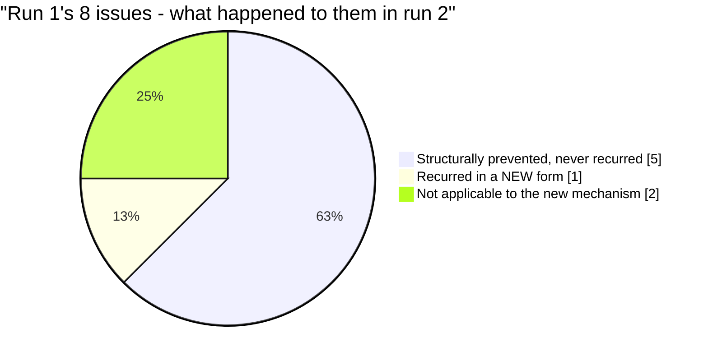
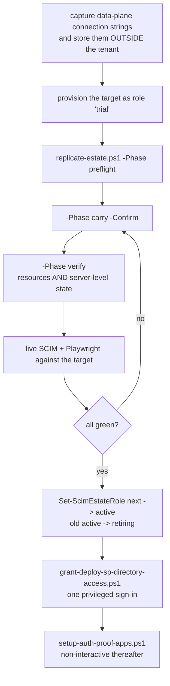

# Tenant Migration: 2026-05-19 versus 2026-08-12

> **Status:** Analysis - **Created:** 2026-08-13 - **Last verified:** 2026-08-13 - **Repo version at capture:** `api/package.json` = `0.55.6`
>
> Compares the two cross-tenant migrations this project has performed, so the third one starts from evidence rather than memory. Companions: [NEW_TENANT_DEPLOY_RCA_2026-05-19.md](NEW_TENANT_DEPLOY_RCA_2026-05-19.md) (first run), [TENANT_09_MIGRATION_PLAN.md](TENANT_09_MIGRATION_PLAN.md) and [TENANT_09_MIGRATION_EXECUTION_ISSUES_AND_RCA.md](TENANT_09_MIGRATION_EXECUTION_ISSUES_AND_RCA.md) (second run).

---

## 1. Why this comparison exists

The dev and canary-prod estates live on an **ephemeral** Azure AD tenant. It expires roughly every 80 days, so this is not an incident - it is a **scheduled, recurring operation** that will happen four to five times a year.

Two runs have now completed. They were solved differently, hit almost entirely different problems, and only one of the eight issues from the first run recurred. That pattern is the most important thing in this document: **a migration RCA does not generalise on its own.** The first run's fixes were real and they held; the second run simply failed somewhere else. Only mechanisms that were made structural carried over.

| | **Run 1** | **Run 2** |
|---|---|---|
| Date | 2026-05-19 | 2026-08-11 to 08-13 |
| Route | `yellowsmoke-af7a3fff` -> `proudbush-ae90986e` | `proudbush-ae90986e` -> `purplecliff-91e4026d` |
| Tenant | 07 -> 08 (`f08e6aff`) | 08 -> 09 (`9751e42f`) |
| **Mechanism** | **SCIM API replay** | **PostgreSQL dump/restore** |
| Data carried | 36 endpoints / 297 users / 40 groups | 58 endpoints / 728 + 734 users / 347 groups per estate |
| Resource IDs | **regenerated** | **preserved** |
| Issues recorded | 8 | 14 |
| Live SCIM result | 1005/1005 | 1387/1387, then 1401/1401 after v0.55.6 |
| Source tenant at cutover | alive | **ARM expired mid-flight** |

---

## 2. The single biggest change: how the data moved

This is the difference from which most others follow.

**What API replay structurally cannot carry**, regardless of how carefully it is written:

| Not carried by API replay | Consequence |
|---|---|
| Primary keys / resource ids | Every configured SCIM client points at ids that no longer exist |
| Credential `secretEnvelope` | Re-viewable secrets are lost; credentials must be reissued |
| Data encryption keys (DEKs) | Anything wrapped by them is unrecoverable |
| JWKS host allow-list | A security control reverts to defaults |
| Server settings | Operator configuration silently resets |

Run 1 accepted that cost because it was migrating 36 endpoints and the estate was young. Run 2 could not: 58 endpoints with live ISV configurations were pointing at specific ids.

**But the database route has its own failure mode, and it bit.** A dump/restore carries every table it is pointed at - and *only* every table it is pointed at. The separate mirroring script, [mirror-prod-to-dev.ts](../api/src/scripts/mirror-prod-to-dev.ts), enumerated resource models by hand and omitted DEKs, JWKS hosts and server settings. So run 2 lost the same class of state run 1 would have lost, by a different route, and did not notice because every verification was resource-shaped.

---

## 3. Issue-by-issue: what recurred, what was prevented, what was new

### 3.1 Run 1 issues that were structurally prevented

| Run 1 issue | Why it could not recur |
|---|---|
| **P3009 Prisma baseline failure** (extensions not allow-listed) | `deploy-azure.ps1` gained an idempotent `azure.extensions` + restart block. It ran, it worked, nobody thought about it. |
| **One Container Apps environment per subscription per region** | The single-environment topology was reproduced deliberately in run 2. |
| **Cross-RG environment reference** | Run 2 made it *declarative* rather than remembered: [infra/containerapp.bicep](../infra/containerapp.bicep) gained an optional `environmentResourceId` parameter. |
| **PowerShell case-insensitive variable shadow** | The offending local was renamed in run 1 and stayed renamed. |
| **`$` in a generated password breaking `cmd.exe`** | The charset fix held. |

This is the good news, and it is worth naming precisely: **every one of these was fixed by changing a script, not by writing a warning.** The four issues fixed structurally in run 1 cost zero time in run 2.

### 3.2 The one that recurred - and it had been written down

| | |
|---|---|
| **Run 1** | `azure.extensions` had to include `citext, pg_trgm, pgcrypto` or `prisma migrate deploy` failed with P3009. Fixed in `deploy-azure.ps1`. |
| **Between runs** | A drift was noticed and logged as gap **G9**, severity **Low**, with an explicit prediction: *"a migration depending on `uuid-ossp` would pass prod and fail dev"*. |
| **Run 2** | It broke the canary-prod carry. `pg_dump` of a source that HAS the extension emits `CREATE EXTENSION "uuid-ossp"`, which Azure rejects against a target that does not allow-list it. |
| **The twist** | It failed in the **opposite direction** to the prediction. The dev carry succeeded and prod failed, on identical code, because the two *sources* had different extension sets. A **data**-specific fault presented as an **environment**-specific one, which sent the investigation the wrong way. |

**Lesson: severity must reflect blast radius when a risk fires, not the probability that it will.** A Low-severity row that explicitly predicts a migration failure is not Low. It sat for two weeks with no owner and no gate.

Now closed properly: the deploy script provisions the **superset** `CITEXT,PG_TRGM,PGCRYPTO,UUID-OSSP`, so a dump from any estate restores into any other, and `replicate-estate.ps1` checks it in preflight.

### 3.3 What was genuinely new in run 2

Fourteen issues, of which these had no analogue in run 1:

| # | New in run 2 | Why run 1 never saw it |
|---|---|---|
| **N1** | **The source tenant's ARM expired mid-migration** (`AADSTS5000229`) | Run 1's source was alive throughout. Run 2 crossed the expiry boundary. |
| **N2** | **Server-level state lost while every count matched** | Run 1 re-created everything through the API, so it never had the illusion of a faithful copy. Run 2's copy was faithful for resources and silently not for singletons. |
| **N3** | **Percent-encoding in generated passwords needing opposite handling per estate** | Run 1 never embedded a password in a URI passed to libpq. |
| **N4** | **A 0-byte `pg_dump` restoring with `rc=0`** | Run 1 had no dump step. |
| **N5** | **`az` extensions living under `AZURE_CONFIG_DIR`** | Run 1 predates the isolated per-tenant CLI profiles. |
| **N6** | **Two subscriptions sharing the display name `ProvIAM_Subscription`** | Run 1 had one ProvIAM subscription. |
| **N7** | **The deployment SP having no Microsoft Graph rights** | Run 1 created app registrations interactively and did not notice the boundary. |
| **N8** | **Conditional Access blocking the device-code flow** (`AADSTS530035`) | Not attempted in run 1. |
| **N9** | **A bulk find-and-replace corrupting the tenant registry itself** | Run 1's repo had far fewer hardcoded estate references. |

**N1 produced the most transferable single fact in either run:**

> **Subscription expiry kills the ARM control plane but NOT the PostgreSQL data plane.**

The estate could not be listed, scaled or exported, yet `pg_dump` kept working over the public endpoint with no Azure credentials involved. Recovery was possible only because the connection strings had been captured *before* the boundary and stored outside the tenant. The corollary is uncomfortable: the old estates **are still serving today** and cannot be stopped, patched or deleted.

---

## 4. What run 1 covered that run 2 did not have to redo

Worth stating explicitly, because it is the return on run 1's investment:

- **Provisioning worked first time.** `deploy-azure.ps1` with its extension block, `-AcrLoginServer`, `-ImageRepository` and `-PgServerName` parameters provisioned both estates without a single provisioning defect.
- **The single-environment / cross-RG topology was known**, so the quota limit was designed around rather than discovered.
- **`az-tenant.ps1` already existed**, so two tenants could be authenticated simultaneously from the first minute.
- **The blue/green promotion path already existed**, so bringing the canary to v0.55.6 was routine.

---

## 5. What neither run covered until now

| Gap | Present in run 1? | Present in run 2? | Closed by |
|---|---|---|---|
| An estate **registry** - somewhere to say where the estates are | no | no | [scripts/scim-estates.json](../scripts/scim-estates.json) |
| **Role-based** addressing instead of hardcoded names | no | no | [scripts/scim-estates.ps1](../scripts/scim-estates.ps1) |
| FQDNs **derived** rather than stored | no | no | `Get-ScimEstateFqdn` |
| A gate on the **registry's own integrity** | no | no | [scripts/test-scim-estates.ps1](../scripts/test-scim-estates.ps1), 9 checks all proven to fire |
| **Server-level** state verification | no | no | `replicate-estate.ps1` verify phase |
| A **repeatable** migration procedure | partial (`migrate-old-prod.ps1`, API-level) | partial (`rotate-tenant-data.ps1`, DB-level) | [scripts/replicate-estate.ps1](../scripts/replicate-estate.ps1) |
| **Non-interactive directory** work | no | no | [scripts/grant-deploy-sp-directory-access.ps1](../scripts/grant-deploy-sp-directory-access.ps1) |
| Scripted **auth-proof identities** | no | no | [scripts/setup-auth-proof-apps.ps1](../scripts/setup-auth-proof-apps.ps1) |

The middle rows are the interesting ones. Both runs verified **resources** thoroughly and **neither** verified **server-level singletons**, because a resource-count mindset simply does not reach them. It took a copy that preserved every id and every count to expose it.

---

## 6. Learnings

### L1. A fix only carries forward if it is structural

Five of run 1's eight issues never recurred, and every one of those five was fixed by editing a script. The one that recurred had been fixed *in prose* - written down as a gap with a severity rating and no owner.

### L2. Severity is blast radius, not probability

Gap G9 was rated Low, predicted a migration failure, and caused one. Rate a risk by what happens when it fires.

### L3. Verification inherits the shape of the thing you are verifying

Counting endpoints, counting users and walking per-endpoint surfaces is a **resource-shaped** verification. It cannot see a server-level singleton, so a security-relevant allow-list reverted to default with every gate green. **Ask what class of state your checks cannot see.**

### L4. A control plane and a data plane fail independently

Expiry killed ARM and left PostgreSQL serving. Capture data-plane connection strings before any lifecycle boundary and store them outside the resource being retired.

### L5. Presence is not outcome, and it is easiest to get wrong in your own new code

This bit three times in run 2, each in freshly written code:

| Where | What it claimed | What was true |
|---|---|---|
| `setup-auth-proof-apps.ps1` | "service principal created" | 2 of 3 had none |
| `setup-auth-proof-apps.ps1` | "client secret issued" | all 3 were empty |
| `audit-deployment-doc.ps1` C4 | PASS | the token was unset; all 3 estates 401'd and the failure was classified "skipped" |

The corrective pattern is the same each time: **announce a checked result, never an attempted action.** The scripts now acquire a real token and read state back.

### L6. A name that encodes a fact which expires is a scheduled defect

`SCIMServer-Calmsand-WIF` named an estate it never belonged to. `acrscimsrv09`, `scimserver-pg-09` encode a tenant generation that dies in ~80 days. New identities use generation-free names.

### L7. Eventual consistency needs retries, not optimism

Entra rejected `az ad sp create` and `az ad app credential reset` immediately after `az ad app create`. Directory writes need retry-plus-verify.

### L8. Bulk find-and-replace is a defect generator at this scale

97 replacements across 28 files corrupted the one file whose job was to hold two identities apart, and no gate could catch it. **The fix is to remove the need for the bulk edit**, which is what the estate registry does.

### L9. Corporate policy shapes the toolchain

Device-code sign-in is blocked by Conditional Access even for a Global Administrator on a compliant device. Reach for the browser flow first on a managed device.

---

## 7. What the third migration should look like

**Step P0 is the one that is easy to skip and impossible to recover from.** Everything else can be retried.

The estimate for run 3 is materially lower than run 2, because provisioning, carrying, verifying, role cutover, directory access and proof identities are now all scripted, and the 97-replacement bulk edit is gone entirely.

---

## 8. Self-improvement disposition

**What this analysis revealed that the rule set did not cover:** nothing required both runs to be compared, so run 1's lessons were available only to whoever remembered them. This document is the fix, and it is written to be extended by run 3 rather than replaced.

**Disposition: (a) applied** - the estate registry, its self-test, the replication orchestrator, the server-level verification, non-interactive directory access and the scripted proof identities all shipped alongside this analysis. **(b) scheduled** - proving `replicate-estate.ps1` against a throwaway `trial` estate end to end, and the calmsand trial replication that would surface customer-prod-specific behaviour.
