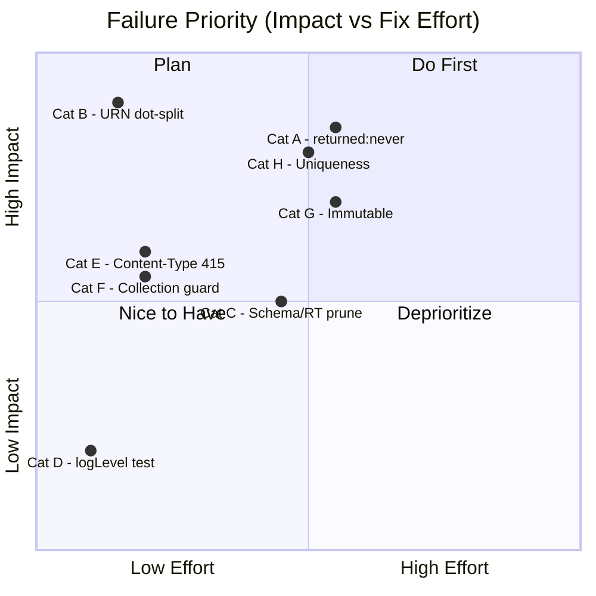

# Test Failure Analysis — v0.28.0

> **Date**: 2026-03-14  
> **Scope**: Unit tests · E2E tests · Live integration tests  
> **Author**: Automated analysis

---

## Executive Summary

| Suite | Total | Passed | Failed | Skipped |
|-------|------:|-------:|-------:|--------:|
| **Unit** | 2 844 (73 suites) | 2 844 | **0** | 0 |
| **E2E** | 677 (31 suites) | 665 | **6** | 6 |
| **Live** | 604 | 591 | **13** | — |
| **Total** | **4 125** | **4 100** | **19** | 6 |

All 19 failures trace to **8 distinct root causes** across 5 categories.
Unit tests are fully green.

---

## Architecture Diagram — Failure Hotspots

```mermaid
graph TD
    subgraph "E2E Failures (6)"
        E1["Cat A — returned:never<br/>not stripped for<br/>custom extensions (2)"]
        E2["Cat B — PATCH URN<br/>dot-split corruption (2)"]
        E3["Cat C — Admin PATCH<br/>schema/RT mismatch (2)"]
    end

    subgraph "Live Failures (13)"
        L1["Cat D — logLevel<br/>clearing assertion (1)"]
        L2["Cat E — Content-Type<br/>negotiation 415 (2)"]
        L3["Cat F — Collection<br/>PUT/PATCH guard (2)"]
        L4["Cat G — Immutable<br/>enforcement gap (2)"]
        L5["Cat H — Uniqueness<br/>collision + required (6)"]
    end

    E1 --> RC1["ScimServiceHelpers uses<br/>global SchemaRegistry only"]
    E2 --> RC2["resolveNoPathValue splits<br/>URN dots as nested paths"]
    E3 --> RC3["mergeProfilePartial replaces<br/>schemas without pruning RTs"]
    L1 --> RC4["Test asserts config.logLevel<br/>is null after unrelated PATCH"]
    L2 --> RC5["No Content-Type guard<br/>middleware (RFC 7644 §3.1)"]
    L3 --> RC6["No collection-level<br/>route guard"]
    L4 --> RC7["InMemory backend doesn't<br/>enforce immutable attrs"]
    L5 --> RC8["InMemory backend doesn't<br/>enforce uniqueness on PUT/PATCH"]

    style E1 fill:#fdd,stroke:#c33
    style E2 fill:#fdd,stroke:#c33
    style E3 fill:#fdd,stroke:#c33
    style L1 fill:#fec,stroke:#a70
    style L2 fill:#fec,stroke:#a70
    style L3 fill:#fec,stroke:#a70
    style L4 fill:#fec,stroke:#a70
    style L5 fill:#fec,stroke:#a70
```



---

## Category A — `returned:never` Not Stripped for Custom Extension Attributes

### Failing Tests (2)

| # | Test Name | File | Line |
|---|-----------|------|------|
| A1 | `should create user with extension data` | `profile-combinations.e2e-spec.ts` | 140 |
| A2 | `should roundtrip extension data on GET` | `profile-combinations.e2e-spec.ts` | 149 |

### Symptom

Custom extension schema defines `secretToken` with `returned: 'never'` and `mutability: 'writeOnly'`.
The attribute appears verbatim in POST and GET responses:

```
Expected: undefined
Received: "secret123"
```

### Root Cause

`ScimServiceHelpers.getSchemaDefinitions()` queries the **global** `ScimSchemaRegistry` singleton,
which is initialized once from the `rfc-standard` preset during `onModuleInit()`:

```typescript
// scim-service-helpers.ts:595
getSchemaDefinitions(endpointId?: string): SchemaDefinition[] {
  const coreSchema = this.schemaRegistry.getSchema(this.coreSchemaUrn);
  // ...
  const extUrns = this.schemaRegistry.getExtensionUrns();  // ← global only
  // ...
}
```

The global registry knows only about standard URNs
(`urn:ietf:params:scim:schemas:extension:enterprise:2.0:User`).
Custom extension schemas defined in an endpoint's profile (e.g.
`urn:test:scim:extension:hr:2.0:User`) are **never registered**
in the global `ScimSchemaRegistry`.

Therefore `collectReturnedCharacteristics()` never discovers
`secretToken` as `returned:'never'`, and the stripping logic
in `toScimUserResource()` / `toScimGroupResource()` skips it.

### Resolution Options

| Option | Description | Effort | Risk |
|--------|-------------|--------|------|
| **A — Per-endpoint schema overlay** | Pass the endpoint's profile schemas to `getReturnedCharacteristics()` alongside the global defaults. Merge before collecting. | Medium | Low |
| **B — Profile-aware SchemaRegistry** | Make `ScimSchemaRegistry` endpoint-aware: store per-endpoint schema maps, look up by `endpointId`. | High | Medium |
| **C — Inline strip in toScimResource** | After building the response, iterate over profile extension schemas and strip any attribute where `returned === 'never'`. No registry change needed. | Low | Low |

**Recommended**: Option C for a quick fix, then Option A for architectural consistency.

---

## Category B — PATCH URN Dot-Split Corruption

### Failing Tests (2)

| # | Test Name | File | Line |
|---|-----------|------|------|
| B1 | `should PATCH replace extension attribute` (User) | `profile-combinations.e2e-spec.ts` | 165 |
| B2 | `should PATCH Group extension attribute` | `profile-combinations.e2e-spec.ts` | 588 |

### Symptom

A no-path PATCH replace with a custom extension URN value:

```json
{
  "op": "replace",
  "value": { "urn:test:scim:extension:hr:2.0:User": { "badgeNumber": "B99999" } }
}
```

Returns **200 OK** but the response contains the **original** value (`"B12345"`).

### Root Cause (Confirmed via Debug Logging)

In `resolveNoPathValue()` (`scim-patch-path.ts:399`), the no-path merge iterates over
the value object's keys. The key `"urn:test:scim:extension:hr:2.0:User"` follows this path:

1. `isExtensionPath(key, extensionUrns)` → **false** (custom URN not in the global extension list)
2. `key.includes('.')` → **true** (the `.` in version `2.0`)
3. Falls into the **dot-notation** branch, which splits on the first `.`:
   - `parentAttr` = `"urn:test:scim:extension:hr:2"` 
   - `childAttr` = `"0:User"`
4. Creates a **corrupted** nested object:

```json
{
  "urn:test:scim:extension:hr:2.0:User": { "badgeNumber": "B12345", ... },  // ← untouched original
  "urn:test:scim:extension:hr:2": { "0:User": { "badgeNumber": "B99999" } } // ← corrupted new key
}
```

The original extension object is never updated; a garbage sibling key is created instead.

### Resolution Options

| Option | Description | Effort | Risk |
|--------|-------------|--------|------|
| **A — URN guard before dot-split** | Add `key.startsWith('urn:')` check before the `key.includes('.')` branch. URN keys go directly to `rawPayload[key] = value`. | **Low** | **Low** |
| **B — Extension-aware merge** | Pass the endpoint's profile extension URNs to the patch engine so `isExtensionPath` can recognize them. | Medium | Low |
| **C — Both A + B** | Guard URN dots AND make the extension list endpoint-aware. | Medium | Low |

**Recommended**: Option A is a 1-line fix:

```typescript
// scim-patch-path.ts — resolveNoPathValue()
} else if (!key.startsWith('urn:') && key.includes('.')) {
    // Dot-notation: name.givenName → update nested object
```

---

## Category C — Admin PATCH Schema Replacement Rejects Due to RT Mismatch

### Failing Tests (2)

| # | Test Name | File | Line |
|---|-----------|------|------|
| C1 | `should replace schemas via partial profile PATCH` | `profile-combinations.e2e-spec.ts` | 836 |
| C2 | `should update schemas + settings in one PATCH` | `profile-combinations.e2e-spec.ts` | 910 |

### Symptom

```
expected 200 "OK", got 400 "Bad Request"
```

### Root Cause

`mergeProfilePartial()` in `endpoint.service.ts:413–428` replaces the `schemas` array but 
**preserves the existing `resourceTypes`** array:

```typescript
if (partial.schemas !== undefined) {
  merged.schemas = partial.schemas;   // ← replaced
}
// resourceTypes: NOT replaced  ← keeps old RTs referencing removed schemas
```

After merge, `validateAndExpandProfile(merged)` runs structural validation (`validateStructure()`),
which checks that every `resourceType.schema` and `resourceType.schemaExtensions[].schema`
exists in `schemas[]`. When schemas are replaced without also replacing RTs, dangling references cause:

- **C1**: Sends `schemas: [User]` only → Group RT still references `core:2.0:Group` → `RT_MISSING_SCHEMA`
  and User RT still has `enterprise:2.0:User` extension → `RT_MISSING_EXTENSION_SCHEMA`
- **C2**: Sends `schemas: [User, Group]` → User RT still has `enterprise:2.0:User` extension → 
  `RT_MISSING_EXTENSION_SCHEMA`

### Resolution Options

| Option | Description | Effort | Risk |
|--------|-------------|--------|------|
| **A — Auto-prune RTs on schema replace** | When `schemas` are replaced, auto-prune `resourceTypes` to only those whose `schema` exists in the new set, and strip `schemaExtensions` referencing missing schemas. | Medium | Medium |
| **B — Require RTs alongside schemas** | If `partial.schemas` is provided, require `partial.resourceTypes` too. Reject with 400 if only schemas are sent. | Low | Low |
| **C — Fix the tests** | The tests assume schemas can be replaced independently. If this is intentionally forbidden, update the tests to also send matching `resourceTypes`. | Low | Low |

**Recommended**: Option A (auto-prune) for best UX, or Option C if the current
strict validation is intentional behavior.

---

## Category D — logLevel Clearing Assertion

### Failing Tests (1)

| # | Test Name | Section |
|---|-----------|---------|
| D1 | `Endpoint config no longer has logLevel` | Admin config tests |

### Symptom

After PATCHing an endpoint's config with `strictMode=$true` (no `logLevel`), the test asserts
`$clearedEndpoint.config.logLevel -eq $null`. The assertion fails because `config.logLevel`
still has the previously-set value.

### Root Cause

The endpoint PATCH uses deep-merge semantics for `config`/`settings`. Setting other config
properties does **not** clear `logLevel` — it's additive. The test assumes that omitting
`logLevel` from a PATCH body clears it, but the service only merges provided keys.

### Resolution Options

| Option | Description | Effort |
|--------|-------------|--------|
| **A — Fix test** | Explicitly send `logLevel: null` in the PATCH to clear it. | Low |
| **B — Add clear semantics** | Support `null` values in config PATCH to explicitly remove keys. | Medium |

**Recommended**: Option A.

---

## Category E — Content-Type Negotiation (415)

### Failing Tests (2)

| # | Test Name | Section |
|---|-----------|---------|
| E1 | `9w.1: POST /Users with text/xml returns 415` | 9w |
| E2 | `9w.2: POST /Users with text/plain returns 415` | 9w |

### Symptom

Sending `POST /Users` with `Content-Type: text/xml` or `text/plain` does not return
`415 Unsupported Media Type`.

### Root Cause

The NestJS application does not have a Content-Type validation middleware or guard
that enforces RFC 7644 §3.1:

> *"Requests that include the body MUST have the "Content-Type" header
> indicating "application/scim+json" or "application/json"."*

The Express JSON body parser accepts any content type by default and either
parses it as JSON (if valid) or rejects it with a body-parse error, but never
returns a semantic 415 status.

### Resolution Options

| Option | Description | Effort |
|--------|-------------|--------|
| **A — Content-Type guard middleware** | Add an Express middleware that checks `Content-Type` for POST/PUT/PATCH and returns 415 if not `application/json` or `application/scim+json`. | Low |
| **B — NestJS interceptor** | Global interceptor that validates Content-Type on mutation requests. | Low |

**Recommended**: Option A — a simple middleware before the JSON parser.

---

## Category F — Collection-Level PUT/PATCH Guard

### Failing Tests (2)

| # | Test Name | Section |
|---|-----------|---------|
| F1 | `9w.5: PUT /Users (collection) returns (expected 404/405)` | 9w |
| F2 | `9w.6: PATCH /Users (collection) returns` | 9w |

### Symptom

`PUT /Users` and `PATCH /Users` (no resource ID) do not return 404 or 405.

### Root Cause

The NestJS route table has wildcard/catchall routes that accept
PUT/PATCH on the collection path (`/Users`) instead of requiring a resource ID segment.
RFC 7644 §3.5.1 requires `PUT` and `PATCH` to target a specific resource, not a collection.

### Resolution Options

| Option | Description | Effort |
|--------|-------------|--------|
| **A — Explicit route guards** | Add route parameter validation requiring `:id` segment for PUT/PATCH. Return 404 if the ID param is missing or if a collection endpoint is hit. | Low |
| **B — NestJS guard** | A global guard that validates the HTTP method against the route path pattern. | Medium |

**Recommended**: Option A.

---

## Category G — Immutable Attribute Enforcement (InMemory)

### Failing Tests (2)

| # | Test Name | Section |
|---|-----------|---------|
| G1 | `9w.10: PUT changing immutable employeeNumber returns 400` | 9w |
| G2 | `9w.12: PATCH changing immutable employeeNumber returns 400` | 9w |

### Symptom

Changing the immutable `employeeNumber` field via PUT or PATCH succeeds instead of
returning 400.

### Root Cause

Immutable attribute enforcement (RFC 7643 §2.2: `mutability: "immutable"` — value cannot
be changed after initial creation) relies on `SchemaHelpers.checkImmutableAttributes()`,
which uses schema definitions from the global `ScimSchemaRegistry`. In the in-memory
backend under live test conditions, the `employeeNumber` attribute's immutable characteristic
is defined in the Enterprise User extension schema. However, the inmemory SCIM service
helpers may not properly resolve immutable attributes for extension schemas, or the
enforcement code path may have a gap for extension-namespace attributes in PATCH operations.

This is closely related to **Category A** — the global schema registry doesn't include
endpoint-specific extension attribute characteristics.

### Resolution Options

| Option | Description | Effort |
|--------|-------------|--------|
| **A — Fix schema resolution** | Same fix as Cat A — make immutable attribute detection endpoint-profile-aware. | Medium |
| **B — Inline immutable check** | After building the PATCH result, compare extension namespace values against the original and reject changes to immutable fields. | Medium |

**Recommended**: Fix alongside Category A.

---

## Category H — Uniqueness Collision + Required Attribute Enforcement (InMemory)

### Failing Tests (6)

| # | Test Name | Section |
|---|-----------|---------|
| H1 | `9x.1: PUT userName collision returns 409` | 9x |
| H2 | `9x.2: PUT externalId collision returns 409` | 9x |
| H3 | `9x.4: PUT case-insensitive userName collision returns 409` | 9x |
| H4 | `9x.5: PATCH userName collision returns 409` | 9x |
| H5 | `9x.6: PATCH externalId collision returns 409` | 9x |
| H6 | `9x.8: PUT missing required userName returns 400` | 9x |

### Symptom

- **H1–H5**: PUT/PATCH that would create a `userName` or `externalId` collision with another
  user succeeds instead of returning 409 Conflict.
- **H6**: PUT without the required `userName` field succeeds instead of returning 400.

### Root Cause

The in-memory backend's `assertUniqueIdentifiersForEndpoint()` method handles POST
uniqueness correctly (409 on create), but the **PUT and PATCH paths** may not be
calling this check consistently. The live test creates users under one endpoint
and then attempts collisions via PUT/PATCH, which the in-memory service fails
to catch.

For **H6**, the in-memory backend doesn't validate required attributes on PUT —
it relies on strict schema validation, which is only enabled when
`StrictSchemaValidation = True`. The live test endpoint may not have it enabled.

### Resolution Options

| Option | Description | Effort |
|--------|-------------|--------|
| **A — Ensure PUT/PATCH uniqueness checks** | Verify `assertUniqueIdentifiersForEndpoint()` is called in the PUT and PATCH flows for the inmemory backend, with the correct `excludeScimId` parameter. | Medium |
| **B — Required field validation** | Add `userName` presence validation in the PUT path independent of strict schema validation (RFC 7643 §7: `userName` is defined as `required`). | Low |

**Recommended**: Both A and B.

---

## Priority Matrix



---

## Recommended Fix Order

| Priority | Category | Tests Fixed | Effort | Description |
|:--------:|----------|:-----------:|--------|-------------|
| 1 | **B** — URN dot-split | 2 | 1 line | Add `!key.startsWith('urn:')` guard in `resolveNoPathValue` |
| 2 | **A** — returned:never | 2 | ~50 lines | Pass profile schemas to `getReturnedCharacteristics` |
| 3 | **H** — Uniqueness | 6 | ~30 lines | Ensure PUT/PATCH call uniqueness checks + required validation |
| 4 | **G** — Immutable | 2 | ~20 lines | Fix extension immutable enforcement (shared with A) |
| 5 | **E** — Content-Type | 2 | ~15 lines | Add Content-Type guard middleware |
| 6 | **F** — Collection guard | 2 | ~10 lines | Add route validation for PUT/PATCH collection endpoints |
| 7 | **C** — Schema/RT prune | 2 | ~40 lines | Auto-prune RTs when schemas replaced, or fix tests |
| 8 | **D** — logLevel test | 1 | 1 line | Fix live test to explicitly send `logLevel: null` |

---

## Appendix — Test Execution Commands

```powershell
# Unit tests (all pass)
cd api; npx jest --passWithNoTests

# E2E tests (6 failures in profile-combinations)
cd api; npx jest --config test/e2e/jest-e2e.config.ts

# Live tests (13 failures)
cd api; npm run build
# Terminal 1: Start server
$env:PERSISTENCE_BACKEND="inmemory"; $env:JWT_SECRET="localjwtsecret123"
$env:SCIM_SHARED_SECRET="local-secret"; $env:OAUTH_CLIENT_SECRET="localoauthsecret123"
$env:PORT="6000"; node dist/main.js
# Terminal 2: Run tests
cd scripts; pwsh -File .\live-test.ps1 -ClientSecret "localoauthsecret123"
```

---

## Version History

| Date | Change |
|------|--------|
| 2026-03-14 | Initial analysis — 19 failures across 8 root causes |
