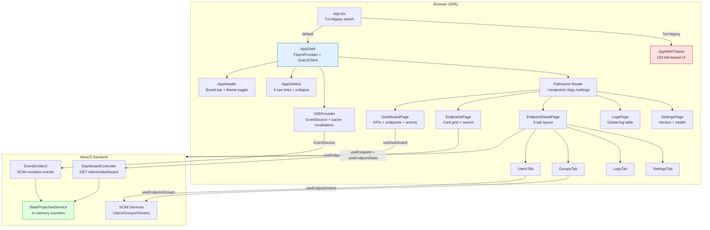
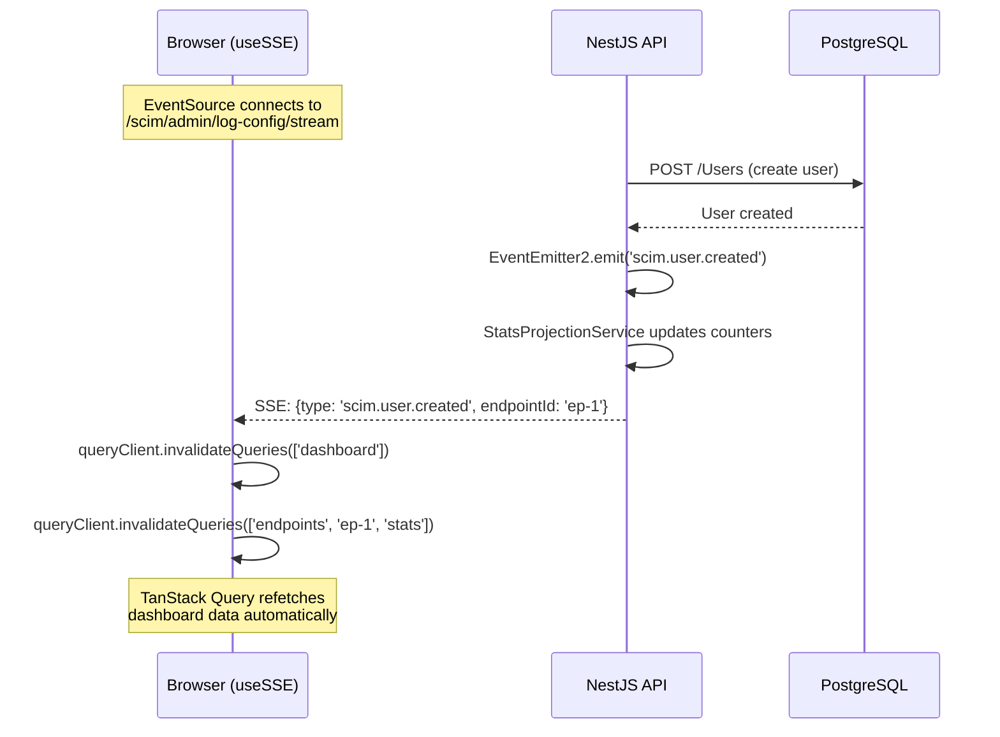
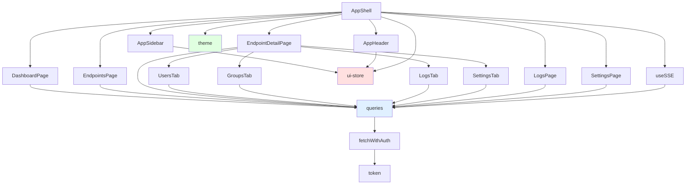

# SCIMServer UI Guide - v0.41.0

> **Status:** Active | **Last Updated:** 2026-05-04 | **Version:** 0.41.0  
> New Fluent UI v9 is the **default**. Legacy tab-based UI available via `?ui=legacy`.

---

## Table of Contents

1. [Quick Start](#1-quick-start)
2. [Architecture Overview](#2-architecture-overview)
3. [App Shell Layout](#3-app-shell-layout)
4. [Dashboard Page](#4-dashboard-page)
5. [Endpoints Page](#5-endpoints-page)
6. [Endpoint Detail Page](#6-endpoint-detail-page)
7. [Global Logs Page](#7-global-logs-page)
8. [Global Settings Page](#8-global-settings-page)
9. [Theme System](#9-theme-system)
10. [Responsive Design](#10-responsive-design)
11. [Real-Time Updates (SSE)](#11-real-time-updates-sse)
12. [Legacy UI (?ui=legacy)](#12-legacy-ui-uilegacy)
13. [Data Flow & Caching](#13-data-flow--caching)
14. [State Management](#14-state-management)
15. [Accessibility](#15-accessibility)
16. [Component Reference](#16-component-reference)
17. [Screenshot Inventory](#17-screenshot-inventory)
18. [Test Coverage](#18-test-coverage)

---

## 1. Quick Start

### Accessing the UI

| Environment | URL | Auth |
|-------------|-----|------|
| **Dev** | `https://scimserver-dev.yellowrock-b029dcc6.westus2.azurecontainerapps.io` | Bearer token: `changeme-scim` |
| **Prod** | `https://scimserver2.yellowsmoke-af7a3fff.eastus.azurecontainerapps.io` | Bearer token: configured secret |
| **Local** | `http://localhost:6000` (API) / `http://localhost:5173` (Vite dev) | Bearer token: `local-secret` |

### UI Modes

```
Default (no query param)  -->  New Fluent UI (AppShell + Sidebar + Pages)
?ui=legacy                -->  Old tab-based UI (preserved for one release cycle)
?ui=next                  -->  New Fluent UI (alias, same as default)
```

---

## 2. Architecture Overview



### Technology Stack

| Layer | Technology | Why |
|-------|-----------|-----|
| **Design System** | Fluent UI React v9 | Target audience (Entra admins) uses Microsoft products; zero cognitive friction |
| **Server State** | TanStack Query v5 | SWR caching, dedup, background refetch, optimistic mutations |
| **Client State** | Zustand | 1KB, zero boilerplate; only 3 values (theme, sidebar, command palette) |
| **Real-Time** | SSE (EventSource) | Uni-directional server-push; auto-reconnect with exponential backoff |
| **Routing** | Pathname-based (inline) | Simple regex matching; TanStack Router available for future type-safe routes |
| **Build** | Vite 8 + React 19 | HMR, ESM, production build at 485KB (142KB gzipped) |
| **Testing** | Vitest + Playwright | 233 unit tests + 42 E2E tests with 59 screenshots |
| **Icons** | @fluentui/react-icons | Consistent with Fluent design system |

---

## 3. App Shell Layout

The app shell provides a consistent three-zone layout across all pages.

```
+---------------------------------------------------+
|              AppHeader (48px)                      |
|  [ SCIMServer ]                    [ Theme Toggle ]|
+--------+------------------------------------------+
|        |                                          |
| Sidebar|           Main Content                   |
| (240px)|           (flex: 1)                      |
|  or    |                                          |
| (48px) |    [ DashboardPage / EndpointsPage /     |
|        |      EndpointDetailPage / LogsPage /     |
|        |      SettingsPage ]                      |
|        |                                          |
| [Home] |                                          |
| [Endpt]|                                          |
| [Logs] |                                          |
| [Sett] |                                          |
|        |                                          |
| [<->]  |                                          |
+--------+------------------------------------------+
```

### Screenshots

| State | Screenshot | Description |
|-------|------------|-------------|
| Expanded sidebar | `01b-new-ui-sidebar-expanded.png` | Full 240px sidebar with text labels + icons |
| Collapsed sidebar | `01c-new-ui-sidebar-collapsed.png` | Minimal 48px sidebar with icons only + tooltips |
| Header | `01a-new-ui-header.png` | Brand-colored header bar with title and theme toggle |

### Sidebar Navigation

| Icon | Label | Route | Active When |
|------|-------|-------|-------------|
| Home | Dashboard | `/` | Exact match `/` |
| Server | Endpoints | `/endpoints` | Starts with `/endpoints` |
| Document | Logs | `/logs` | Starts with `/logs` |
| Settings | Settings | `/settings` | Starts with `/settings` |

The active nav item shows `aria-current="page"` and a highlighted background via the `navItemActive` style class.

---

## 4. Dashboard Page

**Route:** `/` (default)  
**Data source:** `GET /scim/admin/dashboard` via `useDashboard()` (30s stale time)  
**DB queries:** 0 for stats (in-memory `StatsProjectionService`), 1 for endpoints, 1 for recent logs

### Screenshot: `02-new-ui-dashboard-full.png`

### Layout

```
+--------------------------------------------------+
| [ Endpoints: 2 ] [ Users: 50 ] [ Groups: 5 ] [ Healthy ] |  <-- KPI Row
+--------------------------------------------------+
| Endpoints                                        |
| +-------------+  +-------------+                 |
| | Production  |  | Development |                 |  <-- Endpoint Grid
| | Active      |  | Active      |                 |
| | 30 users    |  | 20 users    |                 |
| | 3 groups    |  | 2 groups    |                 |
| +-------------+  +-------------+                 |
+--------------------------------------------------+
| Recent Activity                                  |
| POST  /Users      201  42ms                      |  <-- Activity Feed
| GET   /Users      200  15ms                      |
| PATCH /Users/abc  200  28ms                      |
+--------------------------------------------------+
```

### KPI Cards

| Card | Icon | Data Source | Update Frequency |
|------|------|-------------|-----------------|
| Endpoints | Server | `stats.totalEndpoints` | 30s (query stale) + SSE-invalidated |
| Total Users | People | `stats.totalUsers` | Same |
| Total Groups | People Team | `stats.totalGroups` | Same |
| Status | Checkmark Circle | `health.status` | Same |

### Method Badges (Activity Feed)

| Method | Color | Fluent Badge Color |
|--------|-------|-------------------|
| GET | Blue | `brand` |
| POST | Green | `success` |
| PUT | Orange | `warning` |
| PATCH | Orange | `warning` |
| DELETE | Red | `danger` |
| Other | Gray | `informative` |

---

## 5. Endpoints Page

**Route:** `/endpoints`  
**Data source:** `GET /scim/admin/endpoints` via `useEndpoints()` (30s stale time)

### Screenshot: `03-new-ui-endpoints-page.png`

### Features
- **Search filter**: Client-side filter by `name` or `displayName`
- **Card grid**: Auto-fill responsive grid (`minmax(320px, 1fr)`)
- **Each card**: Server icon, name/displayName, active/inactive badge, user/group stat chips
- **Empty state**: "No endpoints configured." or "No matching endpoints." when filtered

### States

| State | Screenshot | Trigger |
|-------|------------|---------|
| Loading | Spinner with "Loading endpoints..." | Initial fetch |
| Error | Error message | API error |
| Populated | Card grid | Endpoints exist |
| No match | "No matching endpoints." | Search has no results |

---

## 6. Endpoint Detail Page

**Route:** `/endpoints/:id`  
**Data sources:** `useEndpoint(id)` + `useEndpointStats(id)`

### Screenshot: `04-new-ui-endpoint-detail.png`

### Layout

```
+--------------------------------------------------+
| Production                          [ Active ]    |  <-- Header: name + badge
| ID: ep-1  SCIM: /scim/endpoints/ep-1/v2          |  <-- Metadata row
+--------------------------------------------------+
| [ Overview ] [ Users ] [ Groups ] [ Logs ] [ Settings ] |  <-- Tab bar
+--------------------------------------------------+
|                Tab Content                        |
+--------------------------------------------------+
```

### Tabs

| Tab | Component | Data Source | Key Features |
|-----|-----------|------------|--------------|
| **Overview** | `OverviewTab` | `useEndpointStats` | 4 KPI cards (Users/Groups/Members/Requests) with counts |
| **Users** | `UsersTab` | `useEndpointUsers` | Data table: userName, displayName, active badge, created date |
| **Groups** | `GroupsTab` | `useEndpointGroups` | Data table: displayName, member count badge, created date |
| **Logs** | `LogsTab` | inline `useQuery` (logs API) | Data table: method badge, URL, status badge, duration, time |
| **Settings** | `SettingsTab` | `useEndpoint` (cached) | Config cards: General (name, path, status) + Flags (key-value badges) |

### Tab Screenshots

| Tab | Screenshot |
|-----|------------|
| Overview | `04a-new-ui-endpoint-overview-tab.png` |
| Users | `04b-new-ui-endpoint-users-tab.png` |
| Groups | `04c-new-ui-endpoint-groups-tab.png` |
| Logs | `04d-new-ui-endpoint-logs-tab.png` |
| Settings | `04e-new-ui-endpoint-settings-tab.png` |

---

## 7. Global Logs Page

**Route:** `/logs`  
**Data source:** `GET /scim/admin/logs?pageSize=50&urlContains=...` (10s stale time)

### Screenshot: `05-new-ui-logs-page.png`

### Features
- **URL search**: Server-side filter via `urlContains` query parameter
- **5-column table**: Method (colored badge), URL (monospace), Status (colored badge), Duration, Time
- **Empty state**: "No logs found."
- **Total count**: Displayed in header as "Request Logs (N)"

---

## 8. Global Settings Page

**Route:** `/settings`  
**Data sources:** `useVersion()` (60s stale) + `useHealth()` (10s stale, 30s refetch interval)

### Screenshot: `06-new-ui-settings-page.png`

### Cards

| Card | Fields | Source |
|------|--------|--------|
| **Server Info** | Version, Node.js, Platform/Arch, Uptime | `GET /scim/admin/version` |
| **Health** | Status (green/red), Uptime | `GET /scim/health` |
| **Storage** | Backend (prisma/inmemory), Provider (postgresql) | `version.storage` |

---

## 9. Theme System

### Fluent UI Brand Tokens

The theme is built on Azure Blue (#0078D4) using Fluent UI's brand ramp system:

| Slot | Hex | Usage |
|------|-----|-------|
| 10 | `#020305` | Darkest background |
| 50 | `#1B3F6C` | Dark accent |
| 90 | `#0078D4` | **Primary brand color** (Azure blue) |
| 130 | `#7CB5E4` | Light accent |
| 160 | `#BFE2F0` | Lightest tint |

### Theme Toggle

The theme toggle button in the header cycles between light and dark modes:

| State | Icon | `aria-label` |
|-------|------|-------------|
| Light mode active | Moon | "Switch to dark mode" |
| Dark mode active | Sun | "Switch to light mode" |

Theme preference is persisted to `localStorage` under key `scim-color-scheme`.

### Screenshots

| Theme | Screenshot | Key Visual Differences |
|-------|------------|----------------------|
| Light | `01d-new-ui-light-theme.png` | White backgrounds, dark text, blue brand bar |
| Dark | `01e-new-ui-dark-theme.png` | Dark gray backgrounds, light text, darker brand bar |
| Light (contrast) | `32a-a11y-contrast-light.png` | Same as light, captured for a11y review |
| Dark (contrast) | `32b-a11y-contrast-dark.png` | Same as dark, captured for a11y review |

---

## 10. Responsive Design

The UI adapts to three viewport tiers:

| Tier | Width | Sidebar | Grid Columns | Screenshot |
|------|-------|---------|-------------|------------|
| **Desktop** | >= 1024px | Expanded (240px) | 3-4 columns | `01b-new-ui-sidebar-expanded.png` |
| **Tablet** | 768-1023px | Auto | 2 columns | `08d-new-ui-tablet-dashboard.png` |
| **Mobile** | < 768px | Collapsed (48px) | 1 column | `08a-new-ui-mobile-dashboard.png` |

### Responsive Screenshots

| Viewport | Page | Screenshot |
|----------|------|------------|
| Mobile (375x812) | Dashboard | `08a-new-ui-mobile-dashboard.png` |
| Mobile (375x812) | Endpoints | `08b-new-ui-mobile-endpoints.png` |
| Mobile (375x812) | Settings | `08c-new-ui-mobile-settings.png` |
| Tablet (768x1024) | Dashboard | `08d-new-ui-tablet-dashboard.png` |

---

## 11. Real-Time Updates (SSE)

The UI subscribes to Server-Sent Events for near-real-time dashboard updates.



### Reconnection Strategy

| Attempt | Delay | Max |
|---------|-------|-----|
| 1 | 1s | - |
| 2 | 2s | - |
| 3 | 4s | - |
| 4 | 8s | - |
| n | min(2^n * 1000, 30000) | 30s |

### Events That Trigger Cache Invalidation

| Event | Caches Invalidated |
|-------|-------------------|
| `scim.user.created` | `dashboard`, `endpoints`, `endpoints/:id`, `endpoints/:id/stats` |
| `scim.user.deleted` | Same |
| `scim.user.updated` | Same |
| `scim.group.created` | Same |
| `scim.group.deleted` | Same |
| `scim.group.updated` | Same |
| `scim.resource.created` | Same |
| `scim.resource.deleted` | Same |

---

## 12. Legacy UI (?ui=legacy)

The old tab-based UI is preserved for one release cycle. Access it by appending `?ui=legacy` to any URL.

### Architecture

The legacy UI uses:
- Plain CSS modules (no design system)
- Manual `fetch` calls (no TanStack Query)
- `useState` / `useEffect` for all state management
- Tab-based navigation (Activity, Database, Logs, Manual)
- 637-line `App.tsx` god component

### Legacy Screenshots

| View | Screenshot |
|------|------------|
| Default (activity) | `10-legacy-ui-full.png` |
| Authenticated | `10a-legacy-ui-authenticated.png` |
| Database browser | `12-legacy-ui-database-browser.png` |
| Raw logs | `13-legacy-ui-logs.png` |
| Manual provision | `14-legacy-ui-manual-provision.png` |
| Light theme | `15a-legacy-ui-light-theme.png` |
| Dark theme | `15b-legacy-ui-dark-theme.png` |
| Token modal | `16-legacy-ui-token-modal.png` |

### Migration Timeline

| Phase | What Happens | Flag |
|-------|-------------|------|
| v0.41.0 (current) | New UI default, legacy via `?ui=legacy` | Both work |
| v0.42.0 (next) | `?ui=legacy` removed, old code deleted | New UI only |

---

## 13. Data Flow & Caching

### Query Key Factory

```typescript
queryKeys = {
  dashboard:   ['dashboard'],
  health:      ['health'],
  version:     ['version'],
  endpoints: {
    all:       ['endpoints'],
    detail:    (id) => ['endpoints', id],
    stats:     (id) => ['endpoints', id, 'stats'],
  },
  logs: {
    all:       (params) => ['logs', params],
    detail:    (id) => ['logs', id],
  },
  users: {
    byEndpoint: (epId, params) => ['users', epId, params],
  },
  groups: {
    byEndpoint: (epId, params) => ['groups', epId, params],
  },
}
```

### Stale Time Configuration

| Query | Stale Time | Refetch Interval | Rationale |
|-------|-----------|-----------------|-----------|
| Dashboard | 30s | - | SSE-invalidated on SCIM mutations |
| Endpoints | 30s | - | Rarely changes |
| Endpoint detail | 30s | - | SSE-invalidated |
| Endpoint stats | 30s | - | SSE-invalidated |
| Users/Groups | 15s | - | More volatile data |
| Health | 10s | 30s | Continuous monitoring |
| Version | 60s | - | Changes only on deploy |
| Logs | 10s | - | High-frequency writes |

### BFF Aggregation (Dashboard Controller)

`GET /admin/dashboard` aggregates 5 data sources into 1 response:

```
StatsProjectionService.getGlobalStats()   --> stats {}        // 0 DB queries
EndpointService.listEndpoints()           --> endpoints []    // 1 DB query
StatsProjectionService.getEndpointStats() --> per-ep stats    // 0 DB queries (loop)
LoggingService.listLogs()                 --> recentActivity  // 1 DB query
process.uptime()                          --> version {}      // 0 DB queries

Total: 2 DB queries (was 5-9 COUNT(*) queries before BFF)
```

---

## 14. State Management

### Zustand Store (Client-Only)

Only 3 values live in Zustand - everything else is server state via TanStack Query:

| Key | Type | Default | Persisted | Used By |
|-----|------|---------|-----------|---------|
| `sidebarCollapsed` | `boolean` | `false` | No | AppSidebar |
| `commandPaletteOpen` | `boolean` | `false` | No | (Future: CommandPalette) |
| `colorScheme` | `'light' \| 'dark' \| 'system'` | `'system'` | Yes (`localStorage`) | AppShell, AppHeader |

### Why Not Redux / Context

| Alternative | Why Not |
|------------|---------|
| Redux | Overkill for 3 values; boilerplate overhead |
| React Context | Re-render cascade on any state change |
| Jotai | Unnecessary atomic granularity for 3 simple booleans |
| TanStack Query | For server state only; client state doesn't belong there |

---

## 15. Accessibility

### ARIA Landmarks

| Landmark | Element | Role |
|----------|---------|------|
| Navigation | `<nav aria-label="Main navigation">` | `navigation` |
| Main content | `<main data-testid="app-content">` | `main` |
| Header | `<header data-testid="app-header">` | `banner` |

### Interactive Elements

| Element | `aria-label` | Keyboard |
|---------|-------------|----------|
| Sidebar toggle | "Expand sidebar" / "Collapse sidebar" | Click/Enter |
| Theme toggle | "Switch to light mode" / "Switch to dark mode" | Click/Enter |
| Active nav item | - | `aria-current="page"` |
| Tab bar | Fluent `TabList` | Arrow keys to switch tabs |

### Accessibility Screenshots

| Check | Screenshot |
|-------|------------|
| ARIA landmarks visible | `30-a11y-landmarks.png` |
| Light theme contrast | `32a-a11y-contrast-light.png` |
| Dark theme contrast | `32b-a11y-contrast-dark.png` |

---

## 16. Component Reference

### File Inventory

| File | Lines | Purpose |
|------|-------|---------|
| `layout/AppShell.tsx` | 122 | Root layout + FluentProvider + QueryClient + SSE + router |
| `layout/AppSidebar.tsx` | 134 | Collapsible nav sidebar with 4 links |
| `layout/AppHeader.tsx` | 82 | Brand header with title + theme toggle |
| `pages/DashboardPage.tsx` | 258 | KPI cards + endpoint grid + activity feed |
| `pages/EndpointsPage.tsx` | 160 | Filterable endpoint card grid |
| `pages/EndpointDetailPage.tsx` | 243 | 5-tab endpoint detail view |
| `pages/UsersTab.tsx` | 142 | SCIM user data table |
| `pages/GroupsTab.tsx` | 100 | SCIM group data table |
| `pages/LogsTab.tsx` | 130 | Per-endpoint request log table |
| `pages/SettingsTab.tsx` | 93 | Endpoint config display |
| `pages/LogsPage.tsx` | 125 | Global request log table with search |
| `pages/SettingsPage.tsx` | 93 | Server version + health info |
| `store/ui-store.ts` | 37 | Zustand client state (3 values) |
| `design/theme.ts` | 55 | Fluent UI light/dark themes |
| `design/tokens.ts` | 34 | Layout constants + breakpoints |
| `api/queries.ts` | 170 | TanStack Query hooks + fetchWithAuth |
| `hooks/useSSE.ts` | 105 | SSE connection + cache invalidation |
| **Total** | **~2,083** | |

### Dependency Graph



---

## 17. Screenshot Inventory

All 59 screenshots are saved to `test-results/ui-screenshots/` on every Playwright run.

### New UI Screenshots (01-08)

| # | File | Description |
|---|------|-------------|
| 01 | `01-new-ui-app-shell.png` | Full app shell with header + sidebar + dashboard |
| 01a | `01a-new-ui-header.png` | Header bar close-up |
| 01b | `01b-new-ui-sidebar-expanded.png` | Sidebar fully expanded (240px) |
| 01c | `01c-new-ui-sidebar-collapsed.png` | Sidebar collapsed (48px icons only) |
| 01d | `01d-new-ui-light-theme.png` | Full page in light theme |
| 01e | `01e-new-ui-dark-theme.png` | Full page in dark theme |
| 02 | `02-new-ui-dashboard-full.png` | Dashboard with KPIs + endpoints + activity |
| 02a | `02a-new-ui-dashboard-endpoints.png` | Dashboard endpoint grid section |
| 03 | `03-new-ui-endpoints-page.png` | Endpoints card grid |
| 05 | `05-new-ui-logs-page.png` | Global logs page |
| 06 | `06-new-ui-dashboard-with-version.png` | Dashboard with version info |
| 07 | `07-nav-sidebar-all-links.png` | All sidebar nav links visible |
| 08a | `08a-new-ui-mobile-dashboard.png` | Mobile viewport (375px) - dashboard |
| 08b | `08b-new-ui-mobile-endpoints.png` | Mobile viewport - endpoints |
| 08c | `08c-new-ui-mobile-settings.png` | Mobile viewport - settings |
| 08d | `08d-new-ui-tablet-dashboard.png` | Tablet viewport (768px) - dashboard |

### Legacy UI Screenshots (10-16)

| # | File | Description |
|---|------|-------------|
| 10 | `10-legacy-ui-full.png` | Full legacy app (activity feed default) |
| 10a | `10a-legacy-ui-authenticated.png` | After token authentication |
| 10b | `10b-legacy-ui-nav-state.png` | Tab navigation state |
| 11 | `11-legacy-ui-activity-view.png` | Activity feed tab |
| 12 | `12-legacy-ui-database-browser.png` | Database browser tab |
| 13 | `13-legacy-ui-logs.png` | Raw logs tab |
| 14 | `14-legacy-ui-manual-provision.png` | Manual provision tab |
| 15a | `15a-legacy-ui-light-theme.png` | Light theme |
| 15b | `15b-legacy-ui-dark-theme.png` | Dark theme |
| 16 | `16-legacy-ui-token-modal.png` | Initial token input modal |

### Comparison Screenshots (20-21)

| # | File | Description |
|---|------|-------------|
| 20 | `20-comparison-new-ui-default.png` | New UI default state for side-by-side |
| 21 | `21-comparison-legacy-ui-default.png` | Legacy UI default state for side-by-side |

### Accessibility Screenshots (30-32)

| # | File | Description |
|---|------|-------------|
| 30 | `30-a11y-landmarks.png` | ARIA landmarks verification |
| 32a | `32a-a11y-contrast-light.png` | Light theme for contrast review |
| 32b | `32b-a11y-contrast-dark.png` | Dark theme for contrast review |

### Visual Regression Screenshots (40-44)

| # | File | Description |
|---|------|-------------|
| 40 | `40-visual-light-dashboard.png` | Dashboard - light theme |
| 40 | `40-visual-light-endpoints.png` | Endpoints - light theme |
| 40 | `40-visual-light-logs.png` | Logs - light theme |
| 40 | `40-visual-light-settings.png` | Settings - light theme |
| 41 | `41-visual-dark-dashboard.png` | Dashboard - dark theme |
| 41 | `41-visual-dark-endpoints.png` | Endpoints - dark theme |
| 41 | `41-visual-dark-logs.png` | Logs - dark theme |
| 41 | `41-visual-dark-settings.png` | Settings - dark theme |
| 42a | `42a-visual-sidebar-expanded.png` | Sidebar expanded baseline |
| 42b | `42b-visual-sidebar-collapsed.png` | Sidebar collapsed baseline |
| 43 | `43-visual-error-no-auth.png` | Error state (no authentication) |
| 44 | `44-visual-legacy-default.png` | Legacy UI baseline |
| 44 | `44-visual-legacy-database.png` | Legacy database tab |
| 44 | `44-visual-legacy-logs.png` | Legacy logs tab |
| 44 | `44-visual-legacy-manual.png` | Legacy manual provision tab |

---

## 18. Test Coverage

### Test Counts (v0.41.0)

| Level | Count | Framework | Location |
|-------|-------|-----------|----------|
| **API unit** | 3,612 | Jest | `api/src/**/*.spec.ts` (95 suites) |
| **Web unit** | 233 | Vitest | `web/src/**/*.test.{ts,tsx}` (29 files) |
| **Playwright E2E** | 42 | Playwright | `web/e2e/*.spec.ts` (10 files) |
| **Live integration** | 867 | PowerShell | `scripts/live-test.ps1` |
| **Total** | **4,754** | | |

### Playwright E2E Spec Breakdown

| Spec File | Tests | Screenshots | What's Covered |
|-----------|-------|-------------|----------------|
| `new-ui.spec.ts` | 14 | 16 | Shell, dashboard, endpoints, detail, logs, settings, nav, responsive |
| `legacy-ui.spec.ts` | 10 | 16 | Legacy shell, tabs, theme, token, side-by-side |
| `accessibility.spec.ts` | 5 | 4 | ARIA landmarks, labels, roles, contrast |
| `visual-snapshots.spec.ts` | 13 | 13 | All pages x2 themes, sidebar states, error, legacy comparison |
| **Subtotal (new)** | **42** | **49** | |
| `app-shell.spec.ts` | ~8 | - | Legacy header/footer tests (pre-existing) |
| `activity-feed.spec.ts` | ~6 | - | Legacy activity feed (pre-existing) |
| `database-browser.spec.ts` | ~8 | - | Legacy database browser (pre-existing) |
| `raw-logs.spec.ts` | ~6 | - | Legacy log viewer (pre-existing) |
| `manual-provision.spec.ts` | ~5 | - | Legacy manual provision (pre-existing) |

### Web Vitest Unit Tests by Component

| Component | Tests | File |
|-----------|-------|------|
| AppShell + AppSidebar + AppHeader | 7 | `layout/AppShell.test.tsx` |
| DashboardPage | 7 | `pages/DashboardPage.test.tsx` |
| EndpointsPage | 4 | `pages/EndpointsPage.test.tsx` |
| EndpointDetailPage | 7 | `pages/EndpointDetailPage.test.tsx` |
| UsersTab | 5 | `pages/UsersTab.test.tsx` |
| GroupsTab | 4 | `pages/GroupsTab.test.tsx` |
| LogsTab | 4 | `pages/LogsTab.test.tsx` |
| SettingsTab | 2 | `pages/SettingsTab.test.tsx` |
| LogsPage | 3 | `pages/LogsPage.test.tsx` |
| SettingsPage | 2 | `pages/SettingsPage.test.tsx` |
| queries + fetchWithAuth | 8 | `api/queries.test.ts` |
| useSSE | 6 | `hooks/useSSE.test.ts` |
| **Subtotal (new)** | **59** | |
| Legacy components | 174 | Various `.test.{ts,tsx}` files |

---

*This document describes the v0.41.0 UI redesign. The `?ui=legacy` flag will be removed in v0.42.0.*
