# SCIMServer Web Admin UI Guide

> **Status:** Active | **Last Updated:** 2026-06-03 | **Version:** 0.53.0
> Single-page React + Fluent UI v9 admin console. Nine pages, one shared app shell, live SSE log stream.
> Screenshots below are from the **live customer-facing production** instance (`scimserver-prod.calmsand-...`), verified at v0.53.0.

---

## Table of Contents

1. [Overview](#1-overview)
2. [Accessing the UI](#2-accessing-the-ui)
3. [Authentication (Token Gate)](#3-authentication-token-gate)
4. [App Shell & Navigation](#4-app-shell--navigation)
5. [Dashboard](#5-dashboard)
6. [Endpoints](#6-endpoints)
7. [Manual Provisioning](#7-manual-provisioning)
8. [My Profile (/Me)](#8-my-profile-me)
9. [Discovery Explorer](#9-discovery-explorer)
10. [Operations](#10-operations)
11. [Workbench](#11-workbench)
12. [Logs](#12-logs)
13. [Settings](#13-settings)
14. [Live Log Stream Drawer](#14-live-log-stream-drawer)
15. [Theme System](#15-theme-system)
16. [Copy-Everywhere Primitives](#16-copy-everywhere-primitives)
17. [Screenshot Inventory](#17-screenshot-inventory)
18. [Known Limitations](#18-known-limitations)

---

## 1. Overview

The Web Admin UI is a React Single-Page Application served by the NestJS backend at the site root (`/`). It is the operator console for the SCIM server: it manages endpoints, inspects discovery documents, provisions resources manually, replays raw SCIM requests, and tails structured logs in real time.

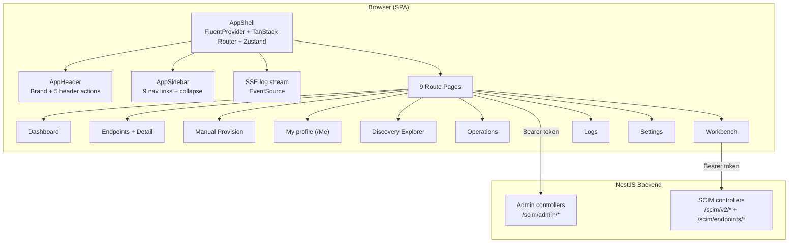

**Tech stack:** React 18, Fluent UI v9, TanStack Router (client-side routing), Zustand (token + UI state), TanStack Query (server cache), Vite build, Vitest + Playwright tests, `size-limit` per-route budgets.

---

## 2. Accessing the UI

| Environment | URL | Bearer token |
|-------------|-----|--------------|
| **Prod (customer-facing)** | `https://scimserver-prod.calmsand-7f4fc5dc.centralus.azurecontainerapps.io` | configured `SCIM_SHARED_SECRET` |
| **Prod (parallel)** | `https://scimserver.proudbush-ae90986e.eastus.azurecontainerapps.io` | configured `SCIM_SHARED_SECRET` |
| **Dev** | `https://scimserver-dev.proudbush-ae90986e.eastus.azurecontainerapps.io` | `changeme-scim` |
| **Local (Docker)** | `http://localhost:8080` | `changeme-scim` |
| **Local (dev server)** | `http://localhost:4000` (Vite) / API on `6000` | `local-secret` |

The UI is a pure SPA: deep links such as `/discovery` are resolved by the **client-side router**. Loading a SPA path directly from the server (hard refresh on a non-root path) is handled by the SPA fallback; if you see a JSON `404`, navigate from the root and use the sidebar.

---

## 3. Authentication (Token Gate)

On first visit (no stored token) a Fluent dialog requests the bearer token. This is the value of the `SCIM_SHARED_SECRET` environment variable on the instance.

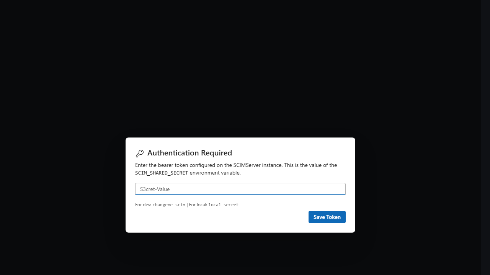

The token is stored in browser local storage and attached as `Authorization: Bearer <token>` to every admin and SCIM request. Re-open the dialog any time from the **key icon** in the header to change or clear the token.

> The Token Gate uses the **global shared secret**. Some pages (notably **My profile**) require a per-endpoint **OAuth JWT** instead, and will explain this inline.

---

## 4. App Shell & Navigation

After authentication the app shell renders: a brand bar, a collapsible sidebar with nine links, and the active page.

**Sidebar (9 links):**

| Link | Route | Purpose |
|------|-------|---------|
| Dashboard | `/` | KPIs, request volume, activity analytics, endpoint grid |
| Endpoints | `/endpoints` | Endpoint card grid, create, drill into detail |
| Manual Provision | `/manual-provision` | Create a User/Group through the admin path |
| My profile | `/me` | SCIM `/Me` self-service (per-endpoint OAuth) |
| Discovery | `/discovery` | Read-only RFC 7644 §4-§5 discovery, side-by-side diff |
| Operations | `/operations` | Cross-endpoint operator view of all users/groups |
| Workbench | `/workbench` | Free-form SCIM request builder + replay |
| Logs | `/logs` | Global request-log table with filters |
| Settings | `/settings` | Server info, health, log configuration |

**Header actions (right side):** environment warning indicator, notifications bell, **pulse icon** (live log stream drawer), **key icon** (token dialog), and the **theme toggle** (light/dark).

The sidebar collapses to an icon rail via the chevron at its bottom, persisting the choice across reloads.

---

## 5. Dashboard

The landing page. Top row shows four KPI cards (Endpoints, Total Users, Total Groups, Status). Below: a 24-hour request-volume sparkline, an **Activity analytics** block (Operations 24h / 7d, User ops 30d, Group ops 30d) with a Users-vs-Groups split bar, and a grid of endpoint summary cards.

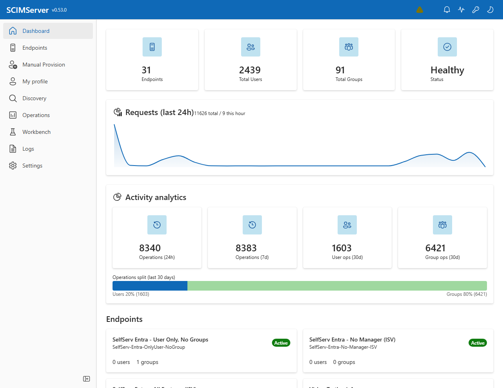

| Element | Source endpoint |
|---------|-----------------|
| KPI cards | `GET /scim/admin/dashboard` |
| Request volume | `GET /scim/admin/dashboard` (hourly buckets) |
| Activity analytics | `GET /scim/admin/activity/summary` |
| Endpoint grid | `GET /scim/admin/endpoints` |

---

## 6. Endpoints

A searchable card grid of every endpoint. The header shows the total count and a **Create endpoint** button; each card shows the display name, slug, an Active/Inactive badge, and the copyable `/scim/endpoints/{id}` base path.

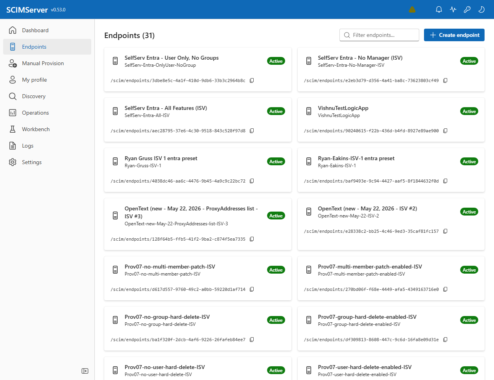

Clicking a card opens the **Endpoint Detail** page with tabs for Users, Groups, Logs, Settings, and Credentials. Creating an endpoint launches a preset picker (the six built-in presets) plus a JSON profile editor.

| Action | Endpoint |
|--------|----------|
| List endpoints | `GET /scim/admin/endpoints` |
| Create endpoint | `POST /scim/admin/endpoints` |
| Endpoint detail/overview | `GET /scim/admin/endpoints/{id}/overview` |
| Per-endpoint credentials | `GET/POST/DELETE /scim/admin/endpoints/{id}/credentials` |

---

## 7. Manual Provisioning

Provision a SCIM User or Group through the admin path without an external IdP. Pick a target endpoint, choose the **User** or **Group** tab, fill the form (User: `userName*`, `externalId`, `displayName`, `givenName`, `familyName`, `email`, `active`), and submit. The created resource appears in the **Result** panel as copyable JSON.

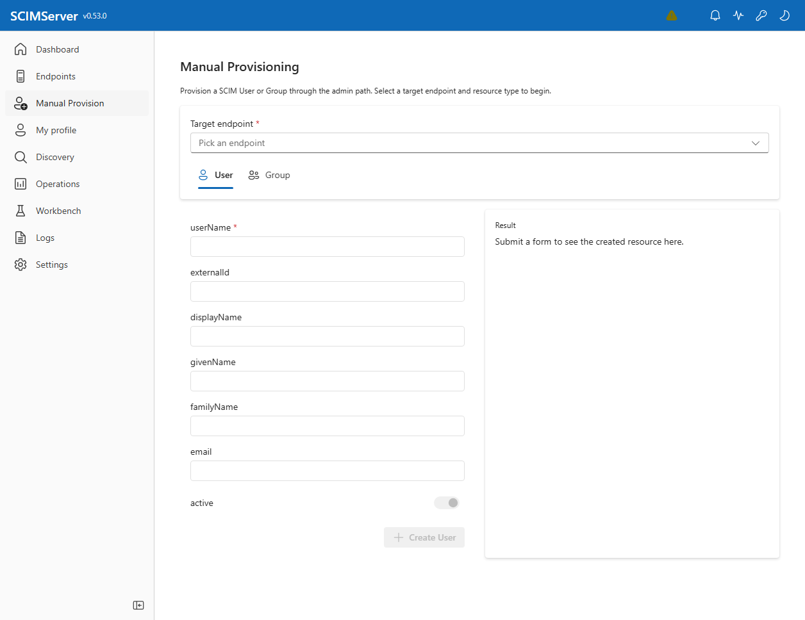

| Action | Endpoint |
|--------|----------|
| Create user | `POST /scim/endpoints/{id}/Users` |
| Create group | `POST /scim/endpoints/{id}/Groups` |

---

## 8. My Profile (/Me)

Exercises the SCIM `/Me` self-service endpoint (RFC 7644 §3.11). Pick an endpoint, then the page resolves the caller from the OAuth JWT.

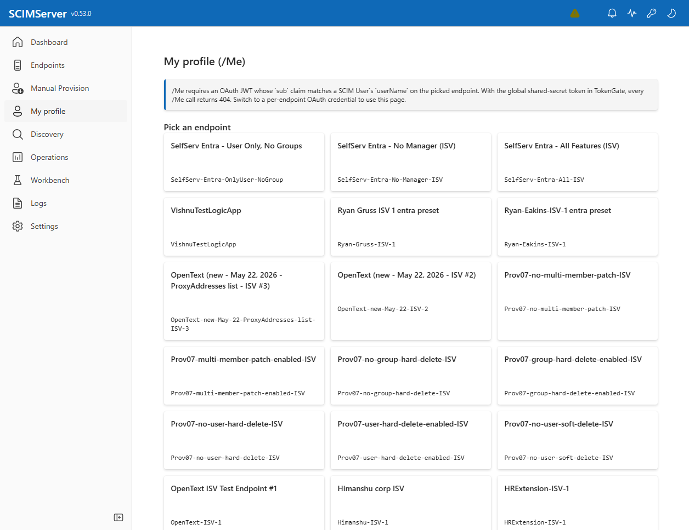

> `/Me` requires an **OAuth JWT** whose `sub` claim matches a SCIM User's `userName` on the chosen endpoint. With the global shared-secret token in the Token Gate, every `/Me` call returns `404` - switch to a per-endpoint OAuth credential to use this page.

| Action | Endpoint |
|--------|----------|
| Read self | `GET /scim/endpoints/{id}/Me` |
| Replace / patch / delete self | `PUT` / `PATCH` / `DELETE /scim/endpoints/{id}/Me` |

---

## 9. Discovery Explorer

A read-only view of each endpoint's SCIM discovery surfaces (RFC 7644 §4 + §5): `ServiceProviderConfig`, `ResourceTypes`, and `Schemas`. Pick one endpoint to inspect, or two to compare **side-by-side**. The Schemas diff colors each attribute characteristic green (tighten), red (relax), or grey (unchanged) using the same partial order the API's tighten-only validator enforces.

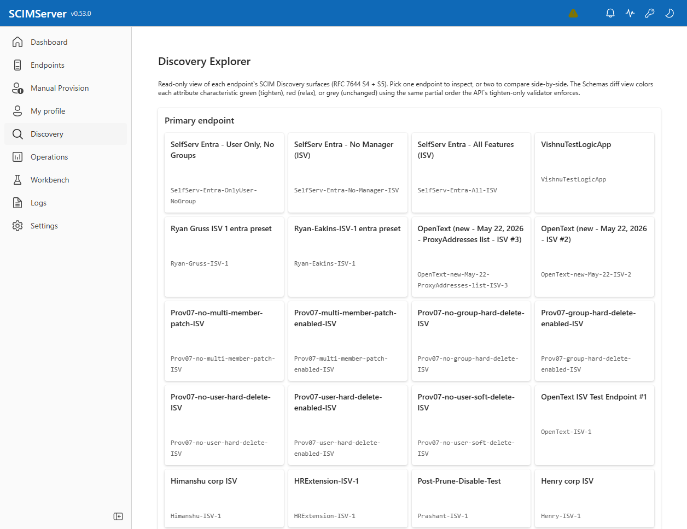

| Action | Endpoint |
|--------|----------|
| ServiceProviderConfig | `GET /scim/endpoints/{id}/ServiceProviderConfig` |
| ResourceTypes | `GET /scim/endpoints/{id}/ResourceTypes` |
| Schemas | `GET /scim/endpoints/{id}/Schemas` |

---

## 10. Operations

A cross-endpoint operator view of users and groups across **every** endpoint on the server. Three tabs: **All Users**, **All Groups**, **Statistics**. Each row shows the resource, its `active` state, the owning endpoint badge, and the created timestamp. An **Active only** toggle and **Download CSV** export operate on the current page; clicking an endpoint badge jumps to that endpoint's tab pre-filtered.

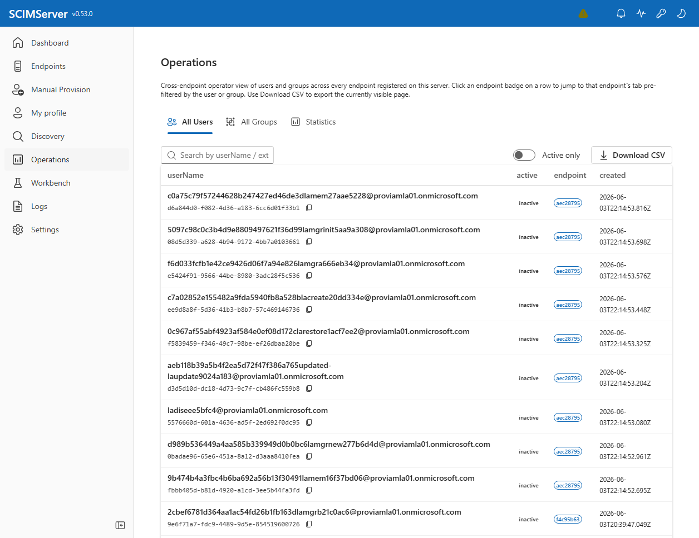

| Action | Endpoint |
|--------|----------|
| All users / groups | `GET /scim/admin/database/users`, `/groups` |
| Statistics | `GET /scim/admin/database/statistics` |

> **Scalability note:** the Operations grids do not yet offer column sort/filter. Tracked in [strategy/UI_PRESENTATION_BACKLOG.md](strategy/UI_PRESENTATION_BACKLOG.md).

---

## 11. Workbench

A free-form SCIM request builder. Compose a request once (method, path under `/scim/*`, headers, body), optionally pre-fill from an endpoint, then **Send** it and inspect the response. The same request can be copied/exported as **curl**, **TypeScript**, **Insomnia**, or **Postman**, or downloaded as a request `.json`. A **Side-by-side** toggle shows request and response together. The last 50 requests are saved locally as history.

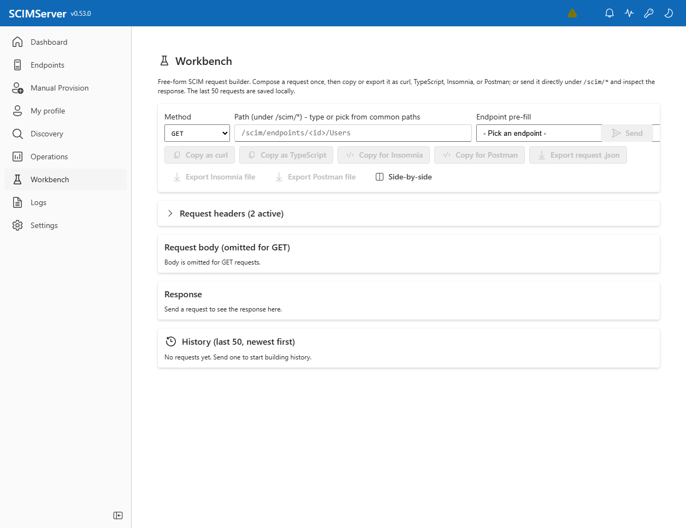

| Capability | Detail |
|------------|--------|
| Methods | GET, POST, PUT, PATCH, DELETE |
| Path | any `/scim/*` route (e.g. `/scim/endpoints/<id>/Users`) |
| Export targets | curl, TypeScript fetch, Insomnia, Postman, raw `.json` |
| History | last 50 requests, newest first, persisted locally |

---

## 12. Logs

The global request-log table. The header shows the total log count. Filters: **URL contains**, **Endpoint** dropdown, **Status** chips (200, 201, 400, 401, 403, 404, 409, 500), and **Time range** (Last 1 hour / 24 hours / 7 days / 30 days). Each row shows Method, URL (copyable), Status, Duration, and Time.

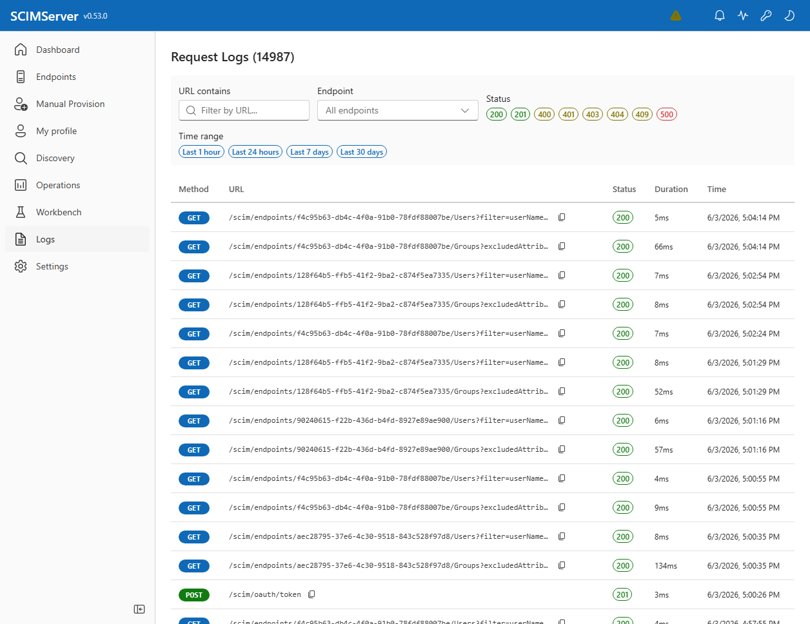

| Action | Endpoint |
|--------|----------|
| List logs | `GET /scim/admin/logs` |
| Per-endpoint logs | `GET /scim/admin/endpoints/{id}/logs` |

---

## 13. Settings

Server diagnostics and log configuration in one place.

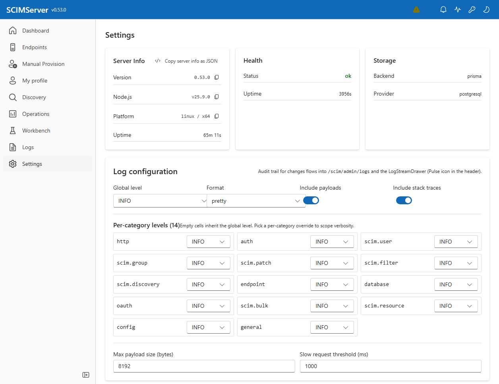

- **Server Info** - version, Node.js version, platform, uptime (each value copyable; "Copy server info as JSON").
- **Health** - status and uptime from `GET /health`.
- **Storage** - backend (`prisma`) and provider (`postgresql`).
- **Log configuration** - global level, format (`pretty`/`json`), include-payloads switch, include-stack-traces switch.
- **Per-category levels (14)** - one selector per log category (`http`, `auth`, `scim.user`, `scim.group`, `scim.patch`, `scim.filter`, `scim.discovery`, `endpoint`, `database`, `oauth`, `scim.bulk`, `scim.resource`, `config`, `general`). Empty cells inherit the global level.
- **Thresholds** - max payload size (bytes), slow-request threshold (ms).
- **Onboarding** - re-launch the first-run onboarding wizard.

| Action | Endpoint |
|--------|----------|
| Version / info | `GET /scim/admin/version` |
| Health | `GET /health` |
| Log config read/update | `GET/PUT /scim/admin/log-config` |

---

## 14. Live Log Stream Drawer

The **pulse icon** in the header opens a drawer that tails structured log entries in real time via Server-Sent Events (`GET /scim/admin/log-config/stream`). The drawer mirrors the categories and levels configured on the Settings page and is the fastest way to watch a provisioning run as it happens.

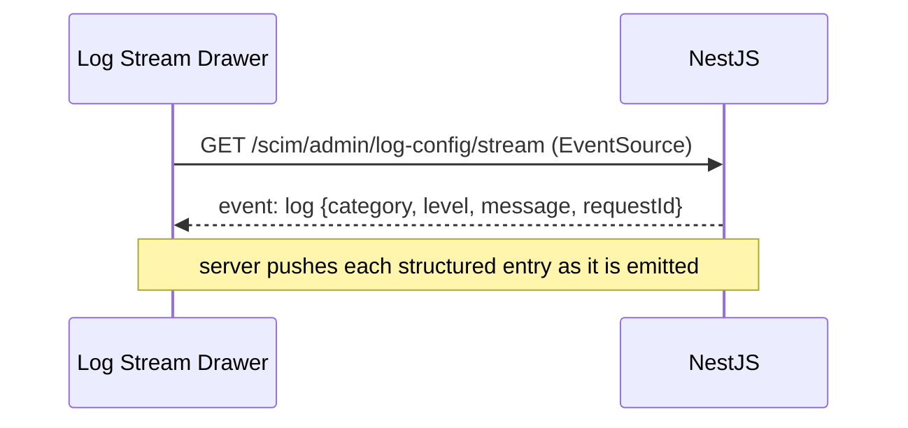

---

## 15. Theme System

The header theme toggle switches between Fluent **light** and **dark** themes; the choice persists across reloads. All pages, drawers, and dialogs are theme-aware.

---

## 16. Copy-Everywhere Primitives

Per the project's copy-everywhere discipline, every display value, JSON payload, and editable field is built from one of four shared primitives:

| Primitive | Use |
|-----------|-----|
| `CopyableField` | inline single-value display (IDs, URNs, paths) + copy button |
| `CopyableJsonBlock` | read-only pretty-printed JSON with header copy button |
| `CopyJsonButton` | section-level "copy this whole thing as JSON" |
| `EditableField` | editable input with copy + undo + redo + reset affordances |

This is why nearly every value in the screenshots above carries a copy icon.

---

## 17. Screenshot Inventory

| File | Page | Source |
|------|------|--------|
| `prod-token-dialog.png` | Token Gate | prod (calmsand) |
| `prod-01-dashboard.png` | Dashboard | prod (calmsand) |
| `prod-02-endpoints.png` | Endpoints | prod (calmsand) |
| `prod-03-discovery.png` | Discovery Explorer | prod (calmsand) |
| `prod-04-operations.png` | Operations | prod (calmsand) |
| `prod-05-workbench.png` | Workbench | prod (calmsand) |
| `prod-06-my-profile.png` | My profile (/Me) | prod (calmsand) |
| `prod-07-manual-provision.png` | Manual Provisioning | prod (calmsand) |
| `prod-08-logs.png` | Logs | prod (calmsand) |
| `prod-09-settings.png` | Settings | prod (calmsand) |

Historical screenshots (`01-`...`35-`) from earlier UI iterations remain in `docs/screenshots/` for reference.

---

## 18. Known Limitations

- **Data-grid scalability** - Operations, Discovery, Dashboard, and Endpoints grids lack column sort/filter in several places, and some cards are not click-through. Tracked as a dedicated effort in [strategy/UI_PRESENTATION_BACKLOG.md](strategy/UI_PRESENTATION_BACKLOG.md).
- **My profile** requires a per-endpoint OAuth JWT; it cannot be exercised with the global shared-secret token.
- The SPA serves all routes client-side; bookmarking a deep link relies on the server SPA fallback.

---

> Maintained as a Tier-1 user-facing guide. When the UI changes, refresh the affected screenshots from a live deployment and update the corresponding section.
