# SCIMServer Web Admin UI Guide

> **Status:** User-facing reference - **Last verified:** 2026-09-24 - **Product version:** `0.55.30`

> **Status:** Active | **Last Updated:** 2026-09-24 | **Version:** 0.55.30
> Single-page React + Fluent UI v9 admin console. Nine pages, one shared app shell, live SSE log stream.
> **Endpoint/profile/authentication flows:** [PORTABLE_ENDPOINT_PROFILE_AUTHENTICATION_AND_DISCOVERY_DESIGN.md](PORTABLE_ENDPOINT_PROFILE_AUTHENTICATION_AND_DISCOVERY_DESIGN.md) distinguishes the current Create, Discovery, Connect, endpoint Settings, and global Settings surfaces from the target profile-import workflow.
> **Screenshot provenance:** every image below was re-captured on **2026-07-31** from the live **dev** estate (then `scimserver-dev.proudbush-ae90986e.eastus.azurecontainerapps.io`) running **v0.55.6 / Node v24.18.1**, at a pinned 1440x900 viewport, using:
>
> ```powershell
> pwsh scripts/capture-ui-guide.ps1 -BaseUrl '<dev fqdn>' -Token '<scim secret>' -Apply
> ```
>
> They were previously shot from the customer-facing production instance at v0.53.0. Dev is now the capture target because it carries a richer, deliberately-seeded data set (58 endpoints) and does not put customer tenant names in public documentation.

---

## Table of Contents

1. [Overview](#1-overview)
2. [Accessing the UI](#2-accessing-the-ui)
3. [Authentication (Token Gate)](#3-authentication-token-gate)
4. [App Shell & Navigation](#4-app-shell--navigation)
5. [Dashboard](#5-dashboard)
6. [Endpoints](#6-endpoints)
7. [Manual Provisioning](#7-manual-provisioning)
8. [My Profile (/Me)](#8-my-profile-me)
9. [Discovery Explorer](#9-discovery-explorer)
10. [Operations](#10-operations)
11. [Workbench](#11-workbench)
12. [Logs](#12-logs)
13. [Settings](#13-settings)
14. [Live Log Stream Drawer](#14-live-log-stream-drawer)
15. [Theme System](#15-theme-system)
16. [Copy-Everywhere Primitives](#16-copy-everywhere-primitives)
17. [Screenshot Inventory](#17-screenshot-inventory)
18. [Known Limitations](#18-known-limitations)

---

## 1. Overview

The Web Admin UI is a React Single-Page Application served by the NestJS backend at the site root (`/`). It is the operator console for the SCIM server: it manages endpoints, inspects discovery documents, provisions resources manually, replays raw SCIM requests, and tails structured logs in real time.

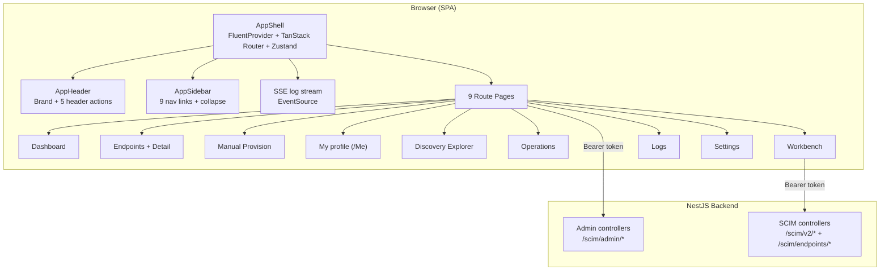
```mermaid
flowchart TB
    subgraph Browser["Browser (SPA)"]
        Shell["AppShell<br/>FluentProvider + TanStack Router + Zustand"]
        Shell --> Header["AppHeader<br/>Brand + 5 header actions"]
        Shell --> Sidebar["AppSidebar<br/>9 nav links + collapse"]
        Shell --> SSE["SSE log stream<br/>EventSource"]
        Shell --> Pages["9 Route Pages"]
        Pages --> P1["Dashboard"]
        Pages --> P2["Endpoints + Detail"]
        Pages --> P3["Manual Provision"]
        Pages --> P4["My profile (/Me)"]
        Pages --> P5["Discovery Explorer"]
        Pages --> P6["Operations"]
        Pages --> P7["Workbench"]
        Pages --> P8["Logs"]
        Pages --> P9["Settings"]
    end

    subgraph API["NestJS Backend"]
        Admin["Admin controllers<br/>/scim/admin/*"]
        Scim["SCIM controllers<br/>/scim/v2/* + /scim/endpoints/*"]
    end

    Pages -->|Bearer token| Admin
    P7 -->|Bearer token| Scim
```

**Tech stack:** React 18, Fluent UI v9, TanStack Router (client-side routing), Zustand (token + UI state), TanStack Query (server cache), Vite build, Vitest + Playwright tests, `size-limit` per-route budgets.

---

## 2. Accessing the UI

| Environment | URL | Bearer token |
|-------------|-----|--------------|
| **Prod (customer-facing)** | `https://scimserver-prod.calmsand-7f4fc5dc.centralus.azurecontainerapps.io` | configured `SCIM_SHARED_SECRET` |
| **Prod (parallel)** | `https://scimserver.purplecliff-91e4026d.eastus.azurecontainerapps.io` | configured `SCIM_SHARED_SECRET` |
| **Dev** | `https://scimserver-dev.purplecliff-91e4026d.eastus.azurecontainerapps.io` | `changeme-scim` |
| **Local (Docker)** | `http://localhost:8080` | `changeme-scim` |
| **Local (dev server)** | `http://localhost:4000` (Vite) / API on `6000` | `local-secret` |

The UI is a pure SPA: deep links such as `/discovery` are resolved by the **client-side router**. Loading a SPA path directly from the server (hard refresh on a non-root path) is handled by the SPA fallback; if you see a JSON `404`, navigate from the root and use the sidebar.

---

## 3. Authentication (Token Gate)

On first visit (no stored token) a Fluent dialog requests the bearer token. This is the value of the `SCIM_SHARED_SECRET` environment variable on the instance.

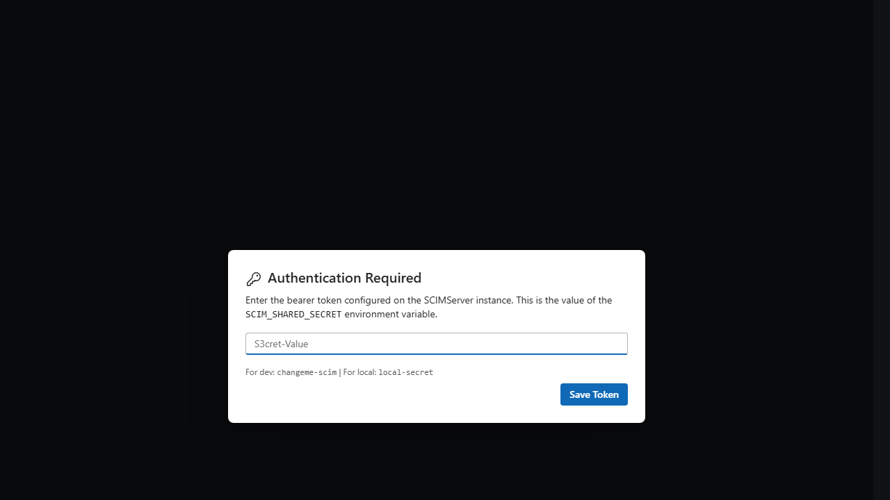

The token is stored in browser local storage and attached as `Authorization: Bearer <token>` to every admin and SCIM request. Re-open the dialog any time from the **key icon** in the header to change or clear the token.

> The Token Gate uses the **global shared secret**. Some pages (notably **My profile**) require a per-endpoint **OAuth JWT** instead, and will explain this inline.

---

## 4. App Shell & Navigation

After authentication the app shell renders: a brand bar, a collapsible sidebar with nine links, and the active page.

**Sidebar (9 links):**

| Link | Route | Purpose |
|------|-------|---------|
| Dashboard | `/` | KPIs, request volume, activity analytics, endpoint grid |
| Endpoints | `/endpoints` | Endpoint card grid, create, drill into detail |
| Manual Provision | `/manual-provision` | Create any ResourceType declared by an endpoint profile |
| My profile | `/me` | SCIM `/Me` self-service (per-endpoint OAuth) |
| Discovery | `/discovery` | Read-only RFC 7644 §4-§5 discovery, side-by-side diff |
| Operations | `/operations` | Cross-endpoint operator view of all users/groups |
| Workbench | `/workbench` | Free-form SCIM request builder + replay |
| Logs | `/logs` | Global request-log table with filters |
| Settings | `/settings` | Server info, health, log configuration |

**Header actions (right side):** environment warning indicator, notifications bell, **pulse icon** (live log stream drawer), **key icon** (token dialog), and the **theme toggle** (light/dark).

The sidebar collapses to an icon rail via the chevron at its bottom, persisting the choice across reloads.

---

## 5. Dashboard

> **Every server-known endpoint setting is reachable on the Settings tab.** Eleven settings were
> previously enforced by the server while having no control at all, so an operator could not see or
> change them. They now appear in the existing category cards - the three active-credential caps, the
> JWKS safety-envelope and refresh-cadence values, and `logFileEnabled` under Logging and privacy -
> and a gate keeps it that way: adding a setting to the registry without giving it a control now
> fails the build.

The landing page. Top row shows four KPI cards (Endpoints, Total Users, Total Groups, Status). Below: a 24-hour request-volume sparkline, an **Activity analytics** block (Operations 24h / 7d, User ops 30d, Group ops 30d) with a Users-vs-Groups split bar, and a grid of endpoint summary cards.

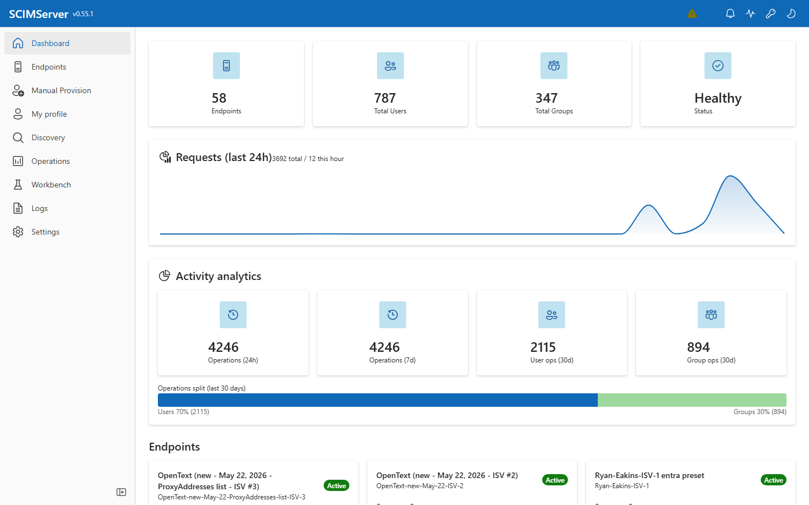

| Element | Source endpoint |
|---------|-----------------|
| KPI cards | `GET /scim/admin/dashboard` |
| Request volume | `GET /scim/admin/dashboard` (hourly buckets) |
| Activity analytics | `GET /scim/admin/activity/summary` |
| Endpoint grid | `GET /scim/admin/endpoints` |

---

## 6. Endpoints

A searchable card grid of every endpoint. The header shows the total count and a **Create endpoint** button; each card shows the display name, slug, an Active/Inactive badge, and the copyable `/scim/endpoints/{id}` base path.

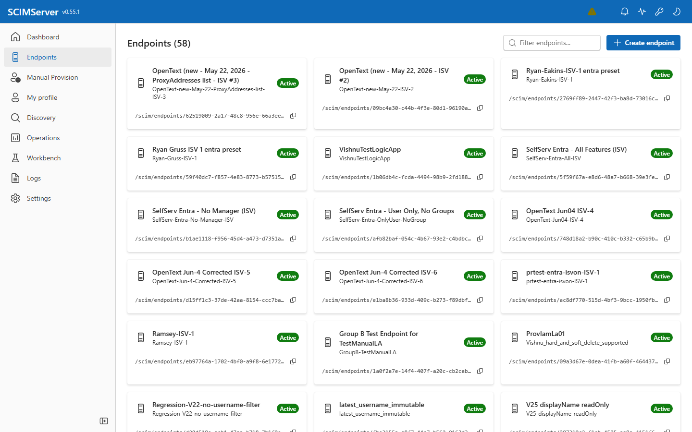

### 6.1 Creating an endpoint

**Create endpoint** opens a four-step wizard at `/endpoints/new`: **Identity & Preset** (name, description, and one of the six built-in presets) -> **Preview** (the schemas, resource types, ServiceProviderConfig and settings that preset will apply) -> **Override** (a JSON profile editor for anything you want to change) -> **Confirm**.

Presets only ever **tighten**: the wizard will not let you widen a profile beyond the RFC baseline. See [ENDPOINT_PROFILE_ARCHITECTURE.md](ENDPOINT_PROFILE_ARCHITECTURE.md).

`/endpoints/{id}/edit` is a separate, deliberately narrow page for renaming an endpoint and toggling `active`. Deleting requires typing the endpoint name to confirm.

### 6.2 Endpoint detail

Clicking a card opens the endpoint detail page.

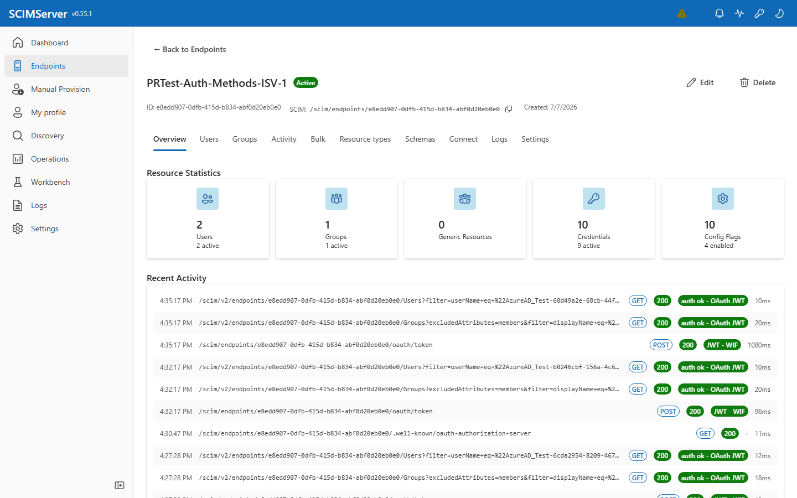

The header carries the display name, an Active badge, the copyable endpoint id and SCIM base path, the creation date, and **Edit** / **Delete**. **Overview** shows Resource Statistics (users, groups, custom resources, credentials, config flags) and a Recent Activity list where every row carries an **auth outcome chip** such as `auth ok - OAuth JWT` or `JWT - WIF`.

Eleven standard tabs, plus one tab for each custom ResourceType:

| Tab | Route | What it is for |
|---|---|---|
| **Overview** | `/endpoints/{id}` | Resource statistics and recent activity |
| **Users** | `/endpoints/{id}/users` | Browse, inspect and edit SCIM Users |
| **Groups** | `/endpoints/{id}/groups` | Browse groups and their membership |
| **Activity** | `/endpoints/{id}/activity` | Provisioning activity parsed into human events |
| **Bulk** | `/endpoints/{id}/bulk` | Compose and send a SCIM Bulk envelope |
| **Resource types** | `/endpoints/{id}/resource-types` | The `/ResourceTypes` this endpoint serves |
| **Service Provider Config** | `/endpoints/{id}/service-provider-config` | Effective endpoint capabilities, limits, and authentication schemes |
| **Schemas** | `/endpoints/{id}/schemas` | The `/Schemas` this endpoint publishes |
| **Connect** | `/endpoints/{id}/connect` | Authentication: set up, connect, and monitor. See [AUTHENTICATION_GUIDE.md](AUTHENTICATION_GUIDE.md) |
| **Logs** | `/endpoints/{id}/logs` | This endpoint's request log, with auth decision detail |
| **Settings** | `/endpoints/{id}/settings` | Complete structured inventory of all 38 endpoint settings. See [ENDPOINT_SETTINGS_OPERATOR_GUIDE.md](ENDPOINT_SETTINGS_OPERATOR_GUIDE.md) |
| **Custom type** | `/endpoints/{id}/resources/{id}` | List, create, inspect, edit, and delete that custom resource type; the second id is the ResourceType id |

Two details worth knowing:

- **Resource tabs follow the profile.** Users and Groups render only when declared, and every custom ResourceType gets its own tab. A profile update invalidates endpoint discovery immediately; a removed active type redirects to Resource types instead of leaving a stale page mounted.
- **There is no Credentials tab.** It was merged into **Connect**; `/endpoints/{id}/credentials` still resolves but redirects there.

### 6.3 What each tab does

**Users** and **Groups** are paginated lists of the SCIM resources on this endpoint. Each has a visible Create action, including in the empty state. The form is generated from that endpoint's `/Schemas` and `/ResourceTypes` and starts with a working example. Its request JSON is fully editable: changing a known JSON member updates the corresponding control, and changing a control updates the JSON without dropping unrelated members. Selecting a row opens the same profile-driven field set in a detail drawer. Save emits only changed writable attributes, including extension-qualified paths, and carries the current ETag as `If-Match`. If the endpoint's profile does not serve that resource type the tab renders an explicit *unsupported* state rather than an error, which is the difference between "this endpoint has no users" and "this endpoint does not do users".

**Activity** is the provisioning story rather than the raw request log: the server parses requests into human events, each with a severity badge. Filter by **type** (`user`, `group`, `resource`, `system`), by **severity** (`info`, `success`, `warning`, `error`), or by free text. Custom operations identify their ResourceType, endpoint path, and resource id. The filters live **in the URL**, so a filtered view is a shareable link - useful when handing an investigation to someone else. Use Activity to answer "what did this provisioning job actually do?"; use **Logs** when you need the wire detail behind one of those events.

**Bulk** turns a CSV into a single SCIM Bulk request (RFC 7644 section 3.7).

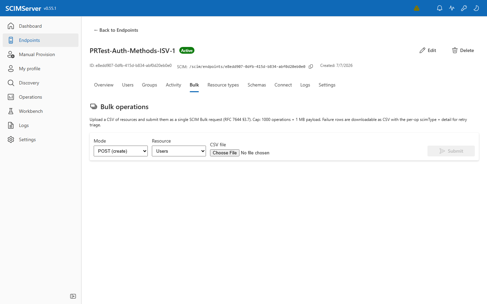

| Control | What it does |
|---|---|
| **Mode** | `POST (create)`, `PATCH` or `DELETE` |
| **Resource** | Users or Groups |
| **CSV file** | one row per operation; the header row supplies the attribute names |
| **ID column** | which CSV column carries the resource id. Only shown for PATCH and DELETE, which need an existing target |
| **failOnErrors** | stop after this many failures; `0` processes every row regardless |

The cap is **1000 operations and a 1 MB payload**. Before submitting you get a preview of the first ten operations and a **Copy full envelope as JSON** button, so you can inspect exactly what will be sent. Afterwards, **failure rows are downloadable as CSV** carrying the per-operation `scimType` and `detail` - fix that file and re-submit it rather than re-deriving which rows failed.

**Resource types** lists what this endpoint serves, creates custom ones beyond User and Group, and exposes the related discovery/enforcement settings in a collapsed pane above the inventory. An **Effective combined schemas** section flattens each type's core and extension attribute paths with their type, required, cardinality, and mutability characteristics.

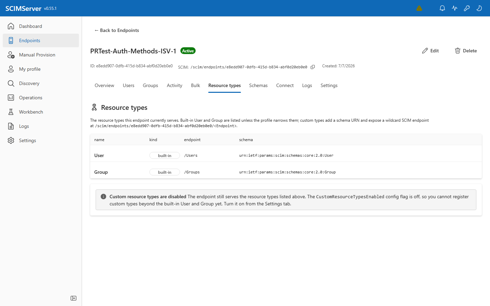

Each row shows the type name, its endpoint path and its schema URN. **Create** asks for a name, an endpoint path (mounted under `/scim/endpoints/{id}`), a schema URN and an optional description. Delete asks for confirmation. The list renders whether or not custom types are currently enabled, so you can always see what a client would discover at `/ResourceTypes`. Once registered, the custom type also appears beside Users and Groups as a first-class tab with list, create, edit, and delete workflows generated from its effective schema.

**Service Provider Config** renders the endpoint's `/ServiceProviderConfig` document as a compact capability inventory. PATCH, filtering, ETags, bulk, sorting, and password-change support show explicit status and limits; authentication schemes identify the primary scheme and link to provider documentation. The complete published JSON remains copyable.

**Schemas** is a read-only tree of what this endpoint publishes at `/Schemas`, with discovery and strict-validation controls in a collapsed pane. One row per schema shows its name, URN, attribute count and a Copy URN button; expand a schema to see its attributes, each with characteristic badges (type, mutability, returned, uniqueness); expand a complex attribute again for its sub-attributes. This is the fastest way to answer "does this endpoint actually advertise the attribute my client is sending?"

**Users** and **Groups** each begin with a collapsed behavior pane. Users contains only its two lifecycle controls; Groups contains only its three membership/deletion controls. Common validation, coercion, primary-enforcement, general PATCH and ETag settings stay in the complete Endpoint Settings tab so one endpoint-wide value is never presented as two resource-specific settings.

**Connect** is the authentication surface and has its own guide: [AUTHENTICATION_GUIDE.md](AUTHENTICATION_GUIDE.md). Its collapsed **Authentication methods** pane shows four real methods in setup order (OAuth2, WIF, global shared secret, per-endpoint bearer); the legacy umbrella is kept out of this selector. The selected method shows a collapsed credential-limit or WIF/JWKS pane. Credential headers expose only the primary action plus **More**, while labeled export rows and IdP connection values remain visible below.

**Logs** is this endpoint's slice of the request log, including custom ResourceType URLs, the per-row auth outcome chip, and the decision trace behind it. Endpoint and global Logs share filters for URL, method, status, time range, errors-only, minimum duration, and request ID. Global Logs additionally selects an endpoint; endpoint Logs keeps that scope fixed. Request-persistence, file-output, and per-endpoint log-level controls are in a collapsed pane above the rows. See [section 12](#12-logs).

**Settings** remains the complete structured inventory of all 38 endpoint controls even though related subsets also appear in operational tabs. See [ENDPOINT_SETTINGS_OPERATOR_GUIDE.md](ENDPOINT_SETTINGS_OPERATOR_GUIDE.md).

| Action | Endpoint |
|--------|----------|
| List endpoints | `GET /scim/admin/endpoints` |
| Create endpoint | `POST /scim/admin/endpoints` |
| List presets | `GET /scim/admin/endpoints/presets` |
| Endpoint detail/overview | `GET /scim/admin/endpoints/{id}/overview` |
| Endpoint statistics | `GET /scim/admin/endpoints/{id}/stats` |
| Rename / activate | `PATCH /scim/admin/endpoints/{id}` |
| Delete | `DELETE /scim/admin/endpoints/{id}` |
| Per-endpoint credentials | `GET/POST/DELETE /scim/admin/endpoints/{id}/credentials` |
| Connection values per method | `GET /scim/admin/endpoints/{id}/connection-info` |

---

## 7. Manual Provisioning

Provision any SCIM resource declared by an endpoint profile without an external IdP. Pick a target endpoint, select one of its discovered ResourceType tabs, review or edit the generated working example, and submit. Text, numeric, boolean, canonical-value, complex, and multi-valued attributes receive type-appropriate controls. A dropdown appears only when the schema publishes non-empty `canonicalValues`; an unconstrained string remains a text field. Extension values are nested under their schema URN. The request body is fully editable and synchronized with the controls in both directions; malformed or non-object JSON blocks submission. The created resource is copyable JSON.

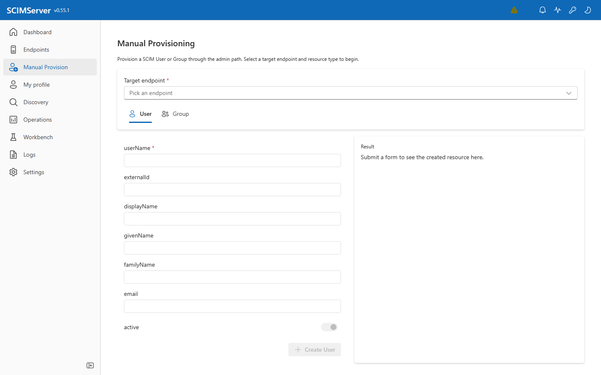

| Action | Endpoint |
|--------|----------|
| Create user | `POST /scim/endpoints/{id}/Users` |
| Create group | `POST /scim/endpoints/{id}/Groups` |
| Create custom resource | `POST /scim/endpoints/{id}/{resourceTypeEndpoint}` |

---

## 8. My Profile (/Me)

Exercises the SCIM `/Me` self-service endpoint (RFC 7644 §3.11). Pick an endpoint, then the page resolves the caller from the OAuth JWT.

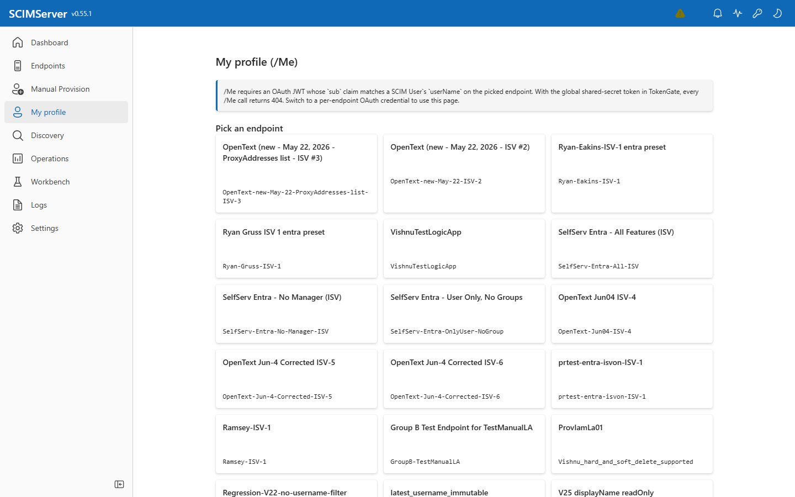

> `/Me` requires an **OAuth JWT** whose `sub` claim matches a SCIM User's `userName` on the chosen endpoint. With the global shared-secret token in the Token Gate, every `/Me` call returns `404` - switch to a per-endpoint OAuth credential to use this page.

| Action | Endpoint |
|--------|----------|
| Read self | `GET /scim/endpoints/{id}/Me` |
| Replace / patch / delete self | `PUT` / `PATCH` / `DELETE /scim/endpoints/{id}/Me` |

---

## 9. Discovery Explorer

A read-only view of each endpoint's SCIM discovery surfaces (RFC 7644 §4 + §5): `ServiceProviderConfig`, `ResourceTypes`, and `Schemas`. Pick one endpoint to inspect, or two to compare **side-by-side**. The Schemas diff colors each attribute characteristic green (tighten), red (relax), or grey (unchanged) using the same partial order the API's tighten-only validator enforces.

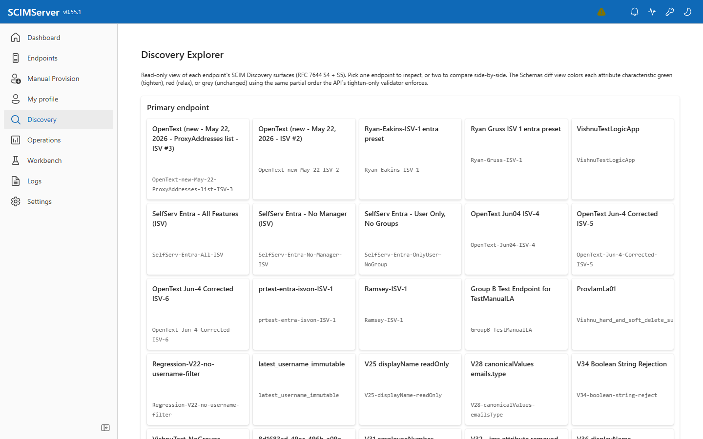

| Action | Endpoint |
|--------|----------|
| ServiceProviderConfig | `GET /scim/endpoints/{id}/ServiceProviderConfig` |
| ResourceTypes | `GET /scim/endpoints/{id}/ResourceTypes` |
| Schemas | `GET /scim/endpoints/{id}/Schemas` |

---

## 10. Operations

A cross-endpoint operator view of users and groups across **every** endpoint on the server. Three tabs: **All Users**, **All Groups**, **Statistics**. Each row shows the resource, its `active` state, the owning endpoint badge, and the created timestamp. An **Active only** toggle and **Download CSV** export operate on the current page; clicking an endpoint badge jumps to that endpoint's tab pre-filtered.

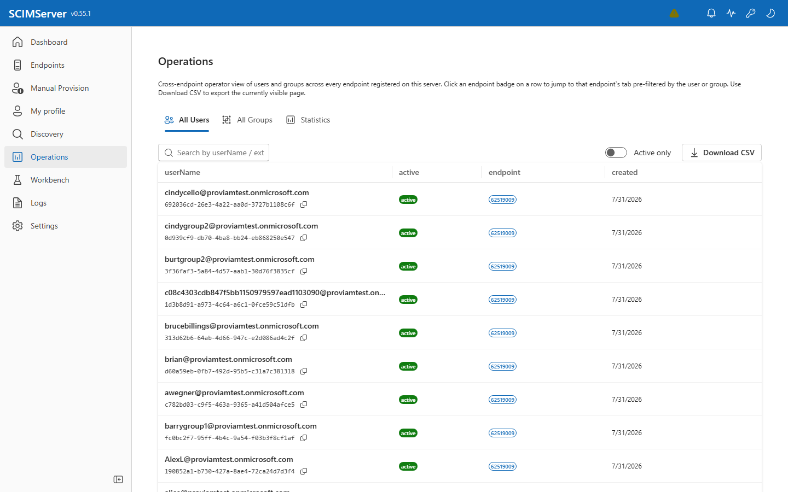

| Action | Endpoint |
|--------|----------|
| All users / groups | `GET /scim/admin/database/users`, `/groups` |
| Statistics | `GET /scim/admin/database/statistics` |

> **Scalability note:** the Operations grids do not yet offer column sort/filter. Tracked in [strategy/UI_PRESENTATION_BACKLOG.md](strategy/UI_PRESENTATION_BACKLOG.md).

---

## 11. Workbench

A SCIM request builder with executable examples and a free-form editor. Static examples cover server health and common admin operations. Selecting an endpoint adds endpoint-admin examples; selecting one of its published ResourceTypes adds a profile-valid create request and, when a resource exists, an ETag-aware PATCH against its real id. **Apply** loads the method, path, headers, and body into the editable draft but never sends automatically. **Send** executes the reviewed draft and displays the response.

The same request can be copied/exported as **curl**, **TypeScript**, **Insomnia**, or **Postman**, or downloaded as a request `.json`. A **Side-by-side** toggle shows request and response together. The last 50 requests are saved locally as history.

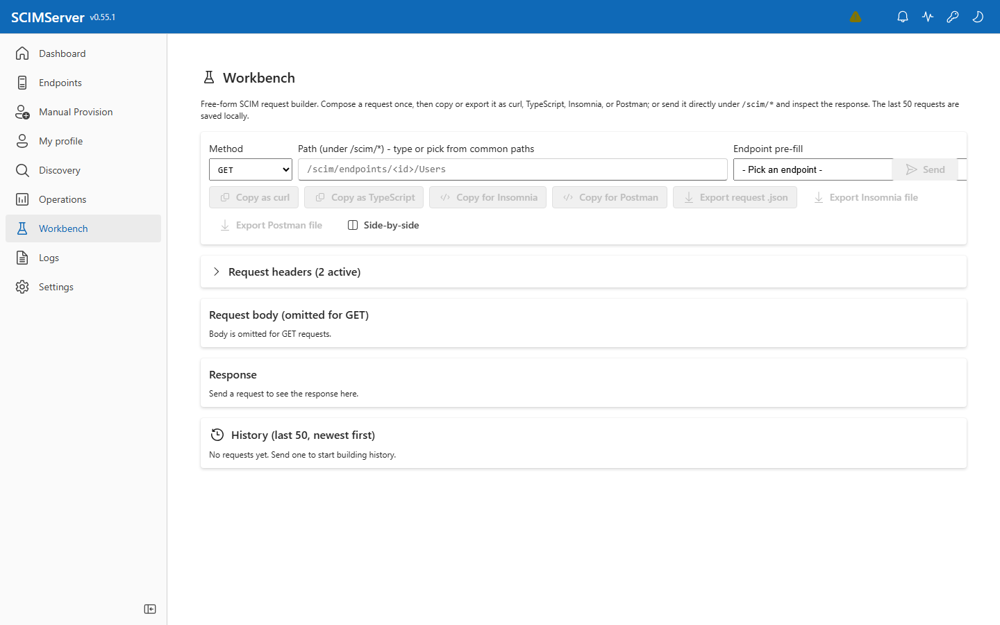

| Capability | Detail |
|------------|--------|
| Examples | static Server/Admin plus selected Endpoint and discovery-derived SCIM ResourceType requests |
| Methods | GET, POST, PUT, PATCH, DELETE |
| Path | any `/scim/*` route (e.g. `/scim/endpoints/<id>/Users`) |
| Profile POST | generated from the selected ResourceType's effective core plus extension schemas |
| Existing-resource PATCH | concrete resource id, writable scalar operation, and returned `If-Match` when available |
| Headers | enabled editor rows are sent; stored admin Authorization remains authoritative |
| Export targets | curl, TypeScript fetch, Insomnia, Postman, raw `.json` |
| History | last 50 requests, newest first, persisted locally |

The canonical dev endpoint `PRTest-Auth-Methods-ISV-1` is the post-deployment demonstration surface: its User and Group extensions plus Device ResourceType make all profile-derived example classes visible in one endpoint.

---

## 12. Logs

The global request-log table. The header shows the total log count. Filters: **URL contains**, **Endpoint** dropdown, **Status** chips (200, 201, 400, 401, 403, 404, 409, 500), and **Time range** (Last 1 hour / 24 hours / 7 days / 30 days). Each row shows Method, URL (copyable), Status, Duration, and Time.

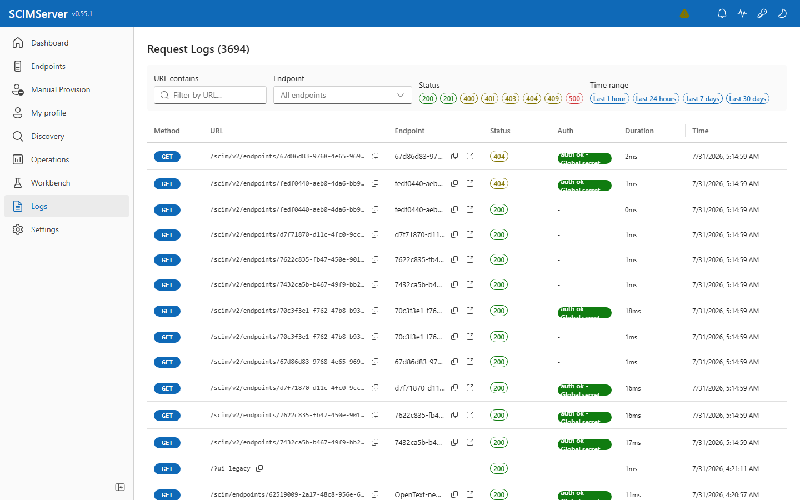

| Action | Endpoint |
|--------|----------|
| List logs | `GET /scim/admin/logs` |
| Per-endpoint logs | `GET /scim/admin/endpoints/{id}/logs` |

---

## 13. Settings

Server diagnostics and log configuration in one place.

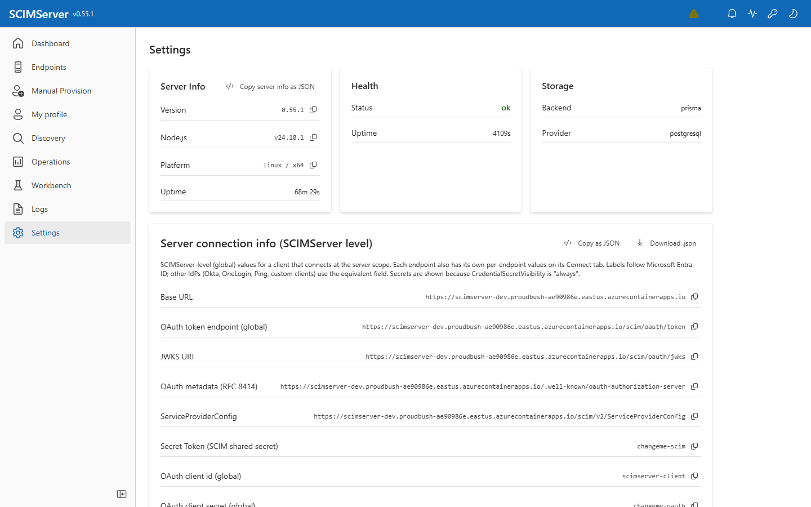

- **Server Info** - version, Node.js version, platform, uptime (each value copyable; "Copy server info as JSON").
- **Health** - status and uptime from `GET /health`.
- **Storage** - backend (`prisma`) and provider (`postgresql`).
- **Log configuration** - global level, format (`pretty`/`json`), include-payloads switch, include-stack-traces switch.
- **Per-category levels (14)** - one selector per log category (`http`, `auth`, `scim.user`, `scim.group`, `scim.patch`, `scim.filter`, `scim.discovery`, `endpoint`, `database`, `oauth`, `scim.bulk`, `scim.resource`, `config`, `general`). Empty cells inherit the global level.
- **Thresholds** - max payload size (bytes), slow-request threshold (ms).
- **Onboarding** - re-launch the first-run onboarding wizard.

| Action | Endpoint |
|--------|----------|
| Version / info | `GET /scim/admin/version` |
| Health | `GET /health` |
| Log config read/update | `GET/PUT /scim/admin/log-config` |

---

## 14. Live Log Stream Drawer

The **pulse icon** in the header opens a drawer that tails structured log entries in real time via Server-Sent Events (`GET /scim/admin/log-config/stream`). The drawer mirrors the categories and levels configured on the Settings page and is the fastest way to watch a provisioning run as it happens.

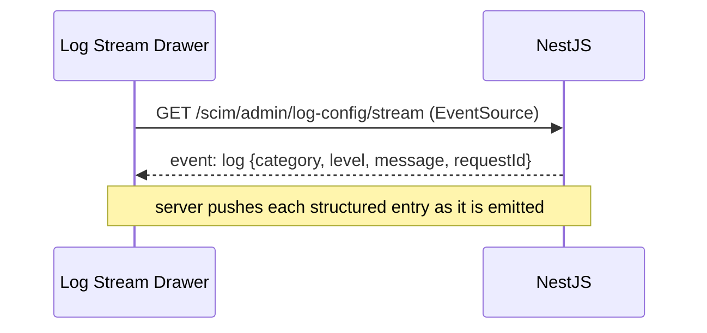
```mermaid
sequenceDiagram
    participant UI as Log Stream Drawer
    participant API as NestJS
    UI->>API: GET /scim/admin/log-config/stream (EventSource)
    API-->>UI: event: log {category, level, message, requestId}
    Note over API,UI: server pushes each structured entry as it is emitted
```

---

## 15. Theme System

The header theme toggle switches between Fluent **light** and **dark** themes; the choice persists across reloads. All pages, drawers, and dialogs are theme-aware.

---

## 16. Copy-Everywhere Primitives

Per the project's copy-everywhere discipline, every display value, JSON payload, and editable field is built from one of four shared primitives:

| Primitive | Use |
|-----------|-----|
| `CopyableField` | inline single-value display (IDs, URNs, paths) + copy button |
| `CopyableJsonBlock` | read-only pretty-printed JSON with header copy button |
| `CopyJsonButton` | section-level "copy this whole thing as JSON" |
| `EditableField` | editable input with copy + undo + redo + reset affordances |

This is why nearly every value in the screenshots above carries a copy icon.

---

## 17. Screenshot Inventory

All images are captured from the live **dev** estate (see the provenance note at the top of this document), not from production.

| File | Page |
|------|------|
| `prod-token-dialog.png` | Token Gate |
| `prod-01-dashboard.png` | Dashboard |
| `prod-02-endpoints.png` | Endpoints |
| `prod-03-discovery.png` | Discovery Explorer |
| `prod-04-operations.png` | Operations |
| `prod-05-workbench.png` | Workbench |
| `prod-06-my-profile.png` | My profile (/Me) |
| `prod-07-manual-provision.png` | Manual Provisioning |
| `prod-08-logs.png` | Logs |
| `prod-09-settings.png` | Settings |
| `prod-10-endpoint-detail.png` | Endpoint detail (all ten tabs) |

Re-shoot any single surface without disturbing the others:

```powershell
pwsh scripts/capture-ui-guide.ps1 -BaseUrl '<dev fqdn>' -Only 'prod-10-*' -Apply
```

The twelve `prod-auth-*` images belong to [AUTHENTICATION_GUIDE.md](AUTHENTICATION_GUIDE.md) and are re-shot by `scripts/capture-auth-guide.ps1`.

> Only `prod-*.png` files are committed. `docs/screenshots/` is git-ignored by default with a single re-include for that prefix, so ad-hoc captures can never be committed by accident and are **not** present in a fresh clone.

---

## 18. Known Limitations

- **Data-grid scalability** - Operations, Discovery, Dashboard, and Endpoints grids lack column sort/filter in several places, and some cards are not click-through. Tracked as a dedicated effort in [strategy/UI_PRESENTATION_BACKLOG.md](strategy/UI_PRESENTATION_BACKLOG.md).
- **My profile** requires a per-endpoint OAuth JWT; it cannot be exercised with the global shared-secret token.
- The SPA serves all routes client-side; bookmarking a deep link relies on the server SPA fallback.

---

> Maintained as a Tier-1 user-facing guide. When the UI changes, refresh the affected screenshots from a live deployment and update the corresponding section.
