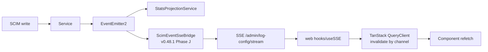
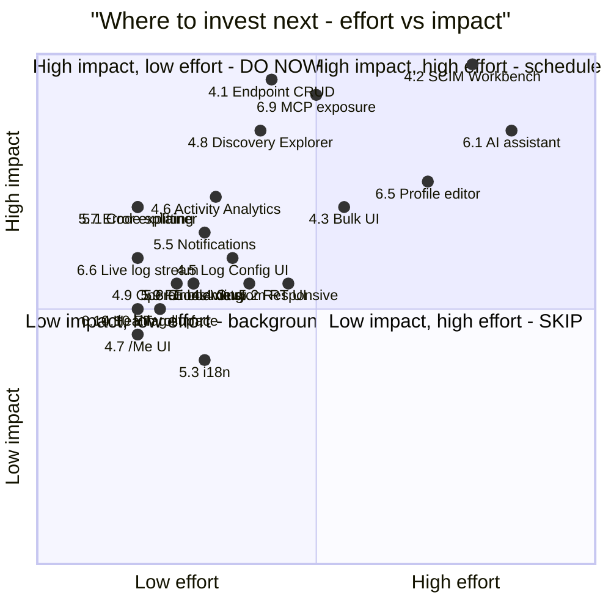
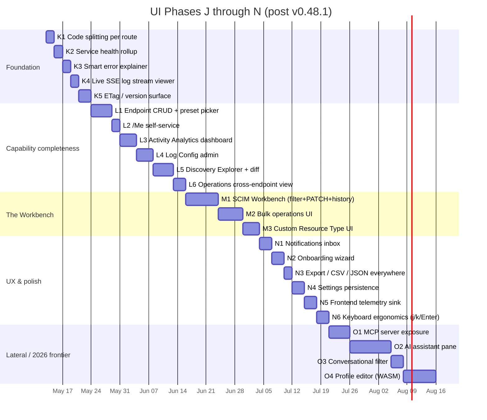

# UI - Next Gaps, Lateral Possibilities & Best-Practice Analysis (Post-Phase I)

> **Date:** 2026-05-12 - **Version basis:** 0.48.1 - **Status:** Analysis (no code changes)
> **Source-of-truth basis:** Direct reads from [api/src/](../api/src/), [web/src/](../web/src/), [api/prisma/schema.prisma](../api/prisma/schema.prisma), [docs/rfcs/](rfcs/) (RFC 7642 / 7643 / 7644 + active drafts), [docs/UI_REDESIGN_ARCHITECTURE_AND_PLAN.md](UI_REDESIGN_ARCHITECTURE_AND_PLAN.md), [docs/UI_REDESIGN_REMAINING_GAPS_PLAN.md](UI_REDESIGN_REMAINING_GAPS_PLAN.md) (Phases A through I shipped + J SSE bridge), [docs/STRATEGIC_FORWARD_LOOK_2026.md](STRATEGIC_FORWARD_LOOK_2026.md), [docs/STRATEGIC_LATERAL_AND_VISIONARY_2026.md](STRATEGIC_LATERAL_AND_VISIONARY_2026.md).
> **Predecessor:** This document picks up *after* the original UI redesign plan declared "complete" at v0.48.0 + Phase J SSE bridge at v0.48.1. The original plan answered "what does the new UI look like." This one answers "what is still missing, what does the latest 2026 best-practice surface demand, and what is laterally possible now that the foundation is solid."
> **Audience:** Engineering, product, design.

---

## Table of Contents

1. [Executive Summary](#1-executive-summary)
2. [Verified Current State (v0.48.1)](#2-verified-current-state-v0481)
3. [The Capability-Coverage Matrix - Backend vs UI](#3-the-capability-coverage-matrix---backend-vs-ui)
4. [Tier 1 - Operational Completeness Gaps (Must-Have)](#4-tier-1---operational-completeness-gaps-must-have)
5. [Tier 2 - UX Polish & Industry Best Practices](#5-tier-2---ux-polish--industry-best-practices)
6. [Tier 3 - Lateral & Visionary Moves (2026 Frontier)](#6-tier-3---lateral--visionary-moves-2026-frontier)
7. [Cross-Cutting Best-Practice Audit](#7-cross-cutting-best-practice-audit)
8. [Effort x Impact x Differentiation Matrix](#8-effort-x-impact-x-differentiation-matrix)
9. [Recommended Phase Roadmap (J -> N)](#9-recommended-phase-roadmap-j---n)
10. [Risk Register](#10-risk-register)
11. [Appendix A - Source-Verified Inventory](#11-appendix-a---source-verified-inventory)

---

## 1. Executive Summary

The redesigned UI shipped at v0.48.0 and the SCIM event SSE bridge at v0.48.1 close every item in the [UI Redesign Remaining Gaps Plan](UI_REDESIGN_REMAINING_GAPS_PLAN.md). At 6,254 assertions across 5 layers, the current UI is exhaustively tested. **It is also incomplete in three meaningful ways that the original plan did not surface.**

| Lens | What the original plan covered | What is still missing |
|------|--------------------------------|----------------------|
| **Backend coverage** | 84 routes inventoried, ~50 wired to UI | Endpoint CRUD, Bulk, /Me, Custom Resource Types, Log Config admin, Activity Summary, ServiceProviderConfig viewer, Profile Preset picker - **all backend-complete, all UI-absent** |
| **RFC depth** | Discovery (read-only) + the User/Group write paths | No visual SCIM filter builder, no PATCH builder, no ETag/version surface, no RequireIfMatch pre-flight, no Bulk job tracker - the UI assumes the operator hand-crafts SCIM JSON |
| **2026 best practices** | URL-driven nav, real-time SSE, Cmd+K, axe-core, visual regression, code coverage, bundle budget | No code-splitting (377 KB single chunk vs ~90 KB target), no i18n, no responsive/mobile strategy, no AI assistant pane, no telemetry sink for FE errors, no onboarding wizard, no offline/PWA |

The **single highest-leverage next move** is **the SCIM Workbench** (Tier 1, item 4.2): a Postman-in-browser experience bound to the active endpoint + auth + cached schemas. It collapses 4 of the 10 Tier-1 gaps into one feature (PATCH builder, filter builder, /Me explorer, Bulk submitter) and unblocks Tier 3.4 (AI assistant pane) by giving the agent a programmable surface that mirrors what humans use.

The **single biggest hidden risk** is performance: a 377 KB initial JS payload routes-all-at-once is fine for an admin tool today and will become embarrassing the moment one new dashboard chart arrives. Phase J (route-level `React.lazy` + `<Suspense>`) was deferred at H6 and should land before any Tier 1 feature so the new screens are charged against per-route budgets, not the global one.

The **single most-overlooked lateral opportunity** is the **Discovery Explorer with two-endpoint diff** (Tier 3.5). Source-of-truth schema definitions are already cached, the tighten-only validator algebra (see [STRATEGIC_LATERAL_AND_VISIONARY_2026.md §2.1](STRATEGIC_LATERAL_AND_VISIONARY_2026.md#21-asset-a---the-tighten-only-algebra-overlooked)) is already in the API, and no commercial SCIM tool has this. It would take ~5 days and become a flagship differentiator.

---

## 2. Verified Current State (v0.48.1)

Direct read of [web/src/](../web/src/) on 2026-05-12.

### 2.1 Routes that exist (10 + 1 root)

```
__root
  /                        index            -> DashboardPage
  /endpoints                                -> EndpointsPage
  /endpoints/$endpointId   layout           -> EndpointDetailPage
    /                      index             -> OverviewTab
    /users                                   -> UsersTab
    /groups                                  -> GroupsTab
    /activity                                -> ActivityTab
    /schemas                                 -> SchemasTab
    /credentials                             -> CredentialsTab
    /logs                                    -> LogsTab
    /settings                                -> SettingsTab
  /manual-provision                         -> ManualProvisionPage
  /logs                                     -> LogsPage (global)
  /settings                                 -> SettingsPage (global)
```

### 2.2 Mutation hooks that exist

| Hook | HTTP | Optimistic |
|------|------|------------|
| `useCreateCredential` / `useDeleteCredential` | POST/DELETE `/admin/endpoints/:id/credentials[/:credId]` | Delete only |
| `useUpdateEndpointConfig` | PUT `/admin/endpoints/:id` | Yes (deep-merge into 2 caches) |
| `useCreateUser` / `useUpdateUser` / `useDeleteUser` | POST/PATCH/DELETE `/endpoints/:id/Users[/:uid]` | Update + Delete |
| `useCreateGroup` / `useUpdateGroup` / `useDeleteGroup` | POST/PATCH/DELETE `/endpoints/:id/Groups[/:gid]` | Update + Delete |

### 2.3 Real-time wiring (Phase J, v0.48.1)



Channels invalidated: `users`, `groups`, `resources`, `credentials`, `endpoints`, `logs`, `globalLogs`, `endpointLogs`, `activity`. Logs and activity always-invalidated (any channel touches both surfaces). Verified at [web/src/hooks/useSSE.ts](../web/src/hooks/useSSE.ts).

### 2.4 What the UI does NOT call (the headline gaps)

Direct grep across [web/src/api/queries.ts](../web/src/api/queries.ts) - the URLs below have **zero hits in the web tree** despite being live admin/SCIM routes.

| API surface | Backend evidence | UI status |
|-------------|------------------|-----------|
| `POST /admin/endpoints` | [endpoint.controller.ts:41](../api/src/modules/endpoint/controllers/endpoint.controller.ts) | **Missing** - endpoints can only be created via curl/script today |
| `PATCH /admin/endpoints/:id` | [endpoint.controller.ts:111](../api/src/modules/endpoint/controllers/endpoint.controller.ts) | Used only for flag toggles via SettingsTab; not for general endpoint metadata edit |
| `DELETE /admin/endpoints/:id` | [endpoint.controller.ts:124](../api/src/modules/endpoint/controllers/endpoint.controller.ts) | **Missing** - cannot delete an endpoint from the UI |
| `GET /admin/endpoints/presets` | [endpoint.controller.ts:66](../api/src/modules/endpoint/controllers/endpoint.controller.ts) | **Missing** - no preset picker; SettingsTab shows preset as a static badge |
| `POST /endpoints/:id/Bulk` | [endpoint-scim-bulk.controller.ts:72](../api/src/modules/scim/controllers/endpoint-scim-bulk.controller.ts) | **Missing** - 1000-op batch capability invisible |
| `GET/PUT/PATCH/DELETE /Me` | [scim-me.controller.ts:159+](../api/src/modules/scim/controllers/scim-me.controller.ts) | **Missing** - no self-service tab |
| `GET /admin/endpoints/:id/Schemas[/:uri]` | [endpoint-scim-discovery.controller.ts:93+](../api/src/modules/scim/controllers/endpoint-scim-discovery.controller.ts) | Listed in SchemasTab; **no individual viewer**, **no copy-as-JSON**, **no diff-vs-RFC** |
| `GET /admin/endpoints/:id/ResourceTypes[/:id]` | [endpoint-scim-discovery.controller.ts:127+](../api/src/modules/scim/controllers/endpoint-scim-discovery.controller.ts) | **Missing** - resource types not shown anywhere |
| `GET /admin/endpoints/:id/ServiceProviderConfig` | [endpoint-scim-discovery.controller.ts:161](../api/src/modules/scim/controllers/endpoint-scim-discovery.controller.ts) | **Missing** - SPC not surfaced |
| Custom Resource Type registration (`POST /admin/endpoints/:id/resource-types`) | [G8B doc](G8B_CUSTOM_RESOURCE_TYPE_REGISTRATION.md) | **Missing** - feature shipped in API at v0.18.0, never exposed in UI |
| Generic SCIM CRUD (`/:resourceType` wildcard) | [endpoint-scim-generic.controller.ts](../api/src/modules/scim/controllers/endpoint-scim-generic.controller.ts) | **Missing** - UsersTab/GroupsTab hard-coded to `Users` and `Groups` |
| `GET/PUT /admin/log-config` (level per category/endpoint, prune, retention) | [log-config.controller.ts](../api/src/modules/logging/log-config.controller.ts) | **Missing** - operator can't change log verbosity from the UI |
| `GET /admin/log-config/audit` (admin actions on logs) | [log-config.controller.ts:223](../api/src/modules/logging/log-config.controller.ts) | **Missing** |
| `GET /admin/log-config/download` | [log-config.controller.ts:334](../api/src/modules/logging/log-config.controller.ts) | **Missing** - no download button on LogsPage |
| `GET /admin/log-config/stream` (SSE tail) | [log-config.controller.ts:260](../api/src/modules/logging/log-config.controller.ts) | Used internally by `useSSE` for invalidation; **no human "tail -f" view** |
| `GET /admin/activity/summary` (aggregations) | [activity.controller.ts:175](../api/src/modules/activity-parser/activity.controller.ts) | **Missing** - dashboard shows raw activity but not summaries |
| `GET /admin/database/{users,groups,statistics}` (cross-endpoint operator view) | [database.controller.ts](../api/src/modules/database/database.controller.ts) | **Missing** - this was the legacy "Database Browser"; redesigned UI never replaced it |
| Health page (`/health`) | [health.controller.ts](../api/src/modules/health/health.controller.ts) | Used implicitly by token gate; **no dedicated status page** |
| Version diagnostics (rich runtime/container/host info) | [admin.controller.ts:317](../api/src/modules/scim/controllers/admin.controller.ts) | Only the version string is displayed in the header; the rich payload is wasted |

---

## 3. The Capability-Coverage Matrix - Backend vs UI

Each of the 84 SCIM/Admin routes plotted against UI exposure. Aggregated counts per category:

| Category | Routes | Exposed in UI | Coverage |
|----------|--------|---------------|----------|
| Discovery (Schemas / RT / SPC / both root + per-endpoint) | 11 | 1 (per-endpoint Schemas list only) | **9 %** |
| User/Group CRUD per endpoint | 12 | 12 (full) | **100 %** |
| Generic Resource Type CRUD | 7 | 0 | **0 %** |
| Bulk | 1 | 0 | **0 %** |
| /Me | 4 | 0 | **0 %** |
| Endpoint admin | 9 | 1 (PATCH for flag toggles) | **11 %** |
| Credentials admin | 3 | 3 | **100 %** |
| Logs / Log Config / Audit / Download / Stream / Prune | 11 | 2 (list, detail) | **18 %** |
| Activity (list, summary) | 2 | 1 (list) | **50 %** |
| Database admin (cross-endpoint operator view) | 5 | 0 | **0 %** |
| Dashboard / Overview / Health / Version | 5 | 4 | **80 %** |
| OAuth | 2 | 0 (token entered manually via TokenGate) | **0 %** |

**Headline:** ~50 % of HTTP surface is reachable from the UI. The half that is not includes every advanced SCIM capability the project ships: Bulk, /Me, custom resource types, full discovery, log control. **The UI today is a "browse + simple CRUD" tool; the backend is a full SCIM operating system.**

---

## 4. Tier 1 - Operational Completeness Gaps (Must-Have)

These are gaps where the API is shipped, tested at all 5 layers, and used in production - but the UI silently relies on `curl` / Postman / live-test scripts to drive them.

### 4.1 Endpoint CRUD UI with Preset Picker

> **Status: CLOSED in v0.50.0-alpha.1 (Phase L1, 2026-05-13).** See [docs/PHASE_L1_ENDPOINT_CRUD.md](PHASE_L1_ENDPOINT_CRUD.md) for the shipped architecture, mutation lifecycle Mermaid, and DoD evidence. The 4-step wizard ships at `/endpoints/new`, the edit form at `/endpoints/$id/edit`, and the type-name-to-confirm delete modal mounts in the EndpointDetail header.

**Why critical:** Today an operator cannot create a new endpoint from the UI. Every onboarding still requires shell access + a hand-crafted POST body. This single gap defeats the "self-service admin tool" framing of the redesign.

**Shape:**

- New route `/endpoints/new` (Wizard) and `/endpoints/$id/edit` (Form)
- Step 1: Name + display name + base path + preset (combobox sourced from `GET /admin/endpoints/presets`)
- Step 2: Preset preview (read-only display of what the preset locks in: schemas, settings, RFC compliance score)
- Step 3: Optional override - any flag can be flipped before commit (uses the same Switch grid as SettingsTab)
- Step 4: Confirm + POST -> redirect to detail page with toast
- DELETE button on EndpointDetail header with confirm modal (text-match safety - "type the endpoint name to confirm")

**RFC dimension:** Discovery (RFC 7644 §4) - the preset preview should render the resulting `/ServiceProviderConfig` and `/ResourceTypes` view alongside the form so the operator sees the SCIM-facing contract before commit.

**Effort:** 4-5 days. **Test counts (estimated):** +2 mutation hooks, +12 web vitest, +2 E2E (NestJS), +6 live (PowerShell section after current `9z-Z`).

### 4.2 SCIM Workbench (the killer feature)

**Why this is the highest-leverage move:** It collapses 4 separate Tier-1 gaps (PATCH builder, filter builder, Bulk submitter, Discovery explorer) into one composable workbench. The cmdk palette opens it; it pre-fills auth + endpoint + schemas from the active route.

**Shape:**

```
+---------------------------------------------------------------+
| Workbench                                       [x] [Cmd+K]   |
+---------------------------------------------------------------+
| Method: [POST v]  Path: [/endpoints/{id}/Users/.search ____ ] |
| Endpoint: [Pick endpoint v]  Auth: [Per-endpoint v Bearer ...] |
+---------------------------------+-----------------------------+
| BODY (JSON)                     | RESPONSE (200 OK in 47 ms)  |
| {                               | { "totalResults": 12, ... } |
|   "schemas": [".../SearchReq.." | [Headers] [Body] [Raw] [Diff]|
|   "filter": "userName co \"a\""  |                             |
| }                               |                             |
| [Build filter visually]         | [Save as snippet]           |
| [Build PATCH visually]          | [Copy as curl] [Copy as TS] |
+---------------------------------+-----------------------------+
| HISTORY (ring buffer of 50)                                    |
| 14:02:11 POST /Users          201  124 ms   curl|copy|rerun   |
| 14:02:08 GET  /Users?filter=  200  31  ms                     |
+---------------------------------------------------------------+
```

**Sub-features:**

| Feature | Source | Why valuable |
|---------|--------|--------------|
| **Visual filter builder** | TanStack `useState` form -> emits SCIM filter string per RFC 7644 §3.4.2.2 | Operator never has to memorize `co/sw/ew/pr/gt/ge/lt/le` operator codes |
| **Visual PATCH builder** | Schema-aware path autocomplete from cached `/Schemas` data | Wraps RFC 7644 §3.5.2 (op/path/value); validates path against schema before send |
| **`Copy as curl` / `Copy as TS`** | Templated from the active request | Workbench becomes a learning tool; every UI action is reproducible from a terminal |
| **History ring buffer** | Zustand-backed, last 50 requests, persisted to `localStorage` | "What did I just do?" recovery |
| **Saved snippets** | Per-user collection in localStorage; export to JSON | Postman-collection equivalent; sharable |
| **`Save as live-test step`** | Emits PowerShell snippet ready to paste into [scripts/live-test.ps1](../scripts/live-test.ps1) | Closes the gap between manual exploration and the regression suite - **no other admin UI does this** |

**Effort:** 6-8 days. **Test counts (estimated):** +1 mutation hook (free-form `useScimRequest`), +25 web vitest, +5 Playwright (filter builder, PATCH builder, snippet save, copy-as-curl, history navigation).

### 4.3 Bulk Operations UI

**Why:** [endpoint-scim-bulk.controller.ts:72](../api/src/modules/scim/controllers/endpoint-scim-bulk.controller.ts) supports 1000-op batches with `bulkId` cross-references. Today the only consumer is [scripts/live-test.ps1](../scripts/live-test.ps1).

**Shape:**

1. New tab `/endpoints/$id/bulk` between Activity and Schemas
2. Drop zone for CSV/JSON file (max 1 MB to mirror server limit)
3. Mapping panel: CSV column -> SCIM attribute (per-resource-type schema-aware)
4. Preview: first 10 rows rendered as the `BulkRequest` payload
5. Submit -> show `bulkId` cross-reference graph + per-op success/failure
6. Failure rows downloadable as CSV with `error.detail` / `error.scimType` columns
7. Future-proof for [draft-ietf-scim-bulk-async](https://datatracker.ietf.org/doc/draft-ietf-scim-bulk-async/) with a `?async=true` toggle (server returns 202 + Location)

**RFC dimension:** RFC 7644 §3.7. Includes `failOnErrors` threshold control.

**Effort:** 5-6 days. **Test counts:** +15 web vitest (CSV parser, mapping, preview), +3 E2E.

### 4.4 Custom Resource Type Registration UI

**Why:** [G8B_CUSTOM_RESOURCE_TYPE_REGISTRATION.md](G8B_CUSTOM_RESOURCE_TYPE_REGISTRATION.md) shipped in v0.18.0. The feature is invisible in the UI. Customers paying for "extensible SCIM" cannot extend it without curl.

**Shape:**

- New tab `/endpoints/$id/resource-types` (visible only when `CustomResourceTypesEnabled` config flag is true; otherwise show a "feature is disabled" panel with link to SettingsTab)
- List of existing custom resource types with name, schema URN, route, member count
- Create wizard: name -> schema URN (autocomplete from cached Schemas) -> profile preview -> commit
- Per-resource-type detail: full CRUD list (uses the existing `useScim*` hooks generalized to `/:resourceType`)
- Delete with cascade-confirm (preview affected resource count before commit)

**Effort:** 4 days. **Test counts:** +3 mutation hooks, +12 web vitest, +2 E2E, +8 live.

### 4.5 Log Config Admin UI

> **Status: CLOSED in v0.50.0-alpha.4 (Phase L4, 2026-05-13).** See [docs/PHASE_L4_LOG_CONFIG_ADMIN.md](PHASE_L4_LOG_CONFIG_ADMIN.md). New `<LogConfigSection />` on SettingsPage with global level + format + payload toggles + per-category grid sourced from server's `availableLevels` / `availableCategories`. Optimistic deep-merge mutation + rollback. Per-endpoint level grid + audit trail panel + stream viewer + download button explicitly out of scope (already covered by other surfaces).

**Why:** [log-config.controller.ts](../api/src/modules/logging/log-config.controller.ts) ships GET/PUT for global level, per-category level (`auth`, `scim`, `database`, etc.), per-endpoint level, audit trail, download, stream, prune. None of it is exposed.

**Shape:**

- Convert global `/settings` from a stub into a real Log Config dashboard:
  - Global level radio (DEBUG / INFO / WARN / ERROR)
  - Per-category grid of dropdowns
  - Per-endpoint grid (inherits from endpoint detail Settings tab)
  - Retention controls (days, ring buffer size, file enabled toggle)
  - Audit trail table (who changed what when)
  - Download button (with format selector: JSON / NDJSON / CSV)
- New floating panel: live SSE log stream view (collapsible side drawer; tail-f experience; color-coded by level; auto-scroll; pause/resume)

**RFC dimension:** Not RFC 7643/7644 directly but operational completeness for any RFC-compliant deployment.

**Effort:** 4 days. **Test counts:** +6 mutation hooks, +18 web vitest, +1 Playwright (SSE drawer).

### 4.6 Activity Summary / Analytics Dashboard
> **Status: CLOSED in v0.50.0-alpha.3 (Phase L3, 2026-05-13).** See [docs/PHASE_L3_ACTIVITY_ANALYTICS.md](PHASE_L3_ACTIVITY_ANALYTICS.md) for the shipped architecture. New `<ActivityAnalyticsSection />` on DashboardPage with 4 KPI tiles (24h/7d/users-30d/groups-30d) + horizontal users-vs-groups ops split bar. p50/p95/p99 latency lines, drill-down, and flexible time-range picker are explicitly deferred to Phase N polish (require a different aggregator than the current bounded SQL counts).
**Why:** [activity.controller.ts:175](../api/src/modules/activity-parser/activity.controller.ts) ships `GET /admin/activity/summary` with aggregations (operation counts, error rates, top endpoints by volume, top users by activity). DashboardPage shows raw activity rows but never the aggregations.

**Shape:**

- Promote DashboardPage from KPI cards + list to a real analytics dashboard with multiple `KpiChart` panels:
  - Requests by status code (stacked bar, last 24 h)
  - Operations by type (pie or stacked bar)
  - Top 10 endpoints by request volume (horizontal bar)
  - Error rate trend line
  - p50 / p95 / p99 latency lines
- Time range picker (1 h / 24 h / 7 d / 30 d / custom)
- Drill-down: click any chart slice -> auto-navigate to filtered LogsPage
- "Save view" button captures current filter + time range as a sharable URL

**Effort:** 3-4 days. **Test counts:** +2 query hooks, +10 web vitest, +1 Playwright (chart interaction).

### 4.7 /Me Self-Service UI

> **Status: CLOSED in v0.50.0-alpha.2 (Phase L2, 2026-05-13).** See [docs/PHASE_L2_ME_SELF_SERVICE.md](PHASE_L2_ME_SELF_SERVICE.md) for the shipped architecture, mutation lifecycle Mermaid, and the OAuth-required fallback design that handles the K3 TokenGate's shared-secret bearer case as first-class UX.

**Why:** [scim-me.controller.ts](../api/src/modules/scim/controllers/scim-me.controller.ts) ships at v0.20.0. The token holder can never see "what does the server think I am."

**Shape:**

- Header: dropdown beside the bell/theme icons -> "My profile"
- Drawer or page showing GET /Me result for the current OAuth-authenticated user
- Edit form (PUT/PATCH /Me) for self-service attribute updates respecting the active profile's `mutability`
- Delete button (DELETE /Me) for self-service deactivation
- Falls back to "/Me is not available with the global shared secret" when token is the global one (UX: route to TokenGate to upgrade auth)

**Effort:** 2 days. **Test counts:** +4 query/mutation hooks, +8 web vitest.

### 4.8 Discovery Explorer

> ✅ **CLOSED in v0.50.0-alpha.5 (Phase L5, 2026-05-13).** See [docs/PHASE_L5_DISCOVERY_EXPLORER.md](PHASE_L5_DISCOVERY_EXPLORER.md). New top-level `/discovery` route (5th sidebar nav entry) with three sub-tabs (ServiceProviderConfig | ResourceTypes | Schemas), endpoint scope picker (1 or 2 endpoints), and side-by-side Schemas diff view colored by a new pure diff reducer that mirrors the API tighten-only-validator algebra (`MUTABILITY_RANK` / `UNIQUENESS_RANK` / coarse 2-rank `RETURNED_RANK`). Cells expose `data-status` = tighten/relax/unchanged/incomparable/only-a/only-b. RFC 7643 §2.2 default substitution applied BEFORE classification per the project's Schema-Characteristic Test Rule. Action toolbar: Copy as JSON / Copy as URN (both work) + Open in Workbench (disabled stub - wired in Phase M1). +42 web vitest (22 reducer + 6 hook + 11 page + 3 size-limit ratchet) + 5 live SCIM in new section 9z-AE. Out of scope (deferred): real Workbench wiring (M1), schema-property edit history (M1), RFC compliance score chart (Phase N), sub-attribute drill-down (L6/M).

**Why:** SchemasTab is per-endpoint and read-only. There is no place to see ServiceProviderConfig, ResourceTypes, or to compare two endpoints' discovery surfaces. With the [tighten-only validator algebra](../api/src/modules/scim/endpoint-profile/tighten-only-validator.ts) in place, **two-endpoint diff is a 1-day feature** that no commercial SCIM tool ships.

**Shape:**

- New route `/discovery` (top-level)
- Three panels (tabs): ServiceProviderConfig, ResourceTypes, Schemas
- Endpoint scope selector (1 or 2 endpoints; when 2, panels switch to side-by-side diff)
- Per-attribute characteristic badges (already in SchemasTab)
- "Copy as JSON" / "Copy as URN" / "Open in Workbench" buttons
- Diff view highlights tighten / relax / unchanged in green/red/grey using the existing `MUTABILITY_RANK` / `UNIQUENESS_RANK` partial orders

**Effort:** 4-5 days. **Test counts:** +3 query hooks, +14 web vitest.

### 4.9 Database / Cross-Endpoint Operator View

**Why:** [database.controller.ts](../api/src/modules/database/database.controller.ts) ships an operator-grade cross-endpoint view (all users, all groups, statistics). The legacy "Database Browser" tab covered this; the redesigned UI never restored it.

**Shape:**

- New top-level route `/operations` (renamed from "Database Browser" - the word "database" leaks an implementation detail)
- Three sub-tabs: All Users, All Groups, Statistics
- Same data table primitive as UsersTab/GroupsTab; rows tagged with their endpoint (clickable badge -> navigate to that endpoint's UsersTab pre-filtered)
- Statistics tab: total users / groups / requests / errors per endpoint, downloadable as CSV

**Effort:** 3 days. **Test counts:** +3 query hooks, +10 web vitest.

### 4.10 ETag / Version Surface + RequireIfMatch Pre-Flight

> ✅ **CLOSED in v0.49.0-alpha.5 as Phase K5.** See [docs/PHASE_K5_ETAG_AND_REQUIREIFMATCH.md](PHASE_K5_ETAG_AND_REQUIREIFMATCH.md). EtagBadge in metadata, If-Match forwarded on Save, 412/428 open ConflictDialog with side-by-side diff + Refresh-and-reapply + Force-overwrite (gated by isForceOverwriteSafe policy). +30 web vitest tests.

**Why:** [Phase 7](../docs/phases/PHASE_07_ETAG_CONDITIONAL_REQUESTS.md) replaced timestamp ETags with monotonic `W/"v{N}"` and the `RequireIfMatch` config flag exists. Today **the UI never displays the ETag**. If a user opens a row, walks away, comes back, edits, and saves while another tab modified the row, the optimistic update path fails with 412 and the user sees a generic error.

**Shape:**

- Detail drawer footer: small monospace `v3` badge next to "Last modified 2 minutes ago"
- Save flow: include `If-Match: W/"v{N}"` (already done at hook level via [Phase C5 F-5 hardening](PHASE_C_PRIMITIVES_AND_MUTATIONS.md))
- On 412 / 428: pop a "Refresh and reapply" dialog instead of a red banner. Show the diff between the user's edits and the server's current state side-by-side.
- When `RequireIfMatch=true` and the form has not yet loaded the row's ETag: disable Save with a tooltip explaining why
- "Force overwrite" button on the 412 dialog (sends `If-Match: *`) for operator escape hatch

**Effort:** 3 days. **Test counts:** +6 web vitest, +2 E2E (412 round trip), +2 live.

---

## 5. Tier 2 - UX Polish & Industry Best Practices

These are not gaps in capability - they are gaps in the experience that ship every well-regarded admin tool of 2026.

### 5.1 Code Splitting per Route (Phase J - already deferred)

> ✅ **CLOSED in v0.49.0-alpha.1 as Phase K1.** See [docs/PHASE_K1_ROUTE_CODE_SPLITTING.md](PHASE_K1_ROUTE_CODE_SPLITTING.md). Main entry dropped 381 KB -> 144 KB gzipped (-62 %). 14 per-route chunks each under 11 KB. 16 size-limit budgets in place.

Captured in [Session_starter.md 2026-05-09 Phase H6](../Session_starter.md). Single bundle is 377 KB gzipped (94 % of the 400 KB budget). One new chart library or one new route doubles the initial payload. Convert each top-level route component to `React.lazy(() => import('./pages/X'))` wrapped in `<Suspense fallback={<LoadingSkeleton />}>`. Re-baseline budget to per-route 90/110 KB targets from the original plan §12.

**Effort:** 1-2 days. **Test counts:** +3 web vitest (lazy loader contracts), +1 Playwright (route transition spinner).

### 5.2 Mobile / Responsive Strategy

The original plan had Section 21 "Responsive & Mobile Strategy" that was never implemented. Sidebar today is fixed-width and always shown; below 768 px the layout breaks. Tables horizontal-scroll instead of stacking.

**Shape:**

- `useMediaQuery` hook with three breakpoints: mobile (`< 768`), tablet (`768-1024`), desktop (`>= 1024`)
- Mobile: sidebar collapses behind a hamburger; tables -> Fluent UI `Card` stack; Cmd+K palette -> bottom sheet
- Tablet: sidebar narrows to icon-only; tables keep but with reduced column set
- Desktop: current full layout

**Effort:** 4-5 days. **Test counts:** +12 web vitest (responsive props), +3 Playwright (mobile / tablet / desktop visual regression baselines).

### 5.3 Internationalization (i18n)

Single-language English today. For a tool used by global IT teams (the SCIM connector audience is heavily international), i18n is table-stakes.

**Shape:**

- `react-intl` with ICU MessageFormat
- Extract all hardcoded strings to `web/src/i18n/en.json` (~600 keys)
- Default locale: English
- Translator-ready: build script emits a CSV for translation vendors
- Date/number formatting via `Intl.*` (already in browser; no extra deps)
- RTL support: Fluent UI v9 has `dir` propagation - flip on `<html dir="rtl">` for Arabic/Hebrew

**Effort:** 3 days for plumbing, ongoing for translation. **Test counts:** +6 web vitest (string-extraction lint).

### 5.4 Settings Persistence (User Preferences)

Today only the color scheme persists. Table column visibility, page size, dense mode, default endpoint scope, sidebar collapse state - all reset on reload.

**Shape:**

- Extend Zustand `ui-store` with a `preferences` slice persisted to `localStorage` with versioned migration
- Per-page preference panels (gear icon top-right of every list)
- Reset-to-defaults button
- "Sync across browsers" backed by a future server-side `/admin/me/preferences` (defer; localStorage is enough today)

**Effort:** 2-3 days. **Test counts:** +10 web vitest (preference reducers, migrations, reset).

### 5.5 Notifications Inbox

> ✅ **CLOSED in v0.52.0-alpha.1 (Phase N1, 2026-05-15).** See [docs/PHASE_N1_NOTIFICATIONS_INBOX.md](PHASE_N1_NOTIFICATIONS_INBOX.md). Bell icon + unread-count badge (caps at 99+) in AppHeader + right-side OverlayDrawer with severity-coded list + Mark-all-read + Clear + Take-me-there link to per-endpoint Activity. New notifications-store (Zustand) with localStorage persistence (key `scimserver.notifications.v1`) + 7-day TTL pruning + 50-entry ring buffer + id-based dedupe (the SSE bridge generates ids from `bucketKey(type, endpointId, second)` so bursts collapse). New severity classifier: `*.error` -> error, `endpoint.updated`/`endpoint.deleted`/`credential.revoked` -> warning, routine CRUD -> info. useSSE extended to push every supported SCIM event into the store alongside the existing cache-invalidation path. +33 web vitest. No new live SCIM section - underlying SSE surface already locked at 9z-H + 9z-I + 9z-V. Out of scope (deferred): toast for high-severity events, Web Push API (needs service worker we don't ship), per-row dismiss, server-side persistence.

SSE-driven events fire today but have no human-visible surface beyond cache invalidation. Operator misses the signal "endpoint X just went red" unless they happen to be on the dashboard.

**Shape:**

- Bell icon in header with unread count badge
- Drawer lists last 50 events: type / target / timestamp / dismiss / "Take me there"
- Categories: errors (5xx response from any endpoint), warnings (config changes), deploy events (version bump)
- Persisted to `localStorage` with TTL (last 7 days)
- Toast for high-severity events (errors only) - dismissable
- Optional: browser push notifications via the Web Push API (gated behind permission prompt)

**Effort:** 3 days. **Test counts:** +12 web vitest, +1 Playwright (toast + drawer).

### 5.6 Export Buttons (CSV / JSON) on Every List

Lists today have no export. Operator who wants "all users on endpoint X" has to write a script. Add an "Export" split-button (CSV / JSON / NDJSON) to UsersTab, GroupsTab, LogsTab, ActivityTab, /operations. Honors current filters.

**Effort:** 2 days (one helper, applied everywhere). **Test counts:** +8 web vitest.

### 5.7 Smart Error Explainer

> ✅ **CLOSED in v0.49.0-alpha.3 as Phase K3.** See [docs/PHASE_K3_SMART_ERROR_EXPLAINER.md](PHASE_K3_SMART_ERROR_EXPLAINER.md). 3-layer architecture (ScimApiError + parseScimError + ScimErrorMessage primitive), catalog covers every RFC 7644 Table 9 keyword + 5 HTTP-status fallbacks, +39 web vitest tests, 3 consumer surfaces wired.

SCIM error responses today render as a red MessageBar with raw `detail`. The error catalog already exists ([LOGGING_ERROR_HANDLING_IDEAL_DESIGN.md](LOGGING_ERROR_HANDLING_IDEAL_DESIGN.md)). Wire it.

**Shape:**

- ErrorBanner primitive that switches on `scimType` and `status`
- For each well-known error: 1-line plain-English explanation, RFC reference link, suggested fix
- "View full error JSON" expander
- "Open in Workbench (E.4.2)" button to retry with edits
- Telemetry: increment a counter per `scimType` so we can see which errors hit users most

**Effort:** 2 days. **Test counts:** +14 web vitest (one per scimType in the catalog).

### 5.8 Onboarding Wizard

First-run UX today is "type your token into a dialog and figure it out." Add a guided path: Step 1 token, Step 2 first endpoint creation (4.1), Step 3 first credential, Step 4 first manual provision, Step 5 "you are ready - here is the dashboard." Skippable for power users, persistent flag in `localStorage`.

**Effort:** 3 days. **Test counts:** +6 web vitest, +1 Playwright (full wizard happy path).

### 5.9 Frontend Telemetry Sink

`ErrorBoundary` console-logs and dies. No Web Vitals collection. No request tracing on the FE side.

**Shape:**

- New `POST /admin/web-telemetry` endpoint (rate-limited per IP) accepting `{ kind: 'error' | 'webvital', payload }`
- Frontend hook `useTelemetry()` exposes `trackError(err, ctx)` and `trackVital(name, value)`
- Wire `web-vitals` package (CLS, LCP, INP, FID, TTFB) to the hook
- ErrorBoundary `componentDidCatch` posts an anonymized error report (file + line + boundary route, no user data)
- DashboardPage adds a "Frontend health" KPI tile showing Web Vitals p75 across all sessions

**Effort:** 3 days (1 BE + 2 FE). **Test counts:** +1 controller spec, +6 web vitest, +1 E2E.

### 5.10 Multi-User / RBAC Inside the UI

Single shared token today; every viewer is admin. For larger teams, viewer/operator/admin roles via OAuth scopes.

**Shape:**

- OAuth JWT carries `scope: "scim.read scim.write scim.admin"` (already plumbed at API; UI ignores)
- New `useAuth()` hook exposes `roles` derived from JWT scopes
- Every mutation hook checks role; UI hides write buttons for read-only viewers (defense-in-depth - server still enforces)
- "Switch role" dropdown for testing (admin only) backed by ephemeral JWT

**Effort:** 4 days. **Test counts:** +1 hook spec, +12 web vitest (button visibility per role).

### 5.11 Keyboard Ergonomics Beyond Cmd+K

Cmd+K + global g-shortcuts shipped in F1/F2. Missing list-level keys.

| Key | Action |
|-----|--------|
| `j` / `k` | Move row selection in lists (Linear/GitHub idiom) |
| `Enter` | Open detail drawer for selected row |
| `Esc` | Close drawer / dialog |
| `e` | Edit selected row |
| `d` then `d` | Delete selected row (require double-tap) |
| `r` | Refresh current view |
| `f` | Focus search/filter |
| `n` | Next page / `p` previous page in lists |
| `]` / `[` | Cycle through tabs in EndpointDetail |

**Effort:** 2-3 days. **Test counts:** +1 hook (`useListKeyboardNav`), +14 web vitest, +1 Playwright.

### 5.12 Print Stylesheet + Permalinks

URL is already source of truth (TanStack Router). Add a "Copy link" button in every page header. Add a `@media print` stylesheet that hides chrome (sidebar, header) and prints the data-only.

**Effort:** 1 day.

---

## 6. Tier 3 - Lateral & Visionary Moves (2026 Frontier)

Not "must-have." Genuinely uncommon. Each grounded in a real code asset already in the project.

### 6.1 AI Assistant Pane

Side-drawer with a chat surface. Prompt context auto-includes:
- Current route + endpoint + active filter
- Cached Schemas (so it knows the attribute names)
- Last 10 Workbench requests (so it knows what the operator just tried)
- Last 10 SSE events (so it knows what just happened)

**Capabilities:**
- "Find users where X" -> generates SCIM filter, runs in Workbench, shows result
- "Why did this fail?" (selected log row) -> RFC reference + remediation
- "Generate a PATCH that..." -> opens Workbench with PATCH builder pre-filled
- "Compare endpoint A and B" -> opens Discovery Explorer in diff mode
- "Explain this attribute" -> RFC 7643 §X reference inline

**Implementation:**
- MCP server in [api/src/modules/](../api/src/modules/) exposing the cached schemas + endpoints + recent activity as MCP resources
- Frontend uses the MCP-spec'd `Stream` API (or a simple SSE bridge to a small classifier model)
- Falls back to a deterministic NL->SCIM mapper for offline-mode

**Effort:** 8-10 days. **Test counts:** +30 across all layers.

### 6.2 Conversational Filter Builder

Lightweight version of 6.1 scoped to filter strings only. NL input -> SCIM filter via a small classifier (no LLM dependency for the common cases). Examples:

| Operator says | Generated filter |
|---------------|------------------|
| "users created last week" | `meta.created gt "2026-05-05T00:00:00Z"` |
| "active users in engineering" | `active eq true and department eq "Engineering"` |
| "users with manager change last 24h" | `meta.lastModified gt "..." and manager pr` |

**Effort:** 3 days (parser + 50-template grammar). **Test counts:** +20 (one per template).

### 6.3 Time-Travel Scrubber

Drag a horizontal slider through the last 24 h to see what the dashboard / activity / logs view looked like at any point. Powered by the existing `RequestLog` corpus and `requestsLast24hSeries`. Uses [STRATEGIC_LATERAL_AND_VISIONARY_2026.md §2.3](STRATEGIC_LATERAL_AND_VISIONARY_2026.md#23-asset-c---the-behavioral-corpus) Asset C.

**Effort:** 4 days. **Test counts:** +8 web vitest, +1 Playwright.

### 6.4 Compare Mode (two endpoints side-by-side)

Beyond Discovery Explorer (4.8): full side-by-side dashboard, recent traffic, schema diff, settings diff. Useful for migrating connectors from one endpoint to another.

**Effort:** 4 days.

### 6.5 Profile Editor with Tighten-Only Visualization

Drag attributes; UI shows in real time which characteristics tighten (red), relax (green - rejected by validator), or stay equal. Uses the [tighten-only-validator algebra](../api/src/modules/scim/endpoint-profile/tighten-only-validator.ts) directly in the browser via WASM-compiled validator (see [STRATEGIC_LATERAL_AND_VISIONARY_2026.md §4.2](STRATEGIC_LATERAL_AND_VISIONARY_2026.md#42-scim-wasm---the-validator-anywhere)).

**Effort:** 6-8 days. **Test counts:** +20 web vitest.

### 6.6 Live SSE Log Stream (the operator's dream)

> ✅ **CLOSED in v0.49.0-alpha.4 as Phase K4.** See [docs/PHASE_K4_LIVE_LOG_STREAM_VIEWER.md](PHASE_K4_LIVE_LOG_STREAM_VIEWER.md). Floating right-side OverlayDrawer with independent EventSource (DEBUG-level), 5,000-entry ring buffer, level + search filter, pause/resume/clear, auto-scroll-to-bottom. +37 web vitest tests.

Floating right-side panel that tails [/admin/log-config/stream](../api/src/modules/logging/log-config.controller.ts#L260) in real time. Color-coded by level. Searchable. Pausable. Persists last 5,000 lines. The grafana-loki-tail experience inside the admin UI.

**Effort:** 2 days (Phase 4.5 covered the API, this is the UI viewer). **Test counts:** +6 web vitest.

### 6.7 Saved Views & Dashboards-as-Code

"Save this dashboard layout / filter set / time range as a named view" -> URL fragment + named entry in localStorage. Export to JSON (commit-able to git, sharable). Import from JSON on first run (team starter pack).

**Effort:** 3 days.

### 6.8 Workbench / Split-Pane Layout (Multiple Tabs)

VS Code-style layout where multiple routes can be open simultaneously in left/right panes. Useful: open endpoint A's UsersTab on the left, endpoint B's UsersTab on the right. Drag tab to split. State serialized to URL.

**Effort:** 8-10 days (significant; defer unless workbench (4.2) lands first).

### 6.9 MCP Server Exposure

Expose the dashboard / endpoints / schemas / recent-activity / workbench-history as MCP resources. External LLM agents (Claude Desktop, Cursor, Copilot) can drive the UI/API jointly. Combined with 4.2 Workbench, this is **the first SCIM tool with an agent interface**.

**Effort:** 5 days (BE-heavy). See [STRATEGIC_FORWARD_LOOK_2026.md §9](STRATEGIC_FORWARD_LOOK_2026.md) Layer 9.

### 6.10 Service Health Rollup Widget

> ✅ **CLOSED in v0.49.0-alpha.2 as Phase K2.** See [docs/PHASE_K2_SERVICE_HEALTH_ROLLUP.md](PHASE_K2_SERVICE_HEALTH_ROLLUP.md). 5 substatuses (API, Database, Auth, Realtime, Recent errors), strictest-substatus-wins reducer, +32 web vitest tests, +6 KB main bundle (24 % headroom under K1 200 KB budget). Frontend-only.

Top-right traffic-light: green/yellow/red rolling status of DB, SCIM, Auth, Logging, Cache. Click for drill-down. Powered by `/health` (already in API). Auto-refresh on SSE.

**Effort:** 2 days.

### 6.11 PWA + Web Push Notifications

Service worker for offline-first cache. Manifest for "install to home screen." Push notifications for high-severity errors (subset of 5.5).

**Effort:** 3 days.

---

## 7. Cross-Cutting Best-Practice Audit

Independent of the gap matrix, here is a 2026-best-practice scorecard against the latest UI today:

| Concern | Status | Notes |
|---------|--------|-------|
| URL-as-state | ✅ Excellent | TanStack Router + zod search schemas, every filter / pagination / drawer in URL |
| Real-time | ✅ Excellent | SSE + channel-aware invalidation; v0.48.1 closed the cross-tab refresh gap |
| Optimistic mutations | ✅ Good | Per-page list snapshots + rollback; ETag plumbed but not surfaced to UI |
| Error boundaries | ✅ Good | RouteBoundary auto-resets on navigation; missing telemetry sink (5.9) |
| Loading states | ✅ Good | LoadingSkeleton mirrors final layout; no CLS |
| Empty states | ✅ Good | EmptyState primitive on all surfaces post-G2 |
| Accessibility (axe) | ✅ Good | axe-core gate at 0 serious/critical; missing skip-link, focus management on route change |
| Visual regression | ✅ Good | 12 Playwright + 4 vitest baselines |
| Coverage gates | ✅ Good (ratchet floor) | 78/72/65/80 (lines/branches/funcs/stmts) |
| Bundle budget | ⚠️ At-risk | 377 KB single chunk; 6 % headroom; **per-route splitting deferred since H6** |
| Code splitting | ❌ Missing | Phase J follow-up (5.1) |
| Mobile / responsive | ❌ Missing | Plan §21 unimplemented (5.2) |
| i18n | ❌ Missing | English-only (5.3) |
| Settings persistence | ⚠️ Partial | Only color scheme (5.4) |
| Notifications surface | ❌ Missing | SSE invalidates but never notifies (5.5) |
| Export | ❌ Missing | No CSV/JSON export anywhere (5.6) |
| Error explainer | ⚠️ Partial | Generic MessageBar; RFC link missing (5.7) |
| Onboarding | ❌ Missing | First-run UX is a token dialog (5.8) |
| Frontend telemetry | ❌ Missing | No Web Vitals collection, no error sink (5.9) |
| RBAC in UI | ❌ Missing | Single global role (5.10) |
| Keyboard density | ⚠️ Partial | Cmd+K + g-nav; no list-level keys (5.11) |
| Print stylesheet | ❌ Missing | (5.12) |
| Service worker / PWA | ❌ Missing | (6.11) |
| AI / Agent surface | ❌ Missing | (6.1, 6.9) |
| RFC awareness in forms | ⚠️ Partial | Detail drawers don't show characteristic badges (vs SchemasTab which does) |
| ETag / version surface | ❌ Missing | Plumbed at hook level; never visible (4.10) |
| RequireIfMatch pre-flight | ❌ Missing | 412 surfaces as generic error (4.10) |

---

## 8. Effort x Impact x Differentiation Matrix



**Top-right "DO NOW" cluster** (high impact, low effort):
- 5.1 Code splitting
- 5.7 Smart error explainer
- 6.10 Service health rollup
- 6.6 Live log stream viewer
- 4.7 /Me UI

**Top-right "SCHEDULE" cluster** (high impact, higher effort):
- 4.1 Endpoint CRUD
- 4.2 SCIM Workbench (the killer feature)
- 4.8 Discovery Explorer
- 4.6 Activity Analytics dashboard
- 6.9 MCP server exposure

**Bottom-right "SKIP unless strategically required":**
- 6.8 Workbench split-pane (defer)
- 5.2 Responsive (defer until mobile is a stated requirement)

---

## 9. Recommended Phase Roadmap (J -> N)

Building on the existing alphabet (A through I shipped, J SSE bridge shipped), the natural next phases are:



### Phase K (Foundation hardening, ~11 days)

Lock the bundle budget; surface the data the API already produces; close the smallest UX paper-cuts. Five small commits. Quality bar: every commit must keep `size-limit` green, every gate must remain green.

### Phase L (Capability completeness, ~23 days)

Close the "backend ships, UI absent" gap for everything operationally critical. After L, an operator can do **everything with a mouse** that today requires curl.

### Phase M (The Workbench, ~18 days)

The killer feature trio: Workbench + Bulk + Custom RT. After M, SCIMServer is the **only SCIM tool** with a built-in API workbench that round-trips into the regression test suite.

### Phase N (UX & polish, ~17 days)

The "10 % of polish that 90 % of users notice." Ships in parallel with M when staffing allows.

### Phase O (Lateral / 2026 frontier, ~26 days)

Defines the next product chapter. Not on the critical path but **the ROI compounds**: MCP exposure unlocks every external agent; AI assistant unlocks every casual user.

**Total roadmap:** ~95 days of focused engineering, suitable for a 6-month execution plan with 2 engineers in parallel (FE + FE/BE shared).

---

## 10. Risk Register

| ID | Risk | Likelihood | Impact | Mitigation |
|----|------|-----------|--------|------------|
| R1 | K1 (code splitting) breaks visual regression baselines | Medium | Low | Re-baseline once per phase; baselines are code-reviewed |
| R2 | L1 (Endpoint CRUD) interacts badly with multi-tenant credential isolation | Low | High | Defense-in-depth: server still enforces; UI surface is read-only for cross-tenant ops |
| R3 | M1 (Workbench) lets operator brick their own endpoint with a bad PATCH | Medium | Medium | "Dry run" toggle that runs the request against the validator only, no commit |
| R4 | M2 (Bulk UI) misuses cause 1 MB / 1000-op limits to be hit silently | Medium | Low | Pre-flight client-side size check; explain limit in UI |
| R5 | N5 (FE telemetry) leaks user data through error payloads | Low | High | Strict allowlist on telemetry payload; sanitize URLs before send |
| R6 | O1 / O2 (MCP / AI) grants agents too much surface area | Medium | High | Scope MCP exposure to read-only at first; AI assistant runs in dry-run by default |
| R7 | Phase J never gets done; bundle hits 100 % budget; CI red | High | Medium | **Schedule K1 as the next commit** before any new feature lands |
| R8 | i18n delay forces translation cost spike later | Medium | Low | Plumb the framework now (5.3); defer translations until requested |
| R9 | RBAC (5.10) implementation conflicts with 3-tier auth | Low | Medium | Map JWT scopes to roles at the edge; UI hides not blocks |
| R10 | Workbench (M1) becomes "yet another Postman" with no differentiation | Medium | Medium | Differentiator is the live-test export + endpoint/auth/schema awareness; ship that first |

---

## 11. Appendix A - Source-Verified Inventory

### A.1 Web pages (verified 2026-05-12)

```
web/src/pages/
  ActivityTab.tsx           DashboardPage.tsx        EndpointDetailPage.tsx
  CredentialsTab.tsx        EndpointsPage.tsx        GroupsTab.tsx
  LogsPage.tsx              LogsTab.tsx              ManualProvisionPage.tsx
  OverviewTab.tsx           SchemasTab.tsx           SettingsPage.tsx
  SettingsTab.tsx           UsersTab.tsx
```

### A.2 Web hooks

```
web/src/hooks/
  useKeyboardShortcuts.ts   useSSE.ts
```

### A.3 Web layout

```
web/src/layout/
  AppHeader.tsx             AppShell.tsx             AppSidebar.tsx
  RouteBoundary.tsx         TokenGate.tsx
```

### A.4 Web routes

```
web/src/routes/
  __root.tsx
  index.tsx                 endpoints.tsx            endpoints.$endpointId.tsx
  endpoints.$endpointId.index.tsx                    endpoints.$endpointId.users.tsx
  endpoints.$endpointId.groups.tsx                   endpoints.$endpointId.activity.tsx
  endpoints.$endpointId.schemas.tsx                  endpoints.$endpointId.credentials.tsx
  endpoints.$endpointId.logs.tsx                     endpoints.$endpointId.settings.tsx
  logs.tsx                  manual-provision.tsx     settings.tsx
  search-schemas.ts
```

### A.5 Mutation hooks (api/queries.ts)

```
useCreateCredential   useDeleteCredential   useUpdateEndpointConfig
useCreateUser         useUpdateUser         useDeleteUser
useCreateGroup        useUpdateGroup        useDeleteGroup
```

### A.6 Backend route inventory (84 total)

See [docs/COMPLETE_API_REFERENCE.md](COMPLETE_API_REFERENCE.md) and Section 3 above for category-aggregated counts.

### A.7 Cross-document references

- Original UI plan: [docs/UI_REDESIGN_ARCHITECTURE_AND_PLAN.md](UI_REDESIGN_ARCHITECTURE_AND_PLAN.md)
- Phases A through I: [docs/UI_REDESIGN_REMAINING_GAPS_PLAN.md](UI_REDESIGN_REMAINING_GAPS_PLAN.md)
- Strategic context: [docs/STRATEGIC_FORWARD_LOOK_2026.md](STRATEGIC_FORWARD_LOOK_2026.md), [docs/STRATEGIC_LATERAL_AND_VISIONARY_2026.md](STRATEGIC_LATERAL_AND_VISIONARY_2026.md)
- Operating norms: [.github/copilot-instructions.md](../.github/copilot-instructions.md)

### A.8 What this document is NOT

- Not an implementation plan. Each Tier 1/2/3 item still needs its own per-phase doc on the Phase A through I template.
- Not a binding roadmap. The Phase J through O sequencing is a recommendation; product owns priority.
- Not a re-litigation of Phases A through I. Those shipped, were tested, and are out of scope here.

---

**End of document.**
