# UI Redesign - Architecture, Strategy & Implementation Plan

> **Version:** 0.41.0 (planned) | **Date:** April 29, 2026  
> **Scope:** Complete web UI redesign with backend BFF layer, event-driven stats, batched name resolution  
> **Status:** Planning complete - Ready for Phase 0 implementation  
> **Affects:** `web/` (full rewrite), `api/src/modules/stats/` (new), `api/src/modules/dashboard/` (new)

---

## Table of Contents

1. [Executive Summary](#1-executive-summary)
2. [Current State Analysis](#2-current-state-analysis)
3. [Competitive Landscape Research](#3-competitive-landscape-research)
4. [UI Architecture Options](#4-ui-architecture-options)
5. [Selected Architecture](#5-selected-architecture)
6. [Backend Changes](#6-backend-changes)
7. [Frontend Architecture](#7-frontend-architecture)
8. [Design System Strategy](#8-design-system-strategy)
9. [Data Flow Architecture](#9-data-flow-architecture)
10. [Testing Strategy](#10-testing-strategy)
11. [Multi-Mode Support](#11-multi-mode-support)
12. [Performance Budget](#12-performance-budget)
13. [Implementation Plan](#13-implementation-plan)
14. [File Inventory](#14-file-inventory)
15. [Risk Assessment](#15-risk-assessment)
16. [Decision Log](#16-decision-log)
17. [Accessibility Strategy](#17-accessibility-strategy)
18. [Error Handling & Resilience](#18-error-handling--resilience)
19. [Security Considerations](#19-security-considerations)
20. [Code Splitting & Lazy Loading](#20-code-splitting--lazy-loading)
21. [Responsive & Mobile Strategy](#21-responsive--mobile-strategy)
22. [Frontend Observability](#22-frontend-observability)
23. [Migration Strategy for Existing Users](#23-migration-strategy-for-existing-users)
24. [Prompt Chain Methodology](#24-prompt-chain-methodology)
    - [24.1 Stage Taxonomy](#241-stage-taxonomy)
    - [24.2 Pipeline Topology](#242-pipeline-topology)
    - [24.3 Reusable Prompt Templates](#243-reusable-prompt-templates)
    - [24.4 Bias-Removal Phrases](#244-bias-removal-phrases-the-unlock-words)
    - [24.5 Hallucination Detection Checklist](#245-hallucination-detection-checklist)
    - [24.6 Subagent Delegation Strategy](#246-subagent-delegation-strategy)
    - [24.7 Context Window Management](#247-context-window-management)
    - [24.8 Quality Gates Per Stage](#248-quality-gates-per-stage)
    - [24.9 Anti-Patterns](#249-anti-patterns)
    - [24.10 Failure Modes Observed and Recoveries](#2410-failure-modes-observed-and-recoveries)
    - [24.11 The Single Bootstrap Mega-Prompt](#2411-the-single-bootstrap-mega-prompt)
    - [24.12 The Meta-Lesson](#2412-the-meta-lesson)

---

## 1. Executive Summary

SCIMServer's web UI is a React 19 SPA serving 4 tab views (Activity Feed, Raw Logs, Database Browser, Manual Provision). While functional, it has critical architectural limitations:

- **God component**: `App.tsx` (637 lines) manages 20+ `useState` hooks
- **No routing**: Tab state lives in React state, not the URL - views are not shareable, bookmarkable, or deep-linkable
- **No endpoint awareness**: Multi-tenancy (the product's core concept - 84 routes across isolated endpoints) is invisible in the UI
- **N+1 query patterns**: Activity feed fires 50-200+ individual DB queries per page
- **No dashboard**: No at-a-glance health view - users must click through tabs to understand system state

The redesign replaces the tab-based flat UI with a **sidebar-navigated, endpoint-centric command center** backed by a **BFF aggregation layer** with **event-driven materialized stats**. All 84 existing SCIM routes remain unchanged.

---

## 2. Current State Analysis

### 2.1 Current UI Structure

| View | File | Lines | Purpose |
|------|------|-------|---------|
| App Shell | `App.tsx` | 637 | God component - state, routing, modals, version check |
| Header | `Header.tsx` | 58 | Logo, status, token button, theme toggle |
| Activity Feed | `ActivityFeed.tsx` | 530 | Real-time SCIM activity stream |
| Raw Logs | `LogList.tsx` + `LogDetail.tsx` + `LogFilters.tsx` | 353 | HTTP request log viewer |
| Database Browser | `DatabaseBrowser.tsx` + sub-tabs | 955 | Users/Groups/Statistics admin |
| Manual Provision | `ManualProvision.tsx` | 390 | Manual user/group creation forms |
| **Total** | 45 files | ~7,530 lines | 4 tab views |

### 2.2 Current Architecture Weaknesses

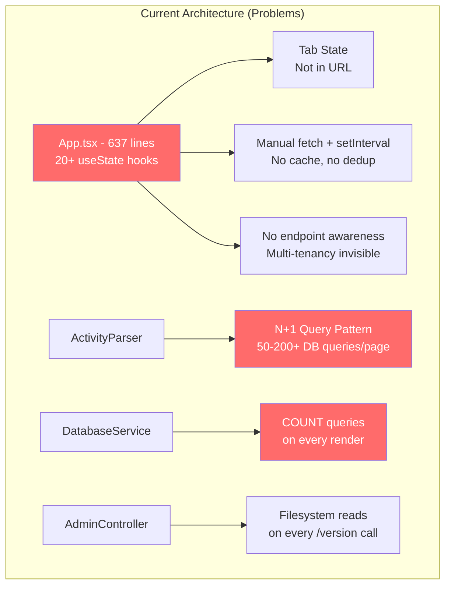

### 2.3 Current Backend Performance Profile

| Endpoint | Current Cost | Problem |
|----------|-------------|---------|
| `GET /admin/database/statistics` | 5 COUNT(*) queries (~50ms) | Fires on every Statistics tab render + 30s auto-refresh |
| `GET /admin/activity` | 50-200+ individual queries (~500ms) | N+1: each log entry triggers `resolveUserName()` DB lookup |
| `GET /admin/endpoints/:id/stats` | 4 COUNT(*) per endpoint | O(E*4) for endpoint list page |
| `GET /admin/version` | Filesystem reads per call | Reads `/proc/self/cgroup`, `package.json` every request |
| Dashboard render (proposed) | 4-5 HTTP round trips | No aggregation endpoint exists |

### 2.4 Current Test Coverage

| Suite | Count | Coverage Gate | Notes |
|-------|-------|---------------|-------|
| API Unit | 3,429 (84 suites) | 75% branches, 90% functions, 80% lines | Strong |
| API E2E | 1,149 (54 suites) | Response contract validation | Strong |
| Web Unit | 17 files (Vitest) | **No thresholds set** | Gap |
| Web E2E | 6 specs (Playwright) | Chromium only | Thin |
| Live Tests | ~929 assertions | PowerShell integration | Strong |
| **Missing** | - | - | No integration tests (MSW), no a11y, no visual regression |

---

## 3. Competitive Landscape Research

### 3.1 Products Analyzed

| Product | Category | Key UI Pattern | Relevance |
|---------|----------|---------------|-----------|
| **Linear** | Project management | Command palette (Cmd+K), keyboard-first, optimistic mutations | Power-user interaction model |
| **Grafana** | Monitoring | Time range selector, composable panels, variables/filters | Metrics dashboard pattern |
| **Vercel** | Deployment platform | Minimal card-based UI, live logs, instant navigation | Operations console pattern |
| **Supabase** | Database platform | Table editor, SQL playground, real-time subscriptions | Data exploration pattern |
| **Railway** | Deployment platform | Service cards, live logs, minimal chrome | Simple operations pattern |
| **Raycast** | Launcher | Command palette primary, keyboard-only, extensions | Command-driven interaction |
| **Portainer** | Container management | Sidebar + card grid, fleet management | Multi-tenant admin pattern |
| **Azure Portal** | Cloud console | Sidebar, breadcrumbs, resource-centric navigation | Enterprise admin pattern |
| **Swagger UI** | API documentation | Interactive request builder, live responses | API playground pattern |
| **Postman** | API client | Tabbed workbench, request builder, collections | API testing pattern |

### 3.2 Extracted Design Principles

| # | Principle | Source Products | Application to SCIMServer |
|---|-----------|----------------|--------------------------|
| 1 | Speed is a feature | Linear, Raycast | Sub-100ms transitions via optimistic updates + preflight loading |
| 2 | Keyboard-first | Linear, Raycast, VS Code | Command palette (Cmd+K) as primary navigation |
| 3 | Information density without clutter | Grafana, Datadog | Dense data tables with progressive disclosure |
| 4 | Context survives navigation | Grafana, Vercel | Filters, selections, time ranges persist in URL |
| 5 | Real-time by default | Supabase, Railway | SSE-driven live updates, no refresh buttons |
| 6 | Zero-config first run | Vercel, Railway | Guided onboarding, beautiful empty states |

---

## 4. UI Architecture Options

### 4.1 Options Evaluated

| # | Architecture | Inspiration | Best For | Effort | Verdict |
|---|-------------|-------------|----------|--------|---------|
| 1 | Command Center Dashboard | Azure Portal + Portainer | Multi-tenant admin at scale | High | ✅ Selected (structure) |
| 2 | Focused Operations Console | Grafana + Kibana | Real-time monitoring | Medium | ✅ Selected (live stream element) |
| 3 | Multi-Pane Workbench | VS Code + Postman | Developer API testing | High | ✅ Selected (API playground) |
| 4 | Railway-Style Minimal Cards | Railway + Vercel | Simple 1-5 endpoint setups | Low | ✅ Selected (home screen) |
| 5 | Supabase-Style Database Studio | Supabase | Data exploration/debugging | High | ❌ Too specialized |
| 6 | Full SPA with SSR | Next.js + Remix | Public-facing apps with SEO | High | ❌ Unnecessary - admin tool behind auth |

### 4.2 Selected Hybrid: Options 1 + 2 + 4 + Elements of 3

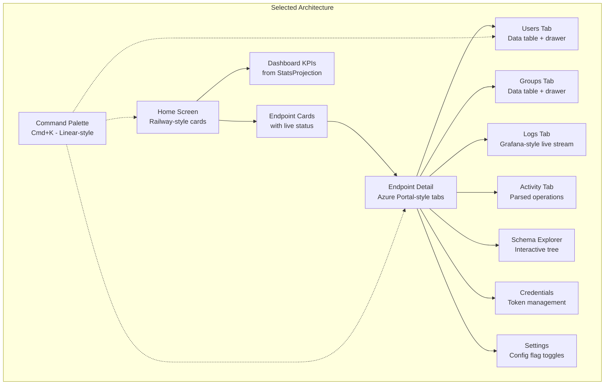

---

## 5. Selected Architecture

### 5.1 Layout

```
+------------------------------------------------------------------+
| [Logo] SCIMServer     [Cmd+K Search] [Notifications] [Theme] [?] |
+----------+-------------------------------------------------------+
|          |                                                        |
| SIDEBAR  |  MAIN CONTENT AREA                                    |
|          |                                                        |
| Dashboard|  Breadcrumb: Endpoints > Production > Users            |
| Endpoints|  +--------------------------------------------------+ |
| Logs     |  |                                                  | |
| Settings |  |   [Content varies by route]                      | |
|          |  |                                                  | |
| -------- |  |   - Dashboard: KPI cards + chart + activity     | |
| v0.41.0  |  |   - Endpoints: Card grid                        | |
|          |  |   - Detail: Tabbed sub-views                     | |
+----------+--+--------------------------------------------------+-+
```

### 5.2 Route Structure

| Route | Component | Data Source | URL Params as State |
|-------|-----------|-------------|---------------------|
| `/` | DashboardPage | `GET /admin/dashboard` | - |
| `/endpoints` | EndpointsPage | `GET /admin/endpoints` | `?search=` |
| `/endpoints/:id/overview` | EndpointOverview | `GET /admin/endpoints/:id/overview` | - |
| `/endpoints/:id/users` | UsersTab | `GET /admin/database/users` | `?search=&status=&page=` |
| `/endpoints/:id/groups` | GroupsTab | `GET /admin/database/groups` | `?search=&page=` |
| `/endpoints/:id/logs` | LogsTab | `GET /admin/logs` | `?method=&status=&since=&until=` |
| `/endpoints/:id/activity` | ActivityTab | `GET /admin/activity` | `?type=&severity=` |
| `/endpoints/:id/schemas` | SchemasTab | `GET /endpoints/:id/Schemas` | - |
| `/endpoints/:id/credentials` | CredentialsTab | `GET /admin/endpoints/:id/credentials` | - |
| `/endpoints/:id/settings` | SettingsTab | `GET /admin/endpoints/:id` | - |
| `/logs` | GlobalLogsPage | `GET /admin/logs` | `?endpoint=&method=&status=` |
| `/settings` | SettingsPage | `GET /admin/log-config` | - |

### 5.3 Key UI Components

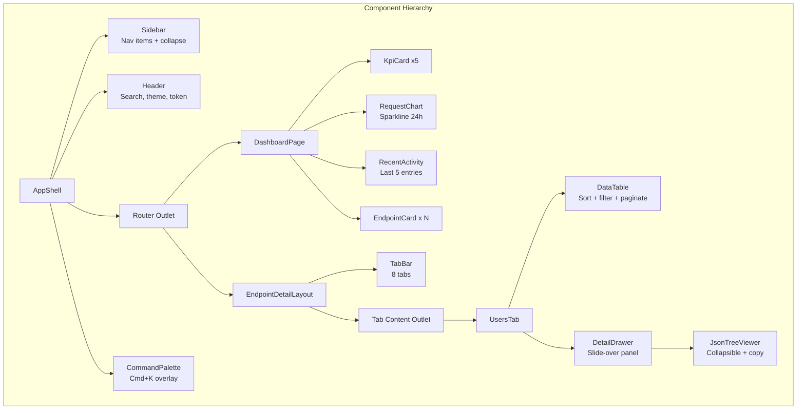

---

## 6. Backend Changes

### 6.1 New Services

| Service | File | Purpose | DB Queries | Dependencies |
|---------|------|---------|------------|--------------|
| `StatsProjectionService` | `api/src/modules/stats/stats-projection.service.ts` | Materialized in-memory counters updated via events | 0 (after init) | `IUserRepository`, `IGroupRepository`, `EventEmitter2` |
| `NameResolverService` | `api/src/modules/stats/name-resolver.service.ts` | Batched `WHERE scimId IN (...)` + LRU cache (500, 5min) | 1 per batch | `PrismaService` or `IUserRepository` |
| `DashboardController` | `api/src/modules/dashboard/dashboard.controller.ts` | BFF aggregation for UI views | 0 (reads caches) | `StatsProjectionService`, `EndpointService`, `NameResolverService` |

### 6.2 Event-Driven Stats Architecture

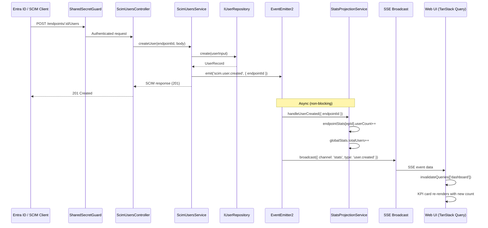

### 6.3 BFF Aggregation Endpoints

#### `GET /admin/dashboard`

Aggregates everything the dashboard needs in **one response** (0 DB queries):

```json
{
  "health": {
    "status": "ok",
    "uptime": 86400,
    "dbType": "postgresql",
    "timestamp": "2026-04-29T10:00:00Z"
  },
  "stats": {
    "totalUsers": 847,
    "activeUsers": 812,
    "totalGroups": 23,
    "totalEndpoints": 4,
    "requestsLast24h": 1204,
    "errorsLast24h": 3,
    "throughputPerMin": 2.1
  },
  "endpoints": [
    {
      "id": "uuid",
      "name": "production",
      "displayName": "Production",
      "preset": "entra-id",
      "active": true,
      "userCount": 500,
      "groupCount": 12,
      "lastActivity": "2026-04-29T09:58:00Z"
    }
  ],
  "recentActivity": [
    {
      "timestamp": "2026-04-29T09:58:00Z",
      "operation": "POST",
      "resourceType": "User",
      "displayName": "John Doe",
      "endpointName": "production",
      "status": 201
    }
  ],
  "version": {
    "version": "0.41.0",
    "node": "24.0.0",
    "persistenceBackend": "prisma"
  }
}
```

#### `GET /admin/endpoints/:id/overview`

```json
{
  "endpoint": { "id": "...", "name": "...", "profile": { "preset": "entra-id" } },
  "stats": { "userCount": 500, "groupCount": 12, "logCount": 340 },
  "credentials": [{ "id": "...", "label": "Entra", "active": true, "createdAt": "..." }],
  "recentActivity": [],
  "configFlags": { "strictSchemaValidation": true, "softDeleteEnabled": false }
}
```

### 6.4 Batched Name Resolution

```mermaid
flowchart LR
    subgraph "Current: N+1 Pattern"
        L1[Log Entry 1] --> Q1[SELECT ... WHERE scimId = 'id-1']
        L2[Log Entry 2] --> Q2[SELECT ... WHERE scimId = 'id-2']
        L3[Log Entry ...] --> Q3[SELECT ... WHERE scimId = 'id-...']
        L50[Log Entry 50] --> Q50[SELECT ... WHERE scimId = 'id-50']
    end

    subgraph "New: Batched Pattern"
        B1[Collect all IDs<br>from 50 entries] --> BQ[SELECT ... WHERE<br>scimId IN ('id-1', 'id-2', ..., 'id-50')]
        BQ --> MAP[Map of id to displayName]
        MAP --> P1[Parse entry 1]
        MAP --> P2[Parse entry 2]
        MAP --> P50[Parse entry 50]
    end

    style Q1 fill:#ff6b6b,color:#fff
    style Q2 fill:#ff6b6b,color:#fff
    style Q3 fill:#ff6b6b,color:#fff
    style Q50 fill:#ff6b6b,color:#fff
    style BQ fill:#51cf66,color:#fff
```

### 6.5 Tiered Caching Architecture

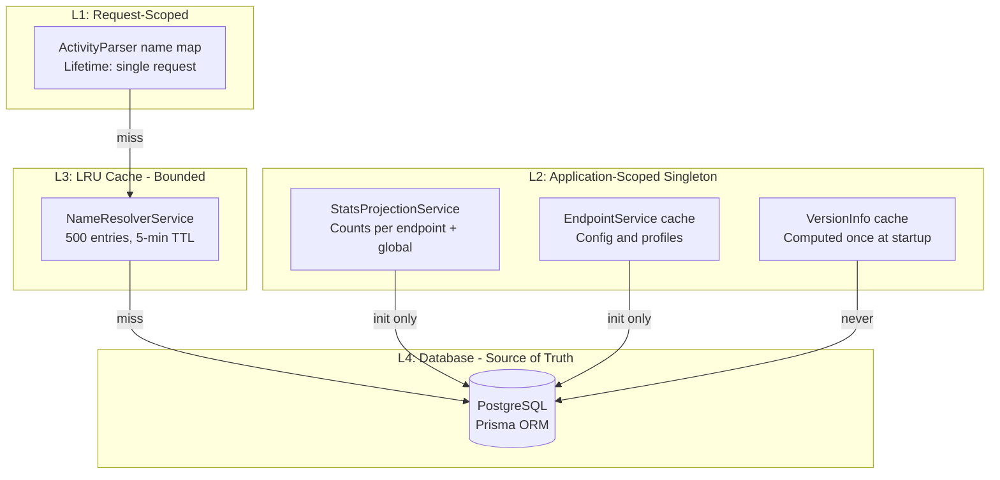

### 6.6 Events Emitted by SCIM Services

| Event | Emitted By | Payload | Consumer |
|-------|-----------|---------|----------|
| `scim.user.created` | `EndpointScimUsersService.create()` | `{ endpointId }` | `StatsProjectionService` |
| `scim.user.updated` | `EndpointScimUsersService.update()` | `{ endpointId }` | `StatsProjectionService` |
| `scim.user.deleted` | `EndpointScimUsersService.delete()` | `{ endpointId }` | `StatsProjectionService` |
| `scim.group.created` | `EndpointScimGroupsService.create()` | `{ endpointId }` | `StatsProjectionService` |
| `scim.group.updated` | `EndpointScimGroupsService.update()` | `{ endpointId }` | `StatsProjectionService` |
| `scim.group.deleted` | `EndpointScimGroupsService.delete()` | `{ endpointId }` | `StatsProjectionService` |

---

## 7. Frontend Architecture

### 7.1 State Management Strategy

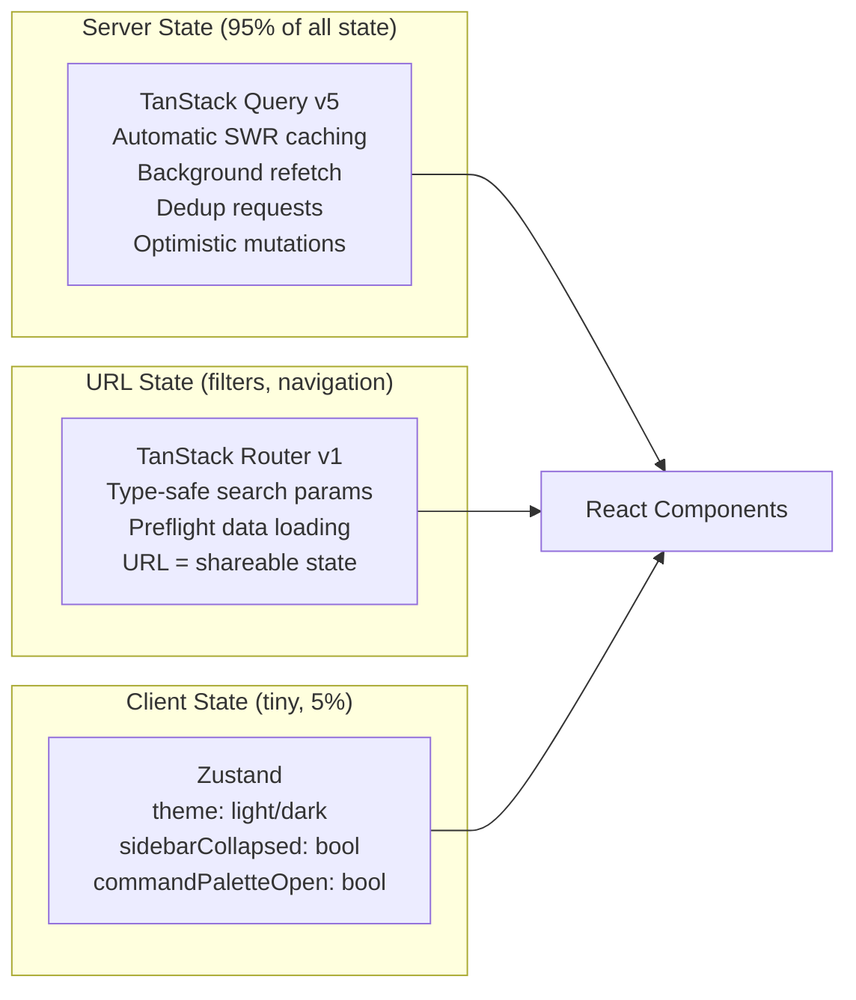

### 7.2 Query Key Structure

| Query Key | Endpoint | Stale Time | Refetch Strategy |
|-----------|----------|-----------|------------------|
| `['dashboard']` | `/admin/dashboard` | 30s | Window focus + SSE invalidation |
| `['endpoints']` | `/admin/endpoints` | 60s | Window focus |
| `['endpoint', id, 'overview']` | `/admin/endpoints/:id/overview` | 30s | Window focus + SSE |
| `['endpoint', id, 'users', filters]` | `/admin/database/users` | 60s | Window focus |
| `['endpoint', id, 'groups', filters]` | `/admin/database/groups` | 60s | Window focus |
| `['endpoint', id, 'logs', filters]` | `/admin/logs` | 30s | SSE invalidation |
| `['endpoint', id, 'activity', filters]` | `/admin/activity` | 30s | SSE invalidation |
| `['endpoint', id, 'schemas']` | `/endpoints/:id/Schemas` | 300s | Never (schemas rarely change) |
| `['endpoint', id, 'credentials']` | `/admin/endpoints/:id/credentials` | 60s | After mutation |

### 7.3 SSE Integration with TanStack Query

```typescript
// useSSESync.ts - connects SSE to query cache invalidation
function useSSESync() {
  const queryClient = useQueryClient();

  useEffect(() => {
    const source = new EventSource('/scim/admin/log-config/stream');

    source.onmessage = (event) => {
      const data = JSON.parse(event.data);

      // SCIM write event -> invalidate dashboard + resource queries
      if (data.channel === 'stats') {
        queryClient.invalidateQueries({ queryKey: ['dashboard'] });
        queryClient.invalidateQueries({
          queryKey: ['endpoint', data.endpointId],
        });
      }

      // Log event -> invalidate log queries
      if (data.channel === 'logs') {
        queryClient.invalidateQueries({
          queryKey: ['endpoint', data.endpointId, 'logs'],
        });
      }
    };

    return () => source.close();
  }, [queryClient]);
}
```

### 7.4 Component Decomposition (Before/After)

| Before | Lines | After | Lines Each |
|--------|-------|-------|-----------|
| `App.tsx` (god component) | 637 | `AppShell.tsx` + `Sidebar.tsx` + `Header.tsx` + `TokenModal.tsx` + `UpgradeBanner.tsx` + `useVersionCheck.ts` | ~60-100 |
| `ActivityFeed.tsx` | 530 | `ActivityTab.tsx` + `ActivityToolbar.tsx` + `ActivitySummary.tsx` + `ActivityEntry.tsx` + `useActivityQuery.ts` | ~50-80 |
| `DatabaseBrowser.tsx` | 492 | `UsersTab.tsx` + `GroupsTab.tsx` + `StatisticsTab.tsx` (already split) + `DetailDrawer.tsx` | ~80-150 |
| `ManualProvision.tsx` | 390 | `CreateUserForm.tsx` + `CreateGroupForm.tsx` + `ProvisionResult.tsx` | ~80-120 |
| `app.module.css` | 413 | Per-component CSS modules (or design system tokens) | ~30-60 each |

---

## 8. Design System Strategy

### 8.1 Options Evaluated

| # | System | Bundle Size | Audience Fit | Customization | AI-Friendly | Verdict |
|---|--------|------------|-------------|---------------|-------------|---------|
| 1 | **Fluent UI React v9** | ~80-120KB | Microsoft Entra admins (exact match) | Token-based theming | Medium | ✅ Selected (audience fit) |
| 2 | **shadcn/ui + Tailwind** | ~0KB base (copy components) | General developers | Full source code ownership | Excellent | Alternative for non-Microsoft audiences |
| 3 | **Radix UI + custom CSS** | ~30KB | Any | Full control | Good | ❌ Too much custom work |
| 4 | **Ant Design** | ~200KB | Enterprise admin panels | Override-based | Poor | ❌ Too heavy, not Microsoft-aligned |
| 5 | **Material UI** | ~150KB | Google ecosystem | Theme provider | Medium | ❌ Wrong ecosystem |

### 8.2 Fluent UI v9 Component Mapping

| SCIMServer Need | Fluent v9 Component | Notes |
|----------------|---------------------|-------|
| Sidebar navigation | `Nav` | Collapsible, nested items |
| Data tables | `DataGrid` | Built-in sort, filter, virtualization |
| KPI cards | `Card` | With `CardHeader` + `CardPreview` |
| Modals/dialogs | `Dialog` | Token entry, confirmations |
| Breadcrumbs | `Breadcrumb` | Endpoint > Resource > Detail |
| Tab navigation | `TabList` | Endpoint detail sub-views |
| Status indicators | `Badge` | Active/inactive, HTTP method colors |
| Notifications | `MessageBar` + `Toast` | Success/error feedback |
| User avatars | `Persona` | Initials-based avatars in user lists |
| Schema tree | `Tree` | Collapsible attribute hierarchy |
| Detail panels | `Drawer` | Slide-over for log/user/group detail |
| Search | `SearchBox` | Global + per-table search |
| Toolbars | `Toolbar` | Action bars above tables |
| Theme provider | `FluentProvider` | Light/dark with brand tokens |
| Icons | `@fluentui/react-icons` | Tree-shakeable, 2,000+ icons |

---

## 9. Data Flow Architecture

### 9.1 End-to-End Request Flow

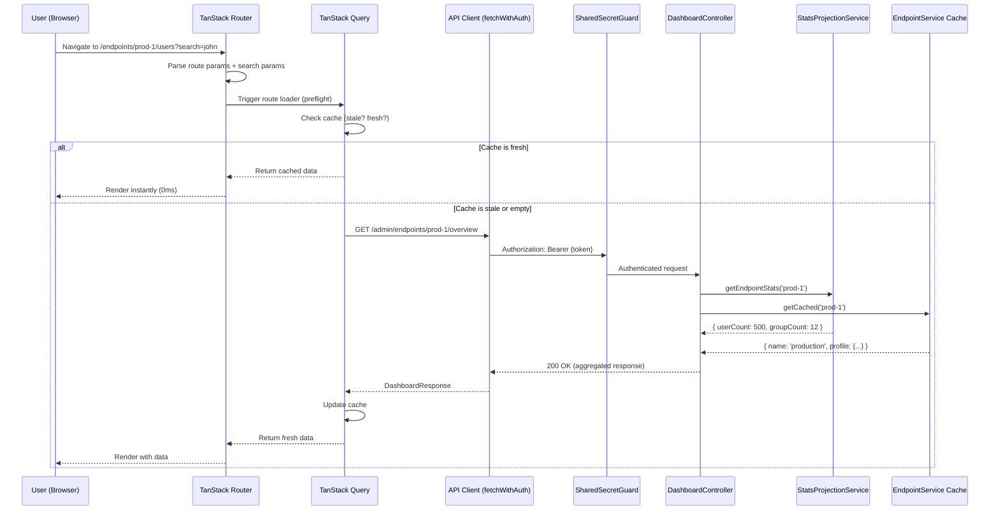

### 9.2 Full Architecture Diagram

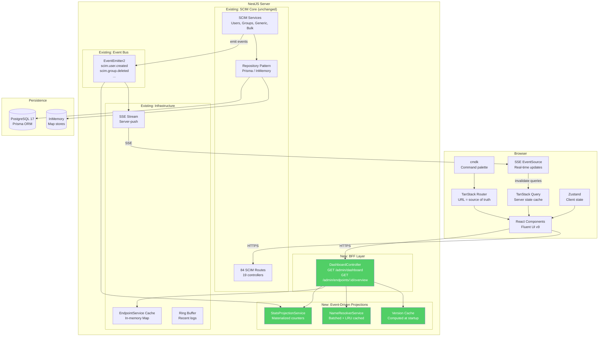

---

## 10. Testing Strategy

### 10.1 Test Pyramid

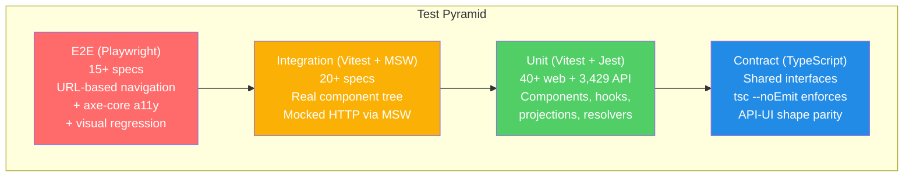

### 10.2 Automated CI Pipeline

| Stage | Duration | What Runs | Gate |
|-------|----------|-----------|------|
| **1: Lint + Types** | < 30s | `tsc --noEmit`, ESLint, Prettier | Block on failure |
| **2: Unit Tests** | < 2 min | API Jest (3,429) + Web Vitest (40+) + coverage gates | Block if coverage below thresholds |
| **3: Integration** | < 3 min | Web MSW integration + API E2E (1,149) + contract validation | Block on failure |
| **4: E2E** | < 5 min | Full stack Playwright (15+) + a11y audit + visual regression | Block on failure |

### 10.3 Coverage Gates

| Suite | Branches | Functions | Lines | Statements |
|-------|----------|-----------|-------|------------|
| API Unit | 75% | 90% | 80% | 80% |
| API E2E | - | - | - | - |
| Web Unit (NEW) | 70% | 80% | 80% | 80% |
| Web Integration (NEW) | - | - | - | - |

### 10.4 Missing Test File Enforcement

A CI script validates that every `.tsx` component has a corresponding `.test.tsx` file. Every `.service.ts` has a `.service.spec.ts`. New code without tests = blocked PR.

### 10.5 MSW Integration Test Pattern

```typescript
// web/src/test/msw-handlers.ts
import { http, HttpResponse } from 'msw';
import type { DashboardResponse } from '../shared/types';

export const handlers = [
  http.get('*/admin/dashboard', () => {
    return HttpResponse.json<DashboardResponse>({
      health: { status: 'ok', uptime: 86400, dbType: 'postgresql' },
      stats: { totalUsers: 847, /* ... */ },
      endpoints: [{ id: 'ep-1', name: 'production', /* ... */ }],
      recentActivity: [],
      version: { version: '0.41.0', node: '24.0.0' },
    });
  }),
];
```

```typescript
// web/src/test/integration/dashboard.integration.test.tsx
const server = setupServer(...handlers);

test('dashboard renders KPI cards from aggregated endpoint', async () => {
  render(<App />); // Real component tree, MSW intercepts fetch
  await waitFor(() => {
    expect(screen.getByText('847')).toBeInTheDocument();
    expect(screen.getByText('production')).toBeInTheDocument();
  });
});
```

---

## 11. Multi-Mode Support

### 11.1 Deployment Modes

| Mode | Persistence | BFF Works? | SSE Works? | Test Coverage |
|------|------------|-----------|-----------|---------------|
| **InMemory** | RAM (`Map`) | Yes - uses `IRepository` interfaces | Yes - ring buffer | Full E2E suite |
| **PostgreSQL** | Prisma/PG | Yes - same interfaces | Yes - ring buffer | Full E2E suite |
| **Docker** | Prisma/PG | Yes | Yes | Smoke + live tests |
| **Standalone** | Either | Yes | Yes | Build + smoke tests |
| **Azure** | Prisma/PG | Yes | Yes | Nightly deploy + live tests |

### 11.2 Mode-Agnostic Design Rule

All new services MUST inject `IUserRepository` / `IGroupRepository` tokens - NEVER `PrismaService` directly. The DI container provides the correct implementation based on `PERSISTENCE_BACKEND`.

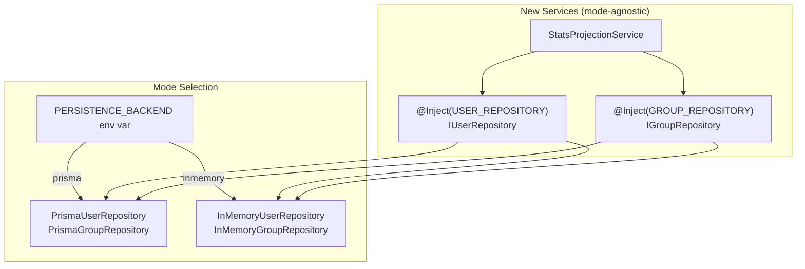

### 11.3 Multi-Mode CI Matrix

```yaml
strategy:
  matrix:
    backend: [inmemory, prisma]
```

Both backends run the **same test suite** - ensuring feature parity.

---

## 12. Performance Budget

### 12.1 Before vs After

| Metric | Current | Target | How |
|--------|---------|--------|-----|
| Dashboard render (DB queries) | 5-9 COUNT(*) (~50ms) | 0 queries (<1ms) | StatsProjectionService cache |
| Endpoint list (DB queries) | O(E*4) COUNT queries | 0 queries (<1ms) | StatsProjectionService cache |
| Activity feed (50 items) | 50-200+ queries (~500ms) | 1-2 batch queries (~10ms) | NameResolverService batching |
| Dashboard HTTP round trips | 4-5 requests | 1 request | BFF `/admin/dashboard` |
| Version info | Filesystem reads per call | 0 reads (<0.1ms) | Cached at startup |
| Time to interactive (UI) | ~800ms (fetch + render) | ~200ms (cache + preflight) | TanStack Query SWR + Route preflight |
| Navigation between views | ~500ms (fetch after mount) | ~50ms (cached or preflight) | Route loader prefetching |

### 12.2 Bundle Size Budget

| Package | Size (gzip) | Purpose |
|---------|------------|---------|
| React 19 (existing) | ~40KB | Core framework |
| TanStack Query v5 | ~12KB | Server state management |
| TanStack Router v1 | ~15KB | Type-safe routing |
| Fluent UI v9 (tree-shaken) | ~80-100KB | Design system components |
| @fluentui/react-icons | ~2KB (per icon) | Tree-shakeable icons |
| cmdk | ~3KB | Command palette |
| Zustand | ~1KB | Client state |
| Recharts | ~45KB | Dashboard charts |
| **Total new** | ~160-180KB | vs current ~60KB custom CSS |

**Note:** The bundle increase (~120KB) is offset by:
- Removing all custom CSS (60KB of `.module.css` files)
- Removing inline duplicated logic (semver, fetch helpers)
- Tree-shaking unused Fluent components

---

## 13. Implementation Plan

### Phase 0: Backend Foundation (no UI changes)

| Step | Task | New Files | Tests | Depends On |
|------|------|-----------|-------|------------|
| 0.1 | Shared type contracts | `api/src/shared/types/*.ts` | `tsc --noEmit` | - |
| 0.2 | StatsProjectionService | `stats-projection.service.ts` + spec | 15-20 unit | - |
| 0.3 | Event emission from SCIM services | ~30 lines across 3 files | Existing E2E pass | 0.2 |
| 0.4 | Batched NameResolverService | `name-resolver.service.ts` + spec | 10 unit | - |
| 0.5 | Version info caching | 10 lines in `admin.controller.ts` | Existing E2E pass | - |
| 0.6 | BFF Dashboard endpoint | `dashboard.controller.ts` + spec + E2E | 5 E2E | 0.2, 0.4, 0.5 |
| 0.7 | BFF Endpoint Overview endpoint | Method in dashboard controller + E2E | 3 E2E | 0.2, 0.4 |
| 0.8 | Validate both backends | Run full suite inmemory + prisma | All pass | 0.1-0.7 |

### Phase 1: Frontend Scaffolding (old UI still default)

| Step | Task | New Files | Tests | Depends On |
|------|------|-----------|-------|------------|
| 1.1 | Install dependencies | `package.json` updates | Build pass | Phase 0 |
| 1.2 | Design system setup | `web/src/design/` directory | 5 visual | - |
| 1.3 | App shell layout | `AppShell.tsx`, `Sidebar.tsx`, `Header.tsx` | 3 unit | 1.2 |
| 1.4 | Route tree | Route definitions + placeholder pages | 5 unit | 1.1 |
| 1.5 | API client (TanStack Query) | `web/src/api/queries.ts` | 12 unit | 0.1, 1.1 |
| 1.6 | Feature flag toggle (`?ui=next`) | 20 lines in `App.tsx` | 1 unit | 1.3, 1.4 |
| 1.7 | Validate | All existing tests pass | Old UI unchanged | 1.1-1.6 |

### Phase 2: Core Screens

| Step | Task | Tests | Depends On |
|------|------|-------|------------|
| 2.1 | Dashboard page (KPIs + chart + activity) | 5 unit + 2 MSW integration | 1.5 |
| 2.2 | Endpoint list page (card grid) | 3 unit + 1 MSW integration | 1.5 |
| 2.3 | Endpoint detail shell (tabbed layout) | 2 unit | 1.4 |
| 2.4 | Users tab (data table + drawer) | 4 unit + 1 MSW + 1 Playwright | 2.3 |
| 2.5 | Groups tab | 3 unit + 1 MSW | 2.3 |
| 2.6 | Logs tab (filterable + detail drawer) | 4 unit + 1 MSW + 1 Playwright | 2.3 |
| 2.7 | Activity tab | 3 unit + 1 MSW | 2.3 |
| 2.8 | Validate | All tests pass both modes | 2.1-2.7 |

### Phase 3: Advanced Features

| Step | Task | Tests | Depends On |
|------|------|-------|------------|
| 3.1 | Command palette (Cmd+K) | 3 unit + 1 Playwright | 1.4 |
| 3.2 | Schema explorer (interactive tree) | 3 unit | 2.3 |
| 3.3 | Credential manager | 3 unit + 1 MSW | 2.3 |
| 3.4 | Endpoint settings (config flag toggles) | 2 unit + 1 MSW | 2.3 |
| 3.5 | Manual provisioning (redesigned) | 3 unit + 1 MSW | 2.3 |
| 3.6 | Global log explorer | 3 unit + 1 MSW + 1 Playwright | 1.4 |
| 3.7 | Validate | All tests pass | 3.1-3.6 |

### Phase 4: Real-Time + Polish

| Step | Task | Tests | Depends On |
|------|------|-------|------------|
| 4.1 | SSE integration with TanStack Query | 2 unit + 1 Playwright | Phase 2 |
| 4.2 | Keyboard shortcuts | 1 unit + 1 Playwright | 1.3 |
| 4.3 | Optimistic mutations | 3 unit (rollback scenarios) | Phase 2 |
| 4.4 | Visual polish (skeletons, transitions, empty states) | Visual regression baselines | Phase 2 |
| 4.5 | Validate | All tests pass | 4.1-4.4 |

### Phase 5: Testing Infrastructure + Cutover

| Step | Task | Tests | Depends On |
|------|------|-------|------------|
| 5.1 | Accessibility gate (axe-core) | a11y checks on every E2E spec | Phase 4 |
| 5.2 | Visual regression baselines | 12-15 screenshots (light + dark) | Phase 4 |
| 5.3 | MSW handler coverage (all endpoints + error states) | 20+ integration tests | Phase 4 |
| 5.4 | Coverage gates for web | Vitest config thresholds | - |
| 5.5 | Multi-mode validation script | `test-all-modes.ps1` | Phase 0 |
| 5.6 | Default UI cutover (remove toggle) | Rewrite Playwright for new URLs | Phase 4 |
| 5.7 | Legacy cleanup | Remove old components | 5.6 |

### Phase Summary

| Phase | Steps | New Backend | New Frontend | New Tests | Duration |
|-------|-------|------------|-------------|-----------|----------|
| 0: Foundation | 8 | ~800 lines | 0 | ~50 | 1-2 days |
| 1: Scaffolding | 7 | 0 | ~600 lines | ~26 | 1 day |
| 2: Core Screens | 8 | 0 | ~2,500 lines | ~60 | 3-4 days |
| 3: Advanced | 7 | ~200 lines | ~1,500 lines | ~40 | 2-3 days |
| 4: Real-Time | 5 | 0 | ~500 lines | ~22 | 1-2 days |
| 5: Cutover | 7 | 0 | ~200 lines | ~37 | 1-2 days |
| **Total** | **42 steps** | **~1,000 lines** | **~5,300 lines** | **~235 tests** | **9-14 days** |

---

## 14. File Inventory

### 14.1 New Backend Files

| File | Purpose | Mode-Agnostic? |
|------|---------|---------------|
| `api/src/shared/types/dashboard.types.ts` | Shared type contracts for BFF responses | Yes |
| `api/src/shared/types/endpoint-overview.types.ts` | Endpoint overview response types | Yes |
| `api/src/modules/stats/stats.module.ts` | Stats module registration | Yes |
| `api/src/modules/stats/stats-projection.service.ts` | Materialized stats counters | Yes (uses IRepository) |
| `api/src/modules/stats/stats-projection.service.spec.ts` | Unit tests for projections | Yes |
| `api/src/modules/stats/name-resolver.service.ts` | Batched name resolution + LRU cache | Yes (uses IRepository) |
| `api/src/modules/stats/name-resolver.service.spec.ts` | Unit tests for resolver | Yes |
| `api/src/modules/dashboard/dashboard.module.ts` | Dashboard BFF module | Yes |
| `api/src/modules/dashboard/dashboard.controller.ts` | BFF aggregation endpoints | Yes |
| `api/src/modules/dashboard/dashboard.controller.spec.ts` | Unit tests | Yes |
| `api/test/e2e/dashboard-bff.e2e-spec.ts` | E2E contract tests for BFF endpoints | Yes |

### 14.2 Modified Backend Files

| File | Change | Risk |
|------|--------|------|
| `api/src/modules/scim/services/endpoint-scim-users.service.ts` | Add event emission (~5 lines) | Low |
| `api/src/modules/scim/services/endpoint-scim-groups.service.ts` | Add event emission (~5 lines) | Low |
| `api/src/modules/scim/services/endpoint-scim-generic.service.ts` | Add event emission (~5 lines) | Low |
| `api/src/modules/scim/controllers/admin.controller.ts` | Cache version info on init (~10 lines) | Low |
| `api/src/modules/activity-parser/activity-parser.service.ts` | Use NameResolverService (~20 lines) | Medium |
| `api/src/modules/app/app.module.ts` | Register StatsModule + DashboardModule | Low |
| `api/package.json` | Add `@nestjs/event-emitter` | Low |

### 14.3 New Frontend Files (Phase 1-4)

| Directory | Files | Purpose |
|-----------|-------|---------|
| `web/src/design/` | `theme.ts`, `tokens.ts`, primitives | Design system foundation |
| `web/src/layout/` | `AppShell.tsx`, `Sidebar.tsx`, `Header.tsx` | App shell components |
| `web/src/routes/` | Route definitions, page components | TanStack Router tree |
| `web/src/pages/` | `DashboardPage.tsx`, `EndpointsPage.tsx`, `SettingsPage.tsx`, `GlobalLogsPage.tsx` | Top-level pages |
| `web/src/pages/endpoint/` | `EndpointDetailLayout.tsx`, `*Tab.tsx` (8 tabs) | Endpoint detail pages |
| `web/src/components/` | `KpiCard.tsx`, `DataTable.tsx`, `DetailDrawer.tsx`, `JsonTreeViewer.tsx`, `CommandPalette.tsx`, `SchemaTree.tsx` | Shared components |
| `web/src/api/` | `queries.ts` (TanStack Query definitions) | Server state queries |
| `web/src/hooks/` | `useSSESync.ts`, `useKeyboardShortcuts.ts` | Custom hooks |
| `web/src/stores/` | `uiStore.ts` (Zustand) | Client state |
| `web/src/test/` | `msw-handlers.ts`, `integration/*.test.tsx` | Test infrastructure |

---

## 15. Risk Assessment

| Risk | Likelihood | Impact | Mitigation |
|------|-----------|--------|------------|
| **Bundle size increase** | High | Medium | Tree-shaking, lazy route loading, measure with `vite-bundle-analyzer` |
| **Fluent UI v9 learning curve** | Medium | Low | Well-documented, Storybook available, component API is straightforward |
| **StatsProjection drift from DB** | Low | Medium | Periodic full-refresh (every 60s) + event-driven incremental updates |
| **Breaking existing SCIM routes** | Very Low | Critical | Zero changes to SCIM controllers/services - events are additive side effects |
| **InMemory mode regression** | Medium | High | Same E2E test suite runs against both backends in CI matrix |
| **Migration complexity** | Medium | Medium | Feature flag toggle (`?ui=next`) - old UI stays default until ready |
| **SSE connection limits** | Low | Low | Browser limit is 6 per origin - single multiplexed SSE is sufficient |
| **Large endpoint counts (100+)** | Low | Medium | Endpoint list uses virtual scrolling; stats are pre-materialized |
| **Test count increase** | Certain | Positive | ~235 new tests, all automated, zero manual steps |

---

## 16. Decision Log

| # | Decision | Date | Rationale | Alternatives Rejected |
|---|----------|------|-----------|----------------------|
| D1 | Hybrid UI: Cards (home) + Sidebar (nav) + Tabs (detail) | 2026-04-29 | Combines simplicity (Railway), scale (Azure Portal), and monitoring (Grafana) | Pure dashboard, pure workbench, pure card-only |
| D2 | TanStack Query for server state | 2026-04-29 | Automatic SWR, dedup, background refetch, optimistic mutations - replaces 20 useState hooks | Redux (overkill), SWR (less features), manual fetch+useState (current, broken) |
| D3 | TanStack Router for routing | 2026-04-29 | Type-safe search params as state, preflight data loading, URL = source of truth | React Router v7 (less type-safe), wouter (too minimal) |
| D4 | Zustand for client state | 2026-04-29 | 1KB, zero boilerplate, sufficient for theme/sidebar/modal state (only 3 values) | Jotai (unnecessary), Redux (overkill), Context (re-render issues) |
| D5 | Fluent UI v9 for design system | 2026-04-29 | Target audience (Entra admins) uses Microsoft products daily - zero cognitive friction | shadcn/ui (better DX, wrong audience), Ant Design (too heavy), custom CSS (too slow) |
| D6 | Event-driven stats (not polling/cron) | 2026-04-29 | Zero-latency counter updates, no periodic DB queries, O(1) per write | Periodic COUNT(*) queries (current, N+1), materialized views (requires PG only) |
| D7 | BFF aggregation (not GraphQL) | 2026-04-29 | Known UI views, single team, simplest to implement - 2 endpoints vs entire GraphQL layer | GraphQL (overkill), tRPC (new paradigm), multiple REST calls (current, slow) |
| D8 | SSE multiplexing (not WebSocket) | 2026-04-29 | Uni-directional server-push is correct pattern; SSE already implemented | WebSocket (bi-directional unnecessary), polling (wasteful) |
| D9 | Feature flag toggle for migration | 2026-04-29 | No big-bang cutover risk - old UI accessible until new UI is validated | Big-bang rewrite (risky), micro-frontends (overkill for 1 team) |
| D10 | cmdk for command palette | 2026-04-29 | 3KB, composable, used by Linear/Vercel - proven pattern for power-user navigation | Custom implementation (slow), kbar (larger), no palette (missed opportunity) |
| D11 | MSW for integration tests | 2026-04-29 | Network-level mocking - components use real fetch, MSW intercepts | vi.mock (fragile), nock (Node only), custom fetch stubs (current, inconsistent) |
| D12 | No SSR/Next.js | 2026-04-29 | Admin tool behind auth, no SEO needed, SPA is correct architecture | Next.js (unnecessary complexity), Remix (server-rendered unnecessary) |
| D13 | Shared TypeScript interfaces | 2026-04-29 | Compile-time contract enforcement between API and UI - type drift is impossible | OpenAPI codegen (heavier tooling), runtime validation (slower), manual sync (error-prone) |

---

## Appendix A: Technology Stack Comparison

| Layer | Current | Proposed | Change Reason |
|-------|---------|----------|---------------|
| **Framework** | React 19 | React 19 | No change |
| **Build** | Vite 7 | Vite 7 | No change |
| **Routing** | Manual tab state | TanStack Router v1 | URL = state, deep linking, preflight loading |
| **Server state** | 20+ useState + useEffect | TanStack Query v5 | SWR caching, dedup, background refetch |
| **Client state** | useState in god component | Zustand | 3 values only, 1KB |
| **Design system** | Custom CSS Modules | Fluent UI React v9 | Microsoft ecosystem fit, accessible, themed |
| **Tables** | Custom `<table>` | Fluent UI DataGrid | Sort, filter, paginate, virtualize built-in |
| **Charts** | None | Recharts | Dashboard sparklines and timelines |
| **Icons** | Emoji (sun/moon) | @fluentui/react-icons | Consistent, tree-shakeable, 2,000+ |
| **JSON viewer** | Raw `<pre>` blocks | Custom tree component | Collapsible, copy-path, diff mode |
| **Command palette** | None | cmdk | Keyboard-first navigation |
| **Real-time** | Manual SSE + polling | SSE + TanStack Query invalidation | Automatic cache updates on server events |
| **API mocking** | vi.stubGlobal('fetch') | MSW (Mock Service Worker) | Network-level, reusable, no mock leaks |
| **A11y testing** | None | @axe-core/playwright | WCAG 2.1 AA on every page |
| **Visual regression** | None | Playwright toHaveScreenshot | Baseline comparison on every PR |

---

## Appendix B: Existing Route Inventory (Unchanged)

All 84 existing routes remain completely unchanged. The new UI consumes them through the BFF layer or directly. No SCIM protocol compliance is affected.

| Category | Routes | Controller | New UI Consumption |
|----------|--------|------------|-------------------|
| Health | 1 | HealthController | Dashboard KPI via BFF |
| Admin - Endpoints | 9 | EndpointController | Endpoints page direct |
| Admin - Credentials | 3 | AdminCredentialController | Credentials tab direct |
| Admin - Logs | 4 | AdminController | Logs tab direct |
| Admin - Log Config | 13 | LogConfigController | Settings page direct |
| Admin - Database | 5 | DatabaseController | Users/Groups tabs direct |
| Admin - Activity | 2 | ActivityController | Activity tab via BFF |
| Admin - Manual | 3 | AdminController | Provision forms direct |
| Admin - Version | 1 | AdminController | Dashboard via BFF (cached) |
| SCIM Discovery | 10 | Discovery controllers | Schema explorer direct |
| SCIM Users | 7 | ScimUsersController | Not consumed by admin UI |
| SCIM Groups | 7 | ScimGroupsController | Not consumed by admin UI |
| SCIM Generic | 7 | ScimGenericController | Not consumed by admin UI |
| SCIM Bulk | 1 | BulkController | Not consumed by admin UI |
| SCIM /Me | 4 | MeController | Not consumed by admin UI |
| Endpoint Logs | 4 | EndpointLogController | Logs tab SSE stream |
| OAuth | 2 | OAuthController | Not consumed by admin UI |
| **NEW: BFF** | **2** | **DashboardController** | Dashboard + Endpoint overview |
| **Total** | **86** | **20** | - |

---

## 17. Accessibility Strategy

### 17.1 WCAG 2.1 AA Compliance Targets

| WCAG Criterion | Requirement | Implementation |
|---|---|---|
| 1.1.1 Non-text Content | All images/icons have text alternatives | Fluent UI icons include `aria-label`; SVG charts have `<title>` + `<desc>` |
| 1.3.1 Info and Relationships | Structure conveyed through markup | Semantic HTML: `<nav>`, `<main>`, `<header>`, `<table>` with `<th scope>` |
| 1.3.2 Meaningful Sequence | DOM order matches visual order | Flexbox/grid with logical source order; no CSS `order` for content |
| 1.4.3 Contrast (Minimum) | 4.5:1 for normal text, 3:1 for large | Fluent UI tokens guarantee compliant contrast in both themes |
| 1.4.11 Non-text Contrast | 3:1 for UI components | Badge/status indicators have both color + icon/text (no color-only info) |
| 2.1.1 Keyboard | All functionality keyboard-operable | Tab/Enter/Space/Arrow/Escape for all interactive elements |
| 2.1.2 No Keyboard Trap | Focus can always be moved away | Modal focus trap with Escape key exit; Drawer with Escape close |
| 2.4.1 Bypass Blocks | Skip to main content | "Skip to main content" link before sidebar |
| 2.4.3 Focus Order | Logical tab sequence | Sidebar -> Header actions -> Main content -> Footer |
| 2.4.7 Focus Visible | Visible focus indicator | Fluent UI focus ring tokens (2px solid, high contrast) |
| 4.1.2 Name, Role, Value | All components expose identity to AT | Fluent UI components are ARIA-compliant by default |

### 17.2 Data Table Accessibility

Data tables (Users, Groups, Logs) are the primary UI element. Following WAI-ARIA APG Table Pattern and Inclusive Components guidance:

```html
<!-- Accessible table structure -->
<table aria-label="Users in production endpoint">
  <caption>
    <h3>Users</h3>
    <small>Showing 1-50 of 847 (scroll to see more)</small>
  </caption>
  <thead>
    <tr>
      <th scope="col" role="columnheader" aria-sort="ascending">
        userName
        <button aria-label="sort by userName in descending order">
          <SortIcon />
        </button>
      </th>
      <th scope="col">displayName</th>
      <th scope="col">active</th>
    </tr>
  </thead>
  <tbody>
    <tr>
      <th scope="row">john.doe@contoso.com</th>
      <td>John Doe</td>
      <td><Badge aria-label="Active">Active</Badge></td>
    </tr>
  </tbody>
</table>
```

**Key patterns:**
- `<th scope="col">` for column headers, `<th scope="row">` for first column (userName)
- `aria-sort` on the currently sorted column
- Sort buttons with descriptive `aria-label` stating target state (not current)
- `<caption>` for table identification (readable by screen reader T-key navigation)
- Scrollable containers get `tabindex="0"` + `role="group"` + `aria-labelledby` only when content overflows

### 17.3 Command Palette Accessibility

Following WAI-ARIA Combobox Pattern:
- `role="combobox"` on the search input
- `role="listbox"` on the results list
- `aria-activedescendant` for virtual focus (keyboard arrow navigation)
- `aria-expanded` toggling on open/close
- Live region (`aria-live="polite"`) announcing result count on filter change

### 17.4 Automated Enforcement

Every Playwright E2E spec includes an axe-core scan after page load:

```typescript
import AxeBuilder from '@axe-core/playwright';

async function checkA11y(page: Page) {
  const results = await new AxeBuilder({ page })
    .withTags(['wcag2a', 'wcag2aa'])
    .exclude('.recharts-wrapper') // Charts handled separately
    .analyze();
  expect(results.violations).toEqual([]);
}
```

CI blocks merge on any WCAG 2.1 AA violation.

---

## 18. Error Handling & Resilience

### 18.1 Error Boundary Architecture

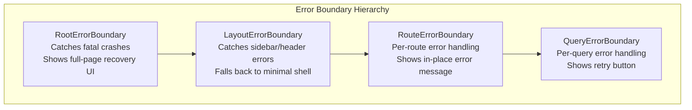

### 18.2 Error States by Type

| Error Type | Status | UI Response | Recovery |
|---|---|---|---|
| **Network offline** | 0 | Banner: "You're offline - showing cached data" | Auto-retry on reconnect via `navigator.onLine` |
| **401 Unauthorized** | 401 | Token modal auto-opens | User re-enters token; all queries retry |
| **403 Forbidden** | 403 | Inline message: "Insufficient permissions" | Show available actions only |
| **404 Not Found** | 404 | Route-level: "Endpoint not found" with back link | Navigate to endpoint list |
| **500 Server Error** | 500 | Query-level: error message + retry button | Click retry, query re-executes |
| **Timeout** | - | Query-level: "Request timed out" + retry | Automatic retry with backoff (TanStack Query) |
| **SSE disconnection** | - | Banner: "Live updates paused - reconnecting..." | Auto-reconnect with exponential backoff |
| **Stale cache** | - | Show stale data + background fetch indicator | Transparent to user (SWR pattern) |

### 18.3 Optimistic Mutation Rollback

```typescript
// Example: Delete user with optimistic removal + rollback on error
const deleteUser = useMutation({
  mutationFn: (userId: string) => api.deleteUser(endpointId, userId),
  onMutate: async (userId) => {
    await queryClient.cancelQueries(['endpoint', endpointId, 'users']);
    const previous = queryClient.getQueryData(['endpoint', endpointId, 'users']);
    queryClient.setQueryData(['endpoint', endpointId, 'users'], (old) => ({
      ...old,
      items: old.items.filter(u => u.id !== userId),
      total: old.total - 1,
    }));
    return { previous };
  },
  onError: (_err, _userId, context) => {
    // Rollback: restore previous data
    queryClient.setQueryData(['endpoint', endpointId, 'users'], context.previous);
    toast.error('Failed to delete user. Please try again.');
  },
  onSettled: () => {
    queryClient.invalidateQueries(['endpoint', endpointId, 'users']);
    queryClient.invalidateQueries(['dashboard']);
  },
});
```

---

## 19. Security Considerations

### 19.1 Token Management

| Concern | Current | After Redesign |
|---|---|---|
| Token storage | `localStorage` | `localStorage` (same - admin tool, not public app) |
| Token exposure | Visible in DevTools | Same - acceptable for admin tool behind network controls |
| 401 handling | Auto-clear + modal | Same + TanStack Query global `onError` handler |
| XSS prevention | React auto-escaping | Same + CSP headers recommended |
| CSRF | Not applicable (Bearer token auth) | Same |

### 19.2 Content Security Policy

Recommended CSP headers for the new UI:

```
Content-Security-Policy:
  default-src 'self';
  script-src 'self';
  style-src 'self' 'unsafe-inline';  /* Required for Fluent UI CSS-in-JS */
  img-src 'self' data:;
  connect-src 'self' https://api.github.com;  /* Version check */
  font-src 'self';
```

### 19.3 Sensitive Data Handling

- JSON tree viewer: Credential hashes are **never** returned by the API (only metadata)
- Log detail viewer: Request/response bodies may contain PII - no client-side caching of log bodies (only metadata cached, bodies fetched on-demand via `fetchLog(id)`)
- Export functions: Warn user before exporting data that may contain PII

---

## 20. Code Splitting & Lazy Loading

### 20.1 Route-Based Splitting Strategy

```typescript
// Each route loads its component lazily
const DashboardPage = lazy(() => import('./pages/DashboardPage'));
const EndpointsPage = lazy(() => import('./pages/EndpointsPage'));
const EndpointDetail = lazy(() => import('./pages/endpoint/EndpointDetailLayout'));
const GlobalLogsPage = lazy(() => import('./pages/GlobalLogsPage'));
const SettingsPage = lazy(() => import('./pages/SettingsPage'));
```

### 20.2 Expected Chunk Sizes

| Chunk | Content | Size (gzip) | Loaded When |
|---|---|---|---|
| `main` | React, Router, Query, Zustand, AppShell, Sidebar | ~70KB | Always |
| `dashboard` | KPI cards, Recharts, RequestChart | ~50KB | Navigate to `/` |
| `endpoints` | EndpointCard, CreateModal | ~15KB | Navigate to `/endpoints` |
| `endpoint-detail` | TabBar, DataTable, DetailDrawer | ~40KB | Navigate to `/endpoints/:id` |
| `schemas` | SchemaTree, AttributeBadge | ~10KB | Navigate to schemas tab |
| `command-palette` | cmdk, search result components | ~5KB | Ctrl+K pressed (deferred) |
| `settings` | Config flag toggles, log config forms | ~10KB | Navigate to `/settings` |

### 20.3 Prefetching Strategy

```typescript
// Prefetch endpoint detail when hovering over endpoint card
<Link
  to="/endpoints/$endpointId"
  params={{ endpointId: ep.id }}
  preload="intent"  // TanStack Router: prefetch on hover/focus
>
  <EndpointCard endpoint={ep} />
</Link>
```

When a user hovers over an endpoint card, the route's `loader` fires in the background, fetching the endpoint overview data. By the time they click, both the JavaScript chunk AND the data are already loaded. Navigation feels instant.

---

## 21. Responsive & Mobile Strategy

### 21.1 Breakpoint System

| Breakpoint | Width | Layout Change |
|---|---|---|
| **Desktop** | >= 1024px | Sidebar expanded + main content |
| **Tablet** | 768-1023px | Sidebar collapsed (icons only) + main content |
| **Mobile** | < 768px | Sidebar hidden (hamburger menu) + full-width content |

### 21.2 Data Table Responsiveness

Following the Inclusive Components pattern - tables remain semantic `<table>` elements at all breakpoints:

- **Desktop**: Full table with all columns visible
- **Tablet**: Horizontal scroll with `overflow-x: auto`, `tabindex="0"` for keyboard scroll, "(scroll to see more)" caption hint
- **Mobile**: Transform to stacked card layout using CSS (`@media (max-width: 768px)`) - each row becomes a card with label-value pairs

### 21.3 Touch Considerations

- Minimum touch target: 44x44px (WCAG 2.5.8)
- Swipe gestures: None (avoid hidden interactions)
- Long-press: None (use explicit buttons instead)
- Drawer panels: Full-width on mobile (not side slide-over)

---

## 22. Frontend Observability

### 22.1 Performance Monitoring

```typescript
// Report Web Vitals to console or analytics
import { onCLS, onFID, onLCP, onFCP, onTTFB } from 'web-vitals';

function reportMetric(metric: Metric) {
  // Send to /admin/client-metrics or console
  console.debug(`[WebVital] ${metric.name}: ${metric.value.toFixed(1)}ms`);
}

onCLS(reportMetric);   // Cumulative Layout Shift (target: < 0.1)
onFID(reportMetric);   // First Input Delay (target: < 100ms)
onLCP(reportMetric);   // Largest Contentful Paint (target: < 2.5s)
```

### 22.2 Query Performance Tracking

```typescript
// TanStack Query global callbacks for observability
const queryClient = new QueryClient({
  defaultOptions: {
    queries: {
      onError: (error) => {
        console.error('[Query Error]', error);
      },
    },
  },
  queryCache: new QueryCache({
    onError: (error, query) => {
      console.error(`[Cache Error] ${query.queryKey}:`, error);
    },
  }),
});
```

### 22.3 Error Tracking

| What | How | Destination |
|---|---|---|
| Unhandled exceptions | `window.onerror` + React Error Boundaries | Console + optional external service |
| Query failures | TanStack Query `onError` callbacks | Console with query key context |
| SSE disconnections | EventSource `onerror` handler | Console + reconnection counter |
| Navigation errors | Router error boundaries | In-app error page |
| Render performance | React Profiler API (dev only) | DevTools |

---

## 23. Migration Strategy for Existing Users

### 23.1 Phased Rollout

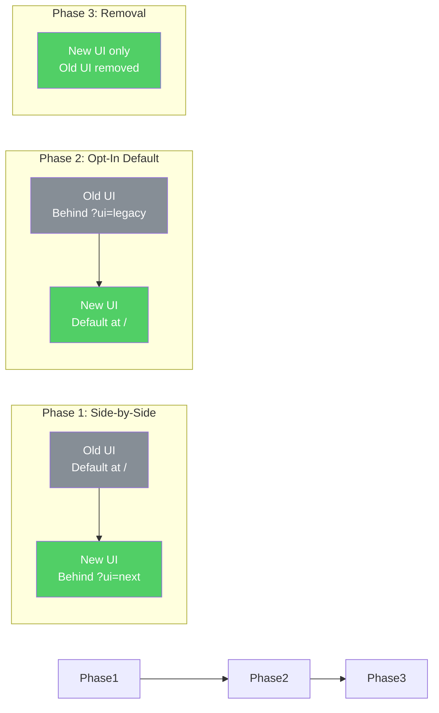

### 23.2 URL Backward Compatibility

The old UI has no URLs (everything is tab state). There are no bookmarks or saved links to break. The migration is URL-additive only - every new URL is net-new functionality.

### 23.3 API Backward Compatibility

All existing admin API endpoints remain unchanged. The new BFF endpoints (`/admin/dashboard`, `/admin/endpoints/:id/overview`) are additive. Any tool or script calling the existing admin API continues to work without modification.

### 23.4 Configuration Backward Compatibility

No new environment variables required for the UI. The same `VITE_API_BASE`, `VITE_SCIM_TOKEN`, theme preference in `localStorage` - all carry forward unchanged.

---

## 24. Prompt Chain Methodology

> **Purpose of this section.** Convert our 12-stage investigation into a **reusable architecture decision pipeline** that anyone can copy, parameterize, and apply to a different project. Below: stage taxonomy, executable prompt templates, bias-removal phrases, hallucination detection checklist, subagent delegation rules, quality gates, anti-patterns, observed failure modes, and a single **bootstrap mega-prompt**.

### 24.1 Stage Taxonomy

Each stage of the chain has a distinct **constraint** (what it forbids), an **artifact** (what it produces), and a **validation source** (how its output is checked by a later stage). The constraint is the value-creator: removing it collapses the stage into the previous one.

| # | Stage | Bias Removed / Constraint | Artifact Produced | Validated By |
|---|---|---|---|---|
| 1 | Competitive scan | Forbid mentioning current implementation | N alternatives with verdict table | Stage 7 (testability), Stage 9 (multi-mode) |
| 2 | Direction crystallization | Forbid "we'll figure it out later" | Concrete tech stack + phase outline | Stage 3 (perf), Stage 10 (sequencing) |
| 3 | Performance impact analysis | Forbid hand-waving (numbers required) | Bottleneck list with metrics (queries/req, ms, KB) | Stage 4 (solutions) |
| 4 | Solution design | Forbid solutions that don't address Stage 3's metrics | Architectural changes mapped to bottlenecks | Stage 7 (test boundaries), Stage 8 (CI feasibility) |
| 5 | Unconstrained exploration R1 | Forbid using only the original tech stack | ≥3 ideas not in initial plan | Stage 6 (further unconstrained) |
| 6 | Unconstrained exploration R2 | Forbid using *any* prior context (company, audience, stack) | First-principles alternatives | Stage 11 (decision log) |
| 7 | Testability validation | Forbid components without defined test boundaries | 4-tier test pyramid mapping | Stage 8 (automation) |
| 8 | Automation validation | Forbid quality gates that need humans | Zero-human CI pipeline with budgets | Stage 10 (sequence respects gates) |
| 9 | Multi-environment validation | Forbid coupling to one deployment mode | Mode-agnostic DI rule + CI matrix | Stage 10 (each step works in all modes) |
| 10 | Implementation sequencing | Forbid steps without explicit dependencies | DAG of ≤1-day steps | Stage 11 (every step traceable to a decision) |
| 11 | Formal documentation | Forbid undocumented decisions | RFC-style doc with decision log | Stage 12 (gap analysis) |
| 12 | Gap-filling enhancement | Forbid skipping the "what's missing" question | Additional sections covering blind spots | This section |

### 24.2 Pipeline Topology

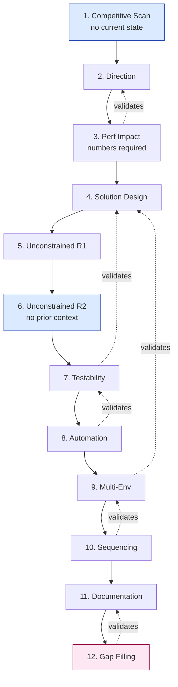

Solid arrows = forward flow. Dotted arrows = back-validation: a later stage can force a return to an earlier one if its constraint is violated.

### 24.3 Reusable Prompt Templates

Substitute `{{project}}`, `{{domain}}`, `{{current_stack}}`, `{{audience}}`, `{{constraints}}` for your context.

#### Stage 1 - Competitive Scan
```text
You are an architecture researcher. Ignore everything {{project}} currently does.
Research the 8-10 leading products in the {{domain}} space. For each, extract:
the dominant UI metaphor, primary navigation pattern, density choice (compact vs
spacious), notable interaction (e.g., command palette, live data), and one
unique design principle. Produce a verdict table with columns:
[Product | Metaphor | Best Idea | Adopt? Yes/No/Adapt | Reasoning].
Conclude with 3-5 distinct UI options that synthesize the best ideas.
Do NOT reference {{current_stack}} or audience expectations yet.
```

#### Stage 3 - Performance Impact Analysis
```text
For each proposed change in the previous step, quantify the impact on:
- Database queries per request (count, type)
- p50/p95 latency (estimate or measured)
- Bundle size delta (KB gzipped)
- Memory footprint (heap, MB)
- Network round trips per user action
Identify all N+1 query risks, count(*) storms, synchronous filesystem reads,
and unbounded loops. Provide a number for each. Hand-waving disqualifies a row.
```

#### Stage 6 - Unconstrained Exploration Round 2
```text
Forget everything we've discussed. Pretend you have never seen this codebase.
You are designing this from scratch in {{current_year}} with no constraints:
- Not bound to {{current_stack}}
- Not bound to {{audience}}'s familiarity
- Not bound to existing infrastructure
- Not bound to team skills
What architecture would you choose? What would you NOT choose that I'm
likely to assume? Argue against my likely defaults. Cite specific products
or papers that support your alternative.
```

#### Stage 7 - Testability Validation
```text
For each architectural component in the plan, answer:
1. What is its test boundary (unit / integration / E2E / contract)?
2. What does it depend on, and how is that dependency mocked or stubbed?
3. Can it be tested without a network, a database, or a browser?
4. What is the smallest reproducer that exercises its full behavior?
Flag any component that fails any of these. Propose a refactor that
makes it testable without changing its public contract.
```

#### Stage 8 - Automation Validation
```text
Design a CI pipeline that enforces every quality gate without human review.
For each gate, specify:
- Tool (lint, type-check, test runner, axe-core, Lighthouse, etc.)
- Time budget (must be < {{ci_budget_minutes}} total)
- Failure mode (block PR, warn, auto-fix)
- Coverage requirement (% lines, branches, mutation score)
List every gate that currently relies on human judgment and replace it
with an automated equivalent or accept the residual risk explicitly.
```

#### Stage 9 - Multi-Environment Validation
```text
List every deployment / runtime mode the product must support:
{{modes}} (e.g., in-memory, Postgres, Docker, standalone, cloud).
For each component, prove it works in every mode by either:
(a) showing it depends only on abstractions present in all modes, or
(b) providing a mode-specific adapter with a parity test.
Output a matrix [Component x Mode] with pass/fail and the test that proves it.
```

#### Stage 10 - Implementation Sequencing
```text
Produce a directed acyclic graph of implementation steps. Each step must:
- Take <= 1 day for one engineer
- List explicit inputs (files/types it needs) and outputs (files/types it creates)
- Identify all upstream dependencies by step number
- Map to a Decision Log entry
- Be independently testable
Group into phases. Identify the critical path. Flag any step that, if it
slips, blocks >= 3 downstream steps.
```

#### Stage 12 - Gap Filling
```text
Review the entire plan. List every architectural concern that a senior
reviewer would raise but the document does not address. Use this checklist:
accessibility, error boundaries, security (CSP, PII, secrets, authn/authz),
code splitting, responsive/mobile, observability/telemetry, internationalization,
backward compatibility, migration path, abandonment plan, on-call runbook.
For each gap, either add a new section or justify omission explicitly.
```

### 24.4 Bias-Removal Phrases (the "unlock words")

Specific phrasings that empirically produced better, less-anchored output:

| Phrase | Effect |
|---|---|
| "Ignore what we currently have" | Prevents anchoring to existing implementation |
| "Forget everything we discussed" | Forces fresh framing in a context-loaded session |
| "What is the strongest argument **against** your recommendation?" | Surfaces hidden risk and weakens motivated reasoning |
| "If you started from scratch in {{year}}" | Defeats path-dependence and outdated tooling |
| "What would Linear / Stripe / Raycast do?" | Imports specific design vocabulary instead of generic advice |
| "Cite a real product or paper for each claim" | Suppresses fabrication; surfaces sourceless assertions |
| "Numbers required - hand-waving disqualifies" | Forces estimation discipline |
| "What would a senior reviewer flag?" | Triggers gap-finding mode |

### 24.5 Hallucination Detection Checklist

Run this against every stage's output before accepting it:

1. **Cite-check** - Does each library/API claim have a verifiable source (docs URL, GitHub repo, npm package)? Open one and confirm.
2. **Version-check** - Are framework versions current major? (TanStack Query v5, not v3; React 19, not 17.)
3. **Compile-check** - Does generated code pass `tsc --noEmit` against the real project config?
4. **Lint-check** - Does it pass the project's actual ESLint rules?
5. **Cross-check** - Ask the same question framed two different ways. Compare answers; investigate discrepancies.
6. **Reverse-check** - Ask "what's wrong with this answer?" Treat strong agreement as a red flag (model sycophancy).
7. **Numeric sanity** - Any number ending in `.0` or suspiciously round (1000ms, 100KB) is probably invented; demand a derivation.
8. **API existence** - For any non-trivial API call, search the actual library source / docs.

### 24.6 Subagent Delegation Strategy

When to delegate research vs synthesize inline:

| Task Type | Delegate to Subagent | Do Inline |
|---|---|---|
| Multi-file inventory across the repo | Yes | |
| Web research across 5+ URLs | Yes | |
| Parallel competitive analysis | Yes | |
| Long-running test execution | Yes | |
| Architectural synthesis / decision-making | | Yes |
| Edits to the working codebase | | Yes |
| Final document assembly | | Yes |
| User-facing communication | | Yes |

Rule of thumb: **delegate breadth, retain depth.** Subagents are stateless and fast at parallel reads; the main agent owns synthesis, decisions, and writes.

### 24.7 Context Window Management

For pipelines that approach context limits (>200K tokens):

1. **Persist decisions immediately** - Every approved decision goes into a Decision Log file (markdown) so it survives a context reset.
2. **Synthesize at stage boundaries** - Produce a 200-word "context block" per stage; carry that forward, drop the verbose deliberation.
3. **Re-inject only the synthesis** - When starting a new sub-conversation, paste the latest synthesis + relevant file contents, not the full transcript.
4. **Externalize reference data** - Long competitive matrices, RFC excerpts, schema dumps go into separate docs that the agent reads on demand.
5. **Use file-based state** - The document being produced *is* the persistent context; later stages append rather than re-deriving.

### 24.8 Quality Gates Per Stage

Move forward only when:

| Stage | Gate |
|---|---|
| 1, 5, 6 | >= 3 distinct alternatives evaluated; no "winner-takes-all" framing |
| 3 | Every bottleneck has a numeric metric (queries, ms, KB, MB) |
| 4 | Every solution maps to >= 1 Stage-3 metric and improves it |
| 7 | Every component has a test boundary and a stub/mock plan |
| 8 | Every quality gate is automated; manual gates are explicit residual risk |
| 9 | Matrix [Component x Mode] is fully populated; no "TBD" cells |
| 10 | Every step is <= 1 day, has inputs/outputs, and traces to a decision |
| 11 | Every decision has rationale + alternatives + verdict |
| 12 | Gap checklist run; rejected gaps have written justification |

### 24.9 Anti-Patterns

What we deliberately avoided (and you should too):

- **Decision-by-default** - Accepting the first AI suggestion without comparison.
- **Premature commitment** - Locking in a tech stack before competitive research.
- **Single-source bias** - Researching only one product category (e.g., only enterprise admin tools).
- **Skipping unconstrained rounds** - Going straight from "current state" to "plan" without removing context.
- **Plan without risk assessment** - Listing tasks without listing what could go wrong.
- **Rationale-free decisions** - "We picked X" without "because Y, despite Z, instead of W".
- **Solo-mode validation** - Validating only against the favored deployment mode.
- **Test-after-the-fact** - Defining tests after writing the code instead of as part of the architecture.
- **Doc-as-afterthought** - Writing the design doc after implementation; the doc *is* the design artifact.

### 24.10 Failure Modes Observed and Recoveries

Honest log of what went wrong during this session and how the chain self-corrected:

| Failure Mode | Stage | Symptom | Recovery |
|---|---|---|---|
| Anchoring to Fluent UI | Initial | Recommendations stayed within Microsoft ecosystem | Stage 6 unconstrained round surfaced shadcn/ui as superior alt for general audience |
| Missed FS reads in perf analysis | Stage 3 R1 | Bottleneck list was 3 items; should have been 4 | Re-ran with framing "list every synchronous I/O on the request path" |
| Step plan missed shared types | Stage 10 R1 | Frontend and backend started defining `DashboardResponse` independently | Added Phase 0.1 explicitly: shared types as single source of truth |
| Test counts went stale | Cross-cutting | Doc cited "1,128 tests" after suite grew to 1,149 | Established freshness audit as standing pre-commit step |
| Decision log too thin | Stage 11 R1 | Decisions listed verdict but not rejected alternatives | Added "Alternatives Considered" column to every D-entry |
| No accessibility section | Stage 11 | WCAG never mentioned despite UI focus | Stage 12 gap-fill added Section 17 |

### 24.11 The Single Bootstrap Mega-Prompt

For applying this methodology to a new project in one shot. Paste this, then iterate stage-by-stage:

```text
You are conducting a 12-stage architecture decision pipeline for {{project}},
a {{one_line_description}}. The output is a formal RFC-style document.

PROJECT CONTEXT
- Domain: {{domain}}
- Audience: {{audience}}
- Current stack: {{current_stack}}
- Deployment modes: {{modes}}
- Hard constraints: {{constraints}}
- Non-goals: {{non_goals}}

PIPELINE - run each stage in order, gating on its quality criteria:

  1. Competitive scan        (constraint: ignore current state; >= 8 products)
  2. Direction crystallize   (constraint: pick a concrete approach)
  3. Performance impact      (constraint: numbers required, no hand-waving)
  4. Solution design         (constraint: each solution maps to a Stage-3 metric)
  5. Unconstrained R1        (constraint: >= 3 ideas not in current plan)
  6. Unconstrained R2        (constraint: forget all prior context)
  7. Testability             (constraint: every component has a test boundary)
  8. Automation              (constraint: zero-human quality gates)
  9. Multi-environment       (constraint: matrix covers all deployment modes)
 10. Sequencing              (constraint: <= 1-day steps with explicit deps)
 11. Documentation           (constraint: every decision has rationale + alts)
 12. Gap filling             (constraint: run the senior-reviewer checklist)

RULES
- After each stage, summarize in <= 200 words and ask me to approve before continuing.
- Cite real sources for every library, API, or pattern claim.
- Forbidden phrasings: "modern", "best-in-class", "industry-standard" without
  citation; "should be fine", "probably works", "roughly".
- Every architectural component must answer:
  (a) what is its test boundary?
  (b) does it work in all deployment modes?
  (c) what is its perf impact in queries/ms/KB?
- Use the bias-removal phrases when stuck: "ignore what we have",
  "argue against your own recommendation", "what would a senior reviewer flag?"

DELIVERABLE
A single markdown document with: TOC, blockquote metadata header,
Mermaid diagrams, decision log with verdict + alternatives, risk assessment,
multi-mode matrix, file inventory, day-by-day implementation plan.

Begin with Stage 1.
```

### 24.12 The Meta-Lesson

The best architectural outcomes come from **deliberate sequencing of perspectives**, not from any single brilliant prompt. Each stage's value lies in *what it forbids*: Stage 1 forbids looking at current state; Stage 6 forbids using context from Stage 5; Stage 9 forbids accepting any decision that breaks a deployment target; Stage 12 forbids ending without a gap analysis.

A skilled operator's job is not to write the perfect prompt. It is to **enforce the constraints stage-by-stage**, refuse to advance until each gate is met, and feed the output of one stage as the validated input of the next. The model supplies breadth and recall; the operator supplies sequencing and refusal.

**Three principles to remember:**

1. **Constraints create insight.** Removing context (Stage 6) and demanding numbers (Stage 3) produce more value than open-ended brainstorming.
2. **Validation is structural.** Every stage validates a prior stage; trust the chain, not any single answer.
3. **The document is the outcome.** Conversations decay; written decisions with rationale and alternatives endure. Optimize for what survives the context window.

---

*Document produced from deep architectural analysis, competitive research across 10+ products, accessibility standards research (WCAG 2.1, WAI-ARIA APG), and systematic prompt-chain methodology conducted April 29, 2026.*
