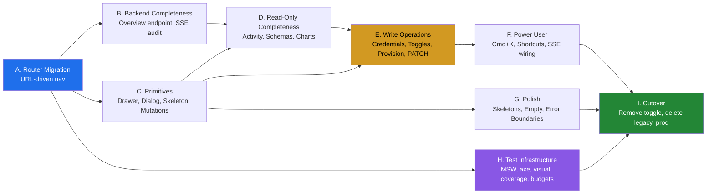
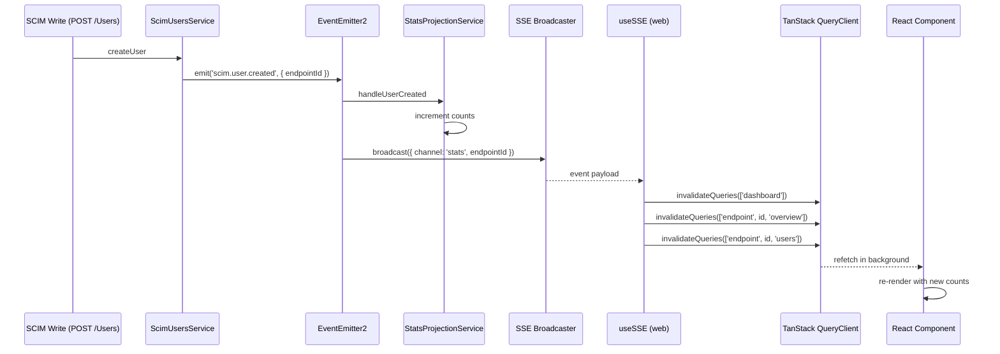
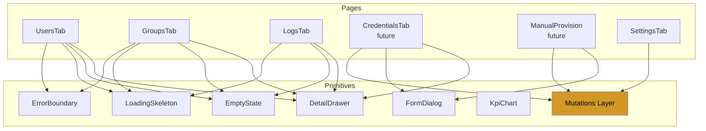
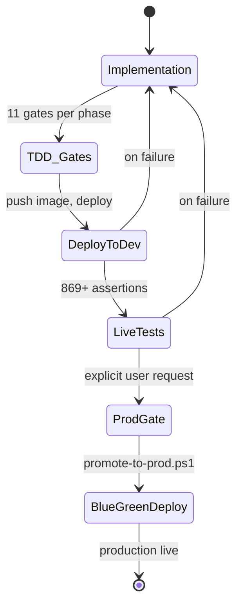
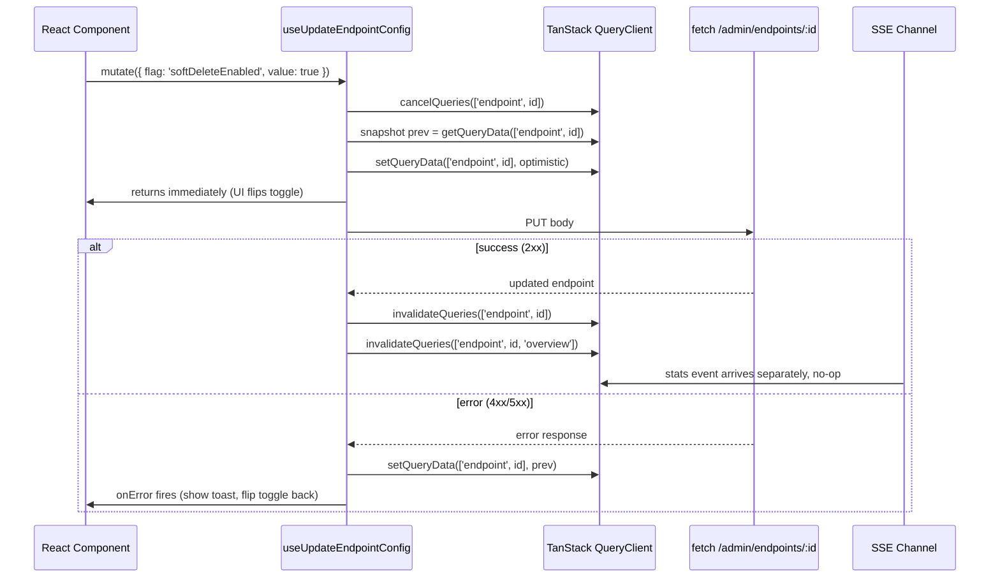
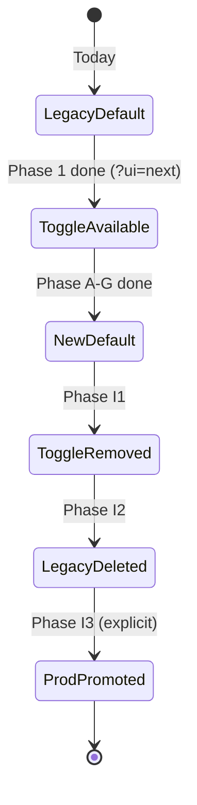

# UI Redesign - Remaining Gaps Implementation Plan

> **Version:** 0.45.0 (Phase D complete) - **Date:** May 8, 2026  
> **Scope:** All work remaining to reach 100% compliance with [UI_REDESIGN_ARCHITECTURE_AND_PLAN.md](UI_REDESIGN_ARCHITECTURE_AND_PLAN.md) (the original 42-step plan)  
> **Status:** Phases A through D shipped + stable v0.45.0 deployed; D-phase live gate 919/919 pass. Phase E (Write Operations) starts next.  
> **Predecessor docs:** [UI_REDESIGN_ARCHITECTURE_AND_PLAN.md](UI_REDESIGN_ARCHITECTURE_AND_PLAN.md), [DELIVERY_PLAN.md](DELIVERY_PLAN.md), [UI_GUIDE.md](UI_GUIDE.md)  
> **Affects:** [web/src/](../web/src/), [api/src/modules/dashboard/](../api/src/modules/dashboard/), [scripts/](../scripts/), [docs/](../docs/)

---

## Table of Contents

1. [Executive Summary](#1-executive-summary)
2. [Verified Status Audit](#2-verified-status-audit)
3. [Dependency Graph](#3-dependency-graph)
4. [Phase A - TanStack Router Migration](#4-phase-a---tanstack-router-migration)
5. [Phase B - Backend Completeness](#5-phase-b---backend-completeness)
6. [Phase C - Reusable Primitives](#6-phase-c---reusable-primitives)
7. [Phase D - Read-Only Completeness](#7-phase-d---read-only-completeness)
8. [Phase E - Write Operations](#8-phase-e---write-operations)
9. [Phase F - Power User and Real-Time](#9-phase-f---power-user-and-real-time)
10. [Phase G - Visual Polish](#10-phase-g---visual-polish)
11. [Phase H - Test Infrastructure](#11-phase-h---test-infrastructure)
12. [Phase I - Cutover and Cleanup](#12-phase-i---cutover-and-cleanup)
13. [Mutation Layer Architecture](#13-mutation-layer-architecture)
14. [Cutover Lifecycle](#14-cutover-lifecycle)
15. [Risk Register](#15-risk-register)
16. [Test Coverage Targets](#16-test-coverage-targets)
17. [TDD and Quality Gates Discipline](#17-tdd-and-quality-gates-discipline)
18. [Phase Summary Table](#18-phase-summary-table)
19. [Decision Log](#19-decision-log)

---

## 1. Executive Summary

The original UI redesign plan defined **42 steps** across 6 phases. Verified audit (May 6, 2026) shows roughly **38% complete** with the read-only spine of the new UI in place but **all write operations, advanced views, and the entire Phase 5 testing infrastructure missing**.

This document collapses the remaining work into **9 dependency-ordered phases (A through I)**, each with a clear definition of done, TDD discipline, and quality gates. The plan reaches **100% compliance** with the original plan and ends with prod promotion.

**Key facts:**

- **Estimated effort:** 12-16 days
- **New tests added:** ~120 across unit, MSW integration, Playwright, axe, visual, and live layers
- **Legacy code removed:** ~3,000 lines from [web/src/components/](../web/src/components/)
- **Backend additions:** 1 endpoint (`GET /admin/endpoints/:id/overview`) + minor instrumentation
- **Frontend additions:** ~3,500 lines across new pages, primitives, mutation layer, and tests
- **Final state:** Single UI (no `?ui=legacy` toggle), 100% URL-driven, full write parity with legacy, blue/green-promoted to prod

---

## 2. Verified Status Audit

### 2.1 Already complete

| Plan Reference | Item | Evidence |
|----------------|------|----------|
| Phase 0.1-0.6 | Backend BFF, stats projection, name resolver, version cache | [api/src/modules/dashboard/](../api/src/modules/dashboard/), [api/src/modules/stats/](../api/src/modules/stats/) |
| Phase 1.1-1.7 | App shell, sidebar, header, design tokens, query client, `?ui=legacy` switch | [web/src/layout/](../web/src/layout/), [web/src/design/](../web/src/design/), [web/src/api/queries.ts](../web/src/api/queries.ts) |
| Phase 2.1-2.6 (partial) | Dashboard, endpoint list, endpoint detail with 5 tabs, pagination, log filter | [web/src/pages/](../web/src/pages/) |
| OPS-5 | Blue/green deploy via `activeRevisionsMode: 'Multiple'` + rewritten promote script | [infra/containerapp.bicep](../infra/containerapp.bicep), [scripts/promote-to-prod.ps1](../scripts/promote-to-prod.ps1) |
| Test counts | 240 web unit, 3,612 API, 13 smoke, 869 live - all passing | Latest validation pipeline |

### 2.2 Verified gaps (the work this plan addresses)

| Plan Step | Gap | Phase Owning Fix |
|-----------|-----|------------------|
| 0.7 | `GET /admin/endpoints/:id/overview` not implemented | **B1** |
| 2.4 / 2.6 | Detail drawer for users / logs missing | **C1, E4, D5** |
| 2.7 | Activity tab missing | **D2** |
| 3.1 | Command palette (Cmd+K) missing - `cmdk` not installed | **F1** |
| 3.2 | Schema explorer missing | **D3** |
| 3.3 | Credential manager missing | **E1** |
| 3.4 | Settings flag toggles read-only - no mutations | **C5, E2** |
| 3.5 | Manual provisioning new design missing - only legacy in [components/manual/](../web/src/components/manual/) | **E3** |
| 3.6 | Global log explorer minimal - missing filters / drawer | **D5** |
| 4.1 | SSE-to-query-cache invalidation unverified | **B3, F3** |
| 4.3 | Optimistic mutations - 0 `useMutation` in queries | **C5** |
| 4.4 | Skeletons / empty states / error boundaries inconsistent | **C3, G1, G2, G3** |
| 5.1 | axe-core a11y gate not installed | **H2** |
| 5.2 | Visual regression baselines missing | **H3** |
| 5.3 | MSW handlers - 0 handlers despite installed dep | **H1** |
| 5.4 | Web coverage thresholds missing | **H4** |
| 5.5 | `test-all-modes.ps1` missing | **H5** |
| 5.6 | `?ui=legacy` cutover not done | **I1** |
| 5.7 | Legacy components not deleted (~3,000 lines) | **I2** |
| - | `recharts` installed but unused - no dashboard charts | **C4, D4** |
| - | Bundle size budget (`size-limit`) not configured | **H6** |

### 2.3 Currently in flight

| Item | Phase | Status |
|------|-------|--------|
| Phase A - TanStack Router migration | **A** | ✅ COMPLETE (v0.42.0) |
| Phase B - BFF Overview + SSE audit | **B** | ✅ COMPLETE (v0.43.0) |
| Phase C - Reusable Primitives + Mutations | **C** | ✅ COMPLETE (v0.44.0 + v0.44.1 hardening) |
| Phase D - Read-Only Completeness | **D** | ✅ COMPLETE (v0.45.0 stable, 919/919 live pass) |
| Phase E - Write Operations | **E** | NEXT - starts after Phase D rollup |
| Phase F - Power User and Real-Time | **F** | After E |
| Phase G - Visual Polish | **G** | Parallel with H |
| Phase H - Test Infrastructure | **H** | Parallel with G |
| Phase I - Cutover and Cleanup | **I** | After F, G, H |

### 2.4 Phase D rollup snapshot (v0.45.0)

| Sub-phase | Tag | Live gate | Net new tests |
|---|---|---|---|
| D1 Overview Data-Complete | 0.45.0-alpha.1 | rolled into D5 | +4 web vitest |
| D2 Activity Tab | 0.45.0-alpha.2 | rolled into D5 | +2 unit, +1 E2E, +6 web, +10 live |
| D3 Schemas Tab | 0.45.0-alpha.3 | rolled into D5 | +7 web vitest |
| D4 Dashboard Charts | 0.45.0-alpha.4 | 910/910 | +13 unit (req-series), +3 unit (controller), +3 E2E, +4 web, +9 live |
| D5 Global Logs Enhancement | 0.45.0-alpha.5 | 919/919 | +2 unit, +3 E2E, +7 web, +9 live |
| **Stable rollup** | **v0.45.0** | **919/919 PASS** | +14 unit (in-memory parity gate-2 fix) |

Cumulative: API unit 3,628 -> **3,675**, API E2E 1,171 -> **1,178**, Web vitest 368 -> **396**, Live SCIM 891 -> **919**.

---

## 3. Dependency Graph

The phases form a directed graph. Phase A unblocks URL-driven loaders that B and D consume. Phase C delivers primitives that D and E both reuse. Phase H can land in parallel with G. Phase I requires everything else.



---

## 4. Phase A - TanStack Router Migration

**Goal:** Replace manual `currentPath` Zustand routing with type-safe URL-driven TanStack Router.

**Already planned in detail.** Reference: previous conversation plan (also surfaced as the [router migration plan](#a)).

### 4.1 Scope

| Sub-phase | Output | Risk |
|-----------|--------|------|
| A1 Foundation | `router.ts`, route tree, search-param zod schemas, `__root.tsx`, 9 route files, `renderWithRouter()` test helper | None - additive only |
| A2 Cutover | `App.tsx` uses `<RouterProvider>`, strip `AppRouter` from `AppShell`, replace Zustand `navigate` with `<Link>` | Medium - cutover point |
| A3 Page migration | Convert 9 pages to consume router params + search | Low - per-page |
| A4 Polish | Loaders with `preload="intent"`, devtools, lazy routes | Low |
| A5 E2E | Playwright tests assert on URLs not React state | Low |

### 4.2 Definition of done

- All routes from plan section 5.2 implemented
- `?ui=legacy` switch still works (legacy mounts old `App`, new mounts `<RouterProvider>`)
- 240 vitest tests still pass with router context wrappers added where needed
- Pagination state lives in URL search params (Users, Groups, Logs)
- Tab selection on EndpointDetail lives in URL path
- All 11 quality gates pass; deploy to dev; 869+ live assertions pass; no prod promote

---

## 5. Phase B - Backend Completeness

**Goal:** Implement plan step 0.7 and verify SSE wiring.

### 5.1 B1 - `GET /admin/endpoints/:id/overview`

Aggregates everything the Overview tab and Credentials tab need in **one round trip with zero database queries** (reads from `StatsProjectionService`, `EndpointService` cache, and `NameResolverService` LRU).

**Response shape (key allowlist enforced in tests):**

```jsonc
{
  "endpoint": { "id": "...", "name": "...", "displayName": "...", "preset": "entra-id", "active": true },
  "stats": { "userCount": 500, "groupCount": 12, "logCount": 340 },
  "credentials": [{ "id": "...", "label": "Entra", "active": true, "createdAt": "..." }],
  "recentActivity": [/* last 10 entries with display names resolved via batch */],
  "configFlags": { "strictSchemaValidation": true, "softDeleteEnabled": false /* ...all 16 flags */ }
}
```

**Files:**

- New method in [api/src/modules/dashboard/dashboard.controller.ts](../api/src/modules/dashboard/dashboard.controller.ts)
- New method in dashboard service (extracted helper for testability)
- Spec: extend [api/src/modules/dashboard/dashboard.controller.spec.ts](../api/src/modules/dashboard/dashboard.controller.spec.ts) with overview cases (happy, missing endpoint, no credentials)
- E2E: new [api/test/e2e/dashboard-overview.e2e-spec.ts](../api/test/e2e/dashboard-overview.e2e-spec.ts) - 3 tests
- Live test: new section `9l. ENDPOINT OVERVIEW BFF` in [scripts/live-test.ps1](../scripts/live-test.ps1) before TEST SECTION 10
- Doc: [docs/G_BFF_ENDPOINT_OVERVIEW.md](G_BFF_ENDPOINT_OVERVIEW.md)
- INDEX.md, CHANGELOG.md, Session_starter.md, version bump

### 5.2 B2 - Frontend hook

- Add `useEndpointOverview(id)` to [queries.ts](../web/src/api/queries.ts)
- Add `queryKeys.endpointOverview(id)` to the key registry
- Replace ad-hoc `useEndpointStats` calls in `EndpointDetailPage.OverviewTab` with `useEndpointOverview`
- TDD: 3 unit tests (loading, error, success shape)

### 5.3 B3 - SSE invalidation audit



- Audit [web/src/hooks/useSSE.ts](../web/src/hooks/useSSE.ts) for the invalidation pattern
- Add channel-specific invalidation: `users`, `groups`, `logs`, `stats`, `endpoints`
- TDD: unit tests with mocked EventSource asserting the right keys are invalidated for each channel

---

## 6. Phase C - Reusable Primitives

**Goal:** Build the primitive layer Phases D and E both depend on.



### 6.1 C1 - DetailDrawer

- File: [web/src/components/primitives/DetailDrawer.tsx](../web/src/components/primitives/DetailDrawer.tsx)
- Wraps Fluent UI `Drawer` (overlay, type=overlay, position=end)
- Slots: `header`, `body` (scrollable), `footer` (sticky action bar)
- Closes on ESC, backdrop click, close button
- Tests: 4 unit (open, close ESC, close backdrop, footer renders)

### 6.2 C2 - FormDialog

- File: [web/src/components/primitives/FormDialog.tsx](../web/src/components/primitives/FormDialog.tsx)
- Wraps Fluent UI `Dialog`
- Manages submit/cancel, validation summary, busy state, error banner
- Tests: 5 unit (open, submit happy, submit error, cancel, busy disables submit)

### 6.3 C3 - EmptyState, LoadingSkeleton, ErrorBoundary

- Files: [web/src/components/primitives/EmptyState.tsx](../web/src/components/primitives/EmptyState.tsx), [LoadingSkeleton.tsx](../web/src/components/primitives/LoadingSkeleton.tsx), [ErrorBoundary.tsx](../web/src/components/primitives/ErrorBoundary.tsx)
- `EmptyState`: icon + title + body + optional CTA button
- `LoadingSkeleton`: rectangle with shimmer animation; props for `width`, `height`, `count`
- `ErrorBoundary`: catches render errors, shows retry, hides stack in prod
- Tests: 6 unit (3 snapshots + 3 behavior)

### 6.4 C4 - KpiChart

- File: [web/src/components/primitives/KpiChart.tsx](../web/src/components/primitives/KpiChart.tsx)
- Uses `recharts` (already installed)
- Sparkline + area variant; accepts `data: number[]`, `label`, `colorScheme`
- Activates the otherwise-unused dependency
- Tests: 3 unit (renders, empty data, colors)

### 6.5 C5 - Mutation Layer

The largest primitive. See [Section 13](#13-mutation-layer-architecture) for the full architecture.

**Hooks added to [queries.ts](../web/src/api/queries.ts):**

| Hook | HTTP | Optimistic | Invalidates |
|------|------|------------|-------------|
| `useCreateCredential(endpointId)` | POST `/admin/endpoints/:id/credentials` | No (server-generated id) | `['endpoint', id, 'overview']` |
| `useDeleteCredential(endpointId)` | DELETE `/admin/endpoints/:id/credentials/:credId` | Yes (filter list) | `['endpoint', id, 'overview']` |
| `useUpdateEndpointConfig(endpointId)` | PUT `/admin/endpoints/:id` | Yes (flag toggles) | `['endpoint', id]`, `['endpoint', id, 'overview']` |
| `useCreateUser(endpointId)` | POST `/endpoints/:id/Users` | No | `['endpoint', id, 'users']`, `['dashboard']` |
| `useCreateGroup(endpointId)` | POST `/endpoints/:id/Groups` | No | `['endpoint', id, 'groups']`, `['dashboard']` |
| `useUpdateUser(endpointId, userId)` | PATCH `/endpoints/:id/Users/:uid` | Yes | `['endpoint', id, 'users']` |
| `useDeleteUser(endpointId, userId)` | DELETE `/endpoints/:id/Users/:uid` | Yes (remove from list) | `['endpoint', id, 'users']`, `['dashboard']` |

- Each ships with rollback path in `onError`
- Tests: 14 unit (2 per hook: success + rollback)

---

## 7. Phase D - Read-Only Completeness

**Goal:** All read-only views in plan are present and data-complete.

### 7.1 D1 - Overview tab fully data-driven

- Consume `useEndpointOverview` (B2) instead of stitching `useEndpointStats`
- Render: stats cards + recent activity list + flag summary count + credential count
- Skeleton on loading; EmptyState when no recent activity
- Tests: 4 unit

### 7.2 D2 - Activity tab (plan 2.7)

- New file [web/src/pages/ActivityTab.tsx](../web/src/pages/ActivityTab.tsx)
- Add to `EndpointDetailPage` tab list (post Phase A: nested route `/endpoints/$endpointId/activity`)
- New query hook `useEndpointActivity(id, filters)`
- Real-time updates via SSE invalidation (B3 + F3)
- Filter by operation type, resource type, time range
- Tests: 5 unit + 1 MSW integration

### 7.3 D3 - Schemas tab (plan 3.2)

- New file [web/src/pages/SchemasTab.tsx](../web/src/pages/SchemasTab.tsx)
- Tree view: schema -> attributes -> sub-attributes
- Each leaf shows characteristics: `required`, `mutability`, `returned`, `uniqueness`, `type`, `multiValued`
- Read-only view; copy-to-clipboard for URN
- New hook `useEndpointSchemas(id)` (cache 5 min, schemas rarely change)
- Tests: 4 unit (tree expand, characteristic display, copy, empty schemas)

### 7.4 D4 - Dashboard charts

- Wire `KpiChart` (C4) to `requestsLast24h` series
- Backend: extend `DashboardResponse` with `requestsLast24hSeries: number[24]` (hourly buckets) - small change
- Or query `/admin/logs?bucket=hour&hours=24` directly
- Recommend: extend `DashboardResponse` to keep one round trip
- Tests: 3 unit (chart renders, empty data, hover tooltip)

### 7.5 D5 - Global Logs page enhancement (plan 3.6)

- Add to [LogsPage.tsx](../web/src/pages/LogsPage.tsx):
  - Endpoint multi-select filter (uses `useEndpoints`)
  - Status code filter (200, 201, 400, 401, 403, 404, 409, 500)
  - Time range picker (last 1h, 24h, 7d, custom)
- Reuse `DetailDrawer` (C1) for log detail (status, headers, body, related activity)
- Filters live in URL search params (Phase A pattern)
- Tests: 6 unit + 1 Playwright

---

## 8. Phase E - Write Operations

**Goal:** Reach feature parity with legacy UI by adding all write operations.

### 8.1 E1 - Credentials manager (plan 3.3)

- New file [web/src/pages/CredentialsTab.tsx](../web/src/pages/CredentialsTab.tsx)
- Add tab to EndpointDetail (post Phase A: route `/endpoints/$endpointId/credentials`)
- Lists credentials from `useEndpointOverview(id).credentials`
- Create button -> `FormDialog` with label + scope inputs -> `useCreateCredential`
- Delete row -> confirm dialog -> `useDeleteCredential` (optimistic remove)
- Backend already supports CRUD - see [G11_PER_ENDPOINT_CREDENTIALS.md](auth/G11_PER_ENDPOINT_CREDENTIALS.md)
- Tests: 5 unit + 2 MSW (create flow, delete flow with rollback)

### 8.2 E2 - Config flag toggles (plan 3.4)

- Convert [SettingsTab.tsx](../web/src/pages/SettingsTab.tsx) read-only to interactive
- Each `Switch` calls `useUpdateEndpointConfig` with the changed flag
- Optimistic apply: flip immediately, queue server update, rollback on error
- Show toast on success/error
- Tests: 4 unit (toggle, optimistic apply, rollback path, batched changes)

### 8.3 E3 - Manual provisioning redesigned (plan 3.5)

- New top-level page [web/src/pages/ManualProvisionPage.tsx](../web/src/pages/ManualProvisionPage.tsx) (after Phase A: route `/manual-provision`)
- Sub-components: `CreateUserForm`, `CreateGroupForm`, `ProvisionResult`
- Endpoint picker -> resource type tabs -> form -> result panel
- Uses `useCreateUser`, `useCreateGroup`
- Replaces legacy [components/manual/ManualProvision.tsx](../web/src/components/manual/ManualProvision.tsx) (deleted in Phase I)
- Tests: 6 unit + 2 MSW

### 8.4 E4 - User and Group detail drawer with PATCH

- Click row in `UsersTab` / `GroupsTab` -> `DetailDrawer` opens
- Drawer body: form pre-filled with user/group data
- Read-only fields explicit (`id`, `meta.created`, `meta.lastModified`)
- Save -> `useUpdateUser` / `useUpdateGroup` (optimistic patch)
- Delete button in footer -> confirm -> `useDeleteUser`
- Tests: 6 unit + 2 MSW + 1 Playwright (full edit cycle)

---

## 9. Phase F - Power User and Real-Time

### 9.1 F1 - Command palette (plan 3.1)

- `npm install cmdk` (in [web/](../web/))
- New [web/src/components/CommandPalette.tsx](../web/src/components/CommandPalette.tsx)
- Sources:
  - Routes: from TanStack Router route tree (Phase A unlocks this)
  - Endpoints: from `useEndpoints`
  - Recent searches: from Zustand `ui-store`
  - Quick actions: "Create user", "Create group", "View logs"
- Bound globally to Cmd+K (mac) / Ctrl+K (others)
- Tests: 4 unit + 1 Playwright

### 9.2 F2 - Keyboard shortcuts (plan 4.2)

- New [web/src/hooks/useKeyboardShortcuts.ts](../web/src/hooks/useKeyboardShortcuts.ts)
- Bindings:
  - `g d` -> `/`
  - `g e` -> `/endpoints`
  - `g l` -> `/logs`
  - `g s` -> `/settings`
  - `/` -> focus global search
  - `?` -> open shortcuts help modal
- Help modal lists all shortcuts
- Tests: 3 unit + 1 Playwright

### 9.3 F3 - SSE invalidation completeness

- Extends B3 with all channels: `users`, `groups`, `logs`, `stats`, `endpoints`, `credentials`
- Per-channel invalidation map exported from [hooks/useSSE.ts](../web/src/hooks/useSSE.ts)
- E2E: Playwright opens two tabs, writes resource in tab A, asserts tab B updates without manual refresh

---

## 10. Phase G - Visual Polish

### 10.1 G1 - Skeletons everywhere

- All tabs use `LoadingSkeleton` (C3) for `isLoading` state
- Remove "Loading..." text fallbacks
- Skeleton mirrors final layout (cards, rows, etc.)

### 10.2 G2 - Empty states

| Surface | Empty Copy | CTA |
|---------|------------|-----|
| Endpoints list (none) | "No endpoints yet" | "Create your first endpoint" |
| Activity (24h none) | "No activity in the last 24 hours" | none |
| Logs (filters too narrow) | "No logs match these filters" | "Reset filters" |
| Users (none) | "No users in this endpoint" | "Provision a user" |
| Groups (none) | "No groups in this endpoint" | "Create a group" |
| Credentials (none) | "No credentials configured" | "Add credential" |

### 10.3 G3 - Error boundaries on every route

- Wrap each Phase A route element in `ErrorBoundary` (C3)
- Show retry button + error code; hide stack in prod
- Send error to console with route path tag

### 10.4 G4 - Transitions

- Route transition fade (built-in to TanStack Router via `<Outlet />` animation pattern)
- Drawer slide-in from right
- Dialog scale-up
- Skeleton crossfade on data arrival

---

## 11. Phase H - Test Infrastructure

### 11.1 H1 - MSW handlers (plan 5.3)

- New [web/src/test/msw/handlers.ts](../web/src/test/msw/handlers.ts) with handlers for **all 12 admin endpoints**:
  - `/admin/dashboard`, `/admin/endpoints/:id/overview`, `/admin/endpoints`, `/admin/endpoints/:id`, `/admin/endpoints/:id/credentials`, `/admin/database/users`, `/admin/database/groups`, `/admin/logs`, `/admin/activity`, `/admin/version`, `/admin/health`, `/endpoints/:id/Schemas`
- New [web/src/test/msw/server.ts](../web/src/test/msw/server.ts) for Node tests
- New [web/src/test/msw/error-handlers.ts](../web/src/test/msw/error-handlers.ts) for 401/403/500 cases
- Update [web/src/test/setup.ts](../web/src/test/setup.ts) to start/stop MSW server
- Convert ~5 existing tests from raw fetch mocks to MSW-driven integration tests
- Tests: 25+ MSW integration

### 11.2 H2 - axe-core a11y gate (plan 5.1)

- `npm install -D @axe-core/playwright`
- Add helper `await injectAxe(page); await checkA11y(page, undefined, { detailedReport: true })` in every Playwright spec
- Block on `serious` or `critical` violations
- Existing 6 specs + new specs added in Phase E

### 11.3 H3 - Visual regression (plan 5.2)

- Use Playwright snapshot mode (no cloud dependency, simpler than Lost Pixel)
- 12-15 baselines: Dashboard light/dark, Endpoints list, Endpoint detail (all 7 tabs), Logs page, Manual Provision, Command Palette
- New script [scripts/update-visual-baselines.ps1](../scripts/update-visual-baselines.ps1)
- CI fails on diff; baselines committed to repo

### 11.4 H4 - Web coverage gates (plan 5.4)

- Add to [web/vite.config.ts](../web/vite.config.ts) `test.coverage`:
  - `lines: 80`, `branches: 75`, `functions: 90`, `statements: 80`
- CI fails on regression
- Excludes: `node_modules/`, `dist/`, `*.config.*`, `*.d.ts`, `routes/__root.tsx` (router scaffolding)

### 11.5 H5 - `test-all-modes.ps1` (plan 5.5)

- New [scripts/test-all-modes.ps1](../scripts/test-all-modes.ps1)
- Matrix:
  - Backends: in-memory, prisma
  - UI modes: `?ui=next` (post-cutover: removed from matrix), `?ui=legacy` (deleted in I1)
  - Themes: light, dark
  - Web: vitest + Playwright
- Runs sequentially, reports pass/fail per cell

### 11.6 H6 - size-limit (plan section 12)

- `npm install -D @size-limit/preset-app size-limit`
- Add to [web/package.json](../web/package.json):
  ```json
  "size-limit": [
    { "name": "Dashboard route", "path": "dist/assets/dashboard-*.js", "limit": "90 KB" },
    { "name": "Endpoint detail route", "path": "dist/assets/endpoint-*.js", "limit": "110 KB" }
  ]
  ```
- CI fails on regression

---

## 12. Phase I - Cutover and Cleanup

### 12.1 I1 - Remove `?ui=legacy` toggle (plan 5.6)

- Strip switch from [App.tsx](../web/src/App.tsx); new UI becomes default and only path
- One commit, easily revertible
- Update Playwright tests to drop `?ui=next` query

### 12.2 I2 - Legacy cleanup (plan 5.7)

Delete (~3,000 lines):

| Path | Lines | Reason |
|------|-------|--------|
| [web/src/components/Header.tsx](../web/src/components/Header.tsx) + .test + .module.css | ~150 | Replaced by `layout/AppHeader.tsx` |
| [web/src/components/LogList.tsx](../web/src/components/LogList.tsx) + .test + .module.css | ~250 | Replaced by `pages/LogsPage.tsx` |
| [web/src/components/LogDetail.tsx](../web/src/components/LogDetail.tsx) + .test + .module.css | ~200 | Replaced by `DetailDrawer` in Logs |
| [web/src/components/LogFilters.tsx](../web/src/components/LogFilters.tsx) + .test + .module.css | ~150 | Replaced by inline filters |
| [web/src/components/activity/](../web/src/components/activity/) | ~600 | Replaced by `pages/ActivityTab.tsx` |
| [web/src/components/database/](../web/src/components/database/) | ~1,100 | Replaced by `pages/UsersTab.tsx` etc. |
| [web/src/components/manual/](../web/src/components/manual/) | ~450 | Replaced by `pages/ManualProvisionPage.tsx` |
| [web/src/App.test.tsx](../web/src/App.test.tsx) | legacy | Rewritten for new shell |
| [web/src/app.module.css](../web/src/app.module.css) | ~410 | Per-component CSS in primitives |

### 12.3 I3 - Final validation pipeline + prod promotion



- Run all 11 mandatory quality gates per the standing rule
- Deploy to dev via `scripts/deploy-dev.ps1`
- Live test surpasses 869+ assertions (count grows with new features)
- **Only on explicit user request:** `deployAndPromote` prompt or manual `scripts/promote-to-prod.ps1`
- Prod uses blue/green via OPS-5 (single revision active at a time, switch-over with health check)

---

## 13. Mutation Layer Architecture



**Universal pattern:** `onMutate` snapshot -> optimistic write -> `onError` rollback -> `onSettled` invalidate.

Tests assert both branches with MSW handlers returning success and error respectively.

---

## 14. Cutover Lifecycle



Each transition is a single revertible commit.

---

## 15. Risk Register

| Risk | Likelihood | Impact | Mitigation |
|------|-----------|--------|------------|
| Optimistic updates desync from server | Medium | Medium | Always `onSettled` invalidate; rollback in `onError`; tests for both paths |
| TanStack Router cutover breaks deep links | Medium | High | Phase A1 is additive; A2 has revertible commit; E2E updated in A5 |
| MSW handlers diverge from real API | High | Medium | Generate handlers from API integration tests; nightly drift check job |
| Visual regression flaky on font rendering | High | Low | Use Playwright `pixelDelta` tolerance; OS-pinned baseline runner |
| Coverage gate breaks unrelated PRs | Medium | Low | Set thresholds at current floor + ratchet up per phase |
| Legacy cleanup deletes still-imported file | Low | High | Lint pre-delete: search for imports across `web/src`; CI verifies build |
| Live test count regression masked by new tests | Medium | Medium | Track count in CHANGELOG explicitly per commit |
| Prod promotion accidentally triggered | Low | Critical | Standing rule: never auto-promote; explicit user-initiated only |

---

## 16. Test Coverage Targets

| Layer | Current | Target | Mechanism |
|-------|---------|--------|-----------|
| Web unit (Vitest) | 240 | ~360 | TDD per step + MSW conversions |
| Web E2E (Playwright) | 6 | ~12 | New specs in F1, F3, E4, D5 |
| Web a11y (axe) | 0 | every E2E | H2 gate |
| Web visual | 0 | 12-15 baselines | H3 |
| Web coverage | none | 80/75/90/80 | H4 |
| API unit | 3,612 | 3,640+ | B1 spec additions |
| API E2E | 1,149 | 1,152+ | B1 E2E |
| Live tests | 869 | 875+ | B1 live section |
| Bundle budget | none | 90/110 KB gz | H6 |

---

## 17. TDD and Quality Gates Discipline

Per project standing rule, every step in this plan follows:

### 17.1 Per-step TDD cycle

1. **RED:** Write failing test (unit, then E2E if backend)
2. **GREEN:** Minimal implementation
3. **REFACTOR:** Clean up while keeping green

### 17.2 Per-step deliverables (standing checklist)

| # | Deliverable | Where |
|---|-------------|-------|
| 1 | Unit tests | `*.spec.ts` (API) or `*.test.tsx` (web) |
| 2 | E2E tests | [api/test/e2e/](../api/test/e2e/) (API only) |
| 3 | Live integration tests | [scripts/live-test.ps1](../scripts/live-test.ps1) (API only) |
| 4 | Feature doc | [docs/](../docs/) |
| 5 | INDEX.md update | [docs/INDEX.md](INDEX.md) |
| 6 | CHANGELOG entry | [CHANGELOG.md](../CHANGELOG.md) |
| 7 | Session/Context update | [Session_starter.md](../Session_starter.md), [docs/CONTEXT_INSTRUCTIONS.md](CONTEXT_INSTRUCTIONS.md) |
| 8 | Version bump | [api/package.json](../api/package.json), [web/package.json](../web/package.json) |
| 9 | Response contract test | Key allowlist assertion (B1 has the most) |

### 17.3 Per-phase quality gates (mandatory before phase complete)

1. TDD followed for every step
2. `addMissingTests` prompt
3. `apiContractVerification` prompt
4. `error-handling-verification` prompt
5. `logging-verification` prompt
6. `auditAgainstRFC` prompt
7. `securityAudit` prompt
8. `performanceBenchmark` prompt
9. `auditAndUpdateDocs` prompt
10. `fullValidationPipeline` prompt
11. Deploy to dev + run [scripts/live-test.ps1](../scripts/live-test.ps1) (current 869+ must pass)

### 17.4 Prod promotion

Never automatic. Only on explicit user request:

```powershell
# Either prompt-based:
# user runs deployAndPromote prompt

# Or manual:
.\scripts\promote-to-prod.ps1
```

---

## 18. Phase Summary Table

| Phase | Steps | Effort | Risk | Tests Added | Output |
|-------|-------|--------|------|-------------|--------|
| **A** Router migration | 5 | 2-3d | Medium | ~17 fixed + 0 new | URL-driven nav |
| **B** Backend completeness | 3 | 1d | Low | ~10 unit + 3 E2E + 5 live | Overview endpoint, SSE audit |
| **C** Primitives | 5 | 1d | Low | ~15 unit | Drawer, dialog, mutations layer |
| **D** Read-only complete | 5 | 1-2d | Low | ~20 unit + 4 MSW | Activity, schemas, charts |
| **E** Write operations | 4 | 2-3d | Medium | ~25 unit + 8 MSW + 3 E2E | Credentials, toggles, provision, PATCH |
| **F** Power user | 3 | 1d | Low | ~10 unit + 2 E2E | Cmd+K, shortcuts, SSE |
| **G** Polish | 4 | 1d | Low | snapshot updates | Skeletons, empty, error |
| **H** Test infra | 6 | 2d | Low | MSW + a11y + visual | Coverage gates, budgets |
| **I** Cutover | 3 | 1d | Medium | rewrite Playwright | Single UI, prod promote |
| **Total** | **38** | **12-16d** | - | **~120 new** | **100% plan compliance** |

---

## 19. Decision Log

| Date | Decision | Rationale |
|------|----------|-----------|
| 2026-05-06 | Use Playwright snapshot mode for visual regression, not Lost Pixel | No cloud dependency, simpler, baselines in repo |
| 2026-05-06 | Use TanStack Router code-first, not generated route tree from filesystem | Matches existing `web/src/pages/` structure; no Vite plugin churn |
| 2026-05-06 | Mutation rollback via `onError` snapshot, not server reconciliation | Matches plan section 7.3; deterministic; testable |
| 2026-05-06 | `recharts` stays installed and gets used in C4/D4 | Already a dependency; no need to swap libs |
| 2026-05-06 | Phase H lands in parallel with G | Test infra is independent of polish; faster total throughput |
| 2026-05-06 | Single revision active in prod (blue/green) via OPS-5 | Already shipped in commit 1d79d48 |
| 2026-05-06 | Live test sections sequentially numbered before TEST SECTION 10 | Matches existing convention from copilot-instructions |
| 2026-05-06 | Prod promotion never automatic; only on explicit user request | Standing rule from copilot-instructions |

---

## Cross-References

- [UI_REDESIGN_ARCHITECTURE_AND_PLAN.md](UI_REDESIGN_ARCHITECTURE_AND_PLAN.md) - Original 42-step plan (this doc tracks remaining work)
- [DELIVERY_PLAN.md](DELIVERY_PLAN.md) - Active 6-week delivery plan reconciling UI redesign + Tier-0 + CI/CD
- [UI_GUIDE.md](UI_GUIDE.md) - User-facing UI guide (updated post Phase I)
- [WEB_UI_FLOWS_AND_BEHAVIORS.md](WEB_UI_FLOWS_AND_BEHAVIORS.md) - Web UI behavior reference
- [G11_PER_ENDPOINT_CREDENTIALS.md](G11_PER_ENDPOINT_CREDENTIALS.md) - Credential backend (used by E1)
- [ENDPOINT_CONFIG_FLAGS_REFERENCE.md](ENDPOINT_CONFIG_FLAGS_REFERENCE.md) - 16 flags reference (used by E2)
- [LOGGING_AND_OBSERVABILITY.md](LOGGING_AND_OBSERVABILITY.md) - SSE channels reference (used by B3, F3)
- [scripts/live-test.ps1](../scripts/live-test.ps1) - Live integration test conventions
- [scripts/promote-to-prod.ps1](../scripts/promote-to-prod.ps1) - Blue/green prod promote
