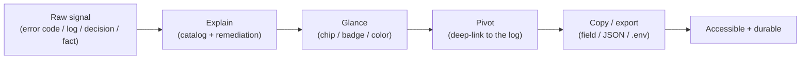
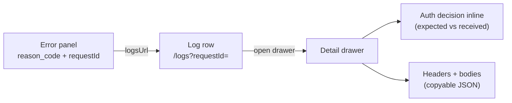
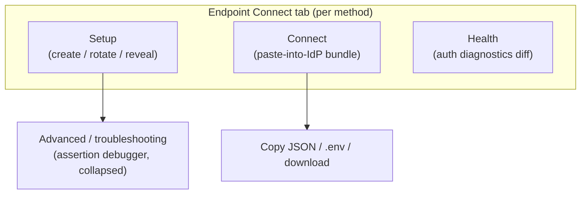

# Usability Guide

> **What this is.** How SCIMServer turns raw signals (errors, logs, auth decisions, connection facts) into an operator experience that is *explainable, glanceable, copyable, progressively disclosed, and accessible*. It is the human-facing counterpart to [OBSERVABILITY_TRACEABILITY_AND_DIAGNOSTICS.md](OBSERVABILITY_TRACEABILITY_AND_DIAGNOSTICS.md): that doc produces the signals, this doc makes them usable. Carries the primitive catalog, `data-testid` contracts, before/after examples, Mermaid flows, and a cross-domain comparison against Stripe, Twilio, GitHub, and the browser devtools model.

> **Audience.** Engineers building UI surfaces (which primitive to reach for), and reviewers checking that a new screen meets the usability bar.

---

## Table of contents

1. [Design principles](#1-design-principles)
2. [Error explainability: the Smart Error Explainer](#2-error-explainability-the-smart-error-explainer)
3. [Deep-links and the one-click pivot](#3-deep-links-and-the-one-click-pivot)
4. [Copy-everywhere: the four primitives](#4-copy-everywhere-the-four-primitives)
5. [Glanceable status](#5-glanceable-status)
6. [Progressive disclosure](#6-progressive-disclosure)
7. [Connection setup usability](#7-connection-setup-usability)
8. [Empty, loading, and error states](#8-empty-loading-and-error-states)
9. [Layout robustness](#9-layout-robustness)
10. [Accessibility](#10-accessibility)
11. [The `data-testid` contract](#11-the-data-testid-contract)
12. [Cross-domain comparison](#12-cross-domain-comparison)
13. [Test coverage](#13-test-coverage)
14. [Related docs](#14-related-docs)

---

## 1. Design principles

| Principle | What it means here | Where it shows up |
|---|---|---|
| **Explainability** | Never show a raw code without a plain-English cause + remediation | Smart Error Explainer, reason-code catalog |
| **Locality of reference** | The thing you need is where you are looking, not a screen away | auth decision inside the log's own drawer |
| **Glanceability** | Status readable in one glance, no click required | auth chip, validity badges, status colors |
| **Progressive disclosure** | Common case is simple; depth is one click away | Connect tab, add-behind-a-button, advanced accordion |
| **Copy-everywhere** | Every value/payload is copyable; every input is undo/reset-able | the four R9 primitives |
| **Durability** | A signal stays legible after its ephemeral source expires | persisted auth chip (survives the 30-min store) |
| **Accessibility** | Keyboard-reachable, screen-reader-labelled, contrast-safe | axe-core gate, ARIA, focus rings |



---

## 2. Error explainability: the Smart Error Explainer

A raw `401 { "detail": "invalid_client" }` tells an operator nothing actionable. The Smart Error Explainer (K3) is a 3-layer client architecture that turns any API failure into cause + remediation + copyable detail:

1. **`ScimApiError`** - thrown by `fetchWithAuth` when a response is not ok, carrying status + parsed body ([web/src/api/scim-error.ts](../web/src/api/scim-error.ts)).
2. **`parseScimError` + `SCIM_ERROR_CATALOG`** - a pure function that maps the SCIM `scimType` / OAuth `error` / diagnostics `reason_code` (RFC 7644 Table 9 + project extensions + HTTP-status fallbacks) to a title + plain-English explanation + docs link.
3. **`<ScimErrorMessage />`** - the primitive ([web/src/components/primitives/ScimErrorMessage.tsx](../web/src/components/primitives/ScimErrorMessage.tsx)) that renders the catalog title, the explanation, a monospace `detail`, the `requestId`, an RFC docs link, and a collapsible "View details" JSON expander.

Before (raw) vs after (explained), from this diagnostics body:

```json
{
  "error": "invalid_client",
  "error_description": "The federated assertion's audience does not match the endpoint.",
  "reason_code": "wif_audience_mismatch",
  "correlation_id": "a16360c6-db64-4949-ae7c-3bb49084a32e",
  "timestamp": "2026-07-22T00:39:44.512Z"
}
```

- **Before:** `invalid_client`
- **After:** a titled panel - "Federated assertion rejected: audience mismatch. The endpoint expects `api://app`; the assertion presented `api://wrong`. Fix the `aud` claim in your token request or the endpoint's expected audience." - with the `correlation_id` shown and a one-click link to the request log.

---

## 3. Deep-links and the one-click pivot

Every error carries a resolved `logsUrl`, and every request log row carries its `requestId`, so the operator pivots between "what failed" and "the full request" without hunting. This is the browser-devtools model: one request, its headers/auth/response in one place.



- **Forward pivot (decision -> request):** the auth-diagnostics panel adds a "View request log" link to `/logs?requestId=<correlationId>`.
- **Reverse pivot (request -> decision):** the log row's auth chip (`log-row-auth-{id}`) and the drawer's `log-detail-auth-summary` ("Authenticated via {method} using {credential} because {reason}") render the decision inside the request's own record via [AuthDiagnosticsPanel.tsx](../web/src/components/primitives/AuthDiagnosticsPanel.tsx). Because the outcome is persisted on the row (V10-V12), the chip stays legible long after the 30-minute decision store expires.

---

## 4. Copy-everywhere: the four primitives

Every display value, editable input, and JSON payload goes through one of four primitives, so copy/undo/reset behavior is uniform and the clipboard state machine lives in one place (`useCopyToClipboard`). Hand-rolled `<pre>{JSON.stringify(...)}</pre>` and bare copy buttons are forbidden.

| Primitive | Use for | Source | Key testids |
|---|---|---|---|
| **`CopyableField`** | a single scalar string (id, URN, path, timestamp) | [CopyableField.tsx](../web/src/components/primitives/CopyableField.tsx) | `<id>`, `<id>-copy-button` |
| **`CopyableJsonBlock`** | a read-only pretty-printed JSON viewer | [CopyableJsonBlock.tsx](../web/src/components/primitives/CopyableJsonBlock.tsx) | `<id>`, `<id>-copy-button`, `<id>-pre` |
| **`CopyJsonButton`** | a section-level "copy the whole thing as JSON" | [CopyJsonButton.tsx](../web/src/components/primitives/CopyJsonButton.tsx) | `<id>` |
| **`EditableField`** | an editable SCIM value (copy + undo + redo + reset) | [EditableField.tsx](../web/src/components/primitives/EditableField.tsx) | `<id>-input`, `<id>-copy-button`, `<id>-undo-button`, `<id>-redo-button`, `<id>-reset-button` |

`EditableField` matters because native browser Ctrl+Z only covers one keystroke session and silently fails on paste / programmatic reset / focus loss; the primitive makes copy, undo, redo, and reset-to-original first-class and keyboard-reachable.

```tsx
// Display a scalar with a copy button
<CopyableField value={endpoint.id} monospace data-testid="endpoint-id" />

// A read-only JSON payload with a header copy button + overflow safety
<CopyableJsonBlock value={detail.responseBody} label="Response body" data-testid="log-detail-response-body" />

// An editable SCIM field with copy / undo / redo / reset
<EditableField value={userName} onChange={setUserName} data-testid="user-username" />
```

---

## 5. Glanceable status

Status is readable without a click, via consistent chips, badges, and colors.

- **Auth outcome chip** (`log-row-auth-{id}`) - green "auth ok" or red reason-code, on every request-log row.
- **Per-method validity** - each credential/trust shows `ok` / `failing` / `unverified` and a "Last verified {date}" line; per-field validity badges (`wif-credential-{id}-{field}-status`) mark https-format, JWKS-host-allowlist, and gleaned-source signals.
- **Status color** - a shared `statusColor()` maps HTTP status to Fluent Badge color (2xx/3xx success, 4xx/5xx danger), used uniformly on rows and drawers.

---

## 6. Progressive disclosure

The common case stays simple; depth is one click away, never a wall of forms.



- **Add-behind-a-button** - the WIF add-trust form is collapsed behind an "Add trust" button (`wif-add-trust-button`) so viewing configured trusts is not buried under a form.
- **Edit-in-card** - editing opens an in-card form below that trust (`wif-trust-edit-form-{id}`), not a hoisted shared form.
- **Advanced accordion** - the assertion debugger lives behind an "Advanced / troubleshooting" accordion (`wif-advanced-accordion`), collapsed by default.
- **Detail drawer** - a request's full headers, bodies, correlation id, and auth decision open in a slide-over `DetailDrawer` ([DetailDrawer.tsx](../web/src/components/primitives/DetailDrawer.tsx)) rather than a route change.

---

## 7. Connection setup usability

The Connect tab assembles, server-side, exactly what an identity provider needs (Application API URL -> token endpoint -> client identifier, in that operator-requested order) via [ConnectionPanel.tsx](../web/src/components/primitives/ConnectionPanel.tsx), and lets the operator grab it in the shape they need:

- **Copy JSON** - the whole connection bundle as JSON.
- **`.env` export** - ready to paste into a client's environment.
- **Download** - a file for handoff.
- **Re-viewable secret** - when the effective `CredentialSecretVisibility` is `always`, the actual secret renders inline (re-viewable) for every method, so the complete IdP-config bundle lives in one place.

---

## 8. Empty, loading, and error states

Every async surface has three explicit states rather than a blank screen or a raw spinner:

- **Loading** - `LoadingSkeleton` ([LoadingSkeleton.tsx](../web/src/components/primitives/LoadingSkeleton.tsx)) shows shaped placeholders (`logs-loading-skeleton`, `logs-detail-skeleton`).
- **Empty** - `EmptyState` ([EmptyState.tsx](../web/src/components/primitives/EmptyState.tsx)) shows a titled "No logs match these filters" with a reset affordance, not an ambiguous void.
- **Error** - `ScimErrorMessage` (Section 2) or an `ErrorBoundary` ([ErrorBoundary.tsx](../web/src/components/primitives/ErrorBoundary.tsx)) renders an explained failure with a retry.

---

## 9. Layout robustness

Usability includes "the layout does not break on real data". Two standing rules (with automated gates):

- **Truncation primitives self-contain their display context.** `TruncatedText` ([TruncatedText.tsx](../web/src/components/primitives/TruncatedText.tsx)) and `CopyableField truncate` set their own `display:inline-block` so ellipsis works regardless of parent, and are asserted by measured bounds (`scrollWidth > clientWidth`) in Playwright, never by CSS-property checks.
- **Tables that truncate use `table-layout: fixed` + percentage widths.** A long email-shaped userName cannot balloon one column and shove the others off-screen; the column is bounded by percentage width and the text is clipped by the truncation primitive, at both wide and narrow viewports.

---

## 10. Accessibility

- **Automated gate** - `axe-core` (the W3C-aligned engine behind Microsoft Accessibility Insights and Lighthouse) runs in both vitest and Playwright against a shared severity threshold (see [PHASE_H2_AXE_A11Y_GATE.md](PHASE_H2_AXE_A11Y_GATE.md)); a regression fails the build.
- **Keyboard reachability** - every interactive affordance (copy/undo/redo/reset buttons, drawer controls) is focus-reachable with visible focus rings.
- **Semantics** - status is conveyed by text/ARIA in addition to color (the auth chip carries its reason as text, not color alone), so it survives color-blindness and screen readers.

---

## 11. The `data-testid` contract

Specs assert by `data-testid`, never by visible label, so copy tweaks never break tests. Derivation is predictable per primitive (Section 4). Representative ids:

```jsonc
// Logs surface
"global-logs-page"                 // page root
"logs-row-<logId>"                 // a request-log row
"log-row-auth-<logId>"             // the row's glanceable auth chip
"logs-detail-drawer"               // the slide-over
"log-detail-url"                   // <CopyableField> of the URL
"log-detail-request-id"            // the correlation id (copyable)
"log-detail-auth-summary"          // durable "Authenticated via ..." line
"log-detail-auth-section"          // the U11 expected-vs-received diff
"log-detail-response-body"         // <CopyableJsonBlock> of the body
// States
"logs-loading-skeleton"            // loading
"logs-empty" / "logs-empty-title"  // empty
```

---

## 12. Cross-domain comparison

| Usability dimension | Best-in-class reference | SCIMServer | Verdict |
|---|---|---|---|
| Error explainability | Stripe / Twilio (typed error + human message + docs link) | Smart Error Explainer: catalog title + plain English + `reason_code` + docs link + JSON expander | Meets / exceeds |
| One-click error -> log pivot | Datadog / Sentry (deep-link from error to trace) | resolved `logsUrl` + `requestId` bidirectional pivot | Meets / exceeds |
| Locality of reference | Browser devtools (one request, all its detail together) | auth decision inside the request's own drawer | Meets |
| Copy-everywhere | GitHub (copy buttons on ids/SHAs) | 4 uniform primitives on every value/payload/input | Exceeds (undo/redo/reset on inputs is uncommon) |
| Progressive disclosure | Azure Portal (blades, advanced sections) | add-behind-button + in-card edit + advanced accordion + drawers | Meets |
| Config export | cloud CLIs (`.env` / JSON export) | Copy-JSON + `.env` + download in the Connect bundle | Meets |
| Empty/loading/error states | Fluent / Material design systems | skeletons + titled empty states + explained errors | Meets |
| Accessibility gating | axe-core in CI (industry norm) | axe-core in vitest + Playwright with a shared threshold | Meets |
| Durable status | (uncommon) | persisted auth chip survives the ephemeral store | Exceeds |

**Gaps / opportunities:** no command palette or global keyboard-shortcut map yet; no in-app "explain this with AI" affordance (the catalog is static); no per-operator preference persistence (density, default filters). None are blockers; all are additive.

---

## 13. Test coverage

| Layer | File(s) | Locks |
|---|---|---|
| vitest | [ScimErrorMessage.test.tsx](../web/src/components/primitives/ScimErrorMessage.test.tsx), [CopyableField.test.tsx](../web/src/components/primitives/CopyableField.test.tsx), [CopyableJsonBlock.test.tsx](../web/src/components/primitives/CopyableJsonBlock.test.tsx), [EditableField.test.tsx](../web/src/components/primitives/EditableField.test.tsx) | Primitive rendering, copy/undo/redo/reset, testid contract |
| vitest | [EmptyState.test.tsx](../web/src/components/primitives/EmptyState.test.tsx), [LoadingSkeleton.test.tsx](../web/src/components/primitives/LoadingSkeleton.test.tsx) | Empty + loading states |
| vitest | [AuthDiagnosticsPanel.test.tsx](../web/src/components/primitives/AuthDiagnosticsPanel.test.tsx) | Inline auth diff + row chip |
| Playwright | `web/e2e/logs-auth-inline.spec.ts` | Chip + drawer summary render (incl. durable, empty-store) with measured assertions |
| Playwright + vitest | axe-core a11y gate (shared threshold) | No accessibility regression |

---

## 14. Related docs

- [OBSERVABILITY_TRACEABILITY_AND_DIAGNOSTICS.md](OBSERVABILITY_TRACEABILITY_AND_DIAGNOSTICS.md) - the signals this usability layer renders.
- [auth/AUTH_ERROR_DIAGNOSTICS_AND_OBSERVABILITY.md](auth/AUTH_ERROR_DIAGNOSTICS_AND_OBSERVABILITY.md) - the reason-code catalog + visibility tiers behind the error explainer.
- [auth/CONNECT_AND_LOGS_UX_OVERHAUL_PLAN.md](auth/CONNECT_AND_LOGS_UX_OVERHAUL_PLAN.md) - the Connect + Logs UX model.
- [UI_GUIDE.md](UI_GUIDE.md) - the running-app screenshot tour.
- [PHASE_H2_AXE_A11Y_GATE.md](PHASE_H2_AXE_A11Y_GATE.md) - the accessibility gate.
