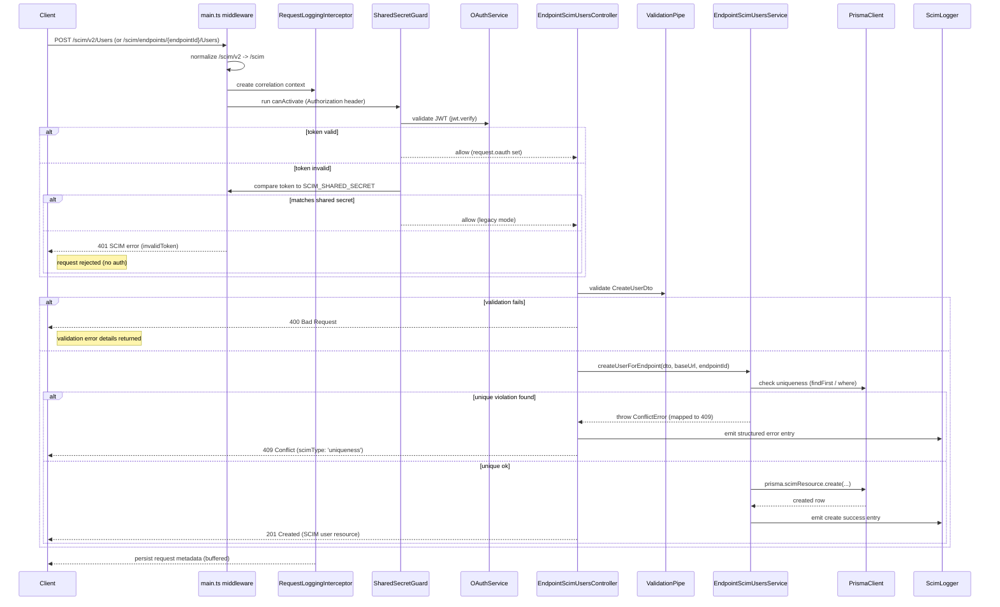
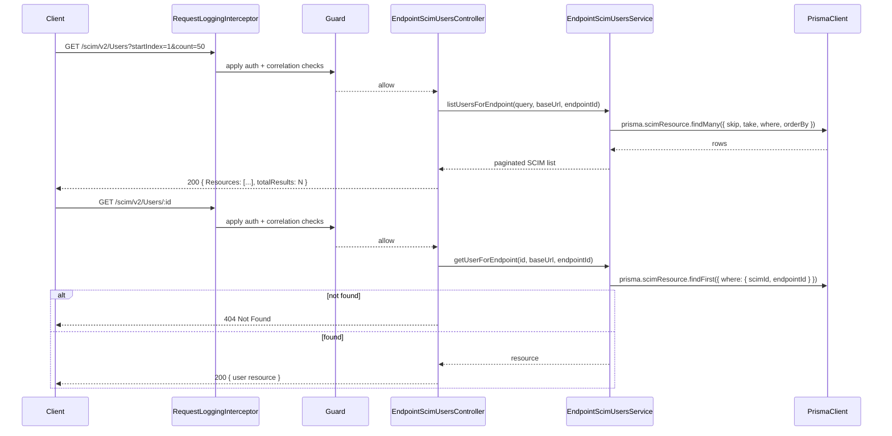

# User API — Annotated Call Trace + Diagrams

> Updated: March 1, 2026 · Flow reflects current RequestLoggingInterceptor + ScimLogger behavior

This document contains a concrete example payload for `POST /scim/v2/Users`, an end-to-end annotated call trace mapping to controller/service/Prisma actions and the expected DB rows and request log entry. It also includes additional Mermaid diagrams showing create, list, and get flows including database interactions.

---

## 1) Example: Create User (HTTP request)

Request (curl):

```sh
curl -X POST 'https://<API_BASE>/scim/v2/Users' \
  -H 'Content-Type: application/scim+json' \
  -H 'Authorization: Bearer <JWT_OR_SHARED_SECRET>' \
  -d '{
    "schemas":["urn:ietf:params:scim:schemas:core:2.0:User"],
    "userName":"alice@example.com",
    "externalId":"7b39e58e-0000-4000-8000-000000000001",
    "displayName":"Alice Example",
    "name": { "givenName":"Alice", "familyName":"Example" },
    "emails": [{ "value":"alice@example.com", "type":"work", "primary":true }]
  }'
```

Notes:
- `Content-Type` should be `application/scim+json` (controllers set appropriate header).
- `Authorization` must be present; guard validates JWT or shared secret.

---

## 2) Annotated call trace (step-by-step)

1. Client → main middleware (`api/src/main.ts`)
  - Path normalized: `/scim/v2/Users` → `/scim/Users`.
   - JSON body parsed with SCIM media type support.

2. Global guard runs: `SharedSecretGuard` (`api/src/modules/auth/shared-secret.guard.ts`)
   - Reads `Authorization: Bearer <token>` header.
   - Attempt JWT validation via `OAuthService.validateAccessToken()` (if token != shared secret):
     - If valid, `request.oauth` is populated with token payload (e.g., `{ client_id: 'scimserver-client', scope: 'scim.manage' }`).
   - If JWT invalid, compare token to `SCIM_SHARED_SECRET` (env); allow if matches.
   - On failure: respond 401 with SCIM error JSON and `WWW-Authenticate: Bearer realm="SCIM"`.

3. Controller: `EndpointScimUsersController.createUser` (`api/src/modules/scim/controllers/endpoint-scim-users.controller.ts`)
   - `CreateUserDto` validation via global `ValidationPipe`.
   - `buildBaseUrl(request)` called to compute resource `location` for `meta.location`.
   - Resolves `endpointId` from URL param, calls `EndpointScimUsersService.createUserForEndpoint(dto, baseUrl, endpointId)`.

4. Service: `EndpointScimUsersService.createUserForEndpoint` (`api/src/modules/scim/services/endpoint-scim-users.service.ts`)
   - Normalises attributes, derives `scimId` if not provided, prepares `payload` (JSONB) and `meta` JSON.
   - Uniqueness checks using Prisma:
     - `prisma.scimResource.findFirst({ where: { userName } })` or `findFirst` for `externalId`.
     - If a conflict found, throw an error translated to HTTP 409 with SCIM `scimType: "uniqueness"`.
   - If unique, create user with Prisma:
     - `prisma.scimResource.create({ data: { scimId, externalId, userName, active, payload, ... } })`
   - After create, may write to `RequestLog` via `LoggingService`.

5. Persistence (Prisma / PostgreSQL)
   - `ScimResource` row inserted into PostgreSQL database (via Prisma ORM, or in-memory store for dev/test).

6. Controller returns SCIM user resource (201 Created) to client.

---

## 3) Concrete expected DB row (Prisma model -> example values)

Prisma model excerpt (see `api/prisma/schema.prisma`):

```prisma
model ScimResource {
  id            String   @id @default(uuid()) @db.Uuid
  endpointId    String   @db.Uuid
  resourceType  String
  scimId        String   @db.Uuid
  externalId    String?  @db.Text
  userName      String?  @db.Citext
  displayName   String?  @db.Citext
  active        Boolean  @default(true)
  payload       Json     @db.JsonB
  version       Int      @default(1)
  deletedAt     DateTime? @db.Timestamptz
  createdAt     DateTime @default(now())
  updatedAt     DateTime @updatedAt
  endpoint      Endpoint @relation(fields: [endpointId], references: [id], onDelete: Cascade)
}
```

Example inserted row (JSON representation):

```json
{
  "id": "a1b2c3d4-...",
  "endpointId": "e5f6a7b8-...",
  "resourceType": "User",
  "scimId": "b2c3d4e5-...",
  "externalId": "7b39e58e-0000-4000-8000-000000000001",
  "userName": "alice@example.com",
  "displayName": "Alice Smith",
  "active": true,
  "payload": { "schemas": ["urn:ietf:params:scim:schemas:core:2.0:User"], "userName": "alice@example.com", "name": { "givenName": "Alice", "familyName": "Smith" } },
  "version": 1,
  "deletedAt": null,
  "createdAt": "2026-02-18T12:34:56.000Z",
  "updatedAt": "2026-02-18T12:34:56.000Z"
}
```

Notes:
- `payload` is a JSONB column containing the full SCIM resource attributes (used for response building and extension data).
- `userName` and `displayName` are CITEXT columns for case-insensitive uniqueness.
- `version` is a monotonic integer used for ETag generation (`W/"1"`, `W/"2"`, etc.).
- `id` is a UUID generated by PostgreSQL.

---

## 4) Expected RequestLog row (what `LoggingService` stores)

Prisma `RequestLog` model stores captured request/response for UI debugging. Example row:

```json
{
  "id": "cgj9x1a...",
  "method": "POST",
  "url": "/scim/v2/Users",
  "status": 201,
  "durationMs": 75,
  "requestHeaders": "{\"content-type\":\"application/scim+json\",\"authorization\":\"Bearer ***\"}",
  "requestBody": "{\"userName\":\"alice@example.com\",...}",
  "responseHeaders": "{\"content-type\":\"application/scim+json\"}",
  "responseBody": "{\"schemas\":[...],\"id\":\"cjld2cj...\",...}",
  "errorMessage": null,
  "identifier": "alice@example.com",
  "createdAt": "2026-02-18T12:34:56.000Z"
}
```

---

## 5) Mermaid diagrams

### Create user — sequence (success & uniqueness collision)


```mermaid
sequenceDiagram
  participant Client
  participant WebServer as main.ts middleware
  participant ReqLog as RequestLoggingInterceptor
  participant Guard as SharedSecretGuard
  participant OAuthSvc as OAuthService
  participant Controller as EndpointScimUsersController
  participant Validator as ValidationPipe
  participant Service as EndpointScimUsersService
  participant PrismaClient
  participant ScimLogger

  Client->>WebServer: POST /scim/v2/Users (or /scim/endpoints/{endpointId}/Users)
  WebServer->>WebServer: normalize /scim/v2 -> /scim
  WebServer->>ReqLog: create correlation context
  WebServer->>Guard: run canActivate (Authorization header)
  Guard->>OAuthSvc: validate JWT (jwt.verify)
  alt token valid
    Guard-->>Controller: allow (request.oauth set)
  else token invalid
    Guard->>WebServer: compare token to SCIM_SHARED_SECRET
    alt matches shared secret
      Guard-->>Controller: allow (legacy mode)
    else
      WebServer-->>Client: 401 SCIM error (invalidToken)
      Note right of Client: request rejected (no auth)
    end
  end
  Controller->>Validator: validate CreateUserDto
  alt validation fails
    Controller-->>Client: 400 Bad Request
    Note right of Client: validation error details returned
  else
    Controller->>Service: createUserForEndpoint(dto, baseUrl, endpointId)
    Service->>PrismaClient: check uniqueness (findFirst / where)
    alt unique violation found
      Service-->>Controller: throw ConflictError (mapped to 409)
      Controller->>ScimLogger: emit structured error entry
      Controller-->>Client: 409 Conflict (scimType: 'uniqueness')
    else unique ok
      Service->>PrismaClient: prisma.scimResource.create(...)
      PrismaClient-->>Service: created row
      Service->>ScimLogger: emit create success entry
      Controller-->>Client: 201 Created (SCIM user resource)
    end
  end
  ReqLog-->>Client: persist request metadata (buffered)
```

### List & Get user — sequence


```mermaid
sequenceDiagram
  participant Client
  participant ReqLog as RequestLoggingInterceptor
  participant Guard
  participant Controller as EndpointScimUsersController
  participant Service as EndpointScimUsersService
  participant PrismaClient

  Client->>ReqLog: GET /scim/v2/Users?startIndex=1&count=50
  ReqLog->>Guard: apply auth + correlation checks
  Guard-->>Controller: allow
  Controller->>Service: listUsersForEndpoint(query, baseUrl, endpointId)
  Service->>PrismaClient: prisma.scimResource.findMany({ skip, take, where, orderBy })
  PrismaClient-->>Service: rows
  Service-->>Controller: paginated SCIM list
  Controller-->>Client: 200 { Resources: [...], totalResults: N }

  Client->>ReqLog: GET /scim/v2/Users/:id
  ReqLog->>Guard: apply auth + correlation checks
  Guard-->>Controller: allow
  Controller->>Service: getUserForEndpoint(id, baseUrl, endpointId)
  Service->>PrismaClient: prisma.scimResource.findFirst({ where: { scimId, endpointId } })
  alt not found
    Controller-->>Client: 404 Not Found
  else found
    Service-->>Controller: resource
    Controller-->>Client: 200 { user resource }
  end
```

---

## 6) How to reproduce locally (quick)

1. Start backend (development):

```pwsh
cd api
npm ci
npm run start:dev
```

2. Use `curl` (example above) to issue `POST /scim/v2/Users` with an `Authorization` header:
   - Use `SCIM_SHARED_SECRET` value printed/generated by setup, or obtain a JWT via `POST /oauth/token` (client_credentials).

3. Inspect the database. For PostgreSQL use `npx prisma studio` or `psql` to inspect rows. For in-memory mode, use the admin API endpoints (`GET /scim/admin/database/users`).

---
