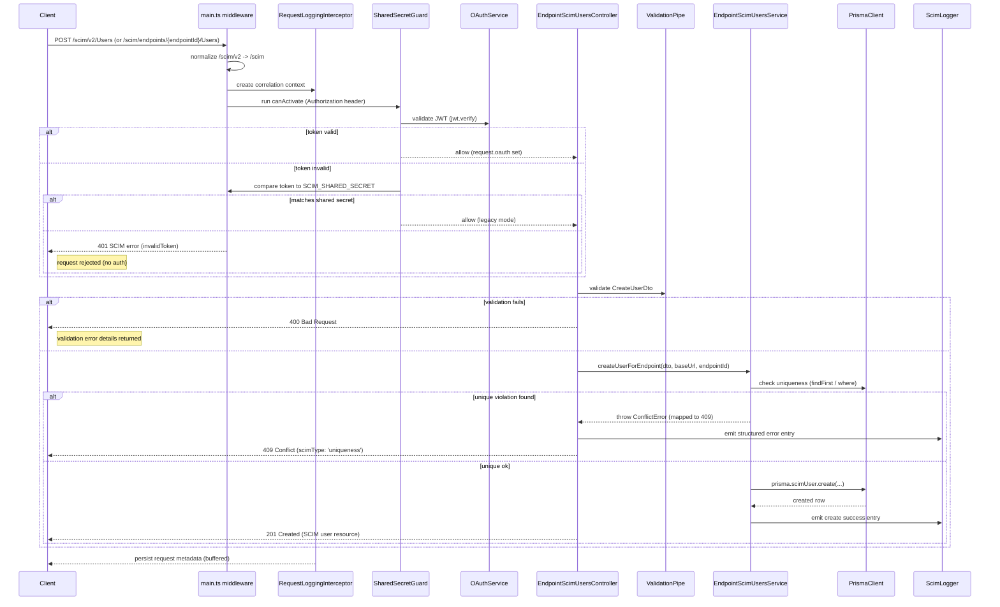
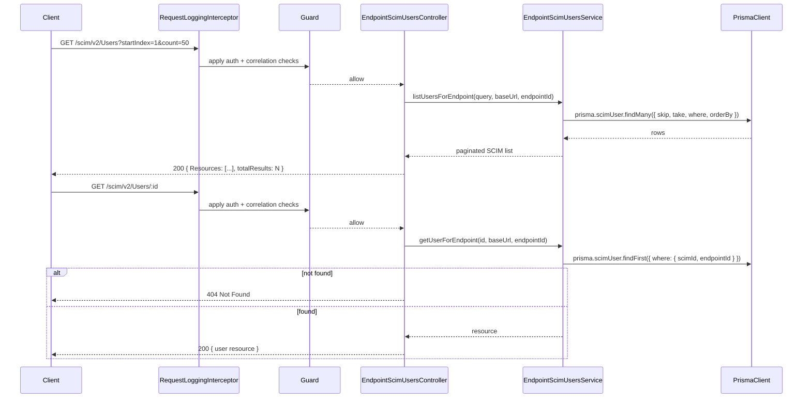

# User API — Annotated Call Trace + Diagrams

> Version baseline: v0.10.0 · Updated: February 18, 2026 · Flow reflects current RequestLoggingInterceptor + ScimLogger behavior

This document contains a concrete example payload for `POST /scim/v2/Users`, an end-to-end annotated call trace mapping to controller/service/Prisma actions and the expected DB rows and request log entry. It also includes additional Mermaid diagrams showing create, list, and get flows including database interactions.

---

## 1) Example: Create User (HTTP request)

Request (curl):

```sh
curl -X POST 'https://<API_BASE>/scim/v2/Users' \
  -H 'Content-Type: application/scim+json' \
  -H 'Authorization: Bearer <JWT_OR_SHARED_SECRET>' \
  -d '{
    "schemas":["urn:ietf:params:scim:schemas:core:2.0:User"],
    "userName":"alice@example.com",
    "externalId":"7b39e58e-0000-4000-8000-000000000001",
    "displayName":"Alice Example",
    "name": { "givenName":"Alice", "familyName":"Example" },
    "emails": [{ "value":"alice@example.com", "type":"work", "primary":true }]
  }'
```

Notes:
- `Content-Type` should be `application/scim+json` (controllers set appropriate header).
- `Authorization` must be present; guard validates JWT or shared secret.

---

## 2) Annotated call trace (step-by-step)

1. Client → main middleware (`api/src/main.ts`)
  - Path normalized: `/scim/v2/Users` → `/scim/Users`.
   - JSON body parsed with SCIM media type support.

2. Global guard runs: `SharedSecretGuard` (`api/src/modules/auth/shared-secret.guard.ts`)
   - Reads `Authorization: Bearer <token>` header.
   - Attempt JWT validation via `OAuthService.validateAccessToken()` (if token != shared secret):
     - If valid, `request.oauth` is populated with token payload (e.g., `{ client_id: 'scimserver-client', scope: 'scim.manage' }`).
   - If JWT invalid, compare token to `SCIM_SHARED_SECRET` (env); allow if matches.
   - On failure: respond 401 with SCIM error JSON and `WWW-Authenticate: Bearer realm="SCIM"`.

3. Controller: `EndpointScimUsersController.createUser` (`api/src/modules/scim/controllers/endpoint-scim-users.controller.ts`)
   - `CreateUserDto` validation via global `ValidationPipe`.
   - `buildBaseUrl(request)` called to compute resource `location` for `meta.location`.
   - Resolves `endpointId` from URL param, calls `EndpointScimUsersService.createUserForEndpoint(dto, baseUrl, endpointId)`.

4. Service: `EndpointScimUsersService.createUserForEndpoint` (`api/src/modules/scim/services/endpoint-scim-users.service.ts`)
   - Normalises attributes, derives `scimId` if not provided, prepares `rawPayload` (stringified request body) and `meta` JSON.
   - Uniqueness checks using Prisma:
     - `prisma.scimUser.findUnique({ where: { userName } })` or `findFirst` for `externalId`.
     - If a conflict found, throw an error translated to HTTP 409 with SCIM `scimType: "uniqueness"`.
   - If unique, create user with Prisma:
     - `prisma.scimUser.create({ data: { scimId, externalId, userName, active, rawPayload, meta } })`
   - After create, may write to `RequestLog` via `LoggingService`.

5. Persistence (Prisma / SQLite)
   - `ScimUser` row inserted into SQLite database file (runtime path: `/tmp/local-data/scim.db`).

6. Controller returns SCIM user resource (201 Created) to client.

7. Backup service (out of band) will snapshot DB to Azure Files or blob snapshots on schedule (not in request path).

---

## 3) Concrete expected DB row (Prisma model -> example values)

Prisma model excerpt (see `api/prisma/schema.prisma`):

```prisma
model ScimUser {
  id          String   @id @default(cuid())
  scimId      String   @unique
  externalId  String?  @unique
  userName    String   @unique
  active      Boolean  @default(true)
  rawPayload  String
  meta        String?
  createdAt   DateTime @default(now())
  updatedAt   DateTime @updatedAt
  groups      GroupMember[]
}
```

Example inserted row (JSON representation):

```json
{
  "id": "cjld2cj...",
  "scimId": "user-2026-02-18-0001",
  "externalId": "7b39e58e-0000-4000-8000-000000000001",
  "userName": "alice@example.com",
  "active": true,
  "rawPayload": "{\"schemas\":[\"urn:ietf:params:scim:schemas:core:2.0:User\"],\"userName\":\"alice@example.com\",...}",
  "meta": "{\"location\":\"https://<API_BASE>/scim/v2/Users/cjld2cj...\",\"resourceType\":\"User\"}",
  "createdAt": "2026-02-18T12:34:56.000Z",
  "updatedAt": "2026-02-18T12:34:56.000Z"
}
```

Notes:
- `rawPayload` contains the original request body JSON stringified (used for auditing and reconstitution).
- `meta` is a JSON string with `location`, `created`, etc., as the SCIM `meta` object (controller/service builds this).
- `id` is Prisma `cuid()` value.

---

## 4) Expected RequestLog row (what `LoggingService` stores)

Prisma `RequestLog` model stores captured request/response for UI debugging. Example row:

```json
{
  "id": "cgj9x1a...",
  "method": "POST",
  "url": "/scim/v2/Users",
  "status": 201,
  "durationMs": 75,
  "requestHeaders": "{\"content-type\":\"application/scim+json\",\"authorization\":\"Bearer ***\"}",
  "requestBody": "{\"userName\":\"alice@example.com\",...}",
  "responseHeaders": "{\"content-type\":\"application/scim+json\"}",
  "responseBody": "{\"schemas\":[...],\"id\":\"cjld2cj...\",...}",
  "errorMessage": null,
  "identifier": "alice@example.com",
  "createdAt": "2026-02-18T12:34:56.000Z"
}
```

---

## 5) Mermaid diagrams

### Create user — sequence (success & uniqueness collision)



### List & Get user — sequence



---

## 6) How to reproduce locally (quick)

1. Start backend (development):

```pwsh
cd api
npm ci
npm run start:dev
```

2. Use `curl` (example above) to issue `POST /scim/v2/Users` with an `Authorization` header:
   - Use `SCIM_SHARED_SECRET` value printed/generated by setup, or obtain a JWT via `POST /oauth/token` (client_credentials).

3. Inspect SQLite DB file (runtime path `/tmp/local-data/scim.db` when running in container). For local dev the `DATABASE_URL` may point to `file:./dev.db` depending on environment. Use `npx prisma studio` or `sqlite3` to inspect rows.

---
