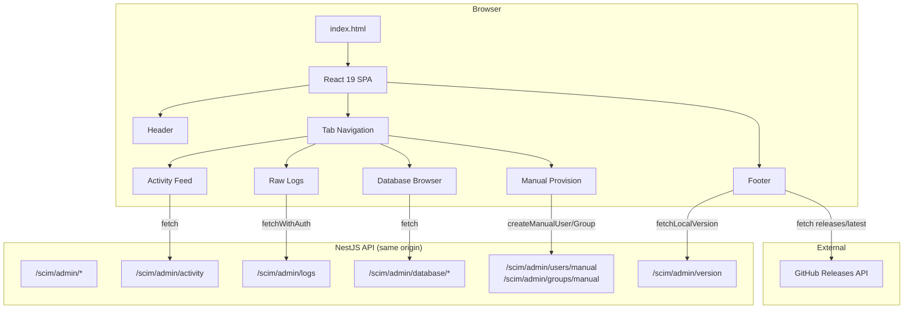
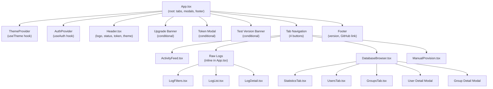
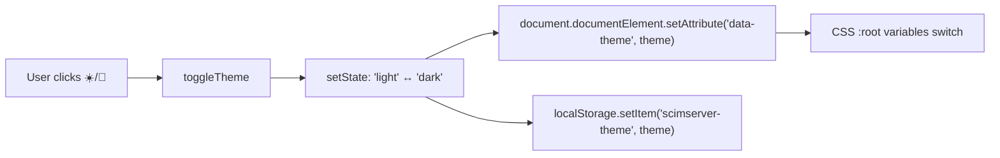
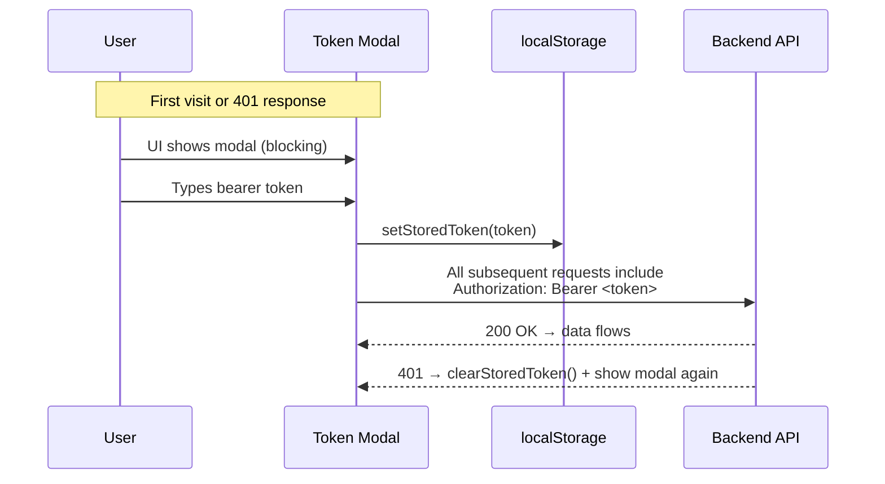
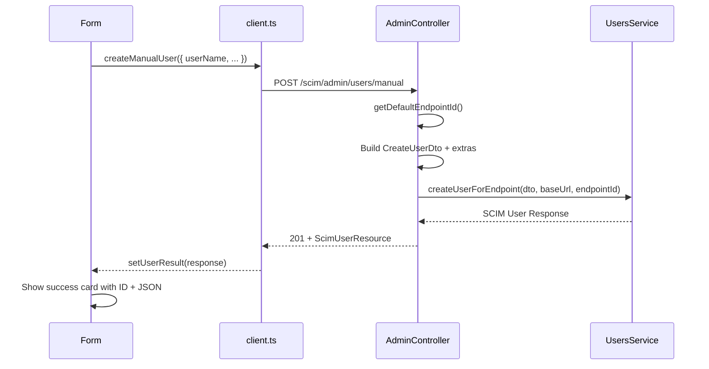
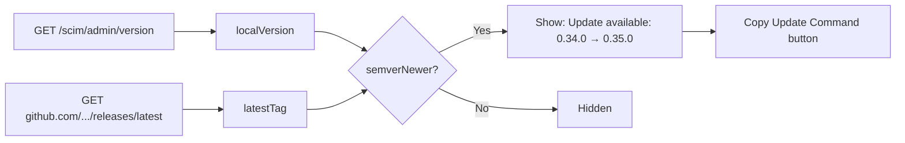

# Web UI Flows, Paths & Behaviors

> **Version:** 1.0 · **Source-verified against:** v0.35.0 · **Created:** April 14, 2026  
> Every statement references the actual source file — nothing is assumed.

---

## Table of Contents

1. [Architecture Overview](#1-architecture-overview)
2. [Technology Stack](#2-technology-stack)
3. [Component Tree](#3-component-tree)
4. [Theme System](#4-theme-system)
5. [Authentication Flow](#5-authentication-flow)
6. [Screen 1 — Header Bar](#6-screen-1--header-bar)
7. [Screen 2 — Activity Feed](#7-screen-2--activity-feed)
8. [Screen 3 — Raw Logs](#8-screen-3--raw-logs)
9. [Screen 4 — Database Browser](#9-screen-4--database-browser)
10. [Screen 5 — Manual Provision](#10-screen-5--manual-provision)
11. [Screen 6 — Footer & Upgrade Banner](#11-screen-6--footer--upgrade-banner)
12. [Data Source Matrix](#12-data-source-matrix)
13. [API Endpoints Used by UI](#13-api-endpoints-used-by-ui)
14. [State Management](#14-state-management)
15. [Auto-Refresh & Polling](#15-auto-refresh--polling)
16. [Responsive Behavior](#16-responsive-behavior)
17. [Keyboard Shortcuts](#17-keyboard-shortcuts)
18. [Test Coverage](#18-test-coverage)
19. [Known Limitations](#19-known-limitations)
20. [Source File Reference](#20-source-file-reference)

---

## 1. Architecture Overview

The SCIMServer web UI is a **single-page React application** embedded directly inside the NestJS API server. It is served as static files from `api/public/` and requires no separate web server.



**Serving model:** The web build output (`web/dist/`) is copied to `api/public/` at build time. NestJS serves `api/public/index.html` for all non-API routes via `ServeStaticModule`. No reverse proxy or separate port needed.

---

## 2. Technology Stack

| Layer | Technology | Version | Purpose |
|-------|-----------|---------|---------|
| Framework | React | 19.x | Component rendering |
| Build | Vite | 7.x | Dev server + production bundler |
| Language | TypeScript | 5.9 | Type safety |
| Styling | CSS Modules | — | Scoped component styles (8 `.module.css` files) |
| Theming | CSS Custom Properties | — | Light/dark via `data-theme` attribute |
| Testing | Vitest + Testing Library | 4.x | Component + utility tests |
| State | React hooks (`useState`, `useContext`) | — | No external state library |
| API | Native `fetch` | — | No Axios/SWR/React Query |

**No charting libraries.** All "visualizations" are plain HTML: number cards, colored badges, tables, and CSS-styled lists.

---

## 3. Component Tree



**Provider wrapping order** (in `App.tsx`):  
`<ThemeProvider>` → `<AuthProvider>` → `<AppContent />`

---

## 4. Theme System

**Mechanism:** CSS custom properties on `:root`, overridden by `[data-theme="dark"]` selector.



| Property Group | Light | Dark |
|---------------|-------|------|
| Background | `#ffffff` → `#faf9f8` | `#1b1a19` → `#252423` |
| Foreground | `#201f1e` → `#8a8886` | `#ffffff` → `#a19f9d` |
| Primary | `#0078d4` | `#0078d4` (same) |
| Success | `#107c10` / bg `#dff6dd` | `#54b054` / bg `#393d1b` |
| Error | `#d13438` / bg `#fde7e9` | `#f85149` / bg `#442426` |
| Font | Segoe UI, system-ui | same |

**Default:** Dark. **Persistence:** `localStorage('scimserver-theme')`.  
**Source:** `web/src/hooks/useTheme.tsx` (42 lines), `web/src/theme.css` (148 lines).

---

## 5. Authentication Flow



**Token storage:** `localStorage` key `scimserver.authToken`  
**Token events:** Custom DOM events `scimserver:token-changed` and `scimserver:token-invalid`  
**Cross-tab sync:** `window.addEventListener('storage', ...)` detects token changes from other tabs  
**Auth wrapper:** `fetchWithAuth()` in `web/src/api/client.ts` — auto-injects header, clears token on 401

**Source:** `web/src/auth/token.ts` (54 lines), `web/src/hooks/useAuth.tsx` (70 lines)

---

## 6. Screen 1 — Header Bar

**Component:** `web/src/components/Header.tsx` (68 lines)  
**Styling:** `web/src/components/Header.module.css` (203 lines)  
**Position:** Sticky top, full width, `z-index: 100`, `backdrop-filter: blur(10px)`

```
┌──────────────────────────────────────────────────────────────────────┐
│  [S] SCIMServer                                        ● Active     │
│      SCIM 2.0 Provisioning Monitor              [Change Token] [🌙] │
└──────────────────────────────────────────────────────────────────────┘
```

| Element | Source | Type |
|---------|--------|------|
| Logo (blue [S] square) | Hardcoded inline SVG | **Static** |
| "SCIMServer" | Hardcoded `<h1>` | **Static** |
| "SCIM 2.0 Provisioning Monitor" | Hardcoded `<p>` | **Static** |
| Green dot + "Active" | Hardcoded CSS animation + text | **Static** — always shows green regardless of server health |
| "Token required" | Shown when `tokenConfigured === false` | **Dynamic** (client state from `useAuth`) |
| "Set Token" / "Change Token" | Toggles on `tokenConfigured` prop | **Dynamic** |
| Theme toggle (☀️/🌙) | Reads `useTheme().theme` | **Dynamic** (client state from localStorage) |

---

## 7. Screen 2 — Activity Feed

**Component:** `web/src/components/activity/ActivityFeed.tsx` (597 lines)  
**Styling:** `web/src/components/activity/ActivityFeed.module.css` (551 lines)  
**Default tab.** Renders immediately after login.

### Layout

```
┌─────────────────────────────────────────────────────────────────────┐
│  📈 Activity Feed  [badge]                                          │
│  Human-readable view of SCIM provisioning activities               │
│                                                                     │
│  ┌──────────┐  ┌──────────┐  ┌──────────┐  ┌──────────┐           │
│  │ Last 24h  │  │ Last 7d   │  │ User Ops  │  │Group Ops  │          │
│  │   {n}     │  │   {n}     │  │   {n}     │  │   {n}     │          │
│  └──────────┘  └──────────┘  └──────────┘  └──────────┘           │
│                                                                     │
│  🔍 Search...   [Type ▾]  [Severity ▾]  ☑ Auto-refresh  ☑ Hide KA │
│                                                                     │
│  ┌ green ─────────────────────────────────────────────────────────┐ │
│  │ 👤  User created: jdoe@example.com          2h ago  USER      │ │
│  ├ red   ─────────────────────────────────────────────────────────┤ │
│  │ ❌  Failed to get user: abc-123    HTTP 404  3h ago  USER      │ │
│  ├ blue  ─────────────────────────────────────────────────────────┤ │
│  │ 🏢  Group created: Engineering              5h ago  GROUP     │ │
│  └────────────────────────────────────────────────────────────────┘ │
│                                                                     │
│  Showing 1 to 50 of 6479    ◀ Prev   Page 1 / 130   Next ▶        │
└─────────────────────────────────────────────────────────────────────┘
```

### Data Sources

| Element | API Endpoint | Backend Method | DB Table | Freshness |
|---------|-------------|----------------|----------|-----------|
| Summary cards (4) | `GET /scim/admin/activity/summary` | `ActivityController.getActivitySummary()` | `requestLog` (counts with date filters + keepalive exclusion) | Refreshed on mount + every 10s when auto-refresh ON |
| Activity list | `GET /scim/admin/activity?page=&limit=&type=&severity=&search=&hideKeepalive=` | `ActivityController.getActivities()` → `ActivityParserService.parseActivity()` | `requestLog` (full rows parsed into human-readable summaries) | Refreshed on mount + every 10s (silent) |
| Pagination | Same response `.pagination` | Computed from `count()` result | — | Same as above |

### Activity Item Fields

| Field | Source in DB | Transformation |
|-------|-------------|----------------|
| `icon` | `method` + `status` | Emoji mapping (👤=user create, ✏️=patch, 🗑️=delete, ❌=error, 👁️=get, 🏢=group, ➕=member add) |
| `message` | `method` + `url` + `responseBody` | Human-readable string built by `ActivityParserService` |
| `details` | `requestBody` + `responseBody` | Extracted user attributes (email, department, active status) |
| `addedMembers` / `removedMembers` | PATCH `requestBody.Operations[].value` | Parsed member IDs from PATCH ops |
| `timestamp` | `requestLog.createdAt` | Relative time formatting (Xm/Xh/Xd ago) |
| `type` | URL pattern matching | `'user'`=has `/Users`, `'group'`=has `/Groups`, `'system'`=other |
| `severity` | `status` code | `'success'`=2xx, `'info'`=GET, `'warning'`=4xx non-error, `'error'`=4xx+5xx |

### Behaviors

| Behavior | Trigger | Detail |
|----------|---------|--------|
| **Auto-refresh** | Checkbox ON (default) | Polls every 10 seconds silently (no loading spinner) |
| **New activity badge** | Silent refresh detects new `id` | Red badge on heading with count, persists via `localStorage('scimserver-last-activity-id')` |
| **Badge dismiss** | Click the badge OR tab focus after 3s | Clears count, resets favicon |
| **Dynamic favicon** | New activity count > 0 | Canvas-drawn blue "S" circle + red notification badge with count |
| **Tab title** | New activity count > 0 | `(N) SCIMServer - SCIM 2.0 Provisioning Monitor` |
| **Type filter** | Select dropdown | Client-side filter applied after server fetch |
| **Severity filter** | Select dropdown | Client-side filter applied after server fetch |
| **Search** | Text input | Sent to server as `?search=` param (searches URL, identifier, request/response bodies) |
| **Hide keepalive** | Checkbox | Sent to server as `?hideKeepalive=true` — backend excludes Entra probe requests before pagination |
| **Pagination** | Prev/Next buttons | Server-side: changes `?page=` param |
| **Empty state** | No results | Shows 📭 icon + "No activities found" |

---

## 8. Screen 3 — Raw Logs

**Component:** Inline in `web/src/App.tsx` (lines 608–657)  
**Sub-components:** `LogFilters.tsx` (52 lines), `LogList.tsx` (123 lines), `LogDetail.tsx` (213 lines)

### Layout

```
┌─────────────────────────────────────────────────────────────────────┐
│  Inspect raw SCIM traffic captured by the troubleshooting endpoint. │
│                                                                     │
│  [Method ▾] [Status] [Errors? ▾] [URL contains]                   │
│  [Search]   [Since ____]  [Until ____]                [Reset]      │
│  [Refresh] ☑Auto-refresh ☑Hide keepalive [Clear Logs]             │
│  Total 12430 • Page 1 / 249                     ◀ Prev  Next ▶     │
│                                                                     │
│  ┌──────┬────────┬────────┬──────────┬───────────┬─────────────────┤
│  │ Time │ Method │ Status │ Duration │Identifier │ URL             │
│  ├──────┼────────┼────────┼──────────┼───────────┼─────────────────┤
│  │10:51 │ POST   │  201   │  45ms    │ jdoe@...  │ /Users          │
│  │10:50 │ GET    │  200   │  12ms    │ —         │ /Users?filter=..│
│  └──────┴────────┴────────┴──────────┴───────────┴─────────────────┘
│                                                                     │
│  ┌─── Log Detail Modal (click any row) ───────────────────────────┐ │
│  │  POST 201   /scim/endpoints/abc/Users   45ms   2026-04-13     │ │
│  │  ▸ Request Headers  [Copy]                                     │ │
│  │  ▸ Response Headers [Copy]                                     │ │
│  │  ▸ Request Body     [Copy] [Download]                          │ │
│  │  ▸ Response Body    [Copy]                                     │ │
│  └────────────────────────────────────────────────────────────────┘ │
└─────────────────────────────────────────────────────────────────────┘
```

### Data Sources

| Element | API Endpoint | Backend Method | DB Table | Freshness |
|---------|-------------|----------------|----------|-----------|
| Log list | `GET /scim/admin/logs?page=&method=&status=&hasError=&urlContains=&search=&since=&until=&hideKeepalive=` | `AdminController.listLogs()` → `LoggingService.listLogs()` | `requestLog` | On mount + on filter change + auto-refresh 10s |
| Log detail | `GET /scim/admin/logs/:id` | `AdminController.getLog()` → `LoggingService.getLog()` | `requestLog` | On row click (fetches full record with headers/bodies) |
| Clear logs | `POST /scim/admin/logs/clear` | `AdminController.clearLogs()` | `requestLog` (truncate) | User-triggered |
| Pagination | Response `.total`, `.page`, `.pageSize`, `.hasNext`, `.hasPrev` | Computed in `LoggingService` | — | Same as log list |

### Log Detail Fields

| Field | Source | Display |
|-------|--------|---------|
| Method | `requestLog.method` | Color-coded badge (GET=blue, POST=green, PUT=purple, PATCH=teal, DELETE=red) |
| Status | `requestLog.status` | Color-coded badge (2xx=green, 4xx=orange, 5xx=red) |
| Duration | `requestLog.durationMs` | `{N}ms` text |
| Timestamp | `requestLog.createdAt` | ISO string |
| Identifier | `requestLog.identifier` | userName or SCIM ID |
| URL | `requestLog.url` | Full path |
| Request Headers | `requestLog.requestHeaders` (JSONB) | Collapsible `<details>` with formatted JSON + Copy button |
| Response Headers | `requestLog.responseHeaders` (JSONB) | Same |
| Request Body | `requestLog.requestBody` (JSONB) | Same + Download button |
| Response Body | `requestLog.responseBody` (JSONB) | Same |
| Error | `requestLog.errorMessage` | Red text when present |

### Behaviors

| Behavior | Detail |
|----------|--------|
| **Row click** | Fetches full log detail (headers + bodies not included in list response), opens modal overlay |
| **Escape key** | Closes detail modal |
| **Overlay click** | Closes detail modal |
| **Copy button** | `navigator.clipboard.writeText()` with 2s "Copied!" feedback |
| **Download button** | Creates blob URL for request body JSON |
| **Auto-refresh** | When checked, polls every 10s (skips if loading or detail modal open) |
| **Filter debounce** | 350ms debounce on filter input changes before committing API call |
| **Admin log exclusion** | Frontend filters out `/scim/admin/logs` URLs from results (prevents recursive logging) |

---

## 9. Screen 4 — Database Browser

**Component:** `web/src/components/database/DatabaseBrowser.tsx` (476 lines)  
**Sub-components:** `StatisticsTab.tsx` (122 lines), `UsersTab.tsx` (161 lines), `GroupsTab.tsx` (115 lines)

### Layout

```
┌─────────────────────────────────────────────────────────────────────┐
│  🗄️ Database Browser                                                │
│  Browse and manage SCIM Users, Groups, and view system statistics  │
│                                                                     │
│  [📊 Statistics]    [👥 Users (N)]    [🏢 Groups (N)]               │
│                                                                     │
│  ═══ Statistics Tab ════════════════════════════════════════════════ │
│  ┌──────────────┐  ┌──────────────┐  ┌──────────────┐  ┌────────┐ │
│  │ 👥 Users      │  │ 🏢 Groups    │  │ 📊 Activity   │  │💾 DB   │ │
│  │ Total: 156   │  │ Total: 12    │  │ Total: 4231  │  │Postgre │ │
│  │ Active: 142  │  │              │  │ 24h: 142     │  │SQL     │ │
│  │ Inactive: 14 │  │              │  │              │  │        │ │
│  └──────────────┘  └──────────────┘  └──────────────┘  └────────┘ │
│                                                                     │
│  ═══ Users Tab ════════════════════════════════════════════════════ │
│  🔍 Search users...   [All Users ▾]                                │
│  ┌────────────────────────────────────────────────────────────────┐ │
│  │ User          │ Name    │ Email         │ Status │ Groups │ Created│
│  │ jdoe@ex...    │ J. Doe  │ jdoe@ex...    │ ✅     │ 2       │ 4/6   │
│  └────────────────────────────────────────────────────────────────┘ │
│                                                                     │
│  ═══ Groups Tab ═══════════════════════════════════════════════════ │
│  🔍 Search groups...                                               │
│  ┌────────────────────────────────────────────────────────────────┐ │
│  │ Group Name         │ Members │ Created                          │
│  │ Engineering • abc  │ 5       │ 3/15/2026                        │
│  └────────────────────────────────────────────────────────────────┘ │
└─────────────────────────────────────────────────────────────────────┘
```

### Data Sources

| Element | API Endpoint | Backend Service | DB Table | Source |
|---------|-------------|-----------------|----------|--------|
| Statistics: user counts | `GET /admin/database/statistics` | `DatabaseService.getStatistics()` | `scimResource` (count by `resourceType='User'`) | **Dynamic** |
| Statistics: group count | Same endpoint | Same | `scimResource` (count by `resourceType='Group'`) | **Dynamic** |
| Statistics: request counts | Same endpoint | Same | `requestLog` (count + count where `createdAt >= 24h`) | **Dynamic** |
| Statistics: database type | Same endpoint `.database` | Returns `{ type: 'PostgreSQL', persistenceBackend: 'prisma' }` or `{ type: 'In-Memory', persistenceBackend: 'inmemory' }` | Computed from `PERSISTENCE_BACKEND` env | **Dynamic** |
| Tab counts | Same response | `statistics?.users.total`, `statistics?.groups.total` | — | **Dynamic** |
| Users list | `GET /admin/database/users?page=&limit=&search=&active=` | `DatabaseService.getUsers()` | `scimResource` (findMany + JSONB spread + join for groups) | **Dynamic** |
| Groups list | `GET /admin/database/groups?page=&limit=&search=` | `DatabaseService.getGroups()` | `scimResource` (findMany + `_count` for members) | **Dynamic** |
| User detail modal | Pre-loaded from users list | — | — | From list response (no additional API call) |
| Group detail modal | Pre-loaded from groups list | — | — | From list response |
| Delete user | `POST /admin/users/{id}/delete` | `AdminController.deleteUser()` → searches all endpoints → `UsersService.deleteUserForEndpoint()` | `scimResource` | **Dynamic** — refreshes users + stats after success |

### User Modal Fields

| Field | Source from DB |
|-------|---------------|
| Username | `scimResource.userName` |
| SCIM ID | `scimResource.scimId` |
| External ID | `scimResource.externalId` |
| Status | `scimResource.active` → "✅ Active" / "❌ Inactive" |
| Created / Updated | `scimResource.createdAt` / `updatedAt` |
| Display Name | `scimResource.payload.displayName` (JSONB spread) |
| First / Last Name | `payload.name.givenName` / `payload.name.familyName` |
| Email | `payload.emails[0].value` |
| Groups | `membersAsMember` Prisma relation → `group.displayName` badges |
| Raw JSON | Full user object `JSON.stringify()` |

---

## 10. Screen 5 — Manual Provision

**Component:** `web/src/components/manual/ManualProvision.tsx` (417 lines)  
**Styling:** `web/src/components/manual/ManualProvision.module.css` (290 lines)

### Layout

```
┌─────────────────────────────────────────────────────────────────────┐
│  Manual User Provisioning                                          │
│  Create SCIM users directly to reproduce collisions…               │
│                                                                     │
│  🔑 Understanding SCIM Identifiers                                 │
│  ► How to create collision scenarios                               │
│                                                                     │
│  userName*: [________]  externalId: [________]  displayName: [___] │
│  givenName: [________]  familyName: [________]  email: [_________] │
│  phoneNumber: [______]  department: [________]  ☑ Active           │
│                                        [Create User] [Reset]       │
│                                                                     │
│  ┌─ Success Result ───────────────────────────────────────────────┐ │
│  │  ✅ User created  •  ID: abc-123  •  userName: jdoe@...       │ │
│  │  ► Full JSON Response                                          │ │
│  └────────────────────────────────────────────────────────────────┘ │
│                                                                     │
│  Manual Group Provisioning                                         │
│  displayName*: [________]  SCIM ID: [________]                     │
│  Member IDs: [textarea]                                            │
│                                        [Create Group] [Reset]      │
└─────────────────────────────────────────────────────────────────────┘
```

### Data Flow



| Form → API Field Mapping | Required? |
|--------------------------|-----------|
| `userName` → `payload.userName` | **Yes** (submit disabled without it) |
| `externalId` → `payload.externalId` | No |
| `displayName` → `payload.displayName` + `payload.name.formatted` | No |
| `givenName` → `payload.name.givenName` | No |
| `familyName` → `payload.name.familyName` | No |
| `email` → `payload.emails[0].value` (work, primary) | No |
| `phoneNumber` → `payload.phoneNumbers[0].value` (work) | No |
| `department` → `urn:ietf:params:scim:schemas:extension:enterprise:2.0:User.department` | No |
| `active` → `payload.active` | No (default: true) |

**Endpoint selection:** Uses first available endpoint from `EndpointService.listEndpoints()`. Creates a `default` endpoint if none exist.

---

## 11. Screen 6 — Footer & Upgrade Banner

### Footer

```
┌─────────────────────────────────────────────────────────────────────┐
│  SCIMServer            v0.35.0            GitHub Repository →       │
└─────────────────────────────────────────────────────────────────────┘
```

| Element | Source | Type |
|---------|--------|------|
| "SCIMServer" | Hardcoded | **Static** |
| Version | `GET /scim/admin/version` → `version` field (reads `api/package.json`) | **Dynamic** (live API) |
| GitHub link | `https://github.com/pranems/SCIMServer` hardcoded | **Static** |

### Upgrade Banner (conditional)

Appears when `semverNewer(latestGitHubTag, localVersion)` is true.



**Polling:** GitHub API checked on mount + every 5 minutes.  
**Upgrade command:** Auto-generated PowerShell one-liner using `effectiveDeployment` (resourceGroup, containerApp, registry) from the version API response.

---

## 12. Data Source Matrix

| Data Element | Source Type | Endpoint | Freshness |
|-------------|------------|----------|-----------|
| Activity summary cards | **Live DB** | `GET /admin/activity/summary` | 10s polling |
| Activity list items | **Live DB** (parsed) | `GET /admin/activity` | 10s polling |
| Raw log table | **Live DB** | `GET /admin/logs` | On demand + 10s |
| Raw log detail | **Live DB** | `GET /admin/logs/:id` | On click |
| Statistics counts | **Live DB** | `GET /admin/database/statistics` | On tab switch |
| Database type | **Backend env** | Same endpoint `.database` | On tab switch |
| Users list | **Live DB** | `GET /admin/database/users` | On tab switch + search |
| Groups list | **Live DB** | `GET /admin/database/groups` | On tab switch + search |
| Version | **Package.json** via API | `GET /admin/version` | On auth |
| Upgrade info | **GitHub API** | `GET api.github.com/.../releases/latest` | 5 min polling |
| Theme | **localStorage** | Client-only | Persistent |
| Token | **localStorage** | Client-only | Persistent + cross-tab |
| Filter state | **React state** | Client-only | Session |
| New activity count | **Computed** | Diff of latest IDs | On each silent refresh |

---

## 13. API Endpoints Used by UI

| UI Section | Method | Endpoint | Auth Required |
|-----------|--------|----------|---------------|
| Activity Feed | GET | `/scim/admin/activity` | Bearer token |
| Activity Feed | GET | `/scim/admin/activity/summary` | Bearer token |
| Raw Logs | GET | `/scim/admin/logs` | Bearer token |
| Raw Logs | GET | `/scim/admin/logs/:id` | Bearer token |
| Raw Logs | POST | `/scim/admin/logs/clear` | Bearer token |
| Database Browser | GET | `/scim/admin/database/statistics` | Bearer token |
| Database Browser | GET | `/scim/admin/database/users` | Bearer token |
| Database Browser | GET | `/scim/admin/database/groups` | Bearer token |
| Database Browser | POST | `/scim/admin/users/:id/delete` | Bearer token |
| Manual Provision | POST | `/scim/admin/users/manual` | Bearer token |
| Manual Provision | POST | `/scim/admin/groups/manual` | Bearer token |
| Footer | GET | `/scim/admin/version` | Bearer token |
| Upgrade Banner | GET | `https://api.github.com/repos/pranems/SCIMServer/releases/latest` | None (public) |
| Upgrade Banner | GET | `https://api.github.com/repos/pranems/SCIMServer/tags` | None (fallback) |

---

## 14. State Management

**No external state library.** All state is managed via React hooks.

| State Category | Hook | Persistence |
|---------------|------|-------------|
| Auth token | `useAuth()` context + `useState` | `localStorage('scimserver.authToken')` |
| Theme | `useTheme()` context + `useState` | `localStorage('scimserver-theme')` |
| Current tab | `useState<AppView>('activity')` | None (resets on refresh) |
| Hide keepalive | `useState` + localStorage sync | `localStorage('scimserver-hideKeepalive')` |
| Activity last ID | `useState` + localStorage | `localStorage('scimserver-last-activity-id')` |
| Auto-refresh (activity) | `useState(true)` | None |
| Auto-refresh (logs) | `useState(false)` | None |
| All filter/pagination state | `useState` | None |
| Log detail selection | `useState` | None |
| Modal visibility | `useState(boolean)` | None |

---

## 15. Auto-Refresh & Polling

| Feature | Interval | Default | Condition | Implementation |
|---------|----------|---------|-----------|----------------|
| Activity Feed | 10s | ON | `autoRefresh && token` | `setInterval` in `useEffect`, silent fetch (no loading spinner) |
| Activity Summary | 10s | ON | Same as above | Fetched alongside activity list |
| Raw Logs | 10s | OFF | `auto && token && !loading && !selected` | `setInterval` via `loadRef.current` (uses ref to avoid re-render loop) |
| GitHub releases | 5 min | ON | `token` present | `setInterval` in `useEffect` |
| Header status | None | — | — | Always shows "Active" (hardcoded) |

---

## 16. Responsive Behavior

| Breakpoint | Changes |
|-----------|---------|
| `≤ 768px` | Summary cards → 2-column grid; activity items → stacked column layout; Raw Logs table → horizontal scroll; toolbar controls stack vertically; pagination controls stack |
| `≤ 640px` | Header subtitle hidden; header backup text hidden; title font shrinks; spacing reduced |
| All widths | Modal: `width: min(900px, 95%)`; Page: `max-width: 1200px` centered |

---

## 17. Keyboard Shortcuts

| Key | Context | Action |
|-----|---------|--------|
| `Escape` | Log Detail modal open | Closes modal |
| `Enter` | Token modal form | Submits token |

---

## 18. Test Coverage

| Test File | Component | Tests | Key Verifications |
|-----------|-----------|-------|-------------------|
| `utils/keepalive.test.ts` | `isKeepaliveLog`, `looksLikeKeepaliveFromUrl` | 15 | UUID detection, method check, status check, identifier check |
| `utils/semver.test.ts` | `normalize`, `semverNewer` | 12 | v-prefix strip, major/minor/patch comparison |
| `auth/token.test.ts` | `getStoredToken`, `setStoredToken`, `clearStoredToken` | 6 | Storage key, whitespace trim, clear |
| `hooks/useTheme.test.tsx` | `ThemeProvider`, `useTheme` | 6 | Default dark, toggle, persistence, data-theme |
| `hooks/useAuth.test.tsx` | `AuthProvider`, `useAuth` | 5 | Mount, set, clear, localStorage |
| `components/Header.test.tsx` | `Header` | 10 | Title, status, token button, theme toggle, no backup artifacts |
| `components/LogList.test.tsx` | `LogList` | 8 | Table headers, method/status badges, row click |
| `components/LogDetail.test.tsx` | `LogDetail` | 6 | Null state, fields render, Escape key, collapsible sections |
| `components/LogFilters.test.tsx` | `LogFilters` | 9 | All filter inputs, method select, reset button |
| `database/StatisticsTab.test.tsx` | `StatisticsTab` | 10 | Stat cards, PostgreSQL/In-Memory, ephemeral warning |
| `database/UsersTab.test.tsx` | `UsersTab` | 10 | Search, filter, user rows, pagination, click handler |
| `database/GroupsTab.test.tsx` | `GroupsTab` | 7 | Search, group names, member counts, pagination |
| `manual/ManualProvision.test.tsx` | `ManualProvision` | 12 | Both forms, required fields, disabled state, API mock, reset |

**Total: 13 test files, 116 tests, 0 failures.**

---

## 19. Known Limitations

| # | Item | Detail | Severity |
|---|------|--------|----------|
| 1 | "Active" indicator is static | Always shows green regardless of actual server health | Low |
| 2 | No charting | All metrics are plain number cards — no time-series, pie charts, or histograms | Low |
| 3 | No endpoint management UI | Backend has full CRUD for endpoints, but the UI has no endpoint admin screen | Medium |
| 4 | No SSE live log consumption | Backend has `GET /admin/log-config/stream` (SSE), but the UI doesn't use it | Low |
| 5 | No audit trail viewer | Backend has `GET /admin/log-config/audit`, but no UI | Low |
| 6 | User detail from list data | Modal shows data from the list fetch, not a fresh detail call — could be slightly stale after list load | Low |
| 7 | Keepalive suppressed banner | Code exists but `suppressedCount` is always 0 (dead branch since backend filters) | None — cleanup only |
| 8 | Test version banner | Code exists but `deployment.currentImage` is always undefined from backend | None — by design for non-Docker |
| 9 | `web/package.json` version stale | Shows `0.24.0` but doesn't affect UI (UI reads from API `package.json` which is `0.35.0`) | None |

---

## 20. Source File Reference

| File | Lines | Purpose |
|------|-------|---------|
| `web/src/App.tsx` | 683 | Root component — tabs, modals, footer, version, upgrade banner |
| `web/src/main.tsx` | 5 | React entry point — `createRoot().render(<App />)` |
| `web/src/theme.css` | 148 | CSS custom properties — light/dark themes |
| `web/src/app.module.css` | 468 | Root layout — page, toolbar, modals, footer |
| `web/src/api/client.ts` | 298 | API client — `fetchLogs`, `fetchLocalVersion`, `createManualUser/Group`, `fetchWithAuth` |
| `web/src/auth/token.ts` | 54 | Token storage — localStorage + custom events |
| `web/src/hooks/useAuth.tsx` | 70 | Auth context provider — token state, cross-tab sync |
| `web/src/hooks/useTheme.tsx` | 42 | Theme context provider — dark/light toggle |
| `web/src/utils/keepalive.ts` | 53 | Entra keepalive probe detection |
| `web/src/components/Header.tsx` | 68 | Sticky header — logo, status, token button, theme toggle |
| `web/src/components/LogList.tsx` | 123 | Request log table — method/status badges, row click |
| `web/src/components/LogDetail.tsx` | 213 | Log detail modal — collapsible JSON sections, copy/download |
| `web/src/components/LogFilters.tsx` | 52 | Filter bar — method, status, error, URL, search, date range |
| `web/src/components/activity/ActivityFeed.tsx` | 597 | Activity feed — summary cards, parsed activity list, filters, auto-refresh |
| `web/src/components/database/DatabaseBrowser.tsx` | 476 | Database browser — tab orchestration, modals, delete |
| `web/src/components/database/StatisticsTab.tsx` | 122 | Statistics cards — user/group/activity/database counts |
| `web/src/components/database/UsersTab.tsx` | 161 | Users list — search, filter, pagination, row click |
| `web/src/components/database/GroupsTab.tsx` | 115 | Groups list — search, pagination, row click |
| `web/src/components/manual/ManualProvision.tsx` | 417 | Manual provisioning — user + group forms with result display |
| `web/index.html` | ~45 | HTML shell — meta, fallback section, root div |
