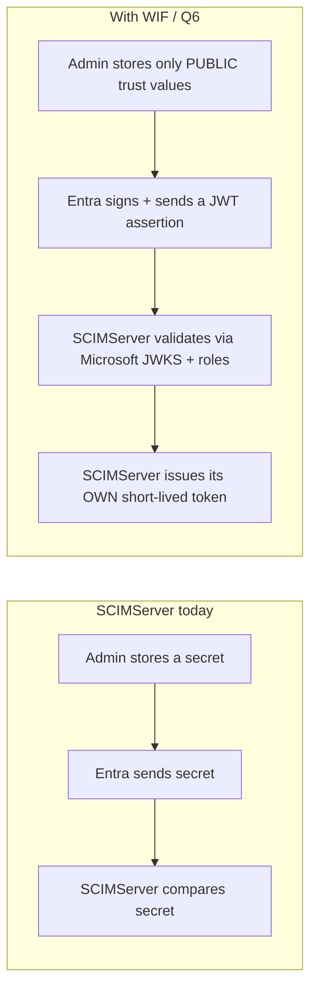
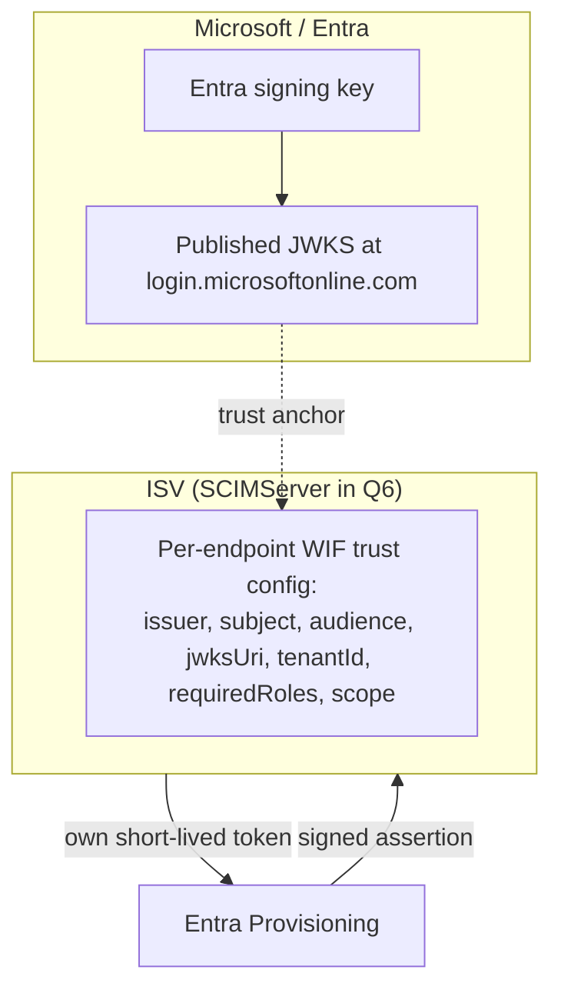
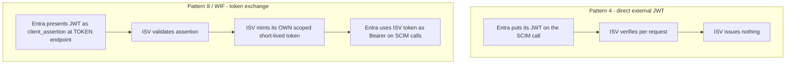
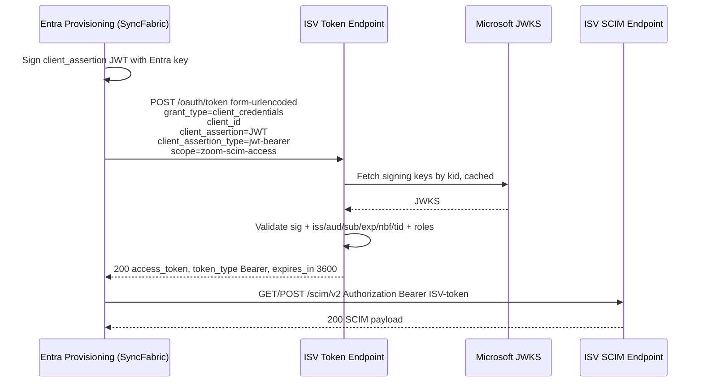
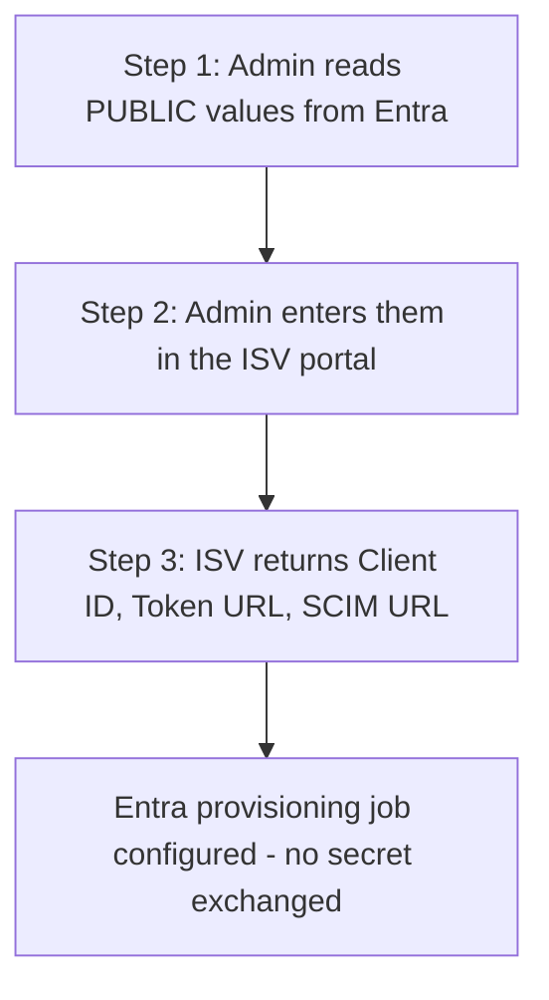
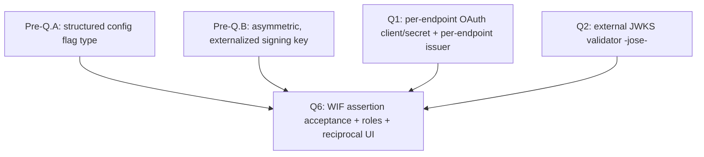
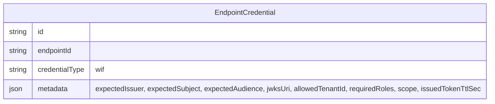
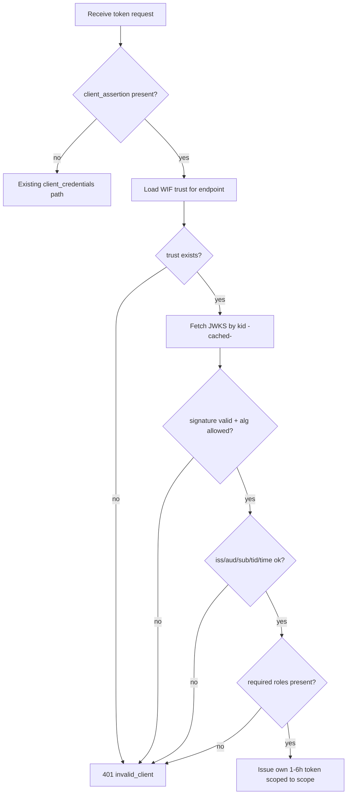
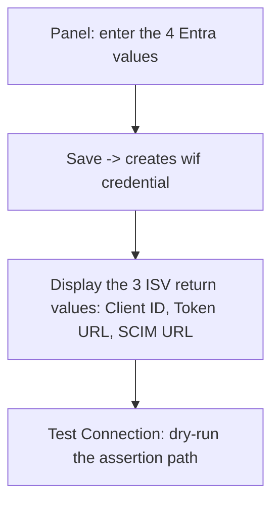

# Workload Identity Federation (WIF) for SCIM - JWT Bearer Assertion Token Exchange

> **Premise:** Microsoft Entra is rolling out **Workload Identity Federation (WIF)** as the credential-free way for its Provisioning Service to authenticate to ISV SCIM endpoints. Instead of the admin copying a long-lived secret from the ISV into Entra, Entra presents a **signed JWT assertion** at the ISV's token endpoint; the ISV validates that assertion against Microsoft's public JWKS plus claims plus app-roles, and then issues its **own** short-lived access token, which Entra uses as a `Bearer` token on the SCIM calls. This document is the deep analysis of that flow and the design for adding it to SCIMServer as **Phase Q6**. It is analysis plus design only - no code has been implemented.

> **Status:** Analysis + design. Dated 2026-06-03. Closes the Pattern 8 gap tracked in [ISV_AUTH_PATTERNS_AND_SCIMSERVER_GAP_PLAN.md](ISV_AUTH_PATTERNS_AND_SCIMSERVER_GAP_PLAN.md).

## Source documents

| Source | Type | Status |
|---|---|---|
| Internal Entra design doc - "Workload Identity Federation between Entra Provisioning (SyncFabric) and SaaS ISVs" | Microsoft-internal (OneDrive) | ACCESSED (content provided directly; the sign-in wall blocked tool-fetch) |
| [AzureAD/SCIMReferenceCode](https://github.com/AzureAD/SCIMReferenceCode) | Public Microsoft reference | Public mirror of the same trust model |
| [Microsoft Learn - SCIM provisioning tutorial](https://learn.microsoft.com/en-us/entra/identity/app-provisioning/use-scim-to-provision-users-and-groups) | Public | Authentication section |

> **Reconciliation note.** Where the internal doc and the public reference differ, the internal doc is treated as authoritative for **Entra's** behavior (issuer, audience format, role enforcement, deprecation timeline) and the public reference is treated as authoritative for the **wire format** an ISV must implement. They agree on the core: this is RFC 7523 client authentication, not RFC 7523 grant-type usage.

## Table of contents

- [0. TL;DR](#0-tldr)
- [1. What WIF is](#1-what-wif-is)
- [2. The wire format](#2-the-wire-format)
- [3. The three-step admin setup](#3-the-three-step-admin-setup)
- [4. The assertion: claims, validation, JWKS](#4-the-assertion-claims-validation-jwks)
- [5. Current SCIMServer state](#5-current-scimserver-state)
- [6. Gap analysis](#6-gap-analysis)
- [7. Phase Q6 recommendation](#7-phase-q6-recommendation)
- [8. Backend design](#8-backend-design)
- [9. UI design](#9-ui-design)
- [10. Security analysis](#10-security-analysis)
- [11. Quality gates and test matrix](#11-quality-gates-and-test-matrix)
- [12. FAQ](#12-faq)
- [13. References](#13-references)

---

## 0. TL;DR

WIF lets Entra authenticate to an ISV SCIM endpoint **without any shared secret**. Entra signs a JWT with its own key; the ISV trusts Microsoft's published JWKS; the ISV swaps that assertion for its own short-lived token at the token endpoint.

**One-sentence gap:** SCIMServer's token endpoint only accepts a plain `client_credentials` grant with a JSON body and one global symmetric secret - it has no `client_assertion` path, no external-JWKS validation, and no per-endpoint federated-trust config, so it cannot be a WIF relying party today.



---

## 1. What WIF is

### 1.0 What is new from the internal doc

| Aspect | Public reference says | Internal doc adds |
|---|---|---|
| Codename | (n/a) | The Entra Provisioning Service is "SyncFabric" internally |
| Deprecation context | (n/a) | Username-password, long-lived bearer, and OAuth Auth Code Grant are being **deprecated**; Client Credentials is currently the **only** method offered to new ISVs; WIF is its credential-free replacement |
| ISV demand | (n/a) | Google, Zoom, and SAP have asked for credential-free onboarding |
| Audience format | `api://<appid>` | `api://{WorkloadIdentity_appid}/.default` |
| Authorization | "validate the token" | The ISV **must** enforce **app roles / permissions** carried in the assertion, not just signature |
| Scope | (optional) | The ISV **defines** the scope string it expects (e.g. `zoom-scim-access`) and returns a token scoped to it |

### 1.1 The problem WIF solves

Secret-based auth (Pattern 5 in the gap plan) means a long-lived `client_secret` lives in two places (Entra and the ISV), must be rotated on a schedule, and is a breach target. WIF removes the secret entirely: trust is established once by exchanging only **public** values, and the cryptographic proof on every token request is a freshly-signed, short-lived JWT.

### 1.2 The federated-trust model



### 1.3 Token exchange vs direct JWT (the key distinction)

WIF is a **token exchange**, not direct JWT bearer usage on the resource.



The Microsoft-signed JWT is a **client-authentication assertion** (RFC 7523 section 2.2). It never rides the SCIM calls. The token that rides the SCIM calls is the ISV's own.

---

## 2. The wire format



**Token request (note `application/x-www-form-urlencoded`, not JSON):**

```http
POST /endpoints/{id}/oauth/token HTTP/1.1
Host: isv.example.com
Content-Type: application/x-www-form-urlencoded

grant_type=client_credentials
&client_id=00000000-0000-0000-0000-000000000000
&client_assertion=eyJhbGciOiJSUzI1NiIsImtpZCI6Ii4uLiJ9.eyJhdWQiOiJhcGk6...
&client_assertion_type=urn%3Aietf%3Aparams%3Aoauth%3Aclient-assertion-type%3Ajwt-bearer
&scope=scimserver-scim-access
```

**Token response:**

```http
HTTP/1.1 200 OK
Content-Type: application/json

{ "access_token": "<ISV-issued JWT>", "token_type": "Bearer", "expires_in": 3600 }
```

**Subsequent SCIM call:**

```http
GET /endpoints/{id}/scim/v2/Users HTTP/1.1
Authorization: Bearer <ISV-issued JWT>
```

> **Precision note.** Entra sends the assertion as form fields, URL-encoded. The `client_assertion_type` value is the literal `urn:ietf:params:oauth:client-assertion-type:jwt-bearer`. An endpoint that reads only JSON bodies (SCIMServer today) will silently see empty fields.

---

## 3. The three-step admin setup



**Step 1 - values copied OUT of Entra (all public):**

| Value | Example |
|---|---|
| Issuer | `https://sts.windows.net/<TenantID>/` |
| Subject | `{WorkloadIdentity_object_id}` |
| Audience | `api://{WorkloadIdentity_appid}/.default` |
| JWKS URL | `https://login.microsoftonline.com/<TenantID>/discovery/v2.0/keys` |

**Step 2 - the ISV stores those four values as a per-endpoint trust record. No secret is created.**

**Step 3 - values returned BY the ISV:**

| Value | Example |
|---|---|
| Client ID | `00000000-0000-0000-0000-000000000000` |
| Token URL | `https://isv.example.com/endpoints/{id}/oauth/token` |
| SCIM URL | `https://isv.example.com/endpoints/{id}/scim/v2` |

---

## 4. The assertion: claims, validation, JWKS

| Claim | Meaning | ISV check |
|---|---|---|
| `aud` | `api://{appid}/.default` | Must equal the configured audience |
| `iss` | `https://sts.windows.net/<TenantID>/` | Must equal the configured issuer |
| `sub` | Workload identity object id | Must equal the configured subject |
| `tid` | Tenant id | Must equal the allowed tenant (isolation) |
| `oid` | Object id of the calling principal | Logged; used for audit |
| `appid` | App id of the caller | Cross-checked against `client_id` |
| `roles` | App roles granted to the workload identity | Must contain every required role |
| `iat` / `nbf` / `exp` | Validity window | Reject outside window (with small clock skew) |

**Example assertion payload (verbatim shape):**

```json
{
  "aud": "api://1f2e3d4c-5b6a-7980-1234-567890abcdef/.default",
  "iss": "https://sts.windows.net/9a8b7c6d-5e4f-3021-abcd-ef1234567890/",
  "sub": "0b1c2d3e-4f50-6172-8394-a5b6c7d8e9f0",
  "tid": "9a8b7c6d-5e4f-3021-abcd-ef1234567890",
  "oid": "0b1c2d3e-4f50-6172-8394-a5b6c7d8e9f0",
  "appid": "1f2e3d4c-5b6a-7980-1234-567890abcdef",
  "roles": ["Scim.Provision"],
  "iat": 1717372800,
  "nbf": 1717372800,
  "exp": 1717376400
}
```

**Five things the ISV must do:**

1. Resolve the signing key by `kid` from the configured JWKS URL (cache by `kid`).
2. Verify the RS256/ES256 signature - **never** accept `alg: none` or an HMAC alg.
3. Validate `iss`, `aud`, `sub`, `tid`, and the time window.
4. Enforce that `roles` contains every required role.
5. Issue its own short-lived token (1-6 h) scoped to the configured `scope`.

**JWKS rotation and outage rules:**

- Cache keys by `kid` with a bounded max-age; refetch on an unknown `kid`.
- On a JWKS fetch failure with no cached key, **fail closed** (reject the assertion). Never fall back to "no signature check".
- Use the tenant-scoped OIDC discovery (`/.well-known/openid-configuration` -> `jwks_uri`) rather than hard-coding the keys URL when possible.

---

## 5. Current SCIMServer state

| Layer | Today | WIF needs |
|---|---|---|
| Auth fallback | [shared-secret.guard.ts](../api/src/modules/auth/shared-secret.guard.ts): per-endpoint bcrypt bearer -> OAuth JWT -> legacy `SCIM_SHARED_SECRET` | A new branch that accepts an ISV-issued token minted by the WIF flow |
| OAuth issuer | [oauth.service.ts](../api/src/oauth/oauth.service.ts): HS256, one global client, process-lifetime random key, 1 h TTL | Per-endpoint issuance after assertion validation; configurable 1-6 h TTL |
| Token endpoint | [oauth.controller.ts](../api/src/oauth/oauth.controller.ts): rejects non-`client_credentials`; reads JSON body via `@Body()` | Accept `client_assertion` + `client_assertion_type`; parse `application/x-www-form-urlencoded` |
| Per-endpoint credential model | [schema.prisma](../api/prisma/schema.prisma) `EndpointCredential` has `credentialType` + `metadata` JSON | A new `wif` `credentialType` storing trust config; **no secret column populated** |
| Config flags | [endpoint-config.interface.ts](../api/src/modules/endpoint/endpoint-config.interface.ts): `boolean | string` only | A `'structured'` flag-type (Pre-Q.A) for the WIF trust object |

---

## 6. Gap analysis

| # | Capability | Status | Closes in |
|---|---|---|---|
| 1 | Accept `client_assertion` at the token endpoint | MISSING | Q6 |
| 2 | Parse `application/x-www-form-urlencoded` token requests | MISSING | Q6 |
| 3 | Validate an external JWT against a remote JWKS | MISSING (Q2 builds the validator) | Q2 -> Q6 |
| 4 | Per-endpoint federated-trust config (no secret) | MISSING | Q6 (needs Pre-Q.A structured flag) |
| 5 | Enforce app `roles` from the assertion | MISSING | Q6 |
| 6 | Issue a per-endpoint short-lived token | PARTIAL (global issuer exists) | Q1 -> Q6 |
| 7 | Tenant isolation via `tid` | MISSING | Q6 |
| 8 | Reciprocal ISV-portal UI (enter 4 values, return 3) | MISSING | Q6 |

---

## 7. Phase Q6 recommendation



| Sub-step | Deliverable |
|---|---|
| Q6.1 | Token endpoint accepts `client_assertion` (form-urlencoded) and routes to the WIF validator |
| Q6.2 | `wif` `credentialType` + structured trust config persisted (no secret) |
| Q6.3 | `WifAssertionValidatorService` (reuses Q2 `jose` JWKS client): signature + claims + roles + tenant isolation |
| Q6.4 | Per-endpoint issuance of a 1-6 h token scoped to the configured `scope` |
| Q6.5 | Reciprocal CredentialsTab UI: "Federated Identity (WIF)" section + Test Connection |

---

## 8. Backend design



**Admin API - register WIF trust (no secret):**

```http
POST /api/endpoints/{id}/credentials
Content-Type: application/json

{
  "credentialType": "wif",
  "wif": {
    "expectedIssuer": "https://sts.windows.net/<TenantID>/",
    "expectedSubject": "{WorkloadIdentity_object_id}",
    "expectedAudience": "api://{WorkloadIdentity_appid}/.default",
    "jwksUri": "https://login.microsoftonline.com/<TenantID>/discovery/v2.0/keys",
    "allowedTenantId": "<TenantID>",
    "requiredRoles": ["Scim.Provision"],
    "scope": "scimserver-scim-access",
    "issuedTokenTtlSec": 3600
  }
}
```

**Token endpoint pseudocode:**

```text
if grant_type == "client_credentials" and client_assertion present:
    trust = loadWifTrust(endpointId)
    if not trust: 401 invalid_client
    assertion = verifyJwt(client_assertion, jwks(trust.jwksUri))   # fail closed on JWKS failure
    require assertion.iss == trust.expectedIssuer
    require assertion.aud == trust.expectedAudience
    require assertion.sub == trust.expectedSubject
    require assertion.tid == trust.allowedTenantId
    require trust.requiredRoles subset of assertion.roles
    return issueOwnToken(endpointId, ttl=trust.issuedTokenTtlSec, scope=trust.scope)
```

**Validation flow:**



> **Guard fall-through note.** The token issued here is the ISV's own JWT, so the existing OAuth-JWT branch in [shared-secret.guard.ts](../api/src/modules/auth/shared-secret.guard.ts) validates it on SCIM calls with no new code, provided the issuer/audience match what the guard expects per endpoint.

---

## 9. UI design

The CredentialsTab gains a "Federated Identity (WIF)" section, gated behind a config flag, that mirrors the three-step setup:



**R9 primitive mapping:**

| Field | Primitive |
|---|---|
| Issuer / Subject / Audience / JWKS URL (editable) | `EditableField` |
| Required roles / scope (editable) | `EditableField` |
| Client ID / Token URL / SCIM URL (read-only, copyable) | `CopyableField` |
| Full trust record (copy as JSON) | `CopyJsonButton` |

- **Gating flag:** a `WifCredentialsEnabled` boolean in the config registry (10-cell completeness per `endpointConfigFlagAudit`).
- **Test Connection UX:** posts a synthetic assertion (or asks the operator to trigger one) and reports each validation step's pass/fail with the specific failing claim.
- **Coverage:** Playwright spec under `web/e2e/` exercising the WIF panel end-to-end; vitest for the panel's rendered structure and primitive presence by `data-testid`.

---

## 10. Security analysis

| Threat | Mitigation |
|---|---|
| Algorithm confusion (`alg: none` / HMAC with public key) | Pin allowed algs to RS256/ES256; reject everything else |
| JWKS SSRF (attacker-controlled `jwksUri`) | Allowlist hosts (Microsoft login domains); validate URL scheme/host before fetch |
| JWKS cache poisoning | Cache by `kid` from a verified response only; bounded max-age; refetch on unknown `kid` |
| Replay of an assertion | Short `exp`; optional `jti` single-use cache; assertions are client-auth only, not resource tokens |
| Token leakage | Issued token is short-lived (1-6 h); never log the assertion or the issued token |
| Cross-tenant access | Enforce `tid` equals the configured `allowedTenantId` |
| Privilege escalation | Enforce `requiredRoles` subset of `roles`; missing role -> 401 |
| Secret leak via response | `wif` credential has no secret; contract test asserts no secret/hash key appears on the response |
| JWKS outage | Fail closed - never skip signature verification |

---

## 11. Quality gates and test matrix

| Layer | WIF additions |
|---|---|
| Pre-Q.A | Structured config flag-type tests (10-cell matrix) |
| Pre-Q.B | Asymmetric, externalized signing key tests |
| Unit (`.service.spec.ts` + `.controller.spec.ts`) | Validator: good assertion, bad sig, wrong iss/aud/sub/tid, expired, missing role, `alg:none` rejected, unknown `kid` refetch, JWKS-down fail-closed |
| E2E (`test/e2e/*.e2e-spec.ts`) | Register `wif` credential -> POST assertion -> receive own token -> use token on SCIM call |
| Live (`scripts/live-test.ps1`) | New section: form-urlencoded assertion exchange across local/Docker/Azure |
| Contract | `expect(ALLOWED_KEYS).toContain(key)` asserts no secret/hash key on the `wif` response |
| OAuth error conformance | RFC 6749 section 5.2: `invalid_client` on bad assertion; `invalid_request` on malformed form body |
| RFC audit | RFC 7521 + RFC 7523 section 2.2 + RFC 7519 + RFC 7517 + RFC 6749 section 5.2 |

---

## 12. FAQ

**Is this RFC 7523 grant-type usage?** No. It is RFC 7523 **section 2.2** (JWT used for **client authentication**), with `grant_type=client_credentials`. The assertion authenticates the client; it is not the grant.

**Does Entra's JWT ride the SCIM calls?** No. It is presented once at the token endpoint. The ISV's own issued token rides the SCIM calls.

**Do we store any secret?** No. WIF stores only public trust values. The contract tests assert no secret leaks on the response.

**How is this different from Pattern 4 (direct external JWT)?** Pattern 4 verifies Entra's JWT on every SCIM request and issues nothing. WIF adds a token-exchange hop and mints the ISV's own token.

**What is the issued token's lifetime?** 1-6 hours per the Entra spec; configurable per endpoint via `issuedTokenTtlSec`.

---

## 13. References

### Primary (internal + reconciled)

- Internal Entra design doc - "Workload Identity Federation between Entra Provisioning (SyncFabric) and SaaS ISVs"

### Microsoft Learn

- [Tutorial: Develop and plan provisioning for a SCIM endpoint](https://learn.microsoft.com/en-us/entra/identity/app-provisioning/use-scim-to-provision-users-and-groups)
- [Tutorial: Develop a sample SCIM endpoint](https://learn.microsoft.com/en-us/entra/identity/app-provisioning/use-scim-to-build-users-and-groups-endpoints)
- [AzureAD/SCIMReferenceCode](https://github.com/AzureAD/SCIMReferenceCode)

### IETF

- **RFC 7521** - Assertion Framework for OAuth 2.0
- **RFC 7523** - JWT Profile for OAuth 2.0 Client Authentication and Authorization Grants (section 2.2 client authentication)
- **RFC 7519** - JSON Web Token (JWT)
- **RFC 7517** - JSON Web Key (JWK)
- **RFC 6749** - The OAuth 2.0 Authorization Framework (section 5.2 error responses)
- **RFC 7644** - SCIM Protocol (section 2 Authentication and Authorization)

### In-repo

- [ISV_AUTH_PATTERNS_AND_SCIMSERVER_GAP_PLAN.md](ISV_AUTH_PATTERNS_AND_SCIMSERVER_GAP_PLAN.md) - the Phase Q plan that schedules Q6
- [G11_PER_ENDPOINT_CREDENTIALS.md](G11_PER_ENDPOINT_CREDENTIALS.md) - the per-endpoint-bearer architecture WIF extends
- [api/src/oauth/oauth.controller.ts](../api/src/oauth/oauth.controller.ts) - the token endpoint to extend
- [api/src/oauth/oauth.service.ts](../api/src/oauth/oauth.service.ts) - the issuer to make per-endpoint
- [api/src/modules/auth/shared-secret.guard.ts](../api/src/modules/auth/shared-secret.guard.ts) - the auth fallback chain
- [api/src/modules/endpoint/endpoint-config.interface.ts](../api/src/modules/endpoint/endpoint-config.interface.ts) - the flag registry (needs `structured` type)
- [web/src/pages/CredentialsTab.tsx](../web/src/pages/CredentialsTab.tsx) - the UI surface for the reciprocal portal

---

This document is analysis + design only; no code has been implemented.
