# Workload Identity Federation (WIF) for SCIM - JWT Bearer Assertion Token Exchange

> **Premise:** Microsoft Entra is rolling out **Workload Identity Federation (WIF)** as the credential-free way for its Provisioning Service to authenticate to ISV SCIM endpoints. Instead of the admin copying a long-lived secret from the ISV into Entra, Entra presents a **signed JWT assertion** at the ISV's token endpoint; the ISV validates that assertion against Microsoft's public JWKS plus claims plus app-roles, and then issues its **own** short-lived access token, which Entra uses as a `Bearer` token on the SCIM calls. This document is the deep analysis of that flow and the design for adding it to SCIMServer as **Phase Q6**. It is analysis plus design only - no code has been implemented.

> **Status:** Analysis + design. Dated 2026-06-03. Closes the Pattern 8 gap tracked in [ISV_AUTH_PATTERNS_AND_SCIMSERVER_GAP_PLAN.md](ISV_AUTH_PATTERNS_AND_SCIMSERVER_GAP_PLAN.md).

## Source documents

| Source | Type | Status |
|---|---|---|
| Internal Entra design doc - "Workload Identity Federation between Entra Provisioning (SyncFabric) and SaaS ISVs" | Microsoft-internal (OneDrive) | ACCESSED (content provided directly; the sign-in wall blocked tool-fetch) |
| [AzureAD/SCIMReferenceCode/ WIF for SCIM Provisioning](https://github.com/AzureAD/SCIMReferenceCode/blob/master/Workload-Identity-Federation-for-SCIM-Provisioning.md) | Public Microsoft reference | Public mirror of the same trust model |
| [Microsoft Learn - SCIM provisioning tutorial](https://learn.microsoft.com/en-us/entra/identity/app-provisioning/use-scim-to-provision-users-and-groups) | Public | Authentication section |

> **Reconciliation note.** Where the internal doc and the public reference differ, the internal doc is treated as authoritative for **Entra's** behavior (issuer, audience format, role enforcement, deprecation timeline) and the public reference is treated as authoritative for the **wire format** an ISV must implement. They agree on the core: this is RFC 7523 client authentication, not RFC 7523 grant-type usage.

> **Stakeholder decisions folded in (2026-06-12).** A design review with the Entra provisioning owner settled three points that update this doc: (1) **Entra v2 tokens are the only supported format** - the issuer/audience values throughout were switched to the v2 shape and section 4.1 is now a DECIDED record, not an open question. (2) **A second assertion profile is coming: RFC 8693 (OAuth Token Exchange)** alongside today's RFC 7523 (JWT bearer assertion); see [section 1.4](#14-two-assertion-profiles-rfc-7523-jwt-bearer-and-rfc-8693-token-exchange). (3) **App-role enforcement is forward-looking** - roles are not currently passed or validated in the assertion; see the upcoming-changes note in [section 4](#4-the-assertion-claims-validation-jwks).

## Table of contents

- [0. TL;DR](#0-tldr)
- [1. What WIF is](#1-what-wif-is)
- [2. The wire format](#2-the-wire-format)
- [3. The three-step admin setup](#3-the-three-step-admin-setup)
- [4. The assertion: claims, validation, JWKS](#4-the-assertion-claims-validation-jwks)
- [5. Current SCIMServer state](#5-current-scimserver-state)
- [6. Gap analysis](#6-gap-analysis)
- [7. Phase Q6 recommendation](#7-phase-q6-recommendation)
- [8. Backend design](#8-backend-design)
- [9. UI design](#9-ui-design)
- [10. Security analysis](#10-security-analysis)
- [11. Quality gates and test matrix](#11-quality-gates-and-test-matrix)
- [12. Error responses and RFC 6749 conformance](#12-error-responses-and-rfc-6749-conformance)
- [13. Step-by-step implementation plan](#13-step-by-step-implementation-plan)
- [14. Effort estimates](#14-effort-estimates)
- [15. FAQ](#15-faq)
- [16. References](#16-references)

---

## 0. TL;DR

WIF lets Entra authenticate to an ISV SCIM endpoint **without any shared secret**. Entra signs a JWT with its own key; the ISV trusts Microsoft's published JWKS; the ISV swaps that assertion for its own short-lived token at the token endpoint.

**One-sentence gap:** SCIMServer's token endpoint only accepts a plain `client_credentials` grant with a JSON body and one global symmetric secret - it has no `client_assertion` path, no external-JWKS validation, and no per-endpoint federated-trust config, so it cannot be a WIF relying party today.

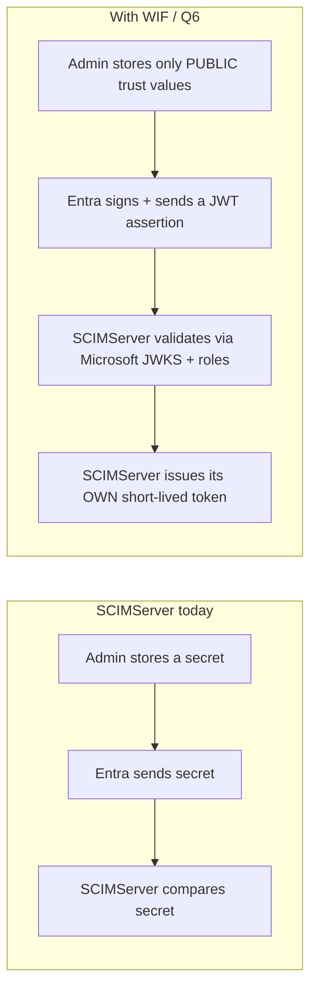

---

## 1. What WIF is

### 1.0 What is new from the internal doc

| Aspect | Public reference says | Internal doc adds |
|---|---|---|
| Codename | (n/a) | The Entra Provisioning Service is "SyncFabric" internally |
| Deprecation context | (n/a) | Username-password, long-lived bearer, and OAuth Auth Code Grant are being **deprecated**; Client Credentials is currently the **only** method offered to new ISVs; WIF is its credential-free replacement |
| ISV demand | (n/a) | Google, Zoom, and SAP have asked for credential-free onboarding |
| Audience format | `api://<appid>` | `api://{WorkloadIdentity_appid}/.default` |
| Authorization | "validate the token" | The ISV **must** enforce **app roles / permissions** carried in the assertion, not just signature (**see the upcoming-changes note in [section 4](#4-the-assertion-claims-validation-jwks): roles are not passed/validated today; this is forward-looking**) |
| Scope | (optional) | The ISV **defines** the scope string it expects (e.g. `zoom-scim-access`) and returns a token scoped to it |

### 1.1 The problem WIF solves

Secret-based auth (Pattern 5 in the gap plan) means a long-lived `client_secret` lives in two places (Entra and the ISV), must be rotated on a schedule, and is a breach target. WIF removes the secret entirely: trust is established once by exchanging only **public** values, and the cryptographic proof on every token request is a freshly-signed, short-lived JWT.

### 1.2 The federated-trust model

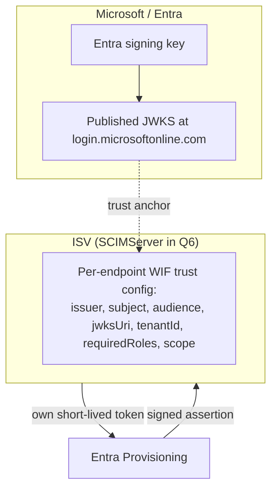

### 1.3 Token exchange vs direct JWT (the key distinction)

WIF is a **token exchange**, not direct JWT bearer usage on the resource.

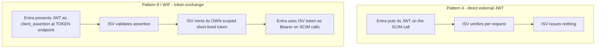

The Microsoft-signed JWT is a **client-authentication assertion** (RFC 7523 section 2.2). It never rides the SCIM calls. The token that rides the SCIM calls is the ISV's own.

### 1.4 Two assertion profiles: RFC 7523 (jwt-bearer) and RFC 8693 (token-exchange)

WIF is not a single wire shape. Entra is rolling out **two OAuth profiles** for presenting its signed JWT at the ISV token endpoint, and an ISV declares which one it supports at onboarding (recorded in app metadata; a marker in the connectivity config tells Entra which profile to use, so Entra auto-selects the matching request shape). They are **different grant types with different request bodies** - not two versions of one call.

| Aspect | **`jwt-bearer`** (RFC 7523 section 2.2) | **`token-exchange`** (RFC 8693) |
|---|---|---|
| Status | **Shipped today** (SAP SuccessFactors is the first ISV) | **Coming** (Google is the example ISV) |
| `grant_type` | `client_credentials` | `urn:ietf:params:oauth:grant-type:token-exchange` |
| Entra's JWT is carried as | `client_assertion` (+ `client_assertion_type=urn:ietf:params:oauth:client-assertion-type:jwt-bearer`) | `subject_token` (+ `subject_token_type=urn:ietf:params:oauth:token-type:jwt`) |
| Role of the JWT | **Client authentication** - proves who the caller is | **The subject being exchanged** - the token traded for a new one |
| Other params | `client_id`, `scope` | `subject_token_type` (REQUIRED), optional `resource` / `audience` / `scope` / `requested_token_type` / `actor_token` |
| Response adds | standard OAuth token response | also `issued_token_type` (REQUIRED) |
| Semantics | client-auth then mint the ISV token | STS-style exchange; supports impersonation (subject only) vs delegation (subject + actor, composite token carries an `act` claim) |

> **Proposed config naming.** The per-endpoint `wif` trust record (section 8) gains an `assertionProfile` discriminator with exactly these two values - **`jwt-bearer`** and **`token-exchange`** - chosen to be the literal URN tails so the config value self-documents and matches the wire. Display names: **"JWT Bearer Assertion (RFC 7523)"** and **"OAuth Token Exchange (RFC 8693)"**. Simultaneous support of both profiles on one endpoint is technically possible but rare in practice; the common case is one profile per endpoint, fixed at onboarding.

> **The two RFCs compose, they do not compete.** RFC 7523 is a *client-authentication method*; RFC 8693 is a *grant type for exchanging tokens*. RFC 8693 even names RFC 7523 as one way a client may authenticate during a token exchange. Both flows still end identically for the SCIM endpoint: a short-lived ISV-issued bearer token rides the SCIM calls.

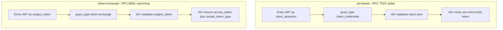

---

## 2. The wire format

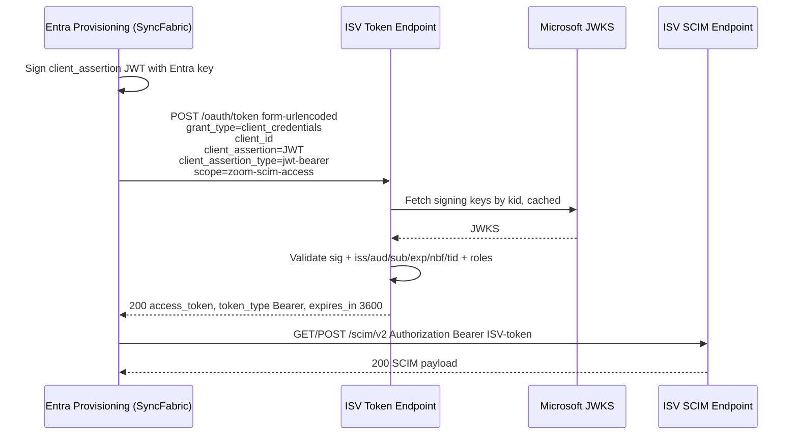

**Token request (note `application/x-www-form-urlencoded`, not JSON):**

```http
POST /endpoints/{id}/oauth/token HTTP/1.1
Host: isv.example.com
Content-Type: application/x-www-form-urlencoded

grant_type=client_credentials
&client_id=00000000-0000-0000-0000-000000000000
&client_assertion=eyJhbGciOiJSUzI1NiIsImtpZCI6Ii4uLiJ9.eyJhdWQiOiJhcGk6...
&client_assertion_type=urn%3Aietf%3Aparams%3Aoauth%3Aclient-assertion-type%3Ajwt-bearer
&scope=scimserver-scim-access
```

**Token response:**

```http
HTTP/1.1 200 OK
Content-Type: application/json

{ "access_token": "<ISV-issued JWT>", "token_type": "Bearer", "expires_in": 3600 }
```

**Subsequent SCIM call:**

```http
GET /endpoints/{id}/scim/v2/Users HTTP/1.1
Authorization: Bearer <ISV-issued JWT>
```

> **Precision note.** Entra sends the assertion as form fields, URL-encoded. The `client_assertion_type` value is the literal `urn:ietf:params:oauth:client-assertion-type:jwt-bearer`. An endpoint that reads only JSON bodies (SCIMServer today) will silently see empty fields.

> **Separable token and SCIM endpoints.** The token endpoint and the SCIM endpoint do **not** have to share a host (or even an operator). The public AzureAD reference's SAP SuccessFactors example posts the assertion to `auth.successfactors.example.com` and then calls SCIM at `scim.successfactors.example.com` - two different hosts. The SCIM endpoint simply validates the incoming `Bearer` token regardless of where it was minted; token-issuance and resource-serving are independent responsibilities. SCIMServer's own per-endpoint token URL and SCIM URL (section 3, Step 3) are co-located by default, but the trust model does not require it - an ISV may front the token exchange in one environment and the SCIM resource in another.

### 2.1 The `token-exchange` variant (RFC 8693, upcoming)

The request above is the **`jwt-bearer`** profile ([section 1.4](#14-two-assertion-profiles-rfc-7523-jwt-bearer-and-rfc-8693-token-exchange)). The upcoming **`token-exchange`** profile carries the same Microsoft-signed JWT, but as the `subject_token` of an RFC 8693 token exchange rather than as a `client_assertion`:

```http
POST /endpoints/{id}/oauth/token HTTP/1.1
Host: isv.example.com
Content-Type: application/x-www-form-urlencoded

grant_type=urn%3Aietf%3Aparams%3Aoauth%3Agrant-type%3Atoken-exchange
&subject_token=eyJhbGciOiJSUzI1NiIsImtpZCI6Ii4uLiJ9.eyJhdWQiOiJhcGk6...
&subject_token_type=urn%3Aietf%3Aparams%3Aoauth%3Atoken-type%3Ajwt
&scope=scimserver-scim-access
```

The response is a normal OAuth token response **plus** the RFC 8693-required `issued_token_type`:

```http
HTTP/1.1 200 OK
Content-Type: application/json

{
  "access_token": "<ISV-issued JWT>",
  "issued_token_type": "urn:ietf:params:oauth:token-type:access_token",
  "token_type": "Bearer",
  "expires_in": 3600
}
```

> **What stays identical.** The JWKS-based signature + `iss`/`aud`/`sub`/`tid`/time-window validation of the Microsoft JWT (section 4) is **the same** for both profiles - only the field name carrying the JWT (`client_assertion` vs `subject_token`) and the `grant_type` differ. The SCIM call that follows is byte-for-byte identical: a `Bearer` token the ISV minted. RFC 8693 also defines `resource`, `audience`, `requested_token_type`, and delegation via `actor_token` (producing a composite token with an `act` claim); none are required for the basic WIF exchange, so they are out of scope until a concrete integration needs them.

---

## 3. The three-step admin setup

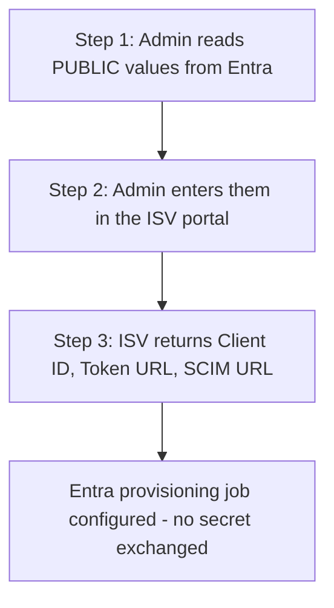

**Step 1 - values copied OUT of Entra (all public):**

| Value | Example |
|---|---|
| Issuer | `https://login.microsoftonline.com/<TenantID>/v2.0` |
| Subject | `{WorkloadIdentity_object_id}` |
| Audience | `api://{WorkloadIdentity_appid}/.default` |
| JWKS URL | `https://login.microsoftonline.com/<TenantID>/discovery/v2.0/keys` |

> **v2 issuer/audience (decided - see [section 4.1](#41-decided---entra-v2-token-format-only-issuer-and-audience)).** The **Issuer** is the Entra **v2.0** value (`login.microsoftonline.com/<TenantID>/v2.0`), validated by **exact string match**. The **Audience** shown here is the admin-facing value the operator copies (the App ID URI plus the `/.default` scope suffix); note that the **`aud` claim in the actual token is `api://{appid}`** - the App ID URI **without** `/.default` (the `/.default` is the requested scope, not the token audience). The ISV validates the token `aud` against `api://{appid}`.

**Step 2 - the ISV stores those four values as a per-endpoint trust record. No secret is created.**

**Step 3 - values returned BY the ISV:**

| Value | Example |
|---|---|
| Client ID | `00000000-0000-0000-0000-000000000000` |
| Token URL | `https://isv.example.com/endpoints/{id}/oauth/token` |
| SCIM URL | `https://isv.example.com/endpoints/{id}/scim/v2` |

---

## 4. The assertion: claims, validation, JWKS

| Claim | Meaning | ISV check |
|---|---|---|
| `aud` | `api://{appid}` (App ID URI, **no** `/.default`) | Must equal the configured audience |
| `iss` | `https://login.microsoftonline.com/<TenantID>/v2.0` | Must equal the configured issuer (**exact string match**) |
| `sub` | Workload identity object id | Must equal the configured subject |
| `tid` | Tenant id | Must equal the allowed tenant (isolation) |
| `oid` | Object id of the calling principal | Logged; used for audit |
| `appid` / `azp` | App id of the caller (`appid` historically; `azp` is the v2 authorized-party claim) | Cross-checked against `client_id` |
| `roles` | App roles granted to the workload identity | Must contain every required role (**not passed/validated today - see the upcoming-changes note below**) |
| `ver` | Token version | Is `2.0`; v1 tokens are not supported |
| `iat` / `nbf` / `exp` | Validity window | Reject outside window (with small clock skew) |

**Example assertion payload (v2, verbatim shape from the public AzureAD reference):**

```json
{
  "aud": "api://b5ba7a93-4452-4522-aeb4-a2b5da870c16",
  "iss": "https://login.microsoftonline.com/ce5f061f-abe6-4e40-9615-301f87bcb7f0/v2.0",
  "iat": 1772175916,
  "nbf": 1772175916,
  "exp": 1772179816,
  "appid": "b5ba7a93-4452-4522-aeb4-a2b5da870c16",
  "appidacr": "2",
  "idp": "https://login.microsoftonline.com/ce5f061f-abe6-4e40-9615-301f87bcb7f0/v2.0",
  "oid": "d2f8ee76-c549-45b8-a143-f5b640669704",
  "sub": "<Sync Fabric Workload Identity 1P app object ID>",
  "tid": "ce5f061f-abe6-4e40-9615-301f87bcb7f0",
  "ver": "2.0"
}
```

> **Note the `aud` shape.** In this real v2 example the `aud` is `api://b5ba7a93-...` - the **App ID URI form** `api://{appid}`, **not** the `/.default` scope form and **not** a bare GUID. The `/.default` the admin copied in Step 1 is the requested scope; the token's audience is the App ID URI. There is also no `roles` claim in the documented example, consistent with the upcoming-changes note below.

**Five things the ISV must do:**

1. Resolve the signing key by `kid` from the configured JWKS URL (cache by `kid`).
2. Verify the RS256/ES256 signature - **never** accept `alg: none` or an HMAC alg.
3. Validate `iss`, `aud`, `sub`, `tid`, and the time window.
4. Enforce that `roles` contains every required role.
5. Issue its own short-lived token (1-6 h) scoped to the configured `scope`.

> **Upcoming-changes note - app roles (2026-06-12 stakeholder review).** Step 4 above is **forward-looking, not current behavior.** Per the Entra provisioning owner, **roles are not currently passed in the assertion and are not validated** during provisioning; the documented v2 example token above carries no `roles` claim. Role enforcement is expected to arrive with a planned "1P app method" change (tentatively a few weeks out). Until that lands and is confirmed with a real role-bearing sample token, treat step 4 as **aspirational**: design the validator so role enforcement can be switched on per endpoint, but do not hard-require a `roles` claim that Entra does not yet send. The signature + `iss`/`aud`/`sub`/`tid` + time-window checks (steps 1-3, 5) are the authoritative current contract.

**JWKS rotation and outage rules:**

- Cache keys by `kid` with a bounded max-age; refetch on an unknown `kid`.
- On a JWKS fetch failure with no cached key, **fail closed** (reject the assertion). Never fall back to "no signature check".
- Use the tenant-scoped OIDC discovery (`/.well-known/openid-configuration` -> `jwks_uri`) rather than hard-coding the keys URL when possible.

**Validation lifecycle (every branch except the final issuance ends at `invalid_client`):**

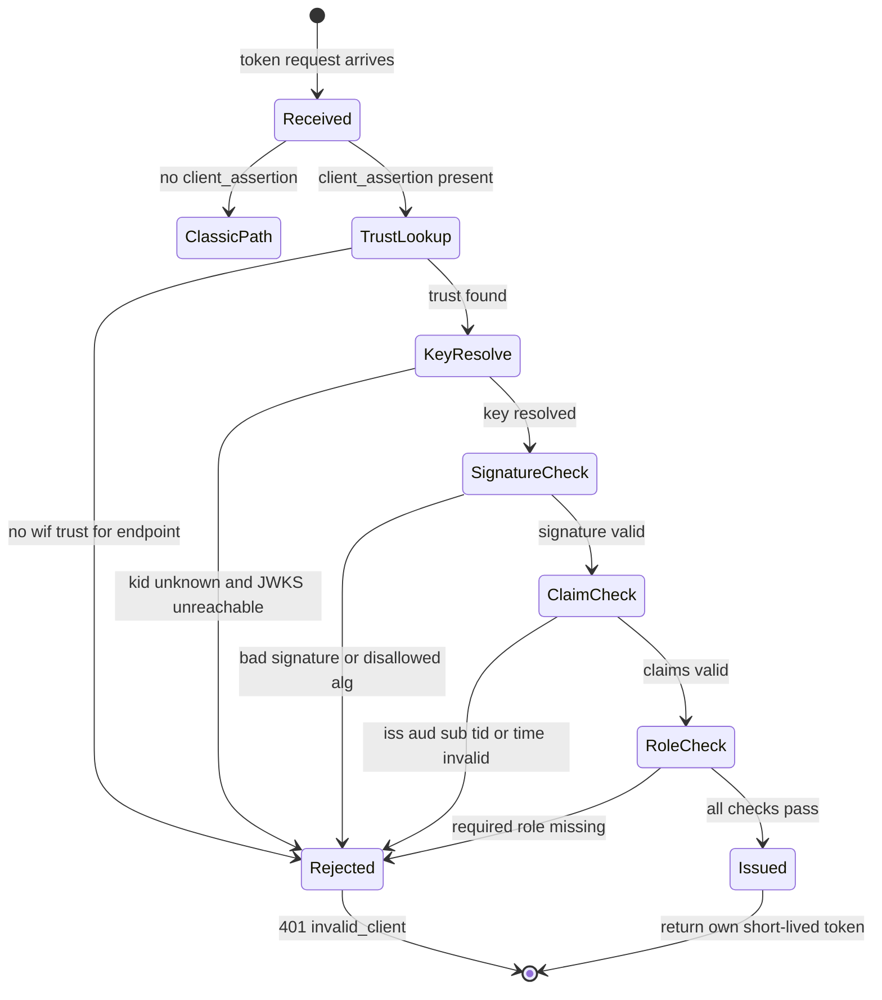

### 4.1 DECIDED - Entra v2 token format only (issuer and audience)

> **Status: DECIDED (2026-06-12 stakeholder review). Entra v2.0 tokens are the only supported format.** Earlier drafts of this doc carried the Entra **v1.0** (`sts.windows.net`) issuer/audience from the internal design doc. The public AzureAD reference was updated 2026-06-09 (commit "Update WIF SCIM article for Entra v2 tokens") to the **v2.0** format, and the Entra provisioning owner confirmed that **v2 is the only format the provisioning service now emits for WIF**. Sections 3 and 4 above have been switched to the v2 values accordingly. Runtime token-version detection is **unnecessary**: the version is fixed by configuration (the resource app's `requestedAccessTokenVersion` / `accessTokenAcceptedVersion` manifest setting), so the ISV does not sniff `ver` per request - it validates against the one configured v2 issuer/audience. The issuer is compared by **exact string match** (an ISV that does a substring or normalized compare can wrongly accept or reject; Entra's own guidance and OIDC require exact-match on `iss`).

**What changed from the retired v1 shape:**

| Claim | v1.0 (retired) | v2.0 (authoritative) | Note |
|---|---|---|---|
| `iss` | `https://sts.windows.net/<TenantID>/` | `https://login.microsoftonline.com/<TenantID>/v2.0` | Different host **and** a `/v2.0` suffix; validated by **exact string match** |
| `aud` | `api://{appid}/.default` | `api://{appid}` | The v2 `aud` claim is the **App ID URI** `api://{appid}` - **no** `/.default` suffix (that suffix is the requested *scope*, not the token audience). Confirmed by the concrete example token in the 2026-06-09 reference (`"aud": "api://b5ba7a93-..."`). Note this is the App ID URI form, **not** a bare GUID. |
| `ver` | `1.0` | `2.0` | Present in the token but used for audit, not branching - version is fixed by config |
| caller app id | `appid` | `appid` and/or `azp` | v2 tokens may carry the caller app id in `azp` (authorized party); the validator should accept either for the caller-app cross-check |
| JWKS URL | `https://login.microsoftonline.com/<TenantID>/discovery/v2.0/keys` | (unchanged) | The keys endpoint is already v2 in both; the v1->v2 change is `iss` + `aud`, **not** the keys path |

> **Accuracy correction folded in.** An earlier note in this doc described the v2 `aud` as a *bare `{appid}` GUID*. That is the simplification in the generic Microsoft access-token-claims reference; for **this** WIF flow the documented example token shows `aud` = `api://{appid}` (App ID URI form). The validator must compare the token `aud` against `api://{appid}`, deriving it from the Step-1 admin value by stripping the `/.default` scope suffix (or by storing the App ID URI form directly).

**Implementation impact:** the per-endpoint WIF trust config (section 8) stores a **single** expected issuer and audience (the v2 strings), not an allowlist - there is no v1/v2 dual-accept to maintain. This keeps the validator (section 4, step 3) a straight exact-string comparison. The earlier multi-format option is dropped.

**Sources:**

- [AzureAD/SCIMReferenceCode - Workload Identity Federation for SCIM Provisioning](https://github.com/AzureAD/SCIMReferenceCode/blob/master/Workload-Identity-Federation-for-SCIM-Provisioning.md) - the public reference, **updated 2026-06-09** ("Update WIF SCIM article for Entra v2 tokens"); documents the v2.0 issuer/audience and carries the concrete example token whose `aud` is `api://{appid}`.
- [Microsoft Learn - Access tokens in the Microsoft identity platform](https://learn.microsoft.com/en-us/entra/identity-platform/access-tokens) - `iss` v1.0 `https://sts.windows.net/{tenantid}/` vs v2.0 `https://login.microsoftonline.com/{tenantid}/v2.0`; the `ver` discriminator; the exact-match `iss` requirement.
- [Microsoft Learn - Access token claims reference](https://learn.microsoft.com/en-us/entra/identity-platform/access-token-claims-reference) - claim-by-claim reference (`aud`, `iss`, `ver`, `appid`/`azp`).
- [Microsoft Learn - Microsoft identity platform and the OAuth 2.0 client credentials flow](https://learn.microsoft.com/en-us/entra/identity-platform/v2-oauth2-client-creds-grant-flow) - the v2.0 client-credentials request shape (including the federated-credential case that mirrors WIF in the opposite direction).

---

## 5. Current SCIMServer state

| Layer | Today | WIF needs |
|---|---|---|
| Auth fallback | [shared-secret.guard.ts](../api/src/modules/auth/shared-secret.guard.ts): per-endpoint bcrypt bearer -> OAuth JWT -> legacy `SCIM_SHARED_SECRET` | A new branch that accepts an ISV-issued token minted by the WIF flow |
| OAuth issuer | [oauth.service.ts](../api/src/oauth/oauth.service.ts): HS256, one global client, process-lifetime random key, 1 h TTL | Per-endpoint issuance after assertion validation; configurable 1-6 h TTL |
| Token endpoint | [oauth.controller.ts](../api/src/oauth/oauth.controller.ts): rejects non-`client_credentials`; reads JSON body via `@Body()` | Accept `client_assertion` + `client_assertion_type`; parse `application/x-www-form-urlencoded` |
| Per-endpoint credential model | [schema.prisma](../api/prisma/schema.prisma) `EndpointCredential` has `credentialType` + `metadata` JSON | A new `wif` `credentialType` storing trust config; **no secret column populated** |
| Config flags | [endpoint-config.interface.ts](../api/src/modules/endpoint/endpoint-config.interface.ts): `boolean | string` only | A `'structured'` flag-type (Pre-Q.A) for the WIF trust object |

> **Verified greenfield note (2026-06-11 source check).** Every prerequisite below the WIF layer is genuinely unbuilt - none is partially present:
> - **No JWKS / `jose`.** [api/package.json](../api/package.json) declares no `jose`, `jwks-rsa`, or equivalent; there is no `createRemoteJWKSet` or JWKS code anywhere in `api/src`. Q2 starts from zero.
> - **No form-urlencoded parsing.** The [api/src/main.ts](../api/src/main.ts) bootstrap registers no `urlencoded`/`useBodyParser`, so the token endpoint cannot read the WIF form body today (Q6.1).
> - **No `client_assertion` path.** Zero matches for `client_assertion` in `api/src`.
> - **Issuer is HS256-only.** No RS256/ES256 anywhere, so Pre-Q.B is a from-scratch asymmetric-key change.
> - **`oauth_client` is reserved, not implemented.** [admin-credential.controller.ts](../api/src/modules/scim/controllers/admin-credential.controller.ts) accepts `oauth_client` in its allowlist, but the create path always mints a bcrypt **bearer** token and the DTO carries only `label`/`credentialType`/`expiresAt` (no trust/client config). Q1 is therefore real new work, not a flag flip.

---

## 6. Gap analysis

| # | Capability | Status | Closes in |
|---|---|---|---|
| 1 | Accept `client_assertion` at the token endpoint | MISSING | Q6 |
| 2 | Parse `application/x-www-form-urlencoded` token requests | MISSING | Q6 |
| 3 | Validate an external JWT against a remote JWKS | MISSING (Q2 builds the validator) | Q2 -> Q6 |
| 4 | Per-endpoint federated-trust config (no secret) | MISSING | Q6 (needs Pre-Q.A structured flag) |
| 5 | Enforce app `roles` from the assertion | MISSING | Q6 |
| 6 | Issue a per-endpoint short-lived token | PARTIAL (global issuer exists) | Q1 -> Q6 |
| 7 | Tenant isolation via `tid` | MISSING | Q6 |
| 8 | Reciprocal ISV-portal UI (enter 4 values, return 3) | MISSING | Q6 |
| 9 | Advertise the WIF scheme in per-endpoint `/ServiceProviderConfig` (RFC 7644 section 4) | MISSING (one `oauthbearertoken` scheme today) | Q6 |
| 10 | Support Entra v1 and v2 issuer/audience formats | **RESOLVED - v2-only** (see [section 4.1](#41-decided---entra-v2-token-format-only-issuer-and-audience)) | Q6 |
| 11 | Support the `token-exchange` (RFC 8693) profile in addition to `jwt-bearer` (RFC 7523), selected by an `assertionProfile` discriminator on the trust record | Not yet built; design captured in [section 1.4](#14-two-assertion-profiles-rfc-7523-jwt-bearer-and-rfc-8693-token-exchange) and [section 2.1](#21-the-token-exchange-variant-rfc-8693-upcoming) | Q6 |

---

## 7. Phase Q6 recommendation

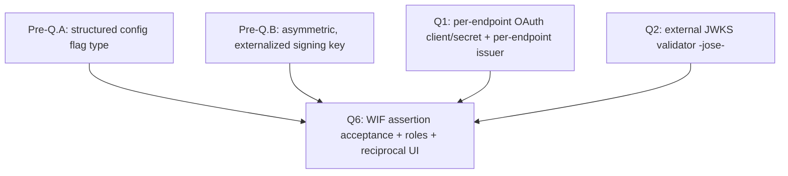

| Sub-step | Deliverable |
|---|---|
| Q6.1 | Token endpoint accepts `client_assertion` (form-urlencoded) and routes to the WIF validator |
| Q6.2 | `wif` `credentialType` + structured trust config persisted (no secret) |
| Q6.3 | `WifAssertionValidatorService` (reuses Q2 `jose` JWKS client): signature + claims + roles + tenant isolation |
| Q6.4 | Per-endpoint issuance of a 1-6 h token scoped to the configured `scope` |
| Q6.5 | Reciprocal CredentialsTab UI: "Federated Identity (WIF)" section + Test Connection |
| Q6.6 | Advertise the WIF scheme in the endpoint's `/ServiceProviderConfig` when `WifCredentialsEnabled` is on |

---

## 8. Backend design

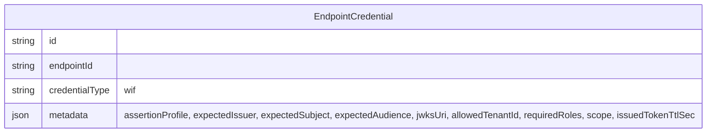

**Admin API - register WIF trust (no secret):**

```http
POST /api/endpoints/{id}/credentials
Content-Type: application/json

{
  "credentialType": "wif",
  "wif": {
    "assertionProfile": "jwt-bearer",
    "expectedIssuer": "https://login.microsoftonline.com/<TenantID>/v2.0",
    "expectedSubject": "{WorkloadIdentity_object_id}",
    "expectedAudience": "api://{WorkloadIdentity_appid}",
    "jwksUri": "https://login.microsoftonline.com/<TenantID>/discovery/v2.0/keys",
    "allowedTenantId": "<TenantID>",
    "requiredRoles": [],
    "scope": "scimserver-scim-access",
    "issuedTokenTtlSec": 3600
  }
}
```

> **Field notes.** `assertionProfile` selects the wire shape (`jwt-bearer` for RFC 7523 today, `token-exchange` for RFC 8693 upcoming - [section 1.4](#14-two-assertion-profiles-rfc-7523-jwt-bearer-and-rfc-8693-token-exchange)). `expectedAudience` is the **App ID URI** form `api://{appid}` (what the token's `aud` claim actually contains - [section 4.1](#41-decided---entra-v2-token-format-only-issuer-and-audience)), not the `/.default` scope value the admin reads in Step 1. `requiredRoles` defaults to **empty** because roles are not passed/validated today (the upcoming-changes note in [section 4](#4-the-assertion-claims-validation-jwks)); leave it empty until the planned 1P-app-method change lands a role-bearing sample token.

**Token endpoint pseudocode:**

```text
if grant_type == "client_credentials" and client_assertion present:
    trust = loadWifTrust(endpointId)
    if not trust: 401 invalid_client
    assertion = verifyJwt(client_assertion, jwks(trust.jwksUri))   # fail closed on JWKS failure
    require assertion.iss == trust.expectedIssuer
    require assertion.aud == trust.expectedAudience
    require assertion.sub == trust.expectedSubject
    require assertion.tid == trust.allowedTenantId
    require trust.requiredRoles subset of assertion.roles
    return issueOwnToken(endpointId, ttl=trust.issuedTokenTtlSec, scope=trust.scope)
```

**Validation flow:**

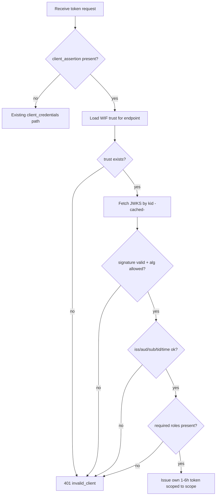

> **Guard fall-through note.** The token issued here is the ISV's own JWT, so the existing OAuth-JWT branch in [shared-secret.guard.ts](../api/src/modules/auth/shared-secret.guard.ts) validates it on SCIM calls with no new code, provided the issuer/audience match what the guard expects per endpoint.

### 8.6 Per-endpoint enablement and auth coexistence

WIF is **one settings-enabled auth feature among several**, configured **per endpoint** exactly like every other SCIMServer capability. It is **not** a global mode and it does **not** replace the existing auth patterns - an operator turns it on for a specific endpoint by setting the `WifCredentialsEnabled` flag in that endpoint's profile settings (the same `endpoint.profile.settings` config object that holds `PerEndpointCredentialsEnabled`, `StrictSchemaValidation`, and the rest) and attaching a `wif` credential. Endpoints that do not enable it are completely unaffected, and an endpoint may keep its bearer / OAuth / legacy auth working alongside WIF during a migration.

**Each auth pattern keeps its own per-endpoint enabling mechanism:**

| Pattern | Per-endpoint enabling mechanism | Still works when WIF is on? |
|---|---|---|
| Per-endpoint bcrypt bearer (G11) | `PerEndpointCredentialsEnabled` flag + a `bearer` credential | Yes - unchanged |
| OAuth 2.0 JWT (issuer-mode) | The issued token is validated by the OAuth-JWT guard branch | Yes - WIF reuses this branch for its issued token |
| Legacy global bearer | `SCIM_SHARED_SECRET` (deployment-wide fallback) | Yes - unchanged |
| **WIF (Pattern 8)** | **`WifCredentialsEnabled` flag + a `wif` credential** | **n/a - this is the feature** |

**The guard's per-endpoint resolution order is additive (no branch is removed):**

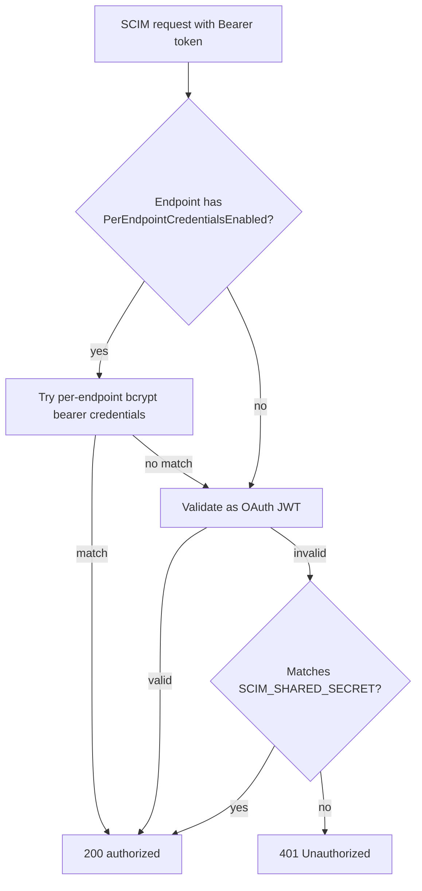

> **Where WIF plugs in.** WIF does not add a new SCIM-call branch. It adds a path at the **token endpoint** (gated by `WifCredentialsEnabled` + a `wif` credential) that mints the ISV's own JWT; that JWT is then accepted by the **existing** OAuth-JWT branch above. So enabling WIF on one endpoint changes only how that endpoint obtains a token, never how any other endpoint authenticates.

> **Config-flag discipline.** `WifCredentialsEnabled` is a normal endpoint config flag and MUST satisfy the 10-cell completeness matrix (`endpointConfigFlagAudit`): registry + default (`false`) + validator + enforcement + unit test + E2E test + live test + doc + UI Switch + UI test. Its default is `false`, so existing endpoints are untouched until an operator opts in.

### 8.7 Fitting WIF into the endpoint-creation model

SCIMServer endpoints are created from a **preset** (`profilePreset`, e.g. `entra-id`) or an **inline profile** ([create-endpoint.dto.ts](../api/src/modules/endpoint/dto/create-endpoint.dto.ts)), and every behavioral flag lives in the typed `profile.settings` object ([ProfileSettings in endpoint-profile.types.ts](../api/src/modules/scim/endpoint-profile/endpoint-profile.types.ts)). WIF must slot into that same model so the API and UI work exactly like every other feature - no special case.

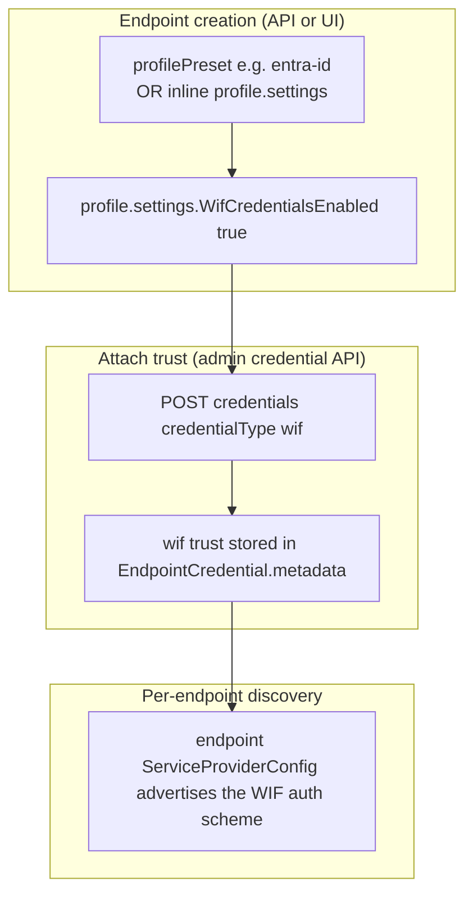

**Three source-grounded integration points:**

1. **Flag home is the typed profile settings.** Add `WifCredentialsEnabled?: boolean | string` to [ProfileSettings](../api/src/modules/scim/endpoint-profile/endpoint-profile.types.ts) alongside `PerEndpointCredentialsEnabled`, and to the flag registry in [endpoint-config.interface.ts](../api/src/modules/endpoint/endpoint-config.interface.ts). A preset (for example a future `entra-id-wif`) can pre-enable it; an inline profile can set it at create time. This is the same mechanism as the existing 13 flags, so the create/update endpoint API needs no new shape. The `wif` credential's stored trust record (`EndpointCredential.metadata`) carries an **`assertionProfile`** discriminator - `jwt-bearer` (RFC 7523) or `token-exchange` (RFC 8693), per [section 1.4](#14-two-assertion-profiles-rfc-7523-jwt-bearer-and-rfc-8693-token-exchange) - that selects which token-endpoint request shape the endpoint accepts. It defaults to `jwt-bearer` (today's shipped profile).

2. **The credential-create gate must become orthogonal.** Today [admin-credential.controller.ts](../api/src/modules/scim/controllers/admin-credential.controller.ts) blocks **all** credential creation unless `PerEndpointCredentialsEnabled` is true. A `wif` credential is a different feature, so the gate must read: allow a `bearer` credential when `PerEndpointCredentialsEnabled` is on, **and** allow a `wif` credential when `WifCredentialsEnabled` is on - independently. The two flags are separate concerns (single-responsibility): an endpoint can run WIF without per-endpoint bearer tokens, or both at once during a migration.

| Requested `credentialType` | Required per-endpoint flag |
|---|---|
| `bearer` | `PerEndpointCredentialsEnabled` |
| `wif` | `WifCredentialsEnabled` |

3. **Enablement must surface in per-endpoint discovery (RFC 7644 section 4).** Every endpoint today advertises exactly one `oauthbearertoken` scheme (from `SCIM_SERVICE_PROVIDER_CONFIG` via [scim-discovery.service.ts](../api/src/modules/scim/discovery/scim-discovery.service.ts)). When `WifCredentialsEnabled` is on, that endpoint's `/ServiceProviderConfig` SHOULD advertise an additional `SpcAuthenticationScheme` describing the WIF token-exchange, so a client can discover it. The profile already supports per-endpoint `authenticationSchemes` ([ServiceProviderConfig in endpoint-profile.types.ts](../api/src/modules/scim/endpoint-profile/endpoint-profile.types.ts)), so this is a populate-on-enable, not a schema change.

```json
{
  "type": "oauth2",
  "name": "Workload Identity Federation (JWT Bearer Assertion)",
  "description": "RFC 7523 section 2.2 client authentication: present a signed JWT assertion at the token endpoint to receive a short-lived bearer token.",
  "specUri": "https://www.rfc-editor.org/rfc/rfc7523",
  "primary": false
}
```

When the endpoint's `assertionProfile` is `token-exchange`, the advertised scheme instead references RFC 8693:

```json
{
  "type": "oauth2",
  "name": "Workload Identity Federation (OAuth Token Exchange)",
  "description": "RFC 8693 token exchange: present a signed JWT as subject_token at the token endpoint to receive a short-lived bearer token.",
  "specUri": "https://www.rfc-editor.org/rfc/rfc8693",
  "primary": false
}
```

> **Design principle.** WIF adds capability without removing or mutating any existing behavior: a new optional flag in the existing settings object, a new branch in the existing credential-create gate, and an extra entry in the existing discovery list. Endpoints that do not opt in are byte-for-byte unchanged at every layer - config, auth, and discovery.

---

## 9. UI design

The CredentialsTab gains a "Federated Identity (WIF)" section, gated behind a config flag, that mirrors the three-step setup:

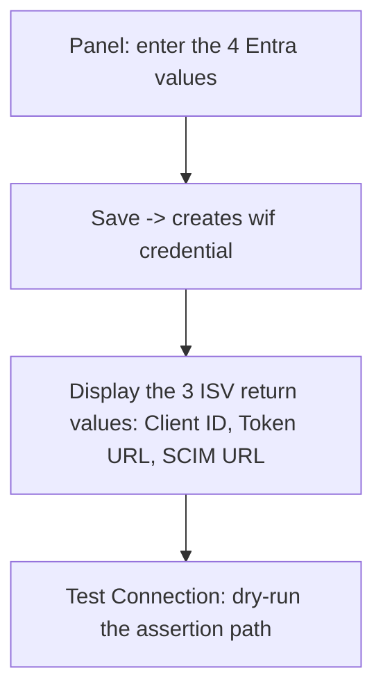

**R9 primitive mapping:**

| Field | Primitive |
|---|---|
| Issuer / Subject / Audience / JWKS URL (editable) | `EditableField` |
| Required roles / scope (editable) | `EditableField` |
| Client ID / Token URL / SCIM URL (read-only, copyable) | `CopyableField` |
| Full trust record (copy as JSON) | `CopyJsonButton` |

- **Gating flag:** a `WifCredentialsEnabled` boolean in the config registry, set **per endpoint** in that endpoint's profile settings (default `false`). The "Federated Identity (WIF)" section renders only when the endpoint has opted in; endpoints without it see no change. 10-cell completeness per `endpointConfigFlagAudit`.
- **Test Connection UX:** posts a synthetic assertion (or asks the operator to trigger one) and reports each validation step's pass/fail with the specific failing claim.
- **Coverage:** Playwright spec under `web/e2e/` exercising the WIF panel end-to-end; vitest for the panel's rendered structure and primitive presence by `data-testid`.

---

## 10. Security analysis

| Threat | Mitigation |
|---|---|
| Algorithm confusion (`alg: none` / HMAC with public key) | Pin allowed algs to RS256/ES256; reject everything else |
| JWKS SSRF (attacker-controlled `jwksUri`) | Allowlist hosts (Microsoft login domains); validate URL scheme/host before fetch |
| JWKS cache poisoning | Cache by `kid` from a verified response only; bounded max-age; refetch on unknown `kid` |
| Replay of an assertion | Short `exp`; optional `jti` single-use cache; assertions are client-auth only, not resource tokens |
| Token leakage | Issued token is short-lived (1-6 h); never log the assertion or the issued token |
| Cross-tenant access | Enforce `tid` equals the configured `allowedTenantId` |
| Privilege escalation | Enforce `requiredRoles` subset of `roles`; missing role -> 401 |
| Secret leak via response | `wif` credential has no secret; contract test asserts no secret/hash key appears on the response |
| JWKS outage | Fail closed - never skip signature verification |

---

## 11. Quality gates and test matrix

| Layer | WIF additions |
|---|---|
| Pre-Q.A | Structured config flag-type tests (10-cell matrix) |
| Pre-Q.B | Asymmetric, externalized signing key tests |
| Unit (`.service.spec.ts` + `.controller.spec.ts`) | Validator: good assertion, bad sig, wrong iss/aud/sub/tid, expired, missing role, `alg:none` rejected, unknown `kid` refetch, JWKS-down fail-closed |
| E2E (`test/e2e/*.e2e-spec.ts`) | Register `wif` credential -> POST assertion -> receive own token -> use token on SCIM call |
| Live (`scripts/live-test.ps1`) | New section: form-urlencoded assertion exchange across local/Docker/Azure |
| Contract | `expect(ALLOWED_KEYS).toContain(key)` asserts no secret/hash key on the `wif` response |
| OAuth error conformance | RFC 6749 section 5.2: `invalid_client` on bad assertion; `invalid_request` on malformed form body |
| RFC audit | RFC 7521 + RFC 7523 section 2.2 + RFC 7519 + RFC 7517 + RFC 6749 section 5.2 |

---

## 12. Error responses and RFC 6749 conformance

Every WIF rejection maps to an RFC 6749 section 5.2 error object so Entra (SyncFabric) receives a standards-compliant `{ "error": ..., "error_description": ... }`. The validator MUST stay tight-lipped: the same generic `invalid_client` is returned for a bad signature, a wrong `iss`, or a missing role, while the specific failing claim is logged server-side only. This denies an attacker a claim-by-claim oracle.

| Condition | HTTP | `error` (RFC 6749 5.2) | `error_description` (client-facing, generic) | Server-side log (detailed) |
|---|---|---|---|---|
| Wrong `Content-Type`, missing or empty form fields | 400 | `invalid_request` | "Malformed token request" | which field was absent |
| `client_assertion_type` not the `jwt-bearer` URN | 400 | `invalid_request` | "Unsupported client_assertion_type" | the value received |
| `grant_type` not `client_credentials` | 400 | `unsupported_grant_type` | "Only client_credentials is supported" | the grant received |
| Requested `scope` not the configured WIF scope | 400 | `invalid_scope` | "Requested scope is not permitted" | requested vs configured |
| No `wif` trust configured for the endpoint | 401 | `invalid_client` | "Client authentication failed" | endpoint id, no wif trust |
| Signature invalid, disallowed alg, or `alg: none` | 401 | `invalid_client` | "Client authentication failed" | alg seen, kid, reason |
| `iss` / `aud` / `sub` / `tid` mismatch | 401 | `invalid_client` | "Client authentication failed" | which claim, expected vs got |
| Outside `iat` / `nbf` / `exp` window | 401 | `invalid_client` | "Client authentication failed" | now, nbf, exp, skew applied |
| Required role missing from `roles` | 401 | `invalid_client` | "Client authentication failed" | required set, granted set |
| JWKS fetch failed and no cached key (fail closed) | 401 | `invalid_client` | "Client authentication failed" | jwksUri, fetch error |

> **Why `invalid_client` for authorization failures too.** At the token endpoint the only principal is the client itself, so an unmet role is a client-authorization failure, not a resource-scope failure. RFC 6749 section 5.2 has no `forbidden` code for this hop, so `invalid_client` (401) is the conformant choice and the missing role is logged for the operator. The resource-level role checks (on the SCIM calls) are a separate concern handled by the guard.

---

## 13. Step-by-step implementation plan

> This plan is **TDD-first** (Stage 0 of the standing quality gates): write the failing test, make it green with the smallest change, refactor green. Each step names the files it touches, the **RED test** to write first, and the **gate** that must pass before the step is done. Nothing here is implemented yet; this is the ordered recipe.

### 13.1 Build order at a glance

```mermaid
gantt
    title Phase Q6 WIF build order (relative units, not calendar dates)
    dateFormat X
    axisFormat %s
    section Prerequisites
    Pre-Q.A structured flag type         :prea, 0, 2
    Pre-Q.B asymmetric externalized key  :preb, 0, 3
    section Q1 Q2 primitives
    Q1 per-endpoint OAuth client          :q1, after preb, 3
    Q2 external JWKS validator            :q2, after preb, 3
    section Q6 WIF
    Q6.1 form-urlencoded assertion intake :q61, after q1, 2
    Q6.2 wif credentialType persistence   :q62, after prea, 2
    Q6.3 WifAssertionValidatorService     :q63, after q2, 3
    Q6.4 own-token issuance scoped        :q64, after q63, 1
    Q6.5 reciprocal CredentialsTab UI     :q65, after q64, 3
```

### 13.2 Pre-Q.A - structured config flag type

The flag registry today is `boolean | string` only. WIF needs a flag whose value is a structured object (the trust record), so the registry must learn a `structured` flag-type with its own validator. Honor the 10-cell completeness matrix (`endpointConfigFlagAudit`): registry + default + validator + enforcement + unit test + E2E test + live test + doc + UI Switch + UI test.

| Step | Action | Files | RED test first | Gate |
|---|---|---|---|---|
| A1 | Add a `structured` value-kind to the flag-type union and metadata | [endpoint-config.interface.ts](../api/src/modules/endpoint/endpoint-config.interface.ts) | unit: a structured flag round-trips through `validateEndpointConfig` | 1.2 build, 2.1 unit |
| A2 | Add `validateStructuredFlag()` (shape check + reject unknown keys) | [endpoint-config.interface.ts](../api/src/modules/endpoint/endpoint-config.interface.ts) | unit: malformed structured value -> validation error | 2.1 unit |
| A3 | Document the new flag-type | [ENDPOINT_CONFIG_FLAGS_REFERENCE.md](ENDPOINT_CONFIG_FLAGS_REFERENCE.md) | n/a (doc) | 3c.2 docs audit |

### 13.3 Pre-Q.B - asymmetric, externalized signing key

Today [oauth.service.ts](../api/src/oauth/oauth.service.ts) signs with HS256 using a process-lifetime random secret. For the ISV to publish a JWKS that any client can verify, issuance must move to an **asymmetric** key (RS256/ES256) loaded from configuration, and the public half must be published.

| Step | Action | Files | RED test first | Gate |
|---|---|---|---|---|
| B1 | Load an RS256/ES256 private key + `kid` from config; fall back to a generated dev key | [oauth.service.ts](../api/src/oauth/oauth.service.ts) | unit: signed token header carries `alg: RS256` and a `kid` | 2.1 unit |
| B2 | Publish the public JWKS at a stable path | new `api/src/oauth/jwks.controller.ts` | E2E: fetching the JWKS returns the active `kid` | 2.2 E2E |
| B3 | Verify issued tokens with the public key in the guard's OAuth branch | [shared-secret.guard.ts](../api/src/modules/auth/shared-secret.guard.ts) | unit: a token signed by B1 validates; an HS256 token does not | 2.1 unit, 2.5 parity |

### 13.4 Q6.1 - form-urlencoded assertion intake

The token endpoint must parse `application/x-www-form-urlencoded` and accept the `client_assertion` + `client_assertion_type` fields. Today it reads JSON via `@Body()` and requires `client_secret`.

| Step | Action | Files | RED test first | Gate |
|---|---|---|---|---|
| C1 | Enable the urlencoded body parser | [api/src/main.ts](../api/src/main.ts) | E2E: a form-urlencoded POST reaches the controller with populated fields | 2.2 E2E |
| C2 | Extend `TokenRequest` with `client_assertion` + `client_assertion_type`; route assertion requests to the WIF path | [oauth.controller.ts](../api/src/oauth/oauth.controller.ts) | unit: a request with `client_assertion` is dispatched to the validator, not the secret path | 2.1 unit |
| C3 | Emit RFC 6749 5.2 errors per the section 12 catalog | [oauth.controller.ts](../api/src/oauth/oauth.controller.ts) | unit: malformed body -> `invalid_request`; unknown assertion type -> `invalid_request` | 2.1 unit, 3a.3 error-handling |

### 13.5 Q6.2 - `wif` credentialType persistence (no secret)

Reuse the existing `EndpointCredential.credentialType` + `metadata` JSON columns - no new column, no secret stored. Both the Prisma and InMemory backends must behave identically (`crossBackendParityAudit`).

| Step | Action | Files | RED test first | Gate |
|---|---|---|---|---|
| D1 | Accept `credentialType: 'wif'` with a validated trust `metadata` shape | endpoint-credential service + DTO | unit: a `wif` credential persists trust values, no secret/hash field | 2.1 unit |
| D2 | Mirror behavior in the InMemory repository | [api/src/infrastructure/repositories/inmemory](../api/src/infrastructure/repositories/inmemory) | unit: InMemory create matches Prisma create | 2.5 + 2.6 parity |
| D3 | Add the Prisma migration if any enum/constraint changes | [api/prisma](../api/prisma) | n/a | 1.9 prismaMigrationAudit |
| D4 | Contract test: the `wif` response carries no secret/hash key | E2E + live | E2E: `expect(ALLOWED_KEYS).toContain(key)` over the response | 3a.2 apiContractVerification |
| D5 | Make the create gate orthogonal: add `'wif'` to the allowlist and permit it when `WifCredentialsEnabled` is on (independent of `PerEndpointCredentialsEnabled`) | [admin-credential.controller.ts](../api/src/modules/scim/controllers/admin-credential.controller.ts) | unit: `wif` create allowed when only `WifCredentialsEnabled` is on; `bearer` still requires `PerEndpointCredentialsEnabled` | 2.1 unit, 3b.4 security |

### 13.6 Q6.3 - `WifAssertionValidatorService`

A new service that reuses the Q2 `jose` JWKS client to run the full validation lifecycle (the section 4 state diagram): signature + alg-pinning + `iss`/`aud`/`sub`/`tid` + time window + required roles, failing closed on JWKS outage.

| Step | Action | Files | RED test first | Gate |
|---|---|---|---|---|
| E1 | Validate signature against the configured JWKS; pin RS256/ES256 | new `api/src/oauth/wif-assertion-validator.service.ts` | unit: good sig passes; `alg: none` + HMAC rejected | 2.1 unit, 3b.4 security |
| E2 | Validate `iss`/`aud`/`sub`/`tid` + time window | same | unit: each wrong claim -> rejection | 2.1 unit |
| E3 | Enforce `requiredRoles` subset of `roles` | same | unit: missing role -> rejection | 2.1 unit |
| E4 | Cache JWKS by `kid`; refetch on unknown `kid`; fail closed on outage | same | unit: unknown `kid` triggers refetch; outage with no cache -> reject | 2.1 unit, 3b.4 security |

### 13.7 Q6.4 - own-token issuance scoped to the configured scope

On a valid assertion, mint the ISV's own short-lived (1-6 h) token scoped to the configured `scope`, using the Pre-Q.B asymmetric key.

| Step | Action | Files | RED test first | Gate |
|---|---|---|---|---|
| F1 | Issue a per-endpoint token with `issuedTokenTtlSec` + `scope` | [oauth.service.ts](../api/src/oauth/oauth.service.ts) | unit: issued token carries the configured scope + ttl | 2.1 unit |
| F2 | Wire validator -> issuer in the controller | [oauth.controller.ts](../api/src/oauth/oauth.controller.ts) | E2E: assertion in -> own token out -> token authorizes a SCIM call | 2.2 E2E, 4.x live |
| F3 | Q6.6: advertise the WIF `SpcAuthenticationScheme` in the endpoint's `/ServiceProviderConfig` when `WifCredentialsEnabled` is on | [scim-discovery.service.ts](../api/src/modules/scim/discovery/scim-discovery.service.ts) | E2E: enabled endpoint advertises both `oauthbearertoken` and the WIF scheme; disabled endpoint advertises only `oauthbearertoken` | 2.2 E2E, 3b.2 auditAgainstRFC |

### 13.8 Q6.5 - reciprocal CredentialsTab UI

A "Federated Identity (WIF)" section in the CredentialsTab, gated by a `WifCredentialsEnabled` flag, mirroring the three-step setup: enter the 4 Entra values, display the 3 ISV return values, run a Test Connection dry-run. All fields go through R9 primitives.

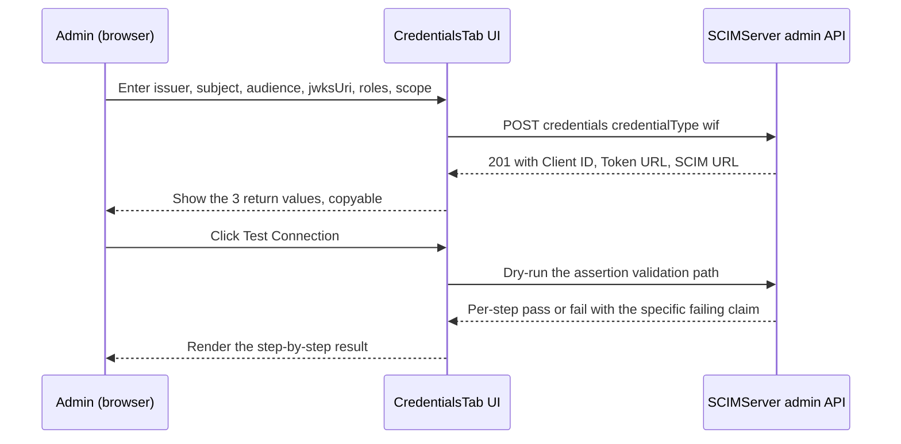

| Step | Action | Files | RED test first | Gate |
|---|---|---|---|---|
| G1 | Add the gated "Federated Identity (WIF)" section | [CredentialsTab.tsx](../web/src/pages/CredentialsTab.tsx) | vitest: section renders the 4 `EditableField`s + 3 `CopyableField`s by `data-testid` | 2.3 vitest |
| G2 | Wire Save -> `wif` credential create; show the 3 return values | [CredentialsTab.tsx](../web/src/pages/CredentialsTab.tsx) | vitest: save calls the API; return values render | 2.3 vitest |
| G3 | Test Connection dry-run with per-step result | [CredentialsTab.tsx](../web/src/pages/CredentialsTab.tsx) | Playwright: full panel flow end-to-end | 5.3 Playwright |
| G4 | Add the `WifCredentialsEnabled` flag (10-cell matrix) | flag registry + UI Switch | unit + vitest per the matrix | 3b.3 endpointConfigFlagAudit |

### 13.9 Migration and rollout (secret-based endpoint to WIF)

WIF can be adopted without downtime by running both auth modes during a cutover window, then removing the legacy secret.

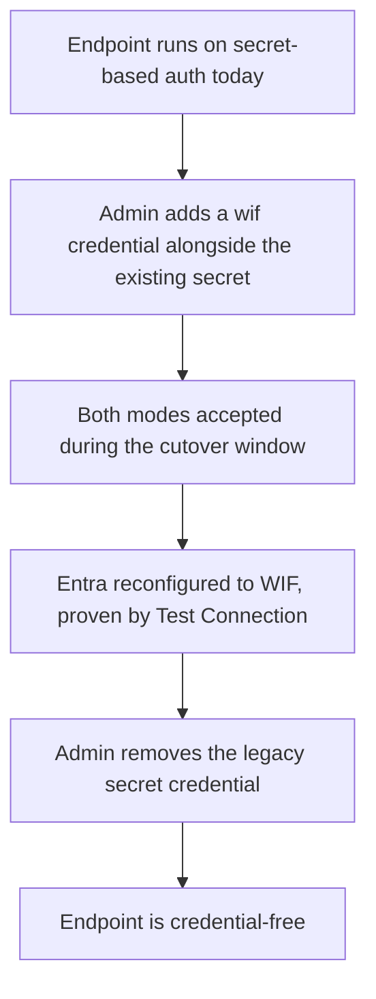

### 13.10 Definition of done

A WIF commit is complete only when the standing **Feature / Bug-Fix Commit Checklist** is satisfied for the steps it lands: unit + E2E + live tests, a Playwright spec for any `web/` change, the feature doc updated, [INDEX.md](INDEX.md) + [CHANGELOG.md](../CHANGELOG.md) + Session and context files updated, the version bumped, and the response-contract test proving no secret leaks on the `wif` credential.

---

## 14. Effort estimates

> **What this is.** A bottom-up effort estimate in **ideal engineering-days for one developer already fluent in this codebase**, working TDD-first and reusing the existing G11 / OAuth / dual-backend patterns. "Ideal day" = focused build + test time, excluding meetings, context-switching, and review latency. These are effort sizes, not calendar dates; see the calendar note below.

> **Basis (2026-06-11 source check).** The §5 verified-greenfield note governs this estimate: `jose`/JWKS, form-urlencoded parsing, `client_assertion`, asymmetric issuance, and a real per-endpoint OAuth client are all absent today, so Q6 must build its full prerequisite stack. Nothing below is discounted as "already done."

| Phase | Low (days) | High (days) | Primary effort driver |
|---|---|---|---|
| Pre-Q.A structured flag type | 1 | 2 | registry + validator + 10-cell flag matrix |
| Pre-Q.B asymmetric key + JWKS publish | 2 | 3 | key load, `kid`, new JWKS controller, guard verify |
| Q1 per-endpoint OAuth client | 3 | 4 | model + issuance + dual-backend parity |
| Q2 external JWKS validator (`jose`) | 3 | 4 | new dep, alg-pinning, cache, fail-closed, SSRF allowlist |
| Q6.1 form-urlencoded intake | 1 | 2 | body parser + routing + error catalog (section 12) |
| Q6.2 `wif` persistence (no secret) | 2 | 2 | DTO + parity + no-secret contract test |
| Q6.3 `WifAssertionValidatorService` | 3 | 4 | security core; heaviest test surface |
| Q6.4 own-token issuance | 1 | 1 | wiring validator -> issuer |
| Q6.5 reciprocal CredentialsTab UI | 3 | 4 | UI + vitest + Playwright + flag matrix |
| **Subtotal (build + unit/E2E)** | **19** | **29** | |
| Quality-gate overhead (~25%) | 5 | 9 | live-test.ps1 (local/Docker/Azure), Playwright-vs-dev, full pipeline, CHANGELOG/Session/docs, Stage X audits |
| **Total ideal dev-days** | **~24** | **~38** | roughly 5 to 8 ideal engineering-weeks |

**Critical path and parallelism:**

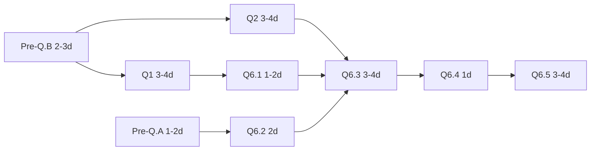

- Pre-Q.A and Pre-Q.B have no dependency on each other; Q1 and Q2 can run in parallel once Pre-Q.B lands. With two developers the calendar compresses toward roughly 3 to 4 weeks while total effort is unchanged.
- **Q6.3 is the long pole by risk, not size.** Its code is modest, but the security tests (algorithm confusion, fail-closed on JWKS outage, tenant isolation, JWKS rotation by `kid`) are where estimates slip.

**Confidence and what moves the number:**

| Factor | Effect |
|---|---|
| Developer new to the repo | roughly doubles the total |
| Q4 (Auth-Code) or Q5 (mTLS/DPoP) pulled in | out of scope here; each is its own multi-day effort |
| Review cycles + CI queue + serialized shared `scimserver-dev` Azure target | extends **calendar** time beyond ideal-days; not sizable from the repo alone |
| Reusing `jose` defaults rather than hand-rolling JWKS caching | trims Q2 toward the low end |

> **Calendar caveat.** Ideal dev-days are not wall-clock days. The standing multi-stage gate suite (Stages 0-6 plus Stage X audits), the single shared dev Azure environment that must be serialized across concurrent work, and human review latency all stretch calendar delivery. Treat ~24-38 ideal dev-days as the **effort floor**, then apply your team's historical ideal-to-calendar ratio.

---

## 15. FAQ

**Is this RFC 7523 grant-type usage?** No. It is RFC 7523 **section 2.2** (JWT used for **client authentication**), with `grant_type=client_credentials`. The assertion authenticates the client; it is not the grant.

**Does Entra's JWT ride the SCIM calls?** No. It is presented once at the token endpoint. The ISV's own issued token rides the SCIM calls.

**Do we store any secret?** No. WIF stores only public trust values. The contract tests assert no secret leaks on the response.

**How is this different from Pattern 4 (direct external JWT)?** Pattern 4 verifies Entra's JWT on every SCIM request and issues nothing. WIF adds a token-exchange hop and mints the ISV's own token.

**What is the issued token's lifetime?** 1-6 hours per the Entra spec; configurable per endpoint via `issuedTokenTtlSec`.

**What are the "two profiles" and which do we build first?** `jwt-bearer` (RFC 7523, Entra's JWT as `client_assertion`, `grant_type=client_credentials`) is shipped today and is the SAP SuccessFactors flow - build it first. `token-exchange` (RFC 8693, Entra's JWT as `subject_token`, `grant_type=token-exchange`) is upcoming (Google's flow). They are selected per endpoint by the `assertionProfile` discriminator; the JWKS validation of Entra's JWT is identical for both. See [section 1.4](#14-two-assertion-profiles-rfc-7523-jwt-bearer-and-rfc-8693-token-exchange).

**Are app roles validated today?** No. Roles are not currently passed in the assertion or validated; the role-enforcement requirement is forward-looking and tied to a planned "1P app method" change. Design the validator to switch role enforcement on per endpoint, but do not hard-require a `roles` claim Entra does not yet send. See the upcoming-changes note in [section 4](#4-the-assertion-claims-validation-jwks).

---

## 16. References

### Primary (internal + reconciled)

- Internal Entra design doc - "Workload Identity Federation between Entra Provisioning (SyncFabric) and SaaS ISVs"

### Microsoft Learn

- [Tutorial: Develop and plan provisioning for a SCIM endpoint](https://learn.microsoft.com/en-us/entra/identity/app-provisioning/use-scim-to-provision-users-and-groups)
- [Tutorial: Develop a sample SCIM endpoint](https://learn.microsoft.com/en-us/entra/identity/app-provisioning/use-scim-to-build-users-and-groups-endpoints)
- [AzureAD/SCIMReferenceCode](https://github.com/AzureAD/SCIMReferenceCode)

### v2 token-format finding (2026-06-09; see section 4.1 DECIDED)

- [AzureAD/SCIMReferenceCode - Workload Identity Federation for SCIM Provisioning](https://github.com/AzureAD/SCIMReferenceCode/blob/master/Workload-Identity-Federation-for-SCIM-Provisioning.md) - public reference updated 2026-06-09 ("Update WIF SCIM article for Entra v2 tokens"); documents the v2.0 issuer/audience now adopted in sections 3, 4, and 4.1, including the concrete example token whose `aud` is `api://{appid}`
- [Microsoft Learn - Access tokens in the Microsoft identity platform](https://learn.microsoft.com/en-us/entra/identity-platform/access-tokens) - `iss` v1.0 `sts.windows.net/{tenantid}/` vs v2.0 `login.microsoftonline.com/{tenantid}/v2.0`; `ver` discriminator
- [Microsoft Learn - Access token claims reference](https://learn.microsoft.com/en-us/entra/identity-platform/access-token-claims-reference) - claim-by-claim reference for v1.0 and v2.0 (`aud`, `iss`, `ver`, `appid`/`azp`)
- [Microsoft Learn - Microsoft identity platform and the OAuth 2.0 client credentials flow](https://learn.microsoft.com/en-us/entra/identity-platform/v2-oauth2-client-creds-grant-flow) - the v2.0 client-credentials request shape

### IETF

- **RFC 7521** - Assertion Framework for OAuth 2.0
- **RFC 7523** - JWT Profile for OAuth 2.0 Client Authentication and Authorization Grants (section 2.2 client authentication) - the `jwt-bearer` profile
- **RFC 8693** - OAuth 2.0 Token Exchange - the `token-exchange` profile; authored by Microsoft (Mike Jones, Tony Nadalin) with Ping/Yubico/Visa. Defines `grant_type=urn:ietf:params:oauth:grant-type:token-exchange`, `subject_token`/`subject_token_type`, the required `issued_token_type` response member, and impersonation vs delegation (`actor_token`, `act` claim)
- **RFC 7519** - JSON Web Token (JWT)
- **RFC 7517** - JSON Web Key (JWK)
- **RFC 6749** - The OAuth 2.0 Authorization Framework (section 5.2 error responses)
- **RFC 7644** - SCIM Protocol (section 2 Authentication and Authorization)

### In-repo

- [ISV_AUTH_PATTERNS_AND_SCIMSERVER_GAP_PLAN.md](ISV_AUTH_PATTERNS_AND_SCIMSERVER_GAP_PLAN.md) - the Phase Q plan that schedules Q6
- [G11_PER_ENDPOINT_CREDENTIALS.md](G11_PER_ENDPOINT_CREDENTIALS.md) - the per-endpoint-bearer architecture WIF extends
- [api/src/oauth/oauth.controller.ts](../api/src/oauth/oauth.controller.ts) - the token endpoint to extend
- [api/src/oauth/oauth.service.ts](../api/src/oauth/oauth.service.ts) - the issuer to make per-endpoint
- [api/src/modules/auth/shared-secret.guard.ts](../api/src/modules/auth/shared-secret.guard.ts) - the auth fallback chain
- [api/src/modules/endpoint/endpoint-config.interface.ts](../api/src/modules/endpoint/endpoint-config.interface.ts) - the flag registry (needs `structured` type)
- [web/src/pages/CredentialsTab.tsx](../web/src/pages/CredentialsTab.tsx) - the UI surface for the reciprocal portal

---

This document is analysis + design only; no code has been implemented.
