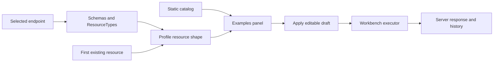

# Workbench Request Examples

> **Status:** Implemented - **Last verified:** 2026-09-23 - **Product version:** `0.55.27`

## Purpose

Workbench now turns common server, admin, endpoint, and SCIM operations into ready-to-run requests. Static examples cover routes whose shape does not depend on an endpoint. Selecting an endpoint adds endpoint-specific examples, and selecting one of its published ResourceTypes adds profile-valid POST and existing-resource PATCH examples.

## Operator Flow

1. Open **Workbench**.
2. Optionally select an endpoint context.
3. Optionally select one of that endpoint's ResourceTypes.
4. Pick a request example and select **Apply**.
5. Review the populated method, path, headers, and body.
6. Select **Send**, or export the request as curl, TypeScript, Insomnia, Postman, or JSON.

Applying an example never sends it. It only replaces the editable request draft.

## Example Categories

| Category | Source | Examples |
|---|---|---|
| Server | Static catalog | Health and root ServiceProviderConfig |
| Admin | Static catalog | List endpoints, create endpoint, admin dashboard |
| Endpoint | Selected endpoint id | Endpoint detail, overview, settings PATCH, ResourceTypes, Schemas |
| SCIM resource | Selected endpoint discovery | Profile-valid create POST and ETag-aware existing-resource PATCH |

## Architecture



The owning modules are:

| Module | Responsibility |
|---|---|
| `web/src/workbench/workbench-templates.ts` | Static catalog plus endpoint and profile-derived request builders. |
| `web/src/workbench/WorkbenchExamplesPanel.tsx` | Endpoint/ResourceType context, template selection, and Apply command. |
| `web/src/resources/profile-resource-shape.ts` | Shared source for profile-valid create bodies and extension-qualified paths. |
| `web/src/pages/WorkbenchPage.tsx` | Editable request state, send/export/history behavior, and applying a selected template. |
| `web/src/api/queries.ts` | Sends method, path, body, and enabled header rows while preserving authenticated admin Authorization. |

## Profile-Derived Requests

The create example is the same working example used by the generated resource forms. Core fields remain at the resource root; extension fields remain under their schema URN.

String fields published with `uniqueness: server` or `uniqueness: global` receive a run-specific value. The static endpoint-create example does the same for `name`. Reapplying or reopening Workbench therefore does not ship a known duplicate string identifier on a shared environment. Non-string fields retain type-valid examples.

When the selected ResourceType has an existing resource, Workbench adds a PATCH example that:

- targets the concrete resource id;
- changes the first writable scalar field;
- uses the RFC 7644 PatchOp envelope;
- adds the resource's returned `meta.version` as `If-Match` when available.

If no resource exists, the create example remains available and PATCH is omitted rather than generating a non-runnable placeholder id.

```json
{
  "schemas": [
    "urn:ietf:params:scim:api:messages:2.0:PatchOp"
  ],
  "Operations": [
    {
      "op": "replace",
      "path": "serialNumber",
      "value": "SN-100-updated"
    }
  ]
}
```

## Header Contract

Workbench header rows are now part of the actual request contract. Enabled rows with non-empty names are forwarded to `fetch`, stored in history, restored on replay, exported, and included in generated live-test snippets. One shared sanitizer trims header names and removes every case variant of `Authorization` before the stored authenticated admin bearer is applied, so an operator-entered value cannot replace or combine with the current admin session. Exports use the explicit non-secret placeholder `Bearer <admin-token>`. The legacy `ifMatch` argument remains a final compatibility override.

## Dev Reference Fixture

`scripts/configure-profile-resource-forms-dev-fixture.ps1` configures the canonical dev endpoint `PRTest-Auth-Methods-ISV-1` after deployment. It additively owns:

- Device ResourceType and Device schema;
- a provisioning User extension;
- a provisioning Group extension.

The script resolves the active dev estate, verifies the endpoint's canonical id, reads the id route, and fails closed if that response has no ETag. It hashes every non-owned profile section/definition before the ETag-protected write and requires the hashes to match afterwards, then verifies admin plus public discovery. Use `-WhatIf` for the pre-deployment review. It is not run from a feature branch.

## Validation

| Layer | Claim |
|---|---|
| Pure Vitest | Static, endpoint, create, PATCH, no-existing-resource template algebra |
| Component Vitest | Static examples remain usable without discovery; custom PATCH includes real id and ETag |
| Workbench integration Vitest | Apply fills method/path/body; Send carries `If-Match` through the header editor |
| Mutation Vitest | Enabled headers reach fetch; stored Authorization remains authoritative |
| Playwright | Health executes; admin POST and endpoint PATCH persist; Device PATCH executes; stale ETag returns 412; all disposable resources clean up |
| PowerShell parser | Deployment-time fixture script has zero syntax errors |
| Disposable fixture proof | First apply 17/17; idempotent rerun 17/17; cleanup passed |

Final local evidence: web Vitest/coverage 1,504/1,504 across 112 files; exact v0.55.27 live SCIM 1,500/1,500; fixture identity/idempotency self-test 5/5; Workbench route 9.74 kB gzipped against a 110 kB budget.

## Scope

This rollback unit does not change backend routes or profile storage. The named dev fixture is a deployment-time data operation and is applied only after the exact merged v0.55.27 image passes the dev deployment pipeline. Canary and customer prod are outside this change.
