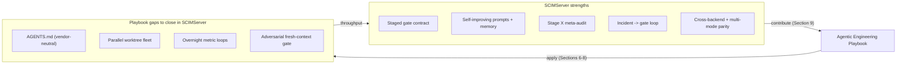
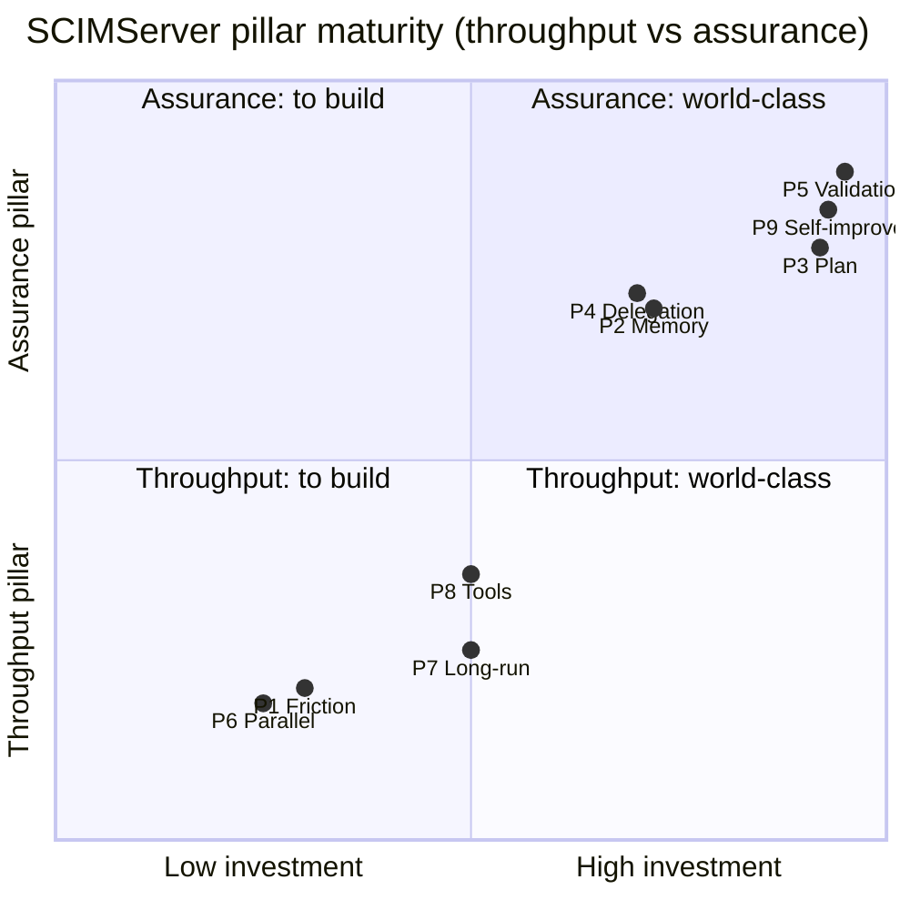
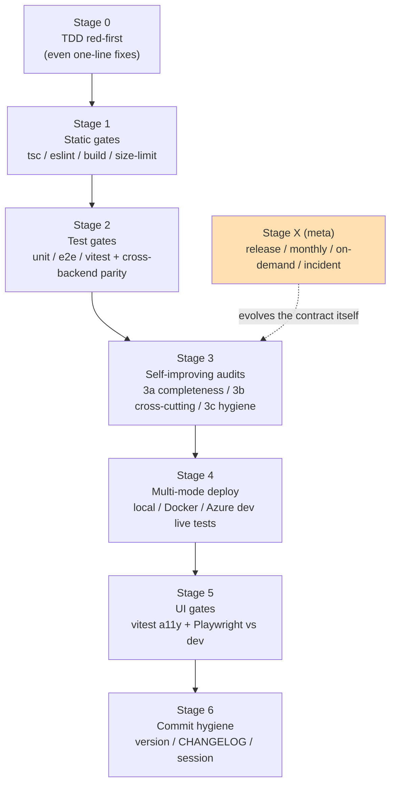
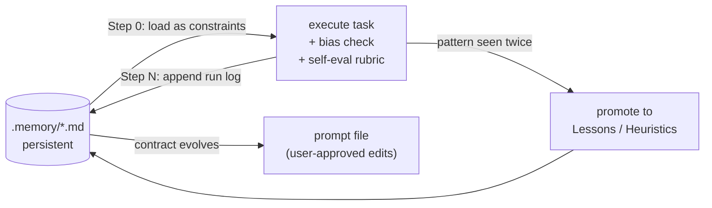
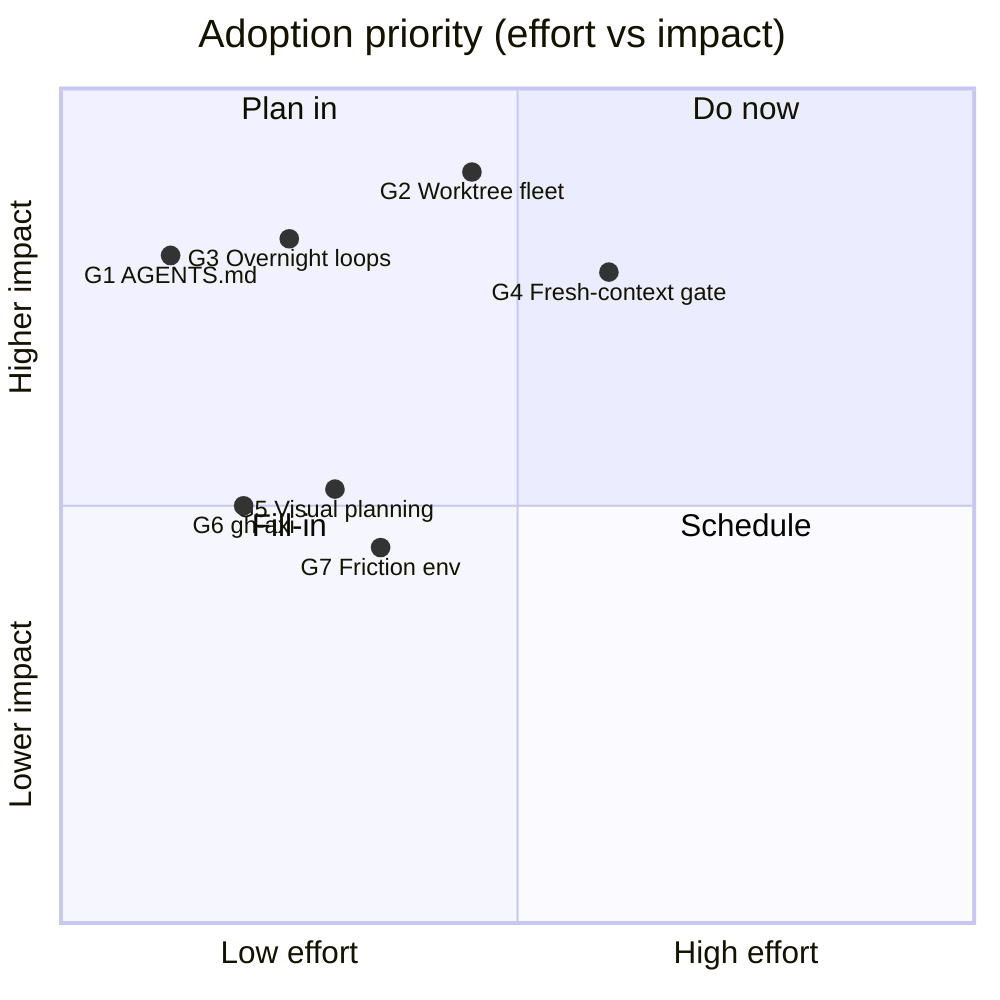
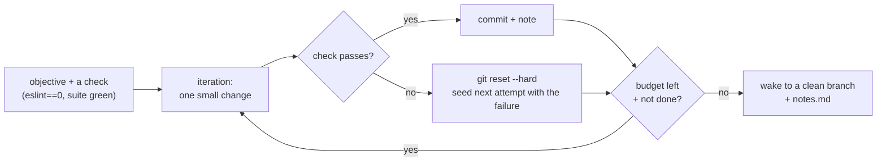
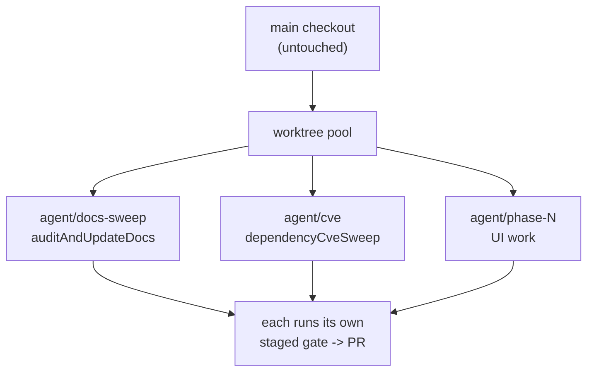
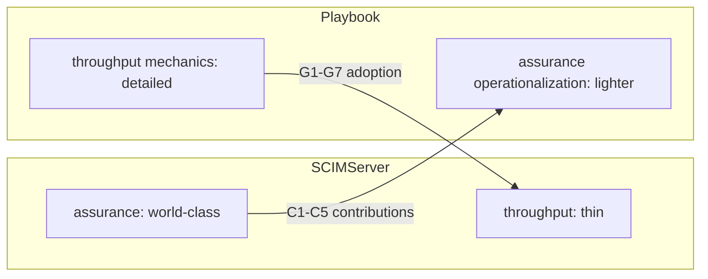

# Agentic Engineering: SCIMServer Analysis and Adoption Plan

> **Status:** Analysis (review-only; no code change in this document)
> **Version:** 1.0 - **Date:** 2026-06-24
> **Lens:** The Agentic Engineering Playbook (Kun Chen L8 workflow + AGENTS.md standard + GitHub Spec Kit + Anthropic Claude Code best practices), compiled at `../../../agentic-engineering-playbook/`
> **Source of truth for current practice:** [.github/copilot-instructions.md](../../.github/copilot-instructions.md), [.github/prompts/](../../.github/prompts/), [scripts/](../../scripts/), [Session_starter.md](../../Session_starter.md), [docs/CONTEXT_INSTRUCTIONS.md](../CONTEXT_INSTRUCTIONS.md)
> **Companion:** [strategy/SELF_AUDIT_2026-05-16.md](../strategy/SELF_AUDIT_2026-05-16.md), [strategy/SECURITY_INTAKE_2026-05-17.md](../strategy/SECURITY_INTAKE_2026-05-17.md)

---

## Table of Contents

- [1. Executive Summary](#1-executive-summary)
- [2. Scope and Method](#2-scope-and-method)
- [3. The Reference Model](#3-the-reference-model)
- [4. SCIMServer Scorecard](#4-scimserver-scorecard)
- [5. What SCIMServer Does Exceptionally Well](#5-what-scimserver-does-exceptionally-well)
  - [5.1 Staged quality gates as a binding contract](#51-staged-quality-gates-as-a-binding-contract)
  - [5.2 Self-improving prompts with persistent memory](#52-self-improving-prompts-with-persistent-memory)
  - [5.3 The meta-audit layer (Stage X)](#53-the-meta-audit-layer-stage-x)
  - [5.4 Incident-to-gate discipline](#54-incident-to-gate-discipline)
  - [5.5 Cross-backend and multi-mode parity](#55-cross-backend-and-multi-mode-parity)
  - [5.6 Response-contract and schema-characteristic testing](#56-response-contract-and-schema-characteristic-testing)
  - [5.7 Doc-as-context and three-layer session continuity](#57-doc-as-context-and-three-layer-session-continuity)
  - [5.8 Other notable strengths](#58-other-notable-strengths)
- [6. Gaps and Opportunities](#6-gaps-and-opportunities)
  - [G1. Vendor-neutral memory (AGENTS.md)](#g1-vendor-neutral-memory-agentsmd)
  - [G2. Parallel worktrees and a task fleet](#g2-parallel-worktrees-and-a-task-fleet)
  - [G3. Overnight orchestration for measurable metrics](#g3-overnight-orchestration-for-measurable-metrics)
  - [G4. Adversarial fresh-context validation gate](#g4-adversarial-fresh-context-validation-gate)
  - [G5. Interactive visual planning](#g5-interactive-visual-planning)
  - [G6. Agent-ergonomic tool I/O](#g6-agent-ergonomic-tool-io)
  - [G7. Frictionless, keyboard-first environment](#g7-frictionless-keyboard-first-environment)
- [7. Prioritized Adoption Roadmap](#7-prioritized-adoption-roadmap)
- [8. Step-by-Step Implementation Guides](#8-step-by-step-implementation-guides)
- [9. What Flows Back to the Playbook](#9-what-flows-back-to-the-playbook)
- [10. Risk, Safety, and Reversibility](#10-risk-safety-and-reversibility)
- [11. Appendix A: Pillar-by-Pillar Evidence](#11-appendix-a-pillar-by-pillar-evidence)
- [12. Appendix B: Ready-to-Paste AGENTS.md for SCIMServer](#12-appendix-b-ready-to-paste-agentsmd-for-scimserver)
- [13. References](#13-references)

---

## 1. Executive Summary

SCIMServer is, by the maturity model in the Agentic Engineering Playbook, a **Level 4+ ("manager-of-agents") operation** and in several dimensions it operates **beyond** what the playbook documents. Its 33-file prompt library, six-stage-plus-meta quality-gate contract, persistent prompt-memory files, and the formal "incident becomes a gate" discipline are a reference-grade instantiation of the playbook's hardest pillars (validation and self-improvement).

This document is a **two-way analysis**:

1. **What SCIMServer does so well that it should feed the playbook.** Five patterns here are stronger than anything currently in the playbook and are folded back into it (see [Section 9](#9-what-flows-back-to-the-playbook)): the staged-gate contract, the self-improving-prompt-with-memory pattern, the Stage X meta-audit cadence, the incident-to-gate loop, and cross-backend/multi-mode parity testing.

2. **What the playbook can bring to SCIMServer.** Despite its depth on *validation* and *self-improvement*, SCIMServer under-invests in *throughput* mechanics. The seven gaps in [Section 6](#6-gaps-and-opportunities) - led by the absence of a vendor-neutral `AGENTS.md`, the lack of a parallel-worktree fleet, and no overnight-loop orchestration for measurable-metric work - are where the largest remaining productivity gains sit.

The single highest-leverage, lowest-risk change is **G1: add a vendor-neutral `AGENTS.md`** so the substantial rule investment stops being locked to one agent vendor. The single highest-throughput change is **G2 + G3: parallelize independent work across git worktrees and send measurable-metric jobs (raise coverage, burn down the ESLint-warning and god-class baselines) to an overnight loop.**



---

## 2. Scope and Method

**In scope.** How SCIMServer uses AI coding agents to plan, build, validate, and ship; the artifacts that encode that workflow; and a concrete, sequenced plan to adopt the missing playbook practices.

**Out of scope.** SCIM protocol correctness, product features, and deployment topology, except where they illustrate an agentic-workflow point.

**Method.** Direct inspection of the prompt library, the orchestration scripts, the CI workflows, the session-continuity files, and the two strategy-audit outputs, scored against the playbook's nine pillars and five-level maturity model. Evidence is cited by file. No code or configuration was changed to produce this analysis.

**Evidence base (as of v0.53.0).** 33 prompt files under [.github/prompts/](../../.github/prompts/); a two-file persistent memory store under [.github/prompts/.memory/](../../.github/prompts/.memory/); ~50 PowerShell orchestration scripts under [scripts/](../../scripts/); 5 CI workflows under [.github/workflows/](../../.github/workflows/); the staged-gate contract in [.github/copilot-instructions.md](../../.github/copilot-instructions.md); and roughly 7,300 automated checks across six layers (API unit, API E2E, web vitest, Playwright, live SCIM, PowerShell) per [INDEX.md](../INDEX.md).

---

## 3. The Reference Model

The playbook defines nine pillars and a five-level maturity ladder. They are the yardstick for [Section 4](#4-scimserver-scorecard).

| Pillar | One-line definition |
|---|---|
| P1 Frictionless environment | Remove every micro-friction between a thought and a running agent (multiplexer, voice, remote control) |
| P2 Durable, lean memory | One memory file the agent reads every session; only what it cannot infer; pruned hard |
| P3 Plan before code | Get the plan confident first; the artifact, not the chat, is the source of truth |
| P4 Delegation discipline | Ask for outcomes with a why; never take back control |
| P5 Self-validation + adversarial review | Fresh-context review, end-to-end evidence, escalate intent decisions |
| P6 Parallelism without collisions | One worktree per task; keep status visible |
| P7 Long-running orchestration | Break big jobs into fresh-context loops with a budget |
| P8 Tool ergonomics for agents | Token-efficient CLIs over verbose ones; right-size MCP |
| P9 Self-improvement of the workflow | The system that ships your code gets better every time it is used |

| Level | Name | Hallmark |
|---|---|---|
| 0 | Chat copy-paste | Agent cannot run or see the repo |
| 1 | Single agent, supervised | You approve each action; no memory |
| 2 | Single agent, verified | Memory file + the agent verifies its own work |
| 3 | Plan, then autonomous | Plan first; agent runs unattended and self-validates |
| 4 | Fleet (manager-of-agents) | Many parallel tasks, each self-validating into a clean PR |

---

## 4. SCIMServer Scorecard

Scored 0-5 against each pillar, with the single most important piece of evidence.

| Pillar | Score | Evidence | Verdict |
|---|---|---|---|
| **P1** Frictionless env | 2 | Rich scripts, but no multiplexer/voice/remote-control practice documented; terminal history shows heavy manual `az`/`git` work | Under-invested |
| **P2** Durable memory | 4 | [copilot-instructions.md](../../.github/copilot-instructions.md) + [CONTEXT_INSTRUCTIONS.md](../CONTEXT_INSTRUCTIONS.md) + [Session_starter.md](../../Session_starter.md) are deep and disciplined - but **Copilot-only**, no `AGENTS.md` | Strong but vendor-locked |
| **P3** Plan before code | 5 | [promptChainArchitecture.prompt.md](../../.github/prompts/promptChainArchitecture.prompt.md) 12-stage methodology; RFC-style design docs precede code | Reference-grade |
| **P4** Delegation discipline | 4 | Outcome-oriented prompts; TDD red-first; escalate-to-human is codified | Strong |
| **P5** Validation + review | 5 | Six-stage gate contract; 7,300+ checks; multi-mode live tests - **with one gap:** review is in-session ([codeReviewSelfAudit](../../.github/prompts/codeReviewSelfAudit.prompt.md) is "suggestions not blocks"), not fresh-context adversarial | Reference-grade, one gap |
| **P6** Parallelism | 2 | Aware of worktrees (sibling `SCIMServer-az-tenant`); no pool, no fleet, largely sequential phase execution | Under-invested |
| **P7** Long-running orchestration | 3 | [run-all-gates.ps1](../../scripts/run-all-gates.ps1) orchestrates gates, but no overnight metric-improvement loop | Partial |
| **P8** Tool ergonomics | 3 | Uses raw `gh`/`az`; CodeQL + Trivy in CI; no agent-ergonomic (AXI/TOON) tool layer | Partial |
| **P9** Self-improvement | 5 | [selfImprovingTask](../../.github/prompts/selfImprovingTask.prompt.md) + [.memory/](../../.github/prompts/.memory/) + [gateStrategySelfAudit](../../.github/prompts/gateStrategySelfAudit.prompt.md) + [securityBestPracticesIntake](../../.github/prompts/securityBestPracticesIntake.prompt.md) with 4 trigger types | Beyond the playbook |



**Reading.** SCIMServer is saturated on the *assurance* pillars (plan, validate, self-improve) and thin on the *throughput* pillars (friction, parallelism, long-running, tools). It has optimized correctness to a world-class degree; the remaining gains are in how fast independent work moves through that machine.

---

## 5. What SCIMServer Does Exceptionally Well

These are the patterns worth preserving, codifying, and exporting. Each is genuinely strong; five of them are stronger than the current playbook and are folded back in ([Section 9](#9-what-flows-back-to-the-playbook)).

### 5.1 Staged quality gates as a binding contract

The validation pipeline is not a pile of scripts; it is a **contract** with numbered stages (0 through 6, plus a meta Stage X), where each stage names its gates, its constraint, and its expected artifact, and **no stage may be skipped without an explicit, logged choice**. [run-all-gates.ps1](../../scripts/run-all-gates.ps1) enforces the sequence and emits a PASS / FAIL / SKIPPED row per gate into a timestamped report.



Why it is exemplary: it turns the playbook's P5 ("require evidence, gate the stop") into an auditable, non-bypassable sequence. The phrase the repo enforces - aggregated claims like "all tests passed" are insufficient; only a per-gate row counts - is the discipline most teams lack.

### 5.2 Self-improving prompts with persistent memory

Two prompts - [promptChainArchitecture](../../.github/prompts/promptChainArchitecture.prompt.md) and [selfImprovingTask](../../.github/prompts/selfImprovingTask.prompt.md) - implement a closed learning loop that the playbook only gestures at. Each run:

1. **Step 0: loads** a memory file ([.memory/selfImprovingTask.memory.md](../../.github/prompts/.memory/selfImprovingTask.memory.md)) and treats its `Lessons Learned` / `Anti-Patterns Hit` / `Heuristics That Worked` sections as **binding constraints**.
2. **Executes** with explicit bias-removal phrases ("if I started from scratch with no prior context, what would I do differently?") and a self-evaluation rubric scored 1-5 per dimension.
3. **Step N: writes back** a run-log entry, and **promotes any pattern observed twice** from the run log into the top-level sections.



This is the operationalization of "write corrections into memory so they never recur" (playbook R5) taken to a higher form: the memory is a separate, versioned artifact with an explicit promotion rule, not a growing instruction blob.

### 5.3 The meta-audit layer (Stage X)

Above the per-commit gates sits a layer that audits **the gate strategy itself**. [gateStrategySelfAudit](../../.github/prompts/gateStrategySelfAudit.prompt.md) (internal drift) and [securityBestPracticesIntake](../../.github/prompts/securityBestPracticesIntake.prompt.md) (external landscape) run on four triggers - release cut, monthly calendar, on-demand, and incident-driven - and produce dated reports under [docs/strategy/](../strategy/). They carry hard constraints that most "self-improvement" hand-waving lacks:

- Every external claim **requires a URL citation** (no URL means "speculative - verify before action").
- Every finding carries a **confidence level** and an **owner action**.
- A **new prompt requires >= 2 escape-pattern matches**; a single escape goes into an existing prompt.
- **Retiring a prompt requires 30+ days of no-fire evidence**; ratcheting a baseline requires a measured snapshot.

The first two runs already paid off: the security intake caught four backlog items as already-active (removing false-negative noise) and one node-version drift, per [SECURITY_INTAKE_2026-05-17.md](../strategy/SECURITY_INTAKE_2026-05-17.md).

### 5.4 Incident-to-gate discipline

Every bug that escaped to dev or prod produced a **named standing rule plus a new gate**, in the same change that fixed it. This is the playbook's R19 with a rich worked history:

| Incident | Root cause | The gate it created |
|---|---|---|
| Finding-B (May 2026) | InMemory endpoint-create missing the duplicate-name guard Prisma had | Stage 2.5 [crossBackendParityAudit](../../.github/prompts/crossBackendParityAudit.prompt.md) |
| Group.displayName uniqueness flip | Hard-coded characteristic assertion | Schema-Characteristic Test Rule + helper |
| Finding-C (121-fail false signal) | Stale Playwright specs for deleted UI | Stage 5.2 [playwrightSpecHygieneAudit](../../.github/prompts/playwrightSpecHygieneAudit.prompt.md) |
| 48-PNG screenshot scandal | No screenshot retention rule | Deny-by-default `.gitignore` allowlist + [audit-screenshots.ps1](../../scripts/audit-screenshots.ps1) |
| Finding-D (CSS applied, layout not achieved) | Asserting CSS props, not measured bounds | Visual-layout assertion rules R1-R9 |

The lesson is structural: the repo never fixes a bug without asking "why did no gate catch this?" and closing that gap in the same commit chain. That is what makes its ruleset self-densify.

### 5.5 Cross-backend and multi-mode parity

Two parity disciplines stand out as broadly transferable:

- **Cross-backend parity.** The codebase runs identically on an InMemory backend and a Prisma/PostgreSQL backend. Any change touching an `isInMemoryBackend` branch must pass [crossBackendParityAudit](../../.github/prompts/crossBackendParityAudit.prompt.md) and the 6-mode [test-all-modes.ps1](../../scripts/test-all-modes.ps1) orchestrator.
- **Multi-mode live parity.** [live-test.ps1](../../scripts/live-test.ps1) runs the same 1,000+ SCIM assertions on the wire against local node, Docker compose, and Azure dev. A failure on one mode that passes on another is treated as a parity bug to fix at the source, never suppressed.

This is the strongest available answer to the playbook's "force end-to-end evidence" (P5): the same contract, proven on every deployment form factor.

### 5.6 Response-contract and schema-characteristic testing

Two crisp, exportable testing rules:

- **Response key allowlist.** API responses are asserted with `expect(ALLOWED_KEYS).toContain(key)`, never `toHaveProperty`. Internal fields prefixed with `_` must never appear. This catches undocumented-field leakage that property-presence checks miss. Enforced at [apiContractVerification](../../.github/prompts/apiContractVerification.prompt.md).
- **Effective-value testing (Schema-Characteristic Test Rule).** Tests against published schema characteristics check presence first and substitute the RFC 7643 §2.2 default when a characteristic is absent, rather than hard-coding an expected value. The general pattern - *assert against the effective value, not a hard-coded one* - applies to any spec-driven contract.

### 5.7 Doc-as-context and three-layer session continuity

A principle stated plainly in [promptChainArchitecture](../../.github/prompts/promptChainArchitecture.prompt.md): **"the document IS the persistent context; the conversation is not."** Each stage synthesizes a <= 200-word context block and updates a working draft, so the durable artifact carries forward, not the chat history. This is a sharper version of the playbook's P3 ("make the plan an artifact, not a chat").

Continuity is layered:

| Layer | File | Role |
|---|---|---|
| Project state | [Session_starter.md](../../Session_starter.md) | Update log, test counts, version, current phase |
| Domain constraints | [CONTEXT_INSTRUCTIONS.md](../CONTEXT_INSTRUCTIONS.md) | RFC gotchas, parity rules, the gate contract |
| Session lifecycle | [session-startup](../../.github/prompts/session-startup.prompt.md) + [sessionWrapUp](../../.github/prompts/sessionWrapUp.prompt.md) | Auto-load context in; persist achievements out |

### 5.8 Other notable strengths

- **Three-variant phase execution** (MVP / standard / enterprise) is a rigor dial the playbook lacks: [runPhaseWorkflowMvp](../../.github/prompts/runPhaseWorkflowMvp.prompt.md), [runPhaseWorkflow](../../.github/prompts/runPhaseWorkflow.prompt.md), [runPhaseWorkflowEnterprise](../../.github/prompts/runPhaseWorkflowEnterprise.prompt.md).
- **TDD red-first even for one-line fixes** (Stage 0) - the discipline that would have caught Finding-B at the unit level.
- **Endpoint-config-flag 10-cell completeness audit** ([endpointConfigFlagAudit](../../.github/prompts/endpointConfigFlagAudit.prompt.md)) - every flag must have registry + default + validator + enforcement + tests-per-layer + doc + UI control + UI test.
- **Deny-by-default artifact hygiene** - the screenshot `.gitignore` allowlist that makes the wrong outcome structurally impossible, not merely discouraged.

---

## 6. Gaps and Opportunities

Seven gaps, ordered by leverage. Each names the playbook pillar it closes, the concrete change, and the payoff. Step-by-step guides follow in [Section 8](#8-step-by-step-implementation-guides).

### G1. Vendor-neutral memory (AGENTS.md)

**Pillar:** P2, P8 (agent-agnostic). **Effort:** very low. **Impact:** high.

SCIMServer's rule investment is enormous but lives only in [copilot-instructions.md](../../.github/copilot-instructions.md) and the `.prompt.md` format, both GitHub Copilot conventions. There is **no `AGENTS.md` or `CLAUDE.md`**, so Claude Code, Codex, Cursor, Amp, Gemini CLI, and OpenCode cannot read any of it. This violates the playbook's agent-agnostic principle (R17): the repo cannot switch to whichever model is currently best without abandoning its own rules.

**Change.** Add a thin `AGENTS.md` at the repo root that states the non-negotiables (em-dash ban, TDD red-first, the six-stage gate names, the commit checklist) and points to the canonical detail. Symlink `CLAUDE.md` to it. Keep `copilot-instructions.md` as the Copilot-specific entry that also points at `AGENTS.md` so there is one source of truth. Ready-to-paste content is in [Appendix B](#12-appendix-b-ready-to-paste-agentsmd-for-scimserver).

### G2. Parallel worktrees and a task fleet

**Pillar:** P6. **Effort:** low to medium. **Impact:** very high (throughput).

The repo executes largely **one phase at a time**, yet it has many *independent* streams of work: the K/L/M/N UI phases, the 33 audit prompts, and the documentation sweeps rarely conflict. It is aware of worktrees (the sibling `SCIMServer-az-tenant` checkout) but has no pool and no fleet pattern, so independent work serializes on a single working directory.

**Change.** Adopt a worktree pool so each parallel agent gets a ready, dependency-warm, isolated checkout. The playbook ships a dependency-free helper ([parallel-agents.ps1](../../../agentic-engineering-playbook/scripts/parallel-agents.ps1)); [treehouse](https://github.com/kunchenguid/treehouse) is the richer option. Run independent audit prompts and independent UI phases concurrently, each in its own worktree, each ending at the same gate.

### G3. Overnight orchestration for measurable metrics

**Pillar:** P7. **Effort:** low. **Impact:** high.

SCIMServer carries several **measurable-metric backlogs that are ideal overnight-loop targets** - work where each iteration makes one small, committed, verifiable improvement while behavior stays unchanged:

- Burn down the **465-warning ESLint baseline** (copilot-instructions Stage 1.3) toward zero.
- Drive the **9 prod-file TypeScript errors** (Stage 1.4 baseline) to zero.
- Decompose the **SchemaValidator god class (~1,467 lines)** and **service-helpers (~1,230 lines)** flagged by the Design Deep Analysis.
- Raise **web vitest coverage** toward the next ratchet (the X.1 audit already flagged 3-6% headroom).

**Change.** Run these as bounded loops (the [gnhf](https://github.com/kunchenguid/gnhf) pattern: each iteration one small commit, auto-rollback on failure, a token budget) gated by the existing test suite so behavior cannot regress. The repo already has the perfect safety net - 7,300+ checks - which is exactly what makes an unattended loop safe here.

### G4. Adversarial fresh-context validation gate

**Pillar:** P5 (the one P5 gap). **Effort:** medium. **Impact:** high.

The repo's code review ([codeReviewSelfAudit](../../.github/prompts/codeReviewSelfAudit.prompt.md)) runs **in the same session** that wrote the code and is explicitly "suggestions, not blocks." The playbook's strongest validation rule (R9) is that a reviewer must run in a **fresh context** so it is not biased by the reasoning that produced the change. Finding-B and Finding-C are exactly the class a fresh-context adversarial reviewer catches.

**Change.** Add a blocking, fresh-context review step before push: either adopt a [no-mistakes](https://github.com/kunchenguid/no-mistakes)-style local git proxy (push to a gate that reviews in a disposable worktree, then forwards on green), or a lighter Writer/Reviewer split where a second agent session sees only the diff and the plan. This complements, not replaces, the staged gates.

### G5. Interactive visual planning

**Pillar:** P3. **Effort:** low. **Impact:** medium (UI work).

The 12-stage architecture methodology produces excellent **markdown** design docs. For the heavy UI redesign phases (K/L/M/N), a click-to-annotate **HTML** plan that matches the app's look and feel ([lavish](https://github.com/kunchenguid/lavish-axi)) lets the operator judge layout options visually and annotate elements directly rather than describing them in prose.

**Change.** For UI-facing plans, have the agent render options as an interactive HTML artifact opened in the browser, keeping the markdown design doc as the durable record.

### G6. Agent-ergonomic tool I/O

**Pillar:** P8. **Effort:** low. **Impact:** medium (token cost).

The workflow leans on raw `gh` and `az`. The heavy GitHub operations (PR creation, CI babysitting in the deployment prompts) are a measured cost/accuracy win for an agent-native interface: benchmarks show `gh-axi` at 100% success / ~$0.05 vs GitHub MCP at 87% / ~$0.15.

**Change.** Add `gh-axi` for GitHub operations and consider the TOON output format for the verbose live-test reporting. Reserve MCP for genuinely rich, stateful integrations.

### G7. Frictionless, keyboard-first environment

**Pillar:** P1. **Effort:** low. **Impact:** medium (operator throughput).

The terminal history shows substantial manual `az`/`git` work. Voice input, a multiplexer with per-agent status in tab titles, and Tailscale-plus-ssh remote control would cut the operator's own friction, which matters more as the fleet (G2) grows.

---

## 7. Prioritized Adoption Roadmap

Effort against impact. Start top-left.



| Wave | Items | Rationale |
|---|---|---|
| **Wave 1 (do now)** | G1 AGENTS.md, G3 overnight loops, G6 gh-axi | Lowest effort, immediate payoff; G1 unlocks vendor-agnosticism, G3 burns down standing baselines using the existing safety net |
| **Wave 2 (plan in)** | G2 worktree fleet, G5 visual planning | Throughput multipliers; G2 needs a short convention doc + the helper script |
| **Wave 3 (schedule)** | G4 fresh-context gate, G7 friction env | Higher effort; G4 should follow the next escaped-bug incident as its forcing function |

---

## 8. Step-by-Step Implementation Guides

Concrete, reversible steps. Each is a self-contained change that fits the repo's existing commit checklist.

### 8.1 G1 - Add a vendor-neutral AGENTS.md (Wave 1)

1. Create `AGENTS.md` at the repo root from [Appendix B](#12-appendix-b-ready-to-paste-agentsmd-for-scimserver). Keep it thin: non-negotiables plus pointers.
2. Symlink `CLAUDE.md` to it: `cmd /c mklink CLAUDE.md AGENTS.md` (or commit a one-line pointer file if symlinks are not permitted).
3. Add one line at the top of [copilot-instructions.md](../../.github/copilot-instructions.md): "Canonical cross-agent rules live in `AGENTS.md`; this file is the Copilot-specific superset."
4. Verify no em-dash (`Select-String -Pattern ([char]0x2014)`), then commit with the standard checklist.
5. **Reversible:** delete two files.

### 8.2 G3 - Overnight metric loops (Wave 1)

1. Pick one measurable target with an existing check, for example: "reduce ESLint warnings from 465 toward 0 without changing behavior; the full test suite must stay green."
2. Define the loop guardrails: one small commit per iteration, auto-rollback on any failing check, a token budget, and a stop condition (warnings == 0 or N iterations).
3. Run it against a dedicated `chore/eslint-burndown` branch (ideally inside a G2 worktree so it does not block other work).
4. In the morning, review the branch of clean commits and the run notes; cherry-pick or merge through the normal gates.
5. Repeat for the TypeScript-error baseline and the god-class decomposition.
6. **Reversible:** the loop only ever commits to its own branch; discard the branch to undo.



### 8.3 G6 - Agent-ergonomic GitHub I/O (Wave 1)

1. `npm install -g gh-axi` on the operator machine and CI runner.
2. Add to `AGENTS.md`: "Use `gh-axi` for GitHub operations (PRs, issues, workflow runs); fall back to `gh` if unavailable."
3. Spot-check one deployment-prompt flow that babysits CI; compare turn count and cost.
4. **Reversible:** remove the AGENTS.md line; `gh` remains.

### 8.4 G2 - Parallel worktree fleet (Wave 2)

1. Copy [parallel-agents.ps1](../../../agentic-engineering-playbook/scripts/parallel-agents.ps1) into `scripts/` (or install `treehouse`).
2. Write a short `docs/PARALLEL_AGENT_WORKFLOW.md`: how to start a task in a worktree, the naming convention (`agent/<slug>`), and the rule that each worktree runs its own gate before its PR.
3. Pilot: run two independent audit prompts (for example `auditAndUpdateDocs` and `dependencyCveSweep`) in two worktrees at once.
4. Add a pre-push reminder that each worktree must pass [pre-push-checks.ps1](../../scripts/pre-push-checks.ps1) independently.
5. **Reversible:** worktrees are disposable; `git worktree remove` cleans up.



### 8.5 G4 - Adversarial fresh-context gate (Wave 3)

1. Choose the mechanism: a [no-mistakes](https://github.com/kunchenguid/no-mistakes)-style local proxy, or a scripted Writer/Reviewer split using a second agent session.
2. Encode the reviewer prompt from the playbook ([no-mistakes.yaml](../../../agentic-engineering-playbook/templates/no-mistakes.yaml)): review the diff on its own terms against the plan, force E2E evidence, classify each finding SAFE-FIX vs ESCALATE.
3. Insert it as Stage 3c.0 (before the in-session [codeReviewSelfAudit](../../.github/prompts/codeReviewSelfAudit.prompt.md)) so the fresh-context pass happens first.
4. Trigger its adoption on the next escaped-bug incident, per the repo's own incident-to-gate discipline.
5. **Reversible:** it is an added gate; remove the stage to revert.

### 8.6 G5 and G7 (Wave 2-3)

- **G5:** for the next UI phase, ask the planning agent to also emit an interactive HTML option page; keep the markdown design doc as the record.
- **G7:** adopt a multiplexer with per-agent status in tab titles; bind a voice-to-text hotkey; put the dev machines on Tailscale for phone-based supervision of long gate runs.

---

## 9. What Flows Back to the Playbook

Five SCIMServer patterns are stronger than the current playbook and have been folded into it (see the playbook's updated Section 12 and ruleset):

| # | SCIMServer pattern | Playbook home |
|---|---|---|
| C1 | **Staged-gate contract** (numbered stages, no skip without a logged choice, per-gate PASS/FAIL/SKIPPED row) | New worked example under P5; a concrete instantiation of "gate the stop" |
| C2 | **Self-improving prompt with a separate `.memory` file** (Step 0 load as constraints, write-back, promote-on-second-occurrence) | Elevates P9 from "write corrections into memory" to a versioned, promotable memory artifact |
| C3 | **Stage X meta-audit cadence** (4 triggers; URL-citation + confidence + owner constraints; 2-escape rule for new gates; 30-day retirement) | New subsection of P9 / "Keeping this current" |
| C4 | **Incident-to-gate worked loop** (every escaped bug yields a named rule + a gate in the same change) | Strengthens R19 with real examples |
| C5 | **Cross-backend + multi-mode live parity** and **response-key-allowlist** testing | New optional advanced rules in the ruleset |

A sixth, **"the document is the persistent context, not the conversation,"** sharpens P3 and is added there.

### Bidirectional value



The two are complementary: SCIMServer hardens the playbook's assurance pillars with battle-tested mechanics; the playbook hands SCIMServer the throughput mechanics it has not yet built.

---

## 10. Risk, Safety, and Reversibility

| Change | Risk | Mitigation |
|---|---|---|
| G1 AGENTS.md | Drift between AGENTS.md and copilot-instructions | Make AGENTS.md the thin canonical pointer; copilot-instructions references it, not the reverse |
| G2 Worktree fleet | Parallel agents touch the same files | One worktree per task; each runs its own gate; the repo already forbids shared-directory parallel edits |
| G3 Overnight loops | Unattended change goes wrong | Loop commits only to its own branch; every iteration gated by the 7,300-check suite; token budget caps spend |
| G4 Fresh-context gate | Adds latency | It is additive and blocking only before push; tune which changes require it |
| G6 gh-axi | New dependency | Pure fallback to `gh`; remove one line to revert |

Every Wave-1 change is reversible by deleting one or two files or one instruction line. None touches production code paths, the SCIM contract, or deployment topology. The customer-facing prod promotion discipline (manual, canary-first, cross-tenant) is unaffected.

---

## 11. Appendix A: Pillar-by-Pillar Evidence

| Pillar | Strength evidence | Gap evidence | Action |
|---|---|---|---|
| P1 | Rich scripts | No multiplexer/voice/remote practice | G7 |
| P2 | copilot-instructions + CONTEXT + Session_starter | No AGENTS.md | G1 |
| P3 | promptChainArchitecture 12-stage; RFC design docs | Markdown-only plans for UI | G5 |
| P4 | Outcome prompts; TDD red-first | - | maintain |
| P5 | 6-stage contract; 7,300+ checks; multi-mode live | In-session review only | G4 |
| P6 | worktree-aware | No pool/fleet | G2 |
| P7 | run-all-gates orchestrator | No metric-improvement loop | G3 |
| P8 | CodeQL + Trivy | Raw gh/az; no AXI/TOON | G6 |
| P9 | selfImprovingTask + .memory + Stage X | - | maintain + export (C1-C5) |

---

## 12. Appendix B: Ready-to-Paste AGENTS.md for SCIMServer

Thin, canonical, cross-agent. Detailed rules stay in [copilot-instructions.md](../../.github/copilot-instructions.md); this file is what every non-Copilot agent reads.

```markdown
# AGENTS.md

> Cross-agent project memory for SCIMServer. The exhaustive ruleset lives in
> .github/copilot-instructions.md (the Copilot-specific superset) and
> docs/CONTEXT_INSTRUCTIONS.md. This file is the vendor-neutral source every
> coding agent reads. Keep it thin: non-negotiables plus pointers.

## Project overview
SCIM 2.0 server (NestJS + Prisma/PostgreSQL, React/Fluent web). Multi-endpoint,
profile-driven. Two persistence backends (InMemory + Prisma) that MUST behave
identically. RFC 7643 (schema) + RFC 7644 (protocol) are the contract.

## Setup and run
- API: `cd api; npm install; npm run build; node dist/main.js` (port 6000, InMemory)
- Web: `cd web; npm install; npm run dev` (port 4000)
- Docker: `docker compose up -d api` (port 8080, Prisma)

## Test commands (run and fix before finishing)
- API unit: `cd api; npm test`
- API E2E: `cd api; npm run test:e2e`
- Web: `cd web; npm test`
- All backends: `pwsh scripts/test-all-modes.ps1`
- Live SCIM (local): `pwsh scripts/live-test.ps1`

## How to validate a change end-to-end
Unit tests are not enough. Run the matching live-test.ps1 section against local
node AND Docker (`-BaseUrl http://localhost:8080 -ClientSecret changeme-oauth`).
For UI changes, add a Playwright spec runnable against local/Docker/Azure dev.
Attach evidence to the PR.

## Non-negotiables
- NEVER use em-dash (U+2014) anywhere. Use a single hyphen. Verify with
  `Select-String -Pattern ([char]0x2014)`.
- TDD red-first, even for one-line fixes (Stage 0).
- Cross-backend parity: any file with an isInMemoryBackend branch must behave
  identically in both backends (run crossBackendParityAudit).
- Response contracts: assert key allowlists (`expect(ALLOWED_KEYS).toContain(key)`),
  never `toHaveProperty`. Internal `_`-prefixed fields must never appear in responses.
- Schema-characteristic tests: check presence, substitute the RFC 7643 2.2 default
  when absent; never hard-code an expected characteristic value.
- Feature/bug-fix commit checklist: unit + e2e + live + doc + INDEX.md + CHANGELOG.md
  + Session_starter.md + version bump + response-contract test.
- Git: `git add -A; git commit -m "..."`. Never `--amend` pushed commits, never
  `--force` push, never `--no-verify`.

## Quality gates (the contract)
Six stages plus a meta stage. Do not skip a stage without a logged choice. Full
definition: .github/copilot-instructions.md (Mandatory Quality Gates) and
.github/prompts/devDeploymentPipeline.prompt.md.

## Cross-harness notes
- GitHub Copilot reads .github/copilot-instructions.md (superset of this file).
- Claude Code: CLAUDE.md symlinks to this file.
- Prefer `gh` (or `gh-axi`) for GitHub operations.
```

---

## 13. References

**SCIMServer artifacts**
- [.github/copilot-instructions.md](../../.github/copilot-instructions.md) - the staged-gate contract and standing rules
- [.github/prompts/](../../.github/prompts/) - 33 structured prompts (plan, audit, deploy, meta)
- [.github/prompts/.memory/](../../.github/prompts/.memory/) - persistent prompt-memory store
- [scripts/run-all-gates.ps1](../../scripts/run-all-gates.ps1), [scripts/test-all-modes.ps1](../../scripts/test-all-modes.ps1), [scripts/live-test.ps1](../../scripts/live-test.ps1), [scripts/dev-deployment-pipeline.ps1](../../scripts/dev-deployment-pipeline.ps1)
- [docs/strategy/SELF_AUDIT_2026-05-16.md](../strategy/SELF_AUDIT_2026-05-16.md), [docs/strategy/SECURITY_INTAKE_2026-05-17.md](../strategy/SECURITY_INTAKE_2026-05-17.md)

**The Agentic Engineering Playbook** (compiled at `../../../agentic-engineering-playbook/`, mirrored at https://github.com/pranems/agentic-engineering-playbook)
- Master playbook (9 pillars, maturity model, daily loop), the 20-rule ruleset, and the automation scripts referenced in [Section 8](#8-step-by-step-implementation-guides)

**External sources**
- Kun Chen, *An Ex-Meta L8's Agentic Engineering Setup* - https://blog.bytebytego.com/p/an-ex-meta-l8s-agentic-engineering
- AGENTS.md open standard - https://agents.md/
- GitHub Spec Kit - https://github.com/github/spec-kit
- Anthropic, *Claude Code best practices* - https://www.anthropic.com/engineering/claude-code-best-practices
- treehouse - https://github.com/kunchenguid/treehouse - gnhf - https://github.com/kunchenguid/gnhf - no-mistakes - https://github.com/kunchenguid/no-mistakes

---

> This is a review-only analysis. Adoption items G1-G7 are sequenced in [Section 7](#7-prioritized-adoption-roadmap); each is independently reversible and fits the existing commit checklist. Contributions C1-C5 to the playbook are recorded in [Section 9](#9-what-flows-back-to-the-playbook).
