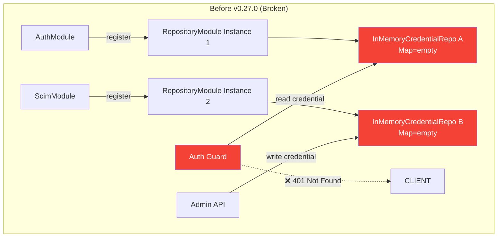
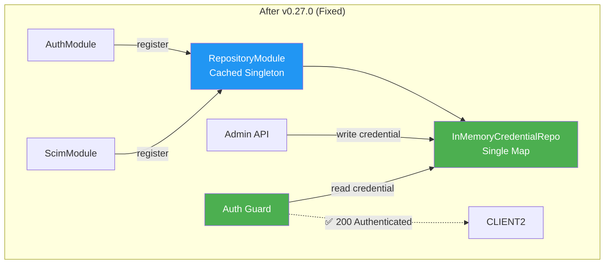
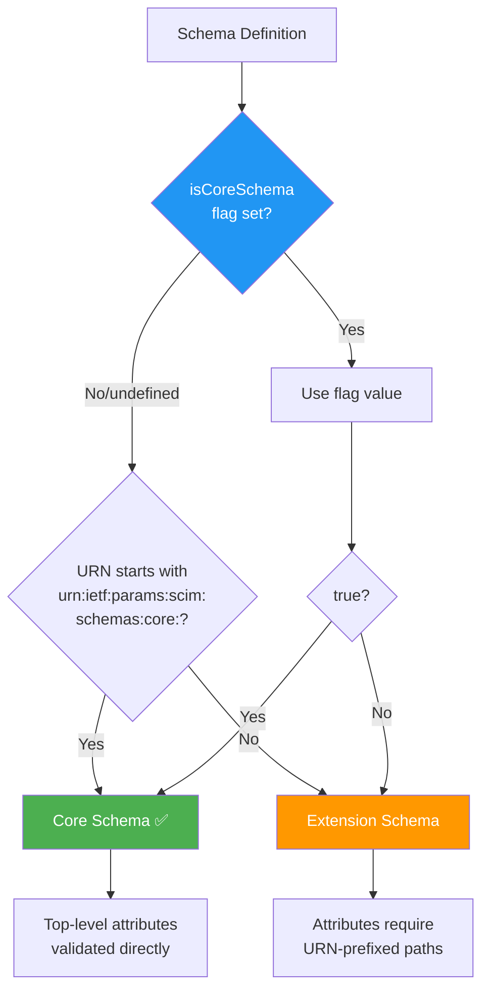
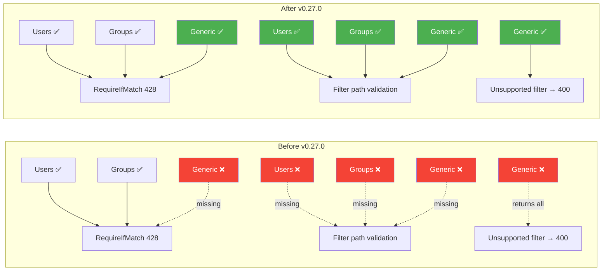

# CL v0.27.0 - InMemory Backend Bug Fixes, Generic Service Parity & P3 Attribute Gaps

> **Document Purpose**: Changelist summary for v0.27.0 - all changes, root causes, fixes, file inventory, test coverage, deployment validation, and remaining work.
>
> **Date**: March 3, 2026
> **Version**: v0.27.0
> **Previous Version**: v0.26.0
> **Author**: Copilot + v-prasrane
> **RFC References**: RFC 7643 §2 (Attribute Characteristics), RFC 7644 §3.5/§3.7/§3.14 (PUT/PATCH/ETags)

---

## Table of Contents

- [1. Summary](#1-summary)
- [2. Changes - Generic Service Parity (3 P0 Fixes)](#2-changes--generic-service-parity-3-p0-fixes)
- [3. Changes - InMemory Backend Bugs (4 Fixes)](#3-changes--inmemory-backend-bugs-4-fixes)
- [4. Changes - Live Test Script Fix](#4-changes--live-test-script-fix)
- [5. Changes - Documentation Audit (10 Files)](#5-changes--documentation-audit-10-files)
- [6. File Inventory](#6-file-inventory)
- [7. Architecture Diagrams](#7-architecture-diagrams)
- [8. Test Coverage](#8-test-coverage)
- [9. Deployment Validation](#9-deployment-validation)
- [10. Remaining Work](#10-remaining-work)
- [11. Cross-References](#11-cross-references)

---

## 1. Summary

v0.27.0 addresses **8 issues** (3 P0 generic service parity gaps + 4 inmemory backend bugs + 1 live test script bug) and completes a full documentation freshness audit. All 3 deployment types (local inmemory, Docker Prisma, Azure Prisma) produce identical live test results: **647 pass / 12 pre-existing gaps / 659 total**.

| Category | Count | Severity |
|---|:---:|---|
| Generic Service Parity Fixes | 3 | P0 |
| InMemory Backend Bugs | 4 | P0 (blocking) |
| Live Test Script Fixes | 1 | Medium |
| Documentation Updates | 10 files | Maintenance |
| **Total code changes** | **8 fixes** | |

---

## 2. Changes - Generic Service Parity (3 P0 Fixes)

These closed the top 3 remaining P0 gaps from the [P3 re-audit](P3_REMAINING_ATTRIBUTE_CHARACTERISTIC_GAPS.md), bringing Generic custom-resource service behavior in line with Users/Groups.

### Fix #1 - RequireIfMatch 428 Parity

| Aspect | Detail |
|---|---|
| **Problem** | Generic PUT/PATCH/DELETE called `assertIfMatch()` (returns 412 on mismatch but does nothing when header is absent). Users/Groups called `enforceIfMatch()` which also returns 428 when `RequireIfMatch` is enabled and the header is missing. |
| **Why it matters** | Endpoints configured with `RequireIfMatch: true` silently accepted Generic resource mutations without an `If-Match` header - a data integrity hole compared to Users/Groups. |
| **Fix** | Replaced `assertIfMatch()` → `enforceIfMatch()` in `endpoint-scim-generic.service.ts` for PUT, PATCH, and DELETE. |
| **RFC** | RFC 7644 §3.14 - conditional request headers |
| **Files** | `api/src/modules/scim/services/endpoint-scim-generic.service.ts` |

### Fix #2 - Filter Attribute Path Validation

| Aspect | Detail |
|---|---|
| **Problem** | `SchemaValidator.validateFilterAttributePaths()` existed but was never wired into runtime filter paths. Unknown filter attributes (e.g., `filter=fakeAttr eq "x"`) silently passed through, returning unfiltered results instead of 400. |
| **Why it matters** | Clients with typos in filter expressions got all records back with 200 instead of an error - violates RFC 7644 §3.4.2.2 expectation that invalid filter paths produce `invalidFilter`. |
| **Fix** | Integrated `validateFilterAttributePaths()` into `listUsersForEndpoint()`, `listGroupsForEndpoint()`, and `listResources()`. Unknown filter attributes now return `400 invalidFilter`. |
| **Files** | `api/src/modules/scim/services/endpoint-scim-users.service.ts`, `endpoint-scim-groups.service.ts`, `endpoint-scim-generic.service.ts` |

### Fix #3 - Generic Filter 400 on Unsupported Expressions

| Aspect | Detail |
|---|---|
| **Problem** | `parseSimpleFilter()` returned `undefined` for unsupported operators/attributes, causing the caller to skip filtering and return all records. |
| **Why it matters** | `filter=userName co "j"` on a Generic resource returned all records with 200 instead of 400, leaking data and confusing clients. |
| **Fix** | `parseSimpleFilter()` now throws `400 invalidFilter` for unsupported filter operators/attributes. |
| **Files** | `api/src/modules/scim/services/endpoint-scim-generic.service.ts` |

---

## 3. Changes - InMemory Backend Bugs (4 Fixes)

Discovered during live testing with `PERSISTENCE_BACKEND=inmemory`. All 4 were **blocking** - the inmemory backend was non-functional for custom resource types and per-endpoint credentials.

### Bug #1 - AdminSchemaController InMemory Incompatibility

| Aspect | Detail |
|---|---|
| **Symptom** | `GET /admin/endpoints/:id/schemas` and all Admin Schema API endpoints returned 500 when `PERSISTENCE_BACKEND=inmemory`. |
| **Root Cause** | `AdminSchemaController` injected `PrismaService` directly and called `prisma.endpoint.findUnique()`. With inmemory backend, `PrismaService` is null - there's no Prisma instance. |
| **Fix** | Replaced `PrismaService` injection with `EndpointService.getEndpoint()` + `requireEndpoint()` helper, which works for both Prisma and inmemory backends. |
| **Files** | `api/src/modules/scim/controllers/admin-schema.controller.ts`, `admin-schema.controller.spec.ts` |

### Bug #2 - Custom Resource Types Missing Core Schema Definition

| Aspect | Detail |
|---|---|
| **Symptom** | Creating a custom resource type (e.g., "Device") via Admin API succeeded, but subsequent `POST /scim/endpoints/:id/Devices` returned `400 invalidValue` with "Schema definition not found for URN". |
| **Root Cause** | `ScimSchemaRegistry.registerResourceType()` registered the resource type metadata but did not create a `SchemaDefinition` for the core schema URN. The validator then failed because it couldn't find the schema to validate against. |
| **Fix** | Auto-generate a stub core schema definition (with `id`, `externalId`, `displayName`, `active` attributes) in `registerResourceType()` when no existing schema definition is found for the core schema URN. |
| **Files** | `api/src/modules/scim/services/scim-schema-registry.ts` |

### Bug #3 - SchemaValidator Hardcoded Core Schema Prefix

| Aspect | Detail |
|---|---|
| **Symptom** | Custom resource types with non-standard URNs (e.g., `urn:example:schemas:Device`) had top-level attributes like `displayName` rejected as invalid - the validator treated the core schema as an extension. |
| **Root Cause** | `SchemaValidator` used `schema.id.startsWith('urn:ietf:params:scim:schemas:core:')` in 5 locations to decide core vs extension behavior. Custom URNs that don't start with the IETF prefix were misclassified as extensions, causing top-level attributes to be routed through extension validation logic (which expects URN-prefixed paths). |
| **Fix** | Added `isCoreSchema?: boolean` optional flag to the `SchemaDefinition` interface and a module-level `isCoreSchema()` helper: |

```typescript
// schema-validator.ts
function isCoreSchema(schema: SchemaDefinition): boolean {
  if (schema.isCoreSchema !== undefined) return schema.isCoreSchema;
  return schema.id.startsWith('urn:ietf:params:scim:schemas:core:');
}
```

Updated 5 locations in `schema-validator.ts`:
1. `validate()` - core vs extension attribute routing
2. `checkImmutable()` - core vs extension immutable attribute collection
3. `validateFilterAttributePaths()` - core vs extension filter path resolution
4. `validatePatchOperationValue()` - core vs extension PATCH op value validation
5. `collectReadOnlyAttributes()` - core vs extension readOnly attribute collection

Set `isCoreSchema: true` on core schema definitions built by:
- `endpoint-scim-generic.service.ts` (2 methods)
- `scim-service-helpers.ts` (2 methods)

| **Files** | `api/src/modules/scim/services/schema-validator.ts`, `validation-types.ts`, `endpoint-scim-generic.service.ts`, `scim-service-helpers.ts`, `scim-service-helpers.spec.ts` |

### Bug #4 - RepositoryModule Duplicate InMemory Instances

| Aspect | Detail |
|---|---|
| **Symptom** | Per-endpoint credential authentication always failed with inmemory backend. Admin API created credentials successfully, but the SCIM guard rejected them with 401. |
| **Root Cause** | `RepositoryModule.register()` was called from both `AuthModule` and `ScimModule`. Each call created a **separate** `InMemoryEndpointCredentialRepository` with its own `Map` store. Admin writes went to one instance; the auth guard reads from another. The guard's instance was always empty. |
| **Fix** | Added static module-level caching to `RepositoryModule`: |

```typescript
// repository.module.ts
private static cachedModule: DynamicModule | null = null;
private static cachedBackend: string | null = null;

static register(): DynamicModule {
  const backend = process.env.PERSISTENCE_BACKEND || 'prisma';
  if (this.cachedModule && this.cachedBackend === backend) {
    return this.cachedModule;
  }
  // ... build module ...
  this.cachedModule = module;
  this.cachedBackend = backend;
  return module;
}

static resetCache(): void {
  this.cachedModule = null;
  this.cachedBackend = null;
}
```

Added `resetCache()` call in `repository.module.spec.ts` `afterEach` to prevent test cross-contamination.

| **Files** | `api/src/modules/repository/repository.module.ts`, `repository.module.spec.ts` |

---

## 4. Changes - Live Test Script Fix

| Aspect | Detail |
|---|---|
| **Problem** | Test 9x.15 (`excludedAttributes` on `.search` POST) sent `excludedAttributes` as a PowerShell array `@("id")` instead of a string `"id"`. The server received `["id"]` in JSON, which violated the SCIM spec (expects comma-separated string), causing a 400 error and script crash. |
| **Fix** | Changed `@("id")` → `"id"` in `scripts/live-test.ps1` test 9x.15. |
| **Files** | `scripts/live-test.ps1` |

---

## 5. Changes - Documentation Audit (10 Files)

A two-pass documentation freshness audit updated 10 files with ~20 stale items:

| File | Updates |
|---|---|
| `CHANGELOG.md` | Added Bug #1-4 entries, live test script fix, updated live counts to 659 |
| `Session_starter.md` | New achievement entry, updated Current Focus, live test counts |
| `docs/DEPLOYMENT_INSTANCES_AND_COSTS.md` | Live test counts ×3, GHCR image tag 0.24.0→0.27.0, local credentials, update log |
| `docs/PROJECT_HEALTH_AND_STATS.md` | Live 659, total ~4,051, pass rate 99.7% |
| `docs/P3_REMAINING_ATTRIBUTE_CHARACTERISTIC_GAPS.md` | Added live count to totals line |
| `docs/CONTEXT_INSTRUCTIONS.md` | Updated test status noting 12 pre-existing gaps |
| `README.md` | Test counts with specific numbers |
| `docs/images/readme/version-latest.json` | migratePhase updated to v0.27.0 |
| `.github/prompts/addMissingTests.prompt.md` | Live baseline 659 |
| `.github/prompts/fullValidationPipeline.prompt.md` | All 3 baselines updated, local env vars fixed |

---

## 6. File Inventory

### Source Code Changes

| File | Change Type | Lines Changed | Description |
|---|---|:---:|---|
| `api/src/modules/scim/services/endpoint-scim-generic.service.ts` | Modified | ~30 | assertIfMatch→enforceIfMatch, validateFilterPaths, parseSimpleFilter 400, isCoreSchema flag |
| `api/src/modules/scim/services/schema-validator.ts` | Modified | ~25 | Added `isCoreSchema()` helper, replaced 5 `startsWith()` checks |
| `api/src/modules/scim/services/validation-types.ts` | Modified | ~3 | Added `isCoreSchema?: boolean` to `SchemaDefinition` |
| `api/src/modules/scim/services/scim-service-helpers.ts` | Modified | ~4 | Set `isCoreSchema: true` on core schemas (2 methods) |
| `api/src/modules/scim/services/scim-service-helpers.spec.ts` | Modified | ~4 | Updated 2 assertions to include `isCoreSchema` |
| `api/src/modules/scim/services/scim-schema-registry.ts` | Modified | ~30 | Auto-generate stub core schema on registerResourceType |
| `api/src/modules/scim/controllers/admin-schema.controller.ts` | Modified | ~10 | PrismaService → EndpointService |
| `api/src/modules/scim/controllers/admin-schema.controller.spec.ts` | Modified | ~5 | Mock updated |
| `api/src/modules/repository/repository.module.ts` | Modified | ~20 | Static caching + resetCache() |
| `api/src/modules/repository/repository.module.spec.ts` | Modified | ~3 | afterEach resetCache() |
| `scripts/live-test.ps1` | Modified | ~1 | excludedAttributes array→string |

### Documentation Changes

| File | Change Type |
|---|---|
| `CHANGELOG.md` | Updated |
| `Session_starter.md` | Updated |
| `README.md` | Updated |
| `docs/DEPLOYMENT_INSTANCES_AND_COSTS.md` | Updated |
| `docs/PROJECT_HEALTH_AND_STATS.md` | Updated |
| `docs/P3_REMAINING_ATTRIBUTE_CHARACTERISTIC_GAPS.md` | Updated |
| `docs/CONTEXT_INSTRUCTIONS.md` | Updated |
| `docs/images/readme/version-latest.json` | Updated |
| `.github/prompts/addMissingTests.prompt.md` | Updated |
| `.github/prompts/fullValidationPipeline.prompt.md` | Updated |

---

## 7. Architecture Diagrams

### Bug Fix Flow - InMemory Backend





### isCoreSchema Resolution Flow



### Generic Service Parity Enforcement



---

## 8. Test Coverage

### New Tests Added in v0.27.0

| Suite | File | Tests Added | Description |
|---|---|:---:|---|
| Unit | `endpoint-scim-generic.service.spec.ts` | 9 | Boolean coercion, returned:never, readOnly stripping, immutable, uniqueness |
| Unit | `endpoint-scim-users.service.spec.ts` | 1 | Unknown filter → 400 |
| Unit | `endpoint-scim-groups.service.spec.ts` | 1 | Unknown filter → 400 |
| Unit | `scim-service-helpers.spec.ts` | 5+2 | validatePayload strict, checkImmutable strict, isCoreSchema assertions |
| Unit | `schema-validator.spec.ts` | 6 | validateFilterAttributePaths bindings |
| Unit | `requireifmatch*.spec.ts` | 3 | Generic 428 RequireIfMatch |
| E2E | `generic-parity-fixes.e2e-spec.ts` | 15 | Filter 400, RequireIfMatch 428, If-Match 204 |
| Live | Section 9y | 11 | InMemory-specific + generic parity |
| **Total new** | | **~53** | |

### Cumulative Test Counts

| Suite | Count | Suites | Delta vs v0.26.0 |
|---|:---:|:---:|---|
| Unit | 2,741 | 73 | +24 |
| E2E | 651 | 32 | +15 |
| Live | 659 (647 pass, 12 gaps) | - | +89 |
| **Total** | **4,051** | **105** | **+128** |

### 12 Pre-Existing Live Test Gaps (Not Regressions)

These are **feature gaps** identified by live tests - not regressions from this CL:

| Tests | Category | Expected | Actual | Gap |
|---|---|---|---|---|
| 9w.1-2 | Content-Type negotiation | 415 | 200 | Server accepts `text/xml`, `application/xml` |
| 9w.5-6 | Collection methods | 404/405 | Other | PUT/PATCH/DELETE on collection endpoints |
| 9w.10, 9w.12 | Immutable enforcement | 400 | 200 | Non-strict mode allows immutable mutation |
| 9x.1-2, 9x.4-6 | Uniqueness on PUT/PATCH | 409 | 200 | userName/externalId collision not detected |
| 9x.8 | Required field on PUT | 400 | 200 | Missing required userName accepted |

---

## 9. Deployment Validation

All 3 deployment types were rebuilt, deployed, and validated with identical results:

| Instance | URL | Backend | Auth Secret | Live Result |
|---|---|---|---|---|
| Local | `http://localhost:6000` | inmemory | `localoauthsecret123` | 647/12/659 ✅ |
| Docker | `http://localhost:8080` | Prisma/PostgreSQL | `devscimclientsecret` | 647/12/659 ✅ |
| Azure | `https://scimserver2.yellowsmoke-af7a3fff.eastus.azurecontainerapps.io` | Prisma/PostgreSQL | `changeme-oauth` | 647/12/659 ✅ |

**GHCR Image**: `ghcr.io/pranems/scimserver:0.27.0` (sha256:7787e05bbd4fdb222bed9009700c3b533ac7ac713adbb55ed035c43a3693a829)

---

## 10. Remaining Work

### 10a. Pre-Existing Feature Gaps (from P3 Audit)

10 gaps remain from the [P3 attribute characteristic audit](P3_REMAINING_ATTRIBUTE_CHARACTERISTIC_GAPS.md):

| Priority | ID | Gap | Severity |
|---|---|---|---|
| **P1** | G1 | Immutable enforcement only active in strict mode | Medium |
| **P1** | G2 | Required attribute enforcement only in strict mode | Medium |
| **P1** | G6 | Generic filter engine limited to `eq` only | Medium |
| **P2** | G3 | Schema-declared uniqueness on arbitrary attributes not enforced | Medium |
| **P2** | G7 | Generic sorting is in-memory (performance) | Low |
| **P2** | G9 | No type coercion beyond booleans | Low |
| **P3** | G4 | referenceTypes not validated | Low |
| **P3** | G5 | $ref URI not systematically generated | Low |
| **P3** | G8 | caseExact on DB filter push-down not schema-driven | Low |
| **P3** | G10 | caseExact not enforced on uniqueness checks | Low |

### 10b. 12 Live Test Failures (Pre-Existing)

Pre-existing feature gaps captured by live tests (see §8 table above). These are tracked in sections 9w and 9x of `scripts/live-test.ps1`.

### 10c. Security & Runtime Tech Debt

| Item | Description | Status |
|---|---|---|
| Legacy API token | `AUTH_TOKEN` env var still checked as fallback auth | Tracked |
| Console.log usage | Some modules use `console.log` instead of NestJS Logger | Tracked |
| CORS | Currently `*` - needs origin restriction for production | Tracked |
| `/scim/v2` rewrite | URL prefix not normalized to `/scim/v2` per RFC 7644 §1.3 | Tracked |

### 10d. Queued Tasks

| Task | Description | Status |
|---|---|---|
| Logic App Validation | Deploy Microsoft SCIM Logic App Validation template to `scimserver-rg`, run against Azure instance, analyze results | Queued |
| GHCR CI/CD | Automate Docker image push on tag via GitHub Actions | Not started |

---

## 11. Cross-References

| Document | Relevance |
|---|---|
| [P3_REMAINING_ATTRIBUTE_CHARACTERISTIC_GAPS.md](P3_REMAINING_ATTRIBUTE_CHARACTERISTIC_GAPS.md) | Full RFC §2 audit with enforcement matrix - 10 remaining gaps |
| [ISSUES_BUGS_ROOT_CAUSE_ANALYSIS.md](ISSUES_BUGS_ROOT_CAUSE_ANALYSIS.md) | Historical bug index (11 issues pre-v0.27.0) |
| [PROJECT_HEALTH_AND_STATS.md](PROJECT_HEALTH_AND_STATS.md) | Living stats - 4,051 total tests, 99.7% pass rate |
| [DEPLOYMENT_INSTANCES_AND_COSTS.md](DEPLOYMENT_INSTANCES_AND_COSTS.md) | Instance connection info, credentials, Azure costs |
| [CHANGELOG.md](../CHANGELOG.md) | Full version history |
| [G8B_CUSTOM_RESOURCE_TYPE_REGISTRATION.md](G8B_CUSTOM_RESOURCE_TYPE_REGISTRATION.md) | Custom resource type architecture (context for Bug #2 and #3) |
| [SCHEMA_LIFECYCLE_AND_REGISTRY.md](SCHEMA_LIFECYCLE_AND_REGISTRY.md) | Schema registry internals (context for Bug #2) |
| [G11_PER_ENDPOINT_CREDENTIALS.md](G11_PER_ENDPOINT_CREDENTIALS.md) | Per-endpoint credential architecture (context for Bug #4) |
| [ENDPOINT_CONFIG_FLAGS_REFERENCE.md](ENDPOINT_CONFIG_FLAGS_REFERENCE.md) | RequireIfMatch flag reference (context for Fix #1) |

---

*Document generated 2026-03-03. Source code is the single source of truth - not this document.*
