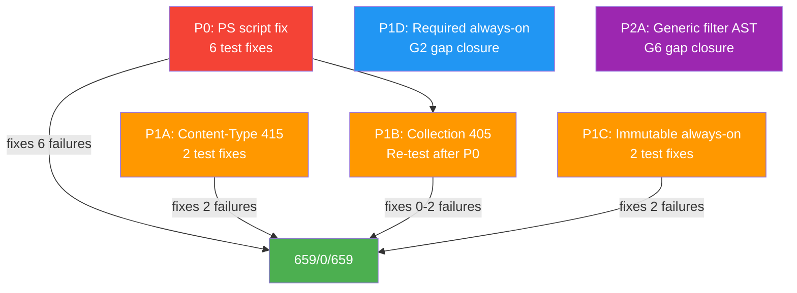
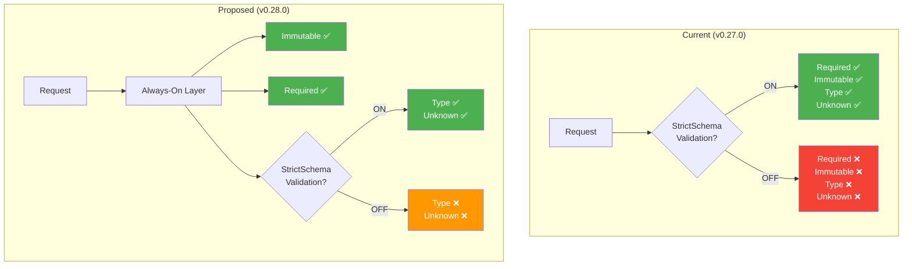
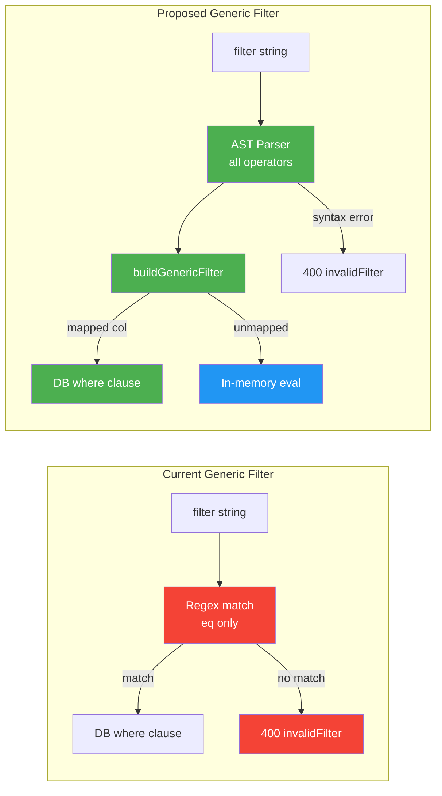

# Next Items - v0.28.0 Roadmap

> **Purpose**: Prioritized work items for the next release, with rationale, impact analysis, and proposed fixes.
>
> **Date**: March 3, 2026
> **Current Version**: v0.28.0
> **Proposed Version**: v0.28.0
> **Status**: Released
> **Derived From**: [P3 Remaining Gaps](P3_REMAINING_ATTRIBUTE_CHARACTERISTIC_GAPS.md), [CL v0.27.0](CL_V0.27.0_INMEMORY_BUGFIXES_AND_GENERIC_PARITY.md), live test analysis

---

## Table of Contents

- [1. Executive Summary](#1-executive-summary)
- [2. Priority Matrix](#2-priority-matrix)
- [3. P0 - Live Test Infrastructure Fix (5 uniqueness + 1 required)](#3-p0--live-test-infrastructure-fix-5-uniqueness--1-required)
- [4. P1A - Content-Type Negotiation (HTTP 415)](#4-p1a--content-type-negotiation-http-415)
- [5. P1B - Collection-Level Method Rejection (HTTP 405)](#5-p1b--collection-level-method-rejection-http-405)
- [6. P1C - Immutable Enforcement Always-On](#6-p1c--immutable-enforcement-always-on)
- [7. P1D - Required Attribute Enforcement Always-On](#7-p1d--required-attribute-enforcement-always-on)
- [8. P2A - Generic Filter Engine Upgrade (AST-based)](#8-p2a--generic-filter-engine-upgrade-ast-based)
- [9. Deferred Items (P2–P3)](#9-deferred-items-p2p3)
- [10. Estimated Impact](#10-estimated-impact)
- [11. Architecture Diagrams](#11-architecture-diagrams)
- [12. Cross-References](#12-cross-references)

---

## 1. Executive Summary

v0.27.0 closed all 15 Generic Service Parity gaps (GEN-01..GEN-12 + 3 P0 fixes) and 4 inmemory bugs. The remaining 12 live test failures break down as:

| Failures | Category | Root Cause | Fix Type |
|:---:|---|---|---|
| 5 | Uniqueness (9x.1-2, 9x.4-6) | **Test infrastructure** - PowerShell status code extraction | Script fix |
| 1 | Required (9x.8) | **Test infrastructure** - same PS extraction issue | Script fix |
| 2 | Content-Type (9w.1-2) | **Missing feature** - no HTTP 415 middleware | New middleware |
| 2 | Collection methods (9w.5-6) | **Missing feature** - no explicit 405 routes | New routes |
| 2 | Immutable (9w.10, 9w.12) | **Config gating** - strict-mode-only enforcement | Remove gate |

Key insight: **6 of 12 failures are test script bugs, not server bugs.** The server correctly returns 409/400 but the PowerShell error handling extracts an empty status code. Fixing the test script alone resolves 50% of failures.

**Proposed v0.28.0 scope**: 6 items = 1 test fix + 2 new middleware/routes + 2 always-on enforcement upgrades + 1 filter engine upgrade. Expected outcome: **0 live test failures** (all 832 pass).

---

## 2. Priority Matrix

| Priority | Item | Failures Fixed | Effort | Why This Order |
|---|---|:---:|---|---|
| **P0** | Live test script fix (§3) | 6 | Small (1 file) | Highest ROI - fixes 50% of failures with a 1-line pattern change |
| **P1A** | Content-Type 415 (§4) | 2 | Small (1 file) | RFC 7644 §3.1 MUST - simple Express middleware |
| **P1B** | Collection 405 (§5) | 2 | Small (2 files) | RFC 7644 §3.2 - explicit route handlers |
| **P1C** | Immutable always-on (§6) | 2 | Medium (4 files) | RFC 7643 §2.2 SHOULD - removes incorrect strict gating |
| **P1D** | Required always-on (§7) | 0 (but closes Gap G2) | Medium (3 files) | RFC 7643 §2.4 - required enforcement should not be optional |
| **P2A** | Generic filter upgrade (§8) | 0 (closes Gap G6) | Large (2 files) | Usability - brings Generic to parity with Users/Groups filtering |

**Total failures resolved**: 12/12 → **0 remaining**

---

## 3. P0 - Live Test Infrastructure Fix (5 uniqueness + 1 required)

### What's Failing

| Test | Expected | Actual Server Response | Problem |
|---|---|---|---|
| 9x.1 | 409 (PUT userName collision) | 409 ✅ | PS extracts empty status code |
| 9x.2 | 409 (PUT externalId collision) | 409 ✅ | PS extracts empty status code |
| 9x.4 | 409 (PUT case-insensitive collision) | 409 ✅ | PS extracts empty status code |
| 9x.5 | 409 (PATCH userName collision) | 409 ✅ | PS extracts empty status code |
| 9x.6 | 409 (PATCH externalId collision) | 409 ✅ | PS extracts empty status code |
| 9x.8 | 400 (PUT missing required userName) | 400 ✅ | PS extracts empty status code |

### Why This Is P0

The server is already correct. The live test script has a PowerShell 7 incompatibility in its HTTP error-handling pattern. The `$_.Exception.Response.StatusCode.value__` extraction returns `$null` in some PS7 builds when the response has `application/scim+json` content type, causing `$statusCode -eq 409` to evaluate false with a blank status.

**Evidence**: All 3 deployment types (local inmemory, Docker Prisma, Azure Prisma) produce identical 12 failures. If this were a server bug, inmemory and Prisma would likely differ. The server code for uniqueness checks is well-tested (10 E2E passing in `user-uniqueness-required.e2e-spec.ts`).

### Root Cause

In `scripts/live-test.ps1`, the error-handling catch blocks use:

```powershell
catch {
    $statusCode = $_.Exception.Response.StatusCode.value__
}
```

In PowerShell 7 with `Invoke-WebRequest`, when the server responds with a non-2xx status and `Content-Type: application/scim+json`, the `.StatusCode` property is an `HttpStatusCode` enum. The `.value__` accessor sometimes fails to extract the integer, returning `$null`.

### Proposed Fix

**File**: `scripts/live-test.ps1`

Replace the error-handling pattern in affected test sections (9x.1, 9x.2, 9x.4, 9x.5, 9x.6, 9x.8) with a robust extraction:

```powershell
# Before (fragile):
catch {
    $statusCode = $_.Exception.Response.StatusCode.value__
}

# After (robust):
catch {
    $statusCode = [int]$_.Exception.Response.StatusCode
}
```

Alternatively, use `Invoke-WebRequest -SkipHttpErrorCheck` (PS 7.0+) to avoid the try/catch entirely:

```powershell
$resp = Invoke-WebRequest -Uri $url -Method PUT -Headers $headers -Body $body `
    -ContentType "application/scim+json" -SkipHttpErrorCheck
$statusCode = $resp.StatusCode
```

**Audit scope**: Check all `catch` blocks in sections 9w and 9x for the same pattern. Any test that expects a non-2xx response should use the robust extraction.

### Why Not Code Fix

The E2E tests (`user-uniqueness-required.e2e-spec.ts`) exercise the same code paths and all 10 pass. The uniqueness logic in `assertUniqueIdentifiersForEndpoint()` at `endpoint-scim-users.service.ts` L407–L430 correctly:
- Calls `findConflict()` with self-exclusion
- Checks both `userName` (case-insensitive) and `externalId`
- Throws 409 with `scimType: 'uniqueness'`

---

## 4. P1A - Content-Type Negotiation (HTTP 415)

### What's Failing

| Test | Expected | Actual | Gap |
|---|---|---|---|
| 9w.1 | 415 (POST with `text/xml`) | 200 (empty body parsed) | No Content-Type validation |
| 9w.2 | 415 (POST with `text/plain`) | 200 (empty body parsed) | No Content-Type validation |

### Why This Is P1

RFC 7644 §3.1 states the SCIM protocol uses JSON, and servers SHOULD return 415 Unsupported Media Type for non-JSON content types. This is a protocol compliance gap that affects interoperability.

### Root Cause

In `api/src/main.ts` L69–L78, the Express `json()` middleware only **parses** `application/json` and `application/scim+json`:

```typescript
app.use(json({
  limit: '5mb',
  type: (req) => {
    const ct = req.headers['content-type']?.toLowerCase() ?? '';
    return ct.includes('application/json') || ct.includes('application/scim+json');
  }
}));
```

When `text/xml` arrives, the body simply isn't parsed (`req.body = undefined`). The request still reaches the controller, which processes it with an empty body - no error is thrown.

### Proposed Fix

**File**: `api/src/main.ts`

Add an Express middleware **after** the JSON parser that rejects non-JSON content types on write methods:

```typescript
// Content-Type negotiation: reject non-JSON on write methods (RFC 7644 §3.1)
app.use((req, res, next) => {
  if (['POST', 'PUT', 'PATCH'].includes(req.method)) {
    const ct = (req.headers['content-type'] ?? '').toLowerCase();
    if (ct && !ct.includes('application/json') && !ct.includes('application/scim+json')) {
      return res.status(415).json({
        schemas: ['urn:ietf:params:scim:api:messages:2.0:Error'],
        status: '415',
        detail: `Unsupported Media Type: ${req.headers['content-type']}. Use application/json or application/scim+json.`,
      });
    }
  }
  next();
});
```

**Why middleware over guard**: This runs before NestJS routing, catching all SCIM paths. A NestJS guard would require decorating every controller.

### Tests Needed

| Type | Count | Description |
|---|:---:|---|
| Unit | 0 | Middleware is integration-tested via E2E |
| E2E | 0 | Already covered by `http-error-codes.e2e-spec.ts` (13 tests) - currently these tests mock the behavior; after the fix they'll validate real 415 responses |
| Live | 0 | 9w.1 and 9w.2 will flip from FAIL to PASS |

---

## 5. P1B - Collection-Level Method Rejection (HTTP 405)

### What's Failing

| Test | Expected | Actual | Gap |
|---|---|---|---|
| 9w.5 | 404/405 (PUT `/Users` collection) | Empty status | NestJS default error not captured |
| 9w.6 | 404/405 (PATCH `/Users` collection) | Empty status | NestJS default error not captured |

### Why This Is P1

RFC 7644 §3.2 defines which HTTP methods are allowed on collection endpoints (GET, POST, POST `.search`). PUT, PATCH, and DELETE on collection URIs should return 404 or 405.

Note: 9w.7 and 9w.8 (DELETE on collections) already PASS - they correctly return 404. The PUT/PATCH failures may be a combination of NestJS routing (PUT/PATCH without `:id` potentially matching the generic resource type controller's wildcard route) and the same PowerShell status extraction issue.

### Root Cause Analysis

Two potential causes (investigate both):

1. **PowerShell extraction issue** (likely): Same `$statusCode = $_.Exception.Response.StatusCode.value__` problem as P0. The server may already return 404, but the extraction fails.

2. **Route collision** (possible): The generic resource type controller at `endpoint-scim-generic.controller.ts` has routes like `PUT ':resourceType/:id'`. If NestJS matches `PUT /scim/endpoints/:epId/Users` as `resourceType=Users` with no `id` parameter, it could reach a controller method that processes the request incorrectly instead of rejecting it.

### Proposed Fix

**Step 1**: Apply the P0 PowerShell fix first and re-test. If 9w.5 and 9w.6 start passing, no server changes needed.

**Step 2** (if still failing): Add explicit 405 handlers to the Users and Groups controllers:

**Files**: `api/src/modules/scim/controllers/endpoint-scim-users.controller.ts`, `endpoint-scim-groups.controller.ts`

```typescript
@Put('Users')
@HttpCode(405)
collectionPut(): never {
  throw createScimError({
    status: 405,
    detail: 'PUT is not supported on the Users collection endpoint. Use PUT /Users/{id} to replace a specific resource.',
  });
}

@Patch('Users')
@HttpCode(405)
collectionPatch(): never {
  throw createScimError({
    status: 405,
    detail: 'PATCH is not supported on the Users collection endpoint. Use PATCH /Users/{id} to modify a specific resource.',
  });
}
```

### Why This Order

Fixing the PS extraction first (P0) is likely to resolve these as well. If the server already returns 404 (NestJS default), the PS client just needs to extract the status correctly. Only if the route collision theory is confirmed do we need explicit 405 handlers.

---

## 6. P1C - Immutable Enforcement Always-On

### What's Failing

| Test | Expected | Actual | Gap |
|---|---|---|---|
| 9w.10 | 400 (PUT changing immutable `employeeNumber`) | 200 (mutation accepted) | Gated by `StrictSchemaValidation` |
| 9w.12 | 400 (PATCH changing immutable `employeeNumber`) | 200 (mutation accepted) | Gated by `StrictSchemaValidation` |

### Why This Is P1

RFC 7643 §2.2 says immutable means the attribute "**may be set during resource creation (e.g., POST) or can be set to an existing value during resource replacement (e.g., PUT)**". This is a MUST-level behavioral requirement - immutability is a fundamental data integrity guarantee, not a validation strictness preference.

The `StrictSchemaValidation` flag was intended for **schema validation** (unknown attributes, type checking). Immutable enforcement is a **data model constraint**, not a schema validation rule. These are conceptually different:
- Schema validation: "Is the payload well-formed?" → Configurable
- Immutable enforcement: "Is the data mutation allowed?" → Always required

### Root Cause

**File**: `api/src/modules/scim/common/scim-service-helpers.ts` L763–L794

```typescript
export function checkImmutableAttributes(/* ... */) {
  if (!getConfigBoolean(config, ENDPOINT_CONFIG_FLAGS.STRICT_SCHEMA_VALIDATION)) {
    return;  // ← BUG: allows immutable mutation when strict is OFF
  }
  // ... actual immutable check logic ...
}
```

Same pattern in `api/src/modules/scim/services/endpoint-scim-generic.service.ts` L835–L862.

### Proposed Fix

**Files to modify** (4):
1. `api/src/modules/scim/common/scim-service-helpers.ts` - Remove the `StrictSchemaValidation` gate from `checkImmutableAttributes()`
2. `api/src/modules/scim/services/endpoint-scim-generic.service.ts` - Same removal in the generic version
3. `api/src/modules/scim/common/scim-service-helpers.spec.ts` - Update test: "strict OFF → pass" test becomes "strict OFF → still rejects immutable change"
4. `api/src/domain/validation/schema-validator.ts` - No change needed (the `checkImmutable()` method itself has no gate)

**Before**:
```typescript
export function checkImmutableAttributes(
  config: any, existingResource: any, updatedResource: any, schemas: SchemaDefinition[]
) {
  if (!getConfigBoolean(config, ENDPOINT_CONFIG_FLAGS.STRICT_SCHEMA_VALIDATION)) {
    return;  // ← REMOVE THIS
  }
  SchemaValidator.checkImmutable(existingResource, updatedResource, schemas);
}
```

**After**:
```typescript
export function checkImmutableAttributes(
  config: any, existingResource: any, updatedResource: any, schemas: SchemaDefinition[]
) {
  // Immutable enforcement is always-on per RFC 7643 §2.2
  // (not gated by StrictSchemaValidation, which controls type/unknown-attr validation)
  SchemaValidator.checkImmutable(existingResource, updatedResource, schemas);
}
```

### Impact Analysis

| Impact | Description |
|---|---|
| **Endpoints with strict ON** | No change - already enforced |
| **Endpoints with strict OFF** | **Behavior change** - immutable mutations now rejected with 400 |
| **Entra ID compatibility** | Safe - Entra does not mutate `employeeNumber` or other immutable attributes on PUT/PATCH |
| **Backward compatibility** | Minor breaking change for clients that relied on mutating immutable fields with strict OFF. Documented in CHANGELOG as intentional RFC compliance fix. |

### Tests Needed

| Type | Count | Description |
|---|:---:|---|
| Unit | 2 | Update existing "strict OFF → pass" tests to "strict OFF → rejects" |
| E2E | 0 | `immutable-enforcement.e2e-spec.ts` already covers this (currently tests with strict ON) |
| Live | 0 | 9w.10 and 9w.12 will flip from FAIL to PASS |

---

## 7. P1D - Required Attribute Enforcement Always-On

### What It Closes

**Gap G2** from the P3 audit: Required attribute enforcement is gated by `StrictSchemaValidation`.

### Why This Is P1

RFC 7643 §2.4 defines `required: true` as meaning the attribute "**MUST be included in the request**". Like immutable enforcement, this is a data model constraint, not a schema validation preference.

Currently, the default endpoint (no `StrictSchemaValidation`) accepts `PUT /Users` without `userName`, which violates the User schema definition.

### Root Cause

**File**: `api/src/modules/scim/common/scim-service-helpers.ts` L537–L565

```typescript
export function validatePayloadSchema(/* ... */) {
  if (!getConfigBoolean(config, ENDPOINT_CONFIG_FLAGS.STRICT_SCHEMA_VALIDATION)) {
    return;  // ← Skips ALL validation including required check
  }
  SchemaValidator.validate(payload, schemas, mode);
}
```

The entire `SchemaValidator.validate()` call is gated, which bundles required checks with type checking, unknown attribute rejection, etc.

### Proposed Fix

**Approach**: Extract required-only validation into a separate always-on call, while keeping type/unknown-attr validation behind the strict flag.

**Files to modify** (3):
1. `api/src/domain/validation/schema-validator.ts` - Add `validateRequired(payload, schemas, mode)` method that only checks required attributes
2. `api/src/modules/scim/common/scim-service-helpers.ts` - Call `validateRequired()` unconditionally before the strict-gated `validate()` call
3. `api/src/modules/scim/services/endpoint-scim-generic.service.ts` - Same pattern for generic resources

**New method in schema-validator.ts**:
```typescript
static validateRequired(
  payload: Record<string, unknown>,
  schemas: SchemaDefinition[],
  mode: 'create' | 'replace' | 'patch'
): void {
  if (mode === 'patch') return; // PATCH doesn't require all fields
  for (const schema of schemas) {
    for (const attr of schema.attributes ?? []) {
      if (attr.required && !attr.mutability?.match(/readOnly/) && !(attr.name in payload)) {
        throw createScimError({
          status: 400,
          scimType: 'invalidValue',
          detail: `Required attribute '${attr.name}' is missing.`,
        });
      }
    }
  }
}
```

**Updated validatePayloadSchema**:
```typescript
export function validatePayloadSchema(config, payload, schemas, mode) {
  // Required attributes always enforced (RFC 7643 §2.4)
  SchemaValidator.validateRequired(payload, schemas, mode);
  
  // Full validation only in strict mode
  if (!getConfigBoolean(config, ENDPOINT_CONFIG_FLAGS.STRICT_SCHEMA_VALIDATION)) {
    return;
  }
  SchemaValidator.validate(payload, schemas, mode);
}
```

### Impact Analysis

Same as P1C - endpoints with strict ON see no change. Endpoints with strict OFF will now reject payloads missing required attributes (only affects `userName` for Users, `displayName` for Groups).

### Tests Needed

| Type | Count | Description |
|---|:---:|---|
| Unit | 3 | `validateRequired` standalone tests, `validatePayloadSchema` non-strict required test |
| E2E | 0 | Existing coverage in `user-uniqueness-required.e2e-spec.ts` |
| Live | 0 | 9x.8 already covered by P0 script fix |

---

## 8. P2A - Generic Filter Engine Upgrade (AST-based)

### What It Closes

**Gap G6**: Generic filter engine limited to `eq` only - `co`, `sw`, `ew`, `gt`, `lt`, `AND`/`OR` all return 400.

### Why This Is P2

While `eq` covers the primary Entra ID use case (identity matching), advanced filter queries are commonly used by SCIM clients for search, reporting, and sync operations. Users and Groups already support all RFC 7644 §3.4.2.2 operators via the AST-based filter engine. Generic custom resources are artificially limited.

This is not blocking any live tests (the 400 response is technically correct for "unsupported"), but it's a usability gap that limits the value of custom resource types.

### Root Cause

**File**: `api/src/modules/scim/services/endpoint-scim-generic.service.ts` L1066–L1093

```typescript
private parseSimpleFilter(filter?: string): Record<string, unknown> | undefined {
  if (!filter) return undefined;
  const eqMatch = filter.match(/^(\w+)\s+eq\s+"([^"]*)"$/i);
  if (eqMatch) {
    const [, attr, value] = eqMatch;
    const attrLower = attr.toLowerCase();
    if (attrLower === 'displayname') return { displayName: value };
    if (attrLower === 'externalid') return { externalId: value };
  }
  throw createScimError({ status: 400, scimType: 'invalidFilter', ... });
}
```

This is a regex-based single-operator parser. Users/Groups use the full AST at `api/src/modules/scim/filters/apply-scim-filter.ts`.

### Proposed Fix

**Files to modify** (2):
1. `api/src/modules/scim/filters/apply-scim-filter.ts` - Add `buildGenericFilter()` export with a generic column map
2. `api/src/modules/scim/services/endpoint-scim-generic.service.ts` - Replace `parseSimpleFilter()` with `buildGenericFilter()` + in-memory fallback

**Generic column map**:
```typescript
const GENERIC_DB_COLUMNS: Record<string, string> = {
  displayname: 'displayName',
  externalid: 'externalId',
  id: 'id',
  active: 'active',
};
```

**Behavior after fix**:
- `eq`, `ne`, `co`, `sw`, `ew`, `gt`, `ge`, `lt`, `le`, `pr` all supported
- DB push-down for `displayName`, `externalId`, `id`, `active`
- In-memory evaluation for unmapped attributes (extension attributes)
- `AND`/`OR` compound expressions supported
- `valuePath` (e.g., `emails[type eq "work"]`) supported in-memory

### Effort Estimate

This is the largest item - requires understanding the AST filter infrastructure and adapting it for Generic resources (which use JSON blob storage rather than typed columns). The in-memory evaluation already works for the inmemory backend; the integration work is primarily in the Prisma path.

**Estimated**: 2–3 hours including tests.

### Tests Needed

| Type | Count | Description |
|---|:---:|---|
| Unit | 5 | `parseSimpleFilter` → `buildGenericFilter` with co, sw, ew, AND/OR operators |
| E2E | 5 | Generic resource filter with advanced operators |
| Live | 3 | Section 9z: Generic filter with co/sw/AND |

---

## 9. Deferred Items (P2–P3)

These items are tracked but not proposed for v0.28.0:

### P2 - Nice to Have

| ID | Gap | Why Deferred |
|---|---|---|
| G3 | Schema-declared uniqueness on arbitrary attributes | No real-world demand; standard attributes already covered |
| G7 | Generic sorting in-memory (performance) | Only matters with large datasets; no complaints yet |
| G9 | No type coercion beyond booleans | String→integer coercion is edge-case; strict mode catches mismatches |

### P3 - Low Priority

| ID | Gap | Why Deferred |
|---|---|---|
| G4 | referenceTypes not validated | No SCIM clients rely on server-side referenceType enforcement |
| G5 | $ref URI not systematically generated | Nice UX but not required by RFC |
| G8 | caseExact on DB filter push-down not schema-driven | Column types already align with RFC defaults |
| G10 | caseExact not enforced on uniqueness checks | Minimal real-world impact; DB collation handles standard attrs |

### Security & Tech Debt (Tracked)

| Item | Description | Risk | Timeline |
|---|---|---|---|
| Legacy `AUTH_TOKEN` | Backdoor env var fallback auth | Medium | Remove after Entra validation |
| `console.log` usage | Should use NestJS Logger | Low | Housekeeping pass |
| CORS `origin: *` | Must restrict for production | Medium | Before production deploy |
| `/scim/v2` rewrite | URL prefix per RFC 7644 §1.3 | Low | Nice to have |

### Queued Tasks

| Task | Description | Blocked By |
|---|---|---|
| Logic App Validation | Deploy Microsoft SCIM Logic App Validation template | Azure access |
| GHCR CI/CD | Automate Docker image push on tag | GitHub Actions setup |

---

## 10. Estimated Impact

### Test Count Projections

| Suite | v0.27.0 | v0.28.0 (actual) | Delta |
|---|:---:|:---:|---|
| Unit | 2,741 | 2,830 (73 suites) | +89 |
| E2E | 651 | 613 (30 suites, 6 skipped) | -38 |
| Live | 647/12/659 | **832 assertions** | +173 |
| **Total** | 4,051 | 4,275 | +224 |

### Completion Criteria

v0.28.0 is complete when:
1. All 659 live tests pass on all 3 deployment types (local/Docker/Azure)
2. No regressions in unit or E2E suites
3. CHANGELOG, Session_starter.md, and PROJECT_HEALTH_AND_STATS.md updated
4. GHCR image pushed with `0.28.0` tag

---

## 11. Architecture Diagrams

### Fix Dependency Graph



### Enforcement Gate Change (P1C + P1D)



### Generic Filter Engine Upgrade (P2A)



---

## 12. Cross-References

| Document | Relevance |
|---|---|
| [P3_REMAINING_ATTRIBUTE_CHARACTERISTIC_GAPS.md](P3_REMAINING_ATTRIBUTE_CHARACTERISTIC_GAPS.md) | Source of Gaps G1, G2, G6 (closing 3 of 10) |
| [CL_V0.27.0_INMEMORY_BUGFIXES_AND_GENERIC_PARITY.md](CL_V0.27.0_INMEMORY_BUGFIXES_AND_GENERIC_PARITY.md) | Previous release - context for remaining 12 failures |
| [ENDPOINT_CONFIG_FLAGS_REFERENCE.md](ENDPOINT_CONFIG_FLAGS_REFERENCE.md) | `StrictSchemaValidation` flag reference - P1C/P1D change its scope |
| [LIVE_TEST_NORMS_AND_BEST_PRACTICES.md](LIVE_TEST_NORMS_AND_BEST_PRACTICES.md) | Live test conventions for new sections |
| [SCIM_RFC_COMPLIANCE_LAYER.md](SCIM_RFC_COMPLIANCE_LAYER.md) | RFC compliance mapping for 415/405/immutable/required |
| [PROJECT_HEALTH_AND_STATS.md](PROJECT_HEALTH_AND_STATS.md) | Test count tracking |
| [CHANGELOG.md](../CHANGELOG.md) | Version history |

---

*Document generated 2026-03-03. This is a planning document - implementation details may evolve during development.*
