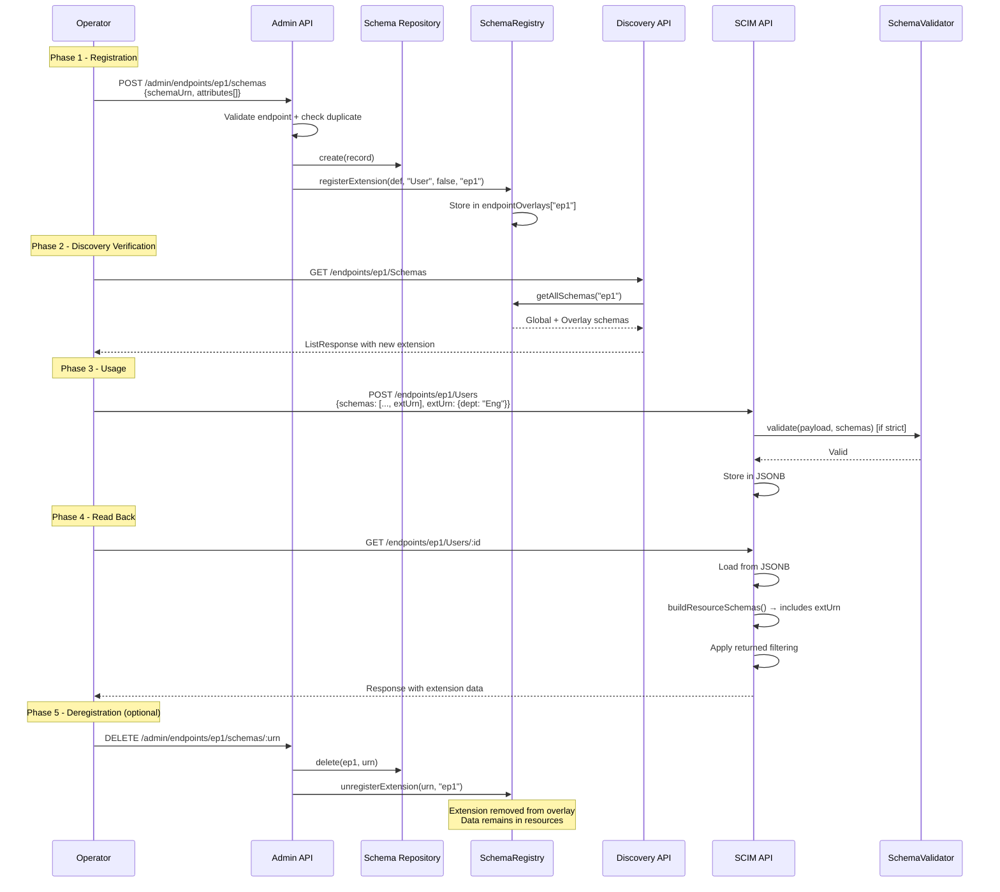

# Schema Extension Flows & Combinations - Behavior Matrices

> **⚠️ Partially Superseded (v0.28.0)**: The `EndpointSchema` and `EndpointResourceType` tables/repos (including `IEndpointSchemaRepository`, `IEndpointResourceTypeRepository`) were removed in Phase 13. Schema data now lives in `Endpoint.profile` JSONB. See [SCHEMA_TEMPLATES_DESIGN.md](SCHEMA_TEMPLATES_DESIGN.md).

## Overview

**Document Type**: Exhaustive Behavior Reference  
**Audience**: Advanced operators, QA engineers, and anyone needing deterministic answers about schema behavior under specific conditions  
**Status**: ✅ Complete  
**Date**: March 2, 2026  
**Version**: 0.24.0

### Purpose

This document provides exhaustive behavior matrices covering every combination of:

1. Schema operation × config flag state
2. Extension handling across CRUD operations
3. Validation behavior under strict vs. permissive modes
4. Discovery response correctness under various registration states
5. PATCH path resolution across core, extension, and custom resource type attributes

> **Cross-references:**
> - RFC rules → [RFC_SCHEMA_AND_EXTENSIONS_REFERENCE.md](RFC_SCHEMA_AND_EXTENSIONS_REFERENCE.md)
> - Architecture internals → [SCHEMA_LIFECYCLE_AND_REGISTRY.md](SCHEMA_LIFECYCLE_AND_REGISTRY.md)
> - Operator how-to → [SCHEMA_CUSTOMIZATION_GUIDE.md](SCHEMA_CUSTOMIZATION_GUIDE.md)

---

## 1. Extension Registration Flow Matrix

### 1.1 Registration Outcomes by Input

| Input | `endpointId` | `resourceTypeId` | Outcome | Layer |
|-------|-------------|-------------------|---------|-------|
| Valid URN, valid endpoint, valid RT | provided | `"User"` | ✅ Registered per-endpoint | Overlay |
| Valid URN, valid endpoint, valid RT | provided | `"Group"` | ✅ Registered per-endpoint | Overlay |
| Valid URN, valid endpoint, no RT | provided | `undefined` | ✅ Registered per-endpoint (schema only, no RT link) | Overlay |
| Valid URN, no endpoint | `undefined` | `"User"` | ✅ Registered globally | Global |
| Core schema URN | provided | any | ❌ Error: "Cannot overwrite core schema" | - |
| Duplicate URN (same endpoint) | provided | any | ❌ 409: Schema already registered | - |
| Duplicate URN (different endpoint) | different | any | ✅ Registered (per-endpoint isolation) | Overlay |
| Empty URN | any | any | ❌ Error: Non-empty id required | - |
| Invalid endpoint | nonexistent | any | ❌ 404: Endpoint not found | - |

### 1.2 Unregistration Outcomes

| Input | Outcome | Data Impact |
|-------|---------|-------------|
| Core schema URN | ❌ Cannot unregister core schema | No change |
| Registered extension (per-endpoint) | ✅ Removed from overlay | Extension data remains in resources (orphaned) |
| Registered extension (global) | ✅ Removed from global map | Extension data remains in resources |
| Unregistered URN | ✅ Returns `false` (no-op) | No change |

---

## 2. Custom Resource Type Registration Flow Matrix

### 2.1 Registration Outcomes

| Input | `CustomResourceTypesEnabled` | Name | Path | Outcome |
|-------|------------------------------|------|------|---------|
| Valid name + path | `true` | `"Device"` | `"/Devices"` | ✅ Registered |
| Valid name + path | `false` | `"Device"` | `"/Devices"` | ❌ 400: Custom resource types not enabled |
| Reserved name | `true` | `"User"` | `"/MyUsers"` | ❌ 400: Reserved resource type name |
| Reserved name | `true` | `"Group"` | `"/MyGroups"` | ❌ 400: Reserved resource type name |
| Reserved path | `true` | `"MyType"` | `"/Users"` | ❌ 400: Reserved endpoint path |
| Reserved path | `true` | `"MyType"` | `"/Schemas"` | ❌ 400: Reserved endpoint path |
| Reserved path | `true` | `"MyType"` | `"/ResourceTypes"` | ❌ 400: Reserved endpoint path |
| Reserved path | `true` | `"MyType"` | `"/ServiceProviderConfig"` | ❌ 400: Reserved endpoint path |
| Reserved path | `true` | `"MyType"` | `"/Bulk"` | ❌ 400: Reserved endpoint path |
| Reserved path | `true` | `"MyType"` | `"/Me"` | ❌ 400: Reserved endpoint path |
| Duplicate name | `true` | existing name | any | ❌ 409: Already registered |
| Invalid endpoint | `true` | any | any | ❌ 404: Endpoint not found |

### 2.2 Custom Resource Type CRUD Availability

| Operation | Route | HTTP Status | Notes |
|-----------|-------|-------------|-------|
| CREATE | `POST /endpoints/:id/:resourceType` | 201 | Full SCIM create with schema validation |
| LIST | `GET /endpoints/:id/:resourceType` | 200 | ListResponse with pagination |
| SEARCH | `POST /endpoints/:id/:resourceType/.search` | 200 | POST-based search |
| GET | `GET /endpoints/:id/:resourceType/:rid` | 200 | Single resource |
| REPLACE | `PUT /endpoints/:id/:resourceType/:rid` | 200 | Full replacement |
| PATCH | `PATCH /endpoints/:id/:resourceType/:rid` | 200 | Partial update |
| DELETE | `DELETE /endpoints/:id/:resourceType/:rid` | 204 | Remove resource |

---

## 3. Validation Behavior Matrix

### 3.1 StrictSchemaValidation × Operation × Scenario

| Scenario | `Strict: false` | `Strict: true` |
|----------|----------------|----------------|
| **POST with correct schemas[]** | ✅ Accept | ✅ Accept |
| **POST without schemas[]** | ✅ Accept (auto-build) | ❌ 400: Missing schemas |
| **POST with unknown extension URN in schemas[]** | ✅ Accept (ignored) | ❌ 400: Unregistered schema |
| **POST with unknown extension data (URN key in body)** | ✅ Accept (stored in JSONB) | ❌ 400: Unregistered schema |
| **POST with registered extension URN + data** | ✅ Accept | ✅ Accept + validate attributes |
| **POST with readOnly attribute (id)** | ✅ Silently stripped | ❌ 400: readOnly (or stripped if `IgnoreReadOnly...`) |
| **POST with writeOnly attribute** | ✅ Accept, stored | ✅ Accept, stored, never returned |
| **POST missing required attribute** | ✅ Accept (no validation) | ❌ 400: Missing required attribute |
| **POST with wrong type (string for boolean)** | ✅ Accept (coerced if enabled) | ❌ 400: Type mismatch (unless coercion) |
| **POST with unknown core attributes** | ✅ Accept (stored in JSONB) | ❌ 400: Unknown attribute |
| **PUT changing immutable attribute** | ✅ Accept (no check) | ❌ 400: Immutable attribute changed (H-2) |
| **PUT with correct schemas[]** | ✅ Accept | ✅ Accept |
| **PATCH readOnly attribute** | ✅ Silently stripped | ❌ 400: readOnly (or stripped if `IgnoreReadOnly...`) |
| **PATCH with extension URN path** | ✅ Accept | ✅ Accept + validate against schema |
| **GET/LIST** | No validation | No validation |

### 3.2 AllowAndCoerceBooleanStrings × Input × Result

| Input Value | Declared Type | `Coerce: true` | `Coerce: false` |
|-------------|--------------|----------------|-----------------|
| `"True"` | boolean | ✅ Coerced to `true` | Stored as string `"True"` |
| `"true"` | boolean | ✅ Coerced to `true` | Stored as string `"true"` |
| `"False"` | boolean | ✅ Coerced to `false` | Stored as string `"False"` |
| `"false"` | boolean | ✅ Coerced to `false` | Stored as string `"false"` |
| `true` | boolean | ✅ Unchanged | ✅ Unchanged |
| `false` | boolean | ✅ Unchanged | ✅ Unchanged |
| `"True"` | string | ✅ Unchanged (not boolean type) | ✅ Unchanged |
| `"yes"` | boolean | ⚠️ Not coerced (only "True"/"False") | Not coerced |

### 3.3 IgnoreReadOnlyAttributesInPatch × StrictSchemaValidation × Result

| `StrictSchema` | `IgnoreReadOnly` | ReadOnly in PATCH | Result |
|----------------|------------------|-------------------|--------|
| `false` | `false` | `id` in op | Silently stripped (always) |
| `false` | `true` | `id` in op | Silently stripped (always) |
| `true` | `false` | `groups` in op | ❌ 400: readOnly attribute |
| `true` | `true` | `groups` in op | ✅ Silently stripped |
| `true` | `false` | `meta.created` in op | ❌ 400: readOnly attribute |
| `true` | `true` | `meta.created` in op | ✅ Silently stripped |

> **Note**: `id` is never rejected (even in strict mode) - it's always stripped to let downstream G8c handle it. This prevents double-error reporting.

### 3.4 readOnly Attribute Handling Across Operations

| Operation | readOnly Attribute | `Strict: false` | `Strict: true` | `Strict: true + IgnoreReadOnly: true` |
|-----------|-------------------|-----------------|-----------------|---------------------------------------|
| POST | `id` | Stripped | Stripped (special case) | Stripped |
| POST | `groups` | Stripped | ❌ 400 | Stripped |
| POST | `meta` | Stripped | ❌ 400 | Stripped |
| PUT | `id` | Stripped | Stripped (special case) | Stripped |
| PUT | `groups` | Stripped | ❌ 400 | Stripped |
| PATCH (path-based) | `groups` | Stripped | ❌ 400 | Stripped |
| PATCH (no-path merge) | `id` in value | Stripped | Stripped (special case) | Stripped |
| GET | `id` | ✅ Returned (always) | ✅ Returned | ✅ Returned |
| GET | `groups` | ✅ Returned (readOnly, default) | ✅ Returned | ✅ Returned |

---

## 4. Discovery Response Matrix

### 4.1 `/Schemas` Response Content

| Registry State | `/Schemas` Result |
|---------------|-------------------|
| Boot (no customizations) | User, EnterpriseUser, Group, 4× msfttest, SPC, Schema, ResourceType schemas |
| After extension registration (endpoint A) | All above + registered extension (only when queried with endpoint A) |
| After extension registration (no endpoint) | All above + global extension (visible to all endpoints) |
| After extension removal | Returns to pre-registration state |
| After custom RT schema registration | Includes custom RT schema |

### 4.2 `/ResourceTypes` Response Content

| Registry State | `/ResourceTypes` Result |
|---------------|------------------------|
| Boot (no customizations) | User (with EnterpriseUser + msfttest extensions), Group (with msfttest extensions) |
| After extension to User (endpoint A) | User shows added extension in `schemaExtensions[]` (endpoint A only) |
| After custom RT "Device" (endpoint A) | User, Group, Device (endpoint A only) |
| After removing custom RT | Returns to pre-registration state |

### 4.3 `/ServiceProviderConfig` Dynamic Fields

| Config Flag | SPC Field Affected | `false` Value | `true` Value |
|-------------|-------------------|---------------|--------------|
| `BulkOperationsEnabled` | `bulk.supported` | `false` | `true` |
| All others | - | No change | No change |

> The SPC is generated dynamically using `ScimSchemaRegistry.getServiceProviderConfig(config)`. Only `bulk.supported` changes based on config; all other SPC values are static.

---

## 5. schemas[] Array Behavior Matrix

### 5.1 Inbound Request Processing

| Payload Content | `Strict: false` | `Strict: true` |
|----------------|-----------------|-----------------|
| `schemas: ["core:User"]`, no extension data | ✅ Accept | ✅ Accept |
| `schemas: ["core:User", "enterprise:User"]`, with enterprise data | ✅ Accept | ✅ Accept |
| `schemas: ["core:User", "enterprise:User"]`, NO enterprise data | ✅ Accept | ✅ Accept (URN declared, no data - harmless) |
| `schemas: ["core:User"]`, WITH enterprise data in body | ✅ Accept (extension data stored) | ❌ 400: Undeclared extension data |
| `schemas: ["core:User", "urn:unknown"]`, with unknown data | ✅ Accept (unknown stored) | ❌ 400: Unregistered schema URN |
| No `schemas` field | ✅ Accept (auto-built) | ❌ 400: Missing schemas |
| `schemas: []` (empty array) | ✅ Accept | ❌ 400: Missing core schema |
| `schemas: ["wrong:urn"]` (wrong core) | ✅ Accept | ❌ 400: Missing core schema |

### 5.2 Outbound Response Building

| Resource State | `schemas[]` in Response |
|---------------|------------------------|
| User with no extension data | `["urn:...core:2.0:User"]` |
| User with enterprise data | `["urn:...core:2.0:User", "urn:...enterprise:2.0:User"]` |
| User with enterprise + custom extension data | `["urn:...core:2.0:User", "urn:...enterprise:2.0:User", "urn:...custom:2.0:User"]` |
| User with extension URN in store but empty object `{}` | `["urn:...core:2.0:User"]` (empty object not included) |
| User with extension URN key but `undefined` value | `["urn:...core:2.0:User"]` (undefined not included) |
| Group with no extensions | `["urn:...core:2.0:Group"]` |
| Custom RT "Device" | `["urn:...core:2.0:Device"]` |

> Built by `ScimDiscoveryService.buildResourceSchemas()` - only includes URNs where `payload[urn] !== undefined`.

---

## 6. Attribute Characteristic Enforcement Matrix

### 6.1 `mutability` × Operation × Enforcement

| Mutability | POST | PUT | PATCH (path) | PATCH (no-path) | GET/LIST |
|-----------|------|-----|-------------|-----------------|---------|
| `readWrite` | ✅ Accept | ✅ Accept | ✅ Accept | ✅ Accept | ✅ Return |
| `readOnly` | Strip/Reject | Strip/Reject | Strip/Reject | Strip/Reject | ✅ Return |
| `immutable` | ✅ Accept | ⚠️ Must match (H-2) | ⚠️ Must match (H-2) | ⚠️ Must match (H-2) | ✅ Return |
| `writeOnly` | ✅ Accept | ✅ Accept | ✅ Accept | ✅ Accept | ❌ Never return |

### 6.2 `returned` × Context × Response Inclusion

| Returned | GET (no ?attributes) | GET (?attributes=X) | GET (?excludedAttributes=X) | POST/PUT/PATCH response | LIST |
|----------|---------------------|--------------------|---------------------------|------------------------|------|
| `always` | ✅ Included | ✅ Always included | ✅ Always included (cannot exclude) | ✅ Included | ✅ Included |
| `never` | ❌ Stripped | ❌ Stripped | ❌ Stripped | ❌ Stripped | ❌ Stripped |
| `default` | ✅ Included | ✅ If in `attributes` | ❌ If in `excludedAttributes` | ✅ Included | ✅ Included |
| `request` | ❌ Stripped | ✅ If in `attributes` | ❌ Stripped | ❌ Stripped | ❌ Stripped |

### 6.3 `required` × Operation × Enforcement

| Required | POST (`Strict: true`) | PUT (`Strict: true`) | PATCH | GET |
|----------|----------------------|---------------------|-------|-----|
| `true` | ❌ 400 if missing | ❌ 400 if missing | N/A (partial) | N/A |
| `false` | ✅ Optional | ✅ Optional | N/A | N/A |
| `true` (readOnly, e.g., `id`) | ✅ Skip (server-managed) | ✅ Skip (server-managed) | N/A | N/A |

### 6.4 `caseExact` × Filter Operation × Behavior

| caseExact | Filter | Example | Behavior |
|-----------|--------|---------|----------|
| `true` | `eq` | `externalId eq "ABC"` | Case-sensitive match (R-CASE-1) |
| `false` | `eq` | `userName eq "John"` | Case-insensitive match |
| `true` | `co`, `sw`, `ew` | `externalId co "AB"` | Case-sensitive |
| `false` | `co`, `sw`, `ew` | `displayName sw "J"` | Case-insensitive |

---

## 7. PATCH Path Resolution Matrix

### 7.1 Path Formats and Resolution

| Path | Target | Regex | Resolution |
|------|--------|-------|------------|
| `displayName` | Core attribute | None | `coreAttributes['displayName']` |
| `name.familyName` | Core sub-attribute | Split on `.` | `coreAttributes['name'].subAttributes['familyName']` |
| `emails[type eq "work"].value` | Filtered multi-valued sub | Strip filter | `coreAttributes['emails'].subAttributes['value']` |
| `urn:...enterprise:2.0:User:department` | Extension attribute | URN split on `:` after base | `extensionSchemas['enterprise:User'].attributes['department']` |
| `urn:...enterprise:2.0:User:manager.displayName` | Extension sub-attribute | URN split + dot walk | `extensionSchemas['enterprise:User'].attributes['manager'].subAttributes['displayName']` |
| `urn:...custom:2.0:User:badges[badgeId eq "X"].level` | Extension filtered multi-valued sub | URN split + filter strip + dot walk | `extensionSchemas['custom:User'].attributes['badges'].subAttributes['level']` |

### 7.2 GenericPatchEngine URN Handling

The `GenericPatchEngine` uses a specific regex for URN path splitting:

```typescript
const urnMatch = path.match(/^(urn:[^.]+(?:\.\d+)*(?::[^.]+)*)\.(.+)$/);
```

| Path | URN Part | Sub-Path Part | Result |
|------|----------|---------------|--------|
| `urn:example:2.0:User.department` | `urn:example:2.0:User` | `department` | Navigate into `payload["urn:example:2.0:User"]["department"]` |
| `urn:example:2.0:User.address.city` | `urn:example:2.0:User` | `address.city` | Navigate into `payload["urn:example:2.0:User"]["address"]["city"]` |
| `displayName` | No match | - | Navigate into `payload["displayName"]` directly |

### 7.3 PATCH Operation × Extension × Result

| Operation | Path | Value | Current State | Result |
|-----------|------|-------|---------------|--------|
| `add` | `urn:ext:department` | `"Eng"` | No extension data | `{"urn:ext": {"department": "Eng"}}` created |
| `add` | `urn:ext:department` | `"Eng"` | `{"urn:ext": {"floor": 3}}` | `{"urn:ext": {"floor": 3, "department": "Eng"}}` merged |
| `replace` | `urn:ext:department` | `"Mkt"` | `{"urn:ext": {"department": "Eng"}}` | `{"urn:ext": {"department": "Mkt"}}` |
| `remove` | `urn:ext:department` | - | `{"urn:ext": {"department": "Eng", "floor": 3}}` | `{"urn:ext": {"floor": 3}}` |
| `remove` | `urn:ext` | - | `{"urn:ext": {"department": "Eng"}}` | Extension block removed entirely |
| `add` (no path) | - | `{"urn:ext": {"department": "Eng"}}` | No extension data | Extension block added to root |
| `replace` (no path) | - | `{"urn:ext": {"department": "Eng"}}` | `{"urn:ext": {"floor": 3}}` | Extension block replaced entirely |

---

## 8. Multi-Endpoint Isolation Matrix

### 8.1 Schema Visibility Across Endpoints

| Action | Endpoint A | Endpoint B | Global |
|--------|-----------|-----------|--------|
| Register extension on Endpoint A | ✅ Visible | ❌ Not visible | ❌ Not visible |
| Register extension globally (no endpoint) | ✅ Visible | ✅ Visible | ✅ Visible |
| Register custom RT on Endpoint A | ✅ Visible | ❌ Not visible | ❌ Not visible |
| Unregister extension from Endpoint A | ❌ Removed | No change | No change |
| Clear Endpoint A overlay | ❌ All removed | No change | No change |

### 8.2 Discovery Responses per Endpoint

| Query | Response Content |
|-------|-----------------|
| `GET /endpoints/A/Schemas` | Global schemas + Endpoint A extensions |
| `GET /endpoints/B/Schemas` | Global schemas + Endpoint B extensions |
| `GET /endpoints/A/ResourceTypes` | Global RTs (merged with A extensions) + A custom RTs |
| `GET /endpoints/B/ResourceTypes` | Global RTs (merged with B extensions) + B custom RTs |

### 8.3 Data Isolation

| Resource | Stored In | Accessible From |
|----------|-----------|----------------|
| User created on Endpoint A | Endpoint A data | Only Endpoint A |
| User created on Endpoint B | Endpoint B data | Only Endpoint B |
| Custom RT "Device" on Endpoint A | Endpoint A data | Only Endpoint A |
| Extension data on User (Endpoint A) | Endpoint A User record JSONB | Only Endpoint A |

---

## 9. Boot Hydration Flow Matrix

### 9.1 `onModuleInit()` Hydration Sequence

| Step | Source | Target | Error Handling |
|------|--------|--------|----------------|
| 1. Load persisted schemas | `EndpointSchemaRepository.findAll()` | `registerExtension()` per record | Logs error, continues |
| 2. Load persisted RTs | `EndpointResourceTypeRepository.findAll()` | `registerResourceType()` per record | Logs error, continues |

### 9.2 Persistence Backend × Hydration

| Backend | `findAll()` Returns | Post-Hydration State |
|---------|--------------------|--------------------- |
| Prisma (PostgreSQL) | All persisted records | Full restored state |
| InMemory (fresh start) | Empty array | Only built-in schemas |
| InMemory (after runtime registration) | Registered records | Restored until restart |

### 9.3 Repository Injection

| Scenario | `IEndpointSchemaRepository` | `IEndpointResourceTypeRepository` | Hydration |
|----------|----------------------------|------------------------------------|-----------|
| Both repos provided | ✅ Injected | ✅ Injected | Full hydration |
| Schema repo only | ✅ Injected | `@Optional()` - null | Schema hydration only |
| Neither repo (standalone) | `@Optional()` - null | `@Optional()` - null | Built-in schemas only |

---

## 10. Error Response Matrix

### 10.1 Schema Registration Errors

| Condition | HTTP Status | Error Type | Error Message |
|-----------|-------------|------------|---------------|
| Core schema URN | 400 | `invalidValue` | Cannot overwrite core schema: {urn} |
| Duplicate URN | 409 | `uniqueness` | Schema already registered: {urn} |
| Empty URN | 400 | `invalidValue` | Schema URN must not be empty |
| Endpoint not found | 404 | - | Endpoint not found: {id} |

### 10.2 Custom Resource Type Registration Errors

| Condition | HTTP Status | Error Type | Error Message |
|-----------|-------------|------------|---------------|
| Feature disabled | 400 | `invalidValue` | Custom resource types are not enabled |
| Reserved name | 400 | `invalidValue` | Reserved resource type name: {name} |
| Reserved path | 400 | `invalidValue` | Reserved endpoint path: {path} |
| Duplicate name | 409 | `uniqueness` | Resource type already registered: {name} |
| Endpoint not found | 404 | - | Endpoint not found: {id} |

### 10.3 Schema Validation Errors (Strict Mode)

| Condition | Error Code | Example Detail |
|-----------|------------|----------------|
| Missing `schemas[]` | V25 | Missing required attribute: schemas |
| Missing core URN in `schemas[]` | V25 | Core schema URN not found in schemas array |
| Unregistered extension URN | - | Unregistered schema URN: {urn} |
| Missing required attribute | V9 | Missing required attribute: {name} |
| Type mismatch | V31 | Expected {type} for attribute: {name} |
| readOnly attribute on write | - | Attribute '{name}' is readOnly |
| Immutable attribute changed | H-2 | Cannot modify immutable attribute: {name} |
| Unknown attribute | - | Unknown attribute: {name} |
| Invalid dateTime format | V31 | Invalid dateTime format for: {name} |
| Invalid canonical value | V10 | Invalid value for {name}: {value} |

---

## 11. Extension × Feature Interaction Matrix

### 11.1 Feature Flags × Extension Behavior

| Feature | Extension Impact | Notes |
|---------|-----------------|-------|
| `SoftDeleteEnabled` | Extensions are soft-deleted with the resource | Extension data preserved in soft-deleted record |
| `RequireIfMatch` | No extension-specific behavior | If-Match applies to entire resource |
| `BulkOperationsEnabled` | Bulk ops support extension attributes | Extension data in bulk request bodies |
| `PerEndpointCredentialsEnabled` | No extension-specific behavior | Auth applies at endpoint level |
| `StrictSchemaValidation` | Extensions validated against definitions | Required for extension attribute type checking |
| `AllowAndCoerceBooleanStrings` | Extension boolean attrs coerced | Uses schema-declared boolean attribute names |
| `IgnoreReadOnlyAttributesInPatch` | Extension readOnly attrs stripped | Applies to extension attributes same as core |
| `IncludeWarningAboutIgnoredReadOnlyAttribute` | Warning includes extension readOnly | Warning URN added when extension readOnly stripped |

### 11.2 Extension Data Flow Through Operations

| Operation | Extension Data Handling |
|-----------|------------------------|
| POST (create) | Extension data stored in JSONB `rawPayload` |
| GET (read) | Extension data returned from JSONB, `returned` filtering applied |
| PUT (replace) | Entire resource replaced including extension data |
| PATCH (modify) | Extension attributes modified via URN-prefixed paths or no-path merge |
| DELETE | Resource removed; extension data deleted with it |
| LIST | Extension data returned with filtering; counted in `totalResults` |
| `.search` | Extension attributes can be filtered/sorted (if filter push-down supports) |
| Bulk | Each bulk operation can include extension data independently |

---

## 12. Schema-of-Schemas: How Extension Schemas Appear in Discovery

### 12.1 Extension Schema Discovery Format

When a registered extension is returned via `GET /Schemas/{urn}`:

```json
{
  "schemas": ["urn:ietf:params:scim:schemas:core:2.0:Schema"],
  "id": "urn:example:scim:schemas:extension:acme:2.0:User",
  "name": "AcmeUserExtension",
  "description": "Custom attributes for Acme Corp users",
  "attributes": [
    {
      "name": "department",
      "type": "string",
      "multiValued": false,
      "required": false,
      "mutability": "readWrite",
      "returned": "default",
      "caseExact": false,
      "uniqueness": "none"
    }
  ],
  "meta": {
    "resourceType": "Schema",
    "location": "/Schemas/urn:example:scim:schemas:extension:acme:2.0:User"
  }
}
```

### 12.2 ResourceType Extension Linkage Format

When a resource type with registered extensions is returned via `GET /ResourceTypes/User`:

```json
{
  "schemas": ["urn:ietf:params:scim:schemas:core:2.0:ResourceType"],
  "id": "User",
  "name": "User",
  "endpoint": "/Users",
  "schema": "urn:ietf:params:scim:schemas:core:2.0:User",
  "schemaExtensions": [
    {
      "schema": "urn:ietf:params:scim:schemas:extension:enterprise:2.0:User",
      "required": true
    },
    {
      "schema": "urn:example:scim:schemas:extension:acme:2.0:User",
      "required": false
    }
  ]
}
```

---

## 13. Complete Extension Lifecycle: End-to-End Trace

### 13.1 Full Lifecycle Sequence



---

## 14. Persistence State × Runtime State Consistency

### 14.1 State Consistency Matrix

| Event | DB State | Registry State | Consistent? |
|-------|----------|---------------|-------------|
| Server boot (fresh) | Empty | Built-in only | ✅ |
| After registration (runtime) | Has record | Has extension | ✅ |
| After server restart (Prisma) | Has record | Hydrated from DB | ✅ |
| After server restart (InMemory) | Empty (volatile) | Built-in only | ✅ (but extensions lost) |
| After DB manual deletion | Missing record | Still has extension (until restart) | ❌ Inconsistent |
| After registry clear (programmatic) | Has record | Missing extension | ❌ Until restart |

### 14.2 Recovery Procedures

| Inconsistency | Fix |
|---------------|-----|
| DB has record, registry doesn't | Restart server (hydration will restore) |
| Registry has extension, DB doesn't | Register again via Admin API (will persist + update registry) |
| DB deleted externally | Restart server; extension will not hydrate |

---

*Last updated: March 2, 2026*
