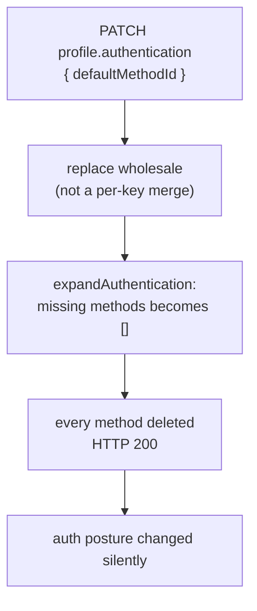

# A10 - a partial `profile.authentication` block is refused

**Status:** DELIVERED - api v0.55.9. **Last verified:** 2026-08-19.

`PATCH /scim/admin/endpoints/{id}` accepted a **partial** `profile.authentication` block and silently
deleted every configured authentication method. Origin: action **A10** of the canonical SyncFabric
WIF guide, confirmed open by the 2026-08-19 stock-take.

## 1. The defect

Two individually reasonable behaviours combined into silent data loss.

| Where | Behaviour | Alone |
|---|---|---|
| [endpoint.service.ts](../../api/src/modules/endpoint/services/endpoint.service.ts) `mergeProfilePartial` | `authentication` is **replaced wholesale**, unlike `settings` and `serviceProviderConfig` which merge per key | Reasonable: the admin methods API computes the whole block and submits it |
| [auto-expand.service.ts](../../api/src/modules/scim/endpoint-profile/auto-expand.service.ts) `expandAuthentication` | `methods = Array.isArray(auth.methods) ? ... : []` | Reasonable: normalizes a missing list to an empty one |

Together: a caller who sends `{ "authentication": { "defaultMethodId": "m-abc" } }` - intending to set
one sibling field - replaces the block, `methods` normalizes to `[]`, and **every authentication
method on the endpoint is deleted**, with a `200 OK`.



The blast radius is the authentication configuration itself, which is why this was rated High: the
operator sees success, and the endpoint's accepted authentication methods have changed.

## 2. The fix

`mergeProfilePartial` now refuses a block that does not carry an explicit `methods` **array**:

```text
400 profile.authentication is replaced wholesale, so it must carry a complete `methods` array.
    Read the current block from GET /scim/admin/endpoints/{id}/authentication/methods and resend it,
    or omit `authentication` entirely to leave it unchanged.
```

Three properties of the guard are deliberate:

1. **It refuses partials, not the section.** A complete block is still accepted, including
   `methods: []` when emptying is what the operator actually means. The distinction the guard draws
   is *stated intent* versus *accidental omission* - it never has to guess.
2. **It sits in the shared merge helper**, which both the create path and the update path call, so
   the rule cannot differ between the two or between the Prisma and InMemory backends. Parity is
   structural rather than tested-into-place - and it is still tested on both (E2E on Prisma, live on
   InMemory).
3. **The error names the recovery.** It says where to read the current block and that omitting the
   key is the way to leave it alone, because the caller who hits this is usually trying to change one
   field and does not know the section replaces wholesale.

## 3. Coverage

| Layer | Where | Count |
|---|---|---|
| Unit | [endpoint.service.spec.ts](../../api/src/modules/endpoint/services/endpoint.service.spec.ts) `describe('A10 ...')` | 4 |
| E2E | [endpoint-profile.e2e-spec.ts](../../api/test/e2e/endpoint-profile.e2e-spec.ts) `describe('A10 ...')` | 2 |
| Live | [live-test.ps1](../../scripts/live-test.ps1) section **9z-CG** | 4 |

**The assertion that matters is not the `400`.** Both the E2E and live `9z-CG.T2` seed a method,
attempt the partial PATCH, and then **re-read the method list** to prove the method is still there.
Asserting only the status code would pass against a server that returned `400` *and* wiped the data,
so the status check alone would be presence-not-correctness (standing rule R10).

Each layer also carries a **control** (`A10-T3` unit, `9z-CG.T4` live) proving a complete block is
still accepted, so a future over-tightening that rejects legitimate writes fails too.

**TDD.** The 4 unit tests were written first and confirmed RED - 2 failing (the rejection cases), 2
passing (the accept and preserve cases). The first RED run failed on a missing Prisma `update` mock,
which would have "proved" the guard worked for the wrong reason; the mock was wired so the call would
**succeed** without the guard, making the RED demonstrate that the silent-wipe path was genuinely
open.

## 4. Design and architecture gate

| Check | Finding | Disposition |
|---|---|---|
| SRP | The guard validates the shape it is about to persist, in the merge helper that owns that shape | **Applied** |
| Coupling | No new dependency; the check is local to the existing helper | **Applied** |
| Pattern fit | Same `BadRequestException`-on-invalid-profile pattern the settings validation beside it already uses | **Applied** |
| Open/Closed | A future section with the same replace-wholesale semantics adds a sibling check, not a rewrite | **Applied** |
| YAGNI | Rejected the richer alternative (deep-merging `authentication`), which would need a per-field merge policy for a section that has one writer. The one-line invariant is sufficient | **Applied** |
| Disposition | **Applied** in this commit chain | **Applied** |

**R7 self-improvement.** This is the second defect in two items caused by **two safe behaviours
composing into an unsafe one** (A8: a correct emit plus a correct redactor produced a useless audit
record; A10: a correct wholesale replace plus a correct normalization produced silent deletion).
Neither component was wrong in isolation, and neither had a test that could see the other. The
generalizable check, now applied when reviewing any normalize-then-persist path: **ask what the
normalizer does with an absent key, and whether the caller could plausibly omit it while meaning
"leave this alone".** Where the answer is "it becomes empty", the write path needs to distinguish
absent from empty.
