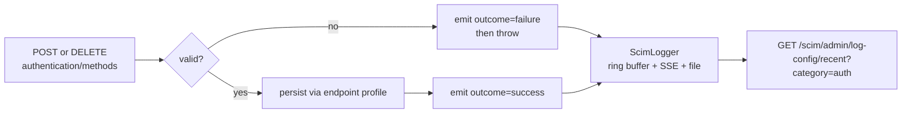

# A8 - audit event on authentication-method changes

**Status:** DELIVERED - api v0.55.8. **Last verified:** 2026-08-19.

Adding or removing an entry in an endpoint's `profile.authentication.methods[]` changes **how that
endpoint authenticates**. It is the most security-sensitive configuration mutation the product
exposes, and until v0.55.8 it emitted only a free-text `INFO` line, which cannot be alerted on,
counted, or filtered. The credential controller, the JWKS-host controller and the endpoint service
had all emitted the canonical structured event for some time; this controller was the one gap.

Origin: action **A8** of the canonical SyncFabric WIF guide, confirmed open by the 2026-08-19
stock-take ([REMAINING_WORK_REGISTER.md](REMAINING_WORK_REGISTER.md)): 2 mutating handlers, 0 emits.

## 1. What ships

Two new actions on the existing `AuthAdminAction` union, emitted through the existing
[`emitAuthAdminEvent`](../../api/src/oauth/auth-admin-event.ts). No new mechanism, no new log
channel: this is the **fourth caller** of a seam that already existed, so it is EXTEND-not-EDIT.

| Handler | Action | Outcome |
|---|---|---|
| `POST .../authentication/methods` | `auth_method_add` | `success` |
| `POST` with an unknown `type` | `auth_method_add` | `failure` |
| `DELETE .../authentication/methods/:methodId` | `auth_method_remove` | `success` |
| `DELETE` of an unknown method | `auth_method_remove` | `failure` |



**Failure paths emit too.** A probing or misconfigured caller is visible rather than silent, which is
the difference between an audit trail and a success log. Per the emitter's existing convention a
`success` is logged at `INFO` and a `failure` at `WARN`.

## 2. The field that matters: `methodId`, not `credentialId`

The event carries a new **`methodId`** field. This is not cosmetic, and the reason is the most
transferable part of this change.

The first implementation emitted the method id as `credentialId`, reusing an existing field. Unit
tests passed. The **E2E test failed**, and the diagnostic showed why:

```text
"data":{"action":"auth_method_add","outcome":"success",
        "credentialId":"[REDACTED]", ...}
```

[`SENSITIVE_KEY_PATTERN`](../../api/src/security/redact-sensitive.ts) matches `/credential/`, so the
shared redactor blanks **any** key whose name contains "credential". The event was emitted correctly
and arrived useless: an audit record that cannot say *which* method changed.

A method id is an opaque profile key, already returned in the `201` response body. It is not a
secret, so the fix is a correctly-named field rather than a weakening of the redactor. **The
redaction pattern was deliberately left alone** - it legitimately catches `credentialHash`, and
loosening a security control to improve a log is the wrong trade.

**This defect is only reachable through the real logger.** The unit test mocks `ScimLogger`, so
redaction never runs there; no unit test at any level of diligence could have caught it. It is a
concrete instance of why the standing checklist requires the E2E and live layers rather than treating
them as duplicate coverage.

### 2.1 A pre-existing gap this surfaced

The same redaction applies to the **three emitters that already existed**:
[`admin-credential.controller.ts`](../../api/src/modules/scim/controllers/admin-credential.controller.ts)
emits `credentialId` at three sites, and every one of them has always arrived as `[REDACTED]`. So the
config-time audit trail has never been able to identify which credential was created, revealed or
rotated. That is **not** fixed here - it is recorded as item **N12** in
[REMAINING_WORK_REGISTER.md](REMAINING_WORK_REGISTER.md), because changing what those events emit is a
separate decision with its own contract and test surface.

## 3. What the event never carries

A method's `config` can hold operator-supplied material, so it is **excluded by construction** - the
emitter is passed ids and `type` only, never the config object. Asserted at three levels: a unit test
plants `clientSecret: 'super-secret-value'` and asserts neither the value nor the key name appears in
the serialized event; the E2E does the same through HTTP; live `9z-CF.T4` does it on the wire.

## 4. Coverage

| Layer | Where | Count |
|---|---|---|
| Unit | [admin-authentication-method.controller.spec.ts](../../api/src/modules/scim/controllers/admin-authentication-method.controller.spec.ts) - the controller's first spec | 5 |
| E2E | [auth-admin-events.e2e-spec.ts](../../api/test/e2e/auth-admin-events.e2e-spec.ts) `describe('A8 ...')` | 3 |
| Live | [live-test.ps1](../../scripts/live-test.ps1) section **9z-CF** | 6 |

`9z-CF.T3` is the **regression lock** for section 2: it asserts `methodId` both equals the created id
and is not `[REDACTED]`. A future rename of that field back into the `/credential/` namespace fails
on the wire.

**TDD.** The 5 unit tests were written first and confirmed RED (4 failing on the missing emissions)
before any production line changed. Writing them surfaced a **test** bug worth recording: the emitter
logs success at `INFO` and failure at `WARN`, so a helper that read only the `info` channel made both
failure assertions pass vacuously. Reading one channel would have shipped two tests that could never
fail - the same presence-is-not-correctness trap the standing R10 rule describes, in the test harness
rather than the product.

## 5. Design and architecture gate

| Check | Finding | Disposition |
|---|---|---|
| SRP | The controller emits; it does not format or route the event | **Applied** |
| Coupling | Reuses the existing emitter and logger; no new dependency edge | **Applied** |
| Pattern fit | Fourth caller of an established seam, same shape as the other three | **Applied** |
| Open/Closed | A new action is a union member, not a branch in the emitter | **Applied** |
| YAGNI | `methodId` added only because a measured defect required it; no speculative fields | **Applied** |
| Disposition | **Applied** in this commit chain; the pre-existing `credentialId` redaction is **scheduled** as N12 | **Applied + scheduled** |
