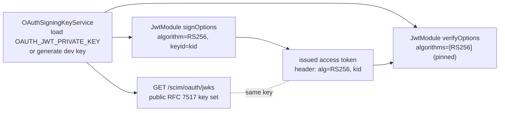

# OAuth Asymmetric Signing + Published JWKS (Pre-Q.B)

> Step **Pre-Q.B** of the authentication build ([AUTHENTICATION_ARCHITECTURE.md section 13](AUTHENTICATION_ARCHITECTURE.md#13-step-by-step-execution-plan--estimates--dependencies), tracked in [EXECUTION_LEDGER.md](EXECUTION_LEDGER.md)). Detailed recipe: [WIF section 13.3](WIF_JWT_BEARER_ASSERTION_FOR_SCIM.md#133-pre-qb---asymmetric-externalized-signing-key).

## What changed

The global OAuth issuer previously signed access tokens with a **symmetric HS256 secret** (`JWT_SECRET`). A symmetric secret cannot be published, so no third party could verify a token this server issued, and the server was exposed to algorithm-confusion if a public key were ever introduced without algorithm pinning.

Pre-Q.B moves issuance to an **asymmetric key** (RS256 by default, ES256 optional), stamps a `kid` into every token header, and publishes the public half as a JWKS so any client can verify an issued token. This is the prerequisite for the per-endpoint issuer (Q1) and the WIF own-token issuance (Q6).



## Components

| File | Role |
|---|---|
| [oauth-signing-key.service.ts](../../api/src/oauth/oauth-signing-key.service.ts) | Owns the asymmetric signing identity: loads or generates the key pair, derives the `kid` (RFC 7638 thumbprint or explicit), and builds the public JWKS. |
| [oauth-signing.module.ts](../../api/src/oauth/oauth-signing.module.ts) | Provides the single shared `OAuthSigningKeyService` so the signer and the JWKS publisher use the SAME key. |
| [oauth.module.ts](../../api/src/oauth/oauth.module.ts) | `buildJwtModuleOptions(keys)` - the exported, unit-tested factory that wires `privateKey`/`publicKey` + `signOptions` (algorithm + `keyid`) + `verifyOptions` (algorithm allowlist). |
| [jwks.controller.ts](../../api/src/oauth/jwks.controller.ts) | `GET /scim/oauth/jwks` - public, cacheable RFC 7517 publication. |

## Configuration

All optional - when no key is configured an ephemeral key is generated (with a startup warning) so dev works out of the box. **Production should set `OAUTH_JWT_PRIVATE_KEY`** for stable verification across restarts and multi-instance deployments.

| Env var | Default | Meaning |
|---|---|---|
| `OAUTH_JWT_ALG` | `RS256` | Signing algorithm: `RS256` or `ES256`. |
| `OAUTH_JWT_PRIVATE_KEY` | (generated) | PKCS#8 PEM private key. `\n`-escaped values are normalized so the key can ride a single env var. |
| `OAUTH_JWT_PUBLIC_KEY` | (derived) | SPKI PEM public key; derived from the private key when omitted. |
| `OAUTH_JWT_KID` | RFC 7638 thumbprint | Explicit key id; defaults to the JWK thumbprint (stable for a given key). |

> **`JWT_SECRET` is no longer used by the OAuth issuer.** It remains referenced only by an admin status field. Deployments that relied on `JWT_SECRET` for cross-restart token continuity should migrate to `OAUTH_JWT_PRIVATE_KEY`.

## The JWKS endpoint

`GET /scim/oauth/jwks` (public, no bearer) returns:

```jsonc
{
  "keys": [
    {
      "kty": "RSA",
      "n": "...",            // public modulus
      "e": "AQAB",           // public exponent
      "kid": "Ge9nUHNF...",  // RFC 7638 thumbprint
      "alg": "RS256",
      "use": "sig"
    }
  ]
}
```

No private key material (`d`/`p`/`q`/`dp`/`dq`/`qi`) is ever published; a key-allowlist contract test asserts this. The RFC 8414 authorization-server metadata (Q0/A2) advertises this URL as `jwks_uri`.

## Security: algorithm-confusion defense

Verification **pins** the allowed algorithms to exactly the configured asymmetric algorithm (`verifyOptions.algorithms = [keys.alg]`). The classic attack - forging an HS256 token using the published RSA public-key PEM as the HMAC secret - is rejected because `HS256` is not in the allowlist. This is locked in by a unit test that performs exactly that forgery and asserts rejection.

## Test coverage

| Layer | Test | Covers |
|---|---|---|
| Unit | [oauth-asymmetric.spec.ts](../../api/src/oauth/oauth-asymmetric.spec.ts) | key service (RS256 default, kid, JWKS no-private, config load, explicit kid, ES256); issued header `alg`+`kid` (B1); accepts asymmetric token, rejects HS256 alg-confusion + unrelated-secret (B3) |
| E2E | [oauth-jwks.e2e-spec.ts](../../api/test/e2e/oauth-jwks.e2e-spec.ts) | `GET /oauth/jwks` public, key shape, no private material, `Cache-Control`, published `kid` == issued-token `kid` (B2) |
| Live | `scripts/live-test.ps1` section **9z-AM** | JWKS public + shape + no-private + asymmetric token header + kid match + token authorizes a SCIM call, across all 3 form factors |

RS256 was confirmed mandatory-to-implement for the WIF profile by [RFC 7523 section 5](rfcs/RFC_7523_EXPLAINED.md); the JWKS shape follows [RFC 7517](rfcs/RFC_7517_EXPLAINED.md) and the thumbprint follows RFC 7638.
