# SCIMServer Authentication Architecture

> **Status:** Analysis + design. Dated 2026-06-18. Authoritative companion that consolidates the multi-turn auth design into one coherent architecture. **Analysis + design only - no code has been implemented for the new `authentication.methods[]` model.** The current shipped state (3-tier guard chain, global OAuth issuer, per-endpoint bcrypt bearer) is described in [section 4](#4-current-scimserver-state-source-grounded) and is the factual baseline; everything past Phase Q is proposed.

> **Why this doc exists.** [WIF_JWT_BEARER_ASSERTION_FOR_SCIM.md](WIF_JWT_BEARER_ASSERTION_FOR_SCIM.md) designs **one** auth mechanism (WIF) in depth, and [ISV_AUTH_PATTERNS_AND_SCIMSERVER_GAP_PLAN.md](ISV_AUTH_PATTERNS_AND_SCIMSERVER_GAP_PLAN.md) surveys the **eight** ISV patterns and schedules them as Phase Q. Neither answers the cross-cutting question: *how should SCIMServer model "an endpoint can have several authentication methods active at once, new ones get added over time, old ones get retired" - at every layer (API, processing, persistence, discovery, UI, deployment)?* This document is that answer. The two sibling docs remain authoritative for their narrower scopes; this one is authoritative for the **overall authentication architecture and vocabulary**.

> **Source-of-truth rule.** Every claim about *current* SCIMServer behavior is grounded in the in-repo source (cited path + line refs, verified 2026-06-18). Every claim about an external system (Entra, SCIM, OAuth) is grounded in the RFC section or the vendor doc. Proposed behavior is labeled PROPOSED. No invented current behavior.

---

## Table of contents

- [0. TL;DR](#0-tldr)
- [1. Vocabulary and naming decisions](#1-vocabulary-and-naming-decisions)
- [2. The conceptual model: two planes, three data classes](#2-the-conceptual-model-two-planes-three-data-classes)
- [3. The axes model: version x profile x identity-model + roles/scopes overlay](#3-the-axes-model-version-x-profile-x-identity-model--rolesscopes-overlay)
- [4. Current SCIMServer state (source-grounded)](#4-current-scimserver-state-source-grounded)
- [5. Config placement: global vs per-endpoint](#5-config-placement-global-vs-per-endpoint)
- [6. Persistence and data model](#6-persistence-and-data-model)
- [7. The four API surfaces](#7-the-four-api-surfaces)
- [8. Token-mint URL and runtime provider routing](#8-token-mint-url-and-runtime-provider-routing)
- [9. Coverage: SCIM + Entra mechanisms](#9-coverage-scim--entra-mechanisms)
- [10. Security analysis](#10-security-analysis)
- [11. Observability](#11-observability)
- [12. Extensibility and maintainability](#12-extensibility-and-maintainability)
- [13. Step-by-step execution plan + estimates + dependencies](#13-step-by-step-execution-plan--estimates--dependencies)
- [14. References (RFCs with sections + sources)](#14-references-rfcs-with-sections--sources)

---

## 0. TL;DR

Model authentication as a **provider registry (code, the capability ceiling) over a per-endpoint ordered set of activated `authenticationMethods[]` (config, embedded in the endpoint profile)**, resolved at runtime by a **generic, self-describing routing cascade** on **two planes** (token-mint dispatch + resource-accept chain). This single structure delivers, at every layer:

1. **Several methods active on one endpoint at once** - it is literally a priority-ordered list, and the current 3-tier guard chain is the working 3-link prototype to generalize.
2. **Add/remove auth types over time without core churn** - a `type` is one `AuthenticationProvider` class; adding one is a registry entry, retiring one is a `deprecate -> drain -> disable -> remove` lifecycle.
3. **Zero-downtime migration** - a shared per-endpoint token URL means switching a customer from secret to WIF is a body-only change at the IdP, never a URL change.
4. **No prior binding to route a token request** - the request is self-describing (`grant_type` + which field carries the JWT + the assertion `iss`), exactly how Keycloak / Duende IdentityServer / Spring Authorization Server / Ory Hydra all do it.

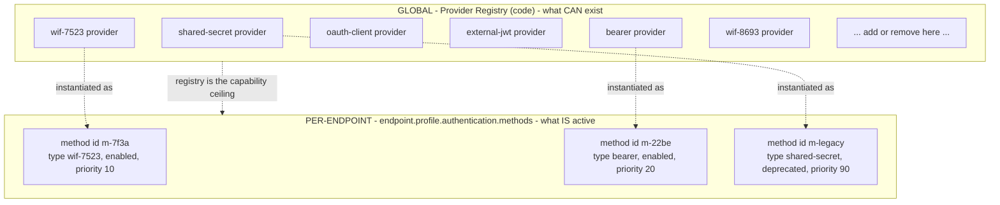

---

## 1. Vocabulary and naming decisions

The single most consequential early decision is **naming**, because four distinct concepts are easy to collide and the contract names outlive the code. The rule: **spell `authentication` out in every persisted/advertised/typed contract; render it in each layer's idiom; reserve one word per concept.**

### 1.1 The four-word layering

| Concept | Term | Why this word | Collision it avoids |
|---|---|---|---|
| Code class implementing one behavior, in a registry | **`AuthenticationProvider`** (`provider`) | one class per behavior; standard plugin English | not `scheme`, not `credential` |
| One activated, configured instance on an endpoint | **`AuthenticationMethod`** (`method`) | RFC 8414 / RFC 7591 use `token_endpoint_auth_method`; "method" = "a way to authenticate"; reads well plural | not `scheme`, not `credential`, not `config` |
| The settings/trust blob *inside* one method | **`config`** | keep "config" for the inner data only | not the method itself |
| The stored secret/trust material | **`credential`** | already the codebase term (`EndpointCredential`, `credentialType`) | keep as-is |
| The SCIM discovery advertisement | **`authenticationScheme`** | RFC 7643 section 5 mandates this exact attribute name (`authenticationSchemes`) | do not reuse "scheme" for anything else |

So: **`provider` (code) -> `AuthenticationMethod` (activated config) -> holds a `config` -> backed by a `credential` -> advertised as an `authenticationScheme`.**

### 1.2 `authentication`, not `auth`, in contracts

"auth" is ambiguous - it collapses authN (authentication: who are you) and authZ (authorization: what may you do), and this design has both (the bearer/assertion validation is authN; the roles/scopes overlay in [section 3.5](#35-the-authorization-overlay-roles-and-scopes) is authZ). In a persisted contract that ambiguity is a latent defect. The decisive precedent: the one auth term already in the stack from a standard - RFC 7643 section 5 - is **`authenticationSchemes`**, fully spelled out. Align to it.

| Layer | Form | Grounding |
|---|---|---|
| JSON keys / API field names / TS fields | **`authenticationMethods`** (camelCase) | SCIM is camelCase (`authenticationSchemes`); repo JSON + `ProfileSettings` are camelCase ([endpoint-profile.types.ts](../../api/src/modules/scim/endpoint-profile/endpoint-profile.types.ts) line 67) |
| URL path segment | **`authentication/methods`** (kebab/lowercase) | REST convention |
| TS type / class names | **`AuthenticationMethod`**, **`AuthenticationProvider`** (PascalCase) | repo style is spelled-out (`PerEndpointCredentialsEnabled`, not `...CredsEnabled`) |
| Prisma model (if promoted to a table) | **`AuthenticationMethod`** | repo Prisma is PascalCase |
| Local variables, folder shorthand, prose | `auth` is fine | non-contractual; brevity helps |

`authentication-methods` (kebab) is correct **only in the URL**; the stored/typed field is **`authenticationMethods`** (camelCase). They are the same concept rendered in each layer's dialect - that is the best-practice meaning of "consistent at all layers", not a literally-identical string.

### 1.3 Every method carries a `type`, a `displayName`, and a `description`

PROPOSED registry shape - each provider self-describes for the UI, discovery, and logs:

| Field | Example | Used by |
|---|---|---|
| `type` (stable id, the registry key) | `wif-7523` | routing, persistence, discovery `token_endpoint_auth_method` |
| `displayName` | `Workload Identity Federation (JWT Bearer Assertion)` | UI card title, `authenticationScheme.name` |
| `description` | `RFC 7523 section 2.2 client authentication: present a signed JWT assertion at the token endpoint to receive a short-lived bearer token.` | UI help text, `authenticationScheme.description` |
| `specUri` | `https://www.rfc-editor.org/rfc/rfc7523` | `authenticationScheme.specUri` |
| `plane` | `token` \| `resource` \| `both` | which resolver consults it ([section 2](#2-the-conceptual-model-two-planes-three-data-classes)) |
| `tokenEndpointAuthMethod` | `private_key_jwt` | RFC 8414 metadata, token-plane only |
| `lifecycleStatus` | `active` \| `deprecated` \| `disabled` | lifecycle ([section 12.2](#122-lifecycle-add-and-remove-without-core-churn)) |

The proposed `type` registry, with its IANA `token_endpoint_auth_method` mapping where applicable:

| `type` | displayName | plane | `token_endpoint_auth_method` (RFC 8414 / IANA) | SCIM `authenticationScheme.type` (RFC 7643 section 5) | Status |
|---|---|---|---|---|---|
| `shared-secret` | Legacy Global Bearer | resource | n/a | `oauthbearertoken` | SHIPPED |
| `bearer` | Per-Endpoint Bearer | resource | n/a | `oauthbearertoken` | SHIPPED (G11) |
| `oauth-client` | OAuth 2.0 Client Credentials | both | `client_secret_post` / `client_secret_basic` | `oauth2` | global SHIPPED; per-endpoint = Q1 |
| `external-jwt` | External JWT (JWKS-validated) | resource | n/a | `oauth2` | Q2 |
| `wif-7523` | WIF (JWT Bearer Assertion, RFC 7523) | token | `private_key_jwt` | `oauth2` | Q6 |
| `wif-8693` | WIF (OAuth Token Exchange, RFC 8693) | token | n/a (extension grant) | `oauth2` | Q6 |
| `oauth-authcode` | OAuth 2.0 Authorization Code + refresh | both | `client_secret_post` | `oauth2` | Q4 (build on demand) |
| `mtls` / `dpop` | mTLS / DPoP sender-constrained | both | `tls_client_auth` / n/a | `oauth2` | Q5 (deferred) |
| `httpbasic` | HTTP Basic (RFC 7617) | resource | n/a | `httpbasic` | NOT DESIGNED (see [section 9.3](#93-deliberately-not-designed)) |

> **Why `type` is separate from method `id`.** `type` answers "which behavior / code path?" and is non-unique on purpose - one endpoint may hold two `wif-7523` methods (a per-app trust and a 1P trust during migration). `id` answers "which activated instance?" and is the stable handle for attribution, credential linkage, targeted enable/disable/rotate, and concurrency. `type` = "new code exists"; `id` = "a distinct thing I operate on"; `version` (v1/v2) = data inside `config.trustProfiles[]`, never a new `type` (see [section 3.1](#31-axis-a-token-version-v1-vs-v2)).

---

## 2. The conceptual model: two planes, three data classes

### 2.1 Two planes

Authentication happens at two distinct moments; conflating them is the classic mistake. Multiple methods behave differently at each.

| Plane | When | What runs | "Multiple active" means |
|---|---|---|---|
| **Token-mint plane** (credential -> token) | `POST .../oauth/token` | the method that can *mint* a SCIMServer token (`wif-7523`, `wif-8693`, `oauth-client`) | dispatch by request shape -> at most one matches |
| **Resource plane** (token/credential -> access) | every SCIM call | the guard chain that *accepts* a presented credential (issued JWT, per-endpoint bearer, external JWT, legacy secret) | try each enabled acceptor in priority order until one accepts |

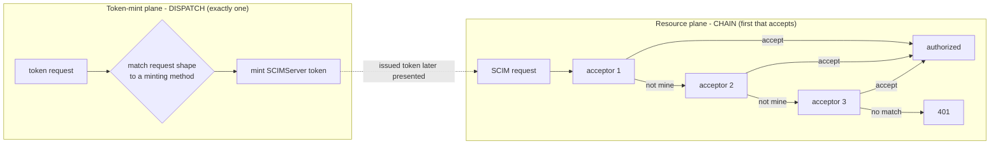

The shipped guard ([shared-secret.guard.ts](../../api/src/modules/auth/shared-secret.guard.ts) lines 105-145) is already the 3-link resource-plane chain: per-endpoint bcrypt bearer -> OAuth JWT -> legacy `SCIM_SHARED_SECRET`. This design generalizes it to N links driven by the activated set, and adds the token-mint plane.

### 2.2 The three-outcome acceptor contract (a hardening requirement)

A resource-plane provider returns **three** outcomes, not two:

| Outcome | Meaning | Why it matters |
|---|---|---|
| `accept` | this credential is mine and valid | authorize |
| `not-mine-continue` | not my shape, try the next method | normal chain progression |
| `mine-but-invalid-stop` | this credential is *for me* but failed validation - stop now | **prevents a forged WIF/JWT token from silently falling through to be retried by the legacy-secret acceptor (downgrade-confusion)** |

The current guard only has accept / continue. Generalizing to N methods makes the third outcome mandatory.

### 2.3 Three data classes (the split that keeps embedding safe)

Copying ordinary config between layers is harmless; copying a *safety guardrail* and making it operator-editable re-opens the hole the guardrail existed to close. So each datum is classified:

| Class | Examples | Storage | Who can change | Why |
|---|---|---|---|---|
| **A - Relationship / behavior** | issuer, subject, audience, `jwksUri` value, granted scopes, `requiredRoles`, TTL within bounds, accepted profiles/versions for this endpoint | embedded **by value**, fully editable per endpoint | endpoint operator | genuinely per-relationship; the bulk of the config |
| **B - Safety invariant** | alg allowlist, JWKS **host** allowlist, TTL **max**, trusted 1P app-id catalog, allowed-issuer host patterns | embedded **copy for self-containment**, but a **compiled, non-overridable floor in code is the real gate**; the copy may only ever be at-or-inside the floor | nobody at runtime; only a deploy changes the floor | a copied-and-editable guardrail is not a guardrail |
| **Secrets** | signing **private key** material; `client_secret` plaintext | **never embedded.** The endpoint holds a `keyRef`/`credential` reference; material lives in env / secret store / `EndpointCredential.credentialHash` | platform, out of band | self-contained *config* is not self-contained *secrets* (OWASP) |

The invariant that keeps embedding sound:

$$\text{effective}_B = \text{embeddedCopy}_B \;\cap\; \text{compiledFloor}_B \qquad(\text{copy may narrow, never widen})$$

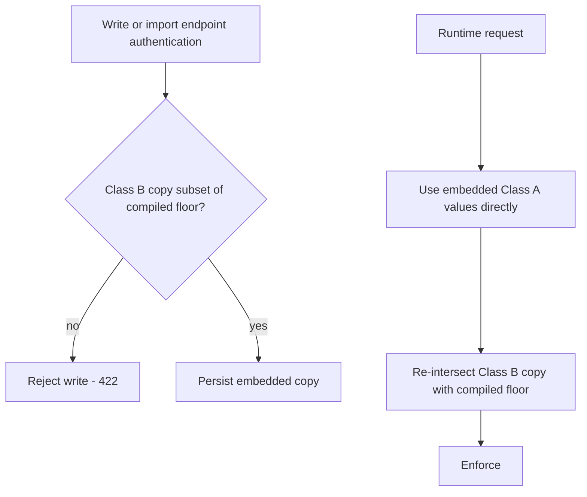

The payoff: the values you would most urgently need to fix fleet-wide in an incident (the security floor) stay central-by-code, so a fix is a redeploy with zero fan-out, while everything legitimately per-relationship is embedded and portable.

---

## 3. The axes model: version x profile x identity-model + roles/scopes overlay

WIF and its upcoming cases are not a flat list of features. They are **three independent structural axes** plus a cross-cutting **authorization overlay**. Keeping them orthogonal is what stops a combinatorial explosion: the axes only *select configuration and decide which claims are discriminators*; the cryptographic core (resolve key by `kid`, verify signature, alg-pin, check time window) is byte-for-byte identical in every combination.

| Axis / overlay | Values | What it controls | Status |
|---|---|---|---|
| **A. Token version** (row) | v1, v2 | `iss`/`aud` strings, JWKS path, `ver` | v2 default; v1 = opt-in compat |
| **B. Assertion profile** (column) | RFC 7523 `jwt-bearer`, RFC 8693 `token-exchange` | wire field, `grant_type`, response shape, error family | 7523 today; 8693 upcoming |
| **C. Identity model** (trust shape) | per-customer-app, 1P shared app | which claims are discriminators vs constants; where trust anchors live | per-app today; 1P upcoming |
| **Overlay 1. Roles** | `requiredRoles`, enforcement on/off | authorization gate + bridge to scopes | forward-looking |
| **Overlay 2. Scopes** | requested -> granted, role->scope map | what the issued token can do at the SCIM layer | forward-looking |

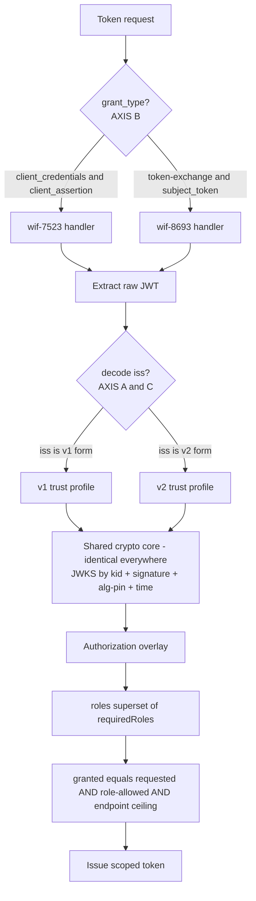

### 3.1 Axis A: token version (v1 vs v2)

v1 and v2 are the **same code path**. The only differences are the `iss` string, the `aud` shape, and the JWKS path - that is **data, not behavior**. Making `wif-7523-v1` and `wif-7523-v2` separate `type`s would duplicate the whole provider for two string constants (a DRY / god-class violation). So version lives as **config inside the method**, in a `trustProfiles[]` list:

```jsonc
{
  "id": "m-7f3a",
  "type": "wif-7523",
  "config": {
    "trustProfiles": [
      { "version": "v2", "issuer": "https://login.microsoftonline.com/<tid>/v2.0", "jwksUri": ".../discovery/v2.0/keys", "audience": "<appid-guid>" },
      { "version": "v1", "issuer": "https://sts.windows.net/<tid>/",               "jwksUri": ".../discovery/keys",      "audience": "api://<appid>" }
    ]
  }
}
```

Because `trustProfiles[]` is a list, one method can accept v1 + v2 simultaneously - exactly what a v1->v2 migration on a single endpoint needs.

> **Reconciliation with the WIF doc's "v2-only DECIDED" ([WIF section 4.1](WIF_JWT_BEARER_ASSERTION_FOR_SCIM.md#41-decided---entra-v2-token-format-only-issuer-and-audience)).** That decision is correct and narrowly scoped: it governs what **Microsoft Entra's provisioning service emits** (v2-only). This document is the broader product question - **SCIMServer as a general relying party** should be *able* to trust v1-emitting issuers (legacy Entra apps with `requestedAccessTokenVersion: 1`, ISVs onboarded pre-v2-switch). Resolution: **global default stays v2-only (the secure default, matches Entra); v1 is a deliberately-enabled capability, gated by a global allowlist and opt-in per endpoint.** The WIF doc's secure default is intact; the hard architectural lock-out is removed.

### 3.2 Axis B: assertion profile (RFC 7523 vs RFC 8693)

Genuinely different *behavior*: different `grant_type`, different field carrying the JWT (`client_assertion` vs `subject_token`), different response shape (8693 adds `issued_token_type`), different error family (7523 -> `invalid_client`; 8693 -> `invalid_request`/`invalid_target`). New parsing + dispatch -> **deserves a separate `type`** (`wif-7523`, `wif-8693`). Full wire detail in [WIF section 1.4](WIF_JWT_BEARER_ASSERTION_FOR_SCIM.md#14-two-assertion-profiles-rfc-7523-jwt-bearer-and-rfc-8693-token-exchange).

### 3.3 Axis C: identity model (per-customer-app vs 1P shared app)

The per-customer-app model and the 1P (first-party) model are **mirror images** in where trust lives. In per-customer-app, Entra mints a new application in each customer tenant, so `appid`/`sub` are customer-unique and are the natural per-endpoint discriminator. In the 1P model, SyncFabric authenticates as a single Microsoft-owned application with a **fixed app id identical across every customer tenant** (the Microsoft Graph pattern).

| Claim | Per-customer-app (today) | 1P shared app (upcoming) | Consequence |
|---|---|---|---|
| `appid` / `azp` | customer-unique | **constant across all customers** | cannot be a per-endpoint discriminator; becomes a **global trusted-app constant** |
| `sub` | per-customer WI object id | the 1P SP object id | optional check, not the primary anchor |
| `tid` | matches the customer | **the only customer-unique anchor left** | tenant isolation rests on `tid` + issuer |
| `roles` | not used | **the authorization signal** | this is *why* roles "may become required with the 1P method" |

> **Why the 1P app id MUST be global, not per-endpoint.** If a tenant operator could type in "the trusted 1P app id," a malicious operator could enter an attacker-controlled app id and widen trust. A shared platform constant belongs in an audited, deployment-owned catalog (Class B), the same reasoning as the JWKS host allowlist. Add `identityModel: "per-app" | "first-party"` to each trust profile; a `first-party` profile carries `knownAppRef` pointing at the global catalog instead of a per-endpoint `audience`.

### 3.4 Roles (the bridge claim)

Roles are forward-looking (Entra does not send them yet - [WIF section 4](WIF_JWT_BEARER_ASSERTION_FOR_SCIM.md#4-the-assertion-claims-validation-jwks) upcoming-changes note). Design the validator so role enforcement is a **per-endpoint switch defaulting OFF**, with a global ceiling that can force it on; never hard-require a `roles` claim Entra does not yet send. Roles do two jobs: a **gate** (`requiredRoles` subset of `roles`, else `invalid_client`) and a **bridge** (feed the role->scope map to compute granted scopes).

### 3.5 The authorization overlay: roles and scopes

Today SCIMServer auth is binary (authorized or not). Scopes make it **graduated**, and introduce a flow spanning both the token endpoint and the resource guard. The issued token's effective scope is an **intersection, never a union** (the security-critical rule, RFC 6749 section 3.3 semantics):

$$\text{granted} = \text{requested} \cap \text{role-allowed} \cap \text{endpoint-ceiling} \cap \text{global-max}$$

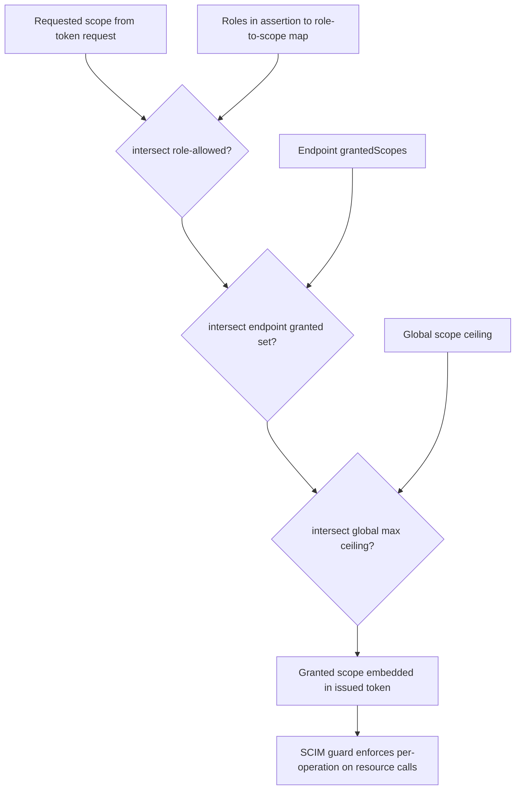

The new resource-side piece: the SCIM guard reads the `scope` claim off the issued token and enforces it per HTTP operation (a `scim:read`-only token gets 403 on `POST /Users`). Implement as a small per-route required-scope table mapped from the global scope catalog so it stays declarative. RFC hooks: `invalid_scope` at the token endpoint when `requested` is not a subset of the endpoint ceiling; SCIM 403 on a scope-insufficient resource call; granted-narrower-than-requested MUST echo the granted `scope` (RFC 6749 section 5.1).

---

## 4. Current SCIMServer state (source-grounded)

Verified against the in-repo source on 2026-06-18. This is the factual baseline the design extends.

### 4.1 The shipped resource-plane chain

[shared-secret.guard.ts](../../api/src/modules/auth/shared-secret.guard.ts) `canActivate` runs, in order:

```mermaid
flowchart TD
    A[Incoming request<br/>Authorization Bearer XYZ] --> B{Route is &#64;Public?}
    B -- yes --> Z[200 - skip auth]
    B -- no --> C{URL has /endpoints/uuid/ segment?}
    C -- yes --> D{PerEndpointCredentialsEnabled<br/>flag on endpoint?}
    C -- no --> F
    D -- true --> E[bcrypt.compare token vs<br/>active EndpointCredential hashes]
    D -- false --> F
    E -- match --> OK1[200 - authType endpoint_credential]
    E -- no match --> F
    F[OAuthService.validateAccessToken<br/>jwtService.verify HS256 self-signed] -- valid --> OK2[200 - authType oauth]
    F -- invalid --> G{safeCompare token vs SCIM_SHARED_SECRET?}
    G -- yes --> OK3[200 - authType legacy]
    G -- no --> FAIL[401 - WWW-Authenticate Bearer realm SCIM]
```

Verified facts:

| Fact | Source |
|---|---|
| Endpoint-id is extracted by regex `/\/endpoints\/([0-9a-f-]{36})\//i` | [shared-secret.guard.ts](../../api/src/modules/auth/shared-secret.guard.ts) `extractEndpointId` |
| `authType` is one of `oauth` \| `legacy` \| `endpoint_credential` | `AuthenticatedRequest` interface |
| On reject the guard **already** sets `WWW-Authenticate: Bearer realm="SCIM"` (but **not** the RFC 6750 section 3 `error=`/`error_description=` params) | `reject()` |
| 401 body is the SCIM error envelope `{schemas, detail, status:401, scimType:"invalidToken"}` | `reject()` |

> **Correction to the gap plan.** [ISV_AUTH_PATTERNS_AND_SCIMSERVER_GAP_PLAN.md](ISV_AUTH_PATTERNS_AND_SCIMSERVER_GAP_PLAN.md) section 4.3 lists "no `WWW-Authenticate` header" as a gap. That is imprecise: the header **is** emitted, just without the `error`/`error_description` parameters. The real Q0 task is to *enrich* the existing header, not add a missing one.

### 4.2 The shipped token-mint plane

[oauth.controller.ts](../../api/src/oauth/oauth.controller.ts) + [oauth.service.ts](../../api/src/oauth/oauth.service.ts):

| Fact | Source |
|---|---|
| `POST /oauth/token`, **global** (not per-endpoint), reads a **JSON** `@Body()` | [oauth.controller.ts](../../api/src/oauth/oauth.controller.ts) `getToken` |
| Rejects any `grant_type` other than `client_credentials` -> 400 `unsupported_grant_type` | same |
| Requires `client_id` + `client_secret` -> 400 `invalid_request` if missing | same |
| One global client from `OAUTH_CLIENT_ID` / `OAUTH_CLIENT_SECRET` env | [oauth.service.ts](../../api/src/oauth/oauth.service.ts) constructor |
| HS256 self-signed JWT, 1 h TTL; payload `{sub, client_id, scope, token_type:"access_token"}` - **no `aud`, no `endpoint_id`** | `generateAccessToken` |
| `safeCompare` (timing-safe) on the secret | same |

### 4.3 The shipped credential model + create gate

| Fact | Source |
|---|---|
| `POST /admin/endpoints/:endpointId/credentials`, gated by `PerEndpointCredentialsEnabled` (ForbiddenException otherwise) | [admin-credential.controller.ts](../../api/src/modules/scim/controllers/admin-credential.controller.ts) `createCredential` |
| `credentialType` allowlist is `['bearer', 'oauth_client']`; DTO is `{label, credentialType, expiresAt}` only; the create path **always mints a bcrypt token** regardless of type (so `oauth_client` is *reserved but not implemented*) | same |
| Plaintext token returned exactly once as `token` in the 201 body; only the bcrypt hash is stored | same |

### 4.4 Verified-greenfield gaps (what is genuinely absent)

| Capability | Evidence (grep across `api/src`, 2026-06-18) |
|---|---|
| **HTTP Basic** auth | zero `Basic ` header parsing, zero `httpbasic` - the only "Basic" hit is a test-section comment. **Provably absent.** |
| `client_assertion` path | zero matches |
| `jose` / `createRemoteJWKSet` external-JWKS *validator* | not in [api/package.json](../../api/package.json) or `api/src` (still Q2). **JWKS *publication* now SHIPPED (Pre-Q.B)** at `GET /scim/oauth/jwks`. |
| form-urlencoded body parsing on the token endpoint | [api/src/main.ts](../../api/src/main.ts) registers no `urlencoded` parser |
| RS256/ES256 asymmetric issuance | ~~HS256 only~~ **SHIPPED (Pre-Q.B)** - RS256 default / ES256 optional, `kid` in header, alg-pinned verify. |
| `aud` claim on issued tokens | absent from `generateAccessToken` payload (still Q0/Q1) |

> **Progress note (Pre-Q.B, [EXECUTION_LEDGER.md](EXECUTION_LEDGER.md)).** Two gaps above are closed: the OAuth issuer now signs asymmetrically (RS256/ES256) and publishes its public JWKS. See [ASYMMETRIC_SIGNING_AND_JWKS.md](ASYMMETRIC_SIGNING_AND_JWKS.md). The remaining items (external-JWKS *validator* via `jose`, form-urlencoded intake, `aud` claim, `client_assertion`) are still scheduled under Q0/Q1/Q2/A3/Q6.

---

## 5. Config placement: global vs per-endpoint

Governing principle: **global = policy, guardrails, capability ceiling, platform constants, shared crypto identity, operational tuning. Per-endpoint = the specific trust relationship + opt-in selections that may only narrow what global permits.** The relationship is a strict subset/ceiling: per-endpoint can never widen global. This is the single rule that makes the security posture provable from the global config alone.

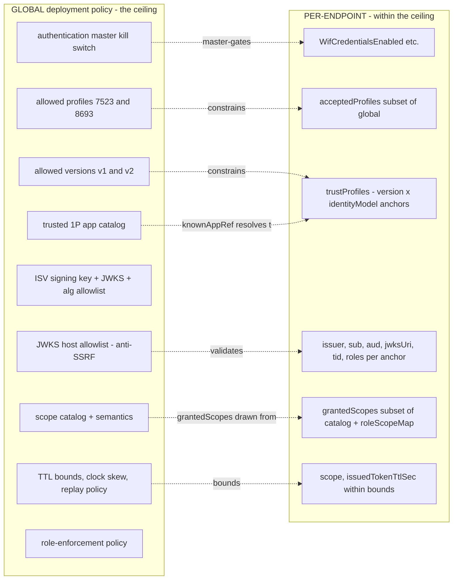

### 5.1 Placement table

| Config / data | Level | Mutability | Rationale |
|---|---|---|---|
| Authentication master switch (deployment kill switch) | Global | env / deploy | a deployment must forbid the feature regardless of endpoint config |
| Allowed assertion profiles (`wif-7523`, `wif-8693`) | Global ceiling | runtime | ship `wif-8693` "off" until GA-tested; flip on without touching endpoints |
| Allowed token versions (`v1`, `v2`) | Global ceiling | runtime | default v2-only; deliberately enable v1 for compat |
| **JWKS host allowlist** | Global | env / deploy | **critical SSRF choke point** - must NOT be per-endpoint |
| ISV signing key + `kid` + published JWKS | Global | env / secret store | one signing identity per deployment -> one JWKS to publish |
| Allowed algs (RS256/ES256), clock skew, JWKS cache max-age, fail-closed | Global | env | uniform security/operational policy |
| Issued-token TTL bounds (1-6 h) | Global | env | enforce the range; endpoint picks inside it |
| **Trusted 1P app catalog** | Global | config | the 1P app id is a platform constant, identical across customers |
| **Scope catalog** (scope strings + operation semantics) | Global | config | the resource guard must share one vocabulary |
| Default scope + global scope ceiling | Global | config | safety boundary |
| Role-enforcement global policy (off / allow / force) | Global | runtime | a strict deployment can mandate roles everywhere |
| `WifCredentialsEnabled` / per-method enable flags | Per-endpoint | flag (10-cell) | opt-in, default false |
| `acceptedProfiles` (subset of global) | Per-endpoint | method config | SuccessFactors=7523, Google=8693 |
| `trustProfiles[]` (one per version x identityModel) | Per-endpoint | method config | the list enables simultaneous per-app+1P, v1+v2 |
| issuer/subject/audience/jwksUri/allowedTenantId/requiredRoles per anchor | Per-endpoint | method config | the per-customer trust anchors |
| `subjectTokenType`, `expectedResource` (consumer-specific) | Per-endpoint | method config | consumer-defined per the SuccessFactors/Google bodies |
| `grantedScopes` (subset of catalog), `roleScopeMap`, `roleEnforcement` (subset of global) | Per-endpoint | method config | this relationship's authZ |
| `scope`, `issuedTokenTtlSec` (within bounds) | Per-endpoint | method config | the ISV defines its own scope + lifetime |

### 5.2 Storage: inside `profile.authentication`, not an endpoint sibling

The non-secret method config rides the endpoint **profile** (the existing JSONB on `Endpoint`, see [section 6](#6-persistence-and-data-model)), not a separate top-level `endpoint.authentication`. This is the "disciplined embedded" decision.

| Option | Pros | Cons | Verdict |
|---|---|---|---|
| **`endpoint.profile.authentication`** (inside) | inherits the profile's **snapshot isolation** (editing a preset never silently re-authorizes a live endpoint); **travels on export/import** (the PROD->DEV mirroring story); **preset-seedable**; matches where `PerEndpointCredentialsEnabled` already lives | profile object grows | **Recommended** |
| `endpoint.authentication` (sibling) | smaller profile | **breaks the snapshot guarantee** (two lifecycles to reason about); export/import must carry a second thing (portability regression); preset-seeding no longer covers auth | Avoid |

Storage location and management surface are **independent decisions**: profile-embedded storage + a dedicated sub-resource management API (see [section 7.3](#73-c-admin-authentication-method-api)) is the combination. The PROPOSED shape:

```jsonc
"profile": {
  "schemas": [ /* RFC 7643 section 7 */ ],
  "resourceTypes": [ /* RFC 7643 section 6 */ ],
  "serviceProviderConfig": { /* RFC 7644 section 4, incl. authenticationSchemes */ },
  "settings": { /* the existing flags */ },
  "authentication": {                  // PROPOSED
    "methods": [ /* AuthenticationMethod[] */ ],
    "defaultMethodId": "m-7f3a",       // which scheme is primary:true in discovery
    "policy": { /* roles/scopes overlay knobs */ }
  }
}
```

The small `authentication` wrapper (vs a flat `authenticationMethods` array) is justified because `defaultMethodId` and `policy` are natural siblings of `methods` - it gives the authZ overlay a home without a future migration.

---

## 6. Persistence and data model

### 6.1 What exists today (verified)

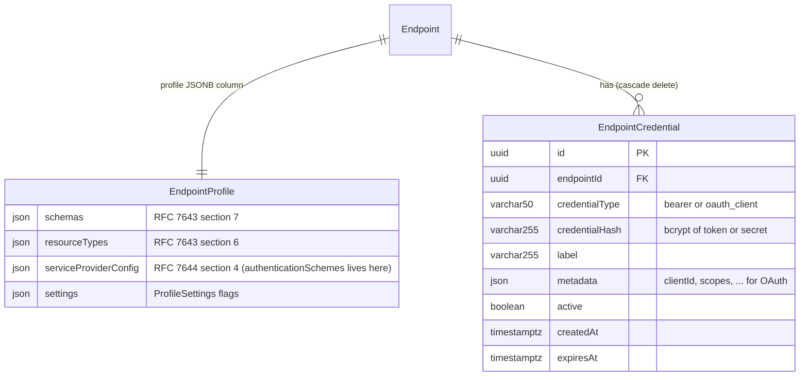

Grounded facts: `EndpointProfile` is a single JSONB column on `Endpoint` containing `schemas` / `resourceTypes` / `serviceProviderConfig` / `settings` ([endpoint-profile.types.ts](../../api/src/modules/scim/endpoint-profile/endpoint-profile.types.ts) `EndpointProfile`). `EndpointCredential` is a real table ([schema.prisma](../../api/prisma/schema.prisma) lines 131-145) with `@@index([endpointId, active])` and `onDelete: Cascade`. `ServiceProviderConfig.authenticationSchemes?: SpcAuthenticationScheme[]` already exists, shaped `{type, name, description, specUri?, documentationUri?, primary?}` - which maps 1:1 onto the per-method `type`/`displayName`/`description`/`specUri` in [section 1.3](#13-every-method-carries-a-type-a-displayname-and-a-description).

### 6.2 What the design adds (PROPOSED), and where

**Critical reuse decision: no new column, no new table for the common cases.** The `authenticationMethods[]` non-secret config rides the existing `profile` JSONB (`profile.authentication.methods[]`); secret material continues to ride the existing `EndpointCredential` table (`credentialType` gains `'wif'` and the per-endpoint `'oauth_client'` path is implemented). This is the same split the repo already uses (profile carries flags; G11 manages credentials separately).

| Datum | Where it persists | New column/table? |
|---|---|---|
| `authenticationMethods[]` (non-secret: type, enabled, priority, trustProfiles, scopes, roles, ttl) | `Endpoint.profile` JSONB -> `profile.authentication.methods[]` | **No** (rides existing JSONB) |
| WIF trust record (issuer/sub/aud/jwksUri/tid - all public) | `EndpointCredential.metadata` JSON, `credentialType: 'wif'`, **no `credentialHash` secret** | **No** (reuses `metadata`) |
| `oauth-client` secret | `EndpointCredential.credentialHash` (bcrypt), `metadata.clientId` | **No** (reuses table) |
| Global policy (allowlists, catalogs, ceilings) | a small `GlobalAuthPolicy` row OR env (hard guardrails = env; runtime-tunable ceiling = row) | **One small table** for the runtime-tunable subset |
| `schemaVersion` on the embedded `authentication` block | inside `profile.authentication` | **No** (enables blob migration) |

PROPOSED `GlobalAuthPolicy` (runtime-tunable ceiling; hard guardrails stay env):

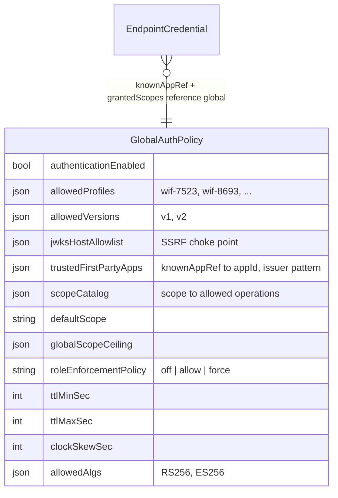

No secret is stored in either tier for WIF - both the per-app and 1P trust records hold only public values + policy. The no-secret contract is asserted by a key-allowlist test (`expect(ALLOWED_KEYS).toContain(key)`).

### 6.3 Data flow and transformations

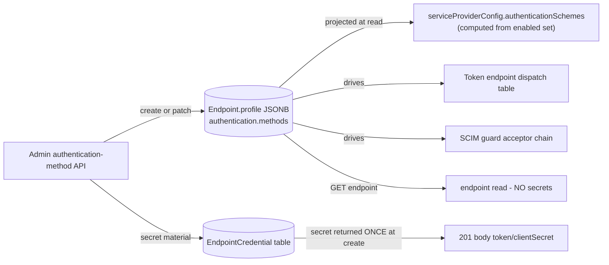

Key transformations: (1) **create** - plaintext secret generated, bcrypt-hashed into `EndpointCredential.credentialHash`, plaintext returned once and discarded; (2) **read** - `authenticationSchemes` is *computed* from the enabled method set (one entry per enabled method, `primary:true` on `defaultMethodId`), never stored redundantly; (3) **token mint** - assertion validated, a fresh short-lived ISV JWT signed with the global asymmetric key; (4) **resource** - issued JWT verified by the existing OAuth-JWT guard branch (no new branch needed - see [WIF section 8.6](WIF_JWT_BEARER_ASSERTION_FOR_SCIM.md#86-per-endpoint-enablement-and-auth-coexistence)).

---

## 7. The four API surfaces

Four distinct surfaces. The **token endpoint + resource endpoint are the runtime/wire contract** (what Entra speaks); the **admin method API + discovery are the management/bridge contract**.

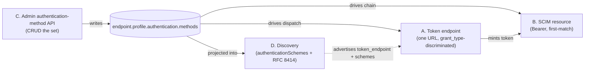

### 7.1 A. Token endpoint (token-plane runtime) - shared, body-discriminated

```
POST /endpoints/{endpointId}/oauth/token
Content-Type: application/x-www-form-urlencoded
```

> Note: **form-urlencoded** (RFC 6749 section 3.2), never JSON. The current global `/oauth/token` reads JSON; the per-endpoint endpoint must add the urlencoded parser (Q6.1).

**Request body - WIF `jwt-bearer` (RFC 7523):**

```
grant_type=client_credentials
&client_id=927cf057-74f6-4400-b22b-94f88b041914
&client_assertion=eyJ...                       (the Entra JWT)
&client_assertion_type=urn:ietf:params:oauth:client-assertion-type:jwt-bearer
&scope=scimserver-scim-access
&resource=urn:sap:identity:...                 (tolerated, consumer-specific)
```

**Request body - WIF `token-exchange` (RFC 8693):**

```
grant_type=urn:ietf:params:oauth:grant-type:token-exchange
&subject_token=eyJ...                          (the Entra JWT)
&subject_token_type=urn:ietf:params:oauth:token-type:id_token
&requested_token_type=urn:ietf:params:oauth:token-type:access_token
&scope=scimserver-scim-access
```

**Request body - plain `client_credentials` (`oauth-client`):**

```
grant_type=client_credentials&client_id=...&client_secret=...&scope=...
```

**Success response (RFC 6749 section 5.1 - note the mandatory no-cache headers):**

```http
HTTP/1.1 200 OK
Content-Type: application/json
Cache-Control: no-store
Pragma: no-cache

{ "access_token": "<ISV JWT>", "token_type": "Bearer", "expires_in": 3600, "scope": "scimserver-scim-access" }
```

The `token-exchange` profile adds the REQUIRED `issued_token_type` (RFC 8693 section 2.2.1):

```http
HTTP/1.1 200 OK
Content-Type: application/json
Cache-Control: no-store

{
  "access_token": "<ISV JWT>",
  "issued_token_type": "urn:ietf:params:oauth:token-type:access_token",
  "token_type": "Bearer",
  "expires_in": 3600
}
```

**Error response (RFC 6749 section 5.2; full catalog in [WIF section 12](WIF_JWT_BEARER_ASSERTION_FOR_SCIM.md#12-error-responses-and-rfc-6749-conformance)):**

```http
HTTP/1.1 401 Unauthorized
Content-Type: application/json
Cache-Control: no-store
WWW-Authenticate: Bearer realm="scimserver"

{ "error": "invalid_client", "error_description": "Client authentication failed" }
```

### 7.2 B. Resource endpoint (resource-plane runtime)

```http
GET /endpoints/{endpointId}/scim/v2/Users
Authorization: Bearer <ISV-issued or per-endpoint or legacy token>
Accept: application/scim+json
```

First-match across the enabled, priority-ordered resource-plane methods. On failure (RFC 6750 section 3, enriching today's header):

```http
HTTP/1.1 401 Unauthorized
Content-Type: application/scim+json
WWW-Authenticate: Bearer realm="endpoint:{id}", error="invalid_token", error_description="..."

{ "schemas": ["urn:ietf:params:scim:api:messages:2.0:Error"], "status": "401", "scimType": "invalidToken", "detail": "..." }
```

On success the matched method id is recorded internally (attribution, [section 11](#11-observability)) and never appears in the body. `Accept` / `Content-Type` is `application/scim+json` (RFC 7644 section 3.1).

### 7.3 C. Admin authentication-method API

The authoritative management surface (storage rides the profile, but management is a dedicated sub-resource - see [section 5.2](#52-storage-inside-profileauthentication-not-an-endpoint-sibling)). Why a dedicated API rather than the monolithic endpoint PUT: **secrets-once** (the 201 returns the secret exactly once; the endpoint GET never carries it), **independent lifecycle/churn** (enable/disable/reprioritize/rotate are surgical, not full-profile rewrites), **granular concurrency + least privilege**, and **clean zero-downtime migration**.

| Verb + URL | Purpose |
|---|---|
| `GET /admin/endpoints/{id}/authentication/methods` | list activated methods (priority-ordered) |
| `POST /admin/endpoints/{id}/authentication/methods` | activate a new method (returns secret once if any) |
| `GET .../authentication/methods/{methodId}` | read one |
| `PATCH .../authentication/methods/{methodId}` | enable/disable, reprioritize, edit config |
| `DELETE .../authentication/methods/{methodId}` | deactivate (lifecycle: drain -> disable -> remove) |

**Create request (WIF - no secret):**

```http
POST /admin/endpoints/{id}/authentication/methods HTTP/1.1
Authorization: Bearer <admin-token>
Content-Type: application/json

{
  "type": "wif-7523",
  "displayName": "Entra WIF for Contoso",
  "enabled": true,
  "priority": 10,
  "config": {
    "acceptedProfiles": ["jwt-bearer"],
    "trustProfiles": [
      { "identityModel": "per-app", "version": "v2",
        "issuer": "https://login.microsoftonline.com/<tid>/v2.0",
        "audience": "<appid-guid>",
        "jwksUri": "https://login.microsoftonline.com/<tid>/discovery/v2.0/keys",
        "allowedTenantId": "<tid>", "subject": "<wi-oid>", "requiredRoles": [] }
    ],
    "scope": "scimserver-scim-access",
    "issuedTokenTtlSec": 3600
  }
}
```

**Create response (WIF - reciprocal return values, no secret):**

```http
HTTP/1.1 201 Created
Content-Type: application/json

{
  "id": "m-7f3a", "type": "wif-7523", "displayName": "Entra WIF for Contoso",
  "enabled": true, "priority": 10, "lifecycleStatus": "active",
  "returnValues": {
    "clientId": "00000000-0000-0000-0000-000000000000",
    "tokenUrl": "https://host/endpoints/{id}/oauth/token",
    "scimUrl": "https://host/endpoints/{id}/scim/v2"
  },
  "config": { /* echoed, no secrets */ }
}
```

**Create response (`oauth-client`/`bearer` - the one-time secret):**

```http
HTTP/1.1 201 Created
Content-Type: application/json

{
  "id": "m-22be", "type": "oauth-client", "displayName": "...",
  "clientId": "b8d3...", "clientSecret": "Kx7m...SHOWN-ONCE",
  "tokenUrl": "https://host/endpoints/{id}/oauth/token"
}
```

**Disable/reprioritize (surgical, the migration primitive):**

```http
PATCH /admin/endpoints/{id}/authentication/methods/m-legacy HTTP/1.1
Content-Type: application/json

{ "enabled": false }
```

### 7.4 D. Discovery + key publication

Three read-only, **unauthenticated** endpoints (RFC 7644 section 4 exempts discovery from auth).

**SCIM discovery (RFC 7643 section 5 - `authenticationSchemes` computed from the enabled set):**

```http
GET /endpoints/{id}/scim/v2/ServiceProviderConfig
```

```json
{
  "authenticationSchemes": [
    { "type": "oauth2", "name": "Workload Identity Federation (JWT Bearer Assertion)",
      "description": "RFC 7523 section 2.2 client authentication ...",
      "specUri": "https://www.rfc-editor.org/rfc/rfc7523", "primary": true },
    { "type": "oauthbearertoken", "name": "Per-Endpoint Bearer",
      "description": "A bcrypt-hashed per-endpoint bearer token.", "primary": false }
  ]
}
```

**OAuth metadata (RFC 8414 - this is where the token URL is *discovered* and each token-plane method's `token_endpoint_auth_method` is advertised):**

```http
GET /endpoints/{id}/.well-known/oauth-authorization-server
```

```json
{
  "issuer": "https://host/endpoints/{id}",
  "token_endpoint": "https://host/endpoints/{id}/oauth/token",
  "jwks_uri": "https://host/endpoints/{id}/.well-known/jwks.json",
  "grant_types_supported": ["client_credentials", "urn:ietf:params:oauth:grant-type:token-exchange"],
  "token_endpoint_auth_methods_supported": ["private_key_jwt", "client_secret_post"]
}
```

**JWKS publication (RFC 7517 - the ISV's own public keys, so the tokens it mints can be verified):**

```http
GET /endpoints/{id}/.well-known/jwks.json
```

```json
{ "keys": [ { "kty": "RSA", "kid": "...", "use": "sig", "alg": "RS256", "n": "...", "e": "AQAB" } ] }
```

---

## 8. Token-mint URL and runtime provider routing

### 8.1 Token-mint URL options

| Option | Shape | Verdict |
|---|---|---|
| **A. One shared per-endpoint URL, body-discriminated** | `POST /endpoints/{id}/oauth/token` for all minting methods | **Core choice** - RFC 6749 section 3.2 (one token endpoint, discriminate by `grant_type`); migration is body-only |
| B. Per-provider URLs | `/.../token/wif-7523` | **Reject** - non-conformant; breaks Entra (handed ONE Token URL); breaks migration |
| **C. Global + per-endpoint dual** | keep legacy global `/oauth/token` + the per-endpoint one, same handler | **Adopt with A** - back-compat + multi-tenant |
| **D. Discovery-published URL** | advertise `token_endpoint` via RFC 8414 | **Always, orthogonal** - the literal path stops mattering |

The path is implementation-defined; real ISVs vary wildly (Workday `/ccx/oauth2/{tenant}/token`, ServiceNow `/oauth_token.do`, Google a separate STS host `sts.googleapis.com`). Because the ISV *returns* the Token URL to Entra (the 3-step setup), the literal string is the ISV's choice - publish it via RFC 8414 so nothing depends on it. A shared URL is precisely what makes the zero-downtime secret->WIF migration body-only.

### 8.2 Runtime routing: the self-describing cascade (no prior binding)

"Without any prior binding" is exactly what OAuth's request shape is designed to satisfy: a token request is **self-describing**. You never need a pre-registered `client_id -> provider` map to route; every signal is in the request.

| Signal | Source | Discriminates | Trust |
|---|---|---|---|
| `{id}` path segment | URL | which endpoint -> which `authenticationMethods[]` set is eligible | structural |
| `grant_type` | body | coarse family: `client_credentials` vs `token-exchange` vs `authorization_code` | structural |
| **field presence** | body | `client_assertion` (7523) vs `subject_token` (8693) vs `client_secret` (plain CC) | structural |
| `client_assertion_type` / `subject_token_type` URN | body | confirms the assertion profile | structural |
| `Authorization: Basic` vs body creds | header | `client_secret_basic` vs `client_secret_post` | structural |
| **JWT `iss`** (decoded, unverified) | inside the assertion | which trust profile / version (v1 vs v2, per-app vs 1P) | **routing-only, never authorizing** |
| `client_id` | body | a cross-check, **not** a router | secondary |

```mermaid
flowchart TD
    REQ[POST /endpoints/&#123;id&#125;/oauth/token] --> T1[Tier 1 - resolve endpoint from id<br/>load enabled authenticationMethods]
    T1 --> T2{Tier 2 - grant_type?}
    T2 -->|client_credentials| T3{Tier 3 - which field present?}
    T2 -->|grant token-exchange| P8[wif-8693 provider]
    T2 -->|authorization_code or refresh_token| PAC[oauth-authcode provider]
    T3 -->|client_assertion present| T4[Tier 4 - decode JWT iss UNVERIFIED]
    T3 -->|client_secret only| PCC[oauth-client provider]
    T3 -->|both present| AMBIG[reject invalid_request<br/>one client-auth method only]
    T4 -->|iss matches trustProfile A| P7A[wif-7523 profile A - v2 or 1P]
    T4 -->|iss matches trustProfile B| P7B[wif-7523 profile B - v1 or per-app]
    T4 -->|no iss match| NOMATCH[reject invalid_client]
    P7A --> VERIFY[NOW verify signature against<br/>that profile JWKS]
    P7B --> VERIFY
```

The crucial subtlety: **`grant_type=client_credentials` is shared by plain-CC and WIF-7523**, so `grant_type` alone cannot route - Tier 3 (field presence + the `*_type` URN) is mandatory to split them. Tier 4 (decode `iss` to pick the trust profile) routes on *unverified* data, which is safe **only** because you then verify the signature against the JWKS that config bound to that issuer - the unverified `iss` selects a key set, it never grants anything.

### 8.3 Implementation pattern: provider `canHandle()` self-claiming chain

| Strategy | Verdict |
|---|---|
| **Self-describing dispatch** (pure function of grant_type + fields + type-URN + iss) | **Primary** - stateless, no prior binding, RFC-native |
| **Provider self-claiming (`canHandle()` chain)** - each enabled provider exposes `canHandle(req)`; iterate by priority, first claim wins | **The implementation of the above** - open/closed: add a provider, it brings its own predicate |
| **Two-phase: classify (profile) then resolve-instance (by `iss`)** | **Layer over it** - maps to the `type` vs `id` split |
| `client_id -> provider` lookup | **Reject as router** (it *is* the prior binding to avoid); keep as post-routing cross-check |
| Trial-decode / probe-all | **Reject** - oracle leakage, downgrade/confusion, forged-secret fall-through |
| Explicit hint header / `auth_method` param | **Reject for prod** (Entra/Google/SAP do not send it); OK as a test override |

**How real authorization servers do this (validates the model "from everywhere"):** Keycloak (grant SPI by `grant_type` + a separate pluggable client-authentication chain where each authenticator self-selects), Duende IdentityServer (`ISecretParser` chain returning a parsed secret or null), Spring Authorization Server (`AuthenticationConverter` chain returning null when not applicable), Ory Hydra / node-oidc-provider (grant-type registry + client-auth strategy reading `client_assertion_type` / Basic / post). The universal pattern is **grant-type dispatch + a client-authentication parser chain that self-selects by field-presence and the Authorization header**; nobody routes by a `client_id -> provider` prior binding. The standards anchor is exact: **WIF-7523 is the `private_key_jwt` `token_endpoint_auth_method`** (the value Entra's own discovery doc advertises), so the provider `type` registry maps one-to-one onto the IANA `token_endpoint_auth_method` registry for token-plane providers.

### 8.4 Safety invariants that make free-form routing sound

1. **Route on unverified data only to *pick a verifier*, never to *authorize*.** Decode `iss` to choose the trust profile; then verify against that profile's config-bound JWKS.
2. **Route on structure, not on attacker-controllable values.** Field-presence and the `*_type` URN are structural; never branch authorization on a free-text value.
3. **Exactly-one-claims invariant.** Zero providers claim -> `unsupported_grant_type` / `invalid_request`. Two claim -> config error (overlapping predicates) -> fail closed + log; warn at config-write time on overlap.
4. **Three-outcome provider contract** ([section 2.2](#22-the-three-outcome-acceptor-contract-a-hardening-requirement)) stops a clearly-7523 assertion that fails signature from falling through to plain-CC.
5. **`grant_type` + fields is the floor; `iss` is the refinement.** Never route by `iss` before the structural tier establishes the profile.

---

## 9. Coverage: SCIM + Entra mechanisms

### 9.1 What SCIM (the RFC) defines

SCIM does not implement auth; it **advertises** it. RFC 7643 section 5 defines `authenticationSchemes` on `/ServiceProviderConfig` with a fixed `type` vocabulary: `oauth`, `oauth2`, `oauthbearertoken`, `httpbasic`, `httpdigest`. RFC 7644 section 2 mandates TLS and names bearer/OAuth as the expected production mechanisms. The RFC's own example advertises **two at once** (`oauthbearertoken` + `httpbasic`, `primary:true` on one) - confirming the multi-method model is native to SCIM.

### 9.2 What Entra provisioning offers (the IdP side, single-select per job)

| Entra method | Status | maps to `type` | SCIM `authenticationScheme.type` | Covered? |
|---|---|---|---|---|
| Username + password (HTTP Basic) | **deprecated** | `httpbasic` | `httpbasic` | NOT DESIGNED (see 9.3) |
| Long-lived Secret Token (bearer) | legacy default | `shared-secret` / `bearer` | `oauthbearertoken` | SHIPPED |
| OAuth 2.0 client credentials | **only method for new ISVs** | `oauth-client` | `oauth2` | global SHIPPED; per-endpoint = Q1 |
| OAuth 2.0 Authorization Code | **deprecated** | `oauth-authcode` | `oauth2` | Q4 (on demand) |
| WIF (RFC 7523 / RFC 8693) | **rolling out (future default)** | `wif-7523` / `wif-8693` | `oauth2` | Q6 |

**Every mechanism Entra offers to *new* ISVs is covered by the design** - client_credentials (Q1), external-JWT (Q2), WIF 7523 + 8693 (Q6). Because auth is a provider registry over a per-endpoint set, "are all covered?" stops being binary: anything in the SCIM `type` vocabulary is addable as one provider without touching the resolver or storage.

### 9.3 Deliberately not designed

| Mechanism | Reason | If a customer needs it |
|---|---|---|
| `httpbasic` | a real SCIM scheme, but **deprecated on the Entra side**, weakest option (long-lived credential on every call), and **provably absent today** (grep across `api/src` = zero Basic handling, 2026-06-18) | one-provider addition; no resolver/storage change |
| `httpdigest` | effectively zero modern SCIM usage; no Entra path | do not build |
| `mtls` / `dpop` | high-security profile (FAPI 2.0, govcloud); no current ask | Q5 (deferred) |

---

## 10. Security analysis

| Threat | Mitigation | Level |
|---|---|---|
| Algorithm confusion (`alg:none`, HMAC-with-public-key) | pin `allowedAlgs` to RS256/ES256; reject all else | Global |
| **JWKS SSRF** (attacker/operator-set `jwksUri`) | host allowlist enforced at config-write AND at fetch; single choke point | **Global** |
| v1 widening the attack surface | v1 off by default; deliberate global enable; per-endpoint cannot self-enable past the ceiling | Global ceiling |
| Cross-tenant access | `tid` == `allowedTenantId`; exact-match `iss` already embeds the tenant | Per-endpoint |
| Issuer spoofing across versions | exact-string `iss` match drives trust-profile selection; no substring/normalized compare | Per-endpoint |
| Downgrade / forged-token fall-through | three-outcome acceptor contract (`mine-but-invalid-stop`) | Both planes |
| Replay | short `exp`; optional global `jti` single-use cache; assertion is client-auth only | Global |
| Privilege escalation | `requiredRoles` subset of `roles`; switchable per endpoint | Per-endpoint |
| JWKS outage | **fail closed** - never skip signature verification | Global |
| Secret leakage | WIF stores no secret; key-allowlist contract test; secret returned once at create only | Both |
| Oracle leakage | generic `invalid_client` to client; specific failing claim logged server-side only | Profile/global |
| Operator widening a guardrail | Class B floor is compiled, non-overridable; embedded copy may only narrow | Global |

This threading is the security map for the architecture; it complements (does not replace) the per-mechanism security analysis in [WIF section 10](WIF_JWT_BEARER_ASSERTION_FOR_SCIM.md#10-security-analysis).

---

## 11. Observability

The new dimensions must be *dimensions of telemetry*, because that is how you drive and retire migrations.

- **Mandatory attribution.** Every authenticated request records *which method id* authenticated it (the resource-plane match) or *which method minted* the token (token-plane), surfaced in logs/metrics. With many methods active you cannot debug or audit without it. The current guard already sets `authType` and `authCredentialId` ([shared-secret.guard.ts](../../api/src/modules/auth/shared-secret.guard.ts)); generalize to `methodId` + `methodType`.
- **Counters keyed by `(type, version, identityModel, outcome)`.** Directly answers "how many customers moved per-app -> 1P?", "are any v1 ISVs still calling?", "is 8693 traffic ramping?".
- **Roles-seen / scopes-granted histograms per endpoint.** When Entra starts sending `roles`, you *see* them arrive in telemetry before flipping enforcement on - a safe-rollout signal.
- **"Would-have-rejected" shadow counter.** While `roleEnforcement=off`, still compute the gate and emit a metric, so you know *before* enabling whether turning it on would break a live customer.
- **JWKS cache hit/miss + fetch latency; issuance count; rejection-reason histogram.**
- **Derived read-model (projection).** The one capability lost by embedding config in per-endpoint blobs - "read one global row to know fleet posture" - is regained by projecting the blobs into a derived index (versions, profiles, identityModels, template@version, drift flags) for queries/dashboards only, never on the request path.

---

## 12. Extensibility and maintainability

### 12.1 Extensibility - each future case is a registry/catalog entry, never a core change

| To add ... | Do ... | Touches the core? |
|---|---|---|
| a new auth type (e.g. `mtls`) | register one `AuthenticationProvider` | No |
| a token version (v3) or a non-Microsoft IdP | a `trustProfiles[]` entry (+ maybe its JWKS host to the global allowlist) | No |
| a scope | a row in the global scope catalog + its operation mapping | No |
| role semantics | a per-endpoint `roleScopeMap` entry | No |
| a future authZ input (e.g. a `groups` claim, ABAC) | a new overlay phase after the core, parallel to roles/scopes | No |

The `acceptedProfiles` / `allowedVersions` arrays are open-ended by construction; the resolver is generic (asks each provider, knows no specific type).

### 12.2 Lifecycle - add and remove without core churn

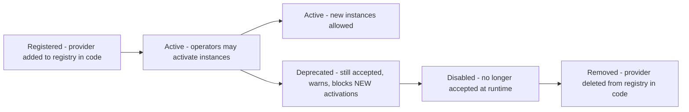

| Stage | New activations? | Existing at runtime | Where the change lives |
|---|---|---|---|
| Active | yes | accepted | registry (code) |
| Deprecated | **no** | accepted + warn-logged | provider `lifecycleStatus` |
| Disabled | no | **rejected** | provider `lifecycleStatus` |
| Removed | n/a | n/a (drained) | delete provider + migration to strip orphaned config |

**Removal discipline:** never delete a provider while live endpoints carry instances of it. Sequence: **deprecate -> telemetry-confirm zero/low usage -> migrate remaining endpoints -> disable -> remove provider + schema migration**. This mirrors the repo's Playwright-spec-hygiene rule (mark stale, prove unused, then delete).

### 12.3 Maintainability - single-responsibility seams

Keep three independently unit-testable seams: the **TrustProfileResolver** (axis A/C), the **RoleGate**, and the **ScopeCalculator**. Each is small; the shared crypto core has exactly one copy of the verification logic. This is the deliberate antidote to the god-class pattern flagged in the repo's Design Deep Analysis - authorization logic must not leak into the crypto core or the controller.

### 12.4 Provenance + drift audit (the cost of embedding, paid down)

Embedding config by value introduces drift/fan-out as the cost. Pay it down: stamp each preset-seeded value with `_provenance: { source: "template:entra-id-wif@v4", overridden: false }`. This buys **drift detection** ("which endpoints' scope catalog no longer matches template v4?"), **safe bulk re-sync** (push template updates only to `overridden:false` values), and **auditability**. A drift audit (sibling to the repo's `endpointConfigFlagAudit`) compares each embedded copy to its `template@version`.

---

## 13. Step-by-step execution plan + estimates + dependencies

This plan is **TDD-first** (Stage 0 of the standing quality gates). It sequences the architecture on top of the Phase Q sub-phases already scheduled in [ISV_AUTH_PATTERNS_AND_SCIMSERVER_GAP_PLAN.md section 5](ISV_AUTH_PATTERNS_AND_SCIMSERVER_GAP_PLAN.md#5-phased-implementation-plan-phase-q) and the WIF build order in [WIF section 13](WIF_JWT_BEARER_ASSERTION_FOR_SCIM.md#13-step-by-step-implementation-plan). It does not replace them; it adds the cross-cutting `authenticationMethods[]` model and ships the inert seams early so 1P/roles/scopes become config, not rework.

> **This is the single reconciled cross-doc execution plan for the auth cluster.** The two spokes carry deliverable detail *under* the phases named here: WIF section 13 is the per-step WIF recipe, and ISV section 5 is the original Q0-Q6 schedule plus the separable Q3/Q4/Q5 tracks. The full step-id map across all three numbering schemes is the [auth/README.md numbering-reconciliation table](README.md#numbering-reconciliation).

### 13.1 Build order

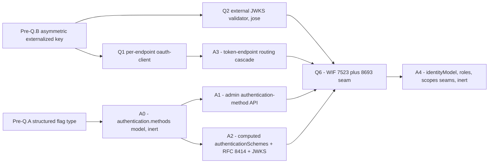

### 13.2 Phased steps

| Step | Deliverable | RED test first | Gate | Depends on |
|---|---|---|---|---|
| **Pre-Q.A** | `structured` config flag-type + validator (10-cell matrix) | structured flag round-trips `validateEndpointConfig` | 1.2, 2.1 | - |
| **Pre-Q.B** | RS256/ES256 externalized signing key + published JWKS + guard verify | signed header carries `alg:RS256` + `kid` | 2.1, 2.2 | - |
| **A0** | `profile.authentication.methods[]` schema + `schemaVersion` + read/write (inert: not yet consulted) | a method persists + round-trips; endpoint GET carries no secret | 2.1, 2.5 parity | Pre-Q.A |
| **A1** | Admin `/authentication/methods` CRUD; secret-once; orthogonal create gate | create returns secret once; GET masks; `wif` allowed when `WifCredentialsEnabled` | 2.1, 3a.2 contract, 3b.4 security | A0 |
| **A2** | Computed `authenticationSchemes` from enabled set; RFC 8414 metadata; JWKS publication | enabled endpoint advertises N schemes; disabled advertises baseline | 2.2 E2E, 3b.2 RFC | A0, Pre-Q.B |
| **Q1** | Per-endpoint `oauth-client` credential + per-endpoint issuer + `endpoint_id`/`aud` claims | per-endpoint token authorizes only its endpoint | 2.1, 2.5, 4.x live | Pre-Q.B, A0 |
| **Q2** | `jose` JWKS validator: alg-pin, cache by `kid`, fail-closed, SSRF host allowlist | good sig passes; `alg:none`+HMAC rejected; outage fails closed | 2.1, 3b.4 | Pre-Q.B |
| **A3** | Token-endpoint form-urlencoded intake + self-describing routing cascade + three-outcome contract | `client_assertion` dispatched to validator not secret path; ambiguous body -> `invalid_request` | 2.1, 2.2, 3a.3 errors | Q1 |
| **Q6** | `wif-7523` provider (validator + issuance) + `wif-8693` seam; reciprocal UI | assertion in -> own token out -> authorizes SCIM | 2.2 E2E, 4.x live, 5.3 Playwright | Q2, A1, A2, A3 |
| **A4** | `identityModel` / `roleScopeMap` / `grantedScopes` seams wired but enforcement OFF; shadow telemetry | shadow counter computes gate without enforcing | 2.1, 3b.4 | Q6 |

### 13.3 Effort estimates (ideal engineering-days, one developer fluent in the repo)

| Phase | Low | High | Primary driver |
|---|---|---|---|
| Pre-Q.A structured flag | 1 | 2 | registry + validator + 10-cell matrix |
| Pre-Q.B asymmetric key + JWKS | 2 | 3 | key load, `kid`, JWKS controller, guard verify |
| A0 methods[] model (inert) | 2 | 3 | JSONB schema + dual-backend parity + no-secret contract |
| A1 admin method API | 2 | 4 | CRUD + secret-once + orthogonal gate + UI plumbing |
| A2 computed discovery + 8414 + JWKS | 2 | 3 | populate-on-enable + metadata + JWKS publication |
| Q1 per-endpoint oauth-client | 3 | 4 | model + issuance + parity |
| Q2 external JWKS validator | 3 | 4 | new dep, alg-pin, cache, fail-closed, SSRF allowlist |
| A3 routing cascade + form intake | 2 | 3 | body parser + dispatch + three-outcome + error catalog |
| Q6 WIF 7523 (+8693 seam) | 4 | 6 | security core; heaviest test surface |
| A4 identityModel/roles/scopes seams | 2 | 3 | inert wiring + shadow telemetry |
| **Subtotal** | **23** | **35** | |
| Quality-gate overhead (~25%) | 6 | 9 | live-test (local/Docker/Azure), Playwright-vs-dev, full pipeline, CHANGELOG/Session/docs, Stage X |
| **Total ideal dev-days** | **~29** | **~44** | roughly 6 to 9 ideal engineering-weeks |

Calendar caveat: ideal dev-days are not wall-clock days; the multi-stage gate suite, the single shared dev Azure target, and review latency stretch delivery. Treat the total as an effort floor.

### 13.4 Dependencies and their sources

| Dependency | Purpose | Source | Notes |
|---|---|---|---|
| **`jose`** | JWKS client (`createRemoteJWKSet`), RS256/ES256 verify, alg allowlist | [github.com/panva/jose](https://github.com/panva/jose) (npm `jose`) | ESM-only, zero-dependency, most-vetted Node JWT/JWKS lib; used by Auth0 SDK et al. Pin + `dependencyCveSweep`. |
| `@nestjs/jwt` | already present (HS256 issuer) | npm | extend to RS256 signing for Pre-Q.B |
| `bcrypt` | already present (per-endpoint bearer hash) | npm | unchanged |
| express `urlencoded` body parser | form-urlencoded token intake | built into express (already a transitive dep) | register in [api/src/main.ts](../../api/src/main.ts) |
| Prisma | `GlobalAuthPolicy` table (if runtime-tunable ceiling is chosen over env) | already present | `prismaMigrationAudit` if a table is added |

### 13.5 Definition of done

Each step satisfies the standing Feature / Bug-Fix Commit Checklist: unit + E2E + live tests across inmemory + Prisma + dev Azure, a Playwright spec for any `web/` change, the feature doc updated, [INDEX.md](../INDEX.md) + CHANGELOG + Session/context updated, version bumped, and the response-contract test proving no secret leaks on the `wif` method.

---

## 14. References (RFCs with sections + sources)

### 14.1 SCIM core (latest source of truth for SCIMServer-relevant parts)

- **RFC 7643** - SCIM Core Schema. **Section 5** = `authenticationSchemes` complex multi-valued attribute (the `oauth` / `oauth2` / `oauthbearertoken` / `httpbasic` / `httpdigest` `type` vocabulary, `primary` semantics). Section 7 = schema definitions. In-repo mirror under [../rfcs/](../rfcs/).
- **RFC 7644** - SCIM Protocol. **Section 2** = Authentication and Authorization (TLS mandate, bearer/OAuth expectation). **Section 4** = ServiceProviderConfig + discovery-endpoint auth exemption. Section 3.1 = `application/scim+json`.
- **RFC 7642** - SCIM Definitions, Overview, Concepts, and Requirements.

### 14.2 OAuth / JWT (the auth wire contracts)

- **RFC 6749** - OAuth 2.0 Authorization Framework. **Section 3.2** = one token endpoint, form-urlencoded, discriminate by `grant_type` (the basis for the shared-URL routing). **Section 3.3** = scope semantics (the intersection rule). **Section 4.5** = extension grants (RFC 8693 is one). **Section 5.1** = success response + `Cache-Control: no-store`. **Section 5.2** = error responses (`invalid_client`, `invalid_request`, `unsupported_grant_type`, `invalid_scope`). In-repo mirror [rfcs/](rfcs/).
- **RFC 6750** - Bearer Token Usage. **Section 3** = `WWW-Authenticate: Bearer realm/error/error_description` (the Q0 header enrichment).
- **RFC 7519** - JSON Web Token (JWT).
- **RFC 7517** - JSON Web Key (JWK) - the JWKS publication shape (section 7.4 D).
- **RFC 7521** - Assertion Framework for OAuth 2.0. Local copy [rfcs/rfc7521.txt](rfcs/rfc7521.txt).
- **[RFC 7523](https://www.rfc-editor.org/rfc/rfc7523)** - JWT Profile for OAuth 2.0 Client Authentication and Authorization Grants. **Section 2.2** = client authentication (the WIF `jwt-bearer` profile = the IANA `private_key_jwt` `token_endpoint_auth_method`). **Section 3** = JWT processing rules (validator contract). **Section 5** = RS256 mandatory-to-implement. Failure code `invalid_client`. Local [rfcs/rfc7523.txt](rfcs/rfc7523.txt); explainer [RFC_7523_EXPLAINED.md](rfcs/RFC_7523_EXPLAINED.md).
- **[RFC 8693](https://www.rfc-editor.org/rfc/rfc8693)** - OAuth 2.0 Token Exchange (the WIF `token-exchange` profile; authored by Microsoft). **Section 2.1** = request params (`subject_token`, `subject_token_type`, `requested_token_type`, `resource`, `audience`, `actor_token`). **Section 2.2.1** = response (REQUIRED `issued_token_type`). **Section 2.2.2** = errors (`invalid_request`/`invalid_target`). **Section 3** = token-type URIs. Local [rfcs/rfc8693.txt](rfcs/rfc8693.txt); explainer [RFC_8693_EXPLAINED.md](rfcs/RFC_8693_EXPLAINED.md).
- **RFC 8414** - OAuth 2.0 Authorization Server Metadata (`.well-known/oauth-authorization-server`, `token_endpoint`, `jwks_uri`, `token_endpoint_auth_methods_supported`) - the discovery basis for token-URL independence.
- **RFC 7591** - Dynamic Client Registration (`token_endpoint_auth_method` registry, source of the `private_key_jwt` / `client_secret_post` / `client_secret_basic` values).
- **RFC 7636** - PKCE (Q4 Authorization Code public clients).
- **RFC 8705** - mTLS client auth + certificate-bound tokens (Q5).
- **RFC 9449** - DPoP (Q5).
- **RFC 9700** - Best Current Practice for OAuth 2.0 Security (OAuth 2.1 BCP).

### 14.3 Microsoft Entra (the IdP behavior, latest)

- [AzureAD/SCIMReferenceCode - Workload Identity Federation for SCIM Provisioning](https://github.com/AzureAD/SCIMReferenceCode/blob/master/Workload-Identity-Federation-for-SCIM-Provisioning.md) - public WIF reference, updated 2026-06-09 to the v2 token shape; confirms WIF is one selectable Admin-Credentials method (the IdP axis is single-select).
- Entra OIDC discovery documents (the JWKS-path + issuer source of truth): [v2 metadata](https://login.microsoftonline.com/common/v2.0/.well-known/openid-configuration) (`issuer = .../{tenantid}/v2.0`, `jwks_uri = .../discovery/v2.0/keys`, lists `private_key_jwt`) and [v1 metadata](https://login.microsoftonline.com/common/.well-known/openid-configuration).
- Full Entra-side analysis: [WIF_JWT_BEARER_ASSERTION_FOR_SCIM.md](WIF_JWT_BEARER_ASSERTION_FOR_SCIM.md).

### 14.4 Reference implementations consulted for the routing model

- Keycloak (grant SPI + pluggable client-authentication chain), Duende IdentityServer (`ISecretParser` chain), Spring Authorization Server (`AuthenticationConverter` chain), Ory Hydra / node-oidc-provider (grant registry + client-auth strategy) - all converge on grant-type dispatch + a self-selecting client-authentication parser chain with no `client_id -> provider` prior binding ([section 8.3](#83-implementation-pattern-provider-canhandle-self-claiming-chain)).

### 14.5 In-repo (authoritative for SCIMServer current behavior)

- [shared-secret.guard.ts](../../api/src/modules/auth/shared-secret.guard.ts) - the live resource-plane chain.
- [oauth.controller.ts](../../api/src/oauth/oauth.controller.ts) + [oauth.service.ts](../../api/src/oauth/oauth.service.ts) - the global token-mint plane (HS256, one client).
- [admin-credential.controller.ts](../../api/src/modules/scim/controllers/admin-credential.controller.ts) - the credential-create gate (`['bearer','oauth_client']` allowlist, secret-once).
- [schema.prisma](../../api/prisma/schema.prisma) `EndpointCredential` (lines 131-145) - the credential table.
- [endpoint-profile.types.ts](../../api/src/modules/scim/endpoint-profile/endpoint-profile.types.ts) - `EndpointProfile`, `ProfileSettings`, `ServiceProviderConfig`, `SpcAuthenticationScheme`.
- [endpoint-config.interface.ts](../../api/src/modules/endpoint/endpoint-config.interface.ts) - the flag registry (needs the `structured` type).
- [G11_PER_ENDPOINT_CREDENTIALS.md](G11_PER_ENDPOINT_CREDENTIALS.md) - the shipped per-endpoint-bearer architecture this extends.

---

This document is analysis + design only; no code has been implemented for the `authenticationMethods[]` model. The current shipped baseline is described in [section 4](#4-current-scimserver-state-source-grounded) and is the factual source of truth.
