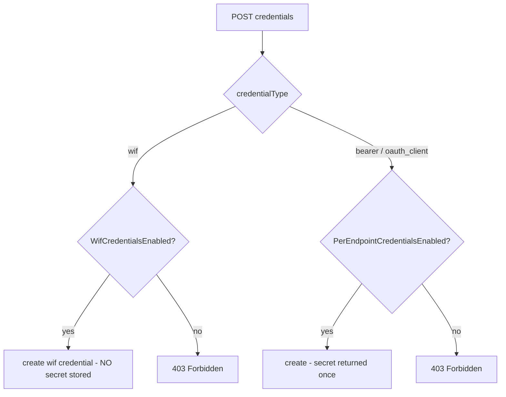

# Admin Authentication-Methods API + Orthogonal WIF Gate (A1)

> Step **A1** of the authentication build ([AUTHENTICATION_ARCHITECTURE.md section 13](AUTHENTICATION_ARCHITECTURE.md#13-step-by-step-execution-plan--estimates--dependencies), tracked in [EXECUTION_LEDGER.md](EXECUTION_LEDGER.md)). Adds the management surface for the A0 inert authentication model, plus the `WifCredentialsEnabled` flag and the orthogonal credential-create gate.

## What changed

A0 added the `profile.authentication.methods[]` data model but no way to manage it. A1 adds:

1. an **admin CRUD API** for the methods;
2. the **`WifCredentialsEnabled`** config flag (the 17th flag);
3. an **orthogonal credential-create gate** so `wif` credentials ride their own flag, independent of the bcrypt-bearer gate.

## 1. Admin authentication-methods CRUD

[admin-authentication-method.controller.ts](../../api/src/modules/scim/controllers/admin-authentication-method.controller.ts):

| Method | Route | Behavior |
|---|---|---|
| GET | `/admin/endpoints/:id/authentication/methods` | `{ methods: [...] }` (empty when none) |
| POST | `/admin/endpoints/:id/authentication/methods` | add a method; server assigns `id` (`m-xxxxxxxx`); returns the saved method |
| DELETE | `/admin/endpoints/:id/authentication/methods/:methodId` | remove a method (204); 404 if not found |

- A method's `type` must be a known registry value (`bearer`, `oauth-client`, `external-jwt`, `wif-7523`, `wif-8693`, ...); an unknown type is 400.
- Persistence rides the endpoint profile (A0 model) via `EndpointService.updateEndpoint` -> `mergeProfilePartial` (which gained `authentication` block replacement), so **both backends behave identically** and the cache + SSE events fire as usual.
- **No-secret invariant (A0):** `expandAuthentication` strips secret-looking config keys on save, so a mistakenly-submitted `config.clientSecret` never persists or appears in any response.

## 2. `WifCredentialsEnabled` flag

The 17th endpoint config flag ([endpoint-config.interface.ts](../../api/src/modules/endpoint/endpoint-config.interface.ts)), boolean, default `false`. It is the per-endpoint enabling switch for WIF, exactly like `PerEndpointCredentialsEnabled` is for the bcrypt bearer. Default-false means existing endpoints are untouched until an operator opts in. Documented in [ENDPOINT_CONFIG_FLAGS_REFERENCE.md](../ENDPOINT_CONFIG_FLAGS_REFERENCE.md#wifcredentialsenabled).

> **10-cell matrix status.** A1 completes the backend cells (registry + default + validator + enforcement via the orthogonal gate + unit + E2E + live + doc). The two UI cells (a Switch in the endpoint config UI + its vitest) land with the Q6 CredentialsTab WIF section, since that is where the WIF UI lives.

## 3. Orthogonal credential-create gate

[admin-credential.controller.ts](../../api/src/modules/scim/controllers/admin-credential.controller.ts) `createCredential` now branches by type:

- `wif` is allowed when `WifCredentialsEnabled` is on, **independent** of `PerEndpointCredentialsEnabled`.
- `bearer` / `oauth_client` still require `PerEndpointCredentialsEnabled`.
- The `wif` credential stores **only public trust values** (issuer/subject/audience/jwksUri/allowedTenantId/...) in `EndpointCredential.metadata`, with an empty `credentialHash`. The response carries no `token`/`clientSecret`/`credentialHash`/`secret` (asserted at every layer).

## Test coverage

| Layer | Test | Covers |
|---|---|---|
| Unit | [endpoint-config.interface.spec.ts](../../api/src/modules/endpoint/endpoint-config.interface.spec.ts) | `WifCredentialsEnabled` registered, default false, reads true |
| Unit | [admin-credential.controller.spec.ts](../../api/src/modules/scim/controllers/admin-credential.controller.spec.ts) | orthogonal gate (wif allowed when only WifCredentialsEnabled; bearer still needs PerEndpointCredentialsEnabled); wif response no-secret |
| E2E | [admin-authentication-methods.e2e-spec.ts](../../api/test/e2e/admin-authentication-methods.e2e-spec.ts) | CRUD slice: empty -> add (secret-stripped) -> list -> unknown-type 400 -> delete -> 404 -> profile persistence |
| Live | `scripts/live-test.ps1` section **9z-AQ** | CRUD + orthogonal gate (403 when off, allowed + no-secret when on) across all 3 form factors |
