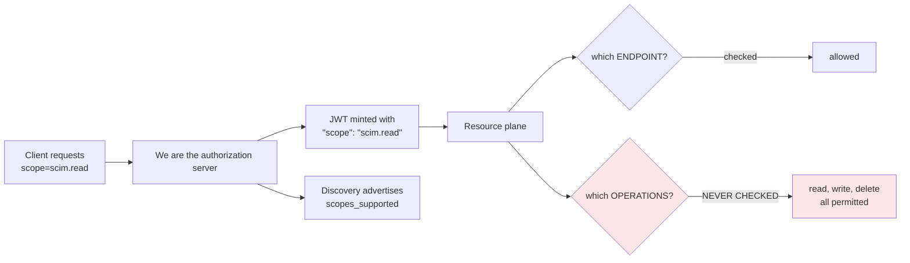
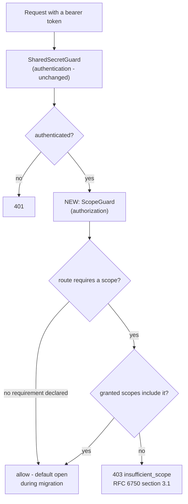
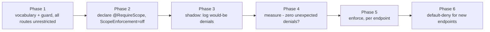

# SCIMServer authorization and scopes - planned feature

**Status:** PLANNED - design only, nothing built
**Owner:** auth workstream
**Last verified:** 2026-09-02
**Register entries:** A3' (deferred by decision), N10 (`GlobalAuthPolicy`)

---

## 1. Operator decisions this document records

These were decided on 2026-09-02 and are **not open questions**. They are written
down so a future reader does not reopen them by accident.

| Decision | Rationale |
|---|---|
| **A3' read-restriction: NOT doing it now.** The request log stays readable by any admin caller. | The current state gives better **observability and traceability**, which is the point of the log. |
| **`PersistRequestSecrets` stays `true`.** | Full request/response capture is what makes RCA fast. Declined three times now; treat it as settled. |
| **Scoped admin credentials: separate planned feature.** | It is a **breaking change for end users** and a substantially larger piece of work than the log-read question that surfaced it. It gets its own design, its own release, and its own migration - not a corner of an unrelated change. |

**Consequence to state plainly:** while `PersistRequestSecrets` is `true`, the
request log contains live bearer tokens. Read access to logs is therefore
*equivalent to* credential access. That is an accepted trade, not an oversight -
but it is the reason this feature exists at all, and the reason it should not be
deferred indefinitely.

---

## 2. What the SCIM RFCs actually say

The short answer: **SCIM deliberately defines no authorization model.** It
delegates entirely to HTTP and OAuth. Quotations are from the local corpus at
[docs/rfcs/rfc7644.txt](../rfcs/rfc7644.txt) and
[docs/auth/rfcs/rfc6749.txt](rfcs/rfc6749.txt).

### 2.1 RFC 7644 Section 2 - "Authentication and Authorization"

> The SCIM protocol is based upon HTTP and does not itself define a SCIM-specific
> scheme for authentication and authorization. SCIM depends on the use of
> Transport Layer Security (TLS) and/or standard HTTP authentication and
> authorization schemes as per [RFC7235].

It then lists methodologies "among others": **TLS Client Authentication**,
**HOBA**, **Bearer Tokens**, and **PoP Tokens**. On bearer tokens specifically:

> While bearer tokens most often represent an authorization, it is assumed that
> the authorization was based upon a successful authentication of the SCIM
> client. Accordingly, the SCIM service provider must have a method for
> validating, parsing, and/or "introspecting" the bearer token for the relevant
> authentication and authorization information. **The method for this is assumed
> to be defined by the token-issuing system and is beyond the scope of this
> specification.**

**Read that last sentence carefully.** SCIM says the service provider *must have*
a method for extracting authorization information from the token - and then
declines to specify it. The obligation is real; the mechanism is ours to choose.

### 2.2 RFC 7644 Section 2.1 - "Use of Tokens as Authorizations"

This is the closest the SCIM specs come to prescribing anything:

> When using bearer tokens or PoP tokens that represent an authorization grant,
> such as a grant issued by OAuth (see [RFC6749]), implementers **SHOULD consider
> the type of authorization granted, any authorized scopes** (see Section 3.3 of
> [RFC6749]), **and the security subject(s) that SHOULD be mapped from the
> authorization when considering local access control rules.**

So: a normative **SHOULD** to consider authorized scopes and map subjects onto
local access control rules. Not a MUST, and no vocabulary is given - but the
direction is unambiguous, and it is the direction this feature takes.

It also carries a hard requirement:

> When using OAuth authorization tokens, implementers **MUST** take into account
> the threats and countermeasures related to the use of client authorizations, as
> documented in Section 8 of [RFC7521].

### 2.3 RFC 6749 Section 3.3 - where "scope" is actually defined

> The value of the scope parameter is expressed as a list of space-delimited,
> case-sensitive strings. **The strings are defined by the authorization server.**

> The authorization server MAY fully or partially ignore the scope requested by
> the client... If the issued access token scope is different from the one
> requested by the client, the authorization server **MUST** include the "scope"
> response parameter to inform the client of the actual scope granted.

**There is no standard SCIM scope vocabulary.** `scim.read` / `scim.write` are
conventions, not standards. We are the authorization server, so we define them -
and we are already doing so (section 3).

### 2.4 RFC 7644 Section 7.4 - relevant to P1

> Since the possession of a bearer token or cookie MAY authorize the holder to
> potentially read, modify, or delete resources, bearer tokens and cookies
> **MUST** contain sufficient entropy to prevent a random guessing attack.

Our per-endpoint credentials are 32 random bytes (256 bits), which satisfies this
comfortably - and is precisely why a slow KDF buys nothing (see
[P1_KEYED_CREDENTIAL_LOOKUP_DESIGN.md](P1_KEYED_CREDENTIAL_LOOKUP_DESIGN.md)).

### 2.5 Summary of obligations

| Source | Force | Obligation |
|---|---|---|
| 7644 §2 | descriptive | No SCIM-specific authz scheme; use HTTP/OAuth |
| 7644 §2 | **must** (lowercase) | Provider must have a method to extract authz info from the token |
| 7644 §2.1 | **SHOULD** | Consider granted scopes + map subjects to local access control |
| 7644 §2.1 | **MUST** | Account for RFC 7521 §8 threats |
| 7644 §7.4 | **MUST** | Sufficient token entropy |
| 6749 §3.3 | **MUST** | Tell the client the granted scope when it differs from requested |

---

## 3. What we have today - measured, not assumed

This is the part that reframes the whole feature.

### 3.1 We already mint scopes

`POST /scim/oauth/token` accepts a `scope` parameter, honours a narrower request,
and returns the granted scope. Verified live against dev on 2026-09-02:

```text
POST /scim/oauth/token
Content-Type: application/x-www-form-urlencoded

grant_type=client_credentials&client_id=scimserver-client&client_secret=***&scope=scim.read
```

```json
{
  "granted_scope": "scim.read",
  "token_scope_claim": "scim.read"
}
```

The scope is minted into the JWT ([oauth.service.ts](../../api/src/oauth/oauth.service.ts)
`scope: grantedScopes.join(' ')`) and advertised in discovery as
`scopes_supported` ([oauth-metadata.controller.ts](../../api/src/oauth/oauth-metadata.controller.ts)).

### 3.2 Nothing enforces them

**Verified live on dev, 2026-09-02.** A token minted with `scope=scim.read`,
carrying `"scope": "scim.read"` as a claim, was used to **create and then delete
an endpoint**:

```text
POST /scim/admin/endpoints        Authorization: Bearer <scim.read-only token>
  -> 201 Created   id=c2283ec9-dc24-4ff1-a00c-0e0c07773085
DELETE /scim/admin/endpoints/c2283ec9-...
  -> 200 OK
```

The resource plane checks **which endpoint** a token belongs to
(`bearer_token_scoped_other_endpoint` in
[oauth-jwt.authenticator.ts](../../api/src/modules/auth/authenticators/oauth-jwt.authenticator.ts)),
and never checks **what operations** the scope permits. No guard or authenticator
reads the `scope` claim for an allow/deny decision.

### 3.3 So this is an advertise-vs-enforce defect



This is the **same defect class as N8**, where the server advertised `mtls` and
`dpop` it could not enforce. We told clients a capability existed and did not
back it. The difference is that N8 was cosmetic (nobody could rely on an
unimplemented auth method), whereas here a client can reasonably believe a
`scim.read` token is safe to hand to a read-only integration - and be wrong.

### 3.4 What exists to build on

| Asset | State | File |
|---|---|---|
| Scope minting + narrowing | **working** | `oauth.service.ts` |
| `scopes_supported` discovery | **working** | `oauth-metadata.controller.ts` |
| `scope` claim in JWT | **working** | `oauth.service.ts` |
| `RoleEnforcementMode = 'off' \| 'shadow' \| 'enforce'` | **inert seam**, ships `off` | [wif-shadow-telemetry.ts](../../api/src/oauth/wif-shadow-telemetry.ts) |
| `roleScopeMap?: Record<string, string[]>` | **inert seam** | same |
| Per-route enforcement | **does not exist** | - |
| Roles/scopes on admin credentials | **does not exist** | - |

**The feature is smaller than it first appears.** It is not "add scopes"; it is
"enforce the scopes we already issue, and extend them to credential types that
do not carry one yet."

---

## 4. Proposed design

### 4.1 Scope vocabulary

RFC 6749 §3.3 leaves the strings to us. Proposed minimum set, deliberately
coarse - a vocabulary nobody can reason about is worse than none:

| Scope | Grants |
|---|---|
| `scim.read` | GET / HEAD on SCIM resource routes |
| `scim.write` | POST / PUT / PATCH / DELETE on SCIM resource routes |
| `scim.admin.read` | GET on `/admin/**`, including request logs |
| `scim.admin.write` | mutations on `/admin/**` (endpoints, settings) |
| `scim.credentials` | credential create / rotate / reveal - **separate because it is secret-bearing** |

`scim.credentials` is split out deliberately: reveal returns plaintext secrets,
so it should be grantable independently of ordinary admin work.

### 4.2 Enforcement point



Two properties matter:

1. **Authentication and authorization stay separate.** `SharedSecretGuard`
   answers *who are you*; the new guard answers *may you do this*. Merging them
   would grow the guard that already carries seven responsibilities.
2. **`403`, not `401`.** RFC 6750 §3.1 defines `insufficient_scope` with a `403`.
   A `401` would tell a client to re-authenticate, which will not help.

### 4.3 Where scopes come from, per credential type

| Credential type | Scope source | Change needed |
|---|---|---|
| OAuth JWT (we minted it) | `scope` claim | **none** - already present |
| Global shared secret | implicit | grant all scopes (backward compatible) |
| Per-endpoint bearer | none today | **new** `scopes` column, default all |
| WIF assertion | `roleScopeMap` seam | wire the existing inert seam |

### 4.4 The declaration

```jsonc
// Schematic - a route declares what it needs; the guard reads it.
@RequireScope('scim.admin.read')
@Get('logs')
async listLogs() { /* ... */ }
```

An endpoint-config flag governs enforcement so it can be rolled out per endpoint:

```json
{
  "profile": {
    "settings": {
      "ScopeEnforcement": "shadow"
    }
  }
}
```

`off` -> `shadow` (log what *would* be denied) -> `enforce`. This is the same
three-state pattern `RoleEnforcementMode` already defines, reused rather than
reinvented.

---

## 5. Why this is breaking, and how migration avoids it

**The breaking shape:** today every authenticated caller can do everything. The
moment enforcement is on, any integration whose token lacks a scope it silently
relied on **stops working**. That is why this is its own feature.



**Phase 4 is the gate, and it is a measurement, not a waiting period.** The same
rule as P1 phase 5: flip only when shadow mode reports zero unexpected denials
across every estate. "It has been a few weeks, probably fine" is the reasoning
that produced the EOL-Node escape.

Backward compatibility rules:

- The **global shared secret keeps all scopes forever.** It is the operator's
  break-glass credential; narrowing it would be a footgun.
- Existing per-endpoint credentials default to **all scopes**. A credential
  issued before this feature must not change meaning.
- New credentials may be created with a narrower set; that is opt-in.

---

## 6. Test plan (to be written RED-first, per Stage 0)

| Level | Assertion |
|---|---|
| Unit | a route with `@RequireScope('scim.write')` denies a `scim.read`-only token with **403**, not 401 |
| Unit | a route with **no** declaration allows any authenticated caller (migration safety) |
| Unit | the global shared secret satisfies every scope |
| Unit | `shadow` mode **logs** a would-be denial and **allows** the request |
| Unit | negative control: the same request under `enforce` is denied - proving shadow is not just "off" |
| E2E | the live reproduction from section 3.2 (`scim.read` token creating an endpoint) now returns **403** |
| E2E | an existing credential with no `scopes` column value keeps working unchanged |
| Live | `9z-` section: mint narrow, attempt write, expect 403; mint broad, expect 200 |
| Contract | `403` body carries `error="insufficient_scope"` per RFC 6750 §3.1 |

The E2E derived from section 3.2 matters most: it is the **exact request that
succeeds today**, so it fails before the feature and passes after.

---

## 7. Design/architecture gate

| Question | Answer |
|---|---|
| SRP | A **new** guard. `SharedSecretGuard` is already ~491 lines / 7 responsibilities; adding authorization would worsen a known god-class (see D1). |
| Coupling | The guard reads a declared route requirement and a scope set from the auth result - it does not know about credential types. |
| Pattern consistency | Reuses the existing `off/shadow/enforce` tri-state and the endpoint-config flag registry rather than inventing a parallel mechanism. |
| Open/Closed | A new scope is a new string plus a decorator; no edit to the guard. |
| Simplicity (YAGNI) | Five scopes, not a policy DSL. Rejected: per-attribute authorization, a role hierarchy, and per-resource ACLs - none has a second implementation on the horizon. |
| Disposition | **(b) scheduled** - this document. Not started. |

---

## 8. Open questions for the operator

1. **Vocabulary granularity** - are the five scopes in 4.1 the right cut? In
   particular, is splitting `scim.credentials` from `scim.admin.write` worth the
   extra concept?
2. **Do per-endpoint bearer credentials need scopes at all**, or is endpoint
   isolation sufficient for them? Skipping that halves the work.
3. **Priority relative to the register** - this is currently unscheduled. It
   competes with P1 phases 4-5, A5/A7/A4, and N12.
