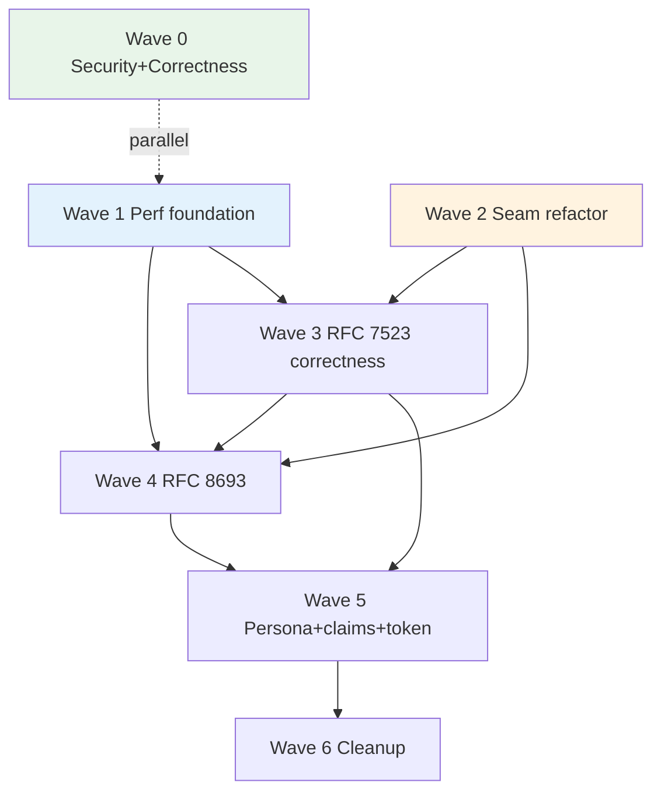

# Consolidated auth + WIF + performance delivery plan (X13)

Status: PLAN (source at `feat/wif`, api v0.54.63). This doc **consolidates and
sequences** three previously separate analysis streams into one delivery backlog:

1. **X11 - WIF token-mint latency** ([../perf/WIF_TOKEN_MINT_LATENCY_ANALYSIS.md](../perf/WIF_TOKEN_MINT_LATENCY_ANALYSIS.md)) - the perf options (cold ~2,161 ms -> tens of ms).
2. **X12 - auth-source refactoring** ([AUTH_SOURCE_REFACTORING_ANALYSIS.md](AUTH_SOURCE_REFACTORING_ANALYSIS.md)) - the `ResourceAuthenticator` / provider strategy seam.
3. **SyncFabric roadmap** ([SCIMSERVER_SYNCFABRIC_WIF_ARCHITECTURE_AND_IMPLEMENTATION_GUIDE (1).md](SCIMSERVER_SYNCFABRIC_WIF_ARCHITECTURE_AND_IMPLEMENTATION_GUIDE%20(1).md)) - RFC 8693, RFC 7523 binding corrections, persona model, security + metadata truthfulness, migration (its Phases -1..6 and file-by-file Section 25).

It is grounded in the **current** `feat/wif` source (state confirmed below), the
X10 standards comparison ([AUTH_METHODS_STANDARDS_COMPARISON.md](AUTH_METHODS_STANDARDS_COMPARISON.md)),
and the RFC set. Estimates are **relative complexity** (story points + T-shirt),
NOT calendar commitments.

## 0. The consolidation thesis (how the three streams interlock)

The three streams are not independent backlogs - they have a forced order:

- **The X12 seam is the enabler for the SyncFabric method additions.** RFC 8693,
  `private_key_jwt`, and mTLS should be **new strategy classes**, not edits to the
  491-line `SharedSecretGuard` or the 296-line controller. So the refactor
  (X12 / guide Phase 1 parser + provider foundation) MUST land before the new
  methods, or every method re-pays the god-file tax and the DA-gate fails.
- **The X11 perf foundation de-risks every external-assertion method.** RFC 8693
  adds a second external-JWKS path; multi-IdP adds more. The JWKS pre-warm +
  background refresh + hardening (X11 A/B/C/D/H + guide Section 25.2) should land
  before those scale the JWKS surface, so cold-fetch tail latency and unbounded
  egress do not multiply per method.
- **The correctness hotfix is independent and high value.** HTTP 200 + no-store and
  capability-truthful metadata do not depend on the refactor and can ship first.
  (Secret redaction / `PERSIST_REQUEST_SECRETS=false` is DECLINED per operator
  decision - request-secret capture stays ON by default for troubleshooting and is
  an operator-controlled runtime opt-out, not a build-time default flip; see W0.1.)

```mermaid
flowchart LR
    subgraph W0["Wave 0 - Security + correctness (independent, ship first)"]
        S0[secret redaction + PERSIST default false]
        H0[HTTP 200 + no-store]
        M0[capability-derived metadata]
    end
    subgraph W1["Wave 1 - Perf foundation (X11)"]
        P1[eager jose + startup pre-warm]
        P2[canonical jwks_uri]
        P3[background refresh + hard-stale]
        P4[JWKS deadline + caps]
        P5[token-mint latency gate]
    end
    subgraph W2["Wave 2 - Structural seam (X12)"]
        R1[ResourceAuthenticator chain]
        R2[strict request parser + union]
        R3[client_secret provider]
        R4[central decision emitter]
    end
    subgraph W3["Wave 3 - RFC 7523 correctness"]
        T1[WifTrustV2 + migration shadow]
        T2[bind client_id / fix AT2 identity]
        T3[drop endpoint-UUID audience]
        T4[credential cache + index]
    end
    subgraph W4["Wave 4 - RFC 8693"]
        X1[8693 provider strategy]
        X2[metadata when-active]
        X3[real-SyncFabric validation]
    end
    subgraph W5["Wave 5 - Persona + claims + token profile"]
        Z1[persona catalog]
        Z2[oid/azp + lifetime cap]
        Z3[jti + at+jwt]
    end
    subgraph W6["Wave 6 - Cleanup + future methods"]
        C1[remove legacy fallbacks]
        C2[private_key_jwt / mTLS / DPoP - future]
    end
    W1 --> W4
    W2 --> W3 --> W4 --> W5 --> W6
    W2 --> W4
    W0 -. parallel .-> W1
```

## 1. Current-source state (confirmed, grounds the estimates)

| Item | Current state (feat/wif) | Source of truth |
|---|---|---|
| Token endpoint HTTP status | **201** (no `@HttpCode`) - guide wants 200 | [endpoint-oauth.controller.ts](../../api/src/modules/scim/controllers/endpoint-oauth.controller.ts) |
| `PERSIST_REQUEST_SECRETS` default | **true** - assertions/tokens persisted by default | [logging.service.ts#L86](../../api/src/modules/logging/logging.service.ts#L86) |
| RFC 8693 handler | **not implemented** (rejected at runtime) | no `subject_token` parse path |
| Metadata advertises token-exchange | **yes** (untruthful) | [endpoint-oauth-metadata.controller.ts#L53](../../api/src/modules/scim/controllers/endpoint-oauth-metadata.controller.ts#L53) |
| `assertionProfile` field | persisted (`jwt-bearer` / `token-exchange`) but **inert** | [admin-credential.controller.ts#L97](../../api/src/modules/scim/controllers/admin-credential.controller.ts#L97) |
| Resource-plane strategy seam | **none** - 491-line `SharedSecretGuard` inlines all methods | [shared-secret.guard.ts](../../api/src/modules/auth/shared-secret.guard.ts) |
| Mint `client_secret` path | **inlined** in the controller | [endpoint-oauth.controller.ts#L189](../../api/src/modules/scim/controllers/endpoint-oauth.controller.ts#L189) |
| JWKS pre-warm / background refresh | **none** (lazy fetch, 10-min TTL) | [external-jwks-validator.service.ts](../../api/src/oauth/external-jwks-validator.service.ts) |
| `jose` load | lazy `await import('jose')` on hot path | [external-jwks-validator.service.ts#L93](../../api/src/oauth/external-jwks-validator.service.ts#L93) |
| Credential lookup | `findActiveByEndpoint` (all types, no index by type) | [wif-assertion-token.provider.ts](../../api/src/modules/scim/controllers/wif-assertion-token.provider.ts) |
| Issued token `jti` / `typ=at+jwt` | **absent** | [oauth.service.ts](../../api/src/oauth/oauth.service.ts) |
| Persona catalog | **none** | n/a |
| WifTrustV2 versioned aggregate | **none** (flat `metadata`) | [admin-credential.controller.ts](../../api/src/modules/scim/controllers/admin-credential.controller.ts) |

## 2. Release train (wave overview)

Estimate legend (relative complexity, not calendar): **S** = ~2 pts, **M** = ~5 pts,
**L** = ~8 pts, **XL** = ~20 pts (split before starting).

| Wave | Theme | Streams | Depends on | Points | Release gate |
|---|---|---|---|---:|---|
| 0 | Correctness hotfix (200/no-store + truthful metadata) | SF | none | 7 | Metadata-truthful test + token-response header test |
| 1 | Perf foundation | X11 | none | 24 | Token-mint latency gate (`9z-BW`) |
| 2 | Structural seam (refactor) + enablement consolidation | X12 | none (benefits from W1) | 25 | Guard/controller specs green + DA-gate |
| 3 | RFC 7523 correctness + trust model | SF Phases 1-3 | W2, W1 | 22 | Real-token-shadow gate + parity |
| 4 | RFC 8693 token exchange | SF Phase 4 | W2, W3, W1 | 15 | Real-SyncFabric 8693 validation |
| 5 | Persona + claim strengthening + token profile | SF Phases 1,5 + X10 | W3, W4 | 18 | Persona contract suite |
| 6 | Cleanup + future methods | SF Phase 6 | W3-W5 | 5 (+future) | Zero-legacy-use telemetry |

Core (Waves 0-6 excluding optional/future) ~ **116 points**. Optional opaque-token
track (W5.4) + future `private_key_jwt`/mTLS/DPoP (W6.2) add ~40 more and are
separate tracks.

## 3. Consolidated work items (the backlog)

Each item carries: **ID | goal | key tasks | acceptance criteria | deps | estimate
| risk**. Every item's **delivery/DoD** additionally includes the standing
per-commit obligations (Section 6): unit + E2E + live (+ Playwright if UI) + feature
doc + INDEX + CHANGELOG + version bump + DA-gate disposition.

### Wave 0 - Security + correctness hotfix

**W0.1 - Token-route secret redaction** `[Stream SF Phase -1]` - **DECLINED (operator decision, 2026-07-23)**
- Decision: do NOT default `PERSIST_REQUEST_SECRETS` to false and do NOT add unconditional token-route redaction. Request-secret capture is intentionally ON by default because it is needed for auth troubleshooting; an operator can turn it off at runtime (server env `PERSIST_REQUEST_SECRETS=false` or the per-endpoint `PersistRequestSecrets` override) when a given deployment wants it off.
- Consequence: the field-spelling-based redaction ([redact-sensitive.ts](../../api/src/security/redact-sensitive.ts)) and the existing per-endpoint/server opt-out remain the controls; no build-time default flip. Revisit only if a specific compliance requirement lands.

**W0.2 - Token endpoint returns HTTP 200 + no-store** `[Stream SF]`
- Tasks: add `@HttpCode(200)` to the token POST; set `Cache-Control: no-store` + `Pragma: no-cache`; update the E2E specs that currently assert 201.
- Acceptance: token responses are 200 with no-store headers on both the `client_secret` and WIF paths; E2E updated.
- Deps: none. Estimate: **S**. Risk: Low (client-compat - Entra tolerates 200).

**W0.3 - Capability-derived OAuth metadata** `[Stream SF]`
- Tasks: derive [endpoint-oauth-metadata.controller.ts](../../api/src/modules/scim/controllers/endpoint-oauth-metadata.controller.ts) from active handler capabilities + endpoint config; stop advertising `token-exchange` until W4; disclose the `private_key_jwt`/SyncFabric-profile nuance per guide 17.4.
- Acceptance: metadata advertises token-exchange only when the 8693 handler is active; a method appears only with an active compatible credential/trust; test per guide 17.5.
- Deps: none (unblocks nothing but removes a live untruth). Estimate: **M**. Risk: Low.

### Wave 1 - Perf foundation (X11)

**W1.1 - Eager `jose` import at boot** `[X11 B]`
- Tasks: `import('jose')` in `onModuleInit` + warm one throwaway verify.
- Acceptance: first WIF mint after restart does not pay the module load; measured first-mint drops by the jose-load component.
- Deps: none. Estimate: **S**. Risk: Low.

**W1.2 - Startup JWKS + DB pool pre-warm** `[X11 C]`
- Tasks: enumerate registered trust `jwksUri` at boot + on trust create; prefetch; warm the Prisma pool.
- Acceptance: first mint after deploy is a warm cache hit (tens of ms) in a live-test.
- Deps: W1.4 cache. Estimate: **M**. Risk: Low.

**W1.3 - Canonical `jwks_uri` (drop the redirect)** `[X11 D]`
- Tasks: store/resolve the canonical `login.microsoftonline.com` (or discovery `jwks_uri`) instead of legacy `login.windows.net`; cache the resolved URL.
- Acceptance: cold fetch is one hop; ~130-160 ms saved per cold fetch (measured).
- Deps: none. Estimate: **S**. Risk: Low.

**W1.4 - Background JWKS refresh-ahead + honor Cache-Control + hard-stale** `[X11 A + guide 25.2]`
- Tasks: refresh timer at ~60% of TTL; `maxAge = min(JWKS_CACHE_MAX_AGE_MS, response Cache-Control)`; separate fresh age from a hard stale-if-error age; atomic cache swap; keep single-flight + serve-stale.
- Acceptance: steady-state hot path is always a cache hit (no periodic 10-min cold); hard-stale rejection test; Cache-Control honored test.
- Deps: none. Estimate: **L**. Risk: Medium (key-rotation correctness - overlap window test required).

**W1.5 - JWKS total deadline + response caps** `[guide 25.2 + X11 H]`
- Tasks: one cancellable total deadline across trust-selection + redirects + retries + backoff; response byte cap, key-count cap, key-size/type checks, cache-entry + trust-count cardinality caps.
- Acceptance: worst-case cold bounded to a fixed budget (not ~10-60 s); oversized-response + too-many-keys + cardinality-cap tests.
- Deps: W1.4. Estimate: **M**. Risk: Medium.

**W1.6 - Token-mint latency gate** `[X11 §9]`
- Tasks: live-test `9z-BW` - seed a WIF trust, warm once, time N mints; assert warm median < 150 ms and (post W1.1-W1.2) cold-first < 300 ms.
- Acceptance: gate runs local + Docker + Azure dev; fails on a regression to the cold path.
- Deps: W1.1-W1.4. Estimate: **S**. Risk: Low.

### Wave 2 - Structural seam (X12)

**W2.1 - `ResourceAuthenticator` strategy chain** `[X12 Phase 1]`
- Tasks: define the `RESOURCE_AUTHENTICATOR` seam (3-outcome, mirroring `IAssertionTokenProvider`); extract global-secret, endpoint-bearer, endpoint-oauth_client, OAuth-JWT into strategies each owning lookup + validation + `isEnabled()` + trace; reduce [shared-secret.guard.ts](../../api/src/modules/auth/shared-secret.guard.ts) to a ~80-line orchestrator; preserve the X9 `looksLikeJwt` short-circuit as the opaque authenticators' `not-applicable` branch.
- Acceptance: existing guard specs + live-test `9z-*` all green (behavior-preserving); guard < 120 lines; cross-backend parity (Stage 2.5).
- Deps: none (benefits from W1). Estimate: **L**. Risk: Medium (behavior-preserving refactor of the hot auth path - RED-first + full regression net mandatory).

**W2.2 - Strict token-request parser + discriminated union** `[guide 25.1]`
- Tasks: new `endpoint-token-request.types.ts` (discriminated union) + `endpoint-token-request-parser.service.ts` (strict singleton form parsing, ambiguity + size checks, Basic/form normalization, no crypto); controller stops guessing.
- Acceptance: parser rejects duplicate/mixed-method/oversized bodies; controller only routes + shapes responses.
- Deps: W2.1 (shared shape). Estimate: **M**. Risk: Low.

**W2.3 - `client_secret` mint -> provider** `[X12 Phase 2]`
- Tasks: extract the inlined `client_secret` path into `ClientSecretTokenProvider` implementing the mint seam; controller delegates.
- Acceptance: controller has no bcrypt/repo logic; `endpoint-oauth.controller.spec.ts` + E2E green.
- Deps: W2.1, W2.2. Estimate: **M**. Risk: Low.

**W2.4 - Centralize `AuthDecisionEmitter` + relocate providers** `[X12 Phase 3]`
- Tasks: one `AuthDecisionEmitter.record(trace)`; replace the 3 hand-rolled `emit + record` sites; move mint providers to `oauth/token-mint/`.
- Acceptance: single emitter used everywhere; auth-decision specs green.
- Deps: W2.1-W2.3. Estimate: **S**. Risk: Low.

**W2.5 - Consolidate auth-enablement flags + co-locate enablement with the method** `[operator question 2026-07-23]`
- Context: today enablement is a set of endpoint booleans that OVERLAP. `PerEndpointCredentialsEnabled` is the LEGACY umbrella (gates BOTH `bearer` and `oauth_client` via fallback); WI-11 split it into per-method `SecretTokenBearerAuthEnabled` (gates `bearer`) + `OAuthClientCredentialsAuthEnabled` (gates `oauth_client`), each falling back to the legacy flag when unset ([endpoint-config.interface.ts `getEffectiveAuthEnablement`](../../api/src/modules/endpoint/endpoint-config.interface.ts#L833)). So for the bearer method BOTH flags apply (specific wins, legacy is the default) - that is the ambiguity.
- Tasks: (a) **disambiguate + consolidate** - finish the WI-11 migration: materialize each endpoint's effective per-method value into the explicit per-method flags, then **retire `PerEndpointCredentialsEnabled`** (WI-11's own stated end-state: "once every endpoint carries the new flags explicitly it can be retired"). Net: one flag per method, no legacy umbrella. (b) **co-locate** - make each `ResourceAuthenticator` strategy (W2.1) own `isEnabled(endpointId)` reading its method's enablement from the existing (inert) `profile.authentication` AuthenticationMethod model rather than a growing flat boolean list; derive OAuth metadata (W0.3/W4.2) from the SAME source so "advertised" and "enforced" cannot drift.
- Acceptance: no endpoint reads the legacy umbrella flag at runtime; each strategy's enablement is read from one per-method source; a value-preserving migration proves byte-for-byte behavior for existing endpoints (cross-backend parity); metadata is derived from the same enablement.
- Deps: W2.1 (strategies own `isEnabled`); pairs with W5.1 (persona) as the eventual home. Estimate: **M**. Risk: Medium (enablement is a security-relevant contract - migrate value-preservingly, shadow-verify).

#### Design answer: is co-locating enablement with the method config good design?

**Yes, and it aligns with the W2 seam.** Enablement is a property OF a method, so it belongs WITH the method (cohesion / SRP), not in a separate central boolean registry that every new method has to edit (an Open/Closed smell - the same god-file pressure W2 removes). Concretely: each `ResourceAuthenticator`/token-mint provider owns `isEnabled()`, reading a single per-method enable from the `AuthenticationMethod` model; the guard/controller never branch on flags; metadata derivation reads the same field (which is exactly what makes W0.3 capability-truthful metadata fall out for free). Two guardrails keep it from over-reaching: (1) keep "enabled" and "has an active credential/trust" as DISTINCT states (a method is ACTIVE iff enabled AND has a credential); (2) do NOT invent a new structure - reuse the existing inert `profile.authentication` backbone as the home, and migrate value-preservingly. This is a finite, typed change, not a policy DSL (YAGNI held).

### Wave 3 - RFC 7523 correctness + trust model

**W3.1 - `WifTrustV2` aggregate + legacy projection + shadow migration** `[guide 12 + 24]`
- Tasks: versioned `WifTrustV2` in `EndpointCredential.metadata`; legacy->v2 projection reader; migration state machine (LegacyRead -> V2Projection -> Shadow -> Observed -> Enforced -> V2Only -> Cleanup) with reversible original copy; per-profile handler feature flag + `shadow`/`enforced` trust status.
- Acceptance: every current valid trust projects to v2 with no behavior change; shadow evaluation logged; rollback = flag flip (no DB rollback); cross-backend parity.
- Deps: W2. Estimate: **L**. Risk: Medium (migration correctness; no silent field reinterpretation).

**W3.2 - Bind request `client_id`; fix AT2 identity** `[guide 13.1]`
- Tasks: `targetClientBinding.acceptedClientIds` (generate `scim-wif-client-<rand>`); validate the form `client_id`; stop assigning assertion `sub` to issued `client_id`; keep source subject visible-but-distinct in AT2.
- Acceptance: a valid assertion presented with a wrong `client_id` is rejected (`wif_client_id_mismatch`); AT2 `client_id` != assertion `sub`; connection-info shows the generated client ID, not `sub`.
- Deps: W3.1. Estimate: **M**. Risk: Medium (breaking for any config that relied on the old conflation - shadow first).

**W3.3 - Remove endpoint-UUID audience default** `[guide gap]`
- Tasks: require an explicit `expectedAudience`; flag endpoint-ID-like audiences as likely misconfiguration.
- Acceptance: no derived-from-endpoint-UUID audience path remains; validation requires the value.
- Deps: W3.1. Estimate: **S**. Risk: Low (guarded by shadow/observe).

**W3.4 - SuccessFactors `resource` policy** `[guide 13.3]`
- Tasks: `resourceMode = ignore | optionalExact | requiredExact` + `expectedResource`; legacy starts `ignore` with shadow diagnostics.
- Acceptance: mismatch rejected under `requiredExact`; missing accepted under `ignore`; per guide 13.3 table.
- Deps: W3.1. Estimate: **S**. Risk: Low.

**W3.5 - Credential/trust cache + typed lookup + index** `[X11 E/F + guide 25.3]`
- Tasks: per-endpoint WIF-trust cache (invalidate on credential change); `findActiveByEndpointAndType('wif')`; composite index `(endpointId, credentialType, active)` (Prisma migration + in-memory parity); compile/cache exact issuer->trust selection; reject unknown issuers without unrelated JWKS fetches.
- Acceptance: warm mint no longer hits the DB for the trust set; unknown-issuer path does zero network; index migration + parity tests; `prismaMigrationAudit` green.
- Deps: W3.1. Estimate: **M**. Risk: Medium (cache invalidation correctness).

### Wave 4 - RFC 8693 token exchange

**W4.1 - RFC 8693 provider strategy** `[guide 13.2]`
- Tasks: new `syncfabric-rfc8693-token.provider.ts` on the W2 seam; policy for `subject_token_type`, `audience`, `scope` subset, `requested_token_type`; shared trust selector/verifier; no fallback to client-secret.
- Acceptance: exact 8693 form accepted; wrong audience/scope/token-type rejected with the right reason codes; issued `issued_token_type` in response.
- Deps: W2, W3. Estimate: **L**. Risk: Medium.

**W4.2 - Advertise 8693 only when active** `[guide 17]`
- Tasks: capability metadata adds the token-exchange grant + `none` method only when the handler is active for the endpoint.
- Acceptance: metadata test proves no 8693 advertisement without an active handler (closes the W0.3 truth once the handler exists).
- Deps: W4.1. Estimate: **S**. Risk: Low.

**W4.3 - Real-SyncFabric 8693 validation (empirical gate)** `[guide 23.6 + gate]`
- Tasks: capture a real SyncFabric 8693 request; validate end to end; add a real-token live smoke tier.
- Acceptance: a real SyncFabric-shaped 8693 exchange mints a working AT2; empirical gate recorded.
- Deps: W4.1. Estimate: **M** + empirical gate.

### Wave 5 - Persona + claim strengthening + token profile

**W5.1 - Finite auth-persona catalog** `[guide 11.6 + 25.1]`
- Tasks: immutable `auth-persona.catalog.ts` (finite `AuthPersonaDefinition`, stable id+version, accepted request shapes, handler, metadata/connection-info/UI descriptors); derive parser + metadata + connection-info + UI capabilities from one definition; NO expression DSL, NO trust records in the persona.
- Acceptance: selecting a persona does not create an open trust or infer audience; persona contract suite (guide 23.13) per preset.
- Deps: W2-W4. Estimate: **L**. Risk: Medium (scope-creep risk - hold the YAGNI line: finite presets only).

**W5.2 - Claim strengthening + lifetime cap** `[guide 24 Phase 5]`
- Tasks: enforce `oid` + `azp`/`appid` where stable (normalize to `authorizedParty`); roles advisory -> enforce only when app-role emission proven; cap AT2 expiry at AT1 `exp`.
- Acceptance: exact oid/azp rejection tests; AT2 never outlives the assertion; empirical gate for real claim shapes (customer + 1P modes).
- Deps: W3, empirical capture. Estimate: **M** + gate. Risk: Medium (outage risk if enforced before observation - shadow first).

**W5.3 - Issued-token profile: `jti` + optional `typ=at+jwt`** `[guide 13.6 + RFC 9068]`
- Tasks: add a unique `jti`; optionally set `typ=at+jwt` with matching resource-guard token-type validation; keep AT2 claims minimal.
- Acceptance: every AT2 has a unique `jti`; if `at+jwt` enabled, the resource guard rejects wrong-typ JWTs; RFC 9068 conformance checklist met before any conformance claim.
- Deps: W2 (resource authenticators). Estimate: **M**. Risk: Low.

**W5.4 - (Optional, separate track) opaque `IssuedTokenFormat` + introspection + revocation** `[X10 Q4]`
- Tasks: opt-in endpoint `IssuedTokenFormat: jwt | opaque`; token store + hash + expiry cleanup; RFC 7662 `/introspect`; RFC 7009 `/revoke`; JWT `jti` denylist for the JWT path.
- Acceptance: opaque tokens are instantly revocable; JWT stays the stateless default; per guide 13.6.
- Deps: W5.3. Estimate: **XL** (split before starting). Risk: Medium (adds stateful availability surface - only on real demand).

### Wave 6 - Cleanup + future methods

**W6.1 - Remove legacy fallbacks** `[guide Phase 6]`
- Tasks: after measured zero use - stop writing legacy metadata, migrate all rows to `schemaVersion=2`, remove endpoint-derived audience fallback, remove unknown-issuer try-all (now indexed), remove inert UI fields.
- Acceptance: telemetry shows zero legacy-path use before removal; no `schemaVersion<2` rows remain.
- Deps: W3-W5 + telemetry window. Estimate: **M**. Risk: Low (gated on telemetry).

**W6.2 - (Future track) `private_key_jwt` + mTLS + DPoP** `[guide 11.9 + X10]`
- Tasks: each as a new strategy on the W2 seam (`private_key_jwt` enforces `sub == client_id`; mTLS per RFC 8705; DPoP per RFC 9449).
- Acceptance: per-method contract + metadata + tests; each is EXTEND-not-EDIT on the seam.
- Deps: W2. Estimate: **XL** (separate track, on demand). Risk: Low-Medium.

## 4. Sequencing + critical path

Critical path: **W2 -> W3 -> W4 -> W5 -> W6** (the structural + protocol spine).
W0 and W1 run in parallel with W2 and merge in before W3/W4. The single most
important ordering rule: **W2 (the seam) precedes W4 (RFC 8693)** so the new method
extends the chain instead of editing the god-guard/controller.

## 5. Estimate rollup

| Wave | Points | Cumulative | Notes |
|---|---:|---:|---|
| 0 Correctness (200/no-store + metadata) | 7 | 7 | Redaction W0.1 DECLINED (operator decision) |
| 1 Perf foundation | 24 | 31 | Parallel with W0/W2 |
| 2 Seam refactor + enablement consolidation | 25 | 56 | Enabler for W3/W4; includes W2.5 flags |
| 3 RFC 7523 correctness | 22 | 78 | Shadow-migrate first |
| 4 RFC 8693 | 15 | 93 | Real-SyncFabric gate |
| 5 Persona + claims + token | 18 | 111 | +W5.4 opaque XL is optional |
| 6 Cleanup | 5 | 116 | +W6.2 future methods XL |
| Optional/future (W5.4 + W6.2) | ~40 | ~156 | Separate tracks, on demand |

Relative complexity only. Split any XL item into <= L before starting.

## 6. Cross-cutting delivery contract (DoD per work item, per norms)

Every work item is "done" only when ALL apply (the standing Feature/Bug-Fix
checklist + Quality Gates):

- Unit (`*.service.spec.ts` + `*.controller.spec.ts`) + API E2E + live-test section
  (`scripts/live-test.ps1`, local + Docker + Azure dev) + Playwright (if `web/`).
- Cross-backend parity (Stage 2.5) for any `isInMemoryBackend` branch.
- Response key-allowlist + error-envelope (no `_`-prefixed internal leak; no PII).
- `prismaMigrationAudit` for any `api/prisma/` change (W3.5 index, W3.1 data migration).
- Feature doc + INDEX.md + CHANGELOG + version bump + Session/context updates.
- Execution Issue RCA ledger entry for each multi-step item (capture at fix-time).
- **DA-gate disposition** (SRP / coupling / pattern-consistency / Open-Closed /
  YAGNI, applied/scheduled/accepted) AND the **R7** test/gate self-improvement line.

## 7. Empirical gates + top risks

Empirical gates (block enforcement, per guide Section 1 + the auth memory Open Gates):

1. **Real SyncFabric assertions** for BOTH customer-application and dedicated 1P
   modes - confirm emitted `aud`, `sub`, `oid`, `azp`/`appid`, `roles`, `ver`,
   `iss`. Blocks W3.2/W3.3/W5.2 enforcement.
2. **First-party host-qualified resource registration** - the exact `api://<appId>/<normalized-host>/.default` and resulting `aud`. Blocks 1P enforcement.
3. **Real SyncFabric RFC 8693 request capture** - blocks W4 enforcement.
4. **Historical RequestLog inventory** - scope the W0.1 purge + credential rotation.

Top risks: (a) W0.1 live credential exposure (mitigate: hotfix first + rotate);
(b) W2.1 hot-path refactor regression (mitigate: RED-first + full regression net +
DA-gate); (c) W3.2 client_id binding breaking existing configs (mitigate: shadow ->
observe -> enforce); (d) W5.1 persona scope-creep into a DSL (mitigate: YAGNI gate,
finite presets only).

## 8. Design & Architecture gate disposition for THIS plan

Per the standing DA-gate:

| Check | Finding | Disposition |
|---|---|---|
| SRP | Plan enforces orchestrator-thin + strategy-per-method across all new work | **Applied** (sequencing rule W2-before-W4) |
| Coupling | New methods land on the existing seam, not new coupling to the guard | **Applied** (W2 first) |
| Pattern fit | Reuses repository + DI-token + provider/strategy patterns; no new paradigm | **Applied** |
| Open/Closed | RFC 8693 / private_key_jwt / mTLS become EXTEND (a class), not EDIT | **Applied** (W2 seam) |
| Simplicity/YAGNI | Rejected the policy-DSL; opaque-token + future methods are opt-in separate tracks; persona is finite presets | **Applied** (non-goals kept from X12) |
| Disposition | The refactor + method work is the plan itself | **Scheduled** (this backlog; Wave order fixed) |

## 9. References

- X11 perf: [../perf/WIF_TOKEN_MINT_LATENCY_ANALYSIS.md](../perf/WIF_TOKEN_MINT_LATENCY_ANALYSIS.md)
- X12 refactor: [AUTH_SOURCE_REFACTORING_ANALYSIS.md](AUTH_SOURCE_REFACTORING_ANALYSIS.md)
- X10 standards: [AUTH_METHODS_STANDARDS_COMPARISON.md](AUTH_METHODS_STANDARDS_COMPARISON.md)
- SyncFabric guide (Phases -1..6, file-by-file Section 25, test strategy Section 23): [SCIMSERVER_SYNCFABRIC_WIF_ARCHITECTURE_AND_IMPLEMENTATION_GUIDE (1).md](SCIMSERVER_SYNCFABRIC_WIF_ARCHITECTURE_AND_IMPLEMENTATION_GUIDE%20(1).md)
- Pattern ledger + DA-gate: [../strategy/ENGINEERING_LESSONS_AND_PATTERNS.md](../strategy/ENGINEERING_LESSONS_AND_PATTERNS.md), [.github/copilot-instructions.md](../../.github/copilot-instructions.md)

## 10. Change log

| Version | Change |
|---|---|
| 0.54.61 | This consolidated delivery plan (X13): interlocks the X11 perf, X12 refactor, and SyncFabric roadmap streams into one sequenced release train (Waves 0-6) with ~25 consolidated work items (each with goal/tasks/acceptance/deps/estimate/risk), a current-source state table, dependency + critical-path Mermaid diagrams, a relative-complexity estimate rollup (~119 core points), empirical gates, a per-item DoD contract, and the DA-gate disposition. Core sequencing rule: the X12 seam (W2) precedes RFC 8693 (W4) so new methods EXTEND not EDIT; the security hotfix (W0) ships first; the perf foundation (W1) de-risks all external-JWKS methods. Plan only - no runtime change. |
| 0.54.63 | Operator-decision revision: **W0.1 secret redaction DECLINED** (`PERSIST_REQUEST_SECRETS` stays default true; runtime opt-out only), so Wave 0 is now just the 200/no-store + capability-truthful-metadata correctness items (15 -> 7 points, ~116 core). Added **W2.5** (consolidate the overlapping `PerEndpointCredentialsEnabled` legacy umbrella into the per-method flags + co-locate enablement with each method via the `AuthenticationMethod` model, so each `ResourceAuthenticator` owns `isEnabled()` and metadata derives from the same source) with a design answer on why co-locating enablement is good design. Cross-refs the delivered X14 copy/download-JSON drawer UI. |
