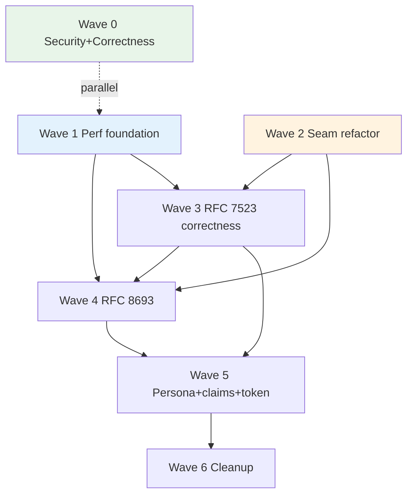

# Consolidated auth + WIF + performance delivery plan (X13)

Status: PLAN (source re-verified against `origin/master` `21ca0a95`, api v0.55.2, on
2026-08-04). **Branch note:** `feat/wif` is no longer a feature branch - it, `master`,
and `release/0.55.0` all resolve to the same commit, so "source at `feat/wif`" now just
means mainline. This doc **consolidates and sequences** three previously separate
analysis streams into one delivery backlog:

1. **X11 - WIF token-mint latency** ([../perf/WIF_TOKEN_MINT_LATENCY_ANALYSIS.md](../perf/WIF_TOKEN_MINT_LATENCY_ANALYSIS.md)) - the perf options (cold ~2,161 ms -> tens of ms).
2. **X12 - auth-source refactoring** ([AUTH_SOURCE_REFACTORING_ANALYSIS.md](AUTH_SOURCE_REFACTORING_ANALYSIS.md)) - the `ResourceAuthenticator` / provider strategy seam.
3. **SyncFabric roadmap** - the canonical guide, **revision 6 (2026-08-04)** - RFC 8693, RFC 7523 binding corrections, persona model, security + metadata truthfulness, migration (its Phases -1..6 and file-by-file Section 25). The in-repo mirror [SCIMSERVER_SYNCFABRIC_WIF_ARCHITECTURE_AND_IMPLEMENTATION_GUIDE (1).md](SCIMSERVER_SYNCFABRIC_WIF_ARCHITECTURE_AND_IMPLEMENTATION_GUIDE%20(1).md) was refreshed to revision 6 on 2026-08-04 and is byte-identical to the canonical copy at `OneDrive - Microsoft\Documents\SCIMServer\auth\`. (Before that date it had been a revision-2 mirror, 4,318 lines against the canonical 5,470.)
4. **X15 - runtime tuning + configuration** ([../perf/RUNTIME_TUNING_AND_CONFIGURATION_REFERENCE.md](../perf/RUNTIME_TUNING_AND_CONFIGURATION_REFERENCE.md), added 2026-07-28) - the configuration layer under the X11 options: the three-tier model, per-environment recommended values, and three findings that **redesign W1.4** and add **W1.7**.

It is grounded in the **current** `feat/wif` source (state confirmed below), the
X10 standards comparison ([AUTH_METHODS_STANDARDS_COMPARISON.md](AUTH_METHODS_STANDARDS_COMPARISON.md)),
and the RFC set. Estimates are **relative complexity** (story points + T-shirt),
NOT calendar commitments.

## 0. The consolidation thesis (how the three streams interlock)

The three streams are not independent backlogs - they have a forced order:

- **The X12 seam is the enabler for the SyncFabric method additions.** RFC 8693,
  `private_key_jwt`, and mTLS should be **new strategy classes**, not edits to the
  491-line `SharedSecretGuard` or the 296-line controller. So the refactor
  (X12 / guide Phase 1 parser + provider foundation) MUST land before the new
  methods, or every method re-pays the god-file tax and the DA-gate fails.
- **The X11 perf foundation de-risks every external-assertion method.** RFC 8693
  adds a second external-JWKS path; multi-IdP adds more. The JWKS pre-warm +
  background refresh + hardening (X11 A/B/C/D/H + guide Section 25.2) should land
  before those scale the JWKS surface, so cold-fetch tail latency and unbounded
  egress do not multiply per method.
- **The correctness hotfix is independent and high value.** HTTP 200 + no-store and
  capability-truthful metadata do not depend on the refactor and can ship first.
  (Secret redaction / `PERSIST_REQUEST_SECRETS=false` is DECLINED per operator
  decision - request-secret capture stays ON by default for troubleshooting and is
  an operator-controlled runtime opt-out, not a build-time default flip; see W0.1.)

```mermaid
flowchart LR
    subgraph W0["Wave 0 - Security + correctness (independent, ship first)"]
        S0[secret redaction + PERSIST default false]
        H0[HTTP 200 + no-store]
        M0[capability-derived metadata]
    end
    subgraph W1["Wave 1 - Perf foundation (X11 + X15)"]
        P0[config surface + bounds + effective-config log]
        P1[eager jose + startup pre-warm]
        P2[canonical jwks_uri]
        P4[JWKS deadline + caps]
        P3[per-kid cache + background refresh + hard-stale]
        P6[DB + HTTP knobs / runtime-config endpoint]
        P5[token-mint latency gate]
        P0 --> P4 --> P3
        P0 --> P6
    end
    subgraph W2["Wave 2 - Structural seam (X12)"]
        R1[ResourceAuthenticator chain]
        R2[strict request parser + union]
        R3[client_secret provider]
        R4[central decision emitter]
    end
    subgraph W3["Wave 3 - RFC 7523 correctness"]
        T1[WifTrustV2 + migration shadow]
        T2[bind client_id / fix AT2 identity]
        T3[drop endpoint-UUID audience]
        T4[credential cache + index]
    end
    subgraph W4["Wave 4 - RFC 8693"]
        X1[8693 provider strategy]
        X2[metadata when-active]
        X3[real-SyncFabric validation]
    end
    subgraph W5["Wave 5 - Persona + claims + token profile"]
        Z1[persona catalog]
        Z2[oid/azp + lifetime cap]
        Z3[jti + at+jwt]
    end
    subgraph W6["Wave 6 - Cleanup + future methods"]
        C1[remove legacy fallbacks]
        C2[private_key_jwt / mTLS / DPoP - future]
    end
    W1 --> W4
    W2 --> W3 --> W4 --> W5 --> W6
    W2 --> W4
    W0 -. parallel .-> W1
```

## 1. Current-source state (confirmed, grounds the estimates)

> **Re-verified against `origin/master` `21ca0a95` (v0.55.2) on 2026-08-04.** Rows marked
> **[was stale]** were wrong before this pass - Waves 1 and 2 shipped without the table being
> updated, so the plan was understating its own progress and would have caused re-work.

| Item | Current state (mainline) | Source of truth |
|---|---|---|
| Token endpoint HTTP status | **200 + no-store** - W0.2 delivered (v0.54.66): `@HttpCode(200)` + `Cache-Control: no-store` + `Pragma: no-cache` on both token handlers; errors keep 400/401 | [oauth.controller.ts](../../api/src/oauth/oauth.controller.ts) + [endpoint-oauth.controller.ts](../../api/src/modules/scim/controllers/endpoint-oauth.controller.ts) |
| `PERSIST_REQUEST_SECRETS` default | **true - BY DESIGN, settled.** Request logs deliberately capture the full authentication exchange so a failing SCIM client can actually be diagnosed. The flip to default-off was **DECLINED at v0.54.63 and re-affirmed by the operator on 2026-08-04**. Not a defect, not a P0, and not to be re-raised. `logging-redaction.spec.ts:80-87` asserting the default is **correct**. Per-endpoint `PersistRequestSecrets` remains the opt-out. Still in scope, separately: retention, log-read access, and never widening capture beyond the request log. | [logging.service.ts#L124](../../api/src/modules/logging/logging.service.ts#L124) |
| RFC 8693 handler | **not implemented** (rejected at runtime) | no `subject_token` parse path |
| Metadata advertises token-exchange | **no** - W0.3 delivered (v0.54.64): capability-derived, token-exchange only when the RFC 8693 handler is active | [endpoint-oauth-metadata.controller.ts](../../api/src/modules/scim/controllers/endpoint-oauth-metadata.controller.ts) |
| `assertionProfile` field | **[was stale] LIVE, not inert** - projected onto the profile set: `assertionProfile === 'token-exchange' ? [WIF_PROFILE_RFC8693] : [WIF_PROFILE_RFC7523]` | [assertion-token-provider.ts#L43](../../api/src/modules/scim/controllers/assertion-token-provider.ts) |
| Resource-plane strategy seam | **[was stale] DELIVERED (Wave 2)** - `ResourceAuthenticator` plus three authenticators (`endpoint-credential`, `global-shared-secret`, `oauth-jwt`); `SharedSecretGuard` is now **260 lines**, not 491 | [resource-authenticator.ts](../../api/src/modules/auth/authenticators/resource-authenticator.ts) + [authenticators/](../../api/src/modules/auth/authenticators/) |
| Mint `client_secret` path | **inlined** in the controller | [endpoint-oauth.controller.ts#L189](../../api/src/modules/scim/controllers/endpoint-oauth.controller.ts#L189) |
| JWKS pre-warm / background refresh | **still none** (lazy fetch, 10-min TTL - X15-F1: Microsoft's guidance for its own keys is 24 h TTL + 1 h background refresh). W1.3 (canonical `jwks_uri` redirect memo) **did** ship. The stale fallback has **no maximum age** - see [EXTERNAL_JWKS_VALIDATOR.md](EXTERNAL_JWKS_VALIDATOR.md) guarantee 5 | [external-jwks-validator.service.ts](../../api/src/oauth/external-jwks-validator.service.ts) |
| `jose` load | **[was stale] W1.1 DELIVERED** - memoized `josePromise`, warmed at boot by `onModuleInit` (non-fatal on failure), so the first mint after a restart no longer pays the ESM load | [external-jwks-validator.service.ts#L63-L100](../../api/src/oauth/external-jwks-validator.service.ts) |
| Credential lookup | `findActiveByEndpoint` (all types, no index by type) | [wif-assertion-token.provider.ts](../../api/src/modules/scim/controllers/wif-assertion-token.provider.ts) |
| Issued token `jti` / `typ=at+jwt` | **[was stale] SPLIT** - `jti: crypto.randomUUID()` is **present** (oauth.service.ts#L225); `typ=at+jwt` is still **absent** (signed via `jwtService.sign` with `signOptions.algorithm` only; no `at+jwt` string exists anywhere in `api/src`), so RFC 9068 conformance remains unproven | [oauth.service.ts#L225](../../api/src/oauth/oauth.service.ts) + [oauth.module.ts#L33](../../api/src/oauth/oauth.module.ts) |
| Persona catalog | **none** | n/a |
| WifTrustV2 versioned aggregate | **none** (flat `metadata`) | [admin-credential.controller.ts](../../api/src/modules/scim/controllers/admin-credential.controller.ts) |

## 2. Release train (wave overview)

Estimate legend (relative complexity, not calendar): **S** = ~2 pts, **M** = ~5 pts,
**L** = ~8 pts, **XL** = ~20 pts (split before starting).

| Wave | Theme | Streams | Depends on | Points | Release gate |
|---|---|---|---|---:|---|
| 0 | Correctness hotfix (200/no-store + truthful metadata) | SF | none | 7 | Metadata-truthful test + token-response header test |
| 1 | Perf foundation | X11, X15 | none | 36 | Token-mint latency gate (`9z-BW`) + runtime-config contract |
| 2 | Structural seam (refactor) + enablement consolidation | X12 | none (benefits from W1) | 25 | Guard/controller specs green + DA-gate |
| 3 | RFC 7523 correctness + trust model | SF Phases 1-3 | W2, W1 | 22 | Real-token-shadow gate + parity |
| 4 | RFC 8693 token exchange | SF Phase 4 | W2, W3, W1 | 15 | Real-SyncFabric 8693 validation |
| 5 | Persona + claim strengthening + token profile | SF Phases 1,5 + X10 | W3, W4 | 18 | Persona contract suite |
| 6 | Cleanup + future methods | SF Phase 6 | W3-W5 | 5 (+future) | Zero-legacy-use telemetry |

Core (Waves 0-6 excluding optional/future) ~ **128 points** (was 116 before the
X15 W1.7 configuration surface added 12 to Wave 1). Optional opaque-token
track (W5.4) + future `private_key_jwt`/mTLS/DPoP (W6.2) add ~40 more and are
separate tracks.

## 3. Consolidated work items (the backlog)

Each item carries: **ID | goal | key tasks | acceptance criteria | deps | estimate
| risk**. Every item's **delivery/DoD** additionally includes the standing
per-commit obligations (Section 6): unit + E2E + live (+ Playwright if UI) + feature
doc + INDEX + CHANGELOG + version bump + DA-gate disposition.

### Wave 0 - Security + correctness hotfix

**W0.1 - Token-route secret redaction** `[Stream SF Phase -1]` - **DECLINED (operator decision, 2026-07-23)**
- Decision: do NOT default `PERSIST_REQUEST_SECRETS` to false and do NOT add unconditional token-route redaction. Request-secret capture is intentionally ON by default because it is needed for auth troubleshooting; an operator can turn it off at runtime (server env `PERSIST_REQUEST_SECRETS=false` or the per-endpoint `PersistRequestSecrets` override) when a given deployment wants it off.
- Consequence: the field-spelling-based redaction ([redact-sensitive.ts](../../api/src/security/redact-sensitive.ts)) and the existing per-endpoint/server opt-out remain the controls; no build-time default flip. Revisit only if a specific compliance requirement lands.

**W0.2 - Token endpoint returns HTTP 200 + no-store** `[Stream SF]` - **DONE (v0.54.66)**
- Tasks: `@HttpCode(200)` + `Cache-Control: no-store` + `Pragma: no-cache` on EVERY token success path - the global `client_secret` handler AND the per-endpoint handler (which covers BOTH the `client_secret` and the WIF `client_assertion` sub-routes); error responses keep their RFC 6749 section 5.2 400/401; flip the E2E `201`->`200` (incl. the shared auth helper) + add header assertions; add real-wire status+header assertions in live-test `9z-BU`.
- Acceptance: token successes are 200 with no-store + no-cache on the global, per-endpoint secret, and WIF paths - measured at E2E AND on the wire; error paths unchanged; E2E + live updated. Feature doc: [W0_2_TOKEN_ENDPOINT_200_NO_STORE.md](W0_2_TOKEN_ENDPOINT_200_NO_STORE.md).
- Deps: none. Estimate: **S**. Risk: Low. Risk note corrected: 201 was tolerated but non-conformant; 200 is the tested contract Entra's own AS returns and that any conformant OAuth client accepts (no documented Entra requirement is violated). The future RFC 8693 handler (W4) must return 200 from day one.

**W0.3 - Capability-derived OAuth metadata** `[Stream SF]` - **DELIVERED (v0.54.64)**
- Tasks: derive [endpoint-oauth-metadata.controller.ts](../../api/src/modules/scim/controllers/endpoint-oauth-metadata.controller.ts) from active handler capabilities + endpoint config; stop advertising `token-exchange` until W4; disclose the `private_key_jwt`/SyncFabric-profile nuance per guide 17.4.
- Acceptance: metadata advertises token-exchange only when the 8693 handler is active; a method appears only with an active compatible credential/trust; test per guide 17.5. **Done:** the controller now injects the credential repo + config and derives grants/methods from active `oauth_client`/`wif` credentials; token-exchange + `none` are never advertised (no RFC 8693 handler); `private_key_jwt` + `RS256/ES256` + the `x_scimserver_wif_profiles` disclosure appear only with an active WIF trust; fails open to an empty capability set. Coverage: metadata unit 12; `wif-assertion` E2E WI-12 strengthened; live-test `9z-BT`.
- Deps: none (unblocks nothing but removes a live untruth). Estimate: **M**. Risk: Low.

### Wave 1 - Perf foundation (X11)

**W1.1 - Eager `jose` import at boot** `[X11 B]`
- Tasks: `import('jose')` in `onModuleInit` + warm one throwaway verify.
- Acceptance: first WIF mint after restart does not pay the module load; measured first-mint drops by the jose-load component.
- Deps: none. Estimate: **S**. Risk: Low.
- **Status: DELIVERED - api v0.54.81.** Memoized `jose` import warmed by a non-fatal `onModuleInit` (a failed pre-load logs and falls back to loading on first use, so it can never break startup).
**W1.2 - Startup JWKS + DB pool pre-warm** `[X11 C]`
- Tasks: enumerate registered trust `jwksUri` at boot + on trust create; prefetch; warm the Prisma pool.
- Acceptance: first mint after deploy is a warm cache hit (tens of ms) in a live-test.
- Deps: W1.4 cache. Estimate: **M**. Risk: Low.
- **Note (2026-07-28 source audit):** the Prisma pool half is already done - `PrismaService.onModuleInit` connects at startup (pool max 5). Only the JWKS prefetch remains.

**W1.3 - Canonical `jwks_uri` (drop the redirect)** `[X11 D]`
- Tasks: store/resolve the canonical `login.microsoftonline.com` (or discovery `jwks_uri`) instead of legacy `login.windows.net`; cache the resolved URL.
- Acceptance: cold fetch is one hop; ~130-160 ms saved per cold fetch (measured).
- Deps: none. Estimate: **S**. Risk: Low.
- **Status: DELIVERED - api v0.54.81.** Implemented as a RUNTIME resolution memo rather than a config rewrite: the canonical target a `jwksUri` redirects to is remembered per process, so the hop is paid once instead of on every cold fetch, and no stored trust data has to be migrated. The remembered target is re-validated against the SSRF allowlist on every use.

**W1.4 - Background JWKS refresh-ahead + honor Cache-Control + hard-stale** `[X11 A + guide 25.2 + X15-F1]`
- Tasks: refresh timer at ~60% of TTL; `maxAge = min(JWKS_CACHE_MAX_AGE_MS, response Cache-Control)`; separate fresh age from a hard stale-if-error age; atomic cache swap; keep single-flight + serve-stale.
- Acceptance: steady-state hot path is always a cache hit (no periodic 10-min cold); hard-stale rejection test; Cache-Control honored test.
- Deps: none. Estimate: **L**. Risk: Medium (key-rotation correctness - overlap window test required).
- **Note (2026-07-28 source audit):** single-flight coalescing (`inflight` map) and serve-stale-on-error already exist, so this item is only the background refresh + Cache-Control + hard-stale age. It also owns the open question in [EXECUTION_ISSUES_AND_RCA.md](EXECUTION_ISSUES_AND_RCA.md) section 10.2 (should an allowlist revocation purge that host's cached keys?).
- **REDESIGNED by X15-F1 (2026-07-28).** The target is no longer "refresh at 60% of a 10-min TTL" but **Microsoft's own published algorithm** for its signing keys ([signing-key-rollover](https://learn.microsoft.com/en-us/entra/identity-platform/signing-key-rollover)): cache **per `kid`** (not per `jwksUri`), **24 h TTL**, **1 h background refresh**, prefetch on startup, and a synchronous unknown-`kid` refresh that is **rate-limited to once per 5 minutes** (today's unrate-limited unknown-`kid` refetch is an amplification vector). Full rationale + the today-vs-target diagrams in [../perf/RUNTIME_TUNING_AND_CONFIGURATION_REFERENCE.md](../perf/RUNTIME_TUNING_AND_CONFIGURATION_REFERENCE.md) section 4.1. **Hard constraint:** the 10-min -> 24 h TTL raise MUST ship in the same commit as the background refresher, the rate-limited unknown-`kid` path, and an overlap-window rotation test - raising the TTL alone multiplies the key-rotation blast radius by 144x. New keys `JWKS_REFRESH_INTERVAL_MS`, `JWKS_UNKNOWN_KID_MIN_INTERVAL_MS`, `JWKS_STALE_IF_ERROR_MS` come from W1.7a.

**W1.5 - JWKS total deadline + response caps** `[guide 25.2 + X11 H + X15-F1]`
- Tasks: one cancellable total deadline across trust-selection + redirects + retries + backoff; response byte cap, key-count cap, key-size/type checks, cache-entry + trust-count cardinality caps.
- Acceptance: worst-case cold bounded to a fixed budget (not ~10-60 s); oversized-response + too-many-keys + cardinality-cap tests.
- Deps: W1.4. Estimate: **M**. Risk: Medium.
- **Resequenced + amended by X15 (2026-07-28).** Now runs **BEFORE** W1.4, not after: the deadline and caps are the safety envelope inside which the riskier caching change runs, so the envelope is built first. Every cap ships **configurable from birth** (`JWKS_TOTAL_DEADLINE_MS`, `JWKS_MAX_RESPONSE_BYTES`, `JWKS_MAX_KEYS`) via the W1.7a plumbing rather than as hardcoded literals to be retrofitted. Recommended values per form factor and the clamp bounds are in [../perf/RUNTIME_TUNING_AND_CONFIGURATION_REFERENCE.md](../perf/RUNTIME_TUNING_AND_CONFIGURATION_REFERENCE.md) sections 7.1 and 8.1. Note `JWKS_MAX_KEYS` must be generous (100, not 10) - Microsoft states a key cache should hold 10-1000 keys across issuers.
- **Status: DELIVERED - api v0.55.3 (2026-08-04).** Four caps added to [egress-policy.ts](../../api/src/oauth/egress-policy.ts) with defaults, bounds, env resolution and endpoint overrides, plus four matching per-endpoint flags (`JwksTotalDeadlineMs`, `JwksMaxResponseBytes`, `JwksMaxKeys`, `JwksMaxCacheEntries`). A fourth cap beyond the three planned - `JWKS_MAX_CACHE_ENTRIES` - was added because the cache was an unbounded map keyed by a caller-influenced URI. Implementation notes: the backoff sleep is **clamped to the remaining budget** (an unbounded sleep was the largest contributor to the worst case); the per-attempt timeout becomes `min(perAttempt, remaining)`; a cap breach raises a non-retryable `JwksPolicyViolationError` so it fails fast and reports its own cause instead of the generic exhaustion message; and **fail-to-stale still applies when the budget runs out**, since exceeding the deadline is an availability event. Coverage: **+17 unit** ([egress-policy.spec.ts](../../api/src/oauth/egress-policy.spec.ts), [external-jwks-validator.service.spec.ts](../../api/src/oauth/external-jwks-validator.service.spec.ts)) and **+12 live** (`9z-CD`). Not yet done, and still owned by W1.4: the **stale-age ceiling** - the fail-to-stale path still serves a cached copy of any age.

**W1.6 - Token-mint latency gate** `[X11 §9]`
- Tasks: live-test `9z-BW` - seed a WIF trust, warm once, time N mints; assert warm median < 150 ms and (post W1.1-W1.2) cold-first < 300 ms.
- Acceptance: gate runs local + Docker + Azure dev; fails on a regression to the cold path.
- Deps: W1.1-W1.4. Estimate: **S**. Risk: Low.
- **Status: DELIVERED - api v0.54.81.** Landed in [scripts/wif-e2e-proof.ps1](../../scripts/wif-e2e-proof.ps1) (Stage 8), not `live-test.ps1`, because the proof harness is the only place with a REAL Entra assertion to mint from. 7 samples, median, configurable `-MintLatencyBudgetMs`. Cold-first is deliberately NOT asserted: the JWKS cache is process-wide per `jwksUri`, so whether a run starts cold depends on what else already hit that IdP on that replica - a cold assertion would be a flake generator.

**W1.7 - Runtime configuration surface** `[X15]` **(NEW, 2026-07-28)**

Promotes the environment-dependent values that are currently hardcoded into a clamped settings surface, and closes X15-F2 + X15-F3. Full design in [../perf/RUNTIME_TUNING_AND_CONFIGURATION_REFERENCE.md](../perf/RUNTIME_TUNING_AND_CONFIGURATION_REFERENCE.md) section 8.

- **W1.7a - config plumbing + bounds + effective-config log.** Group-level resolvers mirroring the existing `EGRESS_POLICY_DEFAULTS` / `EGRESS_POLICY_BOUNDS` / `resolveServerEgressDefaults` shape (no new pattern); the bounds table in X15 section 8.1; cross-key invariant validation (deadline < request timeout, refresh interval < cache TTL, default count <= max count) that WARNs rather than failing startup; one `INFO` boot line per group naming every effective value and its source (`env` / `default` / `clamped`). Deps: none. Estimate: **M**. Risk: Low.
  - **Status: DELIVERED - api v0.54.82.** [runtime-config.ts](../../api/src/bootstrap/runtime-config.ts) publishes `RUNTIME_CONFIG_SPECS` (15 settings across http / database / logging / scim, each with env key, default, min, max), `resolveRuntimeConfig` (pure, injected env getter, falls through on invalid input, clamps at every level, records `source` + `requested` + `clamped`), 4 cross-key invariants that WARN, and `formatRuntimeConfigLines` for the boot log. +22 unit.
- **W1.7b - DB + HTTP knobs.** `DB_POOL_MAX`, `DB_POOL_ACQUIRE_TIMEOUT_MS`, `DB_POOL_IDLE_TIMEOUT_MS`, `DB_TX_MAX_WAIT_MS`, `DB_TX_TIMEOUT_MS`; `HTTP_REQUEST_TIMEOUT_MS`, `HTTP_HEADERS_TIMEOUT_MS`, `HTTP_KEEPALIVE_TIMEOUT_MS`, `HTTP_KEEPALIVE_TIMEOUT_BUFFER_MS`, `HTTP_JSON_BODY_LIMIT`, `HTTP_FORM_BODY_LIMIT`; `LOG_FLUSH_INTERVAL_MS`, `LOG_FLUSH_MAX_BUFFER`; `SCIM_DEFAULT_COUNT`, `SCIM_MAX_COUNT`. Closes **X15-F2** and **X15-F3**. `REQUEST_TIMEOUT_MS` is retained as a value-preserving legacy alias (X15 section 8.3). Deps: W1.7a. Estimate: **M**. Risk: Low.
  - **Status: DELIVERED - api v0.54.82 (HTTP + DB + body limits), v0.54.83 (logging + pagination).** [main.ts](../../api/src/main.ts) now sets all FOUR Node timeouts explicitly (`setTimeout` + `requestTimeout` + `headersTimeout` + `keepAliveTimeout`, plus `keepAliveTimeoutBuffer` when the runtime has it), with `keepAliveTimeout` DECOUPLED from the request timeout and `REQUEST_TIMEOUT_MS` preserved as a legacy alias for both - closing **X15-F2**. [prisma.service.ts](../../api/src/modules/prisma/prisma.service.ts) passes `max` + `connectionTimeoutMillis` + `idleTimeoutMillis` EXPLICITLY, restoring the acquire bound the v7 adapter migration dropped - closing **X15-F3** - and [prisma-pool-options.spec.ts](../../api/src/modules/prisma/prisma-pool-options.spec.ts) is the PG-2 regression lock (+6 unit). [body-parsers.ts](../../api/src/bootstrap/body-parsers.ts) reads the two limits. v0.54.83 completed the item: [logging.service.ts](../../api/src/modules/logging/logging.service.ts) resolves the flush interval + buffer from config, and [scim-constants.ts](../../api/src/modules/scim/common/scim-constants.ts) resolves `DEFAULT_COUNT`/`MAX_COUNT` (server floor only - the per-endpoint SPC `filter.maxResults` cascade still layers on top) (+5 unit).
- **W1.7c - `GET /scim/admin/runtime-config`.** Admin-authenticated, `Cache-Control: no-store`, returns every tier-1/tier-2 value with `effective` / `source` / `default` / `min` / `max` / `clamped` plus `invariantWarnings[]`. Contains no secrets by construction; the E2E key-allowlist assertion locks that. Deps: W1.7a. Estimate: **S**. Risk: Low.
  - **Status: DELIVERED - api v0.54.84.** [runtime-config.controller.ts](../../api/src/modules/scim/controllers/runtime-config.controller.ts) assembles the response from `RUNTIME_CONFIG_SPECS` only, so no secret-bearing env var is reachable even in principle. +9 unit, +8 E2E, live **`9z-BZ`** (12 assertions incl. self-consistency of every effective value against its own bounds, and direct X15-F2/F3 closure probes). Local live suite 1341/1341. **W1.7 is complete.**
- **Regression locks (the X15 section 10 self-improvement).** A unit test asserting the `pg.Pool` options are **explicitly passed** (the general fix for the dependency-default-drift class that produced X15-F3), and a boot test proving an out-of-range env var yields a clamped effective value with `clamped: true`.

**Wave 1 sequencing after X15:** W1.7a -> W1.5 -> W1.4 -> W1.2 -> W1.6 re-run, with W1.7b/W1.7c in parallel. Rationale in X15 section 8.4.

### Wave 2 - Structural seam (X12)

**W2.1 - `ResourceAuthenticator` strategy chain** `[X12 Phase 1]` - **DELIVERED (v0.54.67)**
- Tasks: define the `ResourceAuthenticator` seam (3-outcome, mirroring `IAssertionTokenProvider`); extract global-secret, endpoint-bearer/oauth_client, OAuth-JWT into strategies each owning lookup + validation + `isEnabled()` + trace; reduce [shared-secret.guard.ts](../../api/src/modules/auth/shared-secret.guard.ts) to a thin orchestrator; preserve the X9 `looksLikeJwt` short-circuit as the opaque-secret authenticator's `not-applicable` branch.
- **Done:** guard 491 -> ~185-line orchestrator over 3 ordered authenticators ([authenticators/](../../api/src/modules/auth/authenticators/)); behavior-preserving (guard spec 39/39 + auth E2E 80/80 unchanged; full unit 4479); +20 per-strategy specs (accept / reject-STOP / not-applicable); the 2 reject-STOP cases + F3 fall-through + X9 fast-paths reproduced exactly. `isEnabled` still reads today's flags (W2.5 migrates it). Report + RCA + DA-gate: [WAVE2_W2_1_IMPLEMENTATION_REPORT.md](WAVE2_W2_1_IMPLEMENTATION_REPORT.md). (The `<120 line` acceptance was an estimate; ~185 lines is the thin orchestrator with the shared-secret resolution + trace + reject helper retained - the substantive goal, no method logic inline, is met.)
- Deps: none (benefits from W1). Estimate: **L**. Risk: Medium (behavior-preserving refactor of the hot auth path - RED-first + full regression net mandatory).

**W2.2 - Strict token-request parser + discriminated union** `[guide 25.1]` - **DELIVERED (v0.54.69)**
- Tasks: new `endpoint-token-request.types.ts` (discriminated union) + `endpoint-token-request-parser.service.ts` (strict singleton form parsing, ambiguity + size checks, Basic/form normalization, no crypto); controller stops guessing.
- Acceptance: parser rejects duplicate/mixed-method/oversized bodies; controller only routes + shapes responses.
- Deps: W2.1 (shared shape). Estimate: **M**. Risk: Low.

**W2.3 - `client_secret` mint -> provider** `[X12 Phase 2]` - **DELIVERED (v0.54.70)**
- Tasks: extract the inlined `client_secret` path into `ClientSecretTokenProvider` implementing the mint seam; controller delegates.
- Acceptance: controller has no bcrypt/repo logic; `endpoint-oauth.controller.spec.ts` + E2E green.
- Deps: W2.1, W2.2. Estimate: **M**. Risk: Low.

**W2.4 - Centralize `AuthDecisionEmitter` + relocate providers** `[X12 Phase 3]` - **DELIVERED (v0.54.71; emitter centralized as a function; provider relocation deferred)**
- Tasks: one `AuthDecisionEmitter.record(trace)`; replace the 3 hand-rolled `emit + record` sites; move mint providers to `oauth/token-mint/`.
- Acceptance: single emitter used everywhere; auth-decision specs green.
- Deps: W2.1-W2.3. Estimate: **S**. Risk: Low.

**W2.5 - Consolidate auth-enablement flags + co-locate enablement with the method** `[operator question 2026-07-23]` - **DELIVERED (v0.54.68, value-preserving core; retirement + enforcement-flip scheduled)**
- Context: today enablement is a set of endpoint booleans that OVERLAP. `PerEndpointCredentialsEnabled` is the LEGACY umbrella (gates BOTH `bearer` and `oauth_client` via fallback); WI-11 split it into per-method `SecretTokenBearerAuthEnabled` (gates `bearer`) + `OAuthClientCredentialsAuthEnabled` (gates `oauth_client`), each falling back to the legacy flag when unset ([endpoint-config.interface.ts `getEffectiveAuthEnablement`](../../api/src/modules/endpoint/endpoint-config.interface.ts#L833)). So for the bearer method BOTH flags apply (specific wins, legacy is the default) - that is the ambiguity.
- Tasks: (a) **disambiguate + consolidate** - finish the WI-11 migration: materialize each endpoint's effective per-method value into the explicit per-method flags, then **retire `PerEndpointCredentialsEnabled`** (WI-11's own stated end-state: "once every endpoint carries the new flags explicitly it can be retired"). Net: one flag per method, no legacy umbrella. (b) **co-locate** - make each `ResourceAuthenticator` strategy (W2.1) own `isEnabled(endpointId)` reading its method's enablement from the existing (inert) `profile.authentication` AuthenticationMethod model rather than a growing flat boolean list; derive OAuth metadata (W0.3/W4.2) from the SAME source so "advertised" and "enforced" cannot drift.
- Acceptance: no endpoint reads the legacy umbrella flag at runtime; each strategy's enablement is read from one per-method source; a value-preserving migration proves byte-for-byte behavior for existing endpoints (cross-backend parity); metadata is derived from the same enablement.
- Deps: W2.1 (strategies own `isEnabled`); pairs with W5.1 (persona) as the eventual home. Estimate: **M**. Risk: Medium (enablement is a security-relevant contract - migrate value-preservingly, shadow-verify).

#### Design answer: is co-locating enablement with the method config good design?

**Yes, and it aligns with the W2 seam.** Enablement is a property OF a method, so it belongs WITH the method (cohesion / SRP), not in a separate central boolean registry that every new method has to edit (an Open/Closed smell - the same god-file pressure W2 removes). Concretely: each `ResourceAuthenticator`/token-mint provider owns `isEnabled()`, reading a single per-method enable from the `AuthenticationMethod` model; the guard/controller never branch on flags; metadata derivation reads the same field (which is exactly what makes W0.3 capability-truthful metadata fall out for free). Two guardrails keep it from over-reaching: (1) keep "enabled" and "has an active credential/trust" as DISTINCT states (a method is ACTIVE iff enabled AND has a credential); (2) do NOT invent a new structure - reuse the existing inert `profile.authentication` backbone as the home, and migrate value-preservingly. This is a finite, typed change, not a policy DSL (YAGNI held).

### Wave 3 - RFC 7523 correctness + trust model

**W3.1 - `WifTrustV2` aggregate + legacy projection + shadow migration** `[guide 12 + 24]`
- Tasks: versioned `WifTrustV2` in `EndpointCredential.metadata`; legacy->v2 projection reader; migration state machine (LegacyRead -> V2Projection -> Shadow -> Observed -> Enforced -> V2Only -> Cleanup) with reversible original copy; per-profile handler feature flag + `shadow`/`enforced` trust status.
- Acceptance: every current valid trust projects to v2 with no behavior change; shadow evaluation logged; rollback = flag flip (no DB rollback); cross-backend parity.
- Deps: W2. Estimate: **L**. Risk: Medium (migration correctness; no silent field reinterpretation).
- **Status: PARTIALLY DELIVERED (right-sized) - api v0.54.80.** The load-bearing half - **per-variation profile routing** - shipped: `resolveTrustProfiles` / `trustEnablesProfile` on the provider seam read the versioned `enabledProfiles[]` when present and otherwise PROJECT the legacy singular `assertionProfile` onto it, and both the RFC 7523 provider and the capability metadata select on it. A `token-exchange`-scoped trust no longer mints via the jwt-bearer path (proof finding F6). The full versioned aggregate + the 7-state reversible migration state machine remain **deferred**: the projection is the legacy->v2 read the plan calls for, and no production trust data needs a reversible migration (trusts are freshly-created flexible JSON). Revisit if/when Wave 4 needs richer per-profile policy blocks.

**W3.2 - Bind request `client_id`; fix AT2 identity** `[guide 13.1]`
- Tasks: `targetClientBinding.acceptedClientIds` (generate `scim-wif-client-<rand>`); validate the form `client_id`; stop assigning assertion `sub` to issued `client_id`; keep source subject visible-but-distinct in AT2.
- Acceptance: a valid assertion presented with a wrong `client_id` is rejected (`wif_client_id_mismatch`); AT2 `client_id` != assertion `sub`; connection-info shows the generated client ID, not `sub`.
- Deps: W3.1. Estimate: **M**. Risk: Medium (breaking for any config that relied on the old conflation - shadow first).
- **Status: DELIVERED (partial, right-sized) - api v0.54.76.** The identity-separation core is done: the issued token's `sub`/`client_id` are now the trust's optional `targetClientId` (or the endpointId), NEVER the assertion `sub`, which rides the distinct `src_sub` claim. This makes the already-advertised `x_scimserver_wif_profiles` binding (`client_id_binding: target-client-id`, `assertion_subject_binding: independent`) truthful. Report: [WAVE3_W3_2_IMPLEMENTATION_REPORT.md](WAVE3_W3_2_IMPLEMENTATION_REPORT.md).
- **COMPLETED by W3.7 - api v0.54.78.** The form-`client_id` validation half was originally deferred on the (incorrect) rationale that the SyncFabric RFC 7523 flow does not send a form `client_id`; guide 7.1 + 7.4 confirm it does, and a real-Entra proof run measured that a wrong `client_id` still minted. The binding now rejects with `wif_client_id_mismatch`. See [WIF_END_TO_END_PROOF_AND_AUTH_METHOD_REFERENCE.md](WIF_END_TO_END_PROOF_AND_AUTH_METHOD_REFERENCE.md) F2.

**W3.6 - Cap the issued-token lifetime at the assertion expiry** `[guide 13.5]` **(NEW - promoted from W5.2)**
- Tasks: `expiresIn = min(configured ttl, assertion exp - now, server max)` on the WIF mint path.
- Acceptance: a 6h `issuedTokenTtlSec` against a 1h assertion yields <= 1h; an almost-expired assertion yields only the remaining seconds; non-federated mints unchanged.
- Deps: none. Estimate: **S**. Risk: Low.
- **Status: DELIVERED - api v0.54.78.** Promoted out of W5.2 because a real-Entra proof run measured a **~5 hour overrun** in production behavior (a security defect, not a future hardening item). See [WIF_END_TO_END_PROOF_AND_AUTH_METHOD_REFERENCE.md](WIF_END_TO_END_PROOF_AND_AUTH_METHOD_REFERENCE.md) F1.

**W3.7 - Bind the RFC 7523 form `client_id` to the trust** `[guide 13.1]` **(NEW - completes W3.2)**
- Tasks: capture the form `client_id` on the `client_assertion` parse variant; reject a mismatch against the trust's `targetClientId` with `wif_client_id_mismatch` + a `target_client_id_match` trace check.
- Acceptance: wrong `client_id` -> 401 `wif_client_id_mismatch`; matching -> 200; absent `client_id` or absent `targetClientId` -> unchanged (backward compatible).
- Deps: W3.2. Estimate: **S**. Risk: Low (binds only when the operator pinned a target AND the caller sent a different one).
- **Status: DELIVERED - api v0.54.78.**

**W3.8 - Issued-token provenance + `jti`** `[guide 13.4 + 13.6]` **(NEW - pulled forward from W5.3)**
- Tasks: stamp a unique `jti` on every mint; stamp `auth_method` (`syncfabric-rfc7523` / `client_secret`) and, for federated mints only, `source_tid` / `source_oid` / `source_azp` (with the v1.0 `appid` fallback).
- Acceptance: two mints of the same assertion yield different `jti`; a client-credentials token carries `auth_method` but NO `source_*`; claims are attribution only, never an authorization input.
- Deps: none. Estimate: **S**. Risk: Low.
- **Status: DELIVERED - api v0.54.79.** Pulled forward because the real-Entra proof showed a consumer could not distinguish auth profiles nor attribute a tenant. `typ=at+jwt` remains in W5.3.

**W3.9 - connection-info projects the OAuth client identity** `[guide 16.2]` **(NEW - completes W3.2)**
- Tasks: `entraFields.clientIdentifier` becomes `targetClientId ?? endpointId` (mirroring the mint); the expected assertion subject moves to a distinct `expectedAssertionSubject` field.
- Acceptance: advertised client identity == the `client_id` the token actually carries; the assertion subject stays visible but separate.
- Deps: W3.2. Estimate: **S**. Risk: Low (additive response field; key allowlist updated).
- **Status: DELIVERED - api v0.54.79.**

**W3.3 - Remove endpoint-UUID audience default** `[guide gap]`
- Tasks: require an explicit `expectedAudience`; flag endpoint-ID-like audiences as likely misconfiguration.
- Acceptance: no derived-from-endpoint-UUID audience path remains; validation requires the value.
- Deps: W3.1. Estimate: **S**. Risk: Low (guarded by shadow/observe).
- **Status: DEFERRED (operator decision conflict).** The endpointId audience default is a *documented operator decision* ([CONNECTION_INFO_AND_ENTRA_SETUP.md](CONNECTION_INFO_AND_ENTRA_SETUP.md): "Audience = endpointId (operator decision)... a per-endpoint audience also blocks cross-endpoint token replay"). Reversing it to hard-require an explicit audience needs operator confirmation. Note that `buildTrust` already requires a non-empty `expectedAudience` at mint time - the endpointId is only a *config-time* proposed default, never a silent validation-time derivation, so there is no correctness hole to close unilaterally.

**W3.4 - SuccessFactors `resource` policy** `[guide 13.3]`
- Tasks: `resourceMode = ignore | optionalExact | requiredExact` + `expectedResource`; legacy starts `ignore` with shadow diagnostics.
- Acceptance: mismatch rejected under `requiredExact`; missing accepted under `ignore`; per guide 13.3 table.
- Deps: W3.1. Estimate: **S**. Risk: Low.
- **Status: DELIVERED - api v0.54.77.** `resourceMode` on the WIF trust (default `ignore` = legacy accept-anything + advisory shadow log; `optionalExact` rejects a present-but-mismatched resource; `requiredExact` requires an exact match). The RFC 8707 `resource` form param is threaded parser -> controller -> provider -> validator and checked in the decision trace (`resource_match`, reasons `wif_resource_required` / `wif_resource_mismatch`). Report: [WAVE3_W3_4_IMPLEMENTATION_REPORT.md](WAVE3_W3_4_IMPLEMENTATION_REPORT.md).

**W3.5 - Credential/trust cache + typed lookup + index** `[X11 E/F + guide 25.3]`
- Tasks: per-endpoint WIF-trust cache (invalidate on credential change); `findActiveByEndpointAndType('wif')`; composite index `(endpointId, credentialType, active)` (Prisma migration + in-memory parity); compile/cache exact issuer->trust selection; reject unknown issuers without unrelated JWKS fetches.
- Acceptance: warm mint no longer hits the DB for the trust set; unknown-issuer path does zero network; index migration + parity tests; `prismaMigrationAudit` green.
- Deps: W3.1. Estimate: **M**. Risk: Medium (cache invalidation correctness).

### Wave 4 - RFC 8693 token exchange

**W4.1 - RFC 8693 provider strategy** `[guide 13.2]`
- Tasks: new `syncfabric-rfc8693-token.provider.ts` on the W2 seam; policy for `subject_token_type`, `audience`, `scope` subset, `requested_token_type`; shared trust selector/verifier; no fallback to client-secret.
- Acceptance: exact 8693 form accepted; wrong audience/scope/token-type rejected with the right reason codes; issued `issued_token_type` in response.
- Deps: W2, W3. Estimate: **L**. Risk: Medium.

**W4.2 - Advertise 8693 only when active** `[guide 17]`
- Tasks: capability metadata adds the token-exchange grant + `none` method only when the handler is active for the endpoint.
- Acceptance: metadata test proves no 8693 advertisement without an active handler (closes the W0.3 truth once the handler exists).
- Deps: W4.1. Estimate: **S**. Risk: Low.

**W4.3 - Real-SyncFabric 8693 validation (empirical gate)** `[guide 23.6 + gate]`
- Tasks: capture a real SyncFabric 8693 request; validate end to end; add a real-token live smoke tier.
- Acceptance: a real SyncFabric-shaped 8693 exchange mints a working AT2; empirical gate recorded.
- Deps: W4.1. Estimate: **M** + empirical gate.

### Wave 5 - Persona + claim strengthening + token profile

**W5.1 - Finite auth-persona catalog** `[guide 11.6 + 25.1]`
- Tasks: immutable `auth-persona.catalog.ts` (finite `AuthPersonaDefinition`, stable id+version, accepted request shapes, handler, metadata/connection-info/UI descriptors); derive parser + metadata + connection-info + UI capabilities from one definition; NO expression DSL, NO trust records in the persona.
- Acceptance: selecting a persona does not create an open trust or infer audience; persona contract suite (guide 23.13) per preset.
- Deps: W2-W4. Estimate: **L**. Risk: Medium (scope-creep risk - hold the YAGNI line: finite presets only).

**W5.2 - Claim strengthening + lifetime cap** `[guide 24 Phase 5]`
- Tasks: enforce `oid` + `azp`/`appid` where stable (normalize to `authorizedParty`); roles advisory -> enforce only when app-role emission proven; cap AT2 expiry at AT1 `exp`.
- Acceptance: exact oid/azp rejection tests; AT2 never outlives the assertion; empirical gate for real claim shapes (customer + 1P modes).
- Deps: W3, empirical capture. Estimate: **M** + gate. Risk: Medium (outage risk if enforced before observation - shadow first).

**W5.3 - Issued-token profile: `jti` + optional `typ=at+jwt`** `[guide 13.6 + RFC 9068]`
- Tasks: add a unique `jti`; optionally set `typ=at+jwt` with matching resource-guard token-type validation; keep AT2 claims minimal.
- Acceptance: every AT2 has a unique `jti`; if `at+jwt` enabled, the resource guard rejects wrong-typ JWTs; RFC 9068 conformance checklist met before any conformance claim.
- Deps: W2 (resource authenticators). Estimate: **M**. Risk: Low.

**W5.4 - (Optional, separate track) opaque `IssuedTokenFormat` + introspection + revocation** `[X10 Q4]`
- Tasks: opt-in endpoint `IssuedTokenFormat: jwt | opaque`; token store + hash + expiry cleanup; RFC 7662 `/introspect`; RFC 7009 `/revoke`; JWT `jti` denylist for the JWT path.
- Acceptance: opaque tokens are instantly revocable; JWT stays the stateless default; per guide 13.6.
- Deps: W5.3. Estimate: **XL** (split before starting). Risk: Medium (adds stateful availability surface - only on real demand).

### Wave 6 - Cleanup + future methods

**W6.1 - Remove legacy fallbacks** `[guide Phase 6]`
- Tasks: after measured zero use - stop writing legacy metadata, migrate all rows to `schemaVersion=2`, remove endpoint-derived audience fallback, remove unknown-issuer try-all (now indexed), remove inert UI fields.
- Acceptance: telemetry shows zero legacy-path use before removal; no `schemaVersion<2` rows remain.
- Deps: W3-W5 + telemetry window. Estimate: **M**. Risk: Low (gated on telemetry).

**W6.2 - (Future track) `private_key_jwt` + mTLS + DPoP** `[guide 11.9 + X10]`
- Tasks: each as a new strategy on the W2 seam (`private_key_jwt` enforces `sub == client_id`; mTLS per RFC 8705; DPoP per RFC 9449).
- Acceptance: per-method contract + metadata + tests; each is EXTEND-not-EDIT on the seam.
- Deps: W2. Estimate: **XL** (separate track, on demand). Risk: Low-Medium.

## 4. Sequencing + critical path

Critical path: **W2 -> W3 -> W4 -> W5 -> W6** (the structural + protocol spine).
W0 and W1 run in parallel with W2 and merge in before W3/W4. The single most
important ordering rule: **W2 (the seam) precedes W4 (RFC 8693)** so the new method
extends the chain instead of editing the god-guard/controller.

## 5. Estimate rollup

| Wave | Points | Cumulative | Notes |
|---|---:|---:|---|
| 0 Correctness (200/no-store + metadata) | 7 | 7 | Redaction W0.1 DECLINED (operator decision) |
| 1 Perf foundation | 24 | 31 | Parallel with W0/W2 |
| 2 Seam refactor + enablement consolidation | 25 | 56 | Enabler for W3/W4; includes W2.5 flags |
| 3 RFC 7523 correctness | 22 | 78 | Shadow-migrate first |
| 4 RFC 8693 | 15 | 93 | Real-SyncFabric gate |
| 5 Persona + claims + token | 18 | 111 | +W5.4 opaque XL is optional |
| 6 Cleanup | 5 | 116 | +W6.2 future methods XL |
| Optional/future (W5.4 + W6.2) | ~40 | ~156 | Separate tracks, on demand |

Relative complexity only. Split any XL item into <= L before starting.

## 6. Cross-cutting delivery contract (DoD per work item, per norms)

Every work item is "done" only when ALL apply (the standing Feature/Bug-Fix
checklist + Quality Gates):

- Unit (`*.service.spec.ts` + `*.controller.spec.ts`) + API E2E + live-test section
  (`scripts/live-test.ps1`, local + Docker + Azure dev) + Playwright (if `web/`).
- Cross-backend parity (Stage 2.5) for any `isInMemoryBackend` branch.
- Response key-allowlist + error-envelope (no `_`-prefixed internal leak; no PII).
- `prismaMigrationAudit` for any `api/prisma/` change (W3.5 index, W3.1 data migration).
- Feature doc + INDEX.md + CHANGELOG + version bump + Session/context updates.
- Execution Issue RCA ledger entry for each multi-step item (capture at fix-time).
- **DA-gate disposition** (SRP / coupling / pattern-consistency / Open-Closed /
  YAGNI, applied/scheduled/accepted) AND the **R7** test/gate self-improvement line.

## 7. Empirical gates + top risks

Empirical gates (block enforcement, per guide Section 1 + the auth memory Open Gates):

1. **Real SyncFabric assertions** for BOTH customer-application and dedicated 1P
   modes - confirm emitted `aud`, `sub`, `oid`, `azp`/`appid`, `roles`, `ver`,
   `iss`. Blocks W3.2/W3.3/W5.2 enforcement.
2. **First-party host-qualified resource registration** - the exact `api://<appId>/<normalized-host>/.default` and resulting `aud`. Blocks 1P enforcement.
3. **Real SyncFabric RFC 8693 request capture** - blocks W4 enforcement.
4. **Historical RequestLog inventory** - scope the W0.1 purge + credential rotation.

Top risks: (a) W0.1 live credential exposure (mitigate: hotfix first + rotate);
(b) W2.1 hot-path refactor regression (mitigate: RED-first + full regression net +
DA-gate); (c) W3.2 client_id binding breaking existing configs (mitigate: shadow ->
observe -> enforce); (d) W5.1 persona scope-creep into a DSL (mitigate: YAGNI gate,
finite presets only).

## 8. Design & Architecture gate disposition for THIS plan

Per the standing DA-gate:

| Check | Finding | Disposition |
|---|---|---|
| SRP | Plan enforces orchestrator-thin + strategy-per-method across all new work | **Applied** (sequencing rule W2-before-W4) |
| Coupling | New methods land on the existing seam, not new coupling to the guard | **Applied** (W2 first) |
| Pattern fit | Reuses repository + DI-token + provider/strategy patterns; no new paradigm | **Applied** |
| Open/Closed | RFC 8693 / private_key_jwt / mTLS become EXTEND (a class), not EDIT | **Applied** (W2 seam) |
| Simplicity/YAGNI | Rejected the policy-DSL; opaque-token + future methods are opt-in separate tracks; persona is finite presets | **Applied** (non-goals kept from X12) |
| Disposition | The refactor + method work is the plan itself | **Scheduled** (this backlog; Wave order fixed) |

## 9. References

- X11 perf: [../perf/WIF_TOKEN_MINT_LATENCY_ANALYSIS.md](../perf/WIF_TOKEN_MINT_LATENCY_ANALYSIS.md)
- X15 runtime tuning + configuration: [../perf/RUNTIME_TUNING_AND_CONFIGURATION_REFERENCE.md](../perf/RUNTIME_TUNING_AND_CONFIGURATION_REFERENCE.md)
- X12 refactor: [AUTH_SOURCE_REFACTORING_ANALYSIS.md](AUTH_SOURCE_REFACTORING_ANALYSIS.md)
- X10 standards: [AUTH_METHODS_STANDARDS_COMPARISON.md](AUTH_METHODS_STANDARDS_COMPARISON.md)
- SyncFabric guide (Phases -1..6, file-by-file Section 25, test strategy Section 23): [SCIMSERVER_SYNCFABRIC_WIF_ARCHITECTURE_AND_IMPLEMENTATION_GUIDE (1).md](SCIMSERVER_SYNCFABRIC_WIF_ARCHITECTURE_AND_IMPLEMENTATION_GUIDE%20(1).md) - **revision 6**, refreshed 2026-08-04, byte-identical to the canonical copy.
- Pattern ledger + DA-gate: [../strategy/ENGINEERING_LESSONS_AND_PATTERNS.md](../strategy/ENGINEERING_LESSONS_AND_PATTERNS.md), [.github/copilot-instructions.md](../../.github/copilot-instructions.md)

## 10. Change log

| Version | Change |
|---|---|
| 0.54.61 | This consolidated delivery plan (X13): interlocks the X11 perf, X12 refactor, and SyncFabric roadmap streams into one sequenced release train (Waves 0-6) with ~25 consolidated work items (each with goal/tasks/acceptance/deps/estimate/risk), a current-source state table, dependency + critical-path Mermaid diagrams, a relative-complexity estimate rollup (~119 core points), empirical gates, a per-item DoD contract, and the DA-gate disposition. Core sequencing rule: the X12 seam (W2) precedes RFC 8693 (W4) so new methods EXTEND not EDIT; the security hotfix (W0) ships first; the perf foundation (W1) de-risks all external-JWKS methods. Plan only - no runtime change. |
| 0.54.63 | Operator-decision revision: **W0.1 secret redaction DECLINED** (`PERSIST_REQUEST_SECRETS` stays default true; runtime opt-out only), so Wave 0 is now just the 200/no-store + capability-truthful-metadata correctness items (15 -> 7 points, ~116 core). Added **W2.5** (consolidate the overlapping `PerEndpointCredentialsEnabled` legacy umbrella into the per-method flags + co-locate enablement with each method via the `AuthenticationMethod` model, so each `ResourceAuthenticator` owns `isEnabled()` and metadata derives from the same source) with a design answer on why co-locating enablement is good design. Cross-refs the delivered X14 copy/download-JSON drawer UI. |
| 0.54.81 | **X15 runtime-tuning intake** ([../perf/RUNTIME_TUNING_AND_CONFIGURATION_REFERENCE.md](../perf/RUNTIME_TUNING_AND_CONFIGURATION_REFERENCE.md)) folded into Wave 1. Added **W1.7** (runtime configuration surface: a/plumbing + bounds + effective-config boot log, b/DB + HTTP knobs, c/`GET /scim/admin/runtime-config`), taking Wave 1 from 24 to 36 points and core from 116 to 128. **W1.4 redesigned** to Microsoft's published signing-key algorithm (per-`kid` cache, 24 h TTL, 1 h background refresh, 5-min rate limit on unknown-`kid` refetch) with a hard constraint that the TTL raise ships with the refresher and an overlap-window rotation test. **W1.5 resequenced BEFORE W1.4** (build the deadline/caps safety envelope before the riskier cache change) and its caps ship configurable from birth. Two new findings scheduled into W1.7b: X15-F2 (`server.requestTimeout`/`headersTimeout` never set, keep-alive wrongly coupled to the request timeout) and X15-F3 (the Prisma v7 driver-adapter migration silently dropped the pool acquire timeout). |
| 0.55.2 | **Current-source re-verification (2026-08-04).** Section 1's state table had gone stale in the understating direction: Waves 1 and 2 shipped without it being updated, so the plan described work as outstanding that was already delivered. Corrected against `origin/master` `21ca0a95`: the resource-plane strategy seam is **DELIVERED** (`ResourceAuthenticator` + three authenticators; `SharedSecretGuard` down from 491 to 260 lines), **W1.1 is DELIVERED** (`jose` memoized and warmed at boot by `onModuleInit`), **W1.3 is DELIVERED** (canonical `jwks_uri` redirect memo), `assertionProfile` is **LIVE not inert** (projected to `WIF_PROFILE_RFC7523`/`RFC8693`), and the issued token now carries `jti` while `typ=at+jwt` is still absent (so RFC 9068 conformance stays unproven). `PERSIST_REQUEST_SECRETS` remains `true`, which is intended behaviour (see the 0.55.3 entry below). Also repointed the SyncFabric-guide references from the in-repo revision-2 mirror to the canonical revision-5 copy, and recorded that the JWKS stale fallback has no maximum age. Documentation only - no runtime change. |
| 0.55.3 | **Operator decision re-affirmed: `PERSIST_REQUEST_SECRETS` defaults `true` BY DESIGN.** Recorded authoritatively so it stops being rediscovered. SCIMServer is a diagnostic SCIM test target; a redacted request log makes the commonest integration failure - "my assertion is rejected and I cannot see why" - undiagnosable, so capturing the full authentication exchange is the intended behaviour and `logging-redaction.spec.ts:80-87` asserting that default is **correct**. The flip to default-off was declined at v0.54.63 and again on 2026-08-04; it is **withdrawn, not deferred**, and must not be re-raised. **Process finding:** the decline was captured here at v0.54.63 but never absorbed into the SyncFabric analysis guide, so five consecutive guide revisions kept re-proposing it as a "P0 defect" - when an operator declines a proposal, the decision must be written into the ANALYSIS artifact too, or the analysis regenerates it. Guide section 0.1 is now the decision record and all six former P0 references point at it. Separate and still in scope: retention limits, log-read access control, and never widening capture beyond the request log. |
