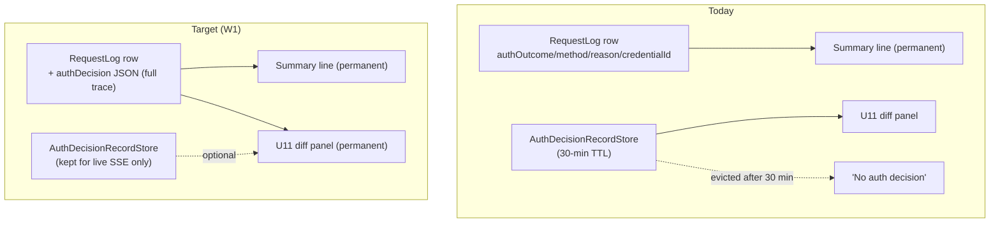
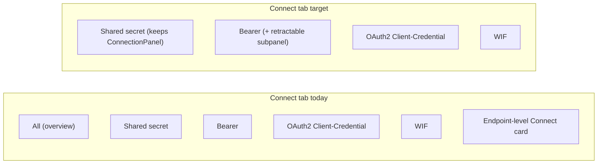

# Durable auth diagnostics on the log row, JWT decode everywhere, and Connect-tab UX - plan, audit, and design (W1-W12)

> **What this is.** The design + planning capture for the 2026-07-22 operator batch: make the authentication decision for a request permanently visible on the request's own log row (never a short-lived side table), add a decode affordance for encoded/JWT values everywhere (UI + admin API), and finish the Connect-tab information architecture (copy/export at every level + a UX reorganization). Successor to [CREDENTIAL_LIFECYCLE_AND_AUTH_IN_LOGS_PLAN.md](CREDENTIAL_LIFECYCLE_AND_AUTH_IN_LOGS_PLAN.md) (V1-V12, IMPLEMENTED) and the v0.54.41 pre-parse body-capture work.

> **Status.** PLAN. Implementation follows per the standard feature checklist (TDD; API unit + E2E + live; web vitest + Playwright; docs; version bump; measured dev deploy per track). Prod is never auto-promoted.

---

## Table of contents

1. [The reported symptom and its root cause](#1-the-reported-symptom-and-its-root-cause)
2. [Current-state audit](#2-current-state-audit)
3. [Work items W1-W12](#3-work-items-w1-w12)
4. [Track W-A: durable auth diagnostics on the log row](#4-track-w-a-durable-auth-diagnostics-on-the-log-row)
5. [Track W-B: decode encoded/JWT values everywhere](#5-track-w-b-decode-encodedjwt-values-everywhere)
6. [Track W-C: copy/export at every Connect level](#6-track-w-c-copyexport-at-every-connect-level)
7. [Track W-D: Connect UX reorganization](#7-track-w-d-connect-ux-reorganization)
8. [Sequencing and tracks](#8-sequencing-and-tracks)
9. [Test plan](#9-test-plan)

---

## 1. The reported symptom and its root cause

On a dev log detail the operator saw, for three separate requests (a `400` on `/Users`, a `200` filtered `/Users`, and a `201` `oauth/token`):

- the **persisted** V11 summary line rendering correctly: "Authenticated via `bearer_jwt`" / "Authenticated via `wif` using `adaa72c0-...`", but
- the U11 **AuthDecisionForRequest** panel showing "**No auth decision for this request** - it may have authenticated on an earlier request, used a non-auth route, or the short-lived record has expired."

**Root cause.** The two surfaces read from two different places:

| Surface | Source | Lifetime |
|---|---|---|
| The "Authenticated via ..." summary line | the four `auth*` columns persisted ON the `RequestLog` row (V10/V11) | permanent |
| The U11 expected-vs-received panel | the short-TTL `AuthDecisionRecordStore` via `useAuthDecisions`, joined `record.correlationId === correlationId` ([AuthDiagnosticsPanel.tsx](../../web/src/components/primitives/AuthDiagnosticsPanel.tsx) line 237) | 30 minutes |

So once the 30-minute store evicts the record (or a resource-plane accept was never recorded - accepts are noise-controlled), the panel goes blank even though the request's own row still knows the outcome. The operator's principle is exactly right: **auth is part of the request's processing, so its full diagnostics belong ON the request row, not in a separate expiring table.** This is the generalization of V10/V11 from a 4-field summary to the complete trace.

---

## 2. Current-state audit

| Area | Current state | Gap -> item |
|---|---|---|
| Auth summary on row | `RequestLog` has `authOutcome/authMethod/authReason/authCredentialId` ([schema.prisma](../../api/prisma/schema.prisma) L55-58) | full trace (checks/expected/received/decodedClaims) NOT persisted -> **W1** |
| U11 detail panel | reads `useAuthDecisions` short-TTL store ([AuthDiagnosticsPanel.tsx](../../web/src/components/primitives/AuthDiagnosticsPanel.tsx)) | must read the persisted trace from the row -> **W1** |
| Resource-plane accept recording | recorded only for endpoint-scoped routes (noise control); ephemeral | ensure durable + present for `bearer_jwt` on `/Users` -> **W1** |
| Decode encoded values | none - a JWT in a header/body renders as an opaque string | decode button in UI + admin API -> **W2** |
| Connect copy/export | per-credential `CopyJsonButton` + `ExportSplitButton` exist in places | not at endpoint / method / card / subpanel levels uniformly -> **W3-W6** |
| Connect tab method tabs | `enabledMethodTabs` returns `all` + per-method ([CredentialsTab.tsx](../../web/src/pages/CredentialsTab.tsx) L1642) | "All" tab redundant -> **W11** |
| Endpoint-level Connect card | the `all` overview renders the full `ConnectionPanel` selector | redundant vs per-cred subpanels -> **W12** (keep for shared-secret) |
| Cred/trust card buttons | scattered across bearer + oauth_client cards | organize -> **W7** |
| Bearer subtab connect | no retractable Connect subpanel | add one via a Connect button -> **W8** |
| "Connect to Entra" subpanel | labelled "Connect to Entra" ([CredentialsTab.tsx](../../web/src/pages/CredentialsTab.tsx) L1514) | rename + tooltip -> **W9** |
| Per-parameter help text | endpoint-level card prose | move to hover/click info per parameter -> **W10** |

---

## 3. Work items W1-W12

- **W1** - persist the full `AuthDecisionTrace` on the `RequestLog` row; render the U11 detail from the row; ensure resource-plane accepts are recorded + persisted.
- **W2** - decode affordance for encoded/JWT values in every header/body viewer + an admin `POST /scim/admin/decode-jwt`.
- **W3** - endpoint Connect tab: one overall copy / download-as-JSON / `.env` of everything.
- **W4** - each auth-method subtab: overall copy/export of the whole method.
- **W5** - each credential/trust card: overall copy/export of that card.
- **W6** - the retractable Connect subpanel: copy/export the IdP connection params.
- **W7** - organize the scattered credential-card buttons.
- **W8** - add the retractable Connect subpanel (via a Connect button) to the per-endpoint bearer subtab.
- **W9** - rename the subpanel to "Connect this endpoint to IdP like Entra ID"; use it as the Connect button tooltip.
- **W10** - per-parameter explanatory text becomes hover/click info in each card's subpanel.
- **W11** - remove the redundant "All" subtab.
- **W12** - remove the redundant endpoint-level "Connect to Entra ID" card where redundant; keep it for the shared-secret subtab.

---

## 4. Track W-A: durable auth diagnostics on the log row

> **Status: W1 IMPLEMENTED v0.54.42.** `RequestLog.authDecision` (migration `20260722120000_add_requestlog_auth_decision`) holds the full redacted trace; `emitAuthDecisionEvent` stamps it, `recordRequest` persists it (both backends), `getLog` returns it, and `AuthDecisionForRequest` renders it via a `persistedDecision` prop (the short-TTL store is only a fallback). The "No auth decision" empty state now shows only when the row genuinely has none.

- **Data model:** add a nullable `authDecision String?` column to `RequestLog` (Prisma migration + InMemory parity) holding the JSON-serialized, redacted `AuthDecisionTrace` (`checks[]` with `expected`/`received`, `decodedClaims`, `joseHeader`, `plane`, `selectedTrustId`, `subTraces`) - the same object the ephemeral store holds, minus any secret (none are stored today either).
- **Write path:** the trace is already built during auth and stamped onto the correlation context summary in `emitAuthDecisionEvent`. Extend the context stamping to carry the full trace (or a compact form), and `LoggingService.recordRequest` persists it into `authDecision`. Cap + redact via the same body-capture safeties.
- **Resource plane:** ensure the `SharedSecretGuard` resource-plane accept path records a trace for endpoint-scoped routes (it already does for rejects); persist it so a `200`/`400` on `/Users` carries its auth decision.
- **Read path:** the logs detail returns `authDecision`; a new `AuthDecisionForLog` render path (or `AuthDecisionForRequest` given a `record` prop) renders the persisted trace directly. The `useAuthDecisions` store becomes a fallback/live-only source, not the source of truth. The "No auth decision" empty state only shows when the row genuinely has none.
- **Acceptance:** a request whose ephemeral record has expired STILL shows the full expected-vs-received diff from its row; unit + E2E + live + Playwright.

---

## 5. Track W-B: decode encoded/JWT values everywhere

> **Status: W2 IMPLEMENTED v0.54.43.** Shared `decodeJwt`/`looksLikeJwt` util (api + web); admin `POST /scim/admin/decode-jwt`; `JwtDecodeButton` primitive + `CopyableJsonBlock` inline per-token decode (via `findJwtsInValue`), so every log-detail header/body viewer offers decoding.

- **Shared decoder:** a pure `decodeJwt(token)` util returning `{ header, payload }` (base64url decode of the first two segments; the signature is shown as opaque - a JWT is signed, not encrypted, so its claims are readable by the holder). Never attempt to "decrypt" - surface `alg`/`kid` + the claim set.
- **Admin API:** `POST /scim/admin/decode-jwt` `{ "token": "<jwt>" }` -> `{ "header": {...}, "payload": {...}, "isJwt": true }` (admin-auth-gated; rejects non-JWT input with a clear error). Never logs the token.
- **UI:** a decode affordance (a small "decode" button / popover) rendered next to any value that looks like a JWT (`eyJ...` three-segment) inside the log detail request/response header + body viewers (and reusable in other JSON viewers). Clicking reveals the decoded header + claims inline, copyable via the existing primitives.
- **Security:** decoding a signed JWT reveals only what its holder already has; still gate the admin API behind admin auth and never persist the decoded output.
- **Acceptance:** a Bearer/`client_assertion`/`access_token` value in a log detail can be decoded in-place; the admin API decodes a pasted token; unit + E2E + vitest + Playwright.

---

## 6. Track W-C: copy/export at every Connect level

Reuse the shipped `CopyJsonButton` + `ExportSplitButton` (JSON / `.env` / download) primitives; add an overall control at each level so the operator can grab exactly the scope they need:

- **W3 endpoint level:** an assembled bundle of every enabled method + every credential/trust + its connection info + the auth-related endpoint settings (a server-assembled projection so the export is one call).
- **W4 method level:** the same, scoped to one method's credentials/trusts.
- **W5 card level:** one credential/trust's full record.
- **W6 subpanel level:** just the IdP connection parameters that panel shows.

---

## 7. Track W-D: Connect UX reorganization

- **W7:** group each card's actions into a primary set (Connect, Copy/Export) + a secondary overflow `Menu` (Reveal, Rotate, Edit, Verify, Delete), consistent order across bearer + oauth_client, so they are not scattered.
- **W8:** the per-endpoint bearer subtab's credential card gains the same retractable Connect subpanel (Connect button toggles `bearer-credential-connect-panel-{id}`).
- **W9:** rename the subpanel header to "Connect this endpoint to IdP like Entra ID"; the card Connect button carries this as its `title`/tooltip.
- **W10:** each connection parameter row shows a Fluent `InfoLabel`/`Tooltip` with the explanatory text currently living in the endpoint-level card prose.
- **W11:** drop the `all` entry from `enabledMethodTabs` and default the method tab to the first enabled method.
- **W12:** remove the endpoint-level overall `ConnectionPanel` card where a per-cred subpanel now covers it; keep the `ConnectionPanel` for the shared-secret method (which has no per-credential card).

---

## 8. Sequencing and tracks

1. **W-A (W1)** - highest value; backend migration + write/read + UI. Own commits.
2. **W-B (W2)** - decode util + admin API + UI button.
3. **W-C (W3-W6)** - copy/export at levels.
4. **W-D (W7-W12)** - Connect UX reorg.

Each item: TDD RED-GREEN-REFACTOR; API unit + E2E + live (`live-test.ps1` section); web vitest + Playwright; docs; version bump (api + web + lockfiles); CHANGELOG; own commit; measured dev deploy per track. Cross-backend parity for every backend-touching change.

---

## 9. Test plan

| Item | API unit | E2E | Live | Web vitest | Playwright |
|---|---|---|---|---|---|
| W1 | trace persisted + projected (both backends) | a request's row carries the full decision; survives store expiry | 9z section: decision on the row | detail renders from row | durable diff with empty store |
| W2 | decodeJwt util + controller | `POST /admin/decode-jwt` | 9z section | decode button reveals claims | decode in log detail |
| W3-W6 | export projection assembler | export endpoints return the bundle | 9z section | copy/export buttons present | export at each level |
| W7-W12 | (UI-only mostly) | - | - | button grouping, tabs, tooltips | reorganized Connect tab |
