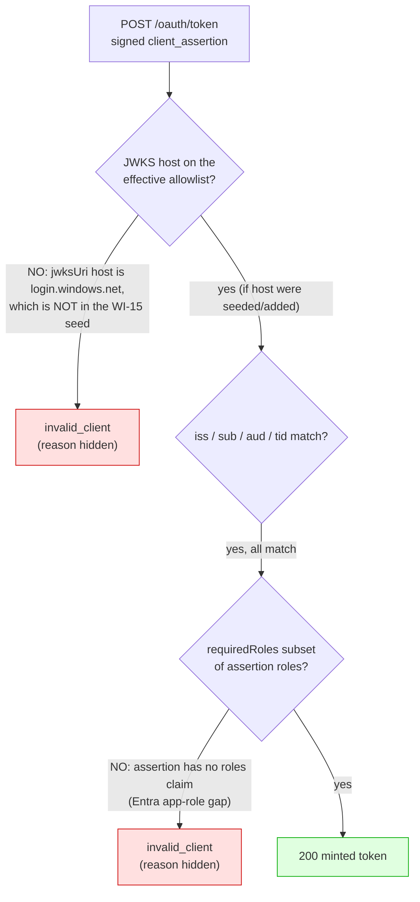
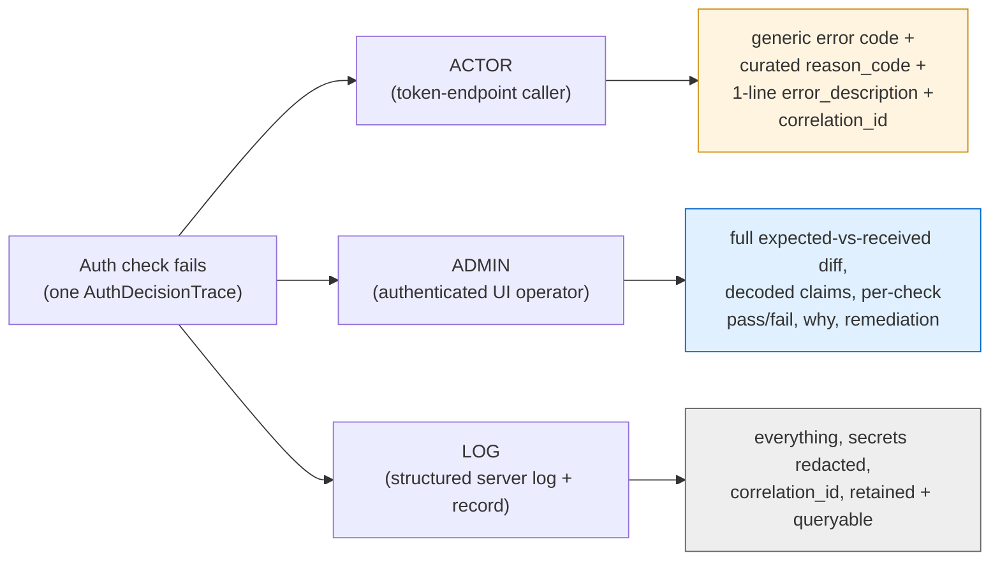
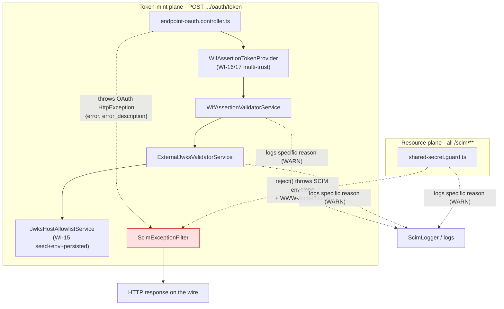
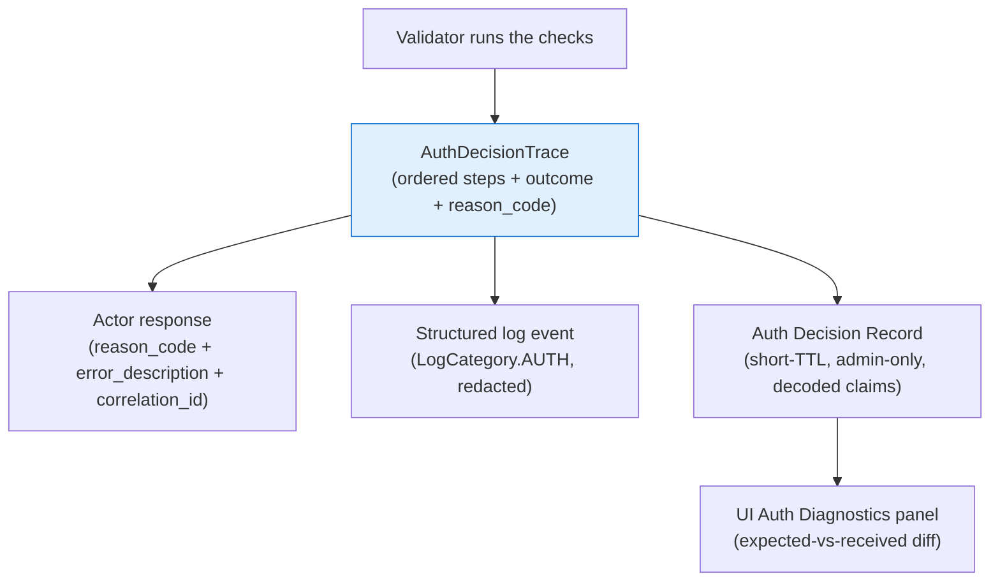
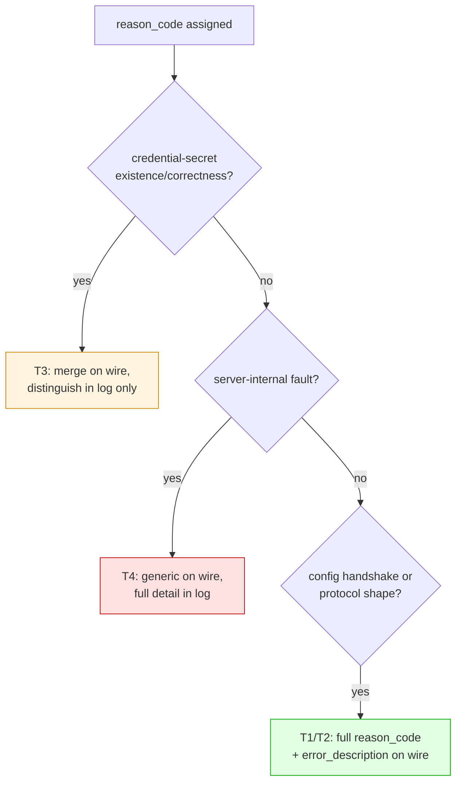
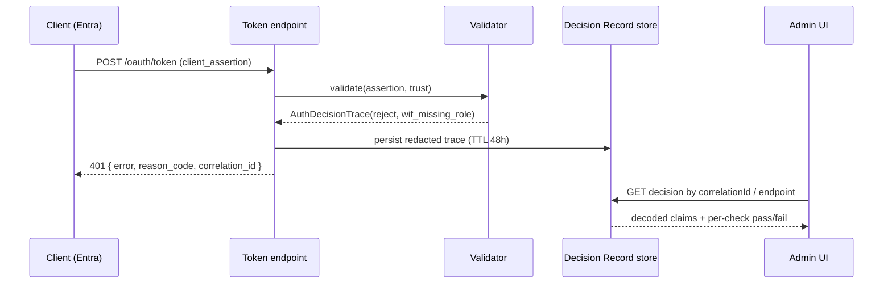
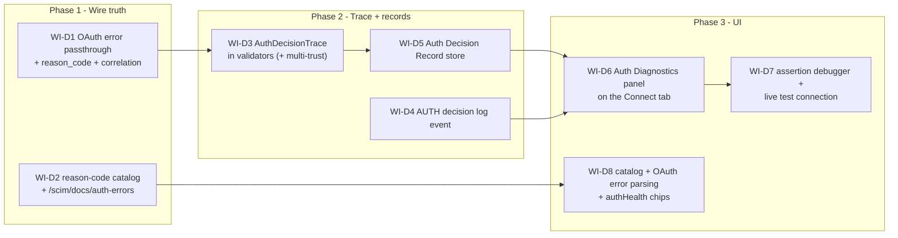

# Auth error diagnostics + observability - design, gaps, and improvement plan

> **What this is.** A design analysis and improvement plan for making **every authentication failure** in SCIMServer self-diagnosable. It covers the token-mint plane (WIF `jwt-bearer`, per-endpoint `oauth_client`, global client-credentials) and the resource plane (bearer guard), and it proposes concrete changes at the API, observability, and UI layers so an operator can see, for any failure: **what was configured, what was received, what was inside the assertion/token, which exact check failed, and why**.
>
> **Why it exists.** A real WIF setup against dev endpoint `e8edd907-...` returned a bare `{ "detail": "invalid_client", "status": "401" }`. That single string hid at least two distinct, independently-fixable root causes (a JWKS host the server's allowlist did not permit, and an assertion with no `roles` claim against a trust that required one). The information needed to diagnose both existed server-side but never reached the caller or any UI. This document is the blueprint for closing that gap without weakening the security posture that makes some opacity deliberate.
>
> **Status.** Analysis + design, **re-verified against the latest `feat/wif` at commit `b9d615b`** (the connection-info epic WI-1..WI-17 has since shipped: connection-info API, Connect tab, JWKS-host admin allowlist, WIF discovery resolver, multi-trust, secret reveal/rotate). **Re-verified a second time on v0.54.11 (2026-07-10)** after the R1 (JWKS full-CRUD + PATCH) / R4b / R6 / R8 batch - see [Part 1.3](#13-second-reanalysis-on-v05411-2026-07-10). The current-state sections ([Part 3](#3-current-state-how-an-auth-failure-is-shaped-today), [Part 4](#4-gap-analysis-known-vs-surfaced-vs-visible)) are verified against the sources cited inline. The improvement sections ([Part 6](#6-the-unifying-idea-an-auth-decision-trace) onward) are PROPOSED and now IN DELIVERY (WI-D1..WI-D8). No behavior described as "proposed" ships without the full feature checklist (unit + E2E + live + Playwright + docs).
>
> **What the epic changed for this analysis.** The central finding is UNCHANGED: token-endpoint auth failures still collapse to a bare `invalid_client` with the specific reason discarded from the response, and no UI shows which check failed. What the epic *added* is (a) a **partial relief** of the original JWKS-host root cause via a seeded, admin-editable allowlist ([Part 1.2](#12-re-diagnosis-on-the-latest-sources)), and (b) two **shipped precedents** that already do exactly what this document advocates - config-time specificity and response-level `{ retained, reason }` - which the token endpoint should now follow ([Part 5.4](#54-two-precedents-already-in-the-codebase)). The new Connect tab is the natural home for the proposed diagnostics UI ([Part 11](#11-ui-layer-improvements-the-centerpiece)).
>
> **Provenance.** RFC and industry facts are cited to [RFC 6749 section 5.2](https://www.rfc-editor.org/rfc/rfc6749#section-5.2), [RFC 6750 section 3](https://www.rfc-editor.org/rfc/rfc6750#section-3), [RFC 9457 (Problem Details)](https://www.rfc-editor.org/rfc/rfc9457), the [Microsoft Entra error-code reference](https://learn.microsoft.com/en-us/entra/identity-platform/reference-error-codes), and the [OWASP Error Handling](https://cheatsheetseries.owasp.org/cheatsheets/Error_Handling_Cheat_Sheet.html) + [Logging](https://cheatsheetseries.owasp.org/cheatsheets/Logging_Cheat_Sheet.html) cheat sheets. SCIMServer behavior is cited to the actual sources inline at `b9d615b` (for example [endpoint-oauth.controller.ts](../../api/src/modules/scim/controllers/endpoint-oauth.controller.ts), [wif-assertion-validator.service.ts](../../api/src/oauth/wif-assertion-validator.service.ts), [jwks-host-allowlist.service.ts](../../api/src/oauth/jwks-host-allowlist.service.ts), [scim-exception.filter.ts](../../api/src/modules/scim/filters/scim-exception.filter.ts), [scim-errors.ts](../../api/src/modules/scim/common/scim-errors.ts)).
>
> **Companion docs.** [CONNECTION_INFO_AND_ENTRA_SETUP.md](CONNECTION_INFO_AND_ENTRA_SETUP.md) (what to paste into Entra - now IMPLEMENTED), [CONNECTION_INFO_EXECUTION_LEDGER.md](CONNECTION_INFO_EXECUTION_LEDGER.md) (WI-1..WI-17 status), [CONNECTION_INFO_EXECUTION_RCA.md](CONNECTION_INFO_EXECUTION_RCA.md) (epic issues + RCA), [WIF_Q6_VALIDATE_ISSUE_UI.md](WIF_Q6_VALIDATE_ISSUE_UI.md) (the WIF validation lifecycle), [OAUTH_DISCOVERY_AND_BEARER_ERRORS.md](OAUTH_DISCOVERY_AND_BEARER_ERRORS.md) (the 3-tier resource chain + `WWW-Authenticate`), [EXTERNAL_JWKS_VALIDATOR.md](EXTERNAL_JWKS_VALIDATOR.md) (the JWKS primitive).

---

## Gap-closure audit (2026-07-20, v0.54.30)

A norms audit of every auth flow (API + UI) found four residual gaps beyond the shipped WI-D1..D8 / P1-P5 epic; all four are now **CLOSED**:

- **F1 - RequestLog secret persistence (now flag-governed).** The RequestLog previously stored request/response headers + bodies (including `Authorization`, `client_secret`, `access_token`) verbatim with no redaction. This is now a deliberate, configurable behavior: a new server env `PERSIST_REQUEST_SECRETS` (default `true`) + per-endpoint `PersistRequestSecrets` config flag (endpoint overrides server) keep the **complete** request/response for fast RCA by DEFAULT, and redact secret-bearing values before persist/display when set to `false`. A shared recursive redactor ([redact-sensitive.ts](../../api/src/security/redact-sensitive.ts)) is now also applied by `ScimLogger.sanitizeData` so shipped console/file structured logs ALWAYS redact nested secrets (defense in depth) regardless of the flag.
- **F2 - global `/scim/oauth/token` reason_code + observability.** The global client-credentials token endpoint ([oauth.controller.ts](../../api/src/oauth/oauth.controller.ts)) now carries a stable `reason_code` on every RFC-6749 error body (`grant_type_unsupported` / `missing_credentials` / `oauth_client_auth_failed`) and emits the canonical `Auth decision` event + short-TTL record - parity with the per-endpoint token endpoint.
- **F3 - resource-plane OAuth-JWT sub-reason preserved.** `OAuthService.validateAccessToken` now attaches a jose-style `code` to its thrown error, and the guard ([shared-secret.guard.ts](../../api/src/modules/auth/shared-secret.guard.ts)) classifies it into `bearer_oauth_expired` / `bearer_oauth_signature_invalid` instead of collapsing every bearer failure to `bearer_invalid`.
- **F4 - resource-plane reason_code on the wire.** The bearer guard now carries the specific `reason_code` inside the SCIM `Diagnostics` extension URN (a documented member, so the SCIM error contract stays intact); `ScimExceptionFilter` merges it with the auto-enriched `requestId`, and the UI ([queries.ts](../../web/src/api/queries.ts) + [scim-error.ts](../../web/src/api/scim-error.ts)) reads it and renders the specific bearer remediation.

**Follow-up (now CLOSED, v0.54.31): `requestId` correlator for GUARD-level rejections.** The request-id + correlation context were previously established by the `RequestLoggingInterceptor`, which runs AFTER guards - so a guard-rejected 401 carried the `reason_code` but no `requestId`. An early **correlation middleware** ([correlation-middleware.ts](../../api/src/bootstrap/correlation-middleware.ts), applied via `app.use()` in both [main.ts](../../api/src/main.ts) and the E2E harness) now runs BEFORE guards: it sets the `X-Request-Id` header, establishes the `AsyncLocalStorage` context, and stashes a base `RequestLoggingMeta` on the request. The interceptor was refactored to REUSE that request-id (it only enriches the meta with the parsed body). Result: a guard-rejected 401 now carries the `reason_code` AND the `requestId` in its diagnostics (with `requestId` === the `X-Request-Id` header), the canonical `Auth decision` event carries the `correlationId`, and the RequestLog row is written with the `requestId` - the full correlation bridge works for auth-guard rejections too. `ScimExceptionFilter` reads the request-id from the correlation context OR the stashed meta (belt-and-suspenders) so it is robust regardless of ALS propagation.

**Next (IMPLEMENTED 2026-07-21, v0.54.37): the auth decision is a first-class part of the request-log detail (no longer a disjointed sibling panel).** [CONNECT_AND_LOGS_UX_OVERHAUL_PLAN.md](CONNECT_AND_LOGS_UX_OVERHAUL_PLAN.md) (U11 + U12) shipped: the auth-decision trace for a request now renders **inside its `DetailDrawer`** via the reusable `AuthDecisionForRequest` primitive (an "Authentication" section `log-detail-auth-section`, joined by `requestId === correlationId`), each request-log row carries an **auth-outcome chip** (`log-row-auth-{id}`), and the standalone `AuthDiagnosticsPanel` was removed from the logs surface and re-scoped to the endpoint-wide "recent auth decisions" view on **Connect -> Health**. This operationalizes the principle that authentication is a first-class step of every request's lifecycle - see the plan doc's Q2/Q3 for the options weighed and the usability rationale.

---

## Table of contents

1. [The problem, in one real failure (re-diagnosed on the latest sources)](#1-the-problem-in-one-real-failure-re-diagnosed-on-the-latest-sources)
   - 1.1 [The two hidden root causes](#11-the-two-hidden-root-causes)
   - 1.2 [Re-diagnosis on the latest sources](#12-re-diagnosis-on-the-latest-sources)
2. [Design principles + the security tension](#2-design-principles--the-security-tension)
3. [Current state: how an auth failure is shaped today](#3-current-state-how-an-auth-failure-is-shaped-today)
   - 3A. [The token-mint plane](#3a-the-token-mint-plane)
   - 3B. [The resource plane (bearer guard)](#3b-the-resource-plane-bearer-guard)
   - 3C. [The flattener: what the exception filter does](#3c-the-flattener-what-the-exception-filter-does)
   - 3D. [The diagnostics envelope that already exists](#3d-the-diagnostics-envelope-that-already-exists)
   - 3E. [The observability substrate that already exists](#3e-the-observability-substrate-that-already-exists)
   - 3F. [The UI surfaces that already exist](#3f-the-ui-surfaces-that-already-exist)
4. [Gap analysis: known vs surfaced vs visible](#4-gap-analysis-known-vs-surfaced-vs-visible)
5. [Industry best practice + two precedents already in the codebase](#5-industry-best-practice--two-precedents-already-in-the-codebase)
6. [The unifying idea: an Auth Decision Trace](#6-the-unifying-idea-an-auth-decision-trace)
7. [The auth failure reason-code catalog](#7-the-auth-failure-reason-code-catalog)
8. [The visibility decision matrix (what is safe to reveal)](#8-the-visibility-decision-matrix-what-is-safe-to-reveal)
9. [API-layer improvements](#9-api-layer-improvements)
10. [Observability-layer improvements](#10-observability-layer-improvements)
11. [UI-layer improvements (the centerpiece)](#11-ui-layer-improvements-the-centerpiece)
12. [Worked examples](#12-worked-examples)
13. [Options + recommendations summary](#13-options--recommendations-summary)
14. [Phased delivery plan + work items](#14-phased-delivery-plan--work-items)
15. [Security + privacy considerations](#15-security--privacy-considerations)
16. [References](#16-references)

---

## 1. The problem, in one real failure (re-diagnosed on the latest sources)

An operator set up Workload Identity Federation from an Entra app against dev endpoint `e8edd907-0dfb-415d-b834-abf0d20eb0e0`. The trust was configured as:

```json
{
  "assertionProfile": "jwt-bearer",
  "expectedIssuer": "https://login.microsoftonline.com/9751e42f-78f3-42f4-8b8a-6e73845aceae/v2.0",
  "expectedSubject": "649001f8-563a-44ae-824d-472a5434a039",
  "expectedAudience": "102538c4-6640-47f0-8362-0dbc6440234f",
  "jwksUri": "https://login.windows.net/9751e42f-78f3-42f4-8b8a-6e73845aceae/discovery/v2.0/keys",
  "allowedTenantId": "9751e42f-78f3-42f4-8b8a-6e73845aceae",
  "requiredRoles": ["Scim.Provision"],
  "scope": "scim.read scim.write"
}
```

The Entra app sent a correctly-signed `client_assertion` whose decoded claims matched `iss`, `sub`, `aud`, and `tid` exactly. The token endpoint responded:

```json
{
  "schemas": ["urn:ietf:params:scim:api:messages:2.0:Error"],
  "detail": "invalid_client",
  "status": "401"
}
```

That is the entire diagnostic payload: one opaque word.

### 1.1 The two hidden root causes

Behind that single word were **two independent failures**, each with a different owner and fix:



Both reasons were known to the server. The JWKS-host rejection is logged at `WARN` in [external-jwks-validator.service.ts](../../api/src/oauth/external-jwks-validator.service.ts) (`JWKS host not permitted by allowlist (SSRF guard)`); the role-subset failure is logged at `WARN` in [wif-assertion-validator.service.ts](../../api/src/oauth/wif-assertion-validator.service.ts) (`WIF assertion rejected`, `reason: missing required role(s): Scim.Provision`). Neither reached the caller, and there is no UI where the operator could have seen either one.

### 1.2 Re-diagnosis on the latest sources

Between the original report and this revision, the **connection-info epic (WI-1..WI-17) shipped**, including WI-15 (the JWKS host allowlist) and WI-14 (a discovery resolver). Re-running the diagnosis against `b9d615b`:

**Root cause 1 (JWKS host) is now partially relieved, but not for this exact trust.** WI-15 introduced a compiled seed of well-known IdP hosts in [jwks-host-allowlist.service.ts](../../api/src/oauth/jwks-host-allowlist.service.ts#L33-L40):

```ts
export const WELL_KNOWN_JWKS_HOST_SEED: ReadonlyArray<string> = [
  'login.microsoftonline.com', // Entra commercial (v2)
  'login.windows.net',         // Entra commercial (v1) - seeded 2026-08-11
  'login.microsoftonline.us',  // Entra US Gov
  'login.chinacloudapi.cn',    // Entra China (21Vianet)
  'login.partner.microsoftonline.cn', // Entra China alt
  'www.googleapis.com',        // Google
  'accounts.google.com',       // Google OIDC
];
```

The validator now consults `allowlistService.isAllowed(host)` (the seed union) when the service is wired ([external-jwks-validator.service.ts](../../api/src/oauth/external-jwks-validator.service.ts#L124-L138)). Consequences for the original failure:

| Aspect | Before the epic | On `b9d615b` | Since 2026-08-11 |
|---|---|---|---|
| `login.microsoftonline.com` JWKS | rejected unless env-set | **allowed out of the box** (seeded) | unchanged |
| `login.windows.net` JWKS (this trust) | rejected | **still rejected** - not in the seed | **allowed out of the box (now seeded)** |
| How to fix without redeploy | not possible (env-only, restart) | **`POST /admin/settings/jwks-hosts`** adds it, hot-reloaded ([admin-jwks-host.controller.ts](../../api/src/modules/scim/controllers/admin-jwks-host.controller.ts)) | no fix needed |
| Reason surfaced to the caller | no | **still no** - bare `invalid_client` | addressed separately by the reason catalog |

**Update, 2026-08-11: this exact trust now passes the host check.** `login.windows.net` was added to the compiled seed. The trigger was a cross-tenant migration: the host had been added BY HAND to the persisted layer on every long-lived estate (dev, canary prod and the customer-facing prod all carried it with `label: null` rather than the seed label), so it was invisible operator state. The migration carried every endpoint, user, group and credential faithfully and still lost it, and no count-based check noticed - only a v1-issuer trust would have failed, later, far from the cause. Seeding it makes it a permanent floor that a migration, an accidental admin deletion, or a fresh deployment cannot drop. Locked by explicit per-host cases in [jwks-host-allowlist.service.spec.ts](../../api/src/oauth/jwks-host-allowlist.service.spec.ts) - the pre-existing test looped over the constant and so could never detect a host being removed from it.

**WI-14 would have sidestepped it entirely.** The new discovery resolver ([wif-discovery-resolver.service.ts](../../api/src/oauth/wif-discovery-resolver.service.ts)) lets an admin pass a preset + tenant id (or a discovery URL); it fetches the IdP's `openid-configuration` and stores the canonical `jwks_uri` - which for the `entra-commercial` preset is on the seeded `login.microsoftonline.com` host. Had the trust been built via the resolver, it would never have carried the un-seeded `login.windows.net` host.

**Root cause 2 (missing role) is unchanged.** The assertion carries no `roles` claim; the trust requires `Scim.Provision`; [wif-assertion-validator.service.ts](../../api/src/oauth/wif-assertion-validator.service.ts#L103) still fails it - and the reason is still discarded from the response.

**Bottom line:** the epic made the JWKS-host cause *easier to fix once you know what it is*, but did nothing to make the failure *legible*. The core problem this document addresses - a legitimate, IdP-key-controlling caller cannot tell which check failed - is exactly as present on `b9d615b` as it was on day one. Everything below still applies in full.

### 1.3 Second reanalysis on v0.54.11 (2026-07-10)

Re-verified again against `feat/wif` at **v0.54.11**, after a further batch shipped (R1 JWKS host allowlist *full CRUD* + selective PATCH + prepopulated editable seed; R4b SCIMServer-level connection-info card on the admin Settings page; R6 per-method credential sub-tabs; R8 contextual cross-links; the `-alpha` version suffix was dropped). The central finding is **still unchanged** - the token endpoint still collapses every auth failure to a bare `invalid_client` and no UI shows which check failed - but four deltas refine the delivery plan:

- **D1 - the `jwks_host_not_allowlisted` remediation is now much richer.** R1 turned the allowlist into a fully DB-persisted, admin-CRUD-managed table: the well-known IdP seed is **prepopulated as editable rows**, and the admin surface offers add / **edit (`PUT /scim/admin/settings/jwks-hosts/{id}`)** / remove / **selective add-and-remove (`PATCH`)** plus a Copy/Download-as-JSON export on the Settings page. Every catalog remediation hint for `jwks_host_not_allowlisted` (Parts 1.2, 7.1) must point at this full-CRUD card and the PUT/PATCH verbs, not only the old `POST`. The diagnostics panel's fix-link (Part 11.1) should deep-link straight to `Settings > JWKS host allowlist` via an R8 cross-link.

- **D2 - endpoint-level AND SCIMServer-level surfacing is now a first-class requirement (operator ask).** The Auth Decision Record store (Part 10.2) and the log event (Part 10.1) must be queryable and visible at **both** scopes, mirroring the existing two-scope log surfaces (`/scim/endpoints/:id/logs/recent` + `/scim/admin/log-config/recent`) and the R4b precedent (per-endpoint info on the Connect tab; SCIMServer-level info on the admin Settings page):
  - **Endpoint scope:** `GET /scim/admin/endpoints/:id/auth-decisions` (recent auth attempts for one endpoint), surfaced on that endpoint's Connect tab (Part 11.1) and its Logs tab.
  - **Global scope:** `GET /scim/admin/auth-decisions` (recent auth attempts across all endpoints), surfaced on the admin Logs page.
  - **Request-log integration:** the WI-D4 AUTH decision event must flow through the *existing* ring-buffer + SSE + persistent `RequestLog` mechanism (it already captures the token-endpoint request body), and the LogsPage/LogsTab detail drawer must gain an auth-method + reason-code filter and a decoded-claim / expected-vs-received view. This makes auth failures visible in the log tools operators already use, not only in a new bespoke panel.

- **D3 - R6 per-method sub-tabs give the diagnostics a second natural home.** The Credentials tab now has per-method sub-tabs (Shared secret / Per-endpoint bearer / OAuth2 client / WIF). The assertion/token debugger (Part 11.2) belongs in the **WIF sub-tab** (next to the trust it evaluates against), and a compact per-method auth-health chip (Part 11.5) can appear on each sub-tab, complementing the fuller diagnostics panel on the Connect tab.

- **D4 - the primitive + cross-link toolkit is richer now.** WI-D6/D7/D8 should reuse the shipped R9 primitives (`CopyableField`, `CopyableJsonBlock`, `CopyJsonButton`, `SettingsJsonExport`) so every decoded claim + the whole trace is copyable/downloadable as JSON, and the R8 `useNavigate` cross-link pattern so the fix hints jump straight to the relevant remediation surface (Settings > JWKS hosts, the WIF sub-tab, the endpoint Settings auth flags).

These deltas do not change the work-item *set* (WI-D1..WI-D8) or their order; they sharpen WI-D5/D6/D8 (two-scope + request-log integration + sub-tab home) and make WI-D2/D7's remediation text reference the R1 full-CRUD verbs. Part 14 is annotated accordingly.


---

## 2. Design principles + the security tension

Five principles govern every recommendation below.

| # | Principle | Consequence |
|---|---|---|
| P1 | **Preserve the RFC-required generic `error` code.** [RFC 6749 section 5.2](https://www.rfc-editor.org/rfc/rfc6749#section-5.2) fixes the top-level token-endpoint code to `invalid_client` / `invalid_request` / `unsupported_grant_type` etc. | Never invent new top-level `error` values. Put specificity in `error_description` + a `reason_code`, exactly as Entra does. |
| P2 | **Do not leak credential-secret existence or correctness.** Whether a client id exists, and whether a presented secret matched, must not be distinguishable on the wire (enumeration + brute-force defense). | The `oauth_client` "not found vs wrong secret" fork stays merged on the response; the distinction lives only in logs. |
| P3 | **A configuration-handshake mismatch is safe to reveal to the asserting party.** A caller who presents a validly-signed assertion has already proven control of the IdP key. Telling them "your `aud` was X, I expected Y" gives an attacker who cannot sign nothing. | `iss`/`sub`/`aud`/`tid`/`role`/`alg`/`exp`/JWKS-host mismatches get a specific `reason_code` + human `error_description`. This mirrors Entra (see [Part 5](#5-industry-best-practice--two-precedents-already-in-the-codebase)) and the codebase's own WI-14 resolver. |
| P4 | **Never leak implementation internals.** No stack traces, framework names, file paths, or raw secrets in any response ([OWASP Error Handling](https://cheatsheetseries.owasp.org/cheatsheets/Error_Handling_Cheat_Sheet.html)). | The curated reason catalog is a bounded allowlist of strings, not a passthrough of exception messages. |
| P5 | **Three audiences, three depths.** The same failure is rendered at three fidelities. | See the table below. |

### The three-audience model



| Audience | Who | Sees | Bounded by |
|---|---|---|---|
| **Actor** | The client calling the token endpoint (Entra, a script, curl) | Generic `error` + a `reason_code` + a one-line `error_description` + `correlation_id` | P1-P4: no secrets, no internals, credential-secret fork stays merged |
| **Admin** | An authenticated operator in the SCIMServer UI | The full decode: what was configured, what arrived, each check's expected-vs-received, pass/fail, why, and how to fix | Admin auth (already required for the UI); PII/secret redaction still applies to raw material |
| **Log** | Operators with log access + automated alerting | Every field, secrets redacted per the existing `sanitizeData` rules, correlation-linked, retained | [OWASP Logging](https://cheatsheetseries.owasp.org/cheatsheets/Logging_Cheat_Sheet.html): log authN success + failure with when/where/who/what/reason; exclude tokens/secrets |

The security tension resolves cleanly once you separate **P2 (secret opacity)** from **P3 (config transparency)**. Today the code applies P2-level opacity to P3-class failures, which is the actual defect - and the codebase already violates that conflation in its own favor twice (WI-14, WI-8/9; see [Part 5.4](#54-two-precedents-already-in-the-codebase)).

---

## 3. Current state: how an auth failure is shaped today

The whole auth surface has two planes. The **token-mint plane** issues SCIMServer's own tokens (WIF assertion, `oauth_client`, global client-credentials). The **resource plane** guards `/scim/**` with a bearer token. They shape errors very differently.



### 3A. The token-mint plane

The per-endpoint token endpoint ([endpoint-oauth.controller.ts](../../api/src/modules/scim/controllers/endpoint-oauth.controller.ts)) routes by request shape (`client_assertion` -> WIF path; `client_secret` -> oauth_client path). Every authentication failure on both paths funnels through one private helper at [endpoint-oauth.controller.ts:193](../../api/src/modules/scim/controllers/endpoint-oauth.controller.ts#L193):

```ts
private invalidClient(): HttpException {
  return new HttpException(
    {
      error: 'invalid_client',
      error_description: 'Invalid per-endpoint client credentials.',
    },
    HttpStatus.UNAUTHORIZED,
  );
}
```

It is thrown from four sites ([L117](../../api/src/modules/scim/controllers/endpoint-oauth.controller.ts#L117), [L128](../../api/src/modules/scim/controllers/endpoint-oauth.controller.ts#L128), [L133](../../api/src/modules/scim/controllers/endpoint-oauth.controller.ts#L133), [L171](../../api/src/modules/scim/controllers/endpoint-oauth.controller.ts#L171)) - no provider wired, assertion invalid, no trust, and oauth_client failure - all with the identical body. The specific reason is captured only in a server-side log immediately before each throw (for example the WIF catch logs `reason: (err as Error).message`).

The `WifAssertionValidatorService` ([wif-assertion-validator.service.ts](../../api/src/oauth/wif-assertion-validator.service.ts)) is where the specific reasons are born. It throws a `WifAssertionInvalidError(reason)` with a distinct `reason` string per check:

| Check | Reason string thrown | Source |
|---|---|---|
| Signature / alg / `exp` / `nbf` | (jose error, or one of the JWKS errors below) | delegated to `ExternalJwksValidatorService.verify` |
| `iss` | `issuer mismatch` | [wif-assertion-validator.service.ts:83](../../api/src/oauth/wif-assertion-validator.service.ts#L83) |
| `sub` | `subject mismatch` | [wif-assertion-validator.service.ts:86](../../api/src/oauth/wif-assertion-validator.service.ts#L86) |
| `aud` | `audience mismatch` | [wif-assertion-validator.service.ts:89](../../api/src/oauth/wif-assertion-validator.service.ts#L89) |
| `tid` | `tenant mismatch` | [wif-assertion-validator.service.ts:94](../../api/src/oauth/wif-assertion-validator.service.ts#L94) |
| roles | `missing required role(s): <list>` | [wif-assertion-validator.service.ts:103](../../api/src/oauth/wif-assertion-validator.service.ts#L103) |

**WI-16/WI-17 multi-trust (new).** The provider ([wif-assertion-token.provider.ts](../../api/src/modules/scim/controllers/wif-assertion-token.provider.ts)) now holds *several* `wif` trusts per endpoint, orders them issuer-first from the assertion's unverified `iss`, and tries each. If none accepts, it throws the last error, or a new `No configured WIF trust accepted the assertion.` ([wif-assertion-token.provider.ts:126-129](../../api/src/modules/scim/controllers/wif-assertion-token.provider.ts#L126-L129)). That reason, too, is discarded at the controller boundary and collapses to `invalid_client`.

The JWKS primitive ([external-jwks-validator.service.ts](../../api/src/oauth/external-jwks-validator.service.ts)) adds more distinct reasons, each currently a raw `Error`:

| Condition | Message thrown |
|---|---|
| `jwksUri` not a URL | `Invalid jwksUri: "<uri>".` |
| scheme not https | `jwksUri must use https (got "<proto>").` |
| host not on the effective allowlist (SSRF gate, pre-network) | `JWKS host "<host>" is not permitted by the JWKS_HOST_ALLOWLIST.` |
| JWKS fetch non-2xx | `JWKS fetch returned HTTP <status>.` |
| fetch failed, no cache (fail closed) | `JWKS unavailable; failing closed.` |
| bad signature / disallowed alg | (jose `JWSSignatureVerificationFailed` etc.) |

All of these collapse to the same `invalid_client` with the same `error_description` on the wire. **Nine-plus distinct, individually-actionable reasons render as one word.**

The `oauth_client` (client-secret) path deliberately merges two reasons - client not found, and secret mismatch - which is correct per P2. The log records `credentialFound` so an operator can still tell them apart in the logs.

### 3B. The resource plane (bearer guard)

The resource guard ([shared-secret.guard.ts](../../api/src/modules/auth/shared-secret.guard.ts)) is notably better. Its `reject(response, detail, errorCode?)` helper emits a proper SCIM error envelope plus an [RFC 6750 section 3](https://www.rfc-editor.org/rfc/rfc6750#section-3) `WWW-Authenticate` challenge:

```http
HTTP/1.1 401 Unauthorized
Content-Type: application/scim+json; charset=utf-8
WWW-Authenticate: Bearer realm="SCIM", error="invalid_token", error_description="OAuth token is scoped to a different endpoint."

{
  "schemas": ["urn:ietf:params:scim:api:messages:2.0:Error"],
  "detail": "OAuth token is scoped to a different endpoint.",
  "status": "401",
  "scimType": "invalidToken"
}
```

It distinguishes "missing bearer" from "token scoped to another endpoint" from "endpoint refuses the global shared secret" (WI-11) from "all acceptors failed". Its one blind spot: when the OAuth-JWT acceptor throws, the specific JWT reason (expired vs bad signature vs wrong audience) is swallowed and the request falls through to a generic "Invalid bearer token." So the resource plane already demonstrates the target UX (specific `detail` + `WWW-Authenticate`); it just needs the same reason-code treatment and the OAuth-JWT sub-reason preserved.

### 3C. The flattener: what the exception filter does

Here is the exact mechanism that produced the operator's bare `{ "detail": "invalid_client" }`. The token endpoint path starts with `/scim`, so [scim-exception.filter.ts](../../api/src/modules/scim/filters/scim-exception.filter.ts) processes it. The controller threw an OAuth body `{ error, error_description }`, which is not a SCIM envelope, so the filter wraps it at [scim-exception.filter.ts:88-95](../../api/src/modules/scim/filters/scim-exception.filter.ts#L88-L95):

```ts
if (Array.isArray(raw.schemas) && (raw.schemas as string[]).includes(SCIM_ERROR_SCHEMA)) {
  body = raw;
} else {
  body = {
    schemas: [SCIM_ERROR_SCHEMA],
    detail: raw.message ?? raw.error ?? exception.message,  // <-- picks raw.error = "invalid_client"
    status: String(status),
  };
}
```

Three things are lost in that single line:

1. **`error_description` is dropped entirely.** Even the modest "Invalid per-endpoint client credentials." never makes it out; `detail` becomes the bare code `invalid_client`.
2. **The OAuth error contract is destroyed.** [RFC 6749 section 5.2](https://www.rfc-editor.org/rfc/rfc6749#section-5.2) requires token errors to be `application/json` with `error` / `error_description` / `error_uri`. The token endpoint is an OAuth endpoint, not a SCIM resource, so wrapping it in `application/scim+json` is itself non-conformant.
3. **No diagnostics extension is attached** on this path (the operator's real response carried no `urn:scimserver:api:messages:2.0:Diagnostics` block and no `logsUrl`), so even the requestId-to-logs correlation the rest of SCIM enjoys is missing here, despite an `x-request-id` header being present on the response.

### 3D. The diagnostics envelope that already exists

SCIMServer already has a rich, self-service diagnostics envelope - it is simply never populated on auth paths. [scim-errors.ts](../../api/src/modules/scim/common/scim-errors.ts) defines `createScimError({ status, detail, scimType, diagnostics })`, which attaches a `urn:scimserver:api:messages:2.0:Diagnostics` extension with auto-enriched `requestId`, `endpointId`, and a deep-link `logsUrl`, plus optional `triggeredBy`, `errorCode`, `attributePaths`, `activeConfig`, `filterExpression`, and more. Resource operations (create/patch/uniqueness) use it; the token endpoints do not (they throw a plain `HttpException`, bypassing it).

An example of what a *SCIM operation* error looks like today (the shape auth errors should aspire to):

```json
{
  "schemas": ["urn:ietf:params:scim:api:messages:2.0:Error"],
  "detail": "Attribute 'userName' must be unique.",
  "scimType": "uniqueness",
  "status": "409",
  "urn:scimserver:api:messages:2.0:Diagnostics": {
    "requestId": "12c42cf8-bc10-4d70-a672-2533ffe09640",
    "endpointId": "e8edd907-0dfb-415d-b834-abf0d20eb0e0",
    "errorCode": "UNIQUENESS_VIOLATION",
    "conflictingAttribute": "userName",
    "logsUrl": "/scim/endpoints/e8edd907-0dfb-415d-b834-abf0d20eb0e0/logs/recent?requestId=12c42cf8-bc10-4d70-a672-2533ffe09640"
  }
}
```

### 3E. The observability substrate that already exists

The logging/observability layer is mature. The improvement plan **builds on it rather than rebuilding it**.

| Capability | Where | Note |
|---|---|---|
| Structured logger with categories + levels | [scim-logger.service.ts](../../api/src/modules/logging/scim-logger.service.ts), `LogCategory` includes `AUTH` + `OAUTH` | levels TRACE..OFF, per-category runtime tuning |
| Correlation id via AsyncLocalStorage | [request-logging.interceptor.ts](../../api/src/modules/logging/request-logging.interceptor.ts) | generates/echoes `X-Request-Id`; context carries `endpointId`, `authType`, `authClientId`, `authCredentialId` |
| Secret redaction | `sanitizeData()` in the logger | redacts keys matching `/secret\|password\|token\|authorization\|bearer\|jwt/i` -> `[REDACTED]` |
| In-memory ring buffer (2000) + SSE stream | log-config controller | `GET /scim/admin/log-config/recent`, `/stream`, per-endpoint `/scim/endpoints/:id/logs/recent`, `/stream` |
| Persistent request log (full req/resp) | [logging.service.ts](../../api/src/modules/logging/logging.service.ts) `recordRequest()` | Prisma `RequestLog`: method, url, status, durationMs, headers, bodies, error, endpointId |
| WIF shadow telemetry | [wif-shadow-telemetry.ts](../../api/src/oauth/wif-shadow-telemetry.ts) + emitted per mint at [wif-assertion-token.provider.ts](../../api/src/modules/scim/controllers/wif-assertion-token.provider.ts) | `computeShadowDecision()` (A4 seam, never enforced) - a precedent for "compute + record a decision without acting on it" |

Two facts matter for the plan: (1) the token-endpoint **request body is already captured** in the request log, so the assertion that arrived is recoverable for an admin decode; (2) the correlation id already flows end-to-end, so an error can deep-link to its own log entry.

### 3F. The UI surfaces that already exist

| Surface | Where | What it does | Auth-diagnostics gap |
|---|---|---|---|
| **Connect tab (WI-5, new)** | [ConnectTab.tsx](../../web/src/pages/ConnectTab.tsx) + [ConnectionPanel.tsx](../../web/src/components/primitives/ConnectionPanel.tsx) + [route](../../web/src/routes/endpoints.$endpointId.connect.tsx) | Shows the connection properties to paste into Entra per enabled method, and why disabled methods are off | **No test-connection result, no auth failure/diagnostic info** - the natural home for the proposed panel |
| Credentials config | [CredentialsTab.tsx](../../web/src/pages/CredentialsTab.tsx) | Configure bearer + WIF trust; WI-14 "resolve from tenant id"; a client-side "Test Connection" dry-run; WI-8 reveal + WI-9 rotate | The dry-run never contacts the server; it cannot catch any real validation failure |
| Smart error catalog | [ScimErrorMessage.tsx](../../web/src/components/primitives/ScimErrorMessage.tsx) + [scim-error.ts](../../web/src/api/scim-error.ts) | Maps `scimType` -> plain-English title/explanation/RFC link; has `__http_401__` / `__http_403__` | No WIF-specific entries; token-endpoint OAuth errors are not SCIM errors and are not parsed |
| API client | [queries.ts](../../web/src/api/queries.ts) `fetchWithAuth` | Parses `scimType` + `detail` + `x-request-id` into `ScimApiError` | Does not parse OAuth `{ error, error_description }`; no decoded-claim view |
| Logs viewer | [LogsPage.tsx](../../web/src/pages/LogsPage.tsx) + `LogsTab.tsx` | Filter by status (401/403), time, url; detail drawer with full req/resp | No auth-method filter, no decoded-JWT view, no expected-vs-received diff |
| **Connection-info API (WI-2, new)** | [connection-info.service.ts](../../api/src/modules/scim/services/connection-info.service.ts) + [admin-connection-info.controller.ts](../../api/src/modules/scim/controllers/admin-connection-info.controller.ts) + [connection-info.types.ts](../../api/src/shared/types/connection-info.types.ts) | `GET /admin/endpoints/:id/connection-info` returns URLs + enabled/disabled methods (+ why disabled) | Carries **no auth health / last-attempt / trust-validation status** - the natural place to add an auth-health block |

---

## 4. Gap analysis: known vs surfaced vs visible

The core finding in one table. For each failure, columns show whether the reason is (K) known server-side, (A) surfaced to the actor on the wire, (U) visible to an admin in the UI.

| Failure | K: known server-side | A: on the wire (actor) | U: in the UI (admin) | Target |
|---|:---:|:---:|:---:|---|
| JWKS host not on allowlist | yes (WARN) | no (`invalid_client`) | no | A + U |
| JWKS unreachable / fail-closed | yes (ERROR) | no | no | A (transient) + U |
| Assertion signature invalid | yes | no | no | A + U |
| Assertion alg not RS256/ES256 | yes | no | no | A + U |
| Assertion expired / not-yet-valid | yes | no | no | A + U |
| `iss` mismatch | yes (WARN) | no | no | A + U |
| `sub` mismatch | yes | no | no | A + U |
| `aud` mismatch | yes | no | no | A + U |
| `tid` mismatch | yes | no | no | A + U |
| Missing required role | yes (WARN) | no | no | A + U |
| No WIF trust configured | yes | no | no | A + U |
| No configured trust accepted (WI-16/17 multi-trust) | yes | no | no | A + U |
| oauth_client not found | yes (log) | merged (correct) | admin-only distinguish | log + U (never A) |
| oauth_client wrong secret | yes (log) | merged (correct) | admin-only distinguish | log + U (never A) |
| Bearer: token scoped to other endpoint | yes | yes (good) | partial (logs) | keep + U |
| Bearer: OAuth-JWT expired vs bad-sig | partial (swallowed) | no (generic) | no | A + U |

The pattern is stark: for the entire WIF path, **K is yes and both A and U are no**. Every reason exists; none is reachable by the person who needs it.

---

## 5. Industry best practice + two precedents already in the codebase

### 5.1 Microsoft Entra: the reference implementation

Entra faces the identical constraint (RFC-generic top-level code) and resolves it exactly the way this document proposes. Its token-endpoint error keeps a coarse `error` but adds a rich, specific `error_description`, machine codes, and correlation ids ([reference](https://learn.microsoft.com/en-us/entra/identity-platform/reference-error-codes)):

```json
{
  "error": "invalid_client",
  "error_description": "AADSTS700027: Client assertion failed signature validation.\r\nTrace ID: 0000aaaa-11bb-cccc-dd22-eeeeee333333\r\nCorrelation ID: aaaa0000-bb11-2222-33cc-444444dddddd\r\nTimestamp: 2026-01-09 02:02:12Z",
  "error_codes": [700027],
  "timestamp": "2026-01-09 02:02:12Z",
  "trace_id": "0000aaaa-11bb-cccc-dd22-eeeeee333333",
  "correlation_id": "aaaa0000-bb11-2222-33cc-444444dddddd",
  "error_uri": "https://login.microsoftonline.com/error?code=700027"
}
```

Critically, Entra reveals the **specific client-assertion validation failure** while keeping `error` generic. Its published codes include exactly the checks SCIMServer performs:

| Entra code | Meaning | SCIMServer equivalent |
|---|---|---|
| AADSTS700027 | Client assertion failed signature validation | `assertion_signature_invalid` |
| AADSTS50027 | Invalid JWT: unexpected issuer / unexpected audience / not within valid time | `wif_issuer_mismatch` / `wif_audience_mismatch` / `assertion_expired` |
| AADSTS500133 | Assertion is not within its valid time range | `assertion_expired` |
| AADSTS50048 | Subject mismatches Issuer in the client assertion | `wif_subject_mismatch` |
| AADSTS90016 | Missing required claim | `assertion_missing_claim` |
| AADSTS700025 | Public client with credential (mutually exclusive) | `mutually_exclusive_credentials` |
| AADSTS7000218 | Request body must contain `client_assertion` or `client_secret` | `missing_credentials` |

Entra's own guidance draws the actor/admin line this document uses: `error` is "used to react to errors" programmatically; `error_description` is "a specific error message that can help a developer identify the root cause ... Never use this field to react to an error in your code"; `error_uri` is "for developer usage only, don't present it to users."

### 5.2 The RFCs

- [RFC 6749 section 5.2](https://www.rfc-editor.org/rfc/rfc6749#section-5.2): the token error response MAY include `error_description` (human-readable, no sensitive data) and `error_uri`. SCIMServer currently sends neither and drops the one it constructs internally.
- [RFC 6750 section 3](https://www.rfc-editor.org/rfc/rfc6750#section-3): the `WWW-Authenticate` challenge carries `error` + `error_description` for protected-resource (bearer) failures. The resource guard already does this; the token endpoint (correctly) does not use it because 6750 is for resource access, not client authentication.
- [RFC 9457 (Problem Details for HTTP APIs)](https://www.rfc-editor.org/rfc/rfc9457) (obsoletes 7807): the standard structured-error document with `type`, `title`, `status`, `detail`, `instance`, plus extension members. The SCIM error envelope + diagnostics extension is philosophically the same shape; the `reason_code` + `error_uri` proposal aligns SCIMServer with it.

### 5.3 OWASP

- [Error Handling](https://cheatsheetseries.owasp.org/cheatsheets/Error_Handling_Cheat_Sheet.html): return a generic response, log details server-side, never expose stack traces / tech-stack / implementation detail. This targets leaking *internals* to *anonymous attackers*; it is fully compatible with returning a bounded, curated reason + correlation id to a caller who just presented a signed assertion.
- [Logging](https://cheatsheetseries.owasp.org/cheatsheets/Logging_Cheat_Sheet.html): always log authentication successes and failures with "when / where / who / what", including the **Reason** ("why the status occurred") and an **interaction identifier** (correlation id); and explicitly **exclude access tokens, secrets, passwords, and session ids** from log storage (hash if needed for correlation). This validates both the correlation-id design and the redaction requirement.

### 5.4 Two precedents already in the codebase

The strongest argument that P3 (config transparency) is safe here is that the connection-info epic **already shipped two features that do exactly what this document asks for** - and they passed the security gates.

**Precedent 1 - WI-14 discovery resolver returns specific reasons on the wire.** The config-time resolver ([wif-discovery-resolver.service.ts](../../api/src/oauth/wif-discovery-resolver.service.ts)) returns granular `BadRequestException` details directly to the admin caller: `The IdP discovery document is missing "issuer" or "jwks_uri".`, `Discovery host "<host>" is not permitted by the JWKS_HOST_ALLOWLIST.`, `Unknown preset "<x>". Known presets: ...`, `Could not fetch the IdP discovery document: <reason>`. This is precisely the specificity the token endpoint withholds - proving the project already accepts "tell the admin exactly what is wrong with the trust setup" at config time. The token-endpoint runtime failure is the same class of information to the same class of caller.

**Precedent 2 - WI-8/WI-9 reveal/rotate return `{ retained, reason }` on the wire.** The secret-reveal endpoint ([admin-credential.controller.ts:407-481](../../api/src/modules/scim/controllers/admin-credential.controller.ts#L407-L481)) deliberately returns a **non-error** body carrying a human reason when it cannot fulfill the request:

```json
{
  "retained": false,
  "reason": "CredentialSecretVisibility is \"once\" for this endpoint - rotate the credential to obtain a viewable secret."
}
```

Its own doc-comment states the intent: return `{retained:false, reason}` "(never an error) so the UI can explain 'rotate to get a viewable secret'." That is the response-level diagnostics pattern this document generalizes to auth failures: a structured, machine-plus-human reason the UI can render as guidance. The token endpoint should do the same with `reason_code` + `error_description`.

---

## 6. The unifying idea: an Auth Decision Trace

Every recommendation below is powered by one new server-side object built during validation: the **Auth Decision Trace**. Instead of throwing an opaque error at the first failed check, the validator records each check as a structured step, then the surrounding layers render that one object at three fidelities.



### 6.1 The trace shape

```jsonc
// Schematic shape - server-internal object, not a wire contract.
{
  "correlationId": "<requestId>",
  "endpointId": "<uuid>",
  "plane": "token-mint | resource",
  "method": "wif | oauth_client | shared_secret | bearer_jwt",
  "outcome": "accept | reject",
  "reasonCode": "<one of the catalog codes, present when reject>",
  "selectedTrustId": "<wif credential id when multi-trust, WI-16/17>",
  "checks": [
    {
      "id": "jwks_host_allowlisted",
      "status": "pass | fail | skipped",
      "expected": "<what the trust/config required>",
      "received": "<what arrived, non-secret>",
      "detail": "<curated one-liner>"
    }
  ],
  "decodedClaims": { "iss": "...", "sub": "...", "aud": "...", "tid": "...", "roles": [] },
  "joseHeader": { "alg": "RS256", "kid": "..." }
}
```

`decodedClaims`/`joseHeader` are non-secret identifiers (a JWT is signed, not encrypted). The raw signature and any bearer token are never stored in the trace.

### 6.2 Why one object

- The `reason_code` on the response, the `error_description`, the log event, and the UI diff all derive from the **same** trace, so they can never drift.
- The check list makes "which exact check failed and why" a first-class value, not a reconstructed guess.
- It generalizes: the resource plane produces the same shape (`method: "bearer_jwt"`), so the UI is uniform across auth methods.
- It composes with WI-16/17 multi-trust: `selectedTrustId` records which of several trusts was tried, and a per-trust sub-trace explains why each one was rejected.
- It mirrors the existing `computeShadowDecision()` precedent in [wif-shadow-telemetry.ts](../../api/src/oauth/wif-shadow-telemetry.ts) - compute a structured decision, then decide what to do with it.

---

## 7. The auth failure reason-code catalog

A stable, bounded allowlist of reason codes. Each has a fixed `error_description`, an HTTP `error` mapping, a visibility tier ([Part 8](#8-the-visibility-decision-matrix-what-is-safe-to-reveal)), and a remediation hint for the UI. Codes are additive and never repurposed (so clients and docs can rely on them).

### 7.1 Token-mint plane - WIF `jwt-bearer`

| reason_code | Wire `error` | error_description (actor) | Remediation (admin/UI) |
|---|---|---|---|
| `wif_no_trust_configured` | `invalid_client` | No federated-identity trust is configured for this endpoint. | Create a WIF credential, or enable `WifCredentialsEnabled`. |
| `wif_no_trust_accepted` | `invalid_client` | No configured WIF trust accepted the assertion. | Multi-trust (WI-16/17): check which trust should match the assertion's issuer. |
| `jwks_host_not_allowlisted` | `invalid_client` | The trust's JWKS host is not permitted by the server allowlist. | Add the host via `POST /admin/settings/jwks-hosts`, or use a seeded host (see [CONNECTION_INFO 5D](CONNECTION_INFO_AND_ENTRA_SETUP.md#5d-jwks-host-allowlist-prepopulated-persisted-hot-editable)). |
| `jwks_scheme_not_https` | `invalid_client` | The trust's JWKS URI must use https. | Fix `jwksUri` to an https URL. |
| `jwks_unreachable` | `invalid_client` | The identity provider's key set could not be retrieved. | Transient or network/allowlist issue; retry, verify the JWKS URL resolves. |
| `assertion_malformed` | `invalid_client` | The client assertion is not a well-formed JWT. | Verify the IdP is sending a compact JWS. |
| `assertion_signature_invalid` | `invalid_client` | The client assertion signature did not verify against the IdP keys. | Key rotation or wrong `jwksUri`; confirm the IdP signing key is published at that JWKS. |
| `assertion_alg_not_allowed` | `invalid_client` | The assertion signing algorithm is not permitted (RS256/ES256 only). | The IdP must sign with RS256 or ES256. |
| `assertion_expired` | `invalid_client` | The client assertion is expired or not yet valid. | Check clock skew; request a fresh assertion. |
| `wif_issuer_mismatch` | `invalid_client` | The assertion issuer did not match the configured expected issuer. | Align `expectedIssuer` with the IdP's `iss` (v2.0 vs v1.0 differs). |
| `wif_subject_mismatch` | `invalid_client` | The assertion subject did not match the configured expected subject. | Align `expectedSubject` with the service-principal object id. |
| `wif_audience_mismatch` | `invalid_client` | The assertion audience did not match the configured expected audience. | Align `expectedAudience`; in Entra set the resource app's Application ID URI. |
| `wif_tenant_mismatch` | `invalid_client` | The assertion tenant did not match the configured allowed tenant. | Align `allowedTenantId` with the IdP `tid`. |
| `wif_missing_role` | `invalid_client` | The assertion is missing a required role. | Grant the app role in the IdP, or remove it from `requiredRoles`. |
| `assertion_missing_claim` | `invalid_client` | The assertion is missing a required claim. | Ensure the IdP emits `sub`/`aud`/`iss`/`tid`. |

### 7.2 Token-mint plane - `oauth_client` and shared

| reason_code | Wire `error` | Note |
|---|---|---|
| `oauth_client_auth_failed` | `invalid_client` | **Deliberately merged** (P2): client-not-found and secret-mismatch are indistinguishable on the wire; the log records `credentialFound`. |
| `grant_type_unsupported` | `unsupported_grant_type` | Only `client_credentials` is supported. |
| `missing_credentials` | `invalid_request` | Neither `client_secret` nor `client_assertion` present. |
| `mutually_exclusive_credentials` | `invalid_request` | Both `client_secret` and `client_assertion` present. |
| `unsupported_assertion_type` | `invalid_request` | `client_assertion_type` is not the `jwt-bearer` URN. |

### 7.3 Resource plane - bearer

| reason_code | Wire `error` (in `WWW-Authenticate`) | scimType | Note |
|---|---|---|---|
| `bearer_missing` | (none, per RFC 6750) | `invalidToken` | No credentials presented; no error code. |
| `bearer_token_scoped_other_endpoint` | `invalid_token` | `invalidToken` | `endpoint_id` claim does not match the URL. |
| `bearer_shared_secret_refused` | `invalid_token` | `invalidToken` | Endpoint has `SharedSecretBearerAuthEnabled = false` (WI-11). |
| `bearer_oauth_expired` | `invalid_token` | `invalidToken` | New: preserve the swallowed JWT sub-reason. |
| `bearer_oauth_signature_invalid` | `invalid_token` | `invalidToken` | New: preserve the swallowed JWT sub-reason. |
| `bearer_invalid` | `invalid_token` | `invalidToken` | Fallback when all acceptors fail. |

---

## 8. The visibility decision matrix (what is safe to reveal)

Each reason code is assigned a tier that governs how much reaches the actor on the wire. The admin UI and the logs always get full fidelity.

| Tier | Rule | Reason codes | Wire behavior |
|---|---|---|---|
| **T1 - config-transparent** | Safe to reveal to the asserting party (P3): the caller proved IdP-key control, so naming the mismatched field aids only legitimate setup. WI-14 already does this at config time. | all `wif_*`, `assertion_*`, `jwks_*`, `*_no_trust_configured`, `*_no_trust_accepted` | Full `reason_code` + specific `error_description`. |
| **T2 - protocol** | Pure request-shape errors, no secret content. | `grant_type_unsupported`, `missing_credentials`, `mutually_exclusive_credentials`, `unsupported_assertion_type` | Full `reason_code` + specific `error_description`. |
| **T3 - secret-opaque** | Must not distinguish existence vs correctness of a secret (P2). | `oauth_client_auth_failed` | Merged `reason_code` only; the distinguishing fact (`credentialFound`) is **log-only**. |
| **T4 - internal** | Server-internal faults must not leak infra state (P4). | provider-not-wired, signing-key-missing, unexpected exceptions | Generic `invalid_client`, no `reason_code`; full detail **log-only** with a `correlation_id`. |



The operator's real failure (`jwks_host_not_allowlisted`, then `wif_missing_role`) is entirely **T1** - both should have been on the wire and in the UI from the start.

---

## 9. API-layer improvements

### 9.1 Stop the flattener from destroying OAuth errors (quick win, high value)

Exclude the OAuth token endpoints from SCIM error wrapping so the native, RFC-6749-conformant error survives. In [scim-exception.filter.ts](../../api/src/modules/scim/filters/scim-exception.filter.ts), treat `*/oauth/token` (and `/.well-known/*`) like the existing non-`/scim` bypass, returning `application/json` with the OAuth body intact:

```jsonc
// Proposed token-endpoint error (application/json, RFC 6749 section 5.2 conformant).
{
  "error": "invalid_client",
  "error_description": "The assertion audience did not match the endpoint's configured expected audience.",
  "reason_code": "wif_audience_mismatch",
  "correlation_id": "12c42cf8-bc10-4d70-a672-2533ffe09640",
  "timestamp": "2026-07-07T12:34:56Z",
  "error_uri": "https://<host>/scim/docs/auth-errors#wif_audience_mismatch"
}
```

`error` stays generic (P1). `reason_code` + `error_description` are the T1/T2 curated values. `correlation_id` equals the `X-Request-Id` already generated by [request-logging.interceptor.ts](../../api/src/modules/logging/request-logging.interceptor.ts). This is simultaneously a **correctness fix** (the endpoint stops mislabeling OAuth errors as `application/scim+json`) and the **diagnostics fix**.

### 9.2 Build and thread the Auth Decision Trace

Have `WifAssertionValidatorService.validate()` return (or throw with) an `AuthDecisionTrace` instead of a bare `reason` string. The controller maps `trace.reasonCode` -> the response via the catalog. `ExternalJwksValidatorService` contributes its `jwks_*` steps. The multi-trust provider ([wif-assertion-token.provider.ts](../../api/src/modules/scim/controllers/wif-assertion-token.provider.ts)) aggregates a per-trust sub-trace so `wif_no_trust_accepted` can explain why each candidate was rejected. The `oauth_client` path emits a T3 trace. No check logic changes; only the shape of what each check records.

### 9.3 Preserve the swallowed bearer OAuth sub-reason

In [shared-secret.guard.ts](../../api/src/modules/auth/shared-secret.guard.ts), when the OAuth-JWT acceptor throws, capture the jose failure category (expired / signature / audience) into the trace so `bearer_oauth_expired` vs `bearer_oauth_signature_invalid` can be surfaced instead of the generic fallthrough.

### 9.4 Populate the SCIM diagnostics extension on resource-plane auth errors

The resource guard's `reject()` already emits a SCIM envelope; route it through `createScimError()` (or add an `auth` block) so 401s carry `reason_code` + `logsUrl` in the `urn:scimserver:api:messages:2.0:Diagnostics` extension, matching every other SCIM error.

### 9.5 A published reason-code reference endpoint

Serve the catalog at `GET /scim/docs/auth-errors` (public, cacheable) so `error_uri` resolves to a real anchor per code, exactly like `login.microsoftonline.com/error?code=`. This is also the data source for the UI catalog in [Part 11](#11-ui-layer-improvements-the-centerpiece).

### 9.6 Extend the connection-info API with an auth-health block

The connection-info assembler ([connection-info.service.ts](../../api/src/modules/scim/services/connection-info.service.ts)) already returns per-method status. Add an optional `authHealth` block per enabled method that summarizes the most recent auth outcome from the Decision Records ([Part 10.2](#102-the-auth-decision-record-short-ttl-admin-only)) - `lastOutcome`, `lastReasonCode`, `lastAttemptAt`, `lastCorrelationId` - so the Connect tab can show a green/red status and a deep link without a separate call. This is a small additive field on [connection-info.types.ts](../../api/src/shared/types/connection-info.types.ts), not a new endpoint.

---

## 10. Observability-layer improvements

### 10.1 One structured `AUTH` decision event per attempt

Emit a single `LogCategory.AUTH` event per token-mint attempt carrying the redacted trace: `outcome`, `reasonCode`, the `checks[]` (expected-vs-received, non-secret), `decodedClaims`, `correlationId`. This satisfies the [OWASP Logging](https://cheatsheetseries.owasp.org/cheatsheets/Logging_Cheat_Sheet.html) "log authN success + failure with reason + interaction id" requirement with a machine-parseable payload, and it is the single event an alert can key on. It sits alongside the existing `WIF shadow authorization decision (not enforced)` event the provider already emits.

### 10.2 The Auth Decision Record (short-TTL, admin-only)

Persist the trace as a small, dedicated record keyed by `correlationId` + `endpointId`, with a short retention (for example 24-72h) and admin-only read. This is distinct from the general request log and is the exact data the UI diagnostics panel reads. It stores **decoded, non-secret claims and check outcomes only** - never the raw assertion signature or any bearer token - which is stricter than dredging the raw body back out of the request log and aligns with OWASP "exclude access tokens from logs".



### 10.3 Auth failure counters

Expose per-endpoint, per-`reason_code` counters (accept vs reject) so a spike in `assertion_signature_invalid` (key rotation) or `jwks_unreachable` (IdP outage) is visible without reading individual logs. This slots into whatever metrics story the project adopts; at minimum it can be a rolling in-memory tally surfaced on the diagnostics panel.

### 10.4 Make the existing WIF shadow telemetry legible

[wif-shadow-telemetry.ts](../../api/src/oauth/wif-shadow-telemetry.ts) already computes a would-authorize decision without enforcing it, and the provider emits it per mint. Fold its `ShadowDecision` into the same trace so the future role-enforcement posture is visible in diagnostics before it is ever enforced.

---

## 11. UI-layer improvements (the centerpiece)

This is what the operator most needs: a place to **see** the failure. The epic shipped a **Connect tab** ([ConnectTab.tsx](../../web/src/pages/ConnectTab.tsx)) that is the natural home for it - it already aggregates per-endpoint connection state, so an "Auth diagnostics" section belongs right there next to "here is what to paste into Entra."

### 11.1 The Auth Diagnostics panel (on the Connect tab)

A new section on the Connect tab that lists the recent auth attempts (from the Decision Records of [Part 10.2](#102-the-auth-decision-record-short-ttl-admin-only)) and, for a selected attempt, renders the **expected-vs-received diff** - the direct answer to "what was configured, what was received, which check failed, and why."

```text
Auth attempt  -  2026-07-07 12:34:56Z  -  correlation 12c42cf8...  -  WIF (jwt-bearer)  -  REJECTED

Check                         Configured (trust)                 Received (assertion)              Result
--------------------------    -------------------------------    ------------------------------    ------
JWKS host allowlisted         login.windows.net (not seeded)     login.windows.net                 FAIL  jwks_host_not_allowlisted
Signature (alg RS256/ES256)   -                                  RS256, kid aFkmKVFc...             (skipped after prior fail)
Issuer (iss)                  .../f08e...ff/v2.0                  .../f08e...ff/v2.0                PASS
Subject (sub)                 649001f8-...                       649001f8-...                      PASS
Audience (aud)                102538c4-...                       102538c4-...                      PASS
Tenant (tid)                  f08e6aff-...                       f08e6aff-...                      PASS
Required roles                [Scim.Provision]                   (no roles claim)                  FAIL  wif_missing_role

Why:  The server allowlist did not contain the JWKS host, so key retrieval was refused before any
      signature check. Separately, the assertion carried no 'roles' claim while the trust requires
      'Scim.Provision'.
Fix:  1) Add login.windows.net via Settings > JWKS hosts, or repoint jwksUri at the seeded
         login.microsoftonline.com.  2) Assign the Scim.Provision app role in Entra (or remove it
         from requiredRoles).
```

Design notes:
- Built from the R9 primitives ([CopyableField](../../web/src/components/primitives/CopyableField.tsx), `CopyableJsonBlock`, `CopyJsonButton`) so every value is copyable and the whole trace is grabbable as JSON.
- The decoded JOSE header + claims render as read-only `CopyableJsonBlock`s.
- Each `FAIL` row links to the reason-code reference ([Part 9.5](#95-a-published-reason-code-reference-endpoint)).
- For a multi-trust endpoint (WI-16/17), a trust selector shows why each configured trust rejected the assertion.
- Admin-auth gated (the UI already requires a token); the panel reads decoded, non-secret claims only.

### 11.2 The assertion / token debugger ("paste and explain")

An input where an operator pastes a `client_assertion` (or a bearer token) and gets an immediate decode + a dry-run against the selected endpoint's trust: decoded header + claims, and a per-check expected-vs-received table identical to 11.1 - **without** minting a token. This upgrades the current client-side-only "Test Connection" ([CredentialsTab.tsx](../../web/src/pages/CredentialsTab.tsx)) into a real, server-evaluated readiness check. It answers "will this exact assertion work, and if not, which claim is wrong" before wiring up the IdP. It also pairs naturally with the WI-14 resolver: resolve the trust, then paste a sample assertion to confirm end-to-end.

### 11.3 Live "Test connection" against the real endpoint

A button that performs the real handshake end-to-end (mint a token, then call `GET /ServiceProviderConfig` with it) and reports the outcome with the same reason-code rendering. This catches the failures the client-side dry-run structurally cannot (JWKS reachability, real signature verification, allowlist).

### 11.4 WIF-aware error catalog + OAuth error parsing in the client

- Add WIF/auth entries to [scim-error.ts](../../web/src/api/scim-error.ts) `SCIM_ERROR_CATALOG` keyed by `reason_code`, so [ScimErrorMessage.tsx](../../web/src/components/primitives/ScimErrorMessage.tsx) renders a plain-English explanation + remediation + reference link for each.
- Teach [queries.ts](../../web/src/api/queries.ts) `fetchWithAuth` to parse OAuth `{ error, error_description, reason_code, correlation_id }` bodies (not just SCIM envelopes), so a token-endpoint failure surfaces the same humanized message and a "view logs" deep link built from `correlation_id`.

### 11.5 Surface auth health on the Connect tab

Using the `authHealth` block from [Part 9.6](#96-extend-the-connection-info-api-with-an-auth-health-block), show a per-method green/red status chip on the Connect tab ([ConnectionPanel.tsx](../../web/src/components/primitives/ConnectionPanel.tsx)) with the last reason code and a deep link into the diagnostics panel. This turns the Connect tab into a single glance-able "is my Entra connection working, and if not, why."

---

## 12. Worked examples

### 12.1 The operator's exact failure, in the proposed experience

**On the wire** (token endpoint, after [Part 9.1](#91-stop-the-flattener-from-destroying-oauth-errors-quick-win-high-value)) - note the JWKS-host check fails first because `login.windows.net` is not in the WI-15 seed:

```json
{
  "error": "invalid_client",
  "error_description": "The trust's JWKS host is not permitted by the server allowlist.",
  "reason_code": "jwks_host_not_allowlisted",
  "correlation_id": "12c42cf8-bc10-4d70-a672-2533ffe09640",
  "timestamp": "2026-07-07T12:34:56Z",
  "error_uri": "https://scimserver-dev.purplecliff-91e4026d.eastus.azurecontainerapps.io/scim/docs/auth-errors#jwks_host_not_allowlisted"
}
```

**In the UI**: the diagnostics panel of [Part 11.1](#111-the-auth-diagnostics-panel-on-the-connect-tab), showing the allowlist failure plus the latent `wif_missing_role` failure that would surface next. The operator fixes both in one sitting instead of discovering them one shell-log-read at a time. The panel's fix hint points straight at the new JWKS-hosts admin setting and the WI-14 resolver.

### 12.2 Wrong audience (a common Entra setup slip)

```json
{
  "error": "invalid_client",
  "error_description": "The assertion audience did not match the endpoint's configured expected audience.",
  "reason_code": "wif_audience_mismatch",
  "correlation_id": "a1b2c3d4-0000-1111-2222-333344445555",
  "timestamp": "2026-07-07T13:01:10Z",
  "error_uri": "https://<host>/scim/docs/auth-errors#wif_audience_mismatch"
}
```

The UI diff shows `Configured: 102538c4-...` vs `Received: api://102538c4-...`, making the `api://` prefix mismatch obvious.

### 12.3 A secret-opaque failure stays opaque (oauth_client)

Wire response (T3 - merged, no enumeration):

```json
{
  "error": "invalid_client",
  "error_description": "Client authentication failed.",
  "reason_code": "oauth_client_auth_failed",
  "correlation_id": "9f9f9f9f-1234-5678-9abc-def012345678",
  "timestamp": "2026-07-07T13:20:00Z"
}
```

Log-only (admin can tell the two apart; the wire cannot):

```json
{
  "level": "warn",
  "category": "OAUTH",
  "message": "Per-endpoint oauth_client authentication failed",
  "reasonCode": "oauth_client_auth_failed",
  "credentialFound": false,
  "clientId": "epc_7c2a...",
  "correlationId": "9f9f9f9f-1234-5678-9abc-def012345678"
}
```

### 12.4 Resource-plane bearer, sub-reason preserved

```http
HTTP/1.1 401 Unauthorized
Content-Type: application/scim+json; charset=utf-8
WWW-Authenticate: Bearer realm="SCIM", error="invalid_token", error_description="The access token is expired."

{
  "schemas": ["urn:ietf:params:scim:api:messages:2.0:Error"],
  "detail": "The access token is expired.",
  "scimType": "invalidToken",
  "status": "401",
  "urn:scimserver:api:messages:2.0:Diagnostics": {
    "requestId": "77778888-9999-aaaa-bbbb-ccccddddeeee",
    "endpointId": "e8edd907-0dfb-415d-b834-abf0d20eb0e0",
    "errorCode": "bearer_oauth_expired",
    "logsUrl": "/scim/endpoints/e8edd907-0dfb-415d-b834-abf0d20eb0e0/logs/recent?requestId=77778888-9999-aaaa-bbbb-ccccddddeeee"
  }
}
```

---

## 13. Options + recommendations summary

Each item is scored by effort (S/M/L) and value, with its security tier. Recommended set is marked.

| # | Improvement | Layer | Effort | Value | Security | Recommend |
|---|---|---|---|---|---|---|
| 1 | Stop dropping `error_description`; return native OAuth error for `*/oauth/token` | API | S | High | P1/P4 safe | Yes (do first) |
| 2 | Add `reason_code` + `correlation_id` + `timestamp` to token errors | API | S | High | T1/T2 only | Yes |
| 3 | Reason-code catalog + `GET /scim/docs/auth-errors` | API | S | Med | public-safe | Yes |
| 4 | Auth Decision Trace threaded through validators (+ multi-trust sub-traces) | API | M | High | internal | Yes |
| 5 | Preserve swallowed bearer OAuth sub-reason | API | S | Med | T1 | Yes |
| 6 | Diagnostics extension on resource-plane 401s | API | S | Med | safe | Yes |
| 7 | `authHealth` block on connection-info | API | S | Med | admin-only | Yes |
| 8 | Structured `AUTH` decision event per attempt | Obs | S | High | redacted | Yes |
| 9 | Auth Decision Record (short-TTL, admin-only) | Obs | M | High | admin-only | Yes |
| 10 | Per-`reason_code` failure counters | Obs | M | Med | safe | Optional |
| 11 | Auth Diagnostics panel on the Connect tab (expected-vs-received diff) | UI | M | Very High | admin-only | Yes (centerpiece) |
| 12 | Assertion/token debugger (paste + explain) | UI | M | High | admin-only | Yes |
| 13 | Live "Test connection" (real mint + SCIM call) | UI | M | High | admin-only | Yes |
| 14 | WIF entries in `SCIM_ERROR_CATALOG` + OAuth error parsing | UI | S | Med | safe | Yes |
| 15 | Fold shadow telemetry into the trace | Obs/UI | S | Low | admin-only | Optional |

**Minimum high-leverage slice** (fixes the operator's exact pain fastest): items 1, 2, 3, 4, 8, 9, 11, 14.

---

## 14. Phased delivery plan + work items

Each work item follows the repo feature checklist: TDD RED->GREEN, unit + E2E + live (`scripts/live-test.ps1`) + Playwright (for UI) + feature doc + INDEX + CHANGELOG + version bump. The items build directly on the shipped epic: the Connect tab hosts the UI, the connection-info API carries the health block, and the JWKS-host admin setting is the remediation target the panel links to.



| Work item | Scope | Depends on | Notes |
|---|---|---|---|
| WI-D1 | Filter passthrough for `*/oauth/token`; add `reason_code`/`correlation_id`/`timestamp` | - | **DONE (v0.54.12).** Also fixes the RFC-6749 content-type correctness bug. `ScimExceptionFilter` now emits a flat `application/json` RFC-6749 error (`error`/`error_description`/`reason_code?`/`error_uri?`/`correlation_id`/`timestamp`) on the token path, before SCIM wrapping. `correlation_id` sources the ALS context then falls back to the `X-Request-Id` response header. Tests: filter unit +4 (22), token E2E flattened `.detail`->`.error` (36/36; 89/89 sweep), live-test `9z-AY`. See [scim-exception.filter.ts](../../api/src/modules/scim/filters/scim-exception.filter.ts). |
| WI-D2 | Catalog module + public reference endpoint | - | **DONE (v0.54.13).** [auth-reason-catalog.ts](../../api/src/oauth/auth-reason-catalog.ts) is the single source of truth (26 codes across wif/oauth_client/bearer planes, each with wireError + tier + actorDescription + remediation); `GET /scim/docs/auth-errors` ([auth-errors-catalog.controller.ts](../../api/src/oauth/auth-errors-catalog.controller.ts), public, `?plane=` filter) publishes it. The WI-D1 filter now fills a token error's `error_description` from the catalog's tier-safe `wireDescriptionFor(reason_code)`. **D1:** `jwks_host_not_allowlisted` remediation references the R1 full-CRUD card (add/edit/PATCH), not only `POST`. Tests: catalog unit 13, catalog E2E 6, filter unit +1 (23), live `9z-AZ`. |
| WI-D3 | `AuthDecisionTrace` returned by WIF + JWKS + oauth_client validators; controller maps to catalog; multi-trust sub-traces | WI-D1, WI-D2 | **DONE (v0.54.14).** [auth-decision-trace.ts](../../api/src/oauth/auth-decision-trace.ts) - `AuthDecisionTraceBuilder` records ordered checks (pass/fail/skip with expected/received), sanitizes decoded claims + jose header to non-secret identifiers, and `reject(code)` only records catalog codes. The WIF validator builds a trace + tags `WifAssertionInvalidError.reasonCode`/`.trace`; `mapJwksErrorToReason` classifies jose/JWKS errors. The multi-trust provider aggregates per-trust sub-traces (`wif_no_trust_accepted`); the token controller surfaces the catalog `reason_code` on the wire (WIF, oauth_client merged T3, grant/credential shape). Tests: trace unit 20, validator +7 (14), token E2E +5, full unit 4209, live `9z-AZ.T7`. Pure refactor of what is recorded, not the checks. |
| WI-D4 | One `LogCategory.AUTH` event per attempt, **flowing through the existing ring-buffer + SSE + `RequestLog`** | WI-D3 | **DONE (v0.54.15).** `emitAuthDecisionEvent(logger, trace, LogCategory.AUTH)` ([auth-decision-trace.ts](../../api/src/oauth/auth-decision-trace.ts)) emits exactly ONE canonical `Auth decision` event per attempt (accept=INFO, reject=WARN) through the existing `ScimLogger` (ring buffer + SSE + file - NOT a parallel mechanism); the RequestLog row is the interceptor's existing HTTP record. The event carries outcome / reasonCode / method / plane / endpointId / correlationId / failedChecks[] / non-secret decodedClaims - never the raw assertion. Wired at the WIF provider (accept + single/multi-trust reject) and the oauth_client controller (accept + reject). Redacted; alert-friendly (filter `category=auth`, `message='Auth decision'`). Tests: emitter unit +4, provider +2, controller +2, E2E +1 (ring-buffer assertion), full unit 4215, live `9z-AZ.T8`. **D2:** integrates with the existing log mechanism, not a parallel one. |
| WI-D5 | Auth Decision Record store, queryable at **BOTH endpoint scope** (`GET /scim/admin/endpoints/:id/auth-decisions`) **and global scope** (`GET /scim/admin/auth-decisions`); short-TTL admin-only (in-memory first, Prisma optional) | WI-D3 | **DONE (v0.54.16).** [auth-decision-record.store.ts](../../api/src/oauth/auth-decision-record.store.ts) - a short-TTL (30 min default), bounded (500 default) in-memory ring of the WI-D3 traces (`record(trace)` adds id + `recordedAt`; `query({endpointId?,outcome?,reasonCode?,limit=50})` newest-first + prunes expired). [auth-decisions.controller.ts](../../api/src/modules/scim/controllers/auth-decisions.controller.ts) serves both scopes, admin-only (default bearer guard, no `@Public`). The WIF provider + oauth_client controller `recordAndEmit` the trace so every WI-D4 event is also captured. Decoded non-secret claims only; the raw assertion is never stored. Tests: store unit 10, controller unit 7, provider +2, E2E +2 (two-scope + admin-auth-required), full unit 4232, live `9z-AZ.T9/T10/T11`. **D2:** two-scope surfacing mirrors the existing two-scope log API + the R4b endpoint-vs-server precedent. |
| WI-D6 | Connect-tab "Auth Diagnostics" panel with expected-vs-received diff; **also surfaced on the endpoint Logs tab + admin Logs page (global)** | WI-D5 | **DONE (v0.54.17).** [AuthDiagnosticsPanel.tsx](../../web/src/components/primitives/AuthDiagnosticsPanel.tsx) renders the WI-D5 records as an expandable list: each reject shows the per-check expected-vs-received diff, the catalog reason code + a remediation hint, and an R8 fix cross-link (Settings > JWKS host allowlist / Credentials), plus the full non-secret record via the R9 CopyableJsonBlock + CopyableField primitives. Backed by the `useAuthDecisions` two-scope hook + shared `auth-decision.types.ts`. Embedded on the Connect tab + endpoint Logs tab (per-endpoint scope) and the admin Logs page (global scope). Tests: panel vitest 10, host-page vitest updated (ConnectTab/LogsTab/LogsPage), Playwright `auth-diagnostics.spec.ts` (3, route-mocked). Web tsc baseline held (96). Centerpiece; R9 primitives; R8 cross-links to remediation. **D2/D4.** |
| WI-D7 | Assertion/token debugger + live test-connection, homed in the **R6 WIF sub-tab** of the Credentials tab | WI-D3, WI-D6 | **DONE (v0.54.20).** Server-evaluated dry-run: `POST /scim/admin/endpoints/:id/wif/debug-assertion` ([admin-credential.controller.ts](../../api/src/modules/scim/controllers/admin-credential.controller.ts)) decodes a pasted `client_assertion` and runs the SAME real server-side checks a mint runs (real JWKS fetch + signature + iss/sub/aud/tid/roles) against every configured WIF trust via `WifAssertionValidatorService.debug()` ([wif-assertion-validator.service.ts](../../api/src/oauth/wif-assertion-validator.service.ts)) - WITHOUT minting a token and WITHOUT throwing (a reject is a result, not a 4xx). Returns one per-trust `AuthDecisionTrace` (the WI-D3 expected-vs-received table). The UI is the "Assertion debugger" panel in the WIF sub-tab ([CredentialsTab.tsx](../../web/src/pages/CredentialsTab.tsx), `useDebugWifAssertion`): paste an assertion, see per-check PASS/FAIL + reason code + decoded non-secret claims (R9 `CopyableJsonBlock`). |
| WI-D8 | `SCIM_ERROR_CATALOG` reason entries + OAuth error parsing + `authHealth` chips (per-method, on the R6 sub-tabs + Connect tab) | WI-D2, WI-D7 | **DONE (v0.54.21).** (1) Client catalog: 21 auth `reason_code` entries added to [scim-error.ts](../../web/src/api/scim-error.ts) `SCIM_ERROR_CATALOG` (title + plain-English explanation), mirroring the WI-D2 API catalog. (2) OAuth error parsing: [queries.ts](../../web/src/api/queries.ts) `fetchWithAuth` now parses the flat RFC-6749 token-error body (`error` / `error_description` / `reason_code`) and stamps `reasonCode` on `ScimApiError`; `parseScimError` prefers the reason-code catalog entry over the scimType / HTTP-status fallback, so a token failure renders the specific auth remediation. (3) `authHealth` chip: a new additive `authHealth` block per enabled method on [connection-info.types.ts](../../api/src/shared/types/connection-info.types.ts) (`lastOutcome` / `lastReasonCode` / `lastAttemptAt` / `lastCorrelationId`), resolved from the WI-D5 store via `AuthDecisionRecordStore.latestByMethodForEndpoint()` + `ConnectionInfoService.buildAuthHealth()`, wired through both the connection-info controller and the overview BFF; [ConnectionPanel.tsx](../../web/src/components/primitives/ConnectionPanel.tsx) renders a green/red "Last auth: OK/FAILED" chip + reason code + correlation id. |

Cross-cutting parity: every backend branch (`isInMemoryBackend`) that touches credential lookup must produce the same trace, per the standing cross-backend parity gate.

---

## 14a. Auth observability epic (operator-approved 2026-07-17) - "populate expected/received + all flows + congruent-with-logs + merge Connect/Credentials"

A follow-on epic beyond WI-D1..D8, approved after the operator observed (a) the expected/received table showing "-", (b) the auth-audit feeling dissonant from the Logs surface, and (c) the Connect + Credentials tabs being two halves of one job. Delivered in phases, each its own commit chain with the full test matrix + dev-deploy gate.

| Phase | Scope | Status |
|---|---|---|
| **P1** | Populate `expected` + `received` on EVERY auth check (pass and fail). WIF validator sets `received` on passing checks (`validateWithTrace()` + shared `runChecks()` core); the token provider records the validator's FULL trace (not a 2-check summary); the oauth_client path emits real checks (`grant_type`, `credential_location`, `client_id_present`, `client_found`, `secret_match` [never the secret], `token_ttl`). | **DONE (v0.54.24).** Validator unit +5; oauth unit +1; E2E +2; panel vitest +1; live `9z-AZ.T9b`. API unit 4298 -> 4303. |
| **P2** | Resource-plane tracing in the auth guard (per-endpoint bearer, OAuth-JWT bearer + endpoint-scope check, global shared secret) + an **auth-method-selection** trace ("enabled = […], presented = bearer/basic/none, selected = X because Y, others skipped because Z"). | **DONE (v0.54.25).** `SharedSecretGuard` records one `plane:'resource'` trace per endpoint-scoped attempt with the `token_presented`/`endpoint_bearer`/`oauth_jwt`/`shared_secret` cascade (each pass/skip/fail + expected + received). `AuthMethodKind` gains `endpoint_bearer`. Best-effort, never changes the outcome, never stores the raw token. Guard unit +4; E2E +2; live `9z-BC`. API unit 4303 -> 4307. |
| **P3** | Unify the UI: auth decisions become a first-class **"Auth"** view/filter in the Logs surface (`LogCategory.AUTH`), same table + `DetailDrawer` chrome; `correlationId ↔ requestId` bridge ("View request" / "View auth decision"); the embedded Connect chip deep-links into the Logs/Auth detail. | **DONE (v0.54.26)** for the bridge. Every `RequestLog` now persists the `X-Request-Id` correlation id (`requestId` column + index; threaded through the interceptor, both exception filters, and the inmemory backend). `GET /admin/logs?requestId=<id>` and `GET /endpoints/:id/history?requestId=<id>` filter to the matching request; the log detail echoes it. The `AuthDiagnosticsPanel` decision detail adds a **"View request log"** deep-link (navigates to `/logs?requestId=<correlationId>`), and the Logs/LogsTab request-log drawer adds a **"View auth decision"** link that focuses the embedded panel on that correlation id (`focusCorrelationId`). Logging unit +4; global-logs E2E +1; `AuthDiagnosticsPanel` vitest +4; `LogsPage` vitest +4; `LogsTab` vitest +1; live `9z-BD`. |
| **P4** | Config-time auth events via `LogCategory.AUTH`: credential create / reveal / rotate / revoke, WIF trust create / edit / delete, WIF verify + debug **recorded** (dry-run flag), JWKS host allowlist add / edit / remove, auth-affecting flag changes. | **DONE (v0.54.27).** A canonical `emitAuthAdminEvent()` ([auth-admin-event.ts](../../api/src/oauth/auth-admin-event.ts)) emits exactly ONE `LogCategory.AUTH` **"Auth config change"** event per config-time auth operation (sibling to the runtime `emitAuthDecisionEvent`; INFO on success, WARN on failure/denied; non-secret payload; undefined-key drop). Credential lifecycle (create/reveal/rotate/revoke, WIF create/edit) already emitted `LogCategory.AUTH`; P4 closes the four gaps: **WIF verify** + **WIF debug-assertion** (`dryRun: true` + reason code, [admin-credential.controller.ts](../../api/src/modules/scim/controllers/admin-credential.controller.ts)), **JWKS host allowlist** add/update/patch/remove ([admin-jwks-host.controller.ts](../../api/src/modules/scim/controllers/admin-jwks-host.controller.ts)), and **auth-affecting endpoint flag changes** - a shared `detectAuthFlagChanges()` diffs the 6 auth flags (`PerEndpointCredentialsEnabled`, `SecretTokenBearerAuthEnabled`, `OAuthClientCredentialsAuthEnabled`, `SharedSecretBearerAuthEnabled`, `WifCredentialsEnabled`, `CredentialSecretVisibility`) on both `updateEndpoint` backends and emits an `auth_flags_changed` event carrying `{ flag, from, to }` deltas ([endpoint.service.ts](../../api/src/modules/endpoint/services/endpoint.service.ts)). Every event carries the `correlationId` so it bridges to the request log (P3). Validation: emitter unit +7; JWKS host controller unit +6 (new spec); admin-credential unit +5 (verify + debug dry-run); endpoint.service unit +3 inmemory + 2 prisma (auth-flag delta, both backends); E2E +3 (JWKS add/remove + flag flip + non-auth no-emit in the ring buffer); live-test `9z-BE` (T1-T5). API build 0, ESLint 0. |
| **P5** | Merge Credentials + Connect into one **method-centric "Connect" tab** (Option 1): method is the top-level axis (collapsing the duplicated Connect-radio + Credentials sub-tabs); per method Setup → Connect → Health; WIF form/debugger/JWKS behind an "Advanced" accordion. The unified tab MUST surface the actual secret for ALL auth methods when `CredentialSecretVisibility=always`, so the operator gets the complete IdP-config bundle in one place. | **DONE (v0.54.28).** The method sub-tabs of the former `CredentialsTab` become the single method axis; the tab is retitled **"Connect"** and now renders, per method, the existing credential/WIF management (Setup) PLUS the `ConnectionPanel` scoped to that one method (Connect - copyable bundle + export + the secret when visibility is `always`, via `useConnectionRetainedSecrets`) PLUS the `AuthDiagnosticsPanel` (Health). `ConnectionPanel` gains a `hideMethodSelector` prop so the tab-level axis is the sole selector (no competing radio). The separate **Credentials** tab is removed from the registry; the `Connect` tab hosts the unified surface; the legacy `/credentials` route permanently redirects to `/connect` (bookmarks + the `AuthDiagnosticsPanel` "Fix in Connect" cross-link keep working). The old standalone `ConnectTab` + its chunk budget are retired. Validation: `CredentialsTab` vitest +3 (merged Connect panel + Health present; single-axis scoping hides the panel selector; retained secret shown when visibility Always); `ConnectionPanel` vitest +1 (`hideMethodSelector`); `AuthDiagnosticsPanel` vitest updated (fix-link → `/connect`); `lazy-routes` + `endpoint-detail-tabs` + `connect-tab` + `auth-diagnostics` Playwright specs updated for the merged surface. Web tsc baseline 96 held; web build + size (CredentialsTab 8.99 kB / 110 kB budget) clean. |

---

## 15. Security + privacy considerations

| Concern | Mitigation |
|---|---|
| Enumeration of client ids / secrets | P2 + T3: `oauth_client_auth_failed` is merged on the wire; the `credentialFound` distinction is log-only. |
| Config-detail disclosure to attackers | Justified by P3: only a validly-signed assertion reaches the T1 reasons; an attacker who cannot sign learns nothing actionable. Mirrors Entra and the codebase's own WI-14 resolver, which already returns specific config reasons. |
| Raw token / assertion storage | Decision Records store decoded, non-secret claims only; never the signature or a bearer token. Aligns with OWASP "exclude access tokens from logs". The existing `sanitizeData` redaction stays in force for the general request log. |
| PII in claims (`sub`, email-like claims) | Decision Records are admin-only + short-TTL; the diagnostics panel is behind the same auth as the rest of the admin UI. |
| Reason-endpoint abuse | `GET /scim/docs/auth-errors` is static, public, cacheable reference text with no per-tenant data - safe to expose (Entra exposes its equivalent publicly). |
| Debugger as an oracle | The assertion debugger evaluates against a specific endpoint's trust and requires admin auth; it does not mint a token and is subject to the same rate limits as other admin surfaces. |
| SSRF via JWKS host | Unchanged and reinforced: the WI-15 allowlist (seed + env + persisted) is still enforced pre-network by [external-jwks-validator.service.ts](../../api/src/oauth/external-jwks-validator.service.ts); the diagnostics only *report* an allowlist rejection, they never bypass it. |
| Log injection via claim values | Claim values are structured fields in JSON log events, not interpolated into message strings; the logger already sanitizes. |
| Correlation id as tracking vector | The id is a per-request UUID with no embedded identity; it is already emitted as `X-Request-Id` today. |

---

## 16. References

- [RFC 6749 section 5.2 - OAuth 2.0 token-endpoint error response](https://www.rfc-editor.org/rfc/rfc6749#section-5.2) (allows `error_description`, `error_uri`)
- [RFC 6750 section 3 - Bearer `WWW-Authenticate` error](https://www.rfc-editor.org/rfc/rfc6750#section-3)
- [RFC 7523 - JWT profile for client authentication](https://www.rfc-editor.org/rfc/rfc7523) (the WIF `jwt-bearer` profile)
- [RFC 9457 - Problem Details for HTTP APIs](https://www.rfc-editor.org/rfc/rfc9457) (structured error documents; obsoletes 7807)
- [Microsoft Entra authentication and authorization error codes](https://learn.microsoft.com/en-us/entra/identity-platform/reference-error-codes) (the AADSTS model: generic `error` + specific `error_description` + `error_codes` + `correlation_id` + `error_uri`)
- [OWASP Error Handling Cheat Sheet](https://cheatsheetseries.owasp.org/cheatsheets/Error_Handling_Cheat_Sheet.html)
- [OWASP Logging Cheat Sheet](https://cheatsheetseries.owasp.org/cheatsheets/Logging_Cheat_Sheet.html) (log authN success + failure with reason + interaction id; exclude tokens/secrets)
- SCIMServer sources (at `b9d615b`): [endpoint-oauth.controller.ts](../../api/src/modules/scim/controllers/endpoint-oauth.controller.ts), [wif-assertion-validator.service.ts](../../api/src/oauth/wif-assertion-validator.service.ts), [wif-assertion-token.provider.ts](../../api/src/modules/scim/controllers/wif-assertion-token.provider.ts), [external-jwks-validator.service.ts](../../api/src/oauth/external-jwks-validator.service.ts), [jwks-host-allowlist.service.ts](../../api/src/oauth/jwks-host-allowlist.service.ts), [admin-jwks-host.controller.ts](../../api/src/modules/scim/controllers/admin-jwks-host.controller.ts), [wif-discovery-resolver.service.ts](../../api/src/oauth/wif-discovery-resolver.service.ts), [shared-secret.guard.ts](../../api/src/modules/auth/shared-secret.guard.ts), [scim-exception.filter.ts](../../api/src/modules/scim/filters/scim-exception.filter.ts), [scim-errors.ts](../../api/src/modules/scim/common/scim-errors.ts), [scim-logger.service.ts](../../api/src/modules/logging/scim-logger.service.ts), [request-logging.interceptor.ts](../../api/src/modules/logging/request-logging.interceptor.ts), [wif-shadow-telemetry.ts](../../api/src/oauth/wif-shadow-telemetry.ts), [connection-info.service.ts](../../api/src/modules/scim/services/connection-info.service.ts), [connection-info.types.ts](../../api/src/shared/types/connection-info.types.ts), [admin-credential.controller.ts](../../api/src/modules/scim/controllers/admin-credential.controller.ts), [ConnectTab.tsx](../../web/src/pages/ConnectTab.tsx), [ConnectionPanel.tsx](../../web/src/components/primitives/ConnectionPanel.tsx), [CredentialsTab.tsx](../../web/src/pages/CredentialsTab.tsx), [ScimErrorMessage.tsx](../../web/src/components/primitives/ScimErrorMessage.tsx), [scim-error.ts](../../web/src/api/scim-error.ts), [queries.ts](../../web/src/api/queries.ts), [LogsPage.tsx](../../web/src/pages/LogsPage.tsx)
- Companion design docs: [CONNECTION_INFO_AND_ENTRA_SETUP.md](CONNECTION_INFO_AND_ENTRA_SETUP.md), [CONNECTION_INFO_EXECUTION_LEDGER.md](CONNECTION_INFO_EXECUTION_LEDGER.md), [CONNECTION_INFO_EXECUTION_RCA.md](CONNECTION_INFO_EXECUTION_RCA.md), [AUTHENTICATION_ARCHITECTURE.md](AUTHENTICATION_ARCHITECTURE.md), [WIF_Q6_VALIDATE_ISSUE_UI.md](WIF_Q6_VALIDATE_ISSUE_UI.md), [OAUTH_DISCOVERY_AND_BEARER_ERRORS.md](OAUTH_DISCOVERY_AND_BEARER_ERRORS.md), [EXTERNAL_JWKS_VALIDATOR.md](EXTERNAL_JWKS_VALIDATOR.md)
