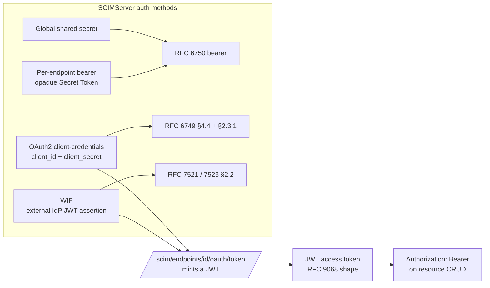
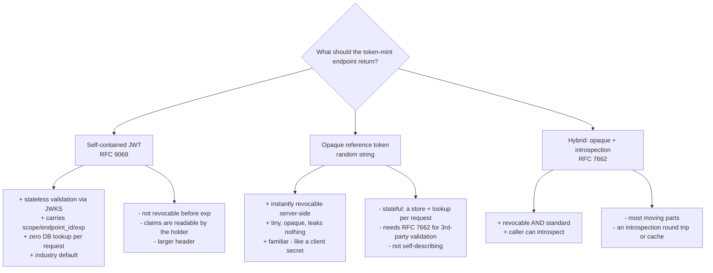

# SCIMServer authentication methods vs the standards, RFCs, and the wild (X10)

Status: research + analysis. This doc answers the operator's questions:

1. How do SCIMServer's auth methods compare, individually, to the methods used by
   ISVs, IdPs, the RFCs, and industry norms - especially OAuth2 client-credentials
   and the different WIF implementations/RFCs?
2. The token minted + returned by the WIF token-mint flow is a JWT, used as a
   `jwt-bearer` for the resource CRUD flow. Is that correct per the OAuth2 specs,
   the WIF specs, the different WIF implementations, RFC 7523, and RFC 8693?
3. What are the other options for the returned token?
4. What about returning a unique opaque secret string (like the OAuth2
   client-credentials client secret), or a JWT, based on an endpoint-level config?
5. Is the current OAuth2 client-credential client-secret approach per the
   standards, norms, best practices, and specs?
6. Informed, researched recommendations + options covering both RFCs and the
   variations in the wild (Google, Zoom, SAP, AWS, and others).

> TL;DR verdict: SCIMServer's four auth methods are each a faithful implementation
> of a mainstream, standards-defined pattern. The OAuth2 client-credentials +
> client-secret method is textbook RFC 6749. The WIF method (validate an external
> IdP JWT, then mint SCIMServer's own short-lived JWT the client uses as a Bearer)
> is exactly the shape Microsoft Entra's "federated credential" uses, and it is
> correct per RFC 7521/7523. Minting a **JWT** as the returned token is the right
> default (stateless, standard per RFC 9068, matches Entra/Okta/Zoom/SAP). The one
> genuinely useful enhancement is an **endpoint-level config to return an opaque,
> server-revocable reference token** (with RFC 7662 introspection) for customers
> who need instant revocation - offered ALONGSIDE the JWT default, not instead of
> it. See [section 8](#8-recommendations).

## 1. The RFC / standards landscape

| Spec | What it defines | Relevance to SCIMServer |
|---|---|---|
| [RFC 6749 §4.4](https://datatracker.ietf.org/doc/html/rfc6749#section-4.4) | OAuth 2.0 **client-credentials** grant (`grant_type=client_credentials`) | The per-endpoint OAuth2 client-credentials method |
| [RFC 6749 §2.3.1](https://datatracker.ietf.org/doc/html/rfc6749#section-2.3.1) | Client authentication: `client_secret_basic` (HTTP Basic) + `client_secret_post` | How the client secret is presented |
| [RFC 6750](https://datatracker.ietf.org/doc/html/rfc6750) | **Bearer token usage** (`Authorization: Bearer <token>`) | How every minted token is presented on resource CRUD |
| [RFC 7521](https://datatracker.ietf.org/doc/html/rfc7521) | Abstract **assertion framework** for client auth + authorization grants | Parent of the WIF assertion flow |
| [RFC 7523](https://datatracker.ietf.org/doc/html/rfc7523) | **JWT profile** for OAuth 2.0. Two distinct uses: (§2.1) authorization grant `grant_type=urn:ietf:params:oauth:grant-type:jwt-bearer`; (§2.2) client authentication `client_assertion_type=urn:ietf:params:oauth:client-assertion-type:jwt-bearer` | The WIF `jwt-bearer` profile SCIMServer ships today |
| [RFC 8693](https://datatracker.ietf.org/doc/html/rfc8693) | **OAuth 2.0 Token Exchange** (`grant_type=urn:ietf:params:oauth:grant-type:token-exchange`, `subject_token` + `subject_token_type`, response adds `issued_token_type`) | The WIF `token-exchange` profile SCIMServer is adding |
| [RFC 9068](https://datatracker.ietf.org/doc/html/rfc9068) | **JWT profile for OAuth 2.0 access tokens** (`typ: at+jwt`, canonical claims) | The shape of the JWT SCIMServer mints |
| [RFC 7662](https://datatracker.ietf.org/doc/html/rfc7662) | **Token introspection** (validate an opaque token server-side) | Needed IF an opaque-token option is added |
| [RFC 7009](https://datatracker.ietf.org/doc/html/rfc7009) | **Token revocation** | Needed for instant revoke of any token type |
| [RFC 8414](https://datatracker.ietf.org/doc/html/rfc8414) | Authorization-server **metadata** (`/.well-known/oauth-authorization-server`) | SCIMServer already publishes this per endpoint |
| [RFC 8705](https://datatracker.ietf.org/doc/html/rfc8705) | **mTLS** client auth + certificate-bound tokens | Higher-assurance option (see recommendations) |
| [RFC 9449](https://datatracker.ietf.org/doc/html/rfc9449) | **DPoP** - sender-constrained (proof-of-possession) tokens | Hardening option beyond bearer |
| [RFC 9700](https://datatracker.ietf.org/doc/html/rfc9700) | OAuth 2.0 **Security BCP** | The bar for "best practice" below |

Two things trip people up and are worth stating plainly:

- **RFC 7523 has two independent uses.** The SAME `jwt-bearer` URN family appears
  in two places: as a **client-authentication** method (`client_assertion` +
  `client_assertion_type=...:client-assertion-type:jwt-bearer`) and as an
  **authorization grant** (`assertion` + `grant_type=...:grant-type:jwt-bearer`).
  A "WIF" flow can be modeled as either; the distinction is which field carries
  the external JWT and what the AS returns.
- **"WIF" is not one spec.** "Workload Identity Federation" is a product name, not
  an RFC. Different vendors implement it on different RFCs (see
  [section 6](#6-how-the-providers-actually-do-it)).

## 2. SCIMServer's four auth methods, mapped to the standards

| SCIMServer method | Internal keyword | Standard it implements | Verdict |
|---|---|---|---|
| Global shared secret | `shared_secret` | A pre-shared bearer token ([RFC 6750](https://datatracker.ietf.org/doc/html/rfc6750)). Not an OAuth grant - a static API key. | Standard + common (every "API key" model). Fine as an operator/dev convenience; weakest of the four (static, no rotation ceremony, endpoint-wide). |
| Per-endpoint bearer | `endpoint_bearer` / `bearer` | An opaque, per-endpoint API key ([RFC 6750](https://datatracker.ietf.org/doc/html/rfc6750)); bcrypt-hashed at rest. | Standard "API key per integration" pattern (GitHub PATs, Stripe keys). Good: scoped, rotatable, hashed. |
| OAuth2 client-credentials | `oauth_client` | [RFC 6749 §4.4](https://datatracker.ietf.org/doc/html/rfc6749#section-4.4) client-credentials grant; secret presented via `client_secret_basic` or `client_secret_post` ([§2.3.1](https://datatracker.ietf.org/doc/html/rfc6749#section-2.3.1)). Mints a JWT. | Textbook. Matches Entra/Okta/Zoom/SAP daemon flows. |
| WIF | `wif` | [RFC 7521](https://datatracker.ietf.org/doc/html/rfc7521)/[RFC 7523](https://datatracker.ietf.org/doc/html/rfc7523) `jwt-bearer` today; [RFC 8693](https://datatracker.ietf.org/doc/html/rfc8693) `token-exchange` next. External IdP JWT validated against a per-endpoint trust; SCIMServer mints its own short-lived JWT. | Correct. Same shape as Entra federated credentials + Google WIF. See [section 4](#4-is-the-wif-minted-jwt-correct). |

Full internal detail for these lives in
[docs/auth/AUTHENTICATION_ARCHITECTURE.md](AUTHENTICATION_ARCHITECTURE.md) and
[docs/auth/WIF_JWT_BEARER_ASSERTION_FOR_SCIM.md](WIF_JWT_BEARER_ASSERTION_FOR_SCIM.md).

## 3. Is the OAuth2 client-secret approach standard? (Q5)

**Yes - it is the single most common machine-to-machine pattern, and SCIMServer's
implementation is above-average on the hygiene axes.**

What the standard requires and how SCIMServer scores:

| Best-practice axis (RFC 6749 + RFC 9700) | SCIMServer today | Grade |
|---|---|---|
| High-entropy secret | `client-secret-<uuidv4>` (122 bits) | Good (a UUIDv4 is a fine high-entropy secret; the readable prefix is not a weakness) |
| Presented over TLS only | Yes (Azure Container Apps terminates TLS) | Good |
| `client_secret_basic` + `client_secret_post` both accepted | Yes (verified by live-test `9z-AP`) | Good - matches RFC 6749 §2.3.1 |
| Secret hashed at rest (never stored plaintext) | bcrypt (cost 12) | Good (many products store reversible secrets; bcrypt is better) |
| Rotation without downtime | Rotate endpoint + optional retention | Good |
| Short-lived issued token, not the secret, used per request | Yes - the secret mints a short-lived JWT | Good |
| No refresh token in client-credentials | Correct (none issued) | Correct per RFC 6749 §4.4 |

**Where it could go further (optional, for higher-assurance tenants), per
[RFC 9700](https://datatracker.ietf.org/doc/html/rfc9700):** offer
`private_key_jwt` ([RFC 7523 §2.2](https://datatracker.ietf.org/doc/html/rfc7523#section-2.2))
and/or mTLS ([RFC 8705](https://datatracker.ietf.org/doc/html/rfc8705)) as
alternative client-authentication methods, so a client never transmits a bearer
secret at all. Entra, Okta, and Auth0 all offer `private_key_jwt`; it is the
recommended step up from a shared client secret.

## 4. Is the WIF minted JWT correct? (Q2)

**Yes.** Walk the flow against the specs:

1. The client obtains a JWT from its OWN IdP (e.g. Entra issues a token for a
   managed identity / app).
2. The client presents that JWT to SCIMServer's per-endpoint token endpoint. In
   the RFC 7523 `jwt-bearer` profile SCIMServer ships today, it arrives as the
   `client_assertion` with
   `client_assertion_type=urn:ietf:params:oauth:client-assertion-type:jwt-bearer`.
3. SCIMServer validates it against the per-endpoint trust (issuer, subject,
   audience, JWKS signature, tenant) - i.e. it verifies the assertion the way
   [RFC 7523 §3](https://datatracker.ietf.org/doc/html/rfc7523#section-3) says an
   AS must.
4. On success, SCIMServer mints **its own** short-lived, endpoint-scoped JWT and
   returns it as the `access_token` with `token_type: Bearer`.
5. The client uses that minted JWT as `Authorization: Bearer` on resource CRUD -
   exactly [RFC 6750](https://datatracker.ietf.org/doc/html/rfc6750).

This is the correct and expected pattern. Critically, the client does NOT reuse
the external IdP's JWT directly against the resource API - it exchanges it for a
token minted by the resource's own AS (SCIMServer). That indirection is the whole
point of federation and is what Entra's "federated credential", Google WIF, and
AWS `AssumeRoleWithWebIdentity` all do.

**The one subtlety worth being precise about.** Whether you model the inbound
external JWT as a *client-authentication* assertion (RFC 7523 §2.2, the field is
`client_assertion`) or as an *authorization-grant* assertion (RFC 7523 §2.1, the
field is `assertion` + `grant_type=...:grant-type:jwt-bearer`) OR as a
*token-exchange* subject token (RFC 8693, the field is `subject_token` and the
response gains `issued_token_type`) is a real, wire-visible design choice:

| Profile | Inbound field | `grant_type` | Response adds | Error family |
|---|---|---|---|---|
| RFC 7523 client-auth (SCIMServer today) | `client_assertion` | `client_credentials` | - | `invalid_client` |
| RFC 8693 token-exchange (SCIMServer next) | `subject_token` (+ `subject_token_type`) | `urn:ietf:params:oauth:grant-type:token-exchange` | `issued_token_type` | `invalid_request` / `invalid_target` |

SCIMServer's plan to support BOTH profiles (selectable via `assertionProfile`) is
the right call - it interoperates with Entra-style federated-credential clients
(7523) AND Google-style STS clients (8693). The minted token is a JWT in either
case, which is correct.

## 5. What are the options for the returned token? (Q3 + Q4)

Three viable token shapes, with the trade-offs that actually matter for a SCIM
provisioning target:

| Option | Revocable before expiry? | Per-request cost | Self-describing | Who uses it |
|---|---|---|---|---|
| **JWT** (today) | No (needs a denylist) | O(1), stateless (JWKS) | Yes | Entra, Okta, Auth0, Zoom, SAP BTP |
| **Opaque reference** | Yes (delete the row) | One store lookup | No (needs RFC 7662) | Google STS access tokens, GitHub tokens, legacy Slack |
| **Hybrid (opaque + introspection)** | Yes | Lookup or cached introspection | Via RFC 7662 | Large multi-service estates |

**On the operator's specific idea (Q4) - "return a unique secret string like the
client-credentials client secret, OR a JWT, based on an endpoint-level config":**
this is a sound and implementable idea. Recommendation:

- **Keep JWT as the default.** It is the industry norm for a minted access token,
  it is stateless (crucial at the p95 latencies this project cares about - see
  [docs/perf/DEV_LATENCY_REGRESSION_RCA.md](../perf/DEV_LATENCY_REGRESSION_RCA.md)),
  and it interoperates with every standards-based client.
- **Add an opt-in endpoint flag** (e.g. `IssuedTokenFormat: "jwt" | "opaque"`).
  When set to `opaque`, mint a high-entropy random token, store its hash + scope +
  expiry server-side, validate resource requests by lookup, and expose an RFC 7662
  `/introspect` + RFC 7009 `/revoke` endpoint. This gives customers who need
  **instant revocation** (compliance / offboarding) a first-class option without
  degrading the stateless default for everyone else.
- **Regardless of format, keep the TTL short** and add an optional JWT **denylist**
  (jti-based) so even the JWT path has a revocation story for the exceptional case.

Note the important nuance: the client secret and the minted token are NOT the same
layer. The client secret (or the WIF assertion) is a **long-lived credential** used
to *authenticate the mint request*; the returned token is a **short-lived
capability** used per resource call. "Return an opaque token" changes only the
second layer - it does not mean "hand the caller a second long-lived secret."

## 6. How the providers actually do it

| Provider | Client-cred authn | Federation ("WIF") mechanism | Returned token shape |
|---|---|---|---|
| **Microsoft Entra** | `client_secret` OR certificate (`private_key_jwt`) OR federated credential | External IdP JWT presented as `client_assertion` (RFC 7521/7523) - the "federated credential" | **JWT** access token, `token_type: Bearer` (confirmed in the [Entra client-credentials doc](https://learn.microsoft.com/en-us/entra/identity-platform/v2-oauth2-client-creds-grant-flow)) |
| **Google Cloud** | Service-account key (`private_key_jwt`) or client secret | **STS token exchange (RFC 8693)** - present an external OIDC/SAML/AWS token as `subject_token` to `sts.googleapis.com`, then optionally impersonate a service account | Federated **access token** (opaque Google token), then a short-lived SA OAuth2 access token |
| **AWS** | SigV4 signing (not bearer) | `AssumeRoleWithWebIdentity` - external OIDC JWT exchanged at STS | **Temporary credentials** (AccessKeyId + SecretAccessKey + SessionToken) used with **SigV4**, NOT a bearer JWT |
| **Zoom** | Server-to-Server OAuth (`client_credentials` + `account_id`) | - | **JWT** access token, `Authorization: Bearer` |
| **SAP BTP** | `client_credentials` (secret / mTLS / SAML bearer RFC 7522) | SAML/JWT bearer assertion flows | **JWT** access token, `Authorization: Bearer` |
| **Okta / Auth0** | `client_secret` OR `private_key_jwt` | RFC 8693 token exchange | **JWT** access token, `Authorization: Bearer` |
| **SCIMServer** | `client_secret` (basic + post) | External IdP JWT as `client_assertion` (RFC 7523); RFC 8693 `token-exchange` upcoming | **JWT** access token, `Authorization: Bearer` |

Reading of the table:

- SCIMServer sits squarely in the **Entra / Okta / Auth0 / Zoom / SAP** camp:
  client-credentials + a minted **JWT bearer**. That is the mainstream for an API
  that receives provisioning traffic.
- **Google** normalizes on RFC 8693 token-exchange (the profile SCIMServer is
  adding) - so SCIMServer's dual-profile plan is exactly what lets a Google-style
  client interoperate.
- **AWS is the outlier**: it does not use bearer tokens at all - it returns
  temporary credentials used to SigV4-sign requests. A SCIM provisioning target is
  a bearer-token API, so the Entra/Okta model (which SCIMServer follows) is the
  correct fit; AWS's model is not applicable to a SCIM `/Users` endpoint.

## 7. Where SCIMServer is strong / where to invest

Strong today:
- Four methods, each a clean implementation of a real standard.
- Per-endpoint isolation (each endpoint is its own tiny AS with its own
  `/.well-known/oauth-authorization-server`, RFC 8414).
- Secrets bcrypt-hashed; rotation + retention flags; WIF stores only public trust
  values (no secret exists for a WIF credential).
- The minted token is a short-lived, endpoint-scoped JWT (RFC 9068 shape) - correct
  and stateless.

Investment order (highest leverage first):
1. **Ship the RFC 8693 `token-exchange` profile** (already planned) - unlocks
   Google-STS-style clients and is the modern federation norm.
2. **Optional opaque-token format per endpoint** (Q4) + RFC 7662 introspection +
   RFC 7009 revocation - gives instant-revocation customers a first-class path.
3. **`private_key_jwt` (RFC 7523 §2.2) + mTLS (RFC 8705) client authentication** -
   the standards-blessed step up from a shared client secret (RFC 9700).
4. **JWT revocation denylist (jti)** + keep TTLs short - a revocation story for the
   default JWT path without going stateful for everyone.
5. **DPoP (RFC 9449)** sender-constrained tokens - future hardening beyond bearer.

## 8. Recommendations (direct answers)

- **Is the minted-JWT-as-jwt-bearer correct?** Yes - correct per RFC 7521/7523
  (validate the external assertion) + RFC 6750/9068 (mint + present a JWT bearer).
  It matches Entra federated credentials and the Okta/Auth0/Zoom/SAP norm.
- **Other options for the returned token?** Opaque reference token (revocable,
  stateful, needs RFC 7662) or a hybrid. JWT should stay the default.
- **Opaque-secret-vs-JWT by endpoint config?** Recommended as an OPT-IN
  (`IssuedTokenFormat`), JWT default, opaque for instant-revocation needs, with
  introspection + revocation endpoints when opaque is selected.
- **Is the client-secret approach standard?** Yes (RFC 6749 §4.4 + §2.3.1), and
  SCIMServer's hygiene (bcrypt-at-rest, rotation, both basic + post) is above
  average. Add `private_key_jwt` + mTLS for higher-assurance tenants.
- **Cover both RFCs + variations?** Ship RFC 7523 (today) AND RFC 8693 (planned) as
  selectable profiles; that single pair covers Entra, Okta, Auth0, Google, SAP, and
  Zoom. AWS's SigV4 model is intentionally out of scope for a bearer-token SCIM API.

## 9. References

- OAuth 2.0: [RFC 6749](https://datatracker.ietf.org/doc/html/rfc6749), [RFC 6750](https://datatracker.ietf.org/doc/html/rfc6750)
- Assertions / JWT profile: [RFC 7521](https://datatracker.ietf.org/doc/html/rfc7521), [RFC 7523](https://datatracker.ietf.org/doc/html/rfc7523)
- Token exchange: [RFC 8693](https://datatracker.ietf.org/doc/html/rfc8693)
- JWT access tokens: [RFC 9068](https://datatracker.ietf.org/doc/html/rfc9068)
- Introspection / revocation: [RFC 7662](https://datatracker.ietf.org/doc/html/rfc7662), [RFC 7009](https://datatracker.ietf.org/doc/html/rfc7009)
- AS metadata / mTLS / DPoP: [RFC 8414](https://datatracker.ietf.org/doc/html/rfc8414), [RFC 8705](https://datatracker.ietf.org/doc/html/rfc8705), [RFC 9449](https://datatracker.ietf.org/doc/html/rfc9449)
- Security BCP: [RFC 9700](https://datatracker.ietf.org/doc/html/rfc9700)
- Microsoft Entra client-credentials (3 cases: secret / certificate / federated credential): https://learn.microsoft.com/en-us/entra/identity-platform/v2-oauth2-client-creds-grant-flow
- Microsoft Entra Workload Identity Federation: https://learn.microsoft.com/en-us/entra/workload-id/workload-identity-federation
- Google Cloud Workload Identity Federation (RFC 8693 STS): https://cloud.google.com/iam/docs/workload-identity-federation
- AWS STS AssumeRoleWithWebIdentity: https://docs.aws.amazon.com/STS/latest/APIReference/API_AssumeRoleWithWebIdentity.html
- SCIMServer internals: [AUTHENTICATION_ARCHITECTURE.md](AUTHENTICATION_ARCHITECTURE.md), [WIF_JWT_BEARER_ASSERTION_FOR_SCIM.md](WIF_JWT_BEARER_ASSERTION_FOR_SCIM.md), [CONNECTION_INFO_AND_ENTRA_SETUP.md](CONNECTION_INFO_AND_ENTRA_SETUP.md)
