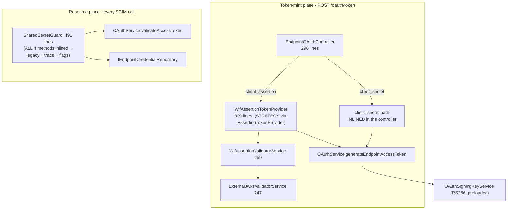
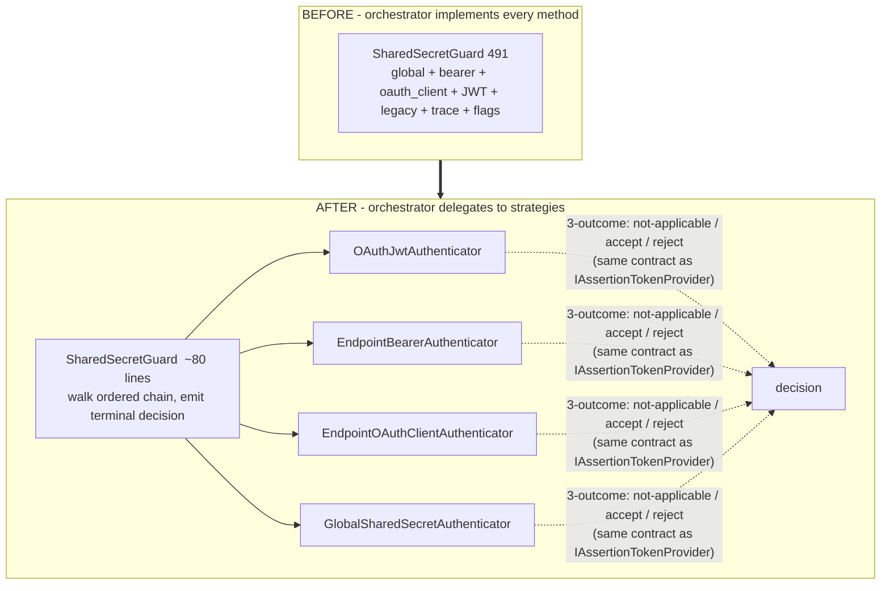
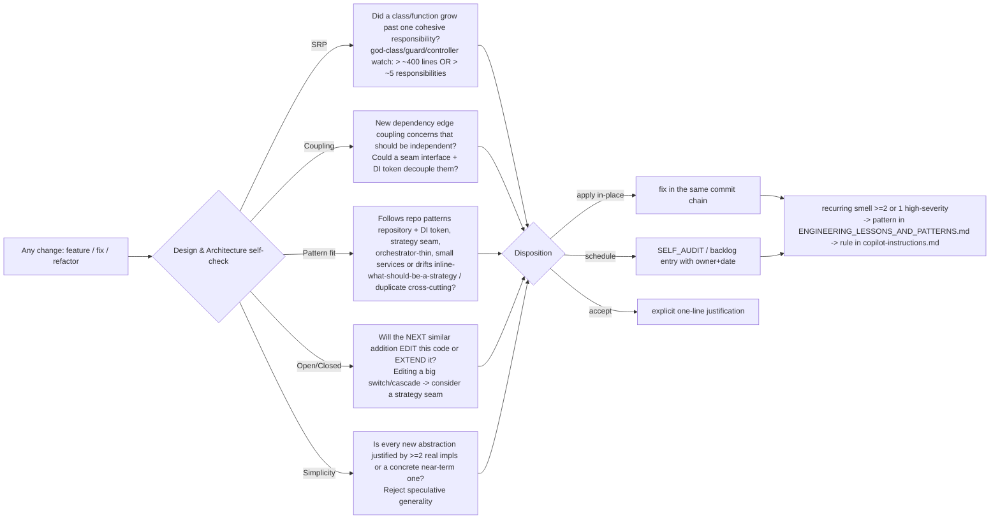

# Auth source refactoring analysis (X12) - coupling, decoupling, and the design/architecture gate

Status: ANALYSIS + STANDING GATE (source at `feat/wif`, api v0.54.60). Companion to
the X10 auth-methods comparison ([AUTH_METHODS_STANDARDS_COMPARISON.md](AUTH_METHODS_STANDARDS_COMPARISON.md)),
the X11 token-mint latency analysis ([../perf/WIF_TOKEN_MINT_LATENCY_ANALYSIS.md](../perf/WIF_TOKEN_MINT_LATENCY_ANALYSIS.md)),
and the SyncFabric WIF architecture guide ([SCIMSERVER_SYNCFABRIC_WIF_ARCHITECTURE_AND_IMPLEMENTATION_GUIDE (1).md](SCIMSERVER_SYNCFABRIC_WIF_ARCHITECTURE_AND_IMPLEMENTATION_GUIDE%20(1).md)).
The refactor is sequenced for delivery in [AUTH_CONSOLIDATED_DELIVERY_PLAN.md](AUTH_CONSOLIDATED_DELIVERY_PLAN.md) (X13, Wave 2).

## 0. Verdict (TL;DR)

The auth code is **mostly well-factored** - it already uses the repository pattern
(with DI tokens), a strategy-via-seam for WIF token minting, a guard, module
boundaries, and a set of small single-purpose services. It does **not** need a
ground-up rewrite, and it must **not** grow a generic auth-policy DSL.

There is exactly **one** high-leverage, pattern-consistent refactor worth doing:

> **Make the resource plane use a per-method `Authenticator` strategy chain -
> exactly like the token-mint plane already uses `IAssertionTokenProvider` for
> WIF - and pull the four inlined auth methods out of the 491-line
> `SharedSecretGuard`. Do the symmetric extraction on the mint side (the inlined
> `client_secret` path). The guard and the controller then become thin
> orchestrators; each auth method becomes one strategy that owns its lookup,
> validation, enablement gate, and trace.**

Everything else (splitting `OAuthService`, abstracting the repository further,
touching the small services) is either already fine or would be over-engineering.

The decoupling seam is **by auth method**, because that is where the genuine
independence lives (each method has its own credential lookup, validation
mechanism, and per-endpoint enablement flag). This analysis also introduces a
standing **Design & Architecture Self-Improvement Gate** (Section 7) so this class
of drift (a thin orchestrator silently accreting method logic) is caught on every
future change, not re-discovered.

## 1. Current structure (what is actually there)

Auth splits into two planes with clean-ish boundaries but uneven internal
factoring.



### 1.1 File inventory + sizes

| File | Lines | Role | Factoring |
|---|---:|---|---|
| [shared-secret.guard.ts](../../api/src/modules/auth/shared-secret.guard.ts) | **491** | Resource-plane auth for all methods | **God-guard** (see 2.1) |
| [wif-assertion-token.provider.ts](../../api/src/modules/scim/controllers/wif-assertion-token.provider.ts) | 329 | WIF mint orchestration | Good (strategy) |
| [endpoint-oauth.controller.ts](../../api/src/modules/scim/controllers/endpoint-oauth.controller.ts) | 296 | Mint route | Mixed (WIF delegated, `client_secret` inlined) |
| [wif-discovery-resolver.service.ts](../../api/src/oauth/wif-discovery-resolver.service.ts) | 284 | OIDC discovery for trust setup | Good |
| [wif-assertion-validator.service.ts](../../api/src/oauth/wif-assertion-validator.service.ts) | 259 | Claim checks (iss/sub/aud/tid/roles) | Good |
| [external-jwks-validator.service.ts](../../api/src/oauth/external-jwks-validator.service.ts) | 247 | JWKS fetch/cache/verify | Good (reusable core) |
| [oauth.service.ts](../../api/src/oauth/oauth.service.ts) | 236 | Issue + validate the server's JWT | Cohesive but dual-role (see 2.4) |
| [oauth-signing-key.service.ts](../../api/src/oauth/oauth-signing-key.service.ts) | 88 | Signing identity | Good |
| [egress-policy.ts](../../api/src/oauth/egress-policy.ts), [jwks-host-allowlist.service.ts](../../api/src/oauth/jwks-host-allowlist.service.ts), [client-credential-location.ts](../../api/src/oauth/client-credential-location.ts), [jwt-decode.util.ts](../../api/src/oauth/jwt-decode.util.ts) | small | single-purpose utilities | Good - leave alone |

### 1.2 Patterns already established (reuse these, do not invent)

| Pattern | Where | Reuse for the refactor |
|---|---|---|
| **Repository + DI token** | `IEndpointCredentialRepository` + `ENDPOINT_CREDENTIAL_REPOSITORY` (Prisma + in-memory impls) | Each authenticator takes the repo the same way |
| **Strategy via seam** | [IAssertionTokenProvider](../../api/src/modules/scim/controllers/assertion-token-provider.ts) + `ASSERTION_TOKEN_PROVIDER`, three-outcome contract | The exact template for the resource-plane `Authenticator` seam |
| **Guard as gate** | `SharedSecretGuard implements CanActivate` | Keep the guard; make it thin |
| **Small single-purpose services** | egress-policy, jwks-host-allowlist, signing-key | The bar to hold the new strategies to |
| **Module boundaries + `@Optional() @Inject`** | [oauth.module.ts](../../api/src/oauth/oauth.module.ts), [auth.module.ts](../../api/src/modules/auth/auth.module.ts) | Register the chain as a multi-provider |

## 2. Coupling / SRP findings (ranked)

| # | Finding | Severity | Evidence |
|---|---|---|---|
| 1 | **`SharedSecretGuard` is a god-guard** | High | 491 lines; [tryEndpointCredential](../../api/src/modules/auth/shared-secret.guard.ts#L386) alone inlines enablement gating + JWT-skip + global-secret-skip + credential load + bcrypt loop + per-type gating + trace notes |
| 2 | **Token-mint asymmetry** | High | WIF is a strategy; [client_secret is inlined](../../api/src/modules/scim/controllers/endpoint-oauth.controller.ts#L189) (repo lookup + `bcrypt.compare` + trace + `emitOauthClientDecision` + issuance) in the controller |
| 3 | **Decision-trace emission duplicated 3x** | Medium | `emitAuthDecisionEvent(...) + decisionStore.record(...)` hand-rolled in the controller (`emitOauthClientDecision`), the WIF provider (`recordAndEmit`), and the guard inline |
| 4 | **`OAuthService` mixes issuer + verifier** | Low | Factory (`generateAccessToken`, `generateEndpointAccessToken`) AND verifier (`validateAccessToken`, `hasScope`) in one 236-line service |
| 5 | **Provider placement smell** | Low | `WifAssertionTokenProvider` is a no-HTTP domain service living under `.../scim/controllers/` |

### 2.1 Why #1 is the one that matters

A guard's single responsibility is "orchestrate authenticators and decide
allow/deny." `SharedSecretGuard` instead *implements* every authenticator - global
shared secret, per-endpoint bearer, per-endpoint oauth_client, OAuth JWT - plus the
legacy acceptor, decision-trace accumulation, and per-endpoint config-flag gating.
The blast radius is concrete: your own SyncFabric roadmap adds **RFC 8693**,
**`private_key_jwt`**, and **mTLS**. Each of those, today, means editing this
491-line file (and the 296-line controller) again. That is an Open/Closed
violation with a known, scheduled cost.

## 3. Recommended refactor - a method-strategy chain on both planes



### 3.1 The seam (mirror the one you already have)

```typescript
// Resource-plane sibling of IAssertionTokenProvider - same three-outcome shape.
export const RESOURCE_AUTHENTICATOR = Symbol('RESOURCE_AUTHENTICATOR');

export type AuthAttempt =
  | { outcome: 'not-applicable' }                      // not my token shape / method disabled -> next
  | { outcome: 'accept'; authType: string; credentialId?: string; trace: AuthCheck[] }
  | { outcome: 'reject'; reasonCode: string; trace: AuthCheck[] };  // mine-but-invalid -> stop

export interface ResourceAuthenticator {
  readonly order: number;                              // chain priority
  isEnabled(endpointId: string | null): Promise<boolean>;   // owns its per-endpoint flag
  tryAuthenticate(ctx: AuthContext): Promise<AuthAttempt>;
}
```

- The guard resolves config once, then walks the chain by `order`; the first
  `accept` wins, the first `reject` stops, `not-applicable` continues.
- Each strategy owns **its own** credential lookup, validation, enablement
  predicate (`getEffectiveAuthEnablement` moves next to the method it gates), and
  trace. The `looksLikeJwt` short-circuit (the X9 perf fix) becomes the
  `not-applicable` branch of the opaque-secret authenticators - preserved, just
  relocated.
- Register as a NestJS multi-provider so adding a method is "add a class + add it
  to the array," never "edit the guard."

### 3.2 Symmetric mint-side extraction

Extract the inlined `client_secret` path into a `ClientSecretTokenProvider` that
implements the sibling of `IAssertionTokenProvider`. The controller then only:
routes (`grant_type` + assertion-vs-secret), delegates, and shapes the HTTP
response. Both planes end up with the same shape: **orchestrator + per-method
strategies**.

### 3.3 Decoupling matrix (what moves where)

| Concern today (inlined) | Moves to | Coupling removed |
|---|---|---|
| Global-secret compare (guard) | `GlobalSharedSecretAuthenticator` | Guard no longer knows the secret mechanism |
| Bearer + oauth_client bcrypt loop (guard) | `EndpointBearer` / `EndpointOAuthClient` authenticators | Guard no longer knows bcrypt or the repo |
| OAuth JWT validation (guard) | `OAuthJwtAuthenticator` (wraps `OAuthService.validateAccessToken`) | Guard no longer knows JWKS/JWT |
| Per-endpoint enablement flags (guard) | each strategy's `isEnabled()` | Enablement policy sits with its method |
| `client_secret` mint (controller) | `ClientSecretTokenProvider` | Controller no longer does service work |
| `emit + record` decision (3 sites) | one `AuthDecisionEmitter` | Cross-cutting concern centralized |

## 4. What NOT to do (simplicity / YAGNI guardrails)

These are deliberate non-goals - decoupling has a cost and these do not clear it:

- **No generic auth-policy DSL / plugin framework.** The SyncFabric guide already
  rejects this until >=2 profiles prove finite typed rules insufficient. Finite
  discriminated strategies are the ceiling.
- **Do not split `OAuthService`** issuer/verifier yet. It is cohesive around "the
  server's own JWT" and only 236 lines. Revisit only if opaque-token issuance
  (a real roadmap item) makes validation evolve independently.
- **Do not abstract the repository further** - it already has the two
  implementations (Prisma + in-memory) that justify the interface.
- **Do not touch the small single-purpose services.** They are already at the SRP
  bar the new strategies must meet.
- **Do not over-split the strategies.** Four methods -> four authenticators, not
  four authenticators x three micro-collaborators each.

## 5. Phasing (backward-compatible, TDD, one commit each)

Each phase is internal and behavior-preserving; the existing guard/controller
unit + E2E + live gates are the regression net (Stage 2 + Stage 4 in the standing
gates).

| Phase | Change | Regression net |
|---|---|---|
| 1 | Extract the 4 resource methods into `ResourceAuthenticator` strategies; guard delegates | `shared-secret.guard.spec.ts` + live-test `9z-*` |
| 2 | Extract the mint `client_secret` path into `ClientSecretTokenProvider`; controller delegates | `endpoint-oauth.controller.spec.ts` + E2E |
| 3 | Centralize `AuthDecisionEmitter`; relocate mint providers to `oauth/token-mint/` | auth-decision unit specs |

Each phase MUST be RED-first per Stage 0 TDD, cross-backend-parity-checked
(Stage 2.5), and run the Design & Architecture gate below (Section 7) at the end.

## 6. Decision log

| ID | Decision | Alternatives rejected | Why |
|---|---|---|---|
| D1 | Decouple by **auth method** (strategy per method) | Decouple by plane only; keep inline | Method is where independence is real (lookup + validation + flag differ per method) |
| D2 | Reuse the existing `IAssertionTokenProvider` 3-outcome seam shape | Invent a new contract | Consistency; the pattern already works on the mint side |
| D3 | Keep the guard/controller as orchestrators | Move orchestration into a service | Guard is the right NestJS seam for allow/deny; controller is the right HTTP seam |
| D4 | Do NOT split `OAuthService` now | Split issuer/verifier | Cohesive + small; splitting is speculative |
| D5 | Do NOT build a policy DSL | Generic rules engine | YAGNI; finite strategies suffice for the roadmap |

## 7. Design & Architecture Self-Improvement Gate (STANDING - added 2026-07-23)

This change also establishes a standing gate so the drift it fixes (a thin
orchestrator silently accreting per-method logic) is caught on **every** future
change, not re-discovered. It is the design/architecture sibling of the R7
self-improvement step and complements the Stage 3c.1 `codeReviewSelfAudit` prompt
by making the check a mandatory per-change step with an explicit disposition.



### 7.1 The gate (what to run at the end of every change)

1. **SRP** - did this change grow a class/function past a single cohesive
   responsibility? Flag any auth/guard/controller/service crossing ~400 lines or
   ~5 responsibilities as a god-class candidate.
2. **Coupling** - did it add a dependency edge coupling two concerns that should be
   independent? Could an interface + DI token seam decouple them (as the repository
   and `IAssertionTokenProvider` seams already do)?
3. **Pattern consistency** - does it follow the repo's established patterns, or
   does it drift (inline something that should be a strategy, duplicate a
   cross-cutting concern like decision-trace emission)?
4. **Open/Closed** - will the next similar addition require EDITING this code or
   EXTENDING it? A growing `switch`/`if` cascade over a type is the signal to
   introduce a strategy seam.
5. **Simplicity counter-check (YAGNI)** - is every proposed abstraction justified by
   at least two real implementations or one concrete near-term one? Reject
   speculative generality; a seam with one impl and no second on the horizon is
   over-engineering.
6. **Disposition (mandatory)** - record the outcome as exactly one of: **applied**
   in-place (same commit chain), **scheduled** (a `docs/strategy/SELF_AUDIT_*.md`
   or backlog entry with owner + date), or **accepted** (one-line justification).
   Refusing the step because "the change is small" is not allowed - small changes
   are exactly where orchestrators quietly grow.
7. **Promote** - a design smell that recurs (>= 2 sightings) or is high-severity
   (an SRP/coupling defect that would compound) is promoted from a note here to a
   pattern in [../strategy/ENGINEERING_LESSONS_AND_PATTERNS.md](../strategy/ENGINEERING_LESSONS_AND_PATTERNS.md)
   and, when it earns enforcement, to a hard rule in
   [.github/copilot-instructions.md](../../.github/copilot-instructions.md).

### 7.2 This change, run through its own gate

| Check | Finding | Disposition |
|---|---|---|
| SRP | `SharedSecretGuard` at 491 lines / ~7 responsibilities is a god-guard | **Scheduled** (Phase 1 above) |
| Coupling | Guard is coupled to bcrypt, the repo, JWKS, and every method's flags | **Scheduled** (strategy seam decouples) |
| Pattern fit | Mint plane has the strategy seam; resource plane + `client_secret` mint drifted inline | **Scheduled** (Phases 1-2 restore symmetry) |
| Open/Closed | 3 roadmap methods (RFC 8693, private_key_jwt, mTLS) would each edit the guard | **Scheduled** (chain makes them additive) |
| Simplicity | Verified the seam is justified (4 impls today, 3 more scheduled) and rejected the DSL/`OAuthService`-split | **Applied** (non-goals recorded in Section 4) |
| Promote | God-orchestrator drift is a generalizable pattern | **Applied** (pattern added to ENGINEERING_LESSONS_AND_PATTERNS.md; rule added to copilot-instructions.md) |

## 8. References

- Auth methods vs standards (X10): [AUTH_METHODS_STANDARDS_COMPARISON.md](AUTH_METHODS_STANDARDS_COMPARISON.md)
- Token-mint latency (X11): [../perf/WIF_TOKEN_MINT_LATENCY_ANALYSIS.md](../perf/WIF_TOKEN_MINT_LATENCY_ANALYSIS.md)
- SyncFabric WIF architecture guide (persona/profile model, roadmap methods): [SCIMSERVER_SYNCFABRIC_WIF_ARCHITECTURE_AND_IMPLEMENTATION_GUIDE (1).md](SCIMSERVER_SYNCFABRIC_WIF_ARCHITECTURE_AND_IMPLEMENTATION_GUIDE%20(1).md)
- Central pattern ledger: [../strategy/ENGINEERING_LESSONS_AND_PATTERNS.md](../strategy/ENGINEERING_LESSONS_AND_PATTERNS.md)
- Seam template: [assertion-token-provider.ts](../../api/src/modules/scim/controllers/assertion-token-provider.ts)
- The god-guard: [shared-secret.guard.ts](../../api/src/modules/auth/shared-secret.guard.ts)

## 9. Change log

| Version | Change |
|---|---|
| 0.54.60 | This analysis doc (X12): current auth structure map + patterns already used; 5 ranked coupling/SRP findings (god-guard #1, mint asymmetry #2); recommended refactor = a resource-plane `ResourceAuthenticator` strategy chain mirroring the existing `IAssertionTokenProvider` seam + symmetric `client_secret` mint extraction + centralized decision emitter; decoupling by auth method; explicit YAGNI non-goals (no DSL, no `OAuthService` split); 3-phase backward-compatible TDD plan; and a new STANDING **Design & Architecture Self-Improvement Gate** (Section 7) added to [.github/copilot-instructions.md](../../.github/copilot-instructions.md) + a pattern in [../strategy/ENGINEERING_LESSONS_AND_PATTERNS.md](../strategy/ENGINEERING_LESSONS_AND_PATTERNS.md). Analysis + gate only - no runtime change. |
