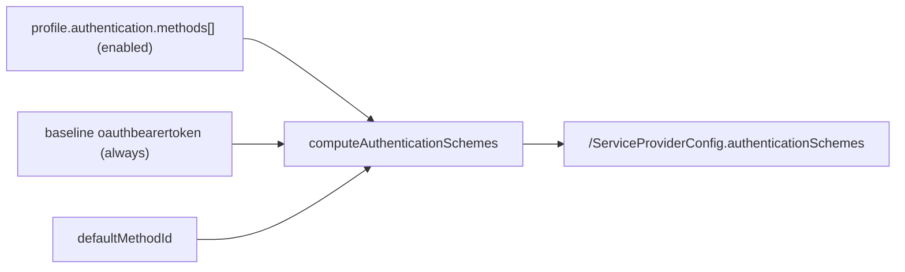

# Computed authenticationSchemes Discovery (A2)

> Step **A2** of the authentication build ([AUTHENTICATION_ARCHITECTURE.md section 13](AUTHENTICATION_ARCHITECTURE.md#13-step-by-step-execution-plan--estimates--dependencies), tracked in [EXECUTION_LEDGER.md](EXECUTION_LEDGER.md)). Makes the per-endpoint `/ServiceProviderConfig` advertise `authenticationSchemes` computed from the endpoint's enabled methods. The JWKS publication (Pre-Q.B) and RFC 8414 metadata (Q0) - the other two A2 deliverables - shipped earlier.

## What changed

The per-endpoint `/ServiceProviderConfig` previously always advertised the single baseline `oauthbearertoken` scheme. A2 makes it **computed** from the endpoint's `profile.authentication.methods[]` (the A0 model, managed via the A1 CRUD): each enabled method contributes its own `authenticationScheme`, mapped from the method `type` to the RFC 7643 section 5 scheme vocabulary, with `primary:true` on the scheme of the method named by `defaultMethodId`.

## Rules

- The baseline `oauthbearertoken` scheme is **always** advertised (the legacy / bearer / OAuth-JWT acceptor chain always works).
- Each **enabled** method (`enabled !== false`) adds a scheme; a method with `enabled:false` is not advertised.
- A method-less endpoint advertises **only the baseline**.
- `primary:true` lands on the `defaultMethodId` method's scheme; with no `defaultMethodId`, the baseline stays primary. Exactly one scheme is ever primary.
- The baseline constant is never mutated (it is cloned).

## Method-type to scheme-type mapping (RFC 7643 section 5)

| Method `type` | scheme `type` |
|---|---|
| `shared-secret`, `bearer` | `oauthbearertoken` |
| `oauth-client`, `external-jwt`, `wif-7523`, `wif-8693`, `oauth-authcode`, `mtls`, `dpop` | `oauth2` |
| `httpbasic` | `httpbasic` |

Each scheme carries the method's `displayName` (-> `name`), `description`, and `specUri` when present.

## Components

| File | Role |
|---|---|
| [authentication-schemes.ts](../../api/src/modules/scim/discovery/authentication-schemes.ts) | `computeAuthenticationSchemes(baseline, authentication)` - the pure helper. |
| [scim-discovery.service.ts](../../api/src/modules/scim/discovery/scim-discovery.service.ts) | `getSpcFromProfile` now computes the schemes from `profile.authentication`. |

## Test coverage

| Layer | Test | Covers |
|---|---|---|
| Unit | [authentication-schemes.spec.ts](../../api/src/modules/scim/discovery/authentication-schemes.spec.ts) | baseline-only (no block / no enabled), disabled-method skip, baseline+N, primary-on-default, baseline-primary-fallback, no-mutation, httpbasic mapping |
| E2E | [computed-authentication-schemes.e2e-spec.ts](../../api/test/e2e/computed-authentication-schemes.e2e-spec.ts) | method-less baseline; enabled method adds scheme; exactly one primary; defaultMethodId moves primary |
| Live | `scripts/live-test.ps1` section **9z-AR** | the full sequence across all 3 form factors |

The JWKS publication and RFC 8414 metadata that A2 also names are covered by [ASYMMETRIC_SIGNING_AND_JWKS.md](ASYMMETRIC_SIGNING_AND_JWKS.md) (Pre-Q.B) and [OAUTH_DISCOVERY_AND_BEARER_ERRORS.md](OAUTH_DISCOVERY_AND_BEARER_ERRORS.md) (Q0).
