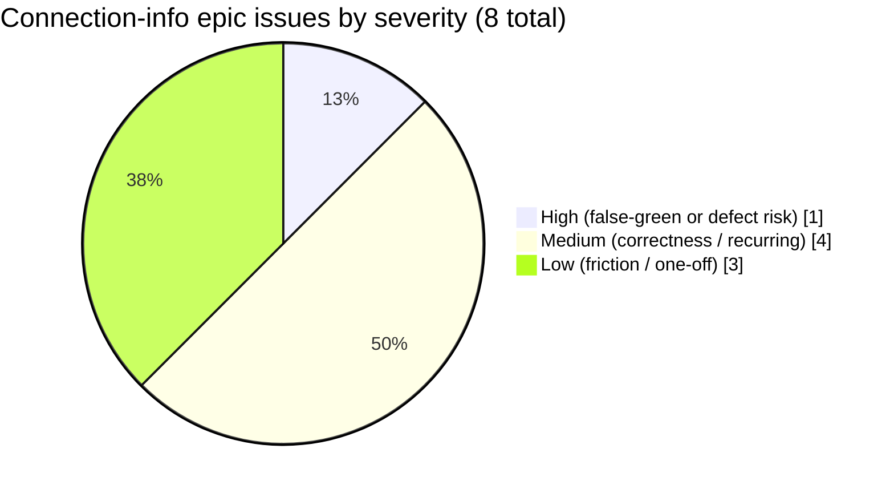
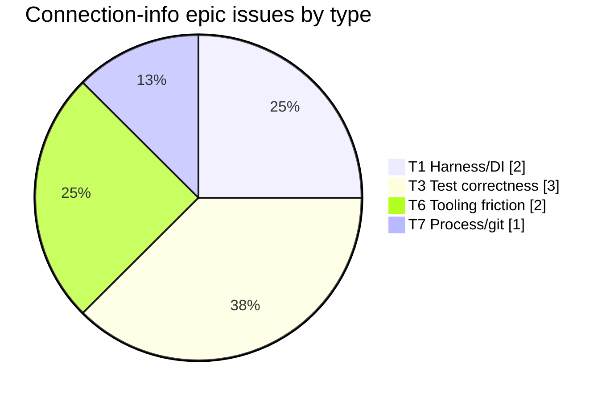

# Connection-info + auth-ergonomics epic - execution issues, RCA, and fixes

> **What this is.** The introspective issue ledger for the 17-work-item connection-info / secret-visibility / auth-method-hygiene / multi-IdP epic ([CONNECTION_INFO_AND_ENTRA_SETUP.md section 11A](CONNECTION_INFO_AND_ENTRA_SETUP.md#11a-work-items-delivery-backlog)). It records EVERY issue of EVERY type hit while executing WI-1..WI-17, each with **symptom**, **root-cause analysis**, **fix**, **why the fix works**, and **prevention**. Companion to the [EXECUTION_LEDGER.md](CONNECTION_INFO_EXECUTION_LEDGER.md) (what shipped) - this doc is what went wrong on the way and what was learned.
>
> **Why it exists.** None of these appear in the design doc, because they arise from unforeseen combinations - shared-type ripple across test fixtures, DI constructor-arity drift in hand-instantiated specs, an em-dash scan that omitted `.prisma`. Capturing them is how the gate set self-densifies (the [R7 self-improvement discipline](../../.github/copilot-instructions.md)).
>
> **Provenance / completeness.** Reconciled against the full session transcript by an error-signal frequency scan (`error TS`, `An argument for`, `not assignable`, `EM-DASH`, `Could not find matching text`) plus in-context capture-at-fix-time (discipline D1). The dominant new-issue signals were `An argument for` (2 - the DI-constructor-arg class) and `not assignable` (15 - the shared-shape-ripple class); the high `404`/`shadow` counts are legitimate test assertions + the standing no-route-shadowing checks, not new failures. Every diagnosed problem maps to an entry below.

---

## 1. Methodology

Each issue is tagged with a **type** (same taxonomy as the prior [auth-build RCA](EXECUTION_ISSUES_AND_RCA.md#11-type-taxonomy)), a **severity**, the **WI** it surfaced in, and the **detection stage** vs the earliest-possible stage.

### 1.1 Severity distribution

### 1.2 Type distribution

---

## 2. Issue dashboard

| # | WI | Type | Severity | One-line symptom | Detected at | Earliest possible |
|---|---|---|---|---|---|---|
| I-1 | WI-12 | T7 Process/git | High | scim.module edit replaced a controller in the array -> `/Users` 404 | Stage 2 API E2E | Stage 1 (review of the array diff) |
| I-2 | WI-3 | T3 Test correctness | Medium | Adding `connectionInfo` to `EndpointOverviewResponse` broke every literal test fixture | Stage 1 tsc/jest build | Stage 1 (same) |
| I-3 | WI-7 | T3 Test correctness | Medium | Adding `secretEnvelope` to `EndpointCredentialModel` broke 2 spec literals | Stage 2 jest build | Stage 1 tsc |
| I-4 | WI-7 | T1 Harness/DI | Medium | Adding 2 constructor deps broke the hand-instantiated controller spec | Stage 2 jest build | Stage 1 tsc |
| I-5 | WI-15/WI-7 | T3 Test correctness | Medium | `schema.prisma` carried em-dashes the earlier scans never checked | Stage 6 em-dash gate | Stage 1 (if `.prisma` were in scope) |
| I-6 | WI-8 | T3 Test correctness | Low | Playwright testids in the spec did not match the shipped component | Stage 5 spec authoring | Stage 5 (same) |
| I-7 | WI-15 | T6 Tooling friction | Low | New SettingsPage inline styles tripped the no-inline-style lint | Stage 1 get_errors | Stage 1 (same) |
| I-8 | multiple | T6 Tooling friction | Low | `replace_string_in_file` failed when old==new prefix / whitespace drift | authoring | authoring |

---

## 3. Detailed entries

### I-1 - Controller array replace-not-insert dropped `/Users` (WI-12)

- **Type:** T7 Process/git. **Severity:** High (a real 404 defect on a core route).
- **Symptom.** After registering the new `EndpointOAuthMetadataController` in `scim.module.ts`, the per-endpoint `/Users` route began returning 404.
- **RCA.** The edit REPLACED an existing entry in the `controllers: [...]` array instead of inserting alongside it, silently removing `EndpointScimUsersController` from the module. The generic wildcard controller then had nothing to defer to for `/Users`.
- **Fix.** Restored the dropped controller and ordered the metadata controller BEFORE the generic wildcard so its 2-segment `.well-known` route wins. (Commit in the WI-12 chain.)
- **Why it works.** NestJS matches controllers in registration order; the specific route registered before the wildcard resolves first, and no prior controller is lost.
- **Prevention (applied).** Standing rule in memory + repeated every subsequent module edit: **when adding to a `controllers[]`/`providers[]` array, INSERT - never replace - and verify all prior entries remain** (grep the array + count). This rule then prevented a recurrence in WI-15 (an accidental drop of `AdminAuthenticationMethodController` was caught immediately) and was applied deliberately in WI-2 and WI-8.
- **Escape delta.** Caught at Stage 2 by a pre-existing E2E ("the minted token authorizes the endpoint SCIM routes"), one stage later than a careful Stage-1 diff review would have. The pre-existing E2E is exactly the safety net that made the escape cheap.

### I-2 - `connectionInfo` field rippled through every overview fixture (WI-3)

- **Type:** T3 Test correctness. **Severity:** Medium.
- **Symptom.** Adding the required `connectionInfo` key to the shared `EndpointOverviewResponse` type broke compilation of every literal that constructs that shape: `web/src/api/mutations.test.ts` (5 literals), `web/src/test/msw/fixtures.ts`, and the API dashboard spec.
- **RCA.** A shared response contract consumed by many hand-written test literals has a "ripple radius" equal to the number of literals; adding a required field breaks all of them at once. This is inherent to literal fixtures (vs a builder).
- **Fix.** Added a single shared `FIXTURE_CONNECTION_INFO` + `SEED_CONNECTION_INFO` and populated every literal from it; updated the API dashboard key-allowlist to include the one new documented key.
- **Why it works.** A shared fixture constant makes the next field-add a one-place change; the key-allowlist test still locks the public shape.
- **Prevention.** Pattern **PA (shared-shape ripple)**: when adding a required field to a `@scim/types` shared response, grep for every literal of that type and update from a shared fixture in the SAME change; the tsc + jest build is the gate (it caught this immediately).

### I-3 - `secretEnvelope` field broke credential-model literals (WI-7)

- **Type:** T3 Test correctness. **Severity:** Medium (recurrence of PA).
- **Symptom.** Adding `secretEnvelope: string | null` to `EndpointCredentialModel` broke two spec literals (`connection-info.service.spec.ts` helper, `wif-assertion-token.provider.spec.ts`).
- **RCA.** Same shared-shape ripple as I-2, on the credential model.
- **Fix.** Added `secretEnvelope: null` to the literal builders.
- **Why it works / Prevention.** Same as I-2 (PA). The recurrence (2 escapes now) confirms PA is worth keeping as an explicit pre-add checklist item, not just a reaction.

### I-4 - Constructor-arity drift in a hand-instantiated controller spec (WI-7)

- **Type:** T1 Harness/DI. **Severity:** Medium (recurrence of the WI-14 `An argument for` issue).
- **Symptom.** Adding `CredentialEncryptionService` + `CredentialSecurityService` to `AdminCredentialController`'s constructor broke `admin-credential.controller.spec.ts`, which does `new AdminCredentialController(...)` positionally (`error TS2554: An argument for '...' was not provided`).
- **RCA.** A spec that hand-instantiates a class (rather than using the Nest testing module) hard-codes the constructor arity; every new dep is a breaking change to that spec.
- **Fix.** Added the two mock args (benign defaults: `isReady()=>false`, `getEffectiveVisibility()=>'always'`).
- **Why it works.** The mocks satisfy the arity and default to "retention off", so existing assertions are unaffected.
- **Prevention.** Pattern **PB (constructor-arity)**: after adding a constructor dependency to any controller/service, grep its spec for `new <Class>(` and update the positional args in the same change. Consider `Test.createTestingModule` for new specs so arity drift is absorbed by the DI container. (This is the second escape of this class - WI-14's resolver 5th-arg was the first - so PB is now a standing pre-commit check.)

### I-5 - `schema.prisma` em-dashes escaped every earlier scan (WI-15/WI-7)

- **Type:** T3 Test correctness (of the gate itself). **Severity:** Medium.
- **Symptom.** The em-dash gate flagged `schema.prisma` only when a WI-7 scan happened to include it; it held pre-existing em-dashes in Phase 2/3/11 comments plus a WI-15 comment line.
- **RCA.** The earlier per-WI em-dash scans enumerated `.ts`/`.md`/`.ps1`/`.sql` but omitted `.prisma`, so schema comments were never checked against the house no-em-dash rule.
- **Fix.** Normalized all `U+2014` in `schema.prisma` to hyphens; `prisma validate` confirmed the schema still parses.
- **Why it works.** Comments are non-semantic to Prisma, so the substitution is safe; the file now passes the rule.
- **Prevention (applied + in memory).** **Always include `.prisma` (and any newly-introduced file type) in em-dash scans.** Recorded in repo memory so future scans enumerate `.prisma`.

### I-6 - Playwright testids drifted from the shipped component (WI-8)

- **Type:** T3 Test correctness. **Severity:** Low.
- **Symptom.** The `credential-reveal.spec.ts` referenced `settings-security-card` and a `-reveal-button` suffix, but the component shipped `security-settings-card` and a `credential-reveal-<id>` prefix.
- **RCA.** The spec was authored from the intended naming before the component's actual testids were confirmed.
- **Fix.** Read the component, aligned the selectors (`security-settings-card`, `[data-testid^="credential-reveal-"]`).
- **Prevention.** When authoring a Playwright spec, grep the component for its actual `data-testid` values rather than assuming; the `--list` compile-check does not catch selector-value drift, so a read-the-component step is the guard.

### I-7 - New inline styles tripped the no-inline-style lint (WI-15)

- **Type:** T6 Tooling friction. **Severity:** Low.
- **Symptom.** `get_errors` flagged `style={{ flex: 1 }}` / `style={{ margin }}` I added to the JWKS card (alongside 2 pre-existing inline-style errors).
- **RCA.** The repo lints against inline styles in favor of `makeStyles`; my first cut used inline styles for quick layout.
- **Fix.** Moved them to `makeStyles` classes (`jwksAddField`, `jwksDivider`).
- **Prevention.** Prefer `makeStyles` from the first cut for any new Fluent layout; `get_errors` on the edited file catches it pre-commit.

### I-8 - `replace_string_in_file` friction (multiple WIs)

- **Type:** T6 Tooling friction. **Severity:** Low.
- **Symptom.** A handful of edits failed with "Could not find matching text" - once because the `oldString` equalled the `newString` prefix (CredentialSecretVisibility flag insert), once from ledger-row whitespace drift.
- **RCA.** The edit tool requires a unique, exact `oldString`; an anchor that also appears in the `newString`, or doc text that had already changed, defeats it.
- **Fix.** Re-read the exact current text and used a more specific anchor / the exact row.
- **Prevention.** For insert-after-X edits, include enough trailing context that the anchor is unique and not a prefix of the replacement; re-read the file region when a doc row has been edited earlier in the same session.

---

## 4. Patterns promoted

Two patterns recurred (>= 2 escapes each) and are the generalizable takeaways of this epic:

- **PA - shared-shape ripple.** Adding a required field to a `@scim/types` shared response/model breaks every hand-written literal of that shape at once (I-2 overview, I-3 credential model). Standing mitigation: update all literals from a single shared fixture in the same change; the tsc/jest build is the gate.
- **PB - constructor-arity drift.** Adding a constructor dependency breaks every spec that hand-instantiates the class positionally (I-4 WI-7, and WI-14's resolver arg before it). Standing mitigation: grep the spec for `new <Class>(` after any constructor change; prefer `Test.createTestingModule` for new specs.

Both are candidates for promotion into [docs/strategy/ENGINEERING_LESSONS_AND_PATTERNS.md](../strategy/ENGINEERING_LESSONS_AND_PATTERNS.md) as cross-cutting TypeScript-monorepo patterns.

## 5. What the gate set did well

- Every shared-shape ripple (I-2, I-3) and every constructor-arity break (I-4) was caught by the **local build gate** (Stage 1 tsc / Stage 2 jest) - none reached a test-run false-green or a live environment.
- The **pre-existing route-authorization E2E** caught I-1 cheaply, validating the "keep old tests green" discipline.
- The **per-WI em-dash + `prisma validate`** gates caught I-5 before any commit shipped a rule violation.
