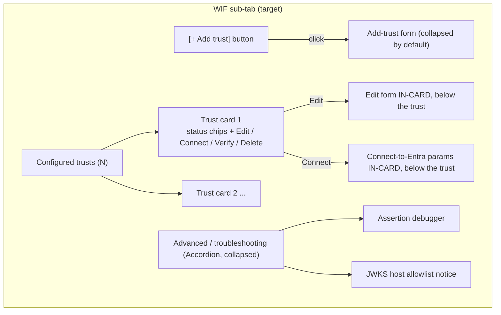
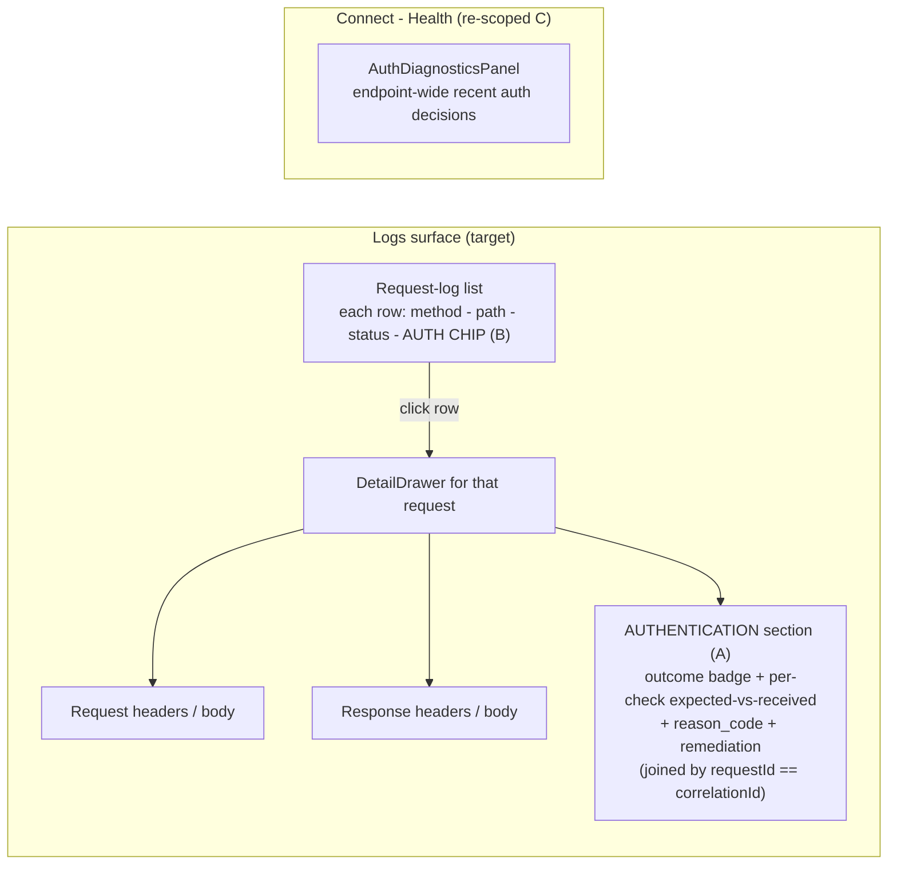
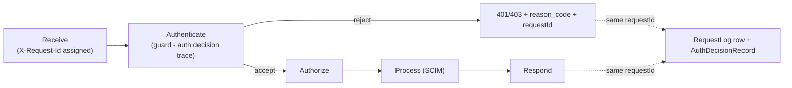
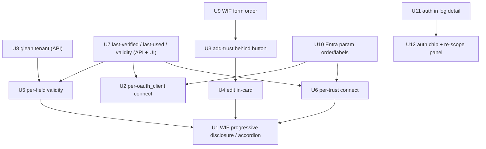

# Connect + Logs UX Overhaul - plan, current-state audit, and design decisions

> **What this is.** A design + planning document that (1) audits what is already **completed** vs **remaining** on the endpoint **Connect** tab and the **Logs** surfaces, (2) answers three design questions the operator raised (the deferred "Advanced accordion", the "disjointed" auth-diagnostics-in-logs, and "auth is a first-class step of a request"), and (3) captures every operator-requested item as a numbered work item (U1..U12) with concrete API + UI changes, field orderings, testids, and acceptance criteria - all as explanatory tables and Mermaid diagrams per the house documentation norms.
>
> **Status.** IN IMPLEMENTATION. This document is the authoritative requirements + design capture; implementation follows per the standard feature checklist (unit + E2E + live + Playwright + docs + version bump + one dev deploy).
>
> **Decision (2026-07-21, operator).** For [Q1](#2-q1--what-happened-to-the-advanced-accordion) the operator approved **option (b): targeted progressive disclosure** (NOT the single monolithic "Advanced accordion"). U1 is therefore implemented as per-object disclosure (add-trust behind a button, Edit/Connect in-card, and only the debugger + JWKS notice behind a small "Advanced / troubleshooting" accordion). Implementation proceeds across the four tracks in [section 6](#6-sequencing--dependencies).
>
> **Verified against.** The current `feat/wif` tree at the time of writing. Current-state claims are cited to the actual sources inline ([CredentialsTab.tsx](../../web/src/pages/CredentialsTab.tsx), [ConnectionPanel.tsx](../../web/src/components/primitives/ConnectionPanel.tsx), [connection-info.service.ts](../../api/src/modules/scim/services/connection-info.service.ts), [connection-info.types.ts](../../api/src/shared/types/connection-info.types.ts), [LogsPage.tsx](../../web/src/pages/LogsPage.tsx), [AuthDiagnosticsPanel.tsx](../../web/src/components/primitives/AuthDiagnosticsPanel.tsx), [wif-discovery-resolver.service.ts](../../api/src/oauth/wif-discovery-resolver.service.ts)).
>
> **Companion docs.** [CONNECTION_INFO_AND_ENTRA_SETUP.md](CONNECTION_INFO_AND_ENTRA_SETUP.md) (what to paste into Entra), [WIF_TRUST_MANAGEMENT_OVERHAUL.md](WIF_TRUST_MANAGEMENT_OVERHAUL.md) (the 2026-07 WIF UX batch), [AUTH_ERROR_DIAGNOSTICS_AND_OBSERVABILITY.md](AUTH_ERROR_DIAGNOSTICS_AND_OBSERVABILITY.md) (the auth-decision trace + diagnostics panel).

---

## Table of contents

1. [Current-state audit: completed vs remaining](#1-current-state-audit-completed-vs-remaining)
2. [Q1 - What happened to the "Advanced accordion"?](#2-q1--what-happened-to-the-advanced-accordion)
3. [Q2 - Why does auth-diagnostics look disjointed in the Logs sections, and what is the best fix?](#3-q2--why-does-auth-diagnostics-look-disjointed-in-the-logs-sections-and-what-is-the-best-fix)
4. [Q3 - Is auth a first-class step of request processing?](#4-q3--is-auth-a-first-class-step-of-request-processing)
5. [Work items U1..U12](#5-work-items-u1u12)
6. [Sequencing + dependencies](#6-sequencing--dependencies)
7. [Docs to update on implementation](#7-docs-to-update-on-implementation)

---

## 1. Current-state audit: completed vs remaining

The endpoint **Connect** tab ([CredentialsTab.tsx](../../web/src/pages/CredentialsTab.tsx)) already renders a per-method axis (`TabList`, testid `credentials-method-tabs`) with, per active method, a **Setup** area (create / rotate / reveal), a **Connect** bundle (`UnifiedConnectSection` -> `ConnectionPanel`, testid `connect-tab-panel`), and a **Health** area (`AuthDiagnosticsPanel`, testid `connect-tab-auth-diagnostics`). The Logs surfaces ([LogsPage.tsx](../../web/src/pages/LogsPage.tsx), [LogsTab.tsx](../../web/src/pages/LogsTab.tsx)) render a request-log list + a `DetailDrawer` on row-click, plus a separate `AuthDiagnosticsPanel`.

The table below maps each operator request to its current state.

| # | Requested capability | Current state | Gap |
|---|---|---|---|
| A | OAuth2 client credentials: add a new credential via a button | **DONE** - `credentials-create-button` opens the `FormDialog` (type dropdown Bearer / OAuth2) ([CredentialsTab.tsx L1395](../../web/src/pages/CredentialsTab.tsx)) | none |
| B | OAuth2 client credentials: per-already-added-credential "show connection parameters (Connect to Entra)" button | **MISSING** - the `ConnectionPanel` is shown ONCE per method at the bottom (`UnifiedConnectSection`), not per credential row | U2 |
| C | WIF: open the add-trust form via a button (not always shown) | **MISSING** - the WIF form renders inline and always ([CredentialsTab.tsx L804-L889](../../web/src/pages/CredentialsTab.tsx)) | U3 |
| D | WIF: already-added trusts indicate which params are OK vs not | **MISSING** - trust rows (`wif-credential-row-{id}`) show raw values with no per-field validity indicator | U5 |
| E | WIF: Edit opens the edit form BELOW that trust in the same card | **PARTIAL / WRONG PLACE** - Edit (`wif-credential-edit-{id}`) loads the trust into the SHARED top form via `onEditTrust` ([L697](../../web/src/pages/CredentialsTab.tsx)); it does not open in-card | U4 |
| F | WIF: per-trust "show connection parameters (Connect to Entra)" below that trust | **MISSING** - no per-trust connect view | U6 |
| G | Every credential / trust + "Connect to Entra": show last successfully verified + last used date-time; flag invalid/unverified visually; API surfaces the same | **PARTIAL** - `authHealth` (last runtime attempt outcome + time) exists on `ConnectionEnabledMethod` ([connection-info.types.ts](../../api/src/shared/types/connection-info.types.ts)) and renders a chip in `ConnectionPanel`. There is NO persisted "last **verified**" (config-time reachability) timestamp, no per-credential/per-trust health, and no "last **used**" distinct from `authHealth.lastAttemptAt` | U7 |
| H | WIF: glean `allowedTenantId` from issuer / JWKS URI when not provided, and indicate the source | **MISSING** - no inference logic exists anywhere in the API | U8 |
| I | WIF form input sequence: Token Issuer (iss), JWKS URI, Subject (sub), Audience (aud) | **WRONG ORDER** - current order is Issuer, Subject, Audience, JWKS, Tenant, ... ([L804-L839](../../web/src/pages/CredentialsTab.tsx)) | U9 |
| J | Entra WIF connection-setup param sequence: Application API URL / SCIM url, OAuth token endpoint, Client identifier | **ORDER OK, LABEL DRIFT** - assembler emits `{ tenantUrl, tokenEndpoint, clientIdentifier }` for WIF ([connection-info.service.ts L258-L263](../../api/src/modules/scim/services/connection-info.service.ts)); the order is already SCIM-url -> token-endpoint -> client-identifier, but the first key is labelled `tenantUrl` (should read "Application API URL" for WIF) | U10 |
| K | The "Advanced accordion" | **DEFERRED, never built** - see [Q1](#2-q1--what-happened-to-the-advanced-accordion) | U1 |
| L | Auth diagnostics feels disjointed in the Logs sections | **PARTIAL** - a separate `AuthDiagnosticsPanel` sits beside the request-log list; the log `DetailDrawer` has a "View auth decision" button that FOCUSES that separate panel rather than showing the decision inline | U11 + U12 |

---

## 2. Q1 - What happened to the "Advanced accordion"?

**Short answer: it was deliberately deferred during Phase 5 (the Connect/Credentials merge) and never built.** The P5 note recorded the honest gap: *"WIF form / debugger / JWKS NOT yet wrapped in an 'Advanced' accordion (kept inline to preserve ~40 wif-* testids + specs)."* Today the WIF sub-tab renders the trust form, the reachability verifier, the assertion debugger, and the JWKS-allowlist notice all inline in one long `wif-section` card ([CredentialsTab.tsx L751-L1140](../../web/src/pages/CredentialsTab.tsx)).

**Decision (approved 2026-07-21): replace the single monolithic "Advanced accordion" idea with targeted progressive disclosure, because it maps better onto the operator's other requests.** A one-big-accordion hides everything behind a single toggle; the operator actually wants *per-object* disclosure:

- The **add-trust form** collapses behind an **"Add trust"** button (U3) - the common case (viewing existing trusts) is not buried under a form.
- Each **existing trust** becomes a card that expands **Edit** (U4) and **Connect** (U6) sections *in place*.
- The **assertion debugger** + **JWKS-allowlist** move into a small **"Advanced / troubleshooting"** disclosure (a Fluent `Accordion` with one item) at the bottom of the WIF sub-tab - this is the only place a literal accordion still earns its keep, because those two tools are genuinely occasional.

This preserves every existing `wif-*` testid (the fields just move into the collapsed form + in-card sections) while delivering the progressive disclosure the accordion was meant to provide.

---

## 3. Q2 - Why does auth-diagnostics look disjointed in the Logs sections, and what is the best fix?

### Why it looks disjointed today

On both [LogsPage.tsx](../../web/src/pages/LogsPage.tsx) and [LogsTab.tsx](../../web/src/pages/LogsTab.tsx) the auth diagnostics live in a **separate `AuthDiagnosticsPanel`** rendered beside the request-log list (testids `global-logs-auth-diagnostics` / the per-endpoint equivalent). A request log and its auth decision are two lists on the same page. The only bridge is: click a log row -> `DetailDrawer` opens -> a **"View auth decision"** button ([LogsPage.tsx L557](../../web/src/pages/LogsPage.tsx)) sets `authFocus` -> the *separate* panel scrolls/filters to that `correlationId`. So the operator's eye has to jump between two disconnected regions, and the auth decision is not part of the request's own detail view.

They ARE joinable: every `RequestLog` row carries a `requestId` and every `AuthDecisionRecord` carries a `correlationId`, and `requestId === correlationId` for the same request (the correlation bridge, now established even for guard rejections).

### Options considered (usability best practice)

| Option | Description | Verdict |
|---|---|---|
| Status quo | Two separate lists + a focus-jump button | Rejected - violates locality of reference; the "disjointed" feeling |
| **A. Auth section INSIDE the log detail** | The `DetailDrawer` for a log gains an **Authentication** section that renders the auth decision for THAT request (joined by `requestId`), inline with the request/response headers + body | **Recommended (primary)** |
| **B. Auth outcome in the log LIST** | Each request-log row shows a small **auth chip** (green accept / red reject + reason code) so auth health is glanceable without opening a row | **Recommended (complement)** |
| C. Keep the separate panel only | Retain the endpoint-wide "recent auth decisions" panel but only on the **Connect -> Health** surface, not interleaved with logs | Keep, re-scoped |

### Recommendation: A + B, with C re-scoped

Treat the auth decision as an **integral part of a request's detail**, not a sibling list:

- **A (primary):** put an **"Authentication" section in the request-log `DetailDrawer`**. When a log row is opened, we already have its `requestId`; render the matching auth-decision trace (outcome badge, the per-check expected-vs-received diff, reason code + remediation, the WWW-Authenticate / diagnostics data) right there, below the request/response. This is the browser-devtools "Network -> a request -> its Headers / Timing / Auth all in one detail" model. One click shows the whole request story including auth.
- **B (complement):** add an **auth-outcome chip/column to the request-log list** so the operator sees, at a glance, which requests failed auth and why - without opening each one.
- **C (re-scope):** the standalone `AuthDiagnosticsPanel` remains valuable as an **endpoint-wide "recent auth decisions" health view** on the **Connect -> Health** sub-tab (a different, legitimate job: "how is auth doing for this endpoint lately?"). It is removed from the interleaved-with-logs position; the per-request view now lives in the log detail.

**Why this is the best fit for the norms:** it satisfies locality of reference (related data together), progressive disclosure (chip in the list -> full diff in the drawer), a single mental model ("a request has an auth step"), and fewer clicks (no cross-panel focus jump). It also reuses the existing `AuthDecisionRecordStore` + the `requestId <-> correlationId` bridge, so it is an assembly of shipped parts, not new plumbing.

---

## 4. Q3 - Is auth a first-class step of request processing?

**Yes - and the UI should model it that way.** Authentication is the first gate every inbound request passes (or fails) before any SCIM work happens; an auth failure is, for an operator, the single most common and most opaque failure to diagnose. Modeling the request lifecycle as an explicit, visible sequence - **receive -> authenticate -> authorize -> process -> respond** - and surfacing the **authenticate** step inside the request's own record (Q2 option A) is the correct information architecture. This is exactly why the auth-decision trace, the reason-code catalog, and the `requestId <-> correlationId` bridge were built: so the "authenticate" step is a first-class, inspectable part of each request, not a side channel.

---

## 5. Work items U1..U12

Each work item follows the standard feature checklist on implementation (TDD; API unit + E2E + live-test; web vitest + Playwright; docs; version bump; cross-backend parity). Testids named here are the contract the specs assert against.

### U1 - Progressive disclosure for the WIF sub-tab (replaces the deferred "Advanced accordion")
- **Design:** per [Q1](#2-q1--what-happened-to-the-advanced-accordion). Add-trust form collapses behind a button (U3); each trust card expands Edit (U4) + Connect (U6) in place; the assertion debugger + JWKS notice move into a single collapsed Fluent `Accordion` labelled "Advanced / troubleshooting".
- **UI:** new testids `wif-advanced-accordion`, `wif-advanced-toggle`. All existing `wif-*` field testids preserved (relocated into the collapsed form / in-card sections).
- **Acceptance:** viewing existing trusts requires no scrolling past a form; the debugger + JWKS notice are collapsed by default; Playwright asserts the accordion collapses/expands and that the field testids still resolve.

### U2 - Per-oauth_client-credential "Connect to Entra" button
- **Problem:** the Connect bundle is per-method, not per-credential; an endpoint may hold several oauth_client credentials.
- **UI:** on each `credential-row-{id}` of type `oauth_client`, add a **Connect** button `credential-connect-{id}` that expands, in-card, the `ConnectionPanel` scoped to that credential (Application API URL, OAuth token endpoint, Client identifier = this credential's client id, and the secret when visibility is Always).
- **API:** `ConnectionEnabledMethod` already carries `credentialId`; the assembler must emit one enabled `oauth_client` entry per active oauth_client credential (today it emits a single collapsed method). See U7 for the shared per-credential health.
- **Acceptance:** each oauth_client credential has its own copyable connect bundle; vitest + Playwright assert `credential-connect-{id}` reveals the right client id.

### U3 - WIF add-trust form behind a button
- **UI:** replace the always-rendered form with an **"Add trust"** button `wif-add-trust-button` that toggles the form (`wif-add-trust-form`, collapsed by default). The form keeps every current field testid.
- **Acceptance:** the form is hidden until the button is pressed; Cancel collapses it; Playwright asserts the collapsed/expanded states.

### U4 - Edit a WIF trust in-card (below that trust)
- **Problem:** Edit currently hoists the trust into the shared top form ([L697](../../web/src/pages/CredentialsTab.tsx)).
- **UI:** Edit (`wif-credential-edit-{id}`) toggles an inline edit form `wif-trust-edit-form-{id}` rendered **inside** the `wif-credential-row-{id}` card, immediately below the trust's displayed values. Save / Cancel are in-card.
- **Acceptance:** the edit form appears within the trust's own card; editing one trust does not disturb the add-trust form; Playwright measures the edit form's DOM position is inside the trust card.

### U5 - Per-field validity indicators on displayed trusts
- **Design:** each displayed trust field (issuer, jwks, subject, audience, tenant) gets an inline status: **OK** (verified reachable/consistent), **warning** (unverified / gleaned - see U8), or **error** (format-invalid / host-not-allowlisted / last verify failed). Reuse the `POST /wif/verify` reachability checklist ([WIF_TRUST_MANAGEMENT_OVERHAUL.md](WIF_TRUST_MANAGEMENT_OVERHAUL.md)) plus format checks.
- **API:** persist the most recent `verify` result per trust (see U7) so the indicator survives a reload without re-fetching the IdP.
- **UI:** testids `wif-credential-{id}-{field}-status`.
- **Acceptance:** a trust whose JWKS host is not allowlisted shows an error on the jwks field; a verified trust shows OK; Playwright asserts the status per field.

### U6 - Per-trust "Connect to Entra" params in-card
- **UI:** each trust card gains a **Connect** button `wif-credential-connect-{id}` that expands, in-card below the trust, the WIF connection-setup params (U10 order) for that specific trust (Application API URL, OAuth token endpoint, Client identifier = that trust's `expectedSubject`).
- **Acceptance:** the connect params render inside the trust card; the client identifier equals that trust's subject; Playwright asserts.

### U7 - "Last verified" + "last used" + validity, on every credential / trust + in the API
- **Data model:** add two timestamps per credential/trust: `lastVerifiedAt` (last successful config-time `POST /wif/verify` or credential check) and `lastUsedAt` (last runtime auth **accept**). `lastUsedAt` + last outcome derive from the existing `AuthDecisionRecordStore` (`authHealth`); `lastVerifiedAt` + the stored verify result are new (persist on the credential metadata or a companion store).
- **API:** extend `ConnectionEnabledMethod` (and the per-credential/per-trust projections) with `lastVerifiedAt?`, `lastUsedAt?`, and a computed `validity: 'ok' | 'unverified' | 'invalid' | 'failing'`. The endpoint credential list + connection-info responses carry these.
- **UI:** `ConnectionPanel` + each credential/trust card render a status line: "Last verified {date} - Last used {date}" with a green/amber/red validity dot; an invalid/unverified/failing credential is flagged at the point of display (testid `*-validity`).
- **Acceptance:** a never-verified trust shows "Unverified"; a trust that last rejected shows "Failing" + the reason; the API response carries the same values (key-allowlist asserted).

### U8 - Glean `allowedTenantId` from issuer / JWKS URI when omitted
- **Design:** when a WIF trust is created/edited WITHOUT `allowedTenantId`, infer it from the issuer or JWKS URI by extracting the tenant GUID (e.g. `https://login.microsoftonline.com/{tenant}/v2.0` or `.../{tenant}/discovery/v2.0/keys`). Record the inferred value AND its source.
- **API:** a pure helper `inferAllowedTenantId(issuer, jwksUri) -> { tenantId, source: 'issuer' | 'jwksUri' } | null`; applied in the admin-credential create/edit path when the field is blank. The stored trust records `allowedTenantId` + a non-secret `allowedTenantIdSource` marker.
- **UI:** the tenant field shows "Inferred from {issuer|JWKS URI}" when gleaned; the operator can override.
- **Acceptance:** a trust created with only issuer + jwks gets a tenant; the UI + API both indicate the source; unit tests cover Entra commercial/gov/china host shapes + a non-inferable issuer (returns null, tenant stays optional).

### U9 - WIF form input sequence
- **Change:** reorder the WIF form fields to **Token Issuer (iss) -> JWKS URI -> Subject (sub) -> Audience (aud)**, then the remaining optional fields (tenant, roles, scope, enforcement). Move `wif-field-jwks` from 4th to 2nd ([L804-L839](../../web/src/pages/CredentialsTab.tsx)).
- **Acceptance:** the DOM order matches; Playwright asserts the field order by bounding-box top position.

### U10 - Entra WIF connection-setup param sequence + labels
- **Change:** the WIF connection params display, everywhere they appear (`ConnectionPanel`, the per-trust connect view U6, the `wif-return-*` box), in the order **Application API URL / SCIM url -> OAuth token endpoint -> Client identifier**. The assembler order already matches ([connection-info.service.ts L258](../../api/src/modules/scim/services/connection-info.service.ts)); relabel the first WIF field from `tenantUrl` to "Application API URL" (WIF-specific label) in `ConnectionPanel`'s label map.
- **Acceptance:** the WIF connect view shows the three fields in the specified order with the "Application API URL" label; vitest asserts labels + order.

### U11 - Auth section inside the request-log detail (Q2 option A)
- **UI:** the request-log `DetailDrawer` (LogsPage + LogsTab) gains an **Authentication** section `log-detail-auth-section` that renders the auth-decision trace for the log's `requestId` (reusing the `AuthDiagnosticsPanel` row internals scoped to a single decision). Remove the "View auth decision" focus-jump button; the decision is now inline.
- **API:** a lookup "auth decision by requestId/correlationId" (the store already supports `query`; add a `byCorrelationId` selector if missing).
- **Acceptance:** opening a failed-auth request shows its per-check expected-vs-received diff inline in the drawer; Playwright asserts `log-detail-auth-section` renders the reason code for a rejected request.

### U12 - Auth-outcome chip in the request-log list (Q2 option B) + re-scope the standalone panel
- **UI:** each request-log row shows an auth-outcome chip `log-row-auth-{id}` (accept green / reject red + reason code) derived from the matching auth-decision. The standalone `AuthDiagnosticsPanel` is removed from the interleaved logs position and kept only on **Connect -> Health** as the endpoint-wide recent-decisions view.
- **Acceptance:** a failed-auth row is visibly red with its reason; the logs surface no longer shows a separate disjointed auth panel; Playwright asserts the chip + the absence of the old panel testid on the logs page.

---

## 6. Sequencing + dependencies

**Suggested tracks (each track = a batched dev deploy):**
- **Track 1 (API foundations):** U8, U7 (data model + connection-info projections), U10 (labels).
- **Track 2 (WIF sub-tab UX):** U9, U3, U4, U5, U6, U1.
- **Track 3 (oauth_client + Connect parity):** U2.
- **Track 4 (Logs <-> auth integration):** U11, U12.

---

## 7. Docs to update on implementation

| Doc | Update |
|---|---|
| [CONNECTION_INFO_AND_ENTRA_SETUP.md](CONNECTION_INFO_AND_ENTRA_SETUP.md) | WIF connection-setup field sequence + labels (U10); per-credential / per-trust connect views (U2, U6); last-verified / last-used surfacing (U7) |
| [WIF_TRUST_MANAGEMENT_OVERHAUL.md](WIF_TRUST_MANAGEMENT_OVERHAUL.md) | Add-trust-behind-button (U3), edit-in-card (U4), per-field validity (U5), per-trust connect (U6), tenant gleaning (U8), form input order (U9), progressive disclosure (U1) |
| [AUTH_ERROR_DIAGNOSTICS_AND_OBSERVABILITY.md](AUTH_ERROR_DIAGNOSTICS_AND_OBSERVABILITY.md) | Auth-in-log-detail integration (U11) + auth chip in the list (U12); the "auth is a first-class request step" IA |
| [COMPLETE_API_REFERENCE.md](../COMPLETE_API_REFERENCE.md) | New/extended fields: `lastVerifiedAt`, `lastUsedAt`, `validity`, `allowedTenantIdSource`; per-credential connect projections |
| [INDEX.md](../INDEX.md) | Link this plan doc |
