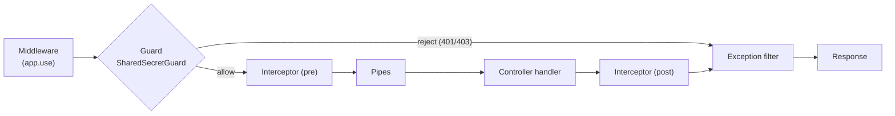
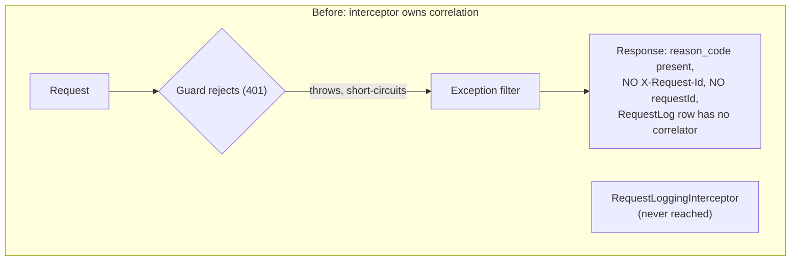
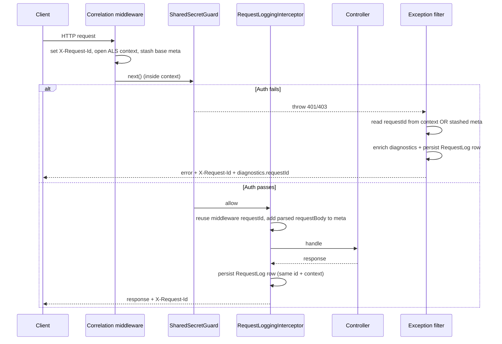

# Correlation Middleware and Request Traceability

> **What this is.** The design + reference for the early **correlation middleware** that makes every request - including auth failures rejected by a guard - carry a stable `X-Request-Id`, run inside an `AsyncLocalStorage` correlation context, and persist a `RequestLog` row. It explains *why* the earlier interceptor-only approach could not trace guard rejections, the NestJS lifecycle constraint at the root of it, and how the middleware, the `RequestLoggingInterceptor`, and the exception filters now cooperate.

> **Status.** IMPLEMENTED. Source of truth: [correlation-middleware.ts](../../api/src/bootstrap/correlation-middleware.ts), applied in [main.ts](../../api/src/main.ts) and the E2E harness [app.helper.ts](../../api/test/e2e/helpers/app.helper.ts).

---

## Table of contents

1. [TL;DR](#1-tldr)
2. [Background: the NestJS request lifecycle](#2-background-the-nestjs-request-lifecycle)
3. [The problem: guards reject before the interceptor runs](#3-the-problem-guards-reject-before-the-interceptor-runs)
4. [Why it matters for auth logging and diagnostics](#4-why-it-matters-for-auth-logging-and-diagnostics)
5. [The fix: an early correlation middleware](#5-the-fix-an-early-correlation-middleware)
6. [The three cooperating layers](#6-the-three-cooperating-layers)
7. [Middleware ordering in main.ts](#7-middleware-ordering-in-maints)
8. [Production and E2E parity](#8-production-and-e2e-parity)
9. [End-to-end: a guard-rejected 401](#9-end-to-end-a-guard-rejected-401)
10. [Relationship to the auth-on-request-log work (V10-V12)](#10-relationship-to-the-auth-on-request-log-work-v10-v12)
11. [Test coverage](#11-test-coverage)
12. [Related docs](#12-related-docs)

---

## 1. TL;DR

Authentication happens in a **guard** (`SharedSecretGuard`). In NestJS, guards run **before** interceptors. Originally the `RequestLoggingInterceptor` was the component that generated the `X-Request-Id`, opened the correlation context, and stashed the request-logging metadata - but a guard that rejects an unauthenticated request throws a `401`/`403` that short-circuits the pipeline **before any interceptor executes**. So the exact requests operators most need to trace - failed auth - reached the client with a reason code but **no correlator**: no `X-Request-Id` header, no `requestId` in the diagnostics block, and a `RequestLog` row (if any) with no correlation id.

The fix moves the correlation-establishing work into an **Express middleware** (`app.use(...)`), which runs **before guards**. Now every request - success or guard rejection - carries a stable id, runs inside the correlation context, and is persisted with that id.

---

## 2. Background: the NestJS request lifecycle

NestJS runs the enhancers of a request in a fixed order. The two facts that matter here:

- **Middleware runs first** (it is plain Express `app.use(...)`, before Nest's own machinery).
- **Guards run before interceptors.** An interceptor's "pre-handler" logic only runs if a guard has already allowed the request through.



The key edge is `Guard -- reject --> Exception filter`: it bypasses the interceptor entirely.

---

## 3. The problem: guards reject before the interceptor runs

Before the middleware existed, the `RequestLoggingInterceptor` owned three responsibilities:

1. read/generate `X-Request-Id` and set it on the response,
2. open the `AsyncLocalStorage` correlation context (so services, the auth-decision emitter, and exception filters can read `requestId`/`endpointId`),
3. stash a `RequestLoggingMeta` on the request so the exception filters can persist a `RequestLog` row.

All three only happen if the interceptor runs. For a guard-rejected request, it never does:



The result was a correlation hole on precisely the failure path: an operator could see *what* went wrong (`reason_code: bearer_invalid`) but had no id to pivot from the error response to the request log or the auth-decision record.

---

## 4. Why it matters for auth logging and diagnostics

The auth-diagnostics design (see [AUTH_ERROR_DIAGNOSTICS_AND_OBSERVABILITY.md](AUTH_ERROR_DIAGNOSTICS_AND_OBSERVABILITY.md)) is built around a single correlation id that ties three artifacts together:

- the **error response** returned to the caller (its diagnostics block),
- the structured **`Auth decision` event** in the log ring buffer,
- the persisted **`RequestLog` row** the operator opens to inspect the request.

That pivot only works if all three share the same id. Guard rejections (`401`/`403`) are the single most common auth-failure class an operator debugs, so a correlation id that is present on 2xx/4xx handler responses but absent on guard rejections defeats the feature exactly where it is needed. Establishing the id and context **before** the guard closes that hole.

---

## 5. The fix: an early correlation middleware

[applyCorrelationMiddleware()](../../api/src/bootstrap/correlation-middleware.ts) registers a single Express middleware via `app.use(...)`, so it runs before guards, interceptors, and body parsing. On every request it:

1. **reads or generates `X-Request-Id`** (honoring a client-supplied header, else a `randomUUID()`) and sets it on the response, so **every** response - including the `401`/`403`/`415` short-circuits thrown by guards - carries it;
2. **opens the correlation context** via `scimLogger.runWithContext({ requestId, method, path, endpointId, startTime }, () => next())`, so everything downstream (guards included) executes inside the `AsyncLocalStorage` scope;
3. **stashes a base `RequestLoggingMeta`** on the request (`startedAt`, `requestId`, `requestHeaders`, `endpointId`) so a guard-rejected request - which throws before the interceptor - can still be persisted as a `RequestLog` row with its correlator by the exception filters.

Because body parsing runs *after* this middleware, the base meta deliberately has **no `requestBody`** yet; the interceptor fills that in later.

---

## 6. The three cooperating layers

After the change, correlation is a collaboration between the middleware, the interceptor, and the exception filters.



### 6.1 The interceptor's reduced role (plus a fallback)

[request-logging.interceptor.ts](../../api/src/modules/logging/request-logging.interceptor.ts) no longer owns correlation. When the middleware ran, `meta?.requestId` is already set, so the interceptor only enriches the meta with the now-parsed `request.body` and logs within the **same** id + context - it does not re-generate the id or re-open the context. It keeps a self-sufficient fallback (generate id + open context itself) for paths the middleware did not cover, most importantly **unit tests** that instantiate the interceptor directly without the bootstrap.

### 6.2 The exception filters consume it belt-and-suspenders

Both [scim-exception.filter.ts](../../api/src/modules/scim/filters/scim-exception.filter.ts) and [global-exception.filter.ts](../../api/src/modules/scim/filters/global-exception.filter.ts) resolve the correlator as `getCorrelationContext()?.requestId ?? meta?.requestId`. The context is preferred, but the **stashed meta is the robust fallback** that guarantees a guard-rejected `401` (which throws outside the interceptor, and where ALS propagation through the error path is not guaranteed) still carries the `requestId` in its diagnostics block and its persisted `RequestLog` row. The filter merges `requestId` + `endpointId` + `logsUrl` **into** any diagnostics block a guard already set (for example the resource-plane guard's `reason_code`), rather than replacing it.

---

## 7. Middleware ordering in main.ts

Order is load-bearing. In [main.ts](../../api/src/main.ts) the correlation middleware is registered:

- **after** the `/scim/v2` -> `/scim` URL-rewrite middleware (so the context's `path` and the derived `endpointId` reflect the rewritten URL), and
- **before** helmet, body parsing, the global pipes, and the guards/interceptors (so the id + context + meta exist for everything that follows, including guard short-circuits).

Helmet is likewise inserted early for the same reason (security headers must be set on guard-rejected responses too), so the two "must run before guards" middlewares sit next to each other.

---

## 8. Production and E2E parity

The same `applyCorrelationMiddleware(app)` is called in both production bootstrap ([main.ts](../../api/src/main.ts)) and the E2E harness ([app.helper.ts](../../api/test/e2e/helpers/app.helper.ts)). This is deliberate: if the harness omitted the middleware, E2E tests would silently exercise the interceptor's fallback path instead of the real production correlation path, and a regression in the middleware could pass every test. Sharing one entry point keeps the harness and production behaving identically.

---

## 9. End-to-end: a guard-rejected 401

A bearer token the guard cannot validate now produces a fully-traceable rejection. The response carries the `X-Request-Id` header, and its SCIM diagnostics block carries the matching `requestId` alongside the `reason_code`:

```json
{
  "schemas": [
    "urn:ietf:params:scim:api:messages:2.0:Error"
  ],
  "detail": "Authentication failed.",
  "status": "401",
  "urn:scimserver:api:messages:2.0:Diagnostics": {
    "reason_code": "bearer_invalid",
    "requestId": "8f1c0b2a-9d3e-4f77-a1b2-3c4d5e6f7a8b",
    "logsUrl": "/scim/endpoints/ep-123/logs/recent?requestId=8f1c0b2a-9d3e-4f77-a1b2-3c4d5e6f7a8b"
  }
}
```

The `requestId` equals the `X-Request-Id` response header, and the same id is on the persisted `RequestLog` row, so `logsUrl` resolves the operator straight to the originating request. This is exactly what the E2E assertion in [auth-reason-codes.e2e-spec.ts](../../api/test/e2e/auth-reason-codes.e2e-spec.ts) ("a GUARD-rejected 401 also carries the requestId correlator") locks.

---

## 10. Relationship to the auth-on-request-log work (V10-V12)

The middleware is a prerequisite for persisting the auth decision on the `RequestLog` row (see [CREDENTIAL_LIFECYCLE_AND_AUTH_IN_LOGS_PLAN.md](CREDENTIAL_LIFECYCLE_AND_AUTH_IN_LOGS_PLAN.md), V10-V12). That write path stamps `authOutcome`/`authMethod`/`authReason`/`authCredentialId` onto the correlation context during the guard/token flow (in `emitAuthDecisionEvent`) and reads them back when the row is written. For a rejected `401`, the auth summary can only ride the row because the **context was already open when the guard ran** - which is precisely what this middleware guarantees. Without the early middleware, the durable "red auth-fail chip on a 401 log row" (V12) could not exist.

---

## 11. Test coverage

| Layer | File | What it locks |
|---|---|---|
| E2E | [auth-reason-codes.e2e-spec.ts](../../api/test/e2e/auth-reason-codes.e2e-spec.ts) | A guard-rejected `401` carries `reason_code` + `requestId` in diagnostics and the matching `X-Request-Id` header |
| E2E | [error-handling.e2e-spec.ts](../../api/test/e2e/error-handling.e2e-spec.ts) | `X-Request-Id` present on error responses; a client-supplied `X-Request-Id` is propagated |
| E2E | [global-logs-filters.e2e-spec.ts](../../api/test/e2e/global-logs-filters.e2e-spec.ts) | `GET /admin/logs?requestId=` round-trips the `X-Request-Id` of a prior request |
| Unit | [scim-exception.filter.spec.ts](../../api/src/modules/scim/filters/scim-exception.filter.spec.ts) | Diagnostics `requestId`/`logsUrl` derived from the stashed meta when the context is absent |
| Unit | [global-exception.filter.spec.ts](../../api/src/modules/scim/filters/global-exception.filter.spec.ts) | Diagnostics enrichment from the correlation context |
| Unit | [request-logging.interceptor.spec.ts](../../api/src/modules/logging/request-logging.interceptor.spec.ts) | The interceptor reuses the middleware id when present, and falls back to generating its own otherwise |

---

## 12. Related docs

- [AUTHENTICATION_ARCHITECTURE.md](AUTHENTICATION_ARCHITECTURE.md) - the umbrella auth architecture (guards, two-plane model).
- [AUTH_ERROR_DIAGNOSTICS_AND_OBSERVABILITY.md](AUTH_ERROR_DIAGNOSTICS_AND_OBSERVABILITY.md) - the reason-code catalog, the Auth Decision Trace, and the `requestId <-> correlationId` bridge this middleware feeds.
- [CREDENTIAL_LIFECYCLE_AND_AUTH_IN_LOGS_PLAN.md](CREDENTIAL_LIFECYCLE_AND_AUTH_IN_LOGS_PLAN.md) - V10-V12, persisting the auth summary on the `RequestLog` row.
- [../LOGGING_AND_OBSERVABILITY.md](../LOGGING_AND_OBSERVABILITY.md) - the structured logger, ring buffer, and request-log persistence.
