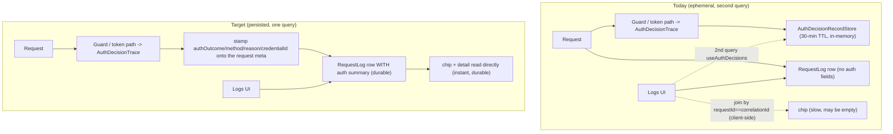
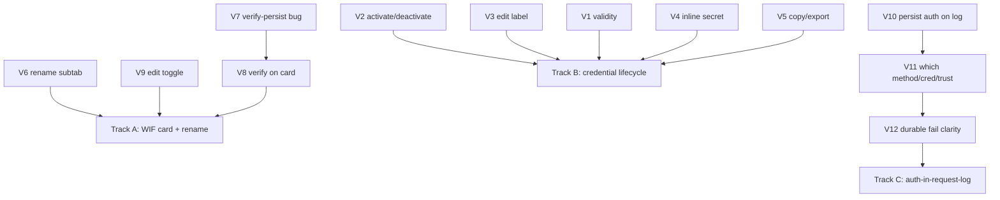

# Credential lifecycle + auth-in-logs - plan, audit, and design (V1-V12)

> **What this is.** The design + planning capture for the second Connect/Logs follow-up batch (operator requirements, 2026-07-21). It audits the current state of 12 requirements, records the design decision for each, and sequences them into three tracks. It is the successor to [CONNECT_AND_LOGS_UX_OVERHAUL_PLAN.md](CONNECT_AND_LOGS_UX_OVERHAUL_PLAN.md) (U1-U12, IMPLEMENTED v0.54.32-0.54.37).
>
> **Status.** Track A (V6/V7/V8/V9) IMPLEMENTED v0.54.38; Track B (V1-V5) IMPLEMENTED v0.54.39; Track C (V10/V11/V12) IMPLEMENTED v0.54.40. Implementation followed the standard feature checklist (TDD; API unit + E2E + live; web vitest + Playwright; docs; version bump; measured dev deploy).
>
> **Verified against.** The `feat/wif` tree at v0.54.37 (audit cited inline).

---

## Table of contents

1. [Current-state audit](#1-current-state-audit)
2. [Design decisions per item](#2-design-decisions-per-item)
3. [Work items V1-V12](#3-work-items-v1v12)
4. [Auth-in-request-log architecture (V10-V12)](#4-auth-in-request-log-architecture-v10v12)
5. [Sequencing + tracks](#5-sequencing--tracks)
6. [Docs to update](#6-docs-to-update)

---

## 1. Current-state audit

| # | Requirement | Current state | Gap -> item |
|---|---|---|---|
| A | Show how long a credential/trust is valid (UI + API) | `EndpointCredential.expiresAt` exists + is surfaced on the overview as an ISO string; UI shows the raw date only | No "remaining validity" computed, no expiry status badge, WIF trust (no expiry) not addressed -> **V1** |
| B | Activate/deactivate per credential + trust from its card + API | `DELETE .../credentials/:id` soft-deactivates; there is NO reactivate; UI shows an Active/Revoked badge but no per-row toggle | Add reactivate API + per-card activate/deactivate toggle -> **V2** |
| C | Edit any credential's editable fields (name/description) | Only `wif` credentials are editable (PUT); bearer/oauth_client reject with "rotate instead"; `updateLabel` exists on the repo | Allow label edit for bearer/oauth_client -> **V3** |
| D | Always show the client secret when the flag is on + the other params | `CredentialSecretVisibility=always` retains an encrypted `secretEnvelope`; the `ConnectionPanel` inlines it; the per-credential U2 Connect panel says "use Reveal" instead of inlining | Inline the retained secret in the per-credential/per-trust Connect panel when visibility=always -> **V4** |
| E | Copy-JSON / env / download on all cards + tabs | `CopyJsonButton` in the WIF add/edit form; `ConnectionPanel` has export; per-credential + per-trust cards + the All tab lack a whole-object copy/export | Add whole-object copy/export to every card + tab -> **V5** |
| F | Rename "OAuth2 client" sub-tab to "OAuth2 Client-Credential" | Label `'OAuth2 client'` in `enabledMethodTabs` | One-line rename -> **V6** |
| G | BUG: WIF verify success does not flip the card to Verified | `POST .../wif/verify` is a STATELESS reachability check; `lastVerifiedAt` is only stamped on create/edit with `verify:true`; a standalone verify does not persist, so the card stays Unverified | Persist `lastVerifiedAt` on a successful per-trust verify + invalidate the query -> **V7** |
| H | Verify button on the WIF trust card | Verify lives ONLY inside the Edit form; the card row has Edit / Connect / Delete | Add a Verify button to the card -> **V8** |
| I | WIF edit button togglable like Connect | Edit always opens (sets `editingId`); Connect toggles (`connectTrustId`) | Make Edit toggle open/closed -> **V9** |
| J | Logs auth column is slow + should be in the request table | The row auth chip is a SEPARATE `useAuthDecisions` query against the ephemeral (30-min TTL) in-memory store; not persisted on `RequestLog`, joined client-side by `requestId===correlationId` | Persist the auth summary ON `RequestLog` so the logs list carries it directly (instant + durable) -> **V10** |
| K | Show which method/credential/trust succeeded + why | The `AuthDecisionTrace` records `method` + `selectedTrustId` + `checks[]`, but NOT the winning `credentialId` for bearer/oauth_client, and the resource-plane guard records the method but not which credential matched | Add the winning `credentialId` to the trace + persist a human "authenticated via ..." summary -> **V11** |
| L | Clear indication + reason when auth failed for a request | U12 chip + U11 in-drawer diff exist but depend on the ephemeral store (may be gone after 30 min) | The V10 persisted summary makes the fail + reason durable + instant on the row and in the detail -> **V12** |

---

## 2. Design decisions per item

- **V1 (validity):** the API already returns `expiresAt`; the UI computes and shows a **remaining-validity** line per credential/trust ("Valid until {date} - {N} days left" / "No expiry" / "Expired {date}") with an ok/amber/red dot. A WIF trust does not expire, so it shows "Trust does not expire; minted tokens valid for {issuedTokenTtlSec ?? default}". No new API field required (expiresAt + issuedTokenTtlSec already surfaced); a small optional computed `validForSeconds` may be added for API parity.
- **V2 (activate/deactivate):** add `POST .../credentials/:id/activate` (reactivate) alongside the existing `DELETE` (deactivate); the repo gains `setActive(id, active)`. The UI card gains an Activate/Deactivate toggle. WIF trusts are credentials, so this covers trusts too.
- **V3 (edit label):** relax the PUT/label path so bearer/oauth_client can edit `label` (and description if added) without rotating; the secret is untouched. Reuses `updateLabel`.
- **V4 (always-show secret):** when the effective `CredentialSecretVisibility` is `always`, the per-credential/per-trust Connect panel inlines the retained secret (via the existing `useConnectionRetainedSecrets` / reveal path) next to the other params, with a copy button - no extra click.
- **V5 (copy/export everywhere):** add a `CopyJsonButton` (whole object) to every credential row + WIF trust card + an "export all" on the All tab; the Connect panels keep their `.env`/download export.
- **V6 (rename):** `'OAuth2 client'` -> `'OAuth2 Client-Credential'`.
- **V7 (verify persistence bug):** `POST .../wif/verify` accepts an optional `credentialId`; when supplied AND the verify passes, it stamps `metadata.lastVerifiedAt = now` on that credential and the UI invalidates the overview so the card flips to Verified. A verify with no credentialId stays a pure dry-run (add-form case).
- **V8 (verify on card):** a Verify button on the WIF trust card calls V7's persisting verify for that trust (using its stored issuer/jwks) and shows the checklist in-card.
- **V9 (edit toggle):** Edit toggles - clicking it when already editing this trust closes the in-card form.
- **V10 (auth on request log):** persist an auth summary ON `RequestLog` (`authOutcome` + `authMethod` + `authReason` + `authCredentialId?`), written during the request (guard/token path -> interceptor/exception filter), at parity in the InMemory backend. The logs list + detail return them; the row chip reads the row directly (no separate query, durable). See [section 4](#4-auth-in-request-log-architecture-v10v12).
- **V11 (which method/credential/trust):** extend the `AuthDecisionTrace` + the persisted summary with the winning `credentialId` (bearer/oauth_client) and keep `selectedTrustId` (wif); the log detail shows "Authenticated via {method} using {credential/trust} because {reason}".
- **V12 (fail clarity):** because V10 persists the outcome + reason on the row, a failed auth is a durable red chip + reason on the row and the full expected-vs-received diff in the detail, with no dependency on the ephemeral store.

---

## 3. Work items V1-V12

Each item follows the standard checklist (TDD; API unit + E2E + live; web vitest + Playwright; docs; version; cross-backend parity). Testids named here are the contract.

### V1 - Remaining-validity display per credential / trust
- **UI:** a validity line per credential row + WIF trust card (`credential-validity-{id}` / `wif-credential-{id}-expiry`): "Valid until {date} - {N} days left" | "No expiry" | "Expired". Amber < 14 days, red if expired.
- **API:** `expiresAt` already returned; optionally add a computed `validForSeconds` to the overview credential projection.
- **Acceptance:** an expiring credential shows the remaining days + amber; a WIF trust shows "does not expire" + the minted-token TTL; vitest asserts the rendered text.

### V2 - Activate / deactivate per card + API
- **API:** `POST .../credentials/:credentialId/activate` (reactivate) + repo `setActive`; the existing `DELETE` remains deactivate. Emits a `LogCategory.AUTH` config event.
- **UI:** an Activate/Deactivate toggle button on every credential row + WIF trust card (`credential-toggle-active-{id}` / `wif-credential-toggle-active-{id}`).
- **Acceptance:** deactivate then activate round-trips; the badge flips; API + live tests cover both; cross-backend parity.

### V3 - Edit a credential's label (bearer / oauth_client)
- **API:** allow a label-only edit for bearer/oauth_client (PUT/PATCH label; secret untouched).
- **UI:** an Edit-label control per non-wif credential row (`credential-edit-label-{id}`).
- **Acceptance:** editing a bearer label persists without rotating the secret; unit + E2E + live.

### V4 - Inline the retained secret in the Connect panels when visibility=always
- **UI:** the per-credential (U2) + per-trust (U6) Connect panels inline the retained secret + a copy button when the effective visibility is `always` (`credential-connect-secret-{id}`).
- **Acceptance:** with visibility=always the secret renders inline in the per-credential Connect panel; with `once` it shows the "rotate to view" fallback; vitest asserts both.

### V5 - Whole-object copy / export on every card + tab
- **UI:** `CopyJsonButton` on every credential row (`credential-copy-json-{id}`) + WIF trust card (`wif-credential-copy-json-{id}`); an "Export all" on the All tab (`credentials-export-all`).
- **Acceptance:** each card copies its full non-secret object as JSON; Playwright asserts the button exists + copies.

### V6 - Rename the OAuth2 sub-tab
- **UI:** `'OAuth2 client'` -> `'OAuth2 Client-Credential'` in `enabledMethodTabs`.
- **Acceptance:** the tab label reads "OAuth2 Client-Credential"; vitest + Playwright assert.

### V7 - Persist lastVerifiedAt on a per-trust verify (BUG fix)
- **API:** `POST .../wif/verify` accepts optional `credentialId`; on a passing verify with a credentialId it stamps `metadata.lastVerifiedAt`. No credentialId = pure dry-run (unchanged).
- **UI:** the verify success invalidates the overview so the card flips Unverified -> Verified.
- **Acceptance:** verify a saved trust -> the card shows Verified + the timestamp on the next render; unit + E2E + live assert the persisted `lastVerifiedAt`.

### V8 - Verify button on the WIF trust card
- **UI:** a Verify button on the card (`wif-credential-verify-{id}`) that runs V7's persisting verify for that trust + shows the checklist in-card (`wif-credential-verify-result-{id}`).
- **Acceptance:** the card Verify flips the status without opening Edit; Playwright asserts.

### V9 - WIF edit button togglable
- **UI:** Edit toggles `editingId` (open when closed, close when already this trust).
- **Acceptance:** clicking Edit twice closes the in-card form; vitest asserts.

### V10 - Persist the auth summary on the request log
- **Status:** IMPLEMENTED v0.54.40. `RequestLog` gained the four nullable columns (migration `20260721180000_add_requestlog_auth_summary`, indexed on `authOutcome`); the auth decision is stamped onto the correlation context at the `emitAuthDecisionEvent` choke point and persisted by `recordRequest` on both backends; `listLogs`/`getLog` (and the endpoint history + admin logs controllers by delegation) return the four fields.
- **API:** add `authOutcome` / `authMethod` / `authReason` / `authCredentialId?` to `RequestLog` (+ prisma migration + InMemory parity); write them during the request; the logs list + detail return them.
- **UI:** the row chip + the U11 detail read the persisted fields (no `useAuthDecisions` join for the chip).
- **Acceptance:** a request-log row carries its auth outcome directly (no second query); the chip is instant + survives past the 30-min store TTL; unit + E2E + live.

### V11 - Which method / credential / trust + why
- **Status:** IMPLEMENTED v0.54.40. The winning credential/trust id rides `selectedTrustId` (wif) / the guard-stamped `authCredentialId` (bearer/oauth); the log-detail drawer renders `log-detail-auth-summary` on both LogsPage + LogsTab.
- **API:** the `AuthDecisionTrace` + the persisted summary record the winning `credentialId` (bearer/oauth) + `selectedTrustId` (wif); `authReason` carries the accept/reject reason.
- **UI:** the log-detail auth section shows "Authenticated via {method} using {credential/trust} because {reason}" (`log-detail-auth-summary`).
- **Acceptance:** an accepted request names the method + credential/trust; a rejected one names the failing reason; E2E + Playwright.

### V12 - Durable, clear auth-fail indication
- **Status:** IMPLEMENTED v0.54.40. The per-row chip reads the persisted `authOutcome`/`authReason` first (live-decision map only as a pre-V10 fallback), so the red reason-code chip + the detail summary survive the 30-min store TTL. Playwright asserts the chip + drawer summary render with an EMPTY decision store.
- **UI:** the persisted (V10) outcome makes a failed auth a durable red chip + reason on the row and the full diff in the detail, independent of the ephemeral store.
- **Acceptance:** a request that failed auth 40+ minutes ago still shows a red chip + reason (from the persisted row); Playwright/live.

---

## 4. Auth-in-request-log architecture (V10-V12)

Today the auth outcome lives only in the ephemeral in-memory `AuthDecisionRecordStore` (30-min TTL). The logs table fetches it as a SECOND query and joins client-side by `requestId === correlationId`. That is why the chip is slow (a second async fetch) and lossy (gone after 30 min). Since authentication is a step of the request, its summary belongs ON the request record.

The ephemeral store + the U11 expected-vs-received diff remain for the deep per-check view (Connect -> Health + the drawer's rich diff); the persisted summary is the fast, durable path for the list chip + the "which method/credential/trust + why" line.

---

## 5. Sequencing + tracks

- **Track A (WIF card + rename):** V6, V9, V7, V8 - small, high-value, includes the flagged bug.
- **Track B (credential lifecycle):** V2, V3, V1, V4, V5 - API (reactivate + label edit) + UI (toggles, validity, inline secret, copy/export).
- **Track C (auth-in-request-log):** V10, V11, V12 - the persistence architecture change (schema + interceptor + parity + UI).

Each track = a batched measured dev deploy.

---

## 6. Docs to update

| Doc | Update |
|---|---|
| [COMPLETE_API_REFERENCE.md](../COMPLETE_API_REFERENCE.md) | reactivate endpoint (V2); label edit for bearer/oauth (V3); `wif/verify` credentialId (V7); RequestLog auth fields (V10) |
| [CONNECTION_INFO_AND_ENTRA_SETUP.md](CONNECTION_INFO_AND_ENTRA_SETUP.md) | inline-secret-always (V4); validity display (V1); copy/export everywhere (V5) |
| [WIF_TRUST_MANAGEMENT_OVERHAUL.md](WIF_TRUST_MANAGEMENT_OVERHAUL.md) | verify-on-card + persistence (V7/V8); edit toggle (V9); activate/deactivate a trust (V2) |
| [AUTH_ERROR_DIAGNOSTICS_AND_OBSERVABILITY.md](AUTH_ERROR_DIAGNOSTICS_AND_OBSERVABILITY.md) | auth summary persisted on the request log (V10-V12); which-method/credential/trust IA |
| [INDEX.md](../INDEX.md) | link this plan doc |
