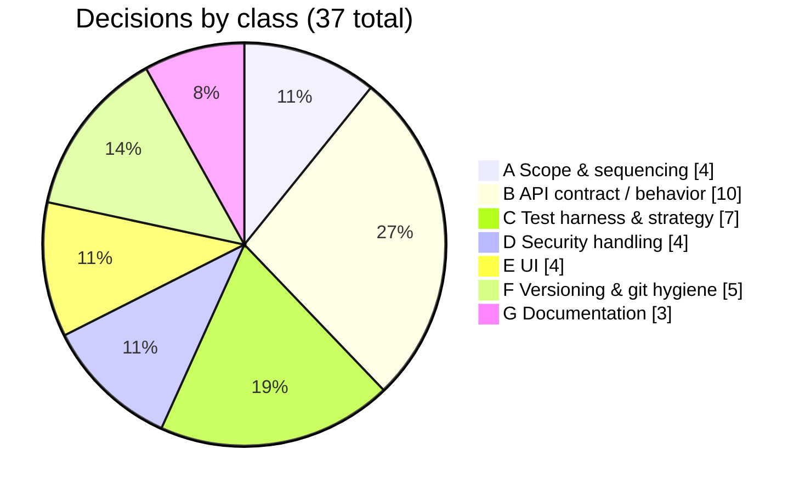
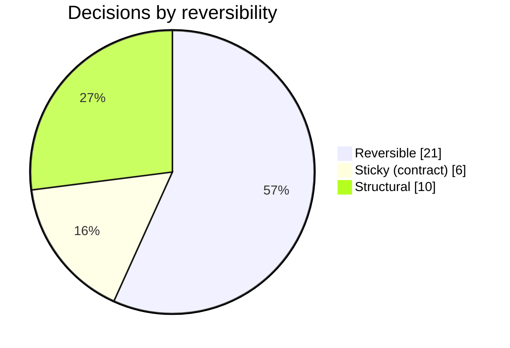
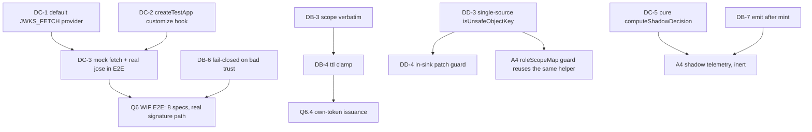

# Auth build execution - decisions, options, and rationale

> **What this is.** Every **autonomous judgment call** made while executing the 11-step authentication build - the forks where, in an interactive (non-autonomous) session, I would have stopped and asked you to **pick an option or state a preference**. Because the build ran under autonomous authority, I made each call myself; this doc records, for each one: the **question I would have asked**, the **options on the table**, the **option chosen**, **why**, its **reversibility**, and **where it landed** in the code/commit history.
>
> **Lens vs the other two companions.** This is the third doc of the build-introspection set:
> - [EXECUTION_LEDGER.md](EXECUTION_LEDGER.md) - *what shipped* (status per step).
> - [EXECUTION_ISSUES_AND_RCA.md](EXECUTION_ISSUES_AND_RCA.md) - *what went wrong and what was learned* (symptom -> RCA -> fix).
> - **this doc** - *what was decided and why* (question -> options -> choice -> rationale).
>
> Some decisions here resolved an issue from the RCA ledger (e.g. how to make `JWKS_FETCH` overridable is the *decision* whose *problem* is RCA I-01). The cross-links call those out, but the lens is different: the RCA doc asks "why did it break?"; this doc asks "given the fork, why this branch?".
>
> **Norms.** Carries the standard explanatory tools (Mermaid distribution + dependency diagrams, a master dashboard table, per-decision detail). No decision here was operator-directed - the operator-set constraints (never promote to prod, dev Azure is the ceiling, never force-push/amend-pushed/`--no-verify`, skip Q3/Q4/Q5) are **boundaries**, not decisions, and are listed in Section 7 for completeness.
>
> **Provenance / completeness.** This ledger was reconciled against the **full ~5,200-line session transcript** (per discipline D2), not in-context recollection alone. The first draft (33 decisions) was written from memory and skewed toward the steps nearest build-end; the transcript scan recovered **4 early-step decisions** the compaction summary had dropped - all from Pre-Q.B and A1: **DB-8** dev-key auto-generation, **DB-9** RFC 7638 `kid` thumbprint, **DB-10** the A1 orthogonal create-gate, and **DC-7** the `buildJwtModuleOptions` test-factory extraction (now **37 total**). The scan method: a decision-signal phrase pass (`instead of`, `rather than`, `chose`, `rejected`, `prefer`, `option`) plus reading the early-step source for forks the narration was terse about. One class of fork was deliberately **excluded** as not-my-decision: choices the architecture doc already dictated (e.g. "no new column - ride the profile JSONB", architecture section 6.2) are plan-given and listed in Section 7, not claimed here.

---

## 1. Methodology - how decisions are classified

Each decision carries a **class** (what kind of fork it was), a **reversibility** (how cheap it is to change later), and a **confidence** (how settled the choice is).

### 1.1 Decision classes

| Class | Meaning |
|---|---|
| **A - Scope & sequencing** | What to build now vs defer, and in what order |
| **B - API contract / behavior** | A choice that shapes the on-the-wire contract or runtime behavior |
| **C - Test harness & strategy** | How to make something testable, and at which layer |
| **D - Security handling** | How to treat a vulnerability class or scanner finding |
| **E - UI** | A user-facing surface choice |
| **F - Versioning & git hygiene** | Release-mechanics and version-control workflow |
| **G - Documentation** | Where and how to record the work |

### 1.2 Reversibility

| Reversibility | Definition | Change cost later |
|---|---|---|
| **Reversible** | A local/process choice with no external contract impact | cheap - edit and move on |
| **Sticky (contract)** | Shapes a published API/discovery/token contract a consumer may depend on | needs a compat story |
| **Structural** | An architecture/security/testability seam other code now depends on | refactor + re-test |

### 1.3 Distributions

---

## 2. Master dashboard

| ID | Decision (the fork) | Chose | Reversibility | Landed in |
|---|---|---|---|---|
| DA-1 | Per-step validation depth | Local per-step + batched Docker/Azure checkpoints | Reversible | ledger cadence note |
| DA-2 | When to fix the CodeQL findings | Separate `fix(security)` interstitial between A3 and Q6 | Reversible | ab943ab |
| DA-3 | Q6 internal order | API-first (validator -> provider -> issue -> discovery -> E2E -> live), then UI | Reversible | 8fe8b9b |
| DA-4 | A4 scope | Ship inert seams + shadow now (enforcement OFF), like A0 | Structural | 481bd38 |
| DB-1 | Token-endpoint error body | Keep the SCIM `{detail}` envelope; assert it; defer a raw-OAuth carve-out | Sticky | 3527df5 |
| DB-2 | Form-urlencoded acceptance | Targeted `*/oauth/token` content-type exemption + explicit `urlencoded` parser | Structural | 524e75e |
| DB-3 | WIF issued-token scope | Use the admin-configured trust `scope` verbatim (bypass caller-scope filter) | Sticky | 8fe8b9b |
| DB-4 | Issued-token TTL out-of-range | Clamp to the Entra 1-6h window (3600..21600) | Sticky | 8fe8b9b |
| DB-5 | WIF discovery scheme | Append only when flag ON and no enabled `wif-*` method already advertises it | Sticky | 8fe8b9b |
| DB-6 | Misconfigured WIF trust metadata | Fail closed (throw -> invalid_client), never silently accept | Structural | 8fe8b9b |
| DB-7 | Shadow-telemetry placement | Compute + log AFTER the token is minted, never before/inside | Structural | 481bd38 |
| DB-8 | Dev signing key when none configured (Pre-Q.B) | Auto-generate an ephemeral key + warn; default `RS256` | Reversible | 7baa330 |
| DB-9 | Signing-key `kid` derivation (Pre-Q.B) | Default to the RFC 7638 JWK thumbprint (stable), allow override | Sticky | 7baa330 |
| DB-10 | `wif` credential-create gate (A1) | Orthogonal: WIF rides its own `WifCredentialsEnabled`, not `PerEndpointCredentialsEnabled` | Sticky | 4956cb8 |
| DC-1 | Make `JWKS_FETCH` overridable | Register a behavior-preserving default provider | Structural | 8fe8b9b (RCA I-01) |
| DC-2 | E2E provider-override seam | Optional `customize(builder)` callback on `createTestApp` | Reversible | 8fe8b9b (RCA I-02) |
| DC-3 | WIF E2E signature path | Mock the JWKS fetch with a local RSA key; run real `jose` verify | Reversible | 8fe8b9b |
| DC-4 | Local E2E persistence backend | Default to inmemory; cover Prisma at the Docker checkpoint | Reversible | (RCA I-17) |
| DC-5 | Shadow-decision testability | Extract `computeShadowDecision` as a pure exported function | Structural | 481bd38 |
| DC-6 | Live-test section placement | Before `SECTION 10`, sequential ids `9z-AT` / `9z-AU` | Reversible | 8fe8b9b, 481bd38 |
| DC-7 | Production JWT config under test (Pre-Q.B) | Extract `buildJwtModuleOptions` as an exported factory | Reversible | 7baa330 |
| DD-1 | CodeQL injection alerts (68/184/235) | Fix in code with a guard | Structural | ab943ab |
| DD-2 | CodeQL bypass alerts (234/236) | Dismiss as false-positive with written justification | Reversible | (gh api) |
| DD-3 | Prototype-pollution guard shape | One single-source `isUnsafeObjectKey` helper at every sink | Structural | ab943ab |
| DD-4 | Patch-engine guard depth | Add an in-sink recheck behind the existing upstream path-guard | Structural | ab943ab |
| DE-1 | WIF "Test Connection" | Client-side readiness dry-run (authoritative check stays server-side) | Reversible | 8fe8b9b |
| DE-2 | WIF return values surfaced | Client ID + Token URL + SCIM URL (the 3-step setup mirror) | Reversible | 8fe8b9b |
| DE-3 | `WifCredentialsEnabled` UI | Add the SettingsTab Switch (10-cell flag-matrix completeness) | Reversible | 8fe8b9b |
| DE-4 | WIF input primitives | Reuse the R9 primitives, no hand-rolled inputs | Structural | 8fe8b9b |
| DF-1 | Version-bump granularity | Per-step alpha.N bump, including the security interstitial | Reversible | every step |
| DF-2 | Staging discipline | Stage files explicitly, never `git add -A` | Reversible | every commit |
| DF-3 | Fixing the clobbered operator paragraph | New corrective commit, not `--amend` | Reversible | 570cd2a |
| DF-4 | Commit-message format | Plain prose, no regex/special chars in `-m` | Reversible | (RCA I-15) |
| DF-5 | Shared-branch sync | Fetch + rebase the unpushed commit before push | Reversible | (RCA I-16) |
| DG-1 | RCA capture shape | One comprehensive per-build ledger, not scattered notes | Reversible | f3aeb3c |
| DG-2 | Central patterns doc home | `docs/strategy/` (cross-cutting), not `docs/auth/` or `docs/adr/` | Reversible | e971806 |
| DG-3 | This decisions doc home | `docs/auth/` single cluster doc, not many small ADRs | Reversible | (this doc) |

---

## 3. Decision dependency graph

A few early decisions enabled later ones. The most load-bearing chain is the test-harness seam that unlocked the whole WIF E2E:

The lesson the graph encodes: **a small testability decision (DC-1 + DC-2) is what made the highest-value security tests (the real-signature WIF E2E) possible at all.** Choosing the cheaper "just stub the validator" branch would have left the signature path unexercised.

---

## 4. Detailed catalog

Each entry: the **question** I would have asked -> the **options** -> the **choice** -> the **why** -> reversibility.

### Class A - Scope, sequencing, validation strategy

#### DA-1 - How deep should per-step validation go?

- **Question.** "Run the full 3-form-factor matrix (local + Docker + dev Azure) on every one of the 11 steps, or run local per-step and batch the Docker/Azure runs to checkpoints?"
- **Options.** (a) Full matrix every step; (b) local per-step + batched Docker/Azure at cluster boundaries; (c) only validate at the very end.
- **Chose.** (b).
- **Why.** Deploying all 11 steps individually to the **shared** dev Azure is disproportionate and would serialize other users behind my revisions. The steps are backend-agnostic or fully unit/E2E-covered, and Docker/Azure run identical code to local, so per-step local + batched integration checkpoints catches a parity break at the same place a per-step deploy would, at a fraction of the shared-environment cost. (c) was rejected because it defers all integration risk to one big-bang. Recorded as an explicit decision in the [ledger cadence note](EXECUTION_LEDGER.md).
- **Reversibility.** Reversible (a scheduling choice).

#### DA-2 - When to handle the CodeQL findings?

- **Question.** "CodeQL flagged 5 alerts mid-build. Fold the fixes into whichever step touched that code, fix them now as a standalone pass, or defer to the end?"
- **Options.** (a) Fold into A3/Q6; (b) a separate `fix(security)` interstitial commit between A3 and Q6; (c) defer to end of build.
- **Chose.** (b) - commit `ab943ab`.
- **Why.** The findings spanned multiple files (auto-expand, patch-engine) unrelated to the A3/Q6 feature diffs, so folding them in would have muddied a feature commit with cross-cutting security changes (bad for review + revert granularity). Deferring leaves a known vulnerability class open across several more commits. A standalone `fix(security):` commit keeps the security hardening atomic, separately revertable, and clearly attributable.
- **Reversibility.** Reversible (commit-organization choice).

#### DA-3 - Q6 internal build order?

- **Question.** "Q6 has an API core and a UI. Build API-first, UI-first, or interleave?"
- **Options.** (a) API-first (validator -> provider -> issuance -> discovery -> E2E -> live), then UI; (b) UI-first; (c) interleave.
- **Chose.** (a).
- **Why.** The UI consumes the API contract (the `wif` credential create + the discovery advertisement), so building the API first means the UI is wired against a real, tested contract rather than a guessed one. It also front-loads the security-critical surface (the validator) so it gets the most validation time.
- **Reversibility.** Reversible.

#### DA-4 - Should A4 ship now, inert?

- **Question.** "A4 is authorization seams whose enforcement is out of scope. Ship the seams now with enforcement OFF, or defer the whole step until enforcement is wanted?"
- **Options.** (a) Ship inert seams + shadow telemetry now (enforcement OFF); (b) defer A4 entirely.
- **Chose.** (a) - commit `481bd38`.
- **Why.** This mirrors the A0 precedent (the authentication-methods model shipped inert). Shipping the seams now means the persistence shape (`identityModel`/`roleScopeMap`/`grantedScopes`) and the "would-have-rejected" shadow telemetry are in place, so an operator can **observe** the future gate's impact on live traffic before anyone flips enforcement on - turning a future risky cutover into a data-informed one. Enforcement stays OFF so there is zero behavior change today.
- **Reversibility.** Structural (the persisted seam shape is now a contract, though enforcement-off keeps it safe to evolve).

### Class B - API contract / behavior

#### DB-1 - Token-endpoint error body shape

- **Question.** "The per-endpoint token endpoint throws RFC 6749 `{error}` errors, but the global SCIM exception filter rewraps them into `{detail}`. Carve the token endpoint out for a raw OAuth body, or accept the SCIM envelope?"
- **Options.** (a) Carve the token route out of the SCIM filter for a literal `{error, error_description}` body; (b) accept the SCIM `{detail}` envelope and assert that.
- **Chose.** (b) for now, with (a) documented as a future option.
- **Why.** No consumer yet requires the literal OAuth error shape, and the SCIM envelope is internally consistent across the whole `/scim` surface. Carving out one route would special-case the filter without a driving requirement. The tests assert the **actual** contract (`detail`), and the A3 error-catalog work is the natural place to revisit if a strict-OAuth client appears. (Related RCA: I-03.)
- **Reversibility.** Sticky (changing the body later is a contract change for whoever parses it).

#### DB-2 - How to accept form-urlencoded on the token route

- **Question.** "The SCIM content-type middleware 415s the form-urlencoded token POST. Exempt the path, move the route out from under `endpoints/*`, or disable the middleware?"
- **Options.** (a) Targeted regex carve-out for `*/oauth/token` + explicit `express.urlencoded` parser; (b) relocate the token route off the `endpoints/*` prefix; (c) loosen the middleware globally.
- **Chose.** (a) - commit `524e75e`.
- **Why.** The token endpoint is an OAuth surface living under a SCIM prefix; it legitimately needs the OAuth-standard form encoding while every real SCIM route keeps the strict `scim+json` rule. A scoped carve-out is the least-blast-radius option. (b) would break the clean per-endpoint URL hierarchy; (c) would weaken the RFC 7644 content-type guard for all routes. (Related RCA: I-04.)
- **Reversibility.** Structural (middleware behavior other routes rely on).

#### DB-3 - WIF issued-token scope

- **Question.** "When WIF mints the ISV's token, use the scope the admin configured on the trust verbatim, or filter it against the default allowed-scope set like the Q1 caller path does?"
- **Options.** (a) Verbatim admin-configured `scope`; (b) filter against the default allow-set.
- **Chose.** (a).
- **Why.** In WIF the scope is set by the **operator** on the trust record, not requested by the calling client, so it is already a trusted value - filtering it against a caller-oriented allow-set would be the wrong threat model and could silently drop a legitimately-configured scope. (The Q1 path filters because there the scope IS caller-supplied.)
- **Reversibility.** Sticky (the granted scope is in the issued token a resource server may check).

#### DB-4 - Out-of-range issued-token TTL

- **Question.** "`issuedTokenTtlSec` could be set to anything. Clamp it, reject out-of-range, or accept any value?"
- **Options.** (a) Clamp to the Entra 1-6h window (3600..21600); (b) reject out-of-range with an error; (c) accept any value.
- **Chose.** (a).
- **Why.** The Entra WIF spec is 1-6h; clamping keeps every issued token inside the safe window without failing an otherwise-valid mint over a misconfiguration. (b) turns a benign config slip into a hard failure; (c) would allow a 10-year token. Clamping is the forgiving-but-safe middle.
- **Reversibility.** Sticky (token lifetime is observable).

#### DB-5 - WIF discovery scheme advertisement

- **Question.** "When should `/ServiceProviderConfig` advertise the WIF scheme - always when the flag is on, or guard against duplicating a scheme an explicit `wif-*` method already advertises?"
- **Options.** (a) Append whenever `WifCredentialsEnabled` is on AND no enabled `wif-*` method already advertises it; (b) always append on flag; (c) never auto-append (require an explicit method).
- **Chose.** (a).
- **Why.** The flag and an explicit authentication-method are two routes to the same capability; appending unconditionally (b) could list the WIF scheme twice. Requiring an explicit method (c) would make the flag alone insufficient to surface the capability in discovery, contradicting the flag's purpose. The de-dup append advertises exactly once.
- **Reversibility.** Sticky (discovery output is a published contract).

#### DB-6 - Misconfigured WIF trust metadata

- **Question.** "If a `wif` credential's metadata is missing a required trust field, should the provider fail closed (reject) or treat it as not-mine and continue?"
- **Options.** (a) Fail closed - throw, mapping to `invalid_client`; (b) return null (not-mine-continue), letting the request fall through.
- **Chose.** (a).
- **Why.** A `wif` credential that exists but is malformed is a misconfiguration of *this* endpoint's trust, not an "I don't handle this" signal. Falling through (b) could let a request slip to a weaker acceptor or produce a confusing outcome. Failing closed is the secure default and surfaces the misconfiguration as a clear rejection.
- **Reversibility.** Structural (security posture).

#### DB-7 - Where to run the A4 shadow gate

- **Question.** "Compute the would-have-rejected shadow decision before minting, inside the mint, or after the token is already minted?"
- **Options.** (a) After mint; (b) before mint; (c) inside the issuance path.
- **Chose.** (a) - commit `481bd38`.
- **Why.** A4's whole contract is that the shadow gate is **computed but never enforced**. Emitting it strictly after the token is minted makes it structurally impossible for the shadow computation to influence what was issued - the safest possible placement for an intentionally-inert feature. (b)/(c) would create a code path where a future edit could accidentally let the shadow result gate issuance.
- **Reversibility.** Structural.

#### DB-8 - Dev signing key when none is configured (Pre-Q.B)

- **Question.** "When `OAUTH_JWT_PRIVATE_KEY` is not set, fail to boot, or auto-generate an ephemeral signing key? And what algorithm by default?"
- **Options.** (a) Auto-generate an ephemeral key at startup with a loud warning, default `RS256` (with `ES256` if `OAUTH_JWT_ALG=ES256`); (b) require the key and throw on boot if absent.
- **Chose.** (a) - commit `7baa330`.
- **Why.** This mirrors the **existing** `OAuthService` dev-secret pattern (auto-generate + warn in non-prod), so local dev and tests run with zero key setup while a startup warning makes the ephemerality obvious. Defaulting to `RS256` matches the most widely-supported verifier. Hard-failing (b) would block every local run and CI lane on env setup for no security gain in dev. The warning + the published JWKS make the trade-off visible; production sets the key for stable cross-restart verification.
- **Reversibility.** Reversible (a dev-only fallback; production behavior is unchanged when the key is set).

#### DB-9 - Signing-key `kid` derivation (Pre-Q.B)

- **Question.** "What `kid` does the JWKS/token header carry - a random value, a configured string, or one derived from the key?"
- **Options.** (a) Default to the **RFC 7638 JWK thumbprint** (a stable hash of the key's required members), allow `OAUTH_JWT_KID` override; (b) a random per-boot `kid`; (c) require an explicit configured `kid`.
- **Chose.** (a) - commit `7baa330`.
- **Why.** A thumbprint `kid` is **stable for a given key**, so a verifier caching keys by `kid` stays valid across restarts as long as the key is unchanged - exactly the JWKS-rotation contract `jose` expects. A random per-boot `kid` (b) would needlessly invalidate verifier caches every restart; requiring config (c) adds setup friction with no benefit over the derived default. The override preserves operator control.
- **Reversibility.** Sticky (the `kid` is published in the JWKS and stamped in every token header; verifiers may key their cache on it).

#### DB-10 - `wif` credential-create gate (A1)

- **Question.** "Should creating a `wif` credential require the existing `PerEndpointCredentialsEnabled` flag, or its own flag?"
- **Options.** (a) Orthogonal - WIF rides a dedicated `WifCredentialsEnabled` flag, independent of the bcrypt-bearer gate; (b) reuse `PerEndpointCredentialsEnabled` for both.
- **Chose.** (a) - commit `4956cb8`.
- **Why.** WIF and per-endpoint bcrypt bearers are **independent capabilities** an operator may want one of without the other (e.g. enable federated identity without opening generic per-endpoint bearer creation). Coupling them (b) would force an operator to enable bearer credentials just to use WIF, widening the surface unnecessarily. Two orthogonal flags express the two capabilities precisely; the RED test that proved it (a `wif` create rejected by the bearer gate before the fix) locks the orthogonality.
- **Reversibility.** Sticky (the gating flag an operator configures is a behavior contract).

### Class C - Test harness & strategy

#### DC-1 - Make `JWKS_FETCH` overridable in tests

- **Question.** "The E2E needs to mock the JWKS fetch, but the optional `JWKS_FETCH` token has no provider so `overrideProvider` is a no-op. Register a default provider, drop the `@Optional()` and require injection, or jest-mock `globalThis.fetch`?"
- **Options.** (a) Register a behavior-preserving default provider (`useFactory: () => globalThis.fetch.bind(globalThis)`); (b) make the dependency required (remove `@Optional()`); (c) jest module-mock the global fetch.
- **Chose.** (a) - commit `8fe8b9b`.
- **Why.** (a) keeps production behavior identical (the default factory returns the same `globalThis.fetch` the `?? globalThis.fetch` fallback used) while giving tests a real binding to override. (b) would force every production caller to wire the fetch explicitly - a wider blast radius. (c) is brittle and global, leaking across suites. (This is the *decision*; the *problem* it fixes is RCA I-01.)
- **Reversibility.** Structural (DI wiring others depend on).

#### DC-2 - E2E provider-override seam

- **Question.** "`createTestApp` compiles the module internally with no extension point. How do I let one spec override a provider without breaking the other callers?"
- **Options.** (a) Add an optional `customize(builder)` callback applied before `.compile()`; (b) export the raw `TestingModuleBuilder`; (c) add a second test-app factory variant.
- **Chose.** (a) - commit `8fe8b9b`.
- **Why.** An optional callback is fully backward-compatible (existing callers pass nothing) and keeps the single bootstrap path, so the production-middleware mirroring stays in one place. (b) leaks the builder lifecycle to callers; (c) duplicates the bootstrap and risks drift between the two. (Related RCA: I-02.)
- **Reversibility.** Reversible (test-only helper).

#### DC-3 - WIF E2E signature path

- **Question.** "How real should the WIF E2E's signature verification be - mock the whole validator, mock just the network with a real key, or hit a real IdP?"
- **Options.** (a) Mock the JWKS fetch with a locally-generated RSA key and run the real `jose` verify; (b) stub the entire `WifAssertionValidatorService`; (c) call a real Entra/IdP JWKS.
- **Chose.** (a).
- **Why.** (a) exercises the **real** signature + algorithm-pin + claims path end-to-end (the security-critical code) while staying hermetic and network-free. (b) would leave the actual validation logic unexercised at the E2E layer - a false-green risk. (c) makes the suite flaky and externally dependent.
- **Reversibility.** Reversible.

#### DC-4 - Local E2E persistence backend

- **Question.** "Run local E2E against Postgres/Prisma or the in-memory backend?"
- **Options.** (a) inmemory (`PERSISTENCE_BACKEND=inmemory`); (b) Prisma + a local Postgres.
- **Chose.** (a) for local; Prisma is covered at the Docker checkpoint.
- **Why.** inmemory needs no DB, so local E2E runs anywhere and fast; the Prisma path is fully exercised at the Docker compose checkpoint where Postgres is part of the stack, and the cross-backend parity gate guarantees they agree. (Related RCA: I-17.)
- **Reversibility.** Reversible.

#### DC-5 - Shadow-decision testability

- **Question.** "Implement the would-have-rejected computation inline in the provider, or extract it as a standalone pure function?"
- **Options.** (a) Pure exported `computeShadowDecision(input)`; (b) inline in `mintFromAssertion`.
- **Chose.** (a) - commit `481bd38`.
- **Why.** A pure function with `enforced` hard-coded `false` is unit-testable in isolation (9 focused tests) and makes the inert contract self-evident from the signature. Inlining it would entangle the shadow logic with the issuance path - harder to test and easier to accidentally wire into enforcement later.
- **Reversibility.** Structural (testability seam).

#### DC-6 - Live-test section placement

- **Question.** "Where do the new live-test sections go and how are they identified?"
- **Options.** (a) Before `TEST SECTION 10` (cleanup), sequential ids `9z-AT` / `9z-AU`; (b) at the end after cleanup; (c) interleaved by topic.
- **Chose.** (a).
- **Why.** It matches the established convention already in `live-test.ps1` (new sections precede the delete/cleanup section, with sequential `9z-A*` ids and dedicated resources cleaned up in-section), so the file stays predictable and the final cleanup still runs last.
- **Reversibility.** Reversible.

#### DC-7 - Production JWT config under test (Pre-Q.B)

- **Question.** "The `JwtModule` is configured inline in the OAuth module. How do I get the **production** signing config (algorithm pin, `kid`, issuer) under test rather than re-deriving it in the spec?"
- **Options.** (a) Extract the config as an exported `buildJwtModuleOptions(keys)` factory the module and the unit test both call; (b) test against a hand-rolled config in the spec; (c) only test through E2E.
- **Chose.** (a) - commit `7baa330`.
- **Why.** Extracting the factory means the test exercises the **exact** object the module ships (the algorithm allowlist that is the alg-confusion defense), so a regression in the production config fails a fast unit test - not just an E2E. A spec-local config (b) tests a copy that can silently drift from production; E2E-only (c) is slow and gives a coarse signal for a security-critical config. The existing OAuth specs already mock `JwtService`, so they stay insulated.
- **Reversibility.** Reversible (an exported helper; no contract change).

### Class D - Security handling

#### DD-1 - CodeQL injection alerts (68 / 184 / 235)

- **Question.** "These three `js/remote-property-injection` alerts - fix in code, dismiss, or inline-suppress?"
- **Options.** (a) Fix in code with a prototype-pollution guard; (b) dismiss; (c) inline `// codeql` suppression.
- **Chose.** (a) - commit `ab943ab`.
- **Why.** They are **real** sinks (`obj[userKey] = value` where `userKey` can be `__proto__`). Dismissing or suppressing a real finding hides a genuine CWE-1321 vector. Fixing at the sink removes the vulnerability and auto-closes the alert on the next scan.
- **Reversibility.** Structural (security).

#### DD-2 - CodeQL bypass alerts (234 / 236)

- **Question.** "These two `js/user-controlled-bypass` alerts sit on positive allowlist checks - fix, dismiss, or leave open?"
- **Options.** (a) Dismiss as false-positive with written justification; (b) attempt a code change; (c) leave open.
- **Chose.** (a).
- **Why.** They sit on positive allowlists (`KNOWN_METHOD_TYPES`, the secret-strip content filter) that **throw on unknown input** - defense-in-depth filters, not bypassable authorization gates, so there is nothing to "fix". Leaving them open (c) erodes the signal-to-noise of the alert list. Dismissing with a recorded rationale is the honest classification. (Related RCA: I-11/I-12 captured the tooling friction of *doing* the dismissal.)
- **Reversibility.** Reversible (a dismissal can be reopened if the allowlist semantics ever change).

#### DD-3 - Prototype-pollution guard shape

- **Question.** "Guard the sinks with a single shared helper, per-site inline checks, or by switching the data structures (`Object.create(null)` / `Map`)?"
- **Options.** (a) One single-source `isUnsafeObjectKey` helper used at every sink; (b) inline `if (k === '__proto__' ...)` at each site; (c) migrate the objects to null-prototype / `Map`.
- **Chose.** (a) - commit `ab943ab`.
- **Why.** A single source for the `__proto__`/`constructor`/`prototype` deny-set means a new sink only needs to call the same function, and the policy is auditable in one place. Inline checks (b) drift and get copy-pasted inconsistently. (c) is a larger, riskier refactor of working data paths for the same protection.
- **Reversibility.** Structural.

#### DD-4 - Patch-engine guard depth

- **Question.** "The patch engine already has an upstream `guardPrototypePollution(path)`. Is an in-sink recheck redundant?"
- **Options.** (a) Add an in-sink `DANGEROUS_KEYS` recheck behind the upstream guard; (b) rely on the upstream guard alone.
- **Chose.** (a) - commit `ab943ab`.
- **Why.** The upstream guard validates a **path string**; the actual write happens on a **final key** that a future refactor could reach by another route. Defense in depth at the sink makes the protection hold regardless of how the key arrives - the same reasoning CodeQL applies when it still flags the sink.
- **Reversibility.** Structural.

### Class E - UI (Q6.5)

#### DE-1 - WIF "Test Connection"

- **Question.** "Should Test Connection do a real server-side dry-run of the assertion path, or a client-side readiness check?"
- **Options.** (a) Client-side readiness dry-run (validate the fields are present + well-formed, e.g. https JWKS); (b) a new server-side dry-run endpoint.
- **Chose.** (a), with the authoritative validation explicitly noted as server-side at the token endpoint.
- **Why.** A client-side readiness check gives the admin immediate per-field feedback without a new server surface, and the **real** validation already happens server-side when a real assertion is presented - so a server dry-run endpoint would duplicate that logic and add an attack surface for marginal benefit. The UI clearly states the authoritative check is server-side.
- **Reversibility.** Reversible (can add a server dry-run later if wanted).

#### DE-2 - WIF return values surfaced

- **Question.** "Which values does the UI show back to the admin after saving a WIF trust?"
- **Options.** Show some subset of {Client ID, Token URL, SCIM URL, raw trust JSON, ...}.
- **Chose.** Client ID + Token URL + SCIM URL (plus the whole trust grabbable via `CopyJsonButton`).
- **Why.** Those three are exactly what the admin must hand to their identity provider to complete the federation (the doc's three-step setup), so surfacing precisely them - each copyable - matches the real task. No secret is among them (WIF stores none).
- **Reversibility.** Reversible.

#### DE-3 - `WifCredentialsEnabled` UI cell

- **Question.** "Surface the `WifCredentialsEnabled` flag as a SettingsTab Switch, or leave it config-only?"
- **Options.** (a) Add the Switch to the `BOOLEAN_FLAGS` list; (b) config-only (API/CLI).
- **Chose.** (a).
- **Why.** The repo's flag discipline is a 10-cell matrix per flag that includes a UI Switch + a vitest; leaving WIF config-only would make it the one flag an operator can't toggle in the UI, an inconsistency. Adding the Switch completes the matrix.
- **Reversibility.** Reversible.

#### DE-4 - WIF input primitives

- **Question.** "Build the WIF form with hand-rolled inputs or the R9 copy/undo/reset primitives?"
- **Options.** (a) Reuse `EditableField` / `CopyableField` / `CopyJsonButton`; (b) hand-roll inputs + copy buttons.
- **Chose.** (a).
- **Why.** R9 is a standing rule - every editable field and display value goes through the primitives so copy/undo/redo/reset behave identically everywhere. Hand-rolling would violate the rule and re-introduce the inconsistent-copy-affordance problem R9 exists to prevent.
- **Reversibility.** Structural (norm-enforced).

### Class F - Versioning & git hygiene

#### DF-1 - Version-bump granularity

- **Question.** "Bump the alpha version once at the end, only on feature steps, or on every step including the security interstitial?"
- **Options.** (a) Per-step bump incl. the interstitial; (b) one bump at the end; (c) feature-steps only.
- **Chose.** (a) - alpha.1 through alpha.12.
- **Why.** A per-step bump makes each commit independently identifiable and deployable, and gives the CHANGELOG a clean one-entry-per-step history. The security interstitial got its own bump (alpha.10) because it shipped real code, not just docs. (b)/(c) would make several commits share a version, muddying traceability.
- **Reversibility.** Reversible.

#### DF-2 - Staging discipline

- **Question.** "Stage with `git add -A` for speed, or list files explicitly?"
- **Options.** (a) Explicit per-file staging; (b) `git add -A`.
- **Chose.** (a).
- **Why.** The working tree carried pre-existing files that were not mine (a web snapshot, unrelated docs). `git add -A` would sweep those into my commit. Explicit staging guarantees each commit contains exactly the intended change - and is a standing repo rule.
- **Reversibility.** Reversible.

#### DF-3 - Fixing the clobbered operator paragraph

- **Question.** "My commit accidentally overwrote a paragraph the operator had committed in parallel. Amend my commit, or add a corrective commit?"
- **Options.** (a) New corrective commit restoring the paragraph; (b) `git commit --amend`.
- **Chose.** (a) - commit `570cd2a`.
- **Why.** The operator's hard rules forbid `--amend` (and the commit chain was already pushed-adjacent). A new commit preserves the full audit trail of what happened and why - itself a useful record of the parallel-edit clobber.
- **Reversibility.** Reversible.

#### DF-4 - Commit-message format

- **Question.** "Can commit `-m` bodies contain the regex/patterns being described?"
- **Options.** (a) Plain prose, describe patterns in words; (b) paste the literal regex/special chars.
- **Chose.** (a).
- **Why.** PowerShell's parser split a message containing `|`, `(`, `)` and nested quotes into pathspec arguments (a real failure). Plain prose avoids the shell-metacharacter trap entirely. (Related RCA: I-15.)
- **Reversibility.** Reversible.

#### DF-5 - Shared-branch sync before push

- **Question.** "`feat/wif` advanced on the remote while I worked. Merge, rebase, or force?"
- **Options.** (a) Fetch + rebase my unpushed commit onto the remote; (b) merge the remote in; (c) force-push.
- **Chose.** (a).
- **Why.** Rebasing an **unpushed** commit is safe (it rewrites nothing already published) and keeps a linear history; the pre-push hook then re-runs the gates on the rebased result. (c) is forbidden by the operator rules and would clobber the parallel work; (b) adds noise merge commits for a one-commit delta. (Related RCA: I-16.)
- **Reversibility.** Reversible.

### Class G - Documentation

#### DG-1 - RCA capture shape

- **Question.** "Record issues as one comprehensive per-build ledger, scattered per-step notes, or inline-in-commit only?"
- **Options.** (a) One comprehensive `EXECUTION_ISSUES_AND_RCA.md`; (b) per-step RCA notes; (c) inline commit bodies only.
- **Chose.** (a) - commit `f3aeb3c`.
- **Why.** A single ledger makes the cross-cutting view (distribution by type, escape analysis, per-step density) possible, which scattered notes cannot. Inline-only would scatter the learning across commit history where no one reviews it as a set.
- **Reversibility.** Reversible.

#### DG-2 - Central patterns doc home

- **Question.** "Where does the cross-cutting self-improving patterns doc live - `docs/auth/`, `docs/adr/`, or `docs/strategy/`?"
- **Options.** (a) `docs/strategy/`; (b) `docs/auth/`; (c) `docs/adr/`.
- **Chose.** (a) - commit `e971806`.
- **Why.** The patterns generalize beyond auth (they apply to any feature), so co-locating with the auth cluster (b) would mis-scope it. `docs/adr/` (c) is for single point-in-time architecture decisions, not a living continually-updated ledger. `docs/strategy/` already houses the Stage X audits it pairs with.
- **Reversibility.** Reversible.

#### DG-3 - This decisions doc's home

- **Question.** "Record these decisions as one cluster doc or as many small ADRs under `docs/adr/`?"
- **Options.** (a) One `docs/auth/` cluster doc (this file); (b) ~33 individual ADRs under `docs/adr/`.
- **Chose.** (a).
- **Why.** These decisions are an **interlinked build cluster** (Section 3 shows the dependencies), best read together as the companion to the status + RCA ledgers - not 33 independent point decisions. The ADR pattern fits a standalone, long-lived architecture choice (like ADR-004); a build's worth of tactical forks fits a single cluster doc co-located with its siblings.
- **Reversibility.** Reversible.

---

## 5. Confidence and what would change a choice

| Decision | Confidence | What would flip it |
|---|---|---|
| DB-1 (SCIM error envelope) | Medium | A strict-RFC-6749 client that parses `error` -> carve the token route out |
| DB-3 (scope verbatim) | High | Only if scope ever becomes caller-supplied in WIF (it is not) |
| DB-4 (ttl clamp) | High | A product need for tokens outside 1-6h -> make the window configurable |
| DA-1 (batched validation) | High | A step that is NOT backend-agnostic -> that step needs a per-step deploy |
| DC-4 (inmemory local E2E) | High | A bug only reproducible on Prisma -> add a local Prisma E2E lane |
| DE-1 (client-side Test Connection) | Medium | Operator demand for a true server dry-run -> add a dry-run endpoint |

---

## 6. Cross-link map (decision -> the issue or step it relates to)

| Decision | Related RCA issue | Related step |
|---|---|---|
| DC-1, DC-2 | I-01, I-02 | Q6 |
| DB-1 | I-03 | Q1 |
| DB-2 | I-04 | A3 |
| DD-1..DD-4 | I-10 | security interstitial / A4 |
| DD-2 | I-11, I-12 | security interstitial |
| DC-4 | I-17 | every E2E |
| DF-4 | I-15 | checkpoint |
| DF-5 | I-16 | mid-build |
| (live-test assertion) | I-05 | checkpoint |

---

## 7. Operator-set boundaries (NOT decisions - listed for completeness)

These were constraints the operator set; I did not choose them, I worked within them:

- **Never promote to prod** - dev Azure was the validation ceiling for the entire build.
- **Never `git push --force`, never `--amend` a pushed commit, never `--no-verify`.**
- **Q3 / Q4 / Q5 DEFERRED** - skipped unless explicitly requested.
- **Run autonomously; 3 fix attempts then mark BLOCKED** - the error-handling envelope I operated in.
- **Do not revert the multer 2.1.1 -> 2.2.0 bump** that landed via a parallel `master` merge.

And these were **plan-given** (dictated by the architecture/design docs, not chosen by me during execution):

- **Persistence: "no new column"** - `profile.authentication` and the WIF trust ride the existing profile JSONB + `EndpointCredential` table ([architecture section 6.2](AUTHENTICATION_ARCHITECTURE.md)). I implemented it; I did not decide it.
- **A0/A4 ship inert** - the "model/seams first, enforcement later" staging is the plan's backbone strategy; the *tactical* call DA-4 (ship A4 now vs defer the step) was mine, but the inert-first pattern was given.
- **The 11-step sequence + critical path** - `Pre-Q.B -> {Q1 || Q2} -> A3 -> Q6 -> A4` came from the reconciled plan; DA-1/DA-3 are my choices *within* it.

---

## 8. References

- Status, per step: [EXECUTION_LEDGER.md](EXECUTION_LEDGER.md)
- Issues + RCA: [EXECUTION_ISSUES_AND_RCA.md](EXECUTION_ISSUES_AND_RCA.md)
- Cross-cutting patterns these decisions seeded: [docs/strategy/ENGINEERING_LESSONS_AND_PATTERNS.md](../strategy/ENGINEERING_LESSONS_AND_PATTERNS.md)
- The reconciled plan the build executed: [AUTHENTICATION_ARCHITECTURE.md section 13](AUTHENTICATION_ARCHITECTURE.md#13-step-by-step-execution-plan--estimates--dependencies)
- Long-lived single-decision ADR precedent: [docs/adr/ADR-004-enable-implicit-conversion.md](../adr/ADR-004-enable-implicit-conversion.md)
