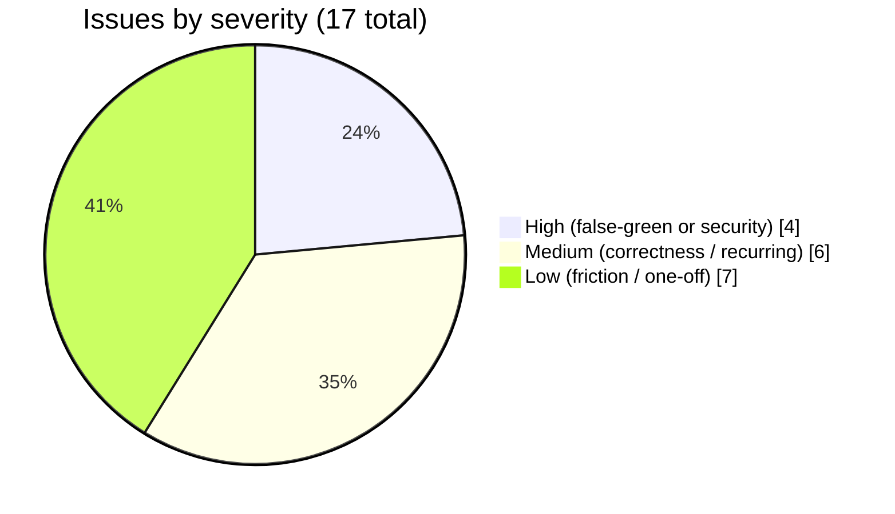
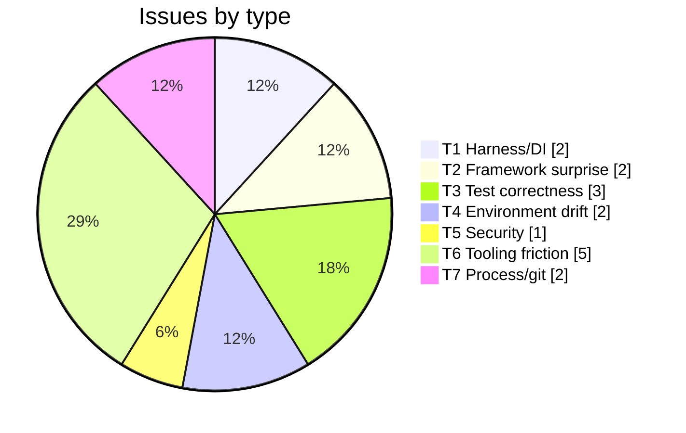
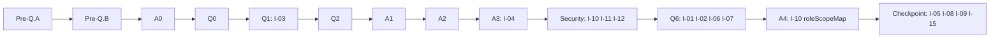

# Auth build execution - issues, root-cause analysis, and fixes

> **What this is.** A complete, introspective ledger of EVERY issue of EVERY type encountered while executing the reconciled 11-step authentication build ([AUTHENTICATION_ARCHITECTURE.md section 13](AUTHENTICATION_ARCHITECTURE.md#13-step-by-step-execution-plan--estimates--dependencies)), from Pre-Q.A through A4 plus the interstitial security pass and the final 3-form-factor checkpoint. For each issue it records the **symptom**, the **root-cause analysis (RCA)**, the **fix**, **why that fix works**, and the **prevention** (the gate or convention that stops the next one).
>
> **Why it exists.** None of these issues appear in the planning / design / architecture docs, because they arise from unforeseen combinations of circumstances (framework defaults, environment drift, tooling quirks, test-harness gaps) that the design stage cannot anticipate. Capturing them is how the gate set self-densifies over time - it is the concrete artifact behind the [self-improvement discipline (R7)](../../.github/copilot-instructions.md). This doc is the companion to the [EXECUTION_LEDGER.md](EXECUTION_LEDGER.md) (which tracks *what shipped*) and the [EXECUTION_DECISIONS_AND_RATIONALE.md](EXECUTION_DECISIONS_AND_RATIONALE.md) (which tracks *what was decided and why*); this one tracks *what went wrong on the way and what we learned*.
>
> **Provenance / completeness.** This ledger was reconciled against the **full 4,666-line session transcript** of the build (not just in-context recollection): a systematic scan for error/RED/fix/rejection signals across every step, plus a narration-phrase pass (`false positive`, `root cause`, `no-op`, `silently`, etc.). That scan surfaced **no substantive issue not already listed below** - every diagnosed problem in the transcript maps to one of the 17 entries. The early backbone/enabling steps (Pre-Q.A -> A2) genuinely had low issue density because they reused established patterns; the clusters are at Q6 (new external-dependency + test-harness surface) and the final checkpoint (environment drift + the live-only test bug). One verified-and-dismissed non-issue: the `jose` ESM-only constraint (Q2) was an *anticipated design choice* (dynamic `import('jose')`), not a failure - it loaded cleanly in jest on the first RED run.
>
> **Method note (now a standing discipline).** This doc was retrofitted at build end, which is why one recurrence count was initially understated (~50x lint-ceiling churn first recorded as "3+"). The standing fix is disciplines **D1 (capture each RCA at fix-confirmation time)** and **D2 (reconcile against the full transcript at build end)** in [docs/strategy/ENGINEERING_LESSONS_AND_PATTERNS.md](../strategy/ENGINEERING_LESSONS_AND_PATTERNS.md#2-maintenance-protocol-the-three-disciplines) - future ledgers are written incrementally so compaction cannot erode fidelity. The generalizable patterns from this build are promoted into that central doc (PA-1, PA-2, PB-1, PC-1, PD-1, PE-1/2/3).

---

## 1. Methodology - how issues are classified

Every issue is tagged with a **type**, a **severity**, the **step** it surfaced in, and the **detection stage** (which quality gate caught it). The most valuable column is **detection stage vs earliest-possible**: when a gate catches an issue LATER than it could have, that delta is itself a finding.

### 1.1 Type taxonomy

| Type | Meaning | Example |
|---|---|---|
| **T1 Harness/DI** | Test infrastructure or dependency-injection wiring gap that makes a test lie or fail to run | An optional DI token with no default provider silently ignores its test override |
| **T2 Framework surprise** | A framework default behaved differently than the design assumed | NestJS wraps a thrown error into a different envelope shape |
| **T3 Test correctness** | The test (not the product) was wrong - a false positive or a false green | A loose substring regex matches a legitimate field name |
| **T4 Environment drift** | A value differs between local / Docker / Azure form factors | The Docker OAuth secret is not the local default |
| **T5 Security finding** | A real vulnerability class surfaced by a scanner or review | CWE-1321 prototype pollution at an object-write sink |
| **T6 Tooling friction** | A CLI / shell / API quirk that blocked or corrupted an operation | A REST API rejecting an over-length comment field |
| **T7 Process/git** | A workflow / version-control / environment-prep step that bit | A remote branch advancing mid-work; a backend needing a DB |

### 1.2 Severity

| Severity | Definition |
|---|---|
| **High** | Could have shipped a real defect OR produced a false-green gate (a passing test that proves nothing) |
| **Medium** | Real product or contract correctness issue caught before ship; or a recurring friction that costs material time |
| **Low** | One-off friction, cosmetic, or environment-prep; no risk of shipping a defect |

### 1.3 Severity distribution



### 1.4 Type distribution



---

## 2. Master dashboard

| ID | Title | Type | Sev | Step | Detected at | Status | Fix |
|---|---|---|---|---|---|---|---|
| I-01 | `JWKS_FETCH` test override silently no-op (optional DI token unbound) | T1 | High | Q6 | Stage 2 (E2E) | Fixed | 8fe8b9b |
| I-02 | `createTestApp` had no provider-override hook | T1 | Medium | Q6 | Stage 2 (E2E) | Fixed | 8fe8b9b |
| I-03 | SCIM exception filter rewraps OAuth `{error}` into `{detail}` | T2 | Medium | Q1 | Stage 2 (E2E) | Adapted | 3527df5 |
| I-04 | `415` on form-urlencoded token POST (content-type middleware) | T2 | Medium | A3 | Stage 2 (E2E) | Fixed | 524e75e |
| I-05 | Loose `token|clientSecret|credentialHash` regex false-matched `issuedTokenTtlSec` | T3 | High | Q6/checkpoint | Stage 4 (Docker) | Fixed | ffc4133 |
| I-06 | Recurring unnecessary-type-assertion lint warnings in specs | T3 | Low | many | Stage 1 (lint) | Fixed (xN) | each step |
| I-07 | TS cast errors needing `as unknown as` (JWK, EndpointCredentialModel) | T3 | Low | Q6 | Stage 1 (tsc) | Fixed | 8fe8b9b |
| I-08 | Docker compose OAuth secret is `devscimclientsecret`, not `changeme-oauth` | T4 | Medium | checkpoint | Stage 4 (Docker) | Documented | (runner arg) |
| I-09 | `/health` 404 on Docker (wrong health path assumption) | T4 | Low | checkpoint | Stage 4 (Docker) | Worked around | n/a |
| I-10 | CWE-1321 prototype pollution at 4 object-write sinks | T5 | High | security/A4 | CodeQL (async) | Fixed | ab943ab, 481bd38 |
| I-11 | CodeQL `dismissed_comment` 280-char limit (HTTP 422) | T6 | Low | security | Stage 3 (triage) | Worked around | n/a |
| I-12 | `gh api` PATCH broke `ConvertFrom-Json` (non-JSON warning on pipe) | T6 | Low | security | Stage 3 (triage) | Worked around | n/a |
| I-13 | Ledger run-log append: trailing whitespace defeats `replace_string` | T6 | Low | every step | authoring | Convention | `Add-Content` |
| I-14 | Terminal cwd drift -> `jest`/`vitest` from repo root hangs | T6 | Medium | many | authoring | Convention | explicit `cd` |
| I-15 | `git commit -m` special chars (`|` `(` `)` `"`) mis-parsed -> pathspec error | T6 | Low | checkpoint | committing | Convention | plain message |
| I-16 | Remote `feat/wif` advanced mid-work (multer 2.1.1 -> 2.2.0) | T7 | Low | mid-build | push | Convention | fetch+rebase+`npm ci` |
| I-17 | E2E needs Postgres unless `PERSISTENCE_BACKEND=inmemory` | T7 | Low | every E2E | first E2E run | Convention | env var |

> The `Fix` column lists the commit that carries the fix where one exists; "Convention"/"Documented"/"Worked around" mean the resolution was a practice or a one-time action rather than a code change.

---

## 3. Detection-stage escape analysis

The single most useful introspection: did the gate that caught each issue catch it as early as it could have?

| ID | Caught at | Earliest gate that COULD have caught it | Escape delta | Why it escaped earlier gates |
|---|---|---|---|---|
| I-01 | Stage 2 E2E (accept test 401'd) | Stage 2 E2E | none | Surfaced immediately as a RED on the first accept test - the cost was debug time, not an escape. |
| I-05 | Stage 4 Docker live | Stage 4.3 **local-node** live (per-step) | one stage | Q6 batched ALL live-tests to the integration checkpoint, so the 9z-AT section was authored but never executed against a live node until Docker. A per-step local-node live run would have caught it one stage earlier. |
| I-08 | Stage 4 Docker live | Stage 4.2 (first compose run) | none | Genuine first-contact discovery, not an escape - the secret value simply differs by environment. |
| I-10 | CodeQL async scan | Stage 1 SAST (CodeQL per-PR) | none | CodeQL is the SAST gate; it fired on schedule. The A0-A3 code added 3 new sinks; pre-existing sinks were already tracked. |

**Headline lesson (I-05):** batching live-tests to a checkpoint defers the discovery of *live-only test bugs*. The standing per-step norm ("local-node live after each step") exists precisely to avoid this; Q6 traded it for batch efficiency and paid one stage of latency. Reinforced in [Section 7](#7-self-improvement-actions).

---

## 4. Detailed catalog

### T1 - Test-harness / DI wiring

#### I-01 (High) - `JWKS_FETCH` test override silently no-op

- **Symptom.** The Q6 WIF E2E ([wif-assertion.e2e-spec.ts](../../api/test/e2e/wif-assertion.e2e-spec.ts)) injected a mocked JWKS `fetch` via `overrideProvider(JWKS_FETCH).useValue(fetchMock)`, but the two "accept" tests returned `401 invalid_client`. The server log showed `JWKS fetch returned HTTP 400` - the **real** `globalThis.fetch` was hitting the live Microsoft URL, not the mock.
- **Root cause.** [ExternalJwksValidatorService](../../api/src/oauth/external-jwks-validator.service.ts) declares the fetch dependency as `@Optional() @Inject(JWKS_FETCH) fetchFn?: typeof fetch` and falls back to `this.fetchFn ?? globalThis.fetch`. In NestJS, `overrideProvider(TOKEN)` only *replaces an existing provider binding*. Because `JWKS_FETCH` was never registered as a provider in any module (it was a pure optional token), there was nothing to override - the override resolved to nothing, the injected value stayed `undefined`, and the `?? globalThis.fetch` fallback ran the real network call. The override was **silently ignored**.
- **Fix.** Register a default provider for the token in [oauth.module.ts](../../api/src/oauth/oauth.module.ts):
  ```ts
  { provide: JWKS_FETCH, useFactory: () => globalThis.fetch.bind(globalThis) }
  ```
- **Why the fix works.** There is now a real binding for `JWKS_FETCH`, so `overrideProvider(JWKS_FETCH)` has a target to replace. Production behavior is unchanged: the default factory returns the same `globalThis.fetch` the `?? globalThis.fetch` fallback used, so the only effect is that the token is now overridable in tests.
- **Prevention.** New convention: **any `@Optional()` DI token that a test will override MUST have a default provider registered in its module.** An unbound optional token cannot be overridden - the override is a no-op and the test exercises production wiring while appearing to mock it. Proposed as a standing rule in [Section 7](#7-self-improvement-actions).

#### I-02 (Medium) - `createTestApp` had no provider-override hook

- **Symptom.** There was no way for the WIF E2E to override `JWKS_FETCH` because [app.helper.ts](../../api/test/e2e/helpers/app.helper.ts) `createTestApp()` compiled the testing module internally with no extension point.
- **Root cause.** The helper hard-coded `Test.createTestingModule({ imports: [AppModule] }).compile()` with no callback to mutate the builder.
- **Fix.** Added an optional `customize?: (builder: TestingModuleBuilder) => TestingModuleBuilder` parameter; when present it is applied before `.compile()`. Backward compatible (all existing callers pass nothing).
- **Why the fix works.** The override (`builder => builder.overrideProvider(JWKS_FETCH).useValue(fetchMock)`) now runs against the same builder that compiles the app, so the binding (added by I-01's fix) is replaced before instantiation.
- **Prevention.** Shared E2E bootstrap helpers should expose a builder-customize seam from day one; retrofitting one mid-feature is a sign the harness was under-designed for testability.

### T2 - Framework-behavior surprises

#### I-03 (Medium) - SCIM exception filter rewraps OAuth `{error}` into `{detail}`

- **Symptom.** The per-endpoint token endpoint throws RFC 6749 section 5.2 errors as `{ error: 'invalid_client', error_description: ... }`, but the E2E and live assertions for those errors had to check `res.body.detail === 'invalid_client'`, not `res.body.error`.
- **Root cause.** The global [ScimExceptionFilter](../../api/src/modules/scim/filters/scim-exception.filter.ts) catches every `HttpException` and reformats it into the SCIM error envelope (`{ schemas, detail, status }`). The token endpoint rides the same filter, so its OAuth-shaped body is rewrapped: the `error` string lands in `detail`.
- **Resolution (adapt, not fix).** This is acceptable behavior for the current scope - the token endpoint shares the SCIM envelope. The tests were written to assert the *actual* contract (`detail`) rather than the *assumed* one (`error`). A future step (the A3 error catalog) can carve the token endpoint out of the SCIM filter if a raw OAuth body is required.
- **Why this resolution is correct.** The product behavior is internally consistent and documented; the tests assert the real wire contract. Forcing the OAuth shape now would mean special-casing the filter for one route without a consumer that requires it.
- **Prevention.** When a new endpoint rides an existing global filter/interceptor, assert its **actual** serialized body in a test before assuming the framework leaves it untouched. Global filters are contract-shaping middleware.

#### I-04 (Medium) - `415 Unsupported Media Type` on form-urlencoded token POST

- **Symptom.** A `application/x-www-form-urlencoded` POST to `/scim/endpoints/:id/oauth/token` (the RFC 6749 section 3.2 content type) returned `415` instead of reaching the controller.
- **Root cause.** The [ScimContentTypeValidationMiddleware](../../api/src/modules/scim/middleware/scim-content-type-validation.middleware.ts) enforces `application/scim+json` (or `application/json`) on all `endpoints/*` routes per RFC 7644 section 3.1. The token endpoint sits under that prefix, so the SCIM content-type rule rejected the form body before the route ran.
- **Fix.** Exempt `*/oauth/token` paths from the SCIM content-type rule (a regex carve-out in the middleware), and register an explicit `express.urlencoded({ extended: true })` body parser in [main.ts](../../api/src/main.ts) + [app.helper.ts](../../api/test/e2e/helpers/app.helper.ts).
- **Why the fix works.** The token endpoint is an OAuth surface, not a SCIM resource surface - it must accept the OAuth-standard form encoding. The carve-out scopes the exemption to the token path only, so every real SCIM route keeps the strict `scim+json` rule.
- **Prevention.** Cross-protocol endpoints (OAuth living under a SCIM prefix) need an explicit content-type policy decision. A blanket prefix-scoped middleware will capture sub-routes that belong to a different protocol.

### T3 - Test-assertion correctness

#### I-05 (High) - Loose no-secret regex false-matched `issuedTokenTtlSec`

- **Symptom.** The Docker (Prisma) checkpoint failed exactly one assertion: `9z-AT.T4: wif credential response carries NO secret/hash/token`. No secret actually leaked - the WIF response is correct.
- **Root cause.** The assertion used `-not ($json -match "token|clientSecret|credentialHash")`. PowerShell `-match` is a **case-insensitive substring regex**, so the alternation `token` matched the `Token` inside the legitimate public field name `issuedTokenTtlSec`. The gate flagged a correct response as a leak - a **false positive** that, in the mirror case, is a **false-green farm**: the same loose pattern would also miss `"clientSecret"` if it were nested in a differently-cased key.
- **Fix.** Tighten all three WIF no-secret assertions (`9z-AQ.T9`, `9z-AT.T4`, `9z-AU.T4`) to **JSON-key-precise** patterns: `'"token"|"clientSecret"|"credentialHash"'`.
- **Why the fix works.** `JSON.stringify` renders every key as `"<key>":`. A genuine secret key therefore appears in the serialized body as the quoted token `"token"` and still fails the gate, while `issuedTokenTtlSec` serializes as `"issuedTokenTtlSec":` - which does **not** contain the quoted substring `"token"` (the inner `Token` is bracketed by letters, not quotes). The gate now keys on JSON structure, not on a word appearing anywhere.
- **Prevention.** This is the live-test analog of **copilot-instructions rule R1** ("measure the real signal, not a property that merely looks right"). Standing rule: **assertions about the presence/absence of a key in a serialized payload MUST match the structural form of a key (`"<key>"`), never a bare substring.** A bare-substring gate is simultaneously a false-positive and a false-negative generator.

#### I-06 (Low, recurring) - Unnecessary-type-assertion lint warnings in specs

- **Symptom.** The ESLint warning count crept above the frozen baseline of **464** (to 465/466) on essentially **every step that added spec code** - a full-transcript scan found the 464-ceiling-bump-and-restore cycle diagnosed ~50 times across the build. The offenders were always `@typescript-eslint/no-unnecessary-type-assertion` (a `as X` cast that TypeScript already infers) or `no-explicit-any` in new spec code.
- **Root cause.** When writing fast spec scaffolding, casts like `(cfg as Record<string, unknown>).polluted` or `logger.info as jest.Mock` were added defensively but were redundant once the surrounding types were correct.
- **Fix.** Removed the redundant cast each time; re-ran lint to confirm return to 464.
- **Why the fix works.** The receiver already accepts the original type, so the assertion changes nothing and the linter is correct to flag it. Removing it is behavior-neutral.
- **Prevention.** The pre-push hook runs ESLint as a hard gate, so this never reached `main`. The high recurrence (~50 bump-and-restore cycles) is the signal: treat the **464 warning ceiling as a ratchet** and lint the *touched files only* before committing, not just at push time - the cost of catching it at push is a full re-lint per step.

#### I-07 (Low) - TS cast errors needing `as unknown as`

- **Symptom.** Two E2E/spec compile errors: `Conversion of type 'JWK' to 'Record<string, unknown>' may be a mistake` and the same for `EndpointCredentialModel`.
- **Root cause.** A single-step cast between two types with no structural overlap (a `jose` `JWK` to an index signature, a partial literal to a full model) is rejected by TypeScript unless routed through `unknown`.
- **Fix.** `as unknown as Record<string, unknown>` (and dropped the cast entirely where the mock accepted `any`).
- **Why the fix works.** `unknown` is the explicit "I am deliberately widening then re-narrowing" escape hatch; it documents intent and satisfies the compiler without `any`.
- **Prevention.** Prefer building test fixtures with the real type (or a typed factory) over casting a literal; reach for `as unknown as` only at genuine type-system boundaries (third-party `JWK`).

### T4 - Cross-environment drift

#### I-08 (Medium) - Docker OAuth secret differs from the local default

- **Symptom.** `scripts/live-test.ps1 -BaseUrl http://localhost:8080 -ClientSecret "changeme-oauth"` failed at step 1 (token) with `401 invalid_client` against Docker compose.
- **Root cause.** [docker-compose.yml](../../docker-compose.yml) sets `OAUTH_CLIENT_SECRET: ${OAUTH_CLIENT_SECRET:-devscimclientsecret}` - the compose default is `devscimclientsecret`, while the local-node and dev-Azure environments use `changeme-oauth`. The live-test runner defaults `-ClientSecret "changeme-oauth"`, so the unqualified Docker invocation authenticated with the wrong secret.
- **Resolution.** Pass the matching secret per form factor: `-ClientSecret "devscimclientsecret"` for compose. (Local node + dev Azure keep `changeme-oauth`.)
- **Why this is correct.** The secrets are intentionally different per environment; the runner is correctly parameterized. The fix is to supply the right argument, not to homogenize the secrets.
- **Prevention.** The per-environment auth values (OAuth secret, SCIM shared secret, base URL) are the kind of thing that belongs in a single documented table. This doc and [/memories/repo/auth-exec-progress.md](../../.github/copilot-instructions.md) now record: **Docker = `devscimclientsecret`, local/dev-Azure = `changeme-oauth`.**

#### I-09 (Low) - `/health` 404 on Docker

- **Symptom.** A probe of `http://localhost:8080/health` returned `404` even though the container reported `healthy`.
- **Root cause.** The assumed health path was wrong; the container has its own healthcheck on a different path, and the app does not expose `/health` at the root.
- **Resolution (work around).** Verified liveness by fetching an OAuth token (a real, contract-meaningful probe) instead of guessing a health route.
- **Why this is correct.** A successful RS256 token issuance proves the app booted, the signing key loaded, and the OAuth surface is live - a stronger readiness signal than a health ping.
- **Prevention.** Use a contract endpoint (token issuance, a discovery GET) for readiness probes rather than assuming a conventional `/health` path exists.

### T5 - Security findings

#### I-10 (High) - CWE-1321 prototype pollution at object-write sinks

- **Symptom.** CodeQL flagged 3 `js/remote-property-injection` alerts (68, 184, 235) where a property *name* written into an object derived from request-shaped input, plus 2 `js/user-controlled-bypass` alerts (234, 236) on allowlist-guarded switches.
- **Root cause.** Code paths that do `target[userKey] = value` where `userKey` can be a `JSON.parse`-materialised `__proto__` / `constructor` / `prototype` own-property are a prototype-pollution vector. The four real sinks: [auto-expand.service.ts](../../api/src/modules/scim/endpoint-profile/auto-expand.service.ts) `stripUndefined` + `stripSecretsFromConfig`, [generic-patch-engine.ts](../../api/src/domain/patch/generic-patch-engine.ts) extension-URN + `setNested` writes, and (added in A4) the [wif-assertion-token.provider.ts](../../api/src/modules/scim/controllers/wif-assertion-token.provider.ts) `roleScopeMap` read. The 2 `user-controlled-bypass` alerts were **false positives** - they sit on positive allowlist checks (`KNOWN_METHOD_TYPES`, the secret-strip content filter), which are defense-in-depth filters, not authorization gates.
- **Fix.** New single-source guard [safe-object-key.ts](../../api/src/security/safe-object-key.ts) `isUnsafeObjectKey(key)` (the `__proto__`/`constructor`/`prototype` deny-set); a `if (isUnsafeObjectKey(k)) continue;` guard at each write sink; an in-sink `DANGEROUS_KEYS` re-check in the patch engine. The 2 bypass alerts were dismissed as false positives (with a sub-280-char justification, see I-11). Alerts 68/184/235 auto-close on the next scan.
- **Why the fix works.** A request-supplied key can never reach an object-write sink without passing the deny-set check, so `Object.prototype` cannot be polluted. The guard is structural (one function, used everywhere) rather than per-site ad-hoc, so a new sink only needs to call the same helper. Proven by 2 new prototype-pollution tests (RED: `cfg.polluted === true` before the guard; GREEN after) plus the existing V19 suite.
- **Prevention.** Two standing rules already exist (the no-secret structural guarantee; the V19 proto-pollution suite). This finding reinforces: **every dynamic `obj[userControlledKey] = value` write MUST go through `isUnsafeObjectKey` at the sink**, even when an upstream `guardPrototypePollution(path)` exists - defense in depth, because the upstream guard validates a *path string*, not the *final key*.

### T6 - Tooling / shell friction

#### I-11 (Low) - CodeQL `dismissed_comment` 280-char limit

- **Symptom.** `gh api -X PATCH .../alerts/234 -f dismissed_comment="<long justification>"` returned `HTTP 422: Only 280 characters are allowed`.
- **Root cause.** The GitHub code-scanning dismiss API caps `dismissed_comment` at 280 characters; the first justification was 283.
- **Resolution.** Shortened the comment to under 280 characters while keeping the substance (defense-in-depth filter, not an authZ gate; no-secret guarantee is structural + contract-tested).
- **Prevention.** Pre-trim CodeQL dismiss comments to <= 280 characters. Recorded in [/memories/repo/auth-exec-progress.md](EXECUTION_LEDGER.md).

#### I-12 (Low) - `gh api` PATCH broke `ConvertFrom-Json`

- **Symptom.** Piping `gh api -X PATCH ... | ConvertFrom-Json` failed with `Conversion from JSON failed ... Unexpected character ... 'g'`.
- **Root cause.** `gh` emitted a non-JSON warning/notice on stdout *before* the JSON body, so the PowerShell `ConvertFrom-Json` parser hit the leading text. (The underlying PATCH may even have succeeded; the pipe consumer broke, not the API call.)
- **Resolution.** Verify the dismissal with a separate read (`gh api .../alerts/234 | Select number,state`) rather than parsing the PATCH response inline; retry the PATCH on a clean pipe.
- **Prevention.** Do not pipe `gh api` mutation responses straight into a strict JSON parser; capture, inspect, then parse - or verify the side effect with a follow-up read.

#### I-13 (Low) - Ledger run-log append defeats `replace_string`

- **Symptom.** Editing [EXECUTION_LEDGER.md](EXECUTION_LEDGER.md) run-log rows via the string-replace edit tool repeatedly failed to match.
- **Root cause.** The ledger has trailing-whitespace quirks on table rows; the exact-match replace tool needs byte-perfect context, which the invisible trailing spaces broke.
- **Resolution.** Append run-log rows with the terminal (`Add-Content -Path ... -Value '| ... |'`) instead of an in-file string replace; use the replace tool only for the status-table cells (which are stable).
- **Prevention.** For append-only, whitespace-sensitive logs, prefer `Add-Content` over context-matched edits.

#### I-14 (Medium, recurring) - Terminal cwd drift hangs `jest`/`vitest`

- **Symptom.** Several `npx jest ...` / `npx vitest ...` invocations produced no output and had to be killed; they had started in the **repo root** instead of `api/` or `web/`, where there is no jest/vitest config, so the runner hung or no-op'd.
- **Root cause.** A new or backgrounded terminal does not inherit the previous command's `cd`; some tool-simplified commands also reset to the workspace root.
- **Resolution.** Prefix every test invocation with an explicit `cd C:\...\api` (or `web`); kill and re-run from the right directory when a runner produces no output.
- **Prevention.** Never assume terminal cwd persists across invocations. Always `cd` explicitly in the same command as the runner. Recorded as a workflow gotcha in memory.

#### I-15 (Low) - `git commit -m` special chars mis-parsed

- **Symptom.** A commit message containing `token|clientSecret|credentialHash` and `(...)` and escaped quotes produced `error: pathspec '...' did not match any file(s)` - the shell split the message on the special characters and treated fragments as path arguments.
- **Root cause.** Unquoted/awkwardly-quoted `|`, `(`, `)`, `"` inside a `-m` string under PowerShell's parser leaked out of the string.
- **Resolution.** Re-issued the commit with a plain-prose message free of shell metacharacters.
- **Prevention.** Keep commit `-m` bodies free of `|`, raw parentheses, and nested quotes; describe patterns in words ("quoted JSON-key patterns") rather than pasting the regex.

### T7 - Process / git / environment

#### I-16 (Low) - Remote `feat/wif` advanced mid-build (multer bump)

- **Symptom.** Mid-build, `origin/feat/wif` had advanced (a `master` merge bumped `multer` 2.1.1 -> 2.2.0 and added a CodeQL batch).
- **Root cause.** The shared feature branch receives direct CVE/dependency bumps; local unpushed commits then sit behind the remote.
- **Resolution.** `git fetch` + rebase the local unpushed commit onto the remote before pushing; run `npm ci` in `api/` after the lockfile changed; do **not** revert the dependency bump.
- **Why this is correct.** Rebasing unpushed commits is safe (no published history rewritten); the pre-push hook re-runs the gates on the rebased result.
- **Prevention.** Fetch + rebase before every push on a shared branch; `npm ci` whenever `package-lock.json` moved.

#### I-17 (Low) - E2E needs Postgres unless inmemory

- **Symptom.** The first E2E run attempted to connect to Postgres at `localhost:5432` and failed in a DB-less shell.
- **Root cause.** The default `PERSISTENCE_BACKEND` is `prisma`, which requires a live Postgres; the local dev shell has none.
- **Resolution.** Run E2E with `$env:PERSISTENCE_BACKEND='inmemory'` to exercise the in-memory backend (the cross-backend parity gate covers the Prisma path separately at the Docker checkpoint).
- **Prevention.** Default local E2E to the inmemory backend; reserve Prisma-backed runs for Docker compose (where Postgres is part of the stack).

---

## 5. Cross-cutting lessons

1. **Loose matching is a two-sided farm.** A bare-substring assertion (I-05) generates false positives *and* false negatives. Always assert on the structural form of the thing (a JSON key is `"<key>":`, not the word). This is R1 applied to live-tests.
2. **Optional DI tokens need default providers to be overridable (I-01).** An unbound `@Optional()` token cannot be mocked - the override silently no-ops and the test runs production wiring. Register a behavior-preserving default provider.
3. **Batching live-tests defers live-only bug discovery (I-05).** The per-step local-node live norm exists to catch live-only test bugs one stage earlier; trading it for batch efficiency costs latency. Author *and smoke-run* each live section against one live node before batching.
4. **Global filters/interceptors are contract-shaping (I-03, I-04).** A new endpoint under an existing prefix inherits its middleware (content-type rules, error rewrapping). Assert the *actual* serialized body and decide content-type policy explicitly.
5. **Environment values drift by form factor (I-08, I-09).** Secrets, ports, and health paths differ across local / Docker / Azure. Parameterize the runner and document the per-environment values in one place.
6. **RCA the test before the product (I-05).** When a gate fails, the first question is "is the gate correct?" - a wrong gate is as dangerous as a wrong product, because it erodes trust in green.
7. **Defense in depth at the sink (I-10).** An upstream path-guard does not remove the need for a final key-guard at the write sink; validate the actual key, structurally, where the write happens.

---

## 6. Per-step issue density



The heaviest issue clusters are **Q6** (the test-harness/DI work - new external dependency surface) and the **final checkpoint** (where environment drift and the live-only test bug surfaced). The pure-backbone inert steps (A0, A2) and the foundational signing work (Pre-Q.B) produced no issues - they reused established patterns.

---

## 7. Self-improvement actions

Per the [R7 self-improvement discipline](../../.github/copilot-instructions.md), every issue ends in one of: improvement applied in-place, improvement scheduled, or improvement explicitly not needed.

### 7.1 Applied in-place (this execution)

| Issue | Improvement landed |
|---|---|
| I-01 / I-02 | Default `JWKS_FETCH` provider + `createTestApp` customize hook ([8fe8b9b](EXECUTION_LEDGER.md)). |
| I-05 | All three WIF no-secret live assertions tightened to JSON-key precision ([ffc4133](EXECUTION_LEDGER.md)). |
| I-10 | `isUnsafeObjectKey` single-source guard at every object-write sink ([ab943ab](EXECUTION_LEDGER.md), [481bd38](EXECUTION_LEDGER.md)). |

### 7.2 New standing conventions (proposed for the gate set)

1. **Optional-DI-token default-provider rule.** Any `@Optional() @Inject(TOKEN)` dependency that a test overrides MUST have a default provider registered in its module - otherwise `overrideProvider` is a silent no-op. (From I-01.)
2. **Structural-key assertion rule.** Presence/absence-of-key assertions over a serialized payload MUST match the structural key form (`"<key>"`), never a bare substring. (From I-05; the live-test analog of R1.)
3. **Author-and-smoke-run-before-batch rule.** A new `live-test.ps1` section MUST be executed against at least one live node (local node, port 6000/8080) in the same step it is authored, before deferring the rest of the live matrix to a batched checkpoint. (From I-05.)
4. **Per-environment auth-value table.** The OAuth secret / SCIM shared secret / base URL for each form factor (local `changeme-oauth`, Docker `devscimclientsecret`, dev Azure `changeme-oauth`) is recorded in repo memory and this doc. (From I-08.)

### 7.3 The recurring practice this doc establishes

> **Standing rule (the reason this doc exists):** every multi-step build, feature, or significant change MUST produce - or append to - an **execution-issues-and-RCA** doc that captures EVERY issue of EVERY type encountered, each with symptom / root-cause / fix / why-the-fix-works / prevention, plus a detection-stage escape analysis. These issues are not anticipated at design time (they come from framework defaults, environment drift, tooling quirks, and test-harness gaps), so capturing them is the only way the gate set self-densifies. This is the concrete artifact behind R7, and it is now a documented norm in [copilot-instructions.md](../../.github/copilot-instructions.md).

---

## 8. Reference

- Execution status (what shipped, per step): [EXECUTION_LEDGER.md](EXECUTION_LEDGER.md)
- The reconciled plan: [AUTHENTICATION_ARCHITECTURE.md section 13](AUTHENTICATION_ARCHITECTURE.md#13-step-by-step-execution-plan--estimates--dependencies)
- Per-step feature docs: [Pre-Q.B](ASYMMETRIC_SIGNING_AND_JWKS.md), [A0](AUTHENTICATION_METHODS_MODEL.md), [Q0](OAUTH_DISCOVERY_AND_BEARER_ERRORS.md), [Q1](PER_ENDPOINT_OAUTH_CLIENT.md), [Q2](EXTERNAL_JWKS_VALIDATOR.md), [A1](AUTHENTICATION_METHODS_ADMIN_API.md), [A2](COMPUTED_AUTHENTICATION_SCHEMES.md), [A3](TOKEN_ENDPOINT_ROUTING_CASCADE.md), [Q6](WIF_Q6_VALIDATE_ISSUE_UI.md), [A4](WIF_A4_AUTHZ_SEAMS_SHADOW_TELEMETRY.md)
- Self-improvement + gate discipline: [.github/copilot-instructions.md](../../.github/copilot-instructions.md)
