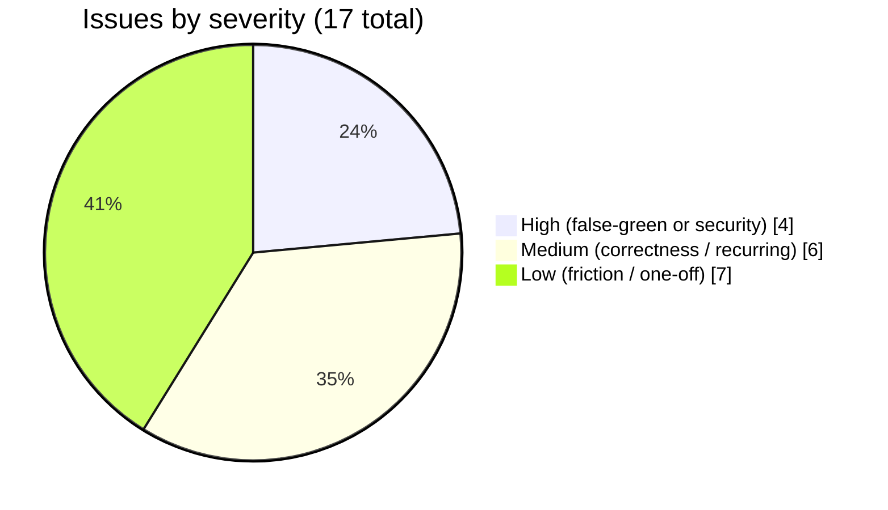
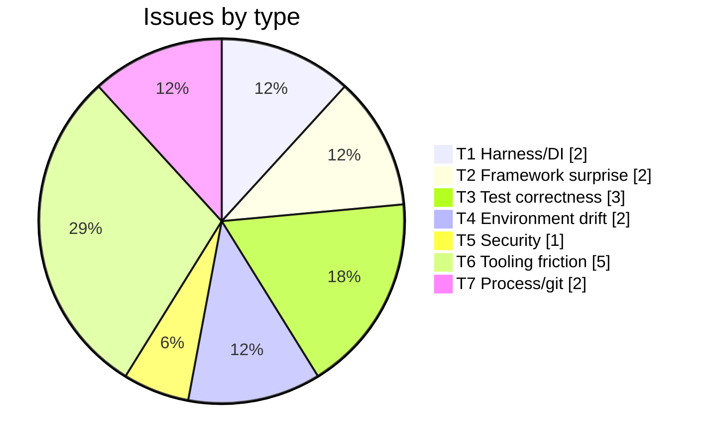
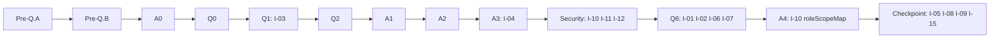
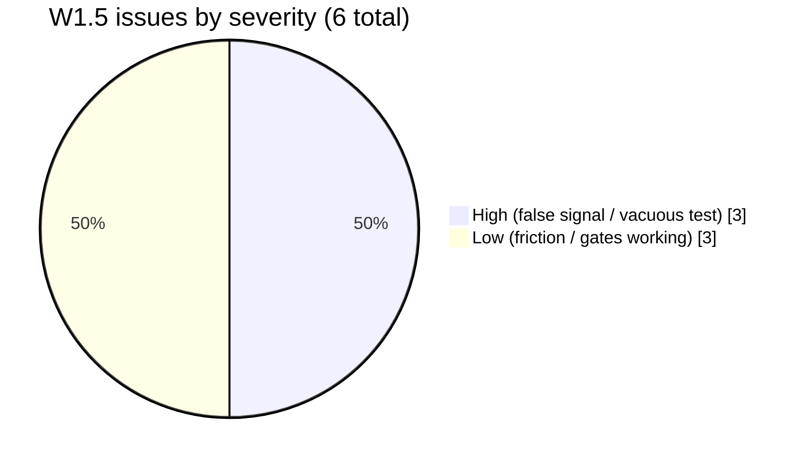
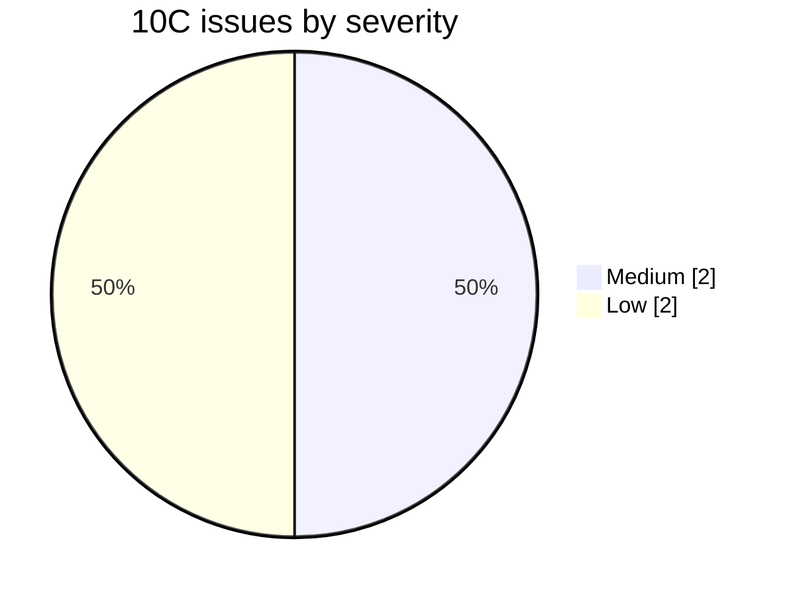

# Auth build execution - issues, root-cause analysis, and fixes

> **What this is.** A complete, introspective ledger of EVERY issue of EVERY type encountered while executing the reconciled 11-step authentication build ([AUTHENTICATION_ARCHITECTURE.md section 13](AUTHENTICATION_ARCHITECTURE.md#13-step-by-step-execution-plan--estimates--dependencies)), from Pre-Q.A through A4 plus the interstitial security pass and the final 3-form-factor checkpoint. For each issue it records the **symptom**, the **root-cause analysis (RCA)**, the **fix**, **why that fix works**, and the **prevention** (the gate or convention that stops the next one).
>
> **Why it exists.** None of these issues appear in the planning / design / architecture docs, because they arise from unforeseen combinations of circumstances (framework defaults, environment drift, tooling quirks, test-harness gaps) that the design stage cannot anticipate. Capturing them is how the gate set self-densifies over time - it is the concrete artifact behind the [self-improvement discipline (R7)](../../.github/copilot-instructions.md). This doc is the companion to the [EXECUTION_LEDGER.md](EXECUTION_LEDGER.md) (which tracks *what shipped*) and the [EXECUTION_DECISIONS_AND_RATIONALE.md](EXECUTION_DECISIONS_AND_RATIONALE.md) (which tracks *what was decided and why*); this one tracks *what went wrong on the way and what we learned*.
>
> **Provenance / completeness.** This ledger was reconciled against the **full 4,666-line session transcript** of the build (not just in-context recollection): a systematic scan for error/RED/fix/rejection signals across every step, plus a narration-phrase pass (`false positive`, `root cause`, `no-op`, `silently`, etc.). That scan surfaced **no substantive issue not already listed below** - every diagnosed problem in the transcript maps to one of the 17 entries. The early backbone/enabling steps (Pre-Q.A -> A2) genuinely had low issue density because they reused established patterns; the clusters are at Q6 (new external-dependency + test-harness surface) and the final checkpoint (environment drift + the live-only test bug). One verified-and-dismissed non-issue: the `jose` ESM-only constraint (Q2) was an *anticipated design choice* (dynamic `import('jose')`), not a failure - it loaded cleanly in jest on the first RED run.
>
> **Method note (now a standing discipline).** This doc was retrofitted at build end, which is why one recurrence count was initially understated (~50x lint-ceiling churn first recorded as "3+"). The standing fix is disciplines **D1 (capture each RCA at fix-confirmation time)** and **D2 (reconcile against the full transcript at build end)** in [docs/strategy/ENGINEERING_LESSONS_AND_PATTERNS.md](../strategy/ENGINEERING_LESSONS_AND_PATTERNS.md#2-maintenance-protocol-the-three-disciplines) - future ledgers are written incrementally so compaction cannot erode fidelity. The generalizable patterns from this build are promoted into that central doc (PA-1, PA-2, PB-1, PC-1, PD-1, PE-1/2/3).

---

## 1. Methodology - how issues are classified

Every issue is tagged with a **type**, a **severity**, the **step** it surfaced in, and the **detection stage** (which quality gate caught it). The most valuable column is **detection stage vs earliest-possible**: when a gate catches an issue LATER than it could have, that delta is itself a finding.

### 1.1 Type taxonomy

| Type | Meaning | Example |
|---|---|---|
| **T1 Harness/DI** | Test infrastructure or dependency-injection wiring gap that makes a test lie or fail to run | An optional DI token with no default provider silently ignores its test override |
| **T2 Framework surprise** | A framework default behaved differently than the design assumed | NestJS wraps a thrown error into a different envelope shape |
| **T3 Test correctness** | The test (not the product) was wrong - a false positive or a false green | A loose substring regex matches a legitimate field name |
| **T4 Environment drift** | A value differs between local / Docker / Azure form factors | The Docker OAuth secret is not the local default |
| **T5 Security finding** | A real vulnerability class surfaced by a scanner or review | CWE-1321 prototype pollution at an object-write sink |
| **T6 Tooling friction** | A CLI / shell / API quirk that blocked or corrupted an operation | A REST API rejecting an over-length comment field |
| **T7 Process/git** | A workflow / version-control / environment-prep step that bit | A remote branch advancing mid-work; a backend needing a DB |

### 1.2 Severity

| Severity | Definition |
|---|---|
| **High** | Could have shipped a real defect OR produced a false-green gate (a passing test that proves nothing) |
| **Medium** | Real product or contract correctness issue caught before ship; or a recurring friction that costs material time |
| **Low** | One-off friction, cosmetic, or environment-prep; no risk of shipping a defect |

### 1.3 Severity distribution


```mermaid
pie showData
    title Issues by severity (17 total)
    "High (false-green or security)" : 4
    "Medium (correctness / recurring)" : 6
    "Low (friction / one-off)" : 7
```

### 1.4 Type distribution


```mermaid
pie showData
    title Issues by type
    "T1 Harness/DI" : 2
    "T2 Framework surprise" : 2
    "T3 Test correctness" : 3
    "T4 Environment drift" : 2
    "T5 Security" : 1
    "T6 Tooling friction" : 5
    "T7 Process/git" : 2
```

---

## 2. Master dashboard

| ID | Title | Type | Sev | Step | Detected at | Status | Fix |
|---|---|---|---|---|---|---|---|
| I-01 | `JWKS_FETCH` test override silently no-op (optional DI token unbound) | T1 | High | Q6 | Stage 2 (E2E) | Fixed | 8fe8b9b |
| I-02 | `createTestApp` had no provider-override hook | T1 | Medium | Q6 | Stage 2 (E2E) | Fixed | 8fe8b9b |
| I-03 | SCIM exception filter rewraps OAuth `{error}` into `{detail}` | T2 | Medium | Q1 | Stage 2 (E2E) | Adapted | 3527df5 |
| I-04 | `415` on form-urlencoded token POST (content-type middleware) | T2 | Medium | A3 | Stage 2 (E2E) | Fixed | 524e75e |
| I-05 | Loose `token|clientSecret|credentialHash` regex false-matched `issuedTokenTtlSec` | T3 | High | Q6/checkpoint | Stage 4 (Docker) | Fixed | ffc4133 |
| I-06 | Recurring unnecessary-type-assertion lint warnings in specs | T3 | Low | many | Stage 1 (lint) | Fixed (xN) | each step |
| I-07 | TS cast errors needing `as unknown as` (JWK, EndpointCredentialModel) | T3 | Low | Q6 | Stage 1 (tsc) | Fixed | 8fe8b9b |
| I-08 | Docker compose OAuth secret is `devscimclientsecret`, not `changeme-oauth` | T4 | Medium | checkpoint | Stage 4 (Docker) | Documented | (runner arg) |
| I-09 | `/health` 404 on Docker (wrong health path assumption) | T4 | Low | checkpoint | Stage 4 (Docker) | Worked around | n/a |
| I-10 | CWE-1321 prototype pollution at 4 object-write sinks | T5 | High | security/A4 | CodeQL (async) | Fixed | ab943ab, 481bd38 |
| I-11 | CodeQL `dismissed_comment` 280-char limit (HTTP 422) | T6 | Low | security | Stage 3 (triage) | Worked around | n/a |
| I-12 | `gh api` PATCH broke `ConvertFrom-Json` (non-JSON warning on pipe) | T6 | Low | security | Stage 3 (triage) | Worked around | n/a |
| I-13 | Ledger run-log append: trailing whitespace defeats `replace_string` | T6 | Low | every step | authoring | Convention | `Add-Content` |
| I-14 | Terminal cwd drift -> `jest`/`vitest` from repo root hangs | T6 | Medium | many | authoring | Convention | explicit `cd` |
| I-15 | `git commit -m` special chars (`|` `(` `)` `"`) mis-parsed -> pathspec error | T6 | Low | checkpoint | committing | Convention | plain message |
| I-16 | Remote `feat/wif` advanced mid-work (multer 2.1.1 -> 2.2.0) | T7 | Low | mid-build | push | Convention | fetch+rebase+`npm ci` |
| I-17 | E2E needs Postgres unless `PERSISTENCE_BACKEND=inmemory` | T7 | Low | every E2E | first E2E run | Convention | env var |

> The `Fix` column lists the commit that carries the fix where one exists; "Convention"/"Documented"/"Worked around" mean the resolution was a practice or a one-time action rather than a code change.

---

## 3. Detection-stage escape analysis

The single most useful introspection: did the gate that caught each issue catch it as early as it could have?

| ID | Caught at | Earliest gate that COULD have caught it | Escape delta | Why it escaped earlier gates |
|---|---|---|---|---|
| I-01 | Stage 2 E2E (accept test 401'd) | Stage 2 E2E | none | Surfaced immediately as a RED on the first accept test - the cost was debug time, not an escape. |
| I-05 | Stage 4 Docker live | Stage 4.3 **local-node** live (per-step) | one stage | Q6 batched ALL live-tests to the integration checkpoint, so the 9z-AT section was authored but never executed against a live node until Docker. A per-step local-node live run would have caught it one stage earlier. |
| I-08 | Stage 4 Docker live | Stage 4.2 (first compose run) | none | Genuine first-contact discovery, not an escape - the secret value simply differs by environment. |
| I-10 | CodeQL async scan | Stage 1 SAST (CodeQL per-PR) | none | CodeQL is the SAST gate; it fired on schedule. The A0-A3 code added 3 new sinks; pre-existing sinks were already tracked. |

**Headline lesson (I-05):** batching live-tests to a checkpoint defers the discovery of *live-only test bugs*. The standing per-step norm ("local-node live after each step") exists precisely to avoid this; Q6 traded it for batch efficiency and paid one stage of latency. Reinforced in [Section 7](#7-self-improvement-actions).

---

## 4. Detailed catalog

### T1 - Test-harness / DI wiring

#### I-01 (High) - `JWKS_FETCH` test override silently no-op

- **Symptom.** The Q6 WIF E2E ([wif-assertion.e2e-spec.ts](../../api/test/e2e/wif-assertion.e2e-spec.ts)) injected a mocked JWKS `fetch` via `overrideProvider(JWKS_FETCH).useValue(fetchMock)`, but the two "accept" tests returned `401 invalid_client`. The server log showed `JWKS fetch returned HTTP 400` - the **real** `globalThis.fetch` was hitting the live Microsoft URL, not the mock.
- **Root cause.** [ExternalJwksValidatorService](../../api/src/oauth/external-jwks-validator.service.ts) declares the fetch dependency as `@Optional() @Inject(JWKS_FETCH) fetchFn?: typeof fetch` and falls back to `this.fetchFn ?? globalThis.fetch`. In NestJS, `overrideProvider(TOKEN)` only *replaces an existing provider binding*. Because `JWKS_FETCH` was never registered as a provider in any module (it was a pure optional token), there was nothing to override - the override resolved to nothing, the injected value stayed `undefined`, and the `?? globalThis.fetch` fallback ran the real network call. The override was **silently ignored**.
- **Fix.** Register a default provider for the token in [oauth.module.ts](../../api/src/oauth/oauth.module.ts):
  ```ts
  { provide: JWKS_FETCH, useFactory: () => globalThis.fetch.bind(globalThis) }
  ```
- **Why the fix works.** There is now a real binding for `JWKS_FETCH`, so `overrideProvider(JWKS_FETCH)` has a target to replace. Production behavior is unchanged: the default factory returns the same `globalThis.fetch` the `?? globalThis.fetch` fallback used, so the only effect is that the token is now overridable in tests.
- **Prevention.** New convention: **any `@Optional()` DI token that a test will override MUST have a default provider registered in its module.** An unbound optional token cannot be overridden - the override is a no-op and the test exercises production wiring while appearing to mock it. Proposed as a standing rule in [Section 7](#7-self-improvement-actions).

#### I-02 (Medium) - `createTestApp` had no provider-override hook

- **Symptom.** There was no way for the WIF E2E to override `JWKS_FETCH` because [app.helper.ts](../../api/test/e2e/helpers/app.helper.ts) `createTestApp()` compiled the testing module internally with no extension point.
- **Root cause.** The helper hard-coded `Test.createTestingModule({ imports: [AppModule] }).compile()` with no callback to mutate the builder.
- **Fix.** Added an optional `customize?: (builder: TestingModuleBuilder) => TestingModuleBuilder` parameter; when present it is applied before `.compile()`. Backward compatible (all existing callers pass nothing).
- **Why the fix works.** The override (`builder => builder.overrideProvider(JWKS_FETCH).useValue(fetchMock)`) now runs against the same builder that compiles the app, so the binding (added by I-01's fix) is replaced before instantiation.
- **Prevention.** Shared E2E bootstrap helpers should expose a builder-customize seam from day one; retrofitting one mid-feature is a sign the harness was under-designed for testability.

### T2 - Framework-behavior surprises

#### I-03 (Medium) - SCIM exception filter rewraps OAuth `{error}` into `{detail}`

- **Symptom.** The per-endpoint token endpoint throws RFC 6749 section 5.2 errors as `{ error: 'invalid_client', error_description: ... }`, but the E2E and live assertions for those errors had to check `res.body.detail === 'invalid_client'`, not `res.body.error`.
- **Root cause.** The global [ScimExceptionFilter](../../api/src/modules/scim/filters/scim-exception.filter.ts) catches every `HttpException` and reformats it into the SCIM error envelope (`{ schemas, detail, status }`). The token endpoint rides the same filter, so its OAuth-shaped body is rewrapped: the `error` string lands in `detail`.
- **Resolution (adapt, not fix).** This is acceptable behavior for the current scope - the token endpoint shares the SCIM envelope. The tests were written to assert the *actual* contract (`detail`) rather than the *assumed* one (`error`). A future step (the A3 error catalog) can carve the token endpoint out of the SCIM filter if a raw OAuth body is required.
- **Why this resolution is correct.** The product behavior is internally consistent and documented; the tests assert the real wire contract. Forcing the OAuth shape now would mean special-casing the filter for one route without a consumer that requires it.
- **Prevention.** When a new endpoint rides an existing global filter/interceptor, assert its **actual** serialized body in a test before assuming the framework leaves it untouched. Global filters are contract-shaping middleware.

#### I-04 (Medium) - `415 Unsupported Media Type` on form-urlencoded token POST

- **Symptom.** A `application/x-www-form-urlencoded` POST to `/scim/endpoints/:id/oauth/token` (the RFC 6749 section 3.2 content type) returned `415` instead of reaching the controller.
- **Root cause.** The [ScimContentTypeValidationMiddleware](../../api/src/modules/scim/middleware/scim-content-type-validation.middleware.ts) enforces `application/scim+json` (or `application/json`) on all `endpoints/*` routes per RFC 7644 section 3.1. The token endpoint sits under that prefix, so the SCIM content-type rule rejected the form body before the route ran.
- **Fix.** Exempt `*/oauth/token` paths from the SCIM content-type rule (a regex carve-out in the middleware), and register an explicit `express.urlencoded({ extended: true })` body parser in [main.ts](../../api/src/main.ts) + [app.helper.ts](../../api/test/e2e/helpers/app.helper.ts).
- **Why the fix works.** The token endpoint is an OAuth surface, not a SCIM resource surface - it must accept the OAuth-standard form encoding. The carve-out scopes the exemption to the token path only, so every real SCIM route keeps the strict `scim+json` rule.
- **Prevention.** Cross-protocol endpoints (OAuth living under a SCIM prefix) need an explicit content-type policy decision. A blanket prefix-scoped middleware will capture sub-routes that belong to a different protocol.

### T3 - Test-assertion correctness

#### I-05 (High) - Loose no-secret regex false-matched `issuedTokenTtlSec`

- **Symptom.** The Docker (Prisma) checkpoint failed exactly one assertion: `9z-AT.T4: wif credential response carries NO secret/hash/token`. No secret actually leaked - the WIF response is correct.
- **Root cause.** The assertion used `-not ($json -match "token|clientSecret|credentialHash")`. PowerShell `-match` is a **case-insensitive substring regex**, so the alternation `token` matched the `Token` inside the legitimate public field name `issuedTokenTtlSec`. The gate flagged a correct response as a leak - a **false positive** that, in the mirror case, is a **false-green farm**: the same loose pattern would also miss `"clientSecret"` if it were nested in a differently-cased key.
- **Fix.** Tighten all three WIF no-secret assertions (`9z-AQ.T9`, `9z-AT.T4`, `9z-AU.T4`) to **JSON-key-precise** patterns: `'"token"|"clientSecret"|"credentialHash"'`.
- **Why the fix works.** `JSON.stringify` renders every key as `"<key>":`. A genuine secret key therefore appears in the serialized body as the quoted token `"token"` and still fails the gate, while `issuedTokenTtlSec` serializes as `"issuedTokenTtlSec":` - which does **not** contain the quoted substring `"token"` (the inner `Token` is bracketed by letters, not quotes). The gate now keys on JSON structure, not on a word appearing anywhere.
- **Prevention.** This is the live-test analog of **copilot-instructions rule R1** ("measure the real signal, not a property that merely looks right"). Standing rule: **assertions about the presence/absence of a key in a serialized payload MUST match the structural form of a key (`"<key>"`), never a bare substring.** A bare-substring gate is simultaneously a false-positive and a false-negative generator.

#### I-06 (Low, recurring) - Unnecessary-type-assertion lint warnings in specs

- **Symptom.** The ESLint warning count crept above the frozen baseline of **464** (to 465/466) on essentially **every step that added spec code** - a full-transcript scan found the 464-ceiling-bump-and-restore cycle diagnosed ~50 times across the build. The offenders were always `@typescript-eslint/no-unnecessary-type-assertion` (a `as X` cast that TypeScript already infers) or `no-explicit-any` in new spec code.
- **Root cause.** When writing fast spec scaffolding, casts like `(cfg as Record<string, unknown>).polluted` or `logger.info as jest.Mock` were added defensively but were redundant once the surrounding types were correct.
- **Fix.** Removed the redundant cast each time; re-ran lint to confirm return to 464.
- **Why the fix works.** The receiver already accepts the original type, so the assertion changes nothing and the linter is correct to flag it. Removing it is behavior-neutral.
- **Prevention.** The pre-push hook runs ESLint as a hard gate, so this never reached `main`. The high recurrence (~50 bump-and-restore cycles) is the signal: treat the **464 warning ceiling as a ratchet** and lint the *touched files only* before committing, not just at push time - the cost of catching it at push is a full re-lint per step.

#### I-07 (Low) - TS cast errors needing `as unknown as`

- **Symptom.** Two E2E/spec compile errors: `Conversion of type 'JWK' to 'Record<string, unknown>' may be a mistake` and the same for `EndpointCredentialModel`.
- **Root cause.** A single-step cast between two types with no structural overlap (a `jose` `JWK` to an index signature, a partial literal to a full model) is rejected by TypeScript unless routed through `unknown`.
- **Fix.** `as unknown as Record<string, unknown>` (and dropped the cast entirely where the mock accepted `any`).
- **Why the fix works.** `unknown` is the explicit "I am deliberately widening then re-narrowing" escape hatch; it documents intent and satisfies the compiler without `any`.
- **Prevention.** Prefer building test fixtures with the real type (or a typed factory) over casting a literal; reach for `as unknown as` only at genuine type-system boundaries (third-party `JWK`).

### T4 - Cross-environment drift

#### I-08 (Medium) - Docker OAuth secret differs from the local default

- **Symptom.** `scripts/live-test.ps1 -BaseUrl http://localhost:8080 -ClientSecret "changeme-oauth"` failed at step 1 (token) with `401 invalid_client` against Docker compose.
- **Root cause.** [docker-compose.yml](../../docker-compose.yml) sets `OAUTH_CLIENT_SECRET: ${OAUTH_CLIENT_SECRET:-devscimclientsecret}` - the compose default is `devscimclientsecret`, while the local-node and dev-Azure environments use `changeme-oauth`. The live-test runner defaults `-ClientSecret "changeme-oauth"`, so the unqualified Docker invocation authenticated with the wrong secret.
- **Resolution.** Pass the matching secret per form factor: `-ClientSecret "devscimclientsecret"` for compose. (Local node + dev Azure keep `changeme-oauth`.)
- **Why this is correct.** The secrets are intentionally different per environment; the runner is correctly parameterized. The fix is to supply the right argument, not to homogenize the secrets.
- **Prevention.** The per-environment auth values (OAuth secret, SCIM shared secret, base URL) are the kind of thing that belongs in a single documented table. This doc and [/memories/repo/auth-exec-progress.md](../../.github/copilot-instructions.md) now record: **Docker = `devscimclientsecret`, local/dev-Azure = `changeme-oauth`.**

#### I-09 (Low) - `/health` 404 on Docker

- **Symptom.** A probe of `http://localhost:8080/health` returned `404` even though the container reported `healthy`.
- **Root cause.** The assumed health path was wrong; the container has its own healthcheck on a different path, and the app does not expose `/health` at the root.
- **Resolution (work around).** Verified liveness by fetching an OAuth token (a real, contract-meaningful probe) instead of guessing a health route.
- **Why this is correct.** A successful RS256 token issuance proves the app booted, the signing key loaded, and the OAuth surface is live - a stronger readiness signal than a health ping.
- **Prevention.** Use a contract endpoint (token issuance, a discovery GET) for readiness probes rather than assuming a conventional `/health` path exists.

### T5 - Security findings

#### I-10 (High) - CWE-1321 prototype pollution at object-write sinks

- **Symptom.** CodeQL flagged 3 `js/remote-property-injection` alerts (68, 184, 235) where a property *name* written into an object derived from request-shaped input, plus 2 `js/user-controlled-bypass` alerts (234, 236) on allowlist-guarded switches.
- **Root cause.** Code paths that do `target[userKey] = value` where `userKey` can be a `JSON.parse`-materialised `__proto__` / `constructor` / `prototype` own-property are a prototype-pollution vector. The four real sinks: [auto-expand.service.ts](../../api/src/modules/scim/endpoint-profile/auto-expand.service.ts) `stripUndefined` + `stripSecretsFromConfig`, [generic-patch-engine.ts](../../api/src/domain/patch/generic-patch-engine.ts) extension-URN + `setNested` writes, and (added in A4) the [wif-assertion-token.provider.ts](../../api/src/modules/scim/controllers/wif-assertion-token.provider.ts) `roleScopeMap` read. The 2 `user-controlled-bypass` alerts were **false positives** - they sit on positive allowlist checks (`KNOWN_METHOD_TYPES`, the secret-strip content filter), which are defense-in-depth filters, not authorization gates.
- **Fix.** New single-source guard [safe-object-key.ts](../../api/src/security/safe-object-key.ts) `isUnsafeObjectKey(key)` (the `__proto__`/`constructor`/`prototype` deny-set); a `if (isUnsafeObjectKey(k)) continue;` guard at each write sink; an in-sink `DANGEROUS_KEYS` re-check in the patch engine. The 2 bypass alerts were dismissed as false positives (with a sub-280-char justification, see I-11). Alerts 68/184/235 auto-close on the next scan.
- **Why the fix works.** A request-supplied key can never reach an object-write sink without passing the deny-set check, so `Object.prototype` cannot be polluted. The guard is structural (one function, used everywhere) rather than per-site ad-hoc, so a new sink only needs to call the same helper. Proven by 2 new prototype-pollution tests (RED: `cfg.polluted === true` before the guard; GREEN after) plus the existing V19 suite.
- **Prevention.** Two standing rules already exist (the no-secret structural guarantee; the V19 proto-pollution suite). This finding reinforces: **every dynamic `obj[userControlledKey] = value` write MUST go through `isUnsafeObjectKey` at the sink**, even when an upstream `guardPrototypePollution(path)` exists - defense in depth, because the upstream guard validates a *path string*, not the *final key*.

### T6 - Tooling / shell friction

#### I-11 (Low) - CodeQL `dismissed_comment` 280-char limit

- **Symptom.** `gh api -X PATCH .../alerts/234 -f dismissed_comment="<long justification>"` returned `HTTP 422: Only 280 characters are allowed`.
- **Root cause.** The GitHub code-scanning dismiss API caps `dismissed_comment` at 280 characters; the first justification was 283.
- **Resolution.** Shortened the comment to under 280 characters while keeping the substance (defense-in-depth filter, not an authZ gate; no-secret guarantee is structural + contract-tested).
- **Prevention.** Pre-trim CodeQL dismiss comments to <= 280 characters. Recorded in [/memories/repo/auth-exec-progress.md](EXECUTION_LEDGER.md).

#### I-12 (Low) - `gh api` PATCH broke `ConvertFrom-Json`

- **Symptom.** Piping `gh api -X PATCH ... | ConvertFrom-Json` failed with `Conversion from JSON failed ... Unexpected character ... 'g'`.
- **Root cause.** `gh` emitted a non-JSON warning/notice on stdout *before* the JSON body, so the PowerShell `ConvertFrom-Json` parser hit the leading text. (The underlying PATCH may even have succeeded; the pipe consumer broke, not the API call.)
- **Resolution.** Verify the dismissal with a separate read (`gh api .../alerts/234 | Select number,state`) rather than parsing the PATCH response inline; retry the PATCH on a clean pipe.
- **Prevention.** Do not pipe `gh api` mutation responses straight into a strict JSON parser; capture, inspect, then parse - or verify the side effect with a follow-up read.

#### I-13 (Low) - Ledger run-log append defeats `replace_string`

- **Symptom.** Editing [EXECUTION_LEDGER.md](EXECUTION_LEDGER.md) run-log rows via the string-replace edit tool repeatedly failed to match.
- **Root cause.** The ledger has trailing-whitespace quirks on table rows; the exact-match replace tool needs byte-perfect context, which the invisible trailing spaces broke.
- **Resolution.** Append run-log rows with the terminal (`Add-Content -Path ... -Value '| ... |'`) instead of an in-file string replace; use the replace tool only for the status-table cells (which are stable).
- **Prevention.** For append-only, whitespace-sensitive logs, prefer `Add-Content` over context-matched edits.

#### I-14 (Medium, recurring) - Terminal cwd drift hangs `jest`/`vitest`

- **Symptom.** Several `npx jest ...` / `npx vitest ...` invocations produced no output and had to be killed; they had started in the **repo root** instead of `api/` or `web/`, where there is no jest/vitest config, so the runner hung or no-op'd.
- **Root cause.** A new or backgrounded terminal does not inherit the previous command's `cd`; some tool-simplified commands also reset to the workspace root.
- **Resolution.** Prefix every test invocation with an explicit `cd C:\...\api` (or `web`); kill and re-run from the right directory when a runner produces no output.
- **Prevention.** Never assume terminal cwd persists across invocations. Always `cd` explicitly in the same command as the runner. Recorded as a workflow gotcha in memory.

#### I-15 (Low) - `git commit -m` special chars mis-parsed

- **Symptom.** A commit message containing `token|clientSecret|credentialHash` and `(...)` and escaped quotes produced `error: pathspec '...' did not match any file(s)` - the shell split the message on the special characters and treated fragments as path arguments.
- **Root cause.** Unquoted/awkwardly-quoted `|`, `(`, `)`, `"` inside a `-m` string under PowerShell's parser leaked out of the string.
- **Resolution.** Re-issued the commit with a plain-prose message free of shell metacharacters.
- **Prevention.** Keep commit `-m` bodies free of `|`, raw parentheses, and nested quotes; describe patterns in words ("quoted JSON-key patterns") rather than pasting the regex.

### T7 - Process / git / environment

#### I-16 (Low) - Remote `feat/wif` advanced mid-build (multer bump)

- **Symptom.** Mid-build, `origin/feat/wif` had advanced (a `master` merge bumped `multer` 2.1.1 -> 2.2.0 and added a CodeQL batch).
- **Root cause.** The shared feature branch receives direct CVE/dependency bumps; local unpushed commits then sit behind the remote.
- **Resolution.** `git fetch` + rebase the local unpushed commit onto the remote before pushing; run `npm ci` in `api/` after the lockfile changed; do **not** revert the dependency bump.
- **Why this is correct.** Rebasing unpushed commits is safe (no published history rewritten); the pre-push hook re-runs the gates on the rebased result.
- **Prevention.** Fetch + rebase before every push on a shared branch; `npm ci` whenever `package-lock.json` moved.

#### I-17 (Low) - E2E needs Postgres unless inmemory

- **Symptom.** The first E2E run attempted to connect to Postgres at `localhost:5432` and failed in a DB-less shell.
- **Root cause.** The default `PERSISTENCE_BACKEND` is `prisma`, which requires a live Postgres; the local dev shell has none.
- **Resolution.** Run E2E with `$env:PERSISTENCE_BACKEND='inmemory'` to exercise the in-memory backend (the cross-backend parity gate covers the Prisma path separately at the Docker checkpoint).
- **Prevention.** Default local E2E to the inmemory backend; reserve Prisma-backed runs for Docker compose (where Postgres is part of the stack).

---

## 5. Cross-cutting lessons

1. **Loose matching is a two-sided farm.** A bare-substring assertion (I-05) generates false positives *and* false negatives. Always assert on the structural form of the thing (a JSON key is `"<key>":`, not the word). This is R1 applied to live-tests.
2. **Optional DI tokens need default providers to be overridable (I-01).** An unbound `@Optional()` token cannot be mocked - the override silently no-ops and the test runs production wiring. Register a behavior-preserving default provider.
3. **Batching live-tests defers live-only bug discovery (I-05).** The per-step local-node live norm exists to catch live-only test bugs one stage earlier; trading it for batch efficiency costs latency. Author *and smoke-run* each live section against one live node before batching.
4. **Global filters/interceptors are contract-shaping (I-03, I-04).** A new endpoint under an existing prefix inherits its middleware (content-type rules, error rewrapping). Assert the *actual* serialized body and decide content-type policy explicitly.
5. **Environment values drift by form factor (I-08, I-09).** Secrets, ports, and health paths differ across local / Docker / Azure. Parameterize the runner and document the per-environment values in one place.
6. **RCA the test before the product (I-05).** When a gate fails, the first question is "is the gate correct?" - a wrong gate is as dangerous as a wrong product, because it erodes trust in green.
7. **Defense in depth at the sink (I-10).** An upstream path-guard does not remove the need for a final key-guard at the write sink; validate the actual key, structurally, where the write happens.

---

## 6. Per-step issue density


```mermaid
flowchart LR
    PreQA[Pre-Q.A] --> PreQB[Pre-Q.B]
    PreQB --> A0[A0]
    A0 --> Q0[Q0]
    Q0 --> Q1[Q1: I-03]
    Q1 --> Q2[Q2]
    Q2 --> A1[A1]
    A1 --> A2[A2]
    A2 --> A3[A3: I-04]
    A3 --> SEC[Security: I-10 I-11 I-12]
    SEC --> Q6[Q6: I-01 I-02 I-06 I-07]
    Q6 --> A4[A4: I-10 roleScopeMap]
    A4 --> CHK[Checkpoint: I-05 I-08 I-09 I-15]
```

The heaviest issue clusters are **Q6** (the test-harness/DI work - new external dependency surface) and the **final checkpoint** (where environment drift and the live-only test bug surfaced). The pure-backbone inert steps (A0, A2) and the foundational signing work (Pre-Q.B) produced no issues - they reused established patterns.

---

## 7. Self-improvement actions

Per the [R7 self-improvement discipline](../../.github/copilot-instructions.md), every issue ends in one of: improvement applied in-place, improvement scheduled, or improvement explicitly not needed.

### 7.1 Applied in-place (this execution)

| Issue | Improvement landed |
|---|---|
| I-01 / I-02 | Default `JWKS_FETCH` provider + `createTestApp` customize hook ([8fe8b9b](EXECUTION_LEDGER.md)). |
| I-05 | All three WIF no-secret live assertions tightened to JSON-key precision ([ffc4133](EXECUTION_LEDGER.md)). |
| I-10 | `isUnsafeObjectKey` single-source guard at every object-write sink ([ab943ab](EXECUTION_LEDGER.md), [481bd38](EXECUTION_LEDGER.md)). |

### 7.2 New standing conventions (proposed for the gate set)

1. **Optional-DI-token default-provider rule.** Any `@Optional() @Inject(TOKEN)` dependency that a test overrides MUST have a default provider registered in its module - otherwise `overrideProvider` is a silent no-op. (From I-01.)
2. **Structural-key assertion rule.** Presence/absence-of-key assertions over a serialized payload MUST match the structural key form (`"<key>"`), never a bare substring. (From I-05; the live-test analog of R1.)
3. **Author-and-smoke-run-before-batch rule.** A new `live-test.ps1` section MUST be executed against at least one live node (local node, port 6000/8080) in the same step it is authored, before deferring the rest of the live matrix to a batched checkpoint. (From I-05.)
4. **Per-environment auth-value table.** The OAuth secret / SCIM shared secret / base URL for each form factor (local `changeme-oauth`, Docker `devscimclientsecret`, dev Azure `changeme-oauth`) is recorded in repo memory and this doc. (From I-08.)

### 7.3 The recurring practice this doc establishes

> **Standing rule (the reason this doc exists):** every multi-step build, feature, or significant change MUST produce - or append to - an **execution-issues-and-RCA** doc that captures EVERY issue of EVERY type encountered, each with symptom / root-cause / fix / why-the-fix-works / prevention, plus a detection-stage escape analysis. These issues are not anticipated at design time (they come from framework defaults, environment drift, tooling quirks, and test-harness gaps), so capturing them is the only way the gate set self-densifies. This is the concrete artifact behind R7, and it is now a documented norm in [copilot-instructions.md](../../.github/copilot-instructions.md).

---

## 8. Post-merge integration addendum (jose 5->6 + master reconcile, 2026-06-29)

> **Scope.** Sections 1-7 cover the 11-step build proper (17 issues). This addendum captures the issues from the *integration tail* - reconciling `feat/wif` with `origin/master` (jose 5.10.0 -> 6.2.3 + dependabot minor bumps) and re-running the heavy validation pipeline across all form factors. Per the standing RCA-ledger rule, every issue of every type is recorded here with the same symptom / RCA / fix / why / prevention structure, numbered I-18+ to extend the build ledger. Captured at fix-confirmation time per discipline D1.

### 8.1 Addendum dashboard

| ID | Title | Type | Sev | Surfaced in | Detected at | Status | Fix |
|---|---|---|---|---|---|---|---|
| I-18 | WIF credentials Playwright spec used `?tab=` query param instead of the path-based route | T3 | Medium | Playwright vs dev | Stage 5.3 (first-ever live run) | Fixed | 16d4c02 |
| I-19 | Playwright Chromium binary drift after dependabot `@playwright/test` bump (128 specs RED) | T6 | Low | Playwright vs dev | Stage 5.4 (browser sync) | Worked around | (binary install) |

> **Verified-and-dismissed non-issue: the jose 5 -> 6 major bump.** NOT an issue - de-risked and clean. The WIF code loads jose via dynamic `import('jose')` (no API-surface coupling), the jose-6 PR touched only a jest ESM-transform config, a runtime smoke confirmed `jwtVerify` + `createLocalJWKSet` exist in v6, and every tier stayed green (unit 4011/0, E2E 1283/0, Docker live 1109/0, local live 1109/0, dev live 1109/0). Recorded for completeness, not as a defect - the v6 ESM-only constraint was an anticipated design property, exactly like the Q2 note in the provenance header.

### 8.2 I-18 (Medium, T3) - WIF spec used `?tab=` instead of the path-based route

- **Symptom.** Three `wif-credentials.spec.ts` tests failed against dev with `getByTestId('tab-credentials')` timeout / "element(s) not found", before any WIF assertion ran. The failure was **identical before and after** a clean web-bundle redeploy.
- **Root cause.** The spec deep-linked the credentials tab via `page.goto('/endpoints/<id>?tab=credentials')`. But [EndpointDetailPage](../../web/src/pages/EndpointDetailPage.tsx) selects the active tab from the URL **path** (`activeTab = pathToTab(pathname, endpointId)`) using TanStack file-based child routes (`/endpoints/<id>/credentials`, rendered through `<Outlet />`); there is no `?tab=` handling anywhere. The unknown search param was ignored, the index (overview) route stayed matched, OverviewTab rendered, and the CredentialsTab carrying `data-testid="tab-credentials"` never mounted. `?tab=` is a stale pre-migration mental model that survives only in comments - including the header of the sibling [endpoint-detail-tabs.spec.ts](../../web/e2e/endpoint-detail-tabs.spec.ts), whose *code* nonetheless uses the correct path URL and passes.
- **Why it escaped until now.** The spec was authored during the Q6 build but **never executed against a live, rendered CredentialsTab** - the WIF UI bundle had not been deployed to any reachable environment (dev's `api/public` carried zero `Federated Identity` markers until this session's clean rebuild). It shipped as "written coverage" that had never gone RED -> GREEN. This session's clean rebuild deployed the WIF UI for the first time, the spec ran in a real browser for the first time, and the wrong URL surfaced immediately.
- **Fix.** Switched the helper to `page.goto('/endpoints/<id>/credentials')`, matching the proven pattern in `endpoint-detail-tabs.spec.ts`, and corrected the stale header comment ([16d4c02](EXECUTION_LEDGER.md)).
- **Why the fix works.** The path URL matches the real `credentials` child route, so `pathToTab` returns `'credentials'`, the `<Outlet />` mounts CredentialsTab, and `tab-credentials` + the WIF section render. Verified vs dev (clean revision `v84cc2efweb`): 2 passed, 1 expected-skip (the first endpoint has `WifCredentialsEnabled` off, so the form-only test self-skips), 0 failed.
- **Prevention.** (a) **Stage 0 RED-first applies to E2E specs too** - a UI spec must run against a live rendered surface (go RED, then GREEN) before it counts as coverage; a never-executed spec is a hypothesis, not coverage. (b) **Deploy-then-Playwright ordering** - a spec for a new UI surface MUST run against an environment where that surface is actually deployed; if the bundle predates the surface, the spec exercises nothing. (c) **One shared tab-navigation helper** - the path-based deep-link should be shared, not re-derived per spec, so the stale `?tab=` model cannot reappear.

### 8.3 I-19 (Low, T6) - Playwright Chromium binary drift after dependabot bump

- **Symptom.** The first Playwright run vs dev reported 128 failed / 3 passed, every failure `browserType.launch: Executable doesn't exist at ...chromium_headless_shell-1228...`.
- **Root cause.** The merged dependabot bump moved `@playwright/test` to a version expecting Chromium build v1228, but the machine still had the prior browser binary. This is exactly the class the Stage 5.4 "browser-binary sync" one-shot step exists for.
- **Fix / resolution.** `npx playwright install chromium` (downloaded headless-shell v1228); the count immediately recovered from 128 RED to 5 RED (the 5 being I-18's 3 plus 2 pre-existing baseline-drift specs).
- **Prevention.** When a diff bumps `@playwright/test`, run `npx playwright install` as a one-shot before the Stage 5.3 run. A large "Executable doesn't exist" failure block is binary drift, never a code regression - read the error class before classifying.

### 8.4 Diagnostic lesson - necessary but not sufficient (two independent defects on one path)

The WIF specs had **two** independent blockers stacked on the same code path, and fixing the first did not turn them green:

1. The deployed dev bundle genuinely **lacked the WIF UI** (0 `Federated Identity` markers) - a real deployment-staleness fact, fixed by the clean `--no-cache` rebuild + redeploy.
2. Even with the fresh bundle live, the spec **still failed** because the `?tab=` URL never reached the tab (I-18).

The lesson: when a clean rebuild does not change a failure, do not conclude "the rebuild was pointless" - conclude "there is a SECOND defect." The rebuild was *necessary* (the WIF UI had to be deployed for the spec to ever pass) but not *sufficient* (the URL also had to be right). Reading the actual error + the page ARIA snapshot (per R3 visual-regression-diagnosis) instead of hand-waving the unchanged failure as "flaky / environmental" is what surfaced the real I-18 root cause.

### 8.5 Escape analysis (addendum)

| ID | Caught at | Earliest gate that COULD have caught it | Escape delta | Why it escaped earlier |
|---|---|---|---|---|
| I-18 | Stage 5.3 (first live Playwright run, this session) | Stage 0 (RED-first) at authoring time | many stages | The spec was committed during Q6 without ever running against a deployed WIF UI - no environment had the surface live, so it never went RED. The earliest catch is RED-first at authoring: run the spec, watch it fail for the right reason, then make it pass. |
| I-19 | Stage 5.4 (browser sync) | Stage 5.4 | none | Binary drift is precisely what the Stage 5.4 one-shot exists for; it fired as designed. The only cost was one RED run before the install. |

**Headline (I-18):** a spec that has never executed against its target is not coverage. The auth-build analog was I-05 (a live-test section authored but not smoke-run before batching); I-18 is the UI/Playwright instance of the same class - *author-and-run-before-counting-it-as-coverage*. This reinforces the existing standing convention rather than adding a new one.

---

## 9. Wave 3 addendum (RFC 7523 correctness: W3.2 + W3.4, 2026-07-24)> **Scope.** Sections 1-8 cover the 11-step WIF build + its integration tail. This addendum captures the (low-severity) frictions from the Wave 3 correctness items - **W3.2** (issued-token identity separation, v0.54.76) and **W3.4** (RFC 8707 resource policy, v0.54.77) - plus the getLog-parity fix (v0.54.75). Per the standing RCA-ledger rule, every issue of every type is recorded, numbered I-20+.

### 10.1 Addendum dashboard

| ID | Title | Type | Sev | Surfaced in | Detected at | Status | Fix |
|---|---|---|---|---|---|---|---|
| I-20 | Adding an optional threaded param broke exact-arg `toHaveBeenCalledWith` mock assertions (3 sites) | T3 | Low (recurring) | W3.2 + W3.4 | Stage 2 (full unit suite) | Fixed (x3) | 84a05c8c, 0abc07fb |
| I-21 | Pre-existing specs asserted the OLD conflated WIF identity (issued sub == assertion sub) | T3 | Medium | W3.2 | Stage 2 (unit) + Stage 2 (E2E) | Fixed | 84a05c8c |

> **Verified-and-dismissed non-issues.** (a) The issued-`client_id` change (W3.2) is NOT a resource-authz regression - the resource guard authorizes by the `endpoint_id` claim, and `client_id`/`sub` are used only for log enrichment (verified in [oauth-jwt.authenticator.ts](../../api/src/modules/auth/authenticators/oauth-jwt.authenticator.ts) before the change shipped). (b) The v0.54.74 flush-backlog flake did NOT recur on the dev live-test (1,327/1,327), confirming the FK-drop root-cause fix.

### 10.2 I-20 (Low, recurring, T3) - optional-param addition breaks exact-arg mock assertions

- **Symptom.** Threading a new optional param (`sourceSubject` on `generateEndpointAccessToken`; `requestResource` on `mintFromAssertion`/`validateWithTrace`) turned three green `expect(fn).toHaveBeenCalledWith(a, b, c)` assertions RED with `Received: a, b, c, undefined` - the extra trailing `undefined` arg.
- **Root cause.** `toHaveBeenCalledWith` matches the FULL argument list exactly; a new trailing optional arg (even `undefined`) is a mismatch. Expected TDD churn, not a defect.
- **Fix / why it works.** Updated each assertion to include the new trailing arg (`undefined` where no value is presented), and ADDED a positive threading test at each site (parser captures `resource`; provider + controller forward it). The assertions now match the real call shape and additionally lock the new param's propagation.
- **Prevention.** No new gate needed - the **full unit suite caught every arity drift on the first run** (zero escape). This is the gate working as designed. Convention reinforced: when threading a new optional param through a signature, expect `toHaveBeenCalledWith` sites to go RED and update them in the same change (they are the propagation contract).

### 10.3 I-21 (Medium, T3) - specs codified the old identity conflation as "correct"

- **Symptom.** After W3.2 made the issued `client_id` = the endpoint identity (not the assertion `sub`), the WIF provider unit test, the WI-17 source-issuer test, and the `wif-assertion` E2E mint test all failed - each asserted `issued sub == assertion subject`, the exact bug W3.2 fixes.
- **Root cause.** The pre-W3.2 tests baked the conflation into their expectations (`generateEndpointAccessToken` called with `wifMetadata.expectedSubject`; E2E `expect(payload.sub).toBe(SUBJECT)`). A test that asserts the buggy behavior is a false green - it would have blocked the correct fix.
- **Fix / why it works.** Corrected each to assert the SEPARATION (issued `sub`/`client_id` == endpointId or `targetClientId`, `!=` assertion subject; `src_sub` == assertion subject). The corrected tests now fail if the conflation ever returns - a regression net for the fix.
- **Prevention.** This is the R10 lesson (a green gate only proves what it asserts; a test can codify a broken state as the baseline). When fixing a correctness bug, first find the tests that assert the OLD behavior and flip them to assert the new contract - they become the regression net. No new standing rule (R10 + Stage 0 RED-first already cover it); dispositioned **accepted** (existing rules sufficient).

### 10.4 Escape analysis (addendum)

| ID | Caught at | Earliest gate that COULD have caught it | Escape delta | Why it escaped earlier |
|---|---|---|---|---|
| I-20 | Stage 2 (full unit) | Stage 2 (full unit) | none | Arity drift is caught by the suite on the first run - working as designed; cost was a one-line assertion update x3. |
| I-21 | Stage 2 (unit + E2E) | Stage 0 (RED-first) | none | The RED-first write of the W3.2 test immediately surfaced the sibling specs that asserted the old identity - they went RED together and were corrected in the same change. No escape to dev (dev live-test 9z-BX green). |

**Headline:** both Wave 3 frictions were **zero-escape, immediately-caught test-assertion updates** - the RED-first discipline (Stage 0) and the full-suite gate (Stage 2) did exactly their job. The self-improvement disposition is **(c) no new improvement needed**: the existing gates caught everything at authoring time, and R10 + Stage 0 already encode the "don't codify the old behavior as the baseline" lesson (I-21).

---

## 10. Wave 1 addendum (perf foundation, 2026-07-28)

### 10.-1 I-24 (High, T1 harness/DI) - a "pure helper" import that took out 65 tests at once

- **Symptom.** After adding a UUID guard for the log `requestId`, all three E2E suites failed
  COMPLETELY - 65 of 65 tests - with `TypeError: Cannot read properties of undefined (reading
  'close')` in `afterAll`, masking the real error: `Nest can't resolve dependencies of the
  RequestLoggingInterceptor (?, ScimLogger) ... the dependency at index [0] appears to be
  undefined at runtime`.
- **Root cause.** The guard imported `isUuid` from `bootstrap/correlation-middleware.ts`, which
  imports `ScimLogger`. `logging.service.ts` then imported the guard, closing the cycle
  `logging.service -> storable-request-id -> correlation-middleware -> scim-logger -> logging`.
  A circular import leaves one module's exports `undefined` at evaluation time, so Nest received
  `undefined` for a constructor parameter.
- **Why it was invisible until runtime.** `tsc` compiled it **cleanly**. TypeScript resolves types
  across cycles happily; only the runtime value is undefined. So the build gate is structurally
  incapable of catching this class.
- **Fix.** Move the predicate to `src/shared/uuid.ts` - a LEAF module with no Nest and no app
  imports - and have both consumers import from there.
- **Prevention.** A shared predicate/helper pulled into a service must live in a leaf module. When
  adding an import to a widely-imported service, check what the SOURCE module itself imports, not
  just what you are importing. The tell for this class is a `Nest can't resolve dependencies ...
  appears to be undefined at runtime` error immediately after a new import - read past the
  `afterAll` teardown noise, which is a symptom, not the cause.
- **Detection-stage escape analysis.** Caught immediately by the targeted E2E re-run in the same
  step. Note the build gate passed, so a change relying on `npm run build` alone would have shipped
  it.

### 10.0 I-23 (High, T2 test-correctness) - a live-test section that passed VACUOUSLY, including its secret-leak check

- **Symptom.** The new `9z-BZ` live section (W1.7c runtime-config surface) was smoke-run against a
  local node immediately after authoring it, per the standing author-and-smoke-run-before-batch
  convention. Four assertions failed (`T4` envelope keys, `T5` schema URN, `T6` group list,
  `T10`/`T11`), reporting nonsense like `got: Count,IsFixedSize,IsReadOnly,IsSynchronized,Length,...`.
- **Root cause.** `Invoke-WebRequest` returned `.Content` as a **`System.Byte[]`**, not a string.
  Piping a byte array into `ConvertFrom-Json` **enumerates** it, so `$rc` became an `Object[]` of
  1,732 integers instead of the parsed payload. The API response itself was correct throughout.
- **The dangerous part is what did NOT fail.** Three assertions **PASSED** on that broken parse:
  `T7` ("all **0** effective values sit inside their published bounds"), `T8` (provenance valid for
  zero settings), and - worst - `T9`, the **secret-leak check**, which ran `-like` against a byte
  array and found nothing because there was nothing to find. A security assertion that passes
  because its haystack is the wrong type is a false-green, and it would have shipped as one had the
  four loud failures not been sitting next to it.
- **Fix.** Decode explicitly (`[System.Text.Encoding]::UTF8.GetString(...)` when `.Content` is
  `byte[]`), and make every loop-based assertion require a **non-zero count** to pass:
  `T7`/`T8` now demand `>= 15` settings and `T9` demands a payload longer than 100 chars. Each
  message prints the count it actually checked (`all 15 effective values...`, `no secret-bearing
  key or value in the 1732-char payload`), so a future regression to zero is visible in the log
  rather than silently green. Re-run: **12/12**, then the full local suite **1341/1341**.
- **Prevention.** This is the live-test instance of rule **R10** (*presence is not correctness*),
  and it generalizes: **an assertion that iterates a collection MUST also assert the collection is
  non-empty**, otherwise "no violations found" and "nothing was examined" are indistinguishable.
  Every existing `foreach`-based live assertion is a candidate for the same audit. It also
  reinforces PG-2: `Invoke-WebRequest.Content` is a library default whose *type* varies by response
  - do not assume it, decode it.
- **Detection-stage escape analysis.** Caught at the earliest possible gate (the smoke-run in the
  same step that authored it), which is exactly what that convention exists for. Had the section
  been batched to a later checkpoint, the four loud failures would have been debugged then - but
  the three vacuous passes might never have been noticed at all, because they look identical to
  success.

### 10.1 I-22 (Low, T3) - a zero max-age cache is NOT stale within the same millisecond

- **Symptom.** Two new W1.3 tests were intermittently failing (1-2 failures per run, varying).
  They set `JWKS_CACHE_MAX_AGE_MS=0` expecting every `verify()` to be a cold fetch, but the second
  fetch was sometimes served from cache.
- **Root cause.** `getFreshCached` treats an entry as fresh while `Date.now() - fetchedAt > maxAge`
  is FALSE. With `maxAge = 0`, a second call in the SAME millisecond gives `0 > 0` = false, i.e. a
  cache HIT. Whether the test passed depended on how many milliseconds the surrounding crypto took.
- **Fix.** The tests now let ~5ms elapse before the second verify. The production semantics were
  left alone deliberately: changing the comparison to `>=` to make `maxAge=0` mean "never cache"
  would be a behaviour change in a security-adjacent path made solely to suit a test.
- **Prevention.** When a test needs a boundary condition ("expired", "stale", "just past the
  limit"), assert it by CROSSING the boundary, never by sitting exactly on it. A test parked on an
  inclusive/exclusive boundary is a coin flip whose bias is set by unrelated code speed.

### 10.2 Observation (not a defect) - allowlist revocation does not invalidate cached JWKS

> **RESOLVED 2026-08-05 in W1.4** (v0.55.5). The recommended middle option below was taken: an SSRF/allowlist rejection is now raised as a distinct `JwksHostNotPermittedError` and is explicitly **not stale-eligible**, while a network failure still is. Nothing is purged, so the availability property for real outages is unchanged, and the post-revocation window is closed. The pre-existing W1.3 test that asserted the opposite ("the verify itself still succeeds") was updated in the same commit with the reasoning recorded inline. See [W1_4_JWKS_CACHE_CADENCE.md](W1_4_JWKS_CACHE_CADENCE.md) section 4.2. The original text is kept below because the decision - and why it was deferred rather than fixed on the spot - is the useful part.

While writing the W1.3 re-validation test, the harness surfaced this existing behaviour: if a host
is removed from `JWKS_HOST_ALLOWLIST` **after** its keys were cached, `verify()` still succeeds
until the cache entry ages out. The remembered redirect target IS re-validated - no request is
issued to the revoked host - but `fetchJwksWithRetry`'s **fail-to-stale** path then returns the
previously-cached keys rather than propagating the SSRF rejection.

This is arguably correct (the keys were obtained legitimately while the host was trusted, and
failing closed on every allowlist edit would be an outage risk), and it is **unchanged by W1.3** -
the shortcut can never widen what the fetcher reaches. It is recorded here rather than silently
"fixed", because tightening it means choosing an exposure window (up to `cacheMaxAgeMs`) over an
availability risk, and that is a security decision for the operator, not a side-quest inside perf
work. **Owner action:** decide whether a host revocation should purge that host's cache entries;
if yes, it belongs with the W1.4 cache rework, not before it.

**Update (2026-07-28, X15).** The runtime-tuning audit
([../perf/RUNTIME_TUNING_AND_CONFIGURATION_REFERENCE.md](../perf/RUNTIME_TUNING_AND_CONFIGURATION_REFERENCE.md),
issue 12 in its section 6) raises the stakes on this decision: X15-F1 recommends taking
`cacheMaxAgeMs` from 10 minutes to **24 hours** to match Microsoft's published guidance.
The exposure window named above is bounded by `cacheMaxAgeMs`, so that change would widen
it from 10 minutes to a full day. The two must therefore be decided **together** inside
W1.4, not sequentially. A middle option now exists that did not before: make an **SSRF
rejection specifically non-stale-eligible** (distinct from a network failure, which stays
stale-eligible), which purges nothing and keeps the availability property for real outages
while closing the revocation window. That is the recommended resolution.

---

## 10A. Wave 1 addendum II - W1.5 JWKS safety envelope (2026-08-04)

> **Scope.** Section 10 covers the 2026-07-28 perf-foundation frictions (I-22 to I-24). This addendum covers **W1.5** - the JWKS total deadline plus response caps, api v0.55.3 - and continues the numbering at **I-25**. Feature doc: [W1_5_JWKS_SAFETY_ENVELOPE.md](W1_5_JWKS_SAFETY_ENVELOPE.md). Per the standing rule, every issue of every type is recorded, including the low-severity tooling friction.
>
> **Capture timing.** Written incrementally at fix-confirmation time per discipline **D1**, not retrofitted at build end.

### 10A.1 Addendum dashboard

| ID | Title | Type | Sev | Surfaced in | Detected at | Status | Fix |
|---|---|---|---|---|---|---|---|
| I-25 | A `maxKeys` test PASSED before the cap existed - duplicate-`kid` rejection matched the assertion's `/keys/i` pattern | T3 | **High** | W1.5 | Stage 0 (RED run, per-test inspection) | Fixed | 85bd9aa4 |
| I-26 | Live suite ran against a **4-day-old process serving 0.55.0**; readiness probe printed the version but never asserted it | T4 | **High** | W1.5 | Stage 4 (live, local node) | Fixed (runner) | 85bd9aa4 |
| I-27 | Lint ratchet appeared breached (511 vs remembered 504); the baseline had moved AND the change added one | T3 | Low | W1.5 | Stage 1 (lint) | Fixed | 85bd9aa4 |
| I-28 | Two documentation gates blocked the push (F1 version coupling; C3/C5 doc-claims-vs-source) | T7 | Low | W1.5 | Stage 1 (pre-push) | Fixed | ba8435dd, ad214675 |
| I-29 | A fresh `git worktree` could not run tests - `node_modules` is not shared and the npm registry is TLS-blocked on this machine | T7 | Low | W1.5 | Stage 0 (setup) | Worked around | n/a |
| I-30 | 4 of 12 live assertions for W1.5 could not fail - an UNREGISTERED settings key round-trips unvalidated, so "the setting persists" was never evidence the feature existed | T3 | **High** | W1.5 dev deploy | Stage 4.4 (pre-deploy negative control) | Fixed | (this change) |


```mermaid
pie showData
    title W1.5 issues by severity (6 total)
    "High (false signal / vacuous test)" : 3
    "Low (friction / gates working)" : 3
```

Both High-severity entries are **false signals rather than product defects**: a test that passed for the wrong reason, and a suite that ran against the wrong binary. Neither would have been visible in a suite total; both were caught by checking *which* assertions ran and *what* they ran against.

> **Verified-and-dismissed non-issues.** (a) The `res.json()` fallback in `readKeySet` is a deliberate compatibility choice for existing test doubles that expose no `text()`, not an unguarded path - the byte cap simply does not apply where the body cannot be measured, and every real `Response` has `text()`. (b) The 7 failures in the first live run were **entirely** attributable to I-26 (wrong binary) and did not recur once the correct build was under test - 1,385/1,385.

### 10A.2 I-25 (High, T3) - a test that passed before the feature existed

- **Symptom.** On the RED run, `rejects a key set with more keys than maxKeys` **passed** - before any cap had been written. Three other W1.5 behaviour tests failed as expected.
- **Root-cause analysis.** The fixture reused a single key three times: `{ keys: [k, k, k] }`. `jose.createLocalJWKSet` rejects a key set containing duplicate `kid` values, and that rejection message satisfied the assertion's loose `/keys/i` pattern. The test was green for a reason wholly unrelated to the behaviour under test, and would have stayed green if the cap had never been implemented at all.
- **Fix.** Three **distinct** keys (`kid-1`, `kid-2`, `kid-3`) so the key set is valid and `kid-1` resolves; a tightened pattern (`/too many keys|maxKeys|key count/i`); and a companion boundary test asserting a set of **exactly** `maxKeys` is accepted.
- **Why the fix works.** The positive and negative controls now differ by exactly one key, and the key set is valid in both. Nothing but the cap can produce the rejection, so the test can only pass once the cap exists and is off-by-one-correct.
- **Prevention.** Same class as **I-05** (a loose `token` regex matching `issuedTokenTtlSec`). The generalizable rule: **a loose `/keyword/i` assertion is a false-green generator whenever the code under test shares vocabulary with its dependencies** - and a JWKS validator shares all of its vocabulary with `jose`. No new gate: Stage 0 caught it, because the RED run was inspected **per test** rather than by suite total. That inspection habit is the control, and it is now stated explicitly in the feature doc.

### 10A.3 I-26 (High, T4) - a live suite that tested a 4-day-old binary

- **Symptom.** The first full live run reported **7 failures**, all in sections unrelated to W1.5 (`9z-BF`, WIF verify, and others).
- **Root-cause analysis.** The server under test never started: `EADDRINUSE` on port 6000. A `node` process from **07/31** was still listening there, serving **0.55.0**. The live suite connected to that. The readiness probe *printed* `ready: 0.55.0` and proceeded - it compared nothing. The 7 failures were real behavioural differences between 0.55.0 and 0.55.3, correctly detected against entirely the wrong subject.
- **Fix.** The runner now reads the expected version from `api/package.json`, **asserts** the served version equals it, and **aborts** with an explicit message rather than run a suite that would produce a signal about nothing. Stale listeners are enumerated (pid, name, start time) and terminated before start.
- **Why the fix works.** A live suite's result is only meaningful relative to a known subject. Asserting the subject's identity converts a silent false signal into a loud refusal - the failure mode becomes "I refuse to run" instead of "here are 7 failures in code you did not touch".
- **Prevention.** This is the **same defect class** fixed earlier in this branch's history for the deploy pipeline, where Stage 4.6b now asserts `/scim/admin/version` reports the new build before the dev live-test is trusted. The lesson generalizes beyond both instances: **printing a value is not checking it.** A readiness probe that emits a version without comparing it is decoration. Disposition: **(a) applied** - the local runner now asserts, matching the pipeline.

### 10A.4 I-27 (Low, T3) - a remembered baseline is not a baseline

- **Symptom.** Post-implementation lint reported **511** warnings against a remembered ceiling of **504**, implying the change had added 7.
- **Root-cause analysis.** Two independent facts, either of which alone would have produced a wrong conclusion: the ceiling on clean `master` had legitimately moved to **510** since 504 was memorized, **and** this change genuinely added **one** (`res: any` in `readKeySet`). Trusting the remembered number would have overstated the damage 7x; trusting the new number without measuring would have silently raised the ratchet.
- **Fix.** Measured the baseline on clean `master` (510), then typed the parameter structurally (`{ text?: () => Promise<string>; json: () => Promise<unknown> }`) rather than raising the ceiling. Final count: **510**, the baseline exactly.
- **Why the fix works.** The ratchet is only meaningful against a measured current value. Fixing the one real warning keeps the ceiling where it is, which is the point of a ratchet.
- **Prevention.** **When a ratchet appears breached, measure the ratchet before assuming the change broke it.** Convention, not a new gate - the lint gate itself is working correctly.

### 10A.5 I-28 (Low, T7) - two documentation gates blocked the push, correctly

- **Symptom.** `git push` was refused twice after every code gate passed.
- **Root-cause analysis.** Both refusals were true findings. (1) The version bump to 0.55.3 left **22 user-facing docs** advertising 0.55.2 - the F1 version-coupling check. (2) The four new settings made three documented counts wrong (`INDEX.md` claimed "28 endpoint settings controls" and "4 numerics"; the flags reference claimed "4 numeric") and left all four settings undocumented in the operator guide - the C3/C5 doc-claims-vs-source checks.
- **Fix.** `audit-doc-freshness.ps1 -Fix` stamped the doc set; counts corrected to 32/8; the four settings documented in [ENDPOINT_SETTINGS_OPERATOR_GUIDE.md](../ENDPOINT_SETTINGS_OPERATOR_GUIDE.md) with a paragraph explaining what the envelope does.
- **Why this is recorded as an issue at all.** It is friction, and the standing rule records friction. But it is friction with a positive sign: these gates exist because of an earlier escape where 12 docs advertised a two-minor-old version, and they caught real drift **the same day the feature landed**. Recording it makes the gate's value visible rather than treating it as an obstacle.
- **Prevention.** Already in place and working. Convention reinforced: **a feature that adds settings has a documentation surface** - counts, operator guide, flags reference - and the gates will find it, so it is cheaper to update them in the feature commit.

### 10A.6 I-29 (Low, T7) - a worktree that cannot be provisioned

- **Symptom.** A fresh `git worktree` created for the feature branch could not run any test: no `api/node_modules`.
- **Root-cause analysis.** `node_modules` is not shared between git worktrees, and this machine cannot reach `registry.npmjs.org` - a machine-wide TLS block (the Windows host fails the same handshake; only npmjs is affected). So `npm ci` cannot provision a new worktree at all.
- **Fix.** Moved the branch into an already-provisioned worktree and removed the unusable one. The two RED spec files written in it were preserved and restored first.
- **Why the fix works.** It sidesteps a constraint that cannot be resolved locally rather than fighting it.
- **Prevention.** **While the registry block persists, create feature branches inside an existing provisioned worktree.** A new worktree is only viable if `node_modules` is copied from a provisioned one. Recorded in the repo-scoped environment notes alongside the registry-block entry.

### 10A.7 I-30 (High, T3) - four live assertions that could not fail

- **Symptom.** While capturing the pre-deploy state of dev (then on 0.55.1, which contains no W1.5 code at all), a negative control asked "is `JwksTotalDeadlineMs` accepted here?" and the answer was **True**. The setting round-tripped perfectly on a build where the feature did not exist.
- **Root-cause analysis.** The endpoint settings validator validates **registered** keys and stores **unregistered** ones untouched. Proven directly: an invented key, `TotallyUnregisteredSettingXyz = 12345`, round-trips identically. So live assertions `9z-CD.T1` to `T4` - which assert the four caps persist via PATCH and re-read on GET - were **persistence checks, not feature checks**. All four would have passed against a build with no W1.5 in it. Four of the section's twelve assertions could not fail for the reason they appeared to test.
- **Why the section still had value.** `T5` (six bounds rejections), `T6` (the non-vacuous guard) and `T7` (the documented 1,000-key maximum) *are* discriminating: rejecting an out-of-range value requires a registry entry with `min`/`max`, which only the feature provides. The section was never worthless - it was **partly** load-bearing, and nothing distinguished the two kinds of assertion for a reader.
- **Fix.** Two control assertions added to `9z-CD`, and the reasoning written into the suite rather than left in a commit message: **T8** proves an unregistered key round-trips (so T1-T4 are persistence checks), and **T9** proves that same unregistered key has **no bounds**, while a registered one does. That difference *is* the registry entry, stated as an assertion.
- **Why the fix works.** The pair makes the discriminator explicit and self-documenting. A future reader who assumes "it round-trips, so it works" is contradicted by T8 sitting immediately below. If the settings validator ever changes to reject unknown keys, T8 goes red and forces the reasoning to be revisited.
- **Prevention.** This is **R10** ("presence is not correctness") arriving from a new direction: not a testid-presence check, but a *round-trip* check - which feels like an outcome assertion and is not one, because persistence is provided by a layer beneath the feature. Generalizable rule now recorded: **when a feature adds configuration, the round-trip is provided by the config store, not by the feature. Assert the thing only the feature can do - validation, enforcement, or an observable behaviour change.** The cheap, general way to find this class: **run the new assertions against the previous build before deploying.** Anything that still passes is not testing the change.

### 10A.8 Escape analysis (addendum II)

| ID | Caught at | Earliest gate that COULD have caught it | Escape delta | Why it escaped earlier |
|---|---|---|---|---|
| I-25 | Stage 0 (RED, per-test) | Stage 0 (RED, per-test) | none | Caught at the earliest possible moment **only because the RED run was read per test**. A suite-total reading ("4 failed / 20 passed") would have shown a plausible number and let a permanently-vacuous test ship. |
| I-26 | Stage 4 (live) | Stage 4 (live) | none, but **the signal was nearly inverted** | The gate could not have fired earlier - it is a live-only condition. The danger was not lateness but direction: it produced 7 *false* failures. Had the stale build happened to be behaviourally identical, it would instead have produced a false PASS. |
| I-27 | Stage 1 (lint) | Stage 1 (lint) | none | Working as designed. |
| I-28 | Stage 1 (pre-push) | Stage 1 (pre-push) | none | Working as designed, and by construction: the coupling check fires on the version bump. |
| I-29 | Stage 0 (setup) | Stage 0 (setup) | none | Immediate and unmissable. |
| I-30 | Stage 4.4 (deploy negative control) | Stage 0 (when `9z-CD` was authored) | **one full item** | The section was written, reviewed, run green locally and run green on dev before anyone asked what would happen if the feature were absent. Only building a deliberate pre-deploy negative control - running the assertions against the OLD build - exposed that four of them passed there too. |

**Headline.** Five of six issues were caught by the earliest gate capable of catching them. The exception, **I-30, escaped a full item** - it was found only when a deliberate pre-deploy negative control ran the new assertions against the OLD build. That technique is the cheap, general detector for vacuous tests and is now the recommended step before any deploy that claims to add a feature: **run the new assertions against the previous build; anything that still passes is not testing the change.** The three High-severity entries share one shape - all would have survived a summary-level reading (a suite total, a printed version line, a green section). Dispositions: **(a) applied** for I-26 (the live runner asserts the served version) and I-30 (controls T8/T9 added); **(c) accepted** for the rest, where existing rules and gates behaved as designed.

---

## 10B. Wave 1 addendum III - Playwright skip elimination (2026-08-05)

Scope: no production code. A sweep to remove skipped browser tests before starting W1.4, which turned up two latent cross-spec races and one class of vacuous assertion that no gate could see.

**Outcome: 207 passed / 13 skipped / 0 failed -> 218 passed / 2 skipped / 0 failed.**

| # | Type | Severity | One-line symptom |
|---|---|---|---|
| I-31 | Test correctness | **High** | 8 specs skipped with "Tenant has zero endpoints" against a tenant serving 58 |
| I-32 | Test harness / concurrency | **High** | Two specs failed intermittently because another spec's fixture became "the first endpoint" and was then deleted |
| I-33 | Test correctness | Medium | Assertions wrapped in `if (count > 0)` passed having asserted nothing |
| I-34 | Test correctness | Medium | A data-dependent skip meant the "Additional attributes" assertions never ran on dev |


```mermaid
pie showData
    title 10B issues by severity
    "High" : 2
    "Medium" : 2
```

### 10B.1 I-31 - `.count()` is not a readiness signal (High)

**Symptom.** `export.spec.ts` reported "No endpoints available on this environment"; seven `wif-credentials.spec.ts` tests and several others reported "Tenant has zero endpoints." Dev was serving 58 endpoints throughout.

**Root cause.** The guard was `test.skip((await cards.count()) === 0, ...)` executed right after `waitForLoadState('networkidle')`. Playwright's `.count()` is a **snapshot, not an auto-waiting assertion**, and on a SPA `networkidle` settles before React commits the grid. The predicate therefore read `0` for a reason that was never true, and the tests had been dead for as long as the guard had existed. Nothing surfaced it because a skip is reported as a non-failure.

**Fix.** Preconditions are now created rather than detected - see 10B.5. Where a readiness wait is still wanted, it is `await expect(locator).toBeVisible()`, which auto-waits.

**Why the fix works.** It removes the predicate entirely instead of tuning it. There is no timing window left to lose.

**Prevention.** Standing rule added to CHANGELOG and the fixture module's header: **`.count()` is never a valid readiness signal in a guard.** Any conditional skip whose predicate depends on ambient environment data is a dead test waiting to happen.

### 10B.2 I-32 - "the first endpoint" is a shared mutable resource (High)

**Symptom.** During a full parallel run, `credential-secret-visibility.spec.ts` timed out at 30s and two `discovery-explorer.spec.ts` tests failed with `discovery-spc-section` / `discovery-resourcetypes-section` not found. Each passed in isolation.

**Root cause.** The admin endpoint list is ordered **`createdAt DESC`**. Several specs create a fixture endpoint, so a fixture becomes **"the first endpoint"** the instant it is created - and is deleted at that spec's cleanup. Any concurrently-running spec that bound to "the first card" was pointing at a resource with a foreign, short lifetime. This was **latent before this change** (specs creating endpoints already existed); increasing fixture usage raised the collision rate enough to make it visible.

**Fix.** No spec binds to "the first endpoint" any more. Each creates its own and addresses it by id - including `discovery-explorer`, which now selects `discovery-primary-option-<its own id>` rather than `.first()`.

**Why the fix works.** It removes the shared resource. Two specs can no longer name the same endpoint.

**Prevention.** The shared fixture module is the sanctioned way to obtain an endpoint, and its header documents the ordering hazard so the pattern is not reintroduced.

### 10B.3 I-33 - conditionally-vacuous assertions (Medium)

**Symptom.** None - that is the point. `credential-reveal.spec.ts` reported PASS.

**Root cause.** Its body was `if ((await moreButtons.count()) > 0) { ...assert... }`. On an endpoint with no per-endpoint credential the test asserted nothing and still passed. This is functionally a skip that does not even produce a skip line, so it is invisible in the summary.

**Fix.** Fixture seeds a bearer credential; the conditionals became `await expect(...)`. A `toBeGreaterThan(0)` non-vacuity check was added where the original compared two counts (`0 === 0` used to pass).

**Prevention.** Reinforces R10: an assertion guarded by a data-dependent condition is not coverage. Count-vs-count assertions need an accompanying non-zero check.

### 10B.4 I-34 - hunting ambient data for a test subject (Medium)

**Symptom.** `copy-and-truncate.spec.ts` skipped with "User ... has none of [name, emails, externalId, enterprise]".

**Root cause.** The spec listed the tenant's endpoints, probed the first 25 for a user with a `userName` >= 40 chars, then required that user to also carry enrichment attributes. Two independent ambient-data lotteries; the second lost on every dev run, so the R1 truncation and drawer assertions never executed there.

**Fix.** The fixture seeds exactly the user required - Entra-shaped, >= 40 chars, with `name`/`emails`/`externalId`/enterprise - and the spec asserts `userName.length >= 40` so a future shortening cannot silently disarm the truncation check.

**Prevention.** Same rule as I-31: construct the precondition. Also removes 25 endpoint probes per test run.

### 10B.5 The shared fix

[web/e2e/endpoint-fixture.ts](../../web/e2e/endpoint-fixture.ts) - `createFixtureEndpoint`, `createFixtureEndpointWithUsers`, `deleteFixtureEndpoint`, `openCredentialsTab`. A spec that needs an endpoint in a particular shape creates one in that shape and deletes it afterwards.

One non-obvious detail worth recording: **credential cards are filtered by the ACTIVE method sub-tab**, and each tab is gated by its own flag (`WifCredentialsEnabled`, `SecretTokenBearerAuthEnabled`, `OAuthClientCredentialsAuthEnabled`, `SharedSecretBearerAuthEnabled`, per `enabledMethodTabs()` in `CredentialsTab.tsx`). Enabling the flag alone is insufficient - the fixture must also select the tab, or the seeded credential is filtered out of view. The default tab is the first non-`shared_secret` method, so a WIF-enabled fixture lands on `wif` and a bearer credential is invisible until `bearer` is clicked.

### 10B.6 A rejected "fix"

`router-behavior.spec.ts` carried an unconditional `test.skip(true, ...)` with a suggested rewrite: assert no loading skeleton appears between click and page render. On inspection this would be **vacuous** - N2's `OnboardingWizard` calls `useEndpoints()` on every route mount, so the data is cached whether or not hover-prefetch works, and the assertion would pass either way. It was rejected and the reasoning written into the spec so it is not attempted again. The skip stays, with its real coverage (`router-loaders.test.ts` asserting a loader per route, `defaultPreload: 'intent'`, `defaultPreloadStaleTime: 30_000`) named in the skip message.

**A test that cannot fail for the reason it claims to test is worse than no test**, because it consumes the budget that would otherwise fund real coverage.

### 10B.7 Escape analysis

| Issue | Caught by | Earliest gate that could have | Escape delta | Note |
|---|---|---|---|---|
| I-31 | Manual skip audit | Stage 5.3, any run | **months** | No gate reads skip *reasons*. A skip is scored as a non-failure, so 8 dead tests sat inside a green suite indefinitely. |
| I-32 | Stage 5.3 full parallel run | Stage 5.3, any parallel run | **latent, intermittent** | Failed only under concurrency and passed in isolation, so it read as flake. Attribution required noticing the `createdAt DESC` ordering. |
| I-33 | Manual audit of the same specs | Stage 5.3 | **months** | Produced neither a failure nor a skip line. Strictly invisible to any summary. |
| I-34 | Stage 5.3 skip audit | Stage 5.3, any run | **months** | Same blind spot as I-31. |

**Headline.** All four escaped for one shared reason: **the gate scored the suite, not the coverage.** 13 skips and an unknown number of vacuous conditionals were compatible with "0 failed" and were therefore reported as success. This is R10 ("presence is not correctness") applied to the test suite itself - the suite's own green is a presence signal, and the outcome that matters is whether each test can actually fail. Dispositions: **(a) applied** for all four in this commit chain; the skip-reason audit is now a standing step whenever the Playwright suite is run against dev.

---

## 10C. Wave 1 addendum IV - W1.4 JWKS cache cadence (2026-08-05)

Scope: the cache redesign (24 h TTL + background refresh + rate-limited unknown-`kid` + hard stale ceiling + `Cache-Control`). Three issues, all Low-to-Medium, and one of them is a **method success** rather than a defect - it is recorded because the method is the reusable part.

| # | Type | Severity | One-line symptom |
|---|---|---|---|
| I-35 | Test correctness (method success) | Medium | A live assertion looked like feature evidence but passed against a build without the feature |
| I-36 | Framework surprise | Low | Two pre-existing tests failed because W1.4 deliberately changed the behaviour they encoded |
| I-37 | Test harness | Low | Widening a shared interface broke unrelated spec fixtures at compile time |
| I-38 | Test isolation | Medium | Nine live assertions passed on dev and local only because each environment carried leftover state |


```mermaid
pie showData
    title 10C issues by severity
    "Medium" : 2
    "Low" : 2
```

### 10C.1 I-35 - the negative control worked, and reclassified an assertion (Medium)

**Symptom.** Not a failure. Following the I-30 rule ("run the new assertions against the previous build before deploying; anything that still passes is not testing the change"), the `9z-CE` assertions were run against dev at 0.55.3, which contains no W1.4. Measured:

| Assertion | Against a build WITHOUT W1.4 | Verdict |
|---|---|---|
| T1-T3 round-trip | PASS | not testing W1.4 |
| T5 bounds rejections | **FAIL** (0 of 6) | load-bearing |
| T7 24 h ceiling accepted | **PASS** | **reclassified** |
| T8 unregistered round-trip | PASS | control, as designed |

**Root cause of the finding.** `T7` asserts `JwksCacheMaxAgeMs` accepts `86400000`. That was already true before W1.4 - the key and its 24 h ceiling both predate this item; W1.4 raises the **default** to the ceiling, it does not create the ceiling. Written without the control, `T7` would sit in the suite looking like evidence the feature shipped.

**Fix.** `T7` is relabelled in the suite itself as `(regression guard, not W1.4-discriminating)`, with the measurement and date in the comment above it. It is kept, because "the raise did not break the ceiling" is worth locking - it is just not proof of delivery.

**Why this matters.** I-30 was found by accident. This time the control was run deliberately, cost about a minute, and reclassified an assertion **before** it could mislead a future reader. The technique generalises past config: **the cheapest way to find out what a test is testing is to run it against a build that lacks the feature.**

**Prevention.** Already a standing rule from I-30. This run is the evidence that it pays for itself; the addition here is that the OUTCOME of the control belongs in the suite as a label, not just in a commit message.

### 10C.2 I-36 - two pre-existing tests encoded the behaviour W1.4 changes (Low)

**Symptom.** After implementing, `external-jwks-validator.service.spec.ts` failed with `JwksHostNotPermittedError` where it expected success, and the W1.3 test comment read: *"The verify itself still succeeds ... allowlist revocation does not retroactively invalidate cached keys. That is existing behaviour, unchanged by W1.3."*

**Root cause.** Not a regression - the opposite. That test faithfully encoded the RCA 10.2 open question, and W1.4 exists partly to resolve it. The failure is the test doing its job: a deliberate behaviour change should break the test that pinned the old behaviour.

**Fix.** Updated the assertion to expect rejection, and replaced the comment with an explanation of *why* the outcome changed, pointing at RCA 10.2. The property the test has always really guarded - that no request reaches the revoked host - is asserted unchanged.

**Why the fix works.** It keeps the test's original purpose intact while re-pointing the outcome at the new, deliberate contract, and leaves a reader able to reconstruct the decision without archaeology.

**Prevention.** Convention, stated: when a change makes an existing test fail *by design*, the update MUST record the intent inline. A silently "fixed" assertion is indistinguishable from a bug being papered over - the same reasoning as R3 for visual-regression baselines.

### 10C.3 I-37 - widening a shared interface broke unrelated fixtures (Low)

**Symptom.** `egress-policy.spec.ts` failed to compile: `Type '{...}' is missing the following properties from type 'EgressPolicy': refreshIntervalMs, unknownKidMinIntervalMs, staleIfErrorMs`. A `toEqual` on a fully-resolved policy also failed with three unexpected keys.

**Root cause.** `EgressPolicy` is a fully-concrete interface (every field required, by design - it is the resolved policy). Adding a field is therefore a breaking change for every object literal typed as one, including test fixtures. Two fixtures plus one exhaustive `toEqual` were affected.

**Fix.** Added the three fields to both fixtures and extended the `reads each env var` test to actually exercise the three new env vars rather than just satisfying the type.

**Why the fix works.** The exhaustive `toEqual` is the feature, not the friction: it is what guarantees a new policy field cannot be added without a test acknowledging it. Loosening it to `toMatchObject` would remove the only thing that noticed.

**Prevention.** Keep the exhaustive assertion. Note for future policy additions: expect exactly three edits - the two fixtures and the env-var test - and treat a fourth failure as a real finding.

### 10C.4 I-38 - nine live assertions passed only on environments carrying leftover state (Medium)

**Symptom.** The suite reported **1401/1401 on Azure dev** and **1401/1401 on a local node**, then **1396/1401 on Docker** against a fresh database. Failures: `9z-AV.T7/T8`, `9z-BK.T2-T4`, `9z-BE.T1-T4` - all WIF-verify assertions against a real Entra tenant.

**First hypothesis, wrong.** Container egress. Disproved directly: `docker exec ... wget https://login.microsoftonline.com/common/discovery/v2.0/keys` returned a key set. The container's network was fine.

**Root cause.** The affected sections verify against the **legacy** Entra JWKS host `https://login.windows.net/...`, which is deliberately **not** in the well-known seed allowlist (the seed carries `login.microsoftonline.com` and five siblings). Each environment satisfied the precondition by accident, differently:

| Form factor | Why it passed / failed |
|---|---|
| Azure dev | `login.windows.net` was sitting in the **persisted** allowlist, left by an earlier run |
| Local node | The runner had been started with `JWKS_HOST_ALLOWLIST='login.microsoftonline.com,login.windows.net'` - the env satisfied it |
| Docker, fresh volume | Neither. Seed only. **SSRF rejection, as designed.** |

So the assertions were not testing what they appeared to test on two of three form factors: they depended on ambient state rather than creating their precondition.

**Confirmed pre-existing, not a W1.4 regression.** The identical suite was run against the **previous published image (0.55.3)** on a fresh volume and produced the **same failure set**; a set-difference of the two runs reported `none - every 0.55.5 failure also fails on 0.55.3`. This is the same negative-control technique as I-30/I-35, pointed at a regression question instead of a coverage question.

**Fix.** New `Ensure-JwksHostAllowed` helper in [live-test.ps1](../../scripts/live-test.ps1), called by `9z-AV` and `9z-BK` before they use the legacy host. It is idempotent - it reads the effective allowlist first and only POSTs when the host is missing - so it is a no-op on an environment that already has it.

**Why the fix works.** It makes the precondition true **by construction** instead of hoping the environment provides it. Proven non-vacuously: the local node was restarted with `JWKS_HOST_ALLOWLIST='login.microsoftonline.com'` **only**, verified via the API that `login.windows.net` was absent at start, and the suite then passed **1401/1401**. All three form factors are now green from a cold state.

**Prevention.** This is the live-test analogue of the Playwright defect fixed in the same session (10B): **a test that depends on ambient environment state is a test that will pass or fail for reasons unrelated to the code.** The general rule now applies at both layers - construct the precondition, or assert loudly that it is missing; never let the environment silently supply it. Corollary learned here: **three green form factors are not three independent confirmations if each is green for a different accidental reason.** A fresh-volume run is the only one that tests the cold path.

### 10C.5 Escape analysis

| Issue | Caught by | Earliest gate that could have | Escape delta | Note |
|---|---|---|---|---|
| I-35 | Stage 4 negative control (deliberate) | same | **none** | The rule from I-30 fired as intended, pre-deploy, and improved the suite rather than catching a defect. This is what a self-improving gate looks like when it is working. |
| I-36 | Stage 2 (API unit) | same | none | Immediate and unambiguous. |
| I-37 | Stage 1 (tsc build) | same | none | Compile-time, by construction. |
| I-38 | Stage 4.2 (Docker, fresh volume) | Stage 4.2, any run on a clean DB | **long-standing** | Invisible on dev and on the local node because each satisfied the precondition accidentally. Only a cold, stateless form factor could expose it - which is precisely the argument for keeping all three in the matrix rather than treating dev as representative. |

**Headline.** Zero regressions from W1.4 itself. The two notable entries are process wins: **I-35**, where a rule added after an earlier escape (I-30) paid for itself on the very next item by reclassifying a mislabelled assertion before it became folklore; and **I-38**, where running the *same* suite against the *previous image* answered "is this mine?" definitively in about two minutes instead of by argument. Dispositions: **(a) applied** for all four in this commit chain.

---

## 10D. A8 auth-method audit event (2026-08-19, api v0.55.8)

| # | Type | Sev | Symptom | Root cause | Fix | Why it works | Prevention |
|---|---|---|---|---|---|---|---|
| **I-39** | Observability / redaction | **High** | The A8 event was emitted and arrived useless: `"credentialId":"[REDACTED]"`, so the audit record could not say WHICH method changed. Unit tests were green. | The event reused the existing `credentialId` field. [`SENSITIVE_KEY_PATTERN`](../../api/src/security/redact-sensitive.ts) matches `/credential/`, so the shared redactor blanks any key containing "credential" - including an opaque id that is not a secret and is already returned in the `201` body. | Added a `methodId` field to `AuthAdminEvent` and emitted the id there. **The redaction pattern was deliberately NOT loosened** - it legitimately catches `credentialHash`. | The id now travels under a name outside the sensitive namespace, so it survives to the log surface while every genuinely secret-named key stays redacted. The security control is unchanged. | Live **`9z-CF.T3`** asserts `methodId` both equals the created id AND is not `[REDACTED]`, so a rename back into the `/credential/` namespace fails on the wire. |
| **I-40** | Test correctness | **High** | Two of the five new unit tests could never fail: both `outcome: 'failure'` assertions passed against an empty event list. | The test helper collected events from `logger.info` only. The emitter logs `success` at INFO and `failure` at **WARN**, so failure events were never in the set the helper searched, and `expect(events).toHaveLength(1)` was being evaluated against a list that could only ever be empty for those cases. | Helper reads both `info` and `warn`; both channels cleared between phases. | The assertion now searches the channel the event is actually written to, so a missing failure emission fails the test. | This is R10 (presence is not correctness) occurring **inside the harness** rather than the product. Standing check when asserting on a mocked logger: enumerate every channel the emitter can write to before filtering. |

**Detection-stage escape analysis.**

| # | Caught at | Earliest possible | Escape delta | Note |
|---|---|---|---|---|
| I-39 | Stage 2.2 (API E2E) | Stage 2.2 | **none** | **Structurally unreachable earlier.** The unit test mocks `ScimLogger`, so redaction never executes; no unit test at any level of diligence could have caught it. This is the concrete argument for why the checklist requires the E2E and live layers rather than treating them as duplicate coverage of the unit layer. |
| I-40 | Stage 0 (RED-first) | Stage 0 | **none** | Caught only because the RED step was actually run and the failure count read: 4 failed, 1 passed. Had the tests been written after the implementation, all 5 would have been green immediately and the two vacuous ones would have shipped as permanent false assurance. |

**Headline.** Both issues are arguments for discipline that is easy to skip because it looks
redundant. I-39 says the E2E layer is not a slower copy of the unit layer - it is the only layer that
runs the real logger, and the defect lived exactly there. I-40 says the RED step is not ceremony -
the *only* reason two dead tests were found is that someone looked at which tests failed and counted
them. Dispositions: **(a) applied** for both in this commit chain; the same redaction defect in the
three pre-existing emitters is **(b) scheduled** as N12 in
[REMAINING_WORK_REGISTER.md](REMAINING_WORK_REGISTER.md), because changing what those events publish
is a separate contract with its own test surface.

---

## 10E. A10 partial authentication block (2026-08-19, api v0.55.9)

| # | Type | Sev | Symptom | Root cause | Fix | Why it works | Prevention |
|---|---|---|---|---|---|---|---|
| **I-41** | Data loss / security config | **High** | `PATCH` with `{ "authentication": { "defaultMethodId": "m-abc" } }` returned `200 OK` and deleted **every** configured authentication method on the endpoint. | **Two safe behaviours composing into an unsafe one.** `mergeProfilePartial` replaces `authentication` **wholesale** (correct: the admin methods API submits the whole block), and `expandAuthentication` normalizes a missing `methods` key to `[]` (correct: it normalizes). Neither is wrong alone; together a caller who omits `methods` while meaning "leave it alone" gets a silent wipe. | Refuse a block that does not carry an explicit `methods` **array**, in the shared merge helper. | The write path now distinguishes **absent** from **empty**, which is the only thing the normalizer could not do. A complete block, including a deliberate `methods: []`, is still accepted, so the guard blocks accidental omission rather than the operation. | Unit `A10-T1/T2` + E2E + live **`9z-CG.T2`**, which re-reads the method list after the rejected PATCH rather than asserting the `400` alone - a status-only assertion would pass against a server that returned `400` **and** wiped the data. Controls (`A10-T3`, `9z-CG.T4`) fail on over-tightening. |

**Detection-stage escape analysis.**

| # | Caught at | Earliest possible | Escape delta | Note |
|---|---|---|---|---|
| I-41 | Stage 0 (RED-first, from a source read) | Stage 0 | **none** | Found by reading the merge helper and the expander **together** while implementing A8 in the same area, not by a failing test. Neither component had a test that could see the other, so no existing gate could have surfaced it: each was individually correct. |

**Headline and the generalizable lesson.** This is the **second** defect in two consecutive items
where two individually-correct behaviours composed into an incorrect one - A8's was a correct emit
plus a correct redactor yielding a useless audit record (I-39), and this is a correct wholesale
replace plus a correct normalization yielding silent deletion. In both cases every component had
tests and every test was green, because unit tests are scoped to one component by construction. The
standing check now applied to any **normalize-then-persist** path: *ask what the normalizer does with
an absent key, and whether a caller could plausibly omit that key while meaning "leave this
unchanged".* Where the answer is "it becomes empty", the write path must distinguish absent from
empty. Disposition: **(a) applied** in this commit chain.

---

## 10F. P2 per-type credential caps (2026-08-27, api v0.55.15)

| # | Type | Sev | Symptom | Root cause | Fix | Why it works | Prevention |
|---|---|---|---|---|---|---|---|
| **I-42** | Framework surprise / routing | **High** | Every `POST /scim/admin/endpoints/:id/credentials` returned **`201 Created` with an empty body** and created nothing. Credential creation was completely dead on `feat/wif`, and it was **committed and pushed** (`7ce08edf`) in that state. | The P2 change inserted two `private` helpers **between** `@Post(':endpointId/credentials')` and `createCredential`. TypeScript binds a decorator to whatever declaration **follows** it, so the route bound to `registeredCapDefault(flag: string)`. That helper has no parameter decorators, so Nest invoked it with `undefined`; it returned `undefined`; Nest answered `201` (the POST default) with no body. | Reattach the decorator (`8748a67e`), and add a **static** binding gate. | The decorator is once again adjacent to the handler it was written for, and the gate now asserts that adjacency structurally so the next edit in that region cannot silently break it. | New spec `route-decorator-binding.spec.ts` - **B-T1** no HTTP decorator may land on a `private`/`protected` method; **B-T2** no method carrying parameter decorators may lack an HTTP decorator. Four negative controls plus **B-T0** (the scan must find controllers at all, so the gate cannot pass by scanning nothing). |
| **I-43** | Test correctness | Medium | The P2 caps E2E reported 4 of 6 failing, and re-running the **pre-existing** credential E2E specs showed 3 of 4 failing with `404` on an id they had just "created". | Downstream symptom of I-42. Worth its own row because of what it says about signal: the failure surfaced as a **`404` on a later request**, never at the request that was actually broken - which answered `201`. | Fixed by I-42. | - | The E2E specs already existed and would have caught I-42 **on the same day it was written**. See the escape analysis - the gap was *when* they ran, not whether they existed. |
| **I-44** | Test correctness (false green) | Medium | `9z-CK.T5` failed with `404` on `DELETE .../credentials/<id>` for a credential that had demonstrably just been created. | `Invoke-WebRequest` in PS7 returns `$r.Content` as a **`byte[]`** when the response is `application/scim+json` (not a recognized text type). `ConvertFrom-Json` on a byte array yields an object with no properties, so `$b.id` was silently **empty** and the DELETE hit `.../credentials/`. | Use `Invoke-RestMethod` (which parses correctly) plus the established `Get-HttpErrorStatus` helper for the failure path. | `Invoke-RestMethod` performs content negotiation properly; the helper is the section's only source of a failure status, so the two paths cannot disagree. | Added **`9z-CK.T5`**, which asserts the create response carries a **non-empty** id *before* anything depends on it. An empty id must fail where it is produced, not three requests later. |
| **I-45** | Cross-feature interaction | Medium | With the caps live, `9z-BQ` (the X9 auth-latency regression gate) threw `400` and lost all of its assertions. | `9z-BQ` deliberately seeds **6** bearer credentials so a reintroduced bcrypt loop would be unmissable. The new **default** bearer cap is 5, so the sixth seed was refused. The cap was working exactly as designed; the perf gate's premise simply predated it. | `9z-BQ` now sets `MaxActiveBearerCredentials = $perfSeedCredCount` explicitly. | The perf gate keeps its premise (enough credentials to expose a regression) while demonstrating the cap is a **configurable bound**, not a hard ceiling. | Found by the standing **author-and-smoke-run-before-batch** rule. Nothing else would have found it before dev: it is an interaction between two features that are each individually correct and separately tested. |
| **I-46** | Design (fail-open) | Medium | `assertTypeCapNotReached` began `if (!this.credentialRepo) return;` - silently **skipping** the cap when the repository was absent. | Reflex defensive coding. The repository is a **non-optional** `@Inject`, so the branch is unreachable in a wired app - but it encoded "absence means unenforced", which is the precise defect this whole item exists to remove. | Fail **closed**: throw rather than bypass. | A control that cannot be *evaluated* must never look like a control that *passed*. Refusing the create is the safe direction; silently allowing an unbounded number of credentials is not. | Caught by applying this item's own stated principle to its own implementation. Promoted below. |
| **I-47** | Security (incomplete enforcement) | **High** | The cap was **bypassable**. `POST .../credentials/:id/activate` performed no cap check, so: fill to the cap, deactivate all, fill again, then reactivate the first batch = **twice the cap** active, repeatable without limit. | Enforcement was placed at *create* only. Deactivation correctly frees a slot (an inactive credential costs nothing in the bcrypt loop), and that is exactly what makes the **reverse** operation a second entry point - which was never considered. | Cap reactivation as well, via an `incoming` parameter so one helper serves both call sites. Rotation stays **exempt** and says so in code: it is net-neutral, and refusing it at the cap would block the one operation you most want during an incident. | The budget is now checked at every transition that *increases* the active count, rather than at one of them. | E2E **P2-E7** (bypass blocked) + **P2-E8** (negative control: reactivation still works with room) + **P2-E9** (rotation exempt); live **`9z-CK.T12`/`T13`**. **Mutation-tested**: neutering the guard makes P2-E7 fail with `expected 400, got 200`, so the test provably discriminates. |
| **I-48** | Test correctness (time-dependent) | Medium | `9z-X.8` ("current-hour bucket monotonically non-decreasing") failed `1211 -> 0` on an otherwise-green run. | The last series bucket is the **current hour**, which legitimately **resets to 0** at the top of every hour. Any run that crosses an hour boundary between the two reads fails an assertion whose premise no longer holds. Same class as the v0.55.14 `9z-X.9` defect: **measuring a quantity the test does not control**. | Record the hour at baseline; if it changed, assert the new bucket counted the 2 calls just made instead of comparing across the reset. | The rollover branch still asserts something that MUST be true, rather than degrading to an unconditional pass - which would have been a third instance of the "gate that cannot fail" pattern. | The assertion now states its own precondition. Pre-existing; surfaced only because this session ran the full suite four times, twice near 14:00. |
| **I-49** | Test correctness (race) | Medium | The 0.55.15 canary promote **flipped, then auto-rolled back**, on a single Playwright failure: `keyboard-nav › shortcuts skip when focus is in an input`. Live SCIM passed 1,450/0 on green AND post-flip. | The test waits for `endpoints-page` to be visible, then **clicks the search box and immediately types**. Visible is not interactive: on a just-flipped cold revision the endpoint list resolves after first paint and the re-render can swallow the click. The keystrokes then reach the **document**, the shortcut layer navigates, and the failure reads as a regression in the shortcut logic when it was really a lost click. | Assert `toBeFocused()` on the search box **before** typing, and give the debounced `q=ge` URL assertion an explicit timeout. | The test now fails for the reason it is testing, or not at all. A lost click surfaces as "not focused" rather than masquerading as a shortcut-layer defect. | **Discriminating experiment before any retry**, per R3: the same test passed **5/5 against the 0.55.15 green revision** on canary infrastructure, **3/3 against blue (0.55.14)**, and in the full dev run on the same image. Only the cold post-flip run under 3 parallel workers failed - so a code regression was ruled out by measurement, not by assertion. Hardened test: 32/32. |

**Detection-stage escape analysis.**

| # | Caught at | Earliest possible | Escape delta | Note |
|---|---|---|---|---|
| **I-42** | Stage 2.2 (API E2E), **after commit + push** | Stage 2.2, **before** push | **1 stage + a push** | The decisive fact: controller unit tests call `controller.createCredential(...)` as an ordinary method, so routing is never exercised and an orphaned decorator is invisible to them **by construction, not by omission**. No quantity of additional unit tests could have found this. API E2E *would* have - but E2E is **not in pre-push** (12 gates, unit only), so a broken route reached `origin`. |
| I-43 | Stage 2.2 | Stage 2.2 | none | - |
| I-44 | Stage 4.3 (local live smoke) | Stage 4.3 | none | Found by the smoke-run rule, in the same step the section was authored. |
| I-45 | Stage 4.3 | Stage 4.3 | none | Only a full-suite run could find it; it is a cross-section interaction. |
| I-46 | Stage 0 (source read) | Stage 0 | none | - |
| **I-47** | **Stage 3b.4 (securityAudit)** | Stage 0 | **3 stages** | The item shipped a *create*-time cap and its own author never asked "what else increases the active count?". Every test written for it passed, because they all exercised the entry point that WAS guarded. Only the standing security audit - which asks about bypass rather than about behaviour - found the second door. **This is the strongest argument in this ledger for running the Stage 3 audits before merge rather than treating them as a formality.** |
| I-48 | Stage 4.3 (local live) | Stage 4.3 | none | Only surfaced because the suite happened to run across 14:00. A time-dependent assertion is a latent flake that hides until the clock cooperates. |

**Headline and the generalizable lesson.** I-42 is the highest-severity escape in this ledger to
date, and the reason is worth stating plainly: **the failure mode was a success status.** A dead
route answered `201 Created`. Nothing downstream of a status check could notice, and the only
assertions that *could* notice were in a suite that pre-push does not run.

Two durable conclusions:

1. **Some defect classes are structurally invisible to the test type you are running.** Decorator-to-handler
   binding is a property of the **source**, not of behaviour reachable from a unit test. When a
   property cannot be observed by the gate that runs most often, move the *check* to where that gate
   is - a static assertion in the unit suite - rather than hoping a slower gate runs in time. That is
   what `route-decorator-binding.spec.ts` does, and why it is a source scan rather than a runtime test.
2. **A gate you own but do not run is not a gate.** The API E2E suite already contained assertions
   that would have failed instantly. The gap was *scheduling*, not coverage. **Open question for the
   operator, deliberately not decided unilaterally:** should API E2E join pre-push (correctness at the
   cost of push latency), or should branch pushes be gated some other way? Recorded here rather than
   silently resolved, because it is a cost trade-off, not a technical one.

I-46 generalizes as a standing check now applied to every enforcement point: **ask what happens when
the thing you need in order to evaluate the control is missing.** If the answer is "we skip the
control", that is fail-open, and it is indistinguishable from having no control. It is the same
principle already recorded for forwarded-header trust ("a control that cannot be evaluated must never
look like a control that passed") - now confirmed as a recurring pattern (>= 2 sightings) and
therefore promoted from note to **pattern**.

Disposition: **(a) applied** in this commit chain for I-42/I-44/I-45/I-46; the pre-push scheduling
question in conclusion 2 is **(b) scheduled** for operator decision.

---

## 11. Reference
- Execution status (what shipped, per step): [EXECUTION_LEDGER.md](EXECUTION_LEDGER.md)
- Per-step feature docs: [Pre-Q.B](ASYMMETRIC_SIGNING_AND_JWKS.md), [A0](AUTHENTICATION_METHODS_MODEL.md), [Q0](OAUTH_DISCOVERY_AND_BEARER_ERRORS.md), [Q1](PER_ENDPOINT_OAUTH_CLIENT.md), [Q2](EXTERNAL_JWKS_VALIDATOR.md), [A1](AUTHENTICATION_METHODS_ADMIN_API.md), [A2](COMPUTED_AUTHENTICATION_SCHEMES.md), [A3](TOKEN_ENDPOINT_ROUTING_CASCADE.md), [Q6](WIF_Q6_VALIDATE_ISSUE_UI.md), [A4](WIF_A4_AUTHZ_SEAMS_SHADOW_TELEMETRY.md)
- Wave feature docs: [W0.2](W0_2_TOKEN_ENDPOINT_200_NO_STORE.md), [W1.5](W1_5_JWKS_SAFETY_ENVELOPE.md)
- Self-improvement + gate discipline: [.github/copilot-instructions.md](../../.github/copilot-instructions.md)

---

## Appendix A - client_secret_basic token-endpoint fix (merged from master)

The following issue was documented independently on `master` for the RFC-6749 section 2.3.1 `client_secret_basic` fix and is preserved here after the master->feat/wif merge so the CHANGELOG reference stays valid.

## Issue 3 - Entra Test Connection fails on user-only endpoints: `/Groups` returns 404 where Entra expects 200

| Field | Value |
|---|---|
| **Type** | Protocol-compatibility surprise (strict enforcement vs client expectation) |
| **Severity** | High (blocked provisioning setup on customer-facing prod for user-only endpoints) |
| **Detected by** | Operator (Entra `InvalidCredentials` / `ServiceIncompatible` on calmsand) + direct reproduction |
| **Earliest gate that could have caught it** | An E2E asserting an Entra-shaped `/Groups` probe on a user-only endpoint - none existed (the enforcement E2E asserted the 404 as *correct*) |
| **Escape delta** | The v0.53.3 enforcement work codified the 404 as intended behavior; the Entra-compat implication was not modeled |

### Symptom
After the credential-location issues were resolved, Entra Test Connection
(`OAuth2ClientCredentialsGrant`, `credentialLocationInRequest: Header`) failed
with `InvalidCredentials` wrapping
`SystemForCrossDomainIdentityManagementServiceIncompatible`: "An HTTP/404 Not
Found response was returned rather than the expected HTTP/200 OK response ...
RFC 7644 §3.4.2". Some endpoints worked, some failed; the operator suspected
"endpoints without groups". Direct probe confirmed: on endpoint
`3dbe8e5c...` (`SelfServ-Entra-OnlyUser-NoGroup`) `GET /Users` returned 200 but
`GET /Groups` returned 404.

### Root-cause analysis
v0.53.3 profile enforcement (Gap 1): the Groups controller calls
`resolveResourceType(profile, {name:'Group'})` and throws `404
RESOURCE_TYPE_NOT_SUPPORTED` when the endpoint's `profile.resourceTypes` does not
declare `Group`. Entra's Test Connection queries BOTH `/Users` and `/Groups` and
- per RFC 7644 §3.4.2 - expects a `200` empty `ListResponse` for zero matches on
a supported endpoint; a `404` on `/Groups` is read as "service incompatible /
wrong tenant URL". So a deliberately user-only endpoint could not pass Entra's
Test Connection under strict enforcement. Not an Entra bug - a mismatch between
our strict-enforcement design choice and Entra's probe contract.

### Fix
New endpoint config flag `EnforceResourceTypes` (default `true` = unchanged
strict behavior). When `false`, a **LIST/query** on an un-served resource type
returns a `200` empty `ListResponse` instead of `404`; item-by-id reads and all
writes still `404`. New [resource-type-enforcement.ts](../../api/src/modules/scim/common/resource-type-enforcement.ts)
builds ONE warning object projected onto three channels (W1 log, W2
`urn:scimserver:api:messages:2.0:Warning` body member, W3 `X-SCIM-Warning`
header). Both Users and Groups controllers gained a `relaxableList` path in
`validateAndSetContext`. UI Switch added to the Settings tab.

### Why the fix works
The relaxation makes a user-only endpoint answer Entra's `/Groups` probe with the
exact `200` empty `ListResponse` RFC 7644 §3.4.2 mandates, so Test Connection
succeeds - while the default (`true`) preserves the strict 404 for every existing
endpoint (zero regression), and writes/item-reads are never silently relaxed
(the "user-only" product intent holds). Entra ignores the W2 body member + W3
header, so they add observability without breaking the probe.

### Prevention
- **Unit**: helper +7; config-flag +4; controller +12 (relaxed list/search 200
  empty; item read + create still 404; default-enforce preserved on both
  controllers).
- **E2E**: `profile-enforcement-gaps` +6 - GET /Groups + .search return 200 empty
  with W2 body + W3 header; item read + create still 404 (the exact Entra probe).
- **Live**: `live-test.ps1` 9z-AS.5b-5g.
- **Convention (generalizable)**: when enforcement returns a non-2xx for a
  "resource absent / not served" case, model the major IdP's probe contract
  (Entra/Okta expect 200 empty ListResponse on a supported endpoint, RFC 7644
  §3.4.2) before choosing the status code, and provide an opt-out flag when the
  strict choice breaks a mainstream client. Codifying a 404 as "correct" in a
  test is not the same as it being client-compatible.

## Issue 2 - Per-endpoint token endpoint rejected `application/x-www-form-urlencoded` with 415 (Entra recurrence)

| Field | Value |
|---|---|
| **Type** | Middleware scope surprise (SCIM rule caught an OAuth endpoint) |
| **Severity** | High (blocked live provisioning on customer-facing prod, AFTER Issue 1 was believed fixed) |
| **Detected by** | Operator (Entra provisioning error on calmsand) + reproduced via direct probe |
| **Earliest gate that could have caught it** | Stage 2.2 API E2E (a form-urlencoded per-endpoint token test) - none existed |
| **Escape delta** | Escaped Issue 1's fix verification because that verification exercised the GLOBAL token endpoint (exempt), not the per-endpoint one Entra actually uses |

### Symptom
After 0.54.0-alpha.9 (the `client_secret_basic` fix) was live, the operator still
saw `SystemForCrossDomainIdentityManagementCredentialValidationFailure` /
"Supported CredentialLocationInRequest is required". Direct probe of the
per-endpoint token URL returned `415 Unsupported Media Type` with
`CONTENT_TYPE_UNSUPPORTED` for an `application/x-www-form-urlencoded` body.

### Root-cause analysis
Entra's tenant URL is the PER-endpoint one
(`/scim/endpoints/{id}/oauth/token`), which lives under `endpoints/*`. The SCIM
content-type middleware ([scim-content-type-validation.middleware.ts](../../api/src/modules/scim/middleware/scim-content-type-validation.middleware.ts))
enforces RFC 7644 §3.1 (`application/scim+json` | `application/json`) on
`endpoints/*` routes and 415s anything else BEFORE the controller runs. Entra's
client-credentials grant sends the token request as
`application/x-www-form-urlencoded` (RFC 6749 §3.2), so it was rejected before
the credentials (Basic header OR body) were ever read. The GLOBAL
`/scim/oauth/token` sits outside `endpoints/*` and was already exempt - which is
exactly why Issue 1's fix verified green on the global path and the per-endpoint
gap was masked.

### Fix
The middleware now exempts ANY `*/oauth/token` path (regex
`/\/oauth\/token\/?$/`) from the SCIM media-type rule - a token endpoint is an
OAuth endpoint, not a SCIM resource endpoint. Identical to the `A3` exemption
already present on the feat/wif branch (kept in lockstep).

### Why the fix works
The exemption lets the form-urlencoded body reach the token controller, where the
Issue 1 credential resolver (Basic header + body) then authenticates it. The two
fixes compose: Issue 1 made the endpoint read credentials from either location;
Issue 2 lets the request's media type through so the credentials are read at all.

### Prevention
- **E2E**: `endpoint-oauth-client.e2e-spec.ts` +2 - a form-urlencoded body, and
  form-urlencoded + `Authorization: Basic` (the exact Entra flow) - both mint a
  token (not 415).
- **Live**: `live-test.ps1` 9z-AP T13-T14 (per-endpoint form-urlencoded mint, + Basic).
- **Convention (generalizable)**: when a fix is verified against a live surface,
  verify the EXACT surface the failing client uses (per-endpoint URL), not a
  sibling surface (global URL) that shares the code but differs in middleware
  scope. Issue 1's verification hit the global endpoint and missed this. Also:
  middleware scoped by URL prefix (`endpoints/*`) MUST explicitly exempt
  sub-paths that are semantically different (OAuth token endpoints under a SCIM
  resource prefix).

## Issue 1 - Token endpoint accepted client credentials only in the body (`client_secret_post`), not the `Authorization: Basic` header (`client_secret_basic`)

| Field | Value |
|---|---|
| **Type** | Framework/spec surprise (partial RFC implementation) |
| **Severity** | High (blocked live provisioning on a customer-facing prod endpoint) |
| **Detected by** | Operator (Entra connection test on the calmsand prod endpoint) |
| **Earliest gate that could have caught it** | Stage 2.2 API E2E (a per-credential-location test) - none existed |
| **Escape delta** | 3 stages (escaped Stage 1, 2, and 4 to a live operator report) |

### Symptom
Entra's "OAuth2 client credentials grant (Active)" provisioning connection test
failed with `CredentialValidationUnavailable` and the detail *"Supported
CredentialLocationInRequest is required. This parameter determines whether client
credentials are included in the request header or body during token
acquisition."*

### Root-cause analysis
Both token endpoints - the global `POST /scim/oauth/token`
([oauth.controller.ts](../../api/src/oauth/oauth.controller.ts)) and the
per-endpoint `POST /scim/endpoints/{id}/oauth/token`
([endpoint-oauth.controller.ts](../../api/src/modules/scim/controllers/endpoint-oauth.controller.ts))
- read `client_id`/`client_secret` ONLY from the request body
(`client_secret_post`). RFC 6749 section 2.3.1 defines two valid credential
locations and names `client_secret_basic` (the `Authorization: Basic` header) as
the RECOMMENDED one. That branch was never implemented (`git log -S 'Basic'`
returns no history in either controller). It was a latent gap from the first
commit, not a regression.

The gap stayed dormant because earlier Entra SCIM configurations used the
long-lived **bearer/secret token** auth method, where Entra attaches a
pre-shared token to the SCIM calls and never calls the OAuth token endpoint.
The moment the app was switched to the newer **OAuth2 client credentials grant**
experience (which sends credentials in the Basic header and pre-validates the
supported credential location via metadata), the newly-exercised code path met
the pre-existing partial implementation and failed.

### Fix
New helper [client-credential-location.ts](../../api/src/oauth/client-credential-location.ts)
parses `Authorization: Basic` (RFC 6749 section 2.3.1, form-urlencoded halves,
split on the first colon) and resolves the effective credentials with body
values winning over header values. Both token controllers now call
`resolveClientCredentials(body, authorization)` before validating. The RFC 8414
metadata ([oauth-metadata.controller.ts](../../api/src/oauth/oauth-metadata.controller.ts))
now advertises `["client_secret_basic", "client_secret_post"]`.

### Why the fix works
The token endpoint now accepts credentials from BOTH RFC-6749 locations, so an
IdP that places them in the Basic header (Entra's new experience, Okta, Ping)
authenticates identically to one that places them in the body. Body precedence
preserves the existing `client_secret_post` behavior exactly - no existing
client changes shape - while the header path is purely additive.

### Prevention
- **Unit**: [client-credential-location.spec.ts](../../api/src/oauth/client-credential-location.spec.ts)
  (8 cases: parse, case-insensitivity, url-decode, first-colon split, malformed,
  body precedence, header fallback).
- **E2E**: `endpoint-oauth-client.e2e-spec.ts` mints a per-endpoint token via the
  Basic header; `oauth-discovery.e2e-spec.ts` binds metadata to behavior -
  asserts the endpoint accepts every auth method it advertises
  (advertise == enforce), the durable guard against the "advertise != enforce"
  drift class.
- **Live**: `live-test.ps1` section 9z-AP T10-T12 mint a token via Basic on a
  live node and assert the metadata advertises `client_secret_basic`.
- **Convention (generalizable)**: when implementing an RFC that permits several
  valid input forms, add a test per allowed form, and bind advertised
  capabilities (metadata) to actually-accepted behavior. Promoted as the
  "spec-completeness + advertise==enforce" pattern.
