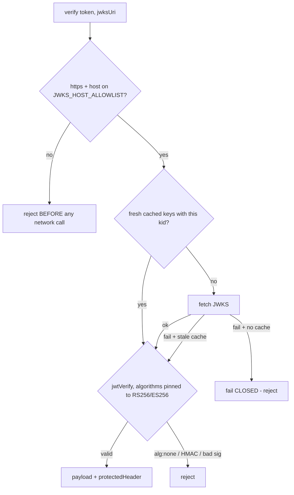

# External JWKS Validator (Q2)

> Step **Q2** of the authentication build ([AUTHENTICATION_ARCHITECTURE.md section 13](AUTHENTICATION_ARCHITECTURE.md#13-step-by-step-execution-plan--estimates--dependencies), tracked in [EXECUTION_LEDGER.md](EXECUTION_LEDGER.md)). Detail: [WIF section 4](WIF_JWT_BEARER_ASSERTION_FOR_SCIM.md#4-the-assertion-claims-validation-jwks). Closes ISV Pattern 4 (external JWKS-validated JWT) and is the signature core Q6's WIF validator builds on.

## What this is

`ExternalJwksValidatorService` ([external-jwks-validator.service.ts](../../api/src/oauth/external-jwks-validator.service.ts)) is the **reusable external-JWT signature core**: given a token and a JWKS URI, it verifies the signature against the remote key set with strict, security-first guarantees. It performs **only** signature + algorithm + JWKS-hygiene checks; the WIF-specific claim checks (`iss`/`aud`/`sub`/`tid`/roles) are layered on top in Q6. Keeping the two separate means the signature core is independently testable and reusable by any future external-JWT method.

## The dependency: `jose`

Q2 adds [`jose`](https://github.com/panva/jose) (npm `jose@^5`) - the most-vetted Node JWT/JWKS library (zero-dependency, used by the Auth0 SDK et al.). It is ESM-only; the service loads it via a dynamic `import('jose')` so the CommonJS build emits a runtime import that Node 24 resolves (verified against the compiled `dist/` output, not just ts-jest).

`jose` carries no security advisory (confirmed by `npm audit`). The only `npm audit` high (`form-data`) is a dev-only transitive dependency, not in any production path.

## The five guarantees

| # | Guarantee | How |
|---|---|---|
| 1 | **Algorithm pinning** | `jwtVerify(..., { algorithms: ['RS256','ES256'] })`. `alg:none` and any HMAC (the public-key-as-HMAC-secret confusion) are rejected. |
| 2 | **SSRF host allowlist** | the `jwksUri` host MUST be on `JWKS_HOST_ALLOWLIST` and the scheme MUST be https. A disallowed host is rejected **before any network call** - the critical anti-SSRF choke point ([architecture section 5.1](AUTHENTICATION_ARCHITECTURE.md#51-placement-table)). |
| 3 | **Cache by URI** with bounded max-age (`JWKS_CACHE_MAX_AGE_MS`, default 10 min) | a `Map` cache; a fresh entry skips the fetch. |
| 4 | **Refetch on unknown `kid`** | the header `kid` is peeked; if the cached set lacks it (key rotation), the JWKS is refetched once. |
| 5 | **Fail closed** | a fetch failure with no usable cached key REJECTS. It never falls back to skipping the signature check. A stale-but-present cache is used as a degraded fallback (logged), never "no check". |

## Configuration

| Env var | Default | Meaning |
|---|---|---|
| `JWKS_HOST_ALLOWLIST` | (empty - all hosts rejected) | Comma-separated host allowlist for JWKS fetches. **Must** be set before WIF (Q6) can validate any assertion. e.g. `login.microsoftonline.com`. |
| `JWKS_CACHE_MAX_AGE_MS` | `600000` (10 min) | Max age of a cached JWKS before a refetch. |

The `fetch` function is injectable (the `JWKS_FETCH` token) so tests drive it with a mock and no network is touched.

## Test coverage

| Layer | Test | Covers |
|---|---|---|
| Unit | [external-jwks-validator.service.spec.ts](../../api/src/oauth/external-jwks-validator.service.spec.ts) | good RS256 passes; `alg:none` rejected; HMAC rejected; wrong-key signature rejected; SSRF non-allowlisted host rejected (no fetch); non-https rejected; fail-closed on outage; cache-by-URI |

Q2 is a primitive with no HTTP surface of its own - it is wired into a request path (and gains E2E + live coverage) when Q6's WIF validator consumes it. The dynamic-import runtime behavior was additionally smoke-verified against the compiled `dist/` output.
