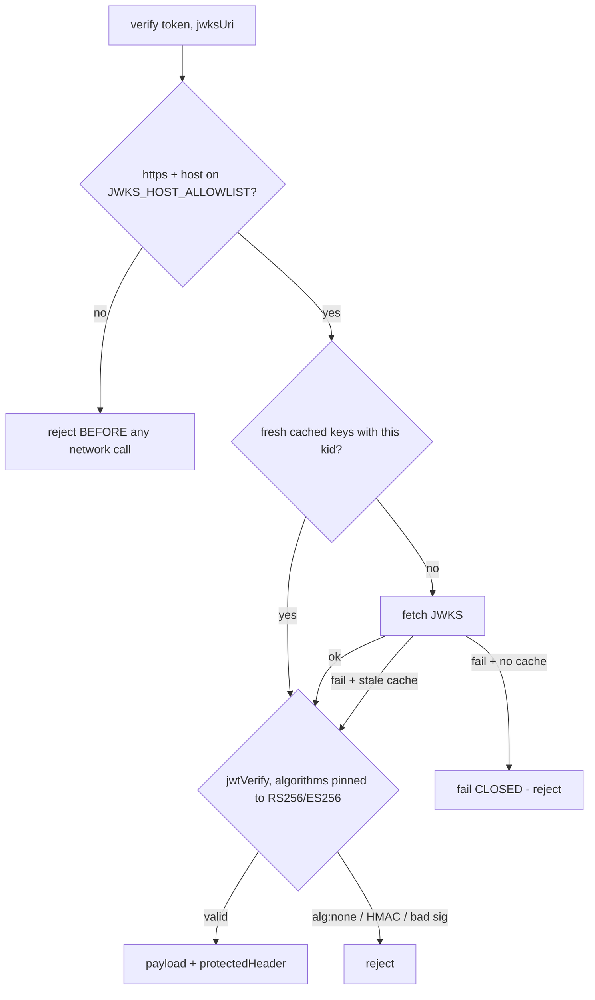
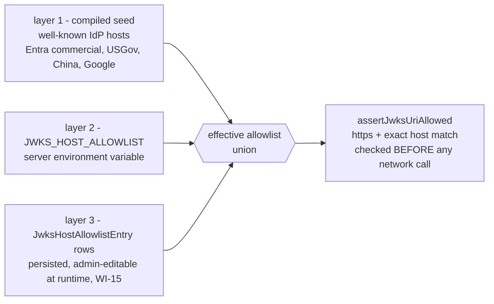

# External JWKS Validator (Q2)

> Step **Q2** of the authentication build ([AUTHENTICATION_ARCHITECTURE.md section 13](AUTHENTICATION_ARCHITECTURE.md#13-step-by-step-execution-plan--estimates--dependencies), tracked in [EXECUTION_LEDGER.md](EXECUTION_LEDGER.md)). Detail: [WIF section 4](WIF_JWT_BEARER_ASSERTION_FOR_SCIM.md#4-the-assertion-claims-validation-jwks). Closes ISV Pattern 4 (external JWKS-validated JWT) and is the signature core Q6's WIF validator builds on.

## What this is

`ExternalJwksValidatorService` ([external-jwks-validator.service.ts](../../api/src/oauth/external-jwks-validator.service.ts)) is the **reusable external-JWT signature core**: given a token and a JWKS URI, it verifies the signature against the remote key set with strict, security-first guarantees. It performs **only** signature + algorithm + JWKS-hygiene checks; the WIF-specific claim checks (`iss`/`aud`/`sub`/`tid`/roles) are layered on top in Q6. Keeping the two separate means the signature core is independently testable and reusable by any future external-JWT method.

## The dependency: `jose`

Q2 adds [`jose`](https://github.com/panva/jose) (npm `jose@^5`) - the most-vetted Node JWT/JWKS library (zero-dependency, used by the Auth0 SDK et al.). It is ESM-only; the service loads it via a dynamic `import('jose')` so the CommonJS build emits a runtime import that Node 24 resolves (verified against the compiled `dist/` output, not just ts-jest).

`jose` carries no security advisory (confirmed by `npm audit`). The only `npm audit` high (`form-data`) is a dev-only transitive dependency, not in any production path.

## The five guarantees

```mermaid
flowchart TD
    A[verify token, jwksUri] --> SSRF{https + host on JWKS_HOST_ALLOWLIST?}
    SSRF -->|no| REJ1[reject BEFORE any network call]
    SSRF -->|yes| CACHE{fresh cached keys with this kid?}
    CACHE -->|yes| VER
    CACHE -->|no| FETCH[fetch JWKS]
    FETCH -->|ok| VER{jwtVerify, algorithms pinned to RS256/ES256}
    FETCH -->|fail + no cache| REJ2[fail CLOSED - reject]
    FETCH -->|fail + stale cache| VER
    VER -->|valid| OK[payload + protectedHeader]
    VER -->|alg:none / HMAC / bad sig| REJ3[reject]
```

| # | Guarantee | How |
|---|---|---|
| 1 | **Algorithm pinning** | `jwtVerify(..., { algorithms: ['RS256','ES256'] })`. `alg:none` and any HMAC (the public-key-as-HMAC-secret confusion) are rejected. |
| 2 | **SSRF host allowlist** | the `jwksUri` host MUST be on the **effective** allowlist and the scheme MUST be https. A disallowed host is rejected **before any network call** - the critical anti-SSRF choke point ([architecture section 5.1](AUTHENTICATION_ARCHITECTURE.md#51-placement-table)). See the note below: the effective allowlist is a union of three layers, not just the environment variable. |
| 3 | **Cache by URI** with bounded max-age (`JWKS_CACHE_MAX_AGE_MS`, default 10 min) | a `Map` cache; a fresh entry skips the fetch. |
| 4 | **Refetch on unknown `kid`** | the header `kid` is peeked; if the cached set lacks it (key rotation), the JWKS is refetched once. |
| 5 | **Fail closed** | a fetch failure with no usable cached key REJECTS. It never falls back to skipping the signature check. A stale-but-present cache is used as a degraded fallback (logged), never "no check". |

### The effective allowlist is three layers, not one (clarified 2026-07-31)

Guarantee 2 says the host must be on "the allowlist". That allowlist is a **union**, and an operator
who reads only `JWKS_HOST_ALLOWLIST` will not be able to explain why an unlisted host was accepted:

```mermaid
flowchart LR
    S["layer 1 - compiled seed<br/>well-known IdP hosts<br/>Entra commercial, USGov, China, Google"] --> U{{"effective allowlist<br/>union"}}
    E["layer 2 - JWKS_HOST_ALLOWLIST<br/>server environment variable"] --> U
    P["layer 3 - JwksHostAllowlistEntry rows<br/>persisted, admin-editable at runtime, WI-15"] --> U
    U --> C["assertJwksUriAllowed<br/>https + exact host match<br/>checked BEFORE any network call"]
```

| Layer | Where it lives | Who changes it | Takes effect |
|---|---|---|---|
| Compiled seed | [jwks-host-allowlist.service.ts](../../api/src/oauth/jwks-host-allowlist.service.ts) | code change | on deploy |
| Environment | `JWKS_HOST_ALLOWLIST` | deployment configuration | on restart |
| Persisted | `JwksHostAllowlistEntry` (Prisma model), managed through [admin-jwks-host.controller.ts](../../api/src/modules/scim/controllers/admin-jwks-host.controller.ts) | an admin, at runtime | immediately |

Host matching is exact and lowercased; there is no wildcard or suffix match. Every redirect hop is
re-checked against the same union, so a redirect cannot walk a request off the allowlist.

**Bounds that exist, and bounds that do not.** Timeout, retry count, retry backoff, redirect hop count
(max 3), and cache max-age are all bounded and configurable. There is **no** cap on JWKS response
size, on the number of keys in a response, on the number of distinct URIs the cache may hold, and no
maximum age past which a stale entry stops being served after a fetch failure. Those four are open
items, tracked in the canonical guide's section 20.

## Runtime egress hardening (configurable)

Beyond the five signature-core guarantees, the **runtime** fetch (the one made
during a WIF token-mint) is hardened against a slow, flaky, or redirect-abusing
IdP. These behaviors are driven by an [`EgressPolicy`](../../api/src/oauth/egress-policy.ts)
merged from server-level env defaults and per-endpoint overrides
(`effective = endpoint ?? server-env ?? hardcoded`):

| Guard | Behavior | Configurable via |
|---|---|---|
| **G1 timeout** | each attempt is bounded by `AbortSignal.timeout(...)`; a hung IdP is aborted rather than blocking the mint. | `JWKS_FETCH_TIMEOUT_MS` / endpoint `JwksFetchTimeoutMs` (5000, 100-60000) |
| **G5 retry + backoff** | a failed fetch retries up to N times with exponential backoff + jitter (`backoff * 2^(attempt-1)`). | `JWKS_FETCH_RETRIES` / `JwksFetchRetries` (2, 0-10) and `JWKS_FETCH_RETRY_BACKOFF_MS` / `JwksFetchRetryBackoffMs` (200, 0-10000) |
| **G2 redirect re-validation** | redirects are followed manually (`redirect: 'manual'`); each 3xx `Location` is re-checked against the SSRF allowlist before it is followed (≤ 3 hops), so a trusted host cannot redirect the fetch to an internal address. | not configurable (always on) |
| **G3 single-flight** | concurrent fetches for the same `jwksUri` are coalesced into one in-flight request. | not configurable (always on) |
| **cache max-age** | how long a cached JWKS is served before a refetch. | `JWKS_CACHE_MAX_AGE_MS` / `JwksCacheMaxAgeMs` (600000, 0-86400000) |

The four numeric knobs are per-endpoint config flags (see
[ENDPOINT_CONFIG_FLAGS_REFERENCE.md](../ENDPOINT_CONFIG_FLAGS_REFERENCE.md#runtime-egress-wif-jwks-fetch));
an endpoint value **overrides** the server env default. On retry exhaustion the
fetch still fails to a usable stale cache if present, otherwise fails closed.
**Scope:** this hardening applies to the runtime token-mint fetch only, not the
config-time discovery/verify paths.

> **Open finding X15-F1 - the cache defaults contradict Entra's published guidance.**
> The 2026-07-28 runtime-tuning audit
> ([../perf/RUNTIME_TUNING_AND_CONFIGURATION_REFERENCE.md](../perf/RUNTIME_TUNING_AND_CONFIGURATION_REFERENCE.md) section 4.1)
> compared the behaviour documented above against
> [Microsoft's signing-key-rollover guidance](https://learn.microsoft.com/en-us/entra/identity-platform/signing-key-rollover)
> for consumers of its own keys, and found four gaps:
>
> | Aspect | Entra guidance | This validator today |
> |---|---|---|
> | Cache TTL | 24 h | **10 min** (144x more aggressive) |
> | Refresh mode | background job | **synchronous, on the mint hot path** |
> | Refresh cadence | every 1 h | on expiry only (no proactive refresh) |
> | Cache granularity | per `kid` | per `jwksUri` (whole key set) |
> | Unknown-`kid` refetch | yes, **rate-limited to once per 5 min** | yes, **no rate limit** (guarantee 4 above) |
> | On fetch failure | serve last-known-good | serve stale (guarantee 5 - already correct) |
>
> The 10-minute TTL is the direct cause of the periodic ~2,161 ms cold mint measured in
> [../perf/WIF_TOKEN_MINT_LATENCY_ANALYSIS.md](../perf/WIF_TOKEN_MINT_LATENCY_ANALYSIS.md),
> and the unrate-limited unknown-`kid` refetch is an amplification vector (a flood of
> tokens carrying a bogus `kid` each triggers an outbound fetch). Both are owned by
> **W1.4**, which the finding redesigns. **The TTL raise must not ship alone** - a 24 h
> TTL without a working background refresher multiplies the key-rotation blast radius.

## Configuration

| Env var | Default | Meaning |
|---|---|---|
| `JWKS_HOST_ALLOWLIST` | (empty - all hosts rejected) | Comma-separated host allowlist for JWKS fetches. **Must** be set before WIF (Q6) can validate any assertion. e.g. `login.microsoftonline.com`. |
| `JWKS_CACHE_MAX_AGE_MS` | `600000` (10 min) | Max age of a cached JWKS before a refetch. Per-endpoint override `JwksCacheMaxAgeMs`. **X15-F1: the recommended value is `86400000` (24 h), but only once W1.4's background refresher and rate-limited unknown-`kid` path exist. Do not raise it on today's code.** |
| `JWKS_FETCH_TIMEOUT_MS` | `5000` | Per-attempt runtime fetch timeout (ms). Per-endpoint override `JwksFetchTimeoutMs`. |
| `JWKS_FETCH_RETRIES` | `2` | Retries for a failed runtime fetch (total tries = retries + 1). Per-endpoint override `JwksFetchRetries`. |
| `JWKS_FETCH_RETRY_BACKOFF_MS` | `200` | Base retry backoff (ms), exponential + jitter. Per-endpoint override `JwksFetchRetryBackoffMs`. |

The `fetch` function is injectable (the `JWKS_FETCH` token) so tests drive it with a mock and no network is touched.

## Test coverage

| Layer | Test | Covers |
|---|---|---|
| Unit | [external-jwks-validator.service.spec.ts](../../api/src/oauth/external-jwks-validator.service.spec.ts) | good RS256 passes; `alg:none` rejected; HMAC rejected; wrong-key signature rejected; SSRF non-allowlisted host rejected (no fetch); non-https rejected; fail-closed on outage; cache-by-URI; **G1 timeout + redirect:manual passed to fetch; G5 retry-then-succeed + endpoint retries=0 override; G2 SSRF redirect-to-disallowed-host rejected + redirect-to-allowed-host followed; G3 single-flight coalescing** |
| Unit | [egress-policy.spec.ts](../../api/src/oauth/egress-policy.spec.ts) | server-default env resolution + clamping; endpoint-over-server merge precedence; bounds clamping |

Q2 is a primitive with no HTTP surface of its own - it is wired into a request path (and gains E2E + live coverage) when Q6's WIF validator consumes it. The dynamic-import runtime behavior was additionally smoke-verified against the compiled `dist/` output.
