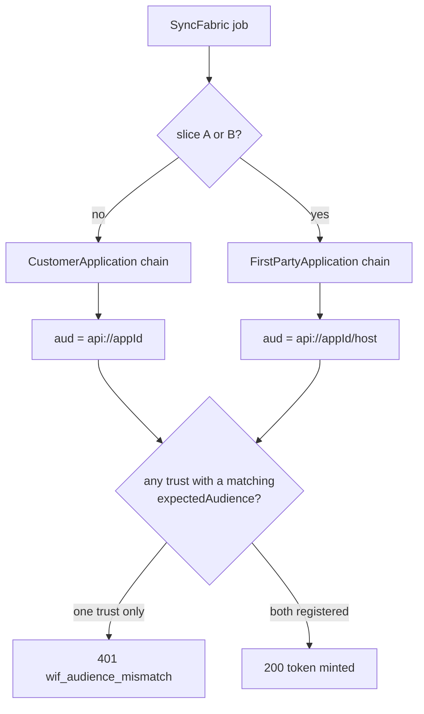

# N6 runbook - "it worked yesterday and now every token is 401"

**Status:** RUNBOOK. **Last verified:** 2026-08-19 (api v0.55.10).

**Symptom:** WIF token requests that worked start returning `401` with reason
`wif_audience_mismatch`, and **nothing changed on the SCIMServer side** - no deploy, no config edit,
no credential rotation.

**One-line answer:** the caller switched acquisition chain, so Entra is now minting a different `aud`.
Register the other audience shape as a **second WIF trust**. No code change, no deploy.

---

## 1. Why this happens

SyncFabric composes the requested scope differently depending on which chain is active, and Entra
mints the `aud` claim from that scope:

| Acquisition chain | Composed scope | Resulting `aud` |
|---|---|---|
| `CustomerApplication` (legacy) | `api://<appId>/.default` | `api://<appId>` |
| `FirstPartyApplication` (newer) | `api://<appId>/<normalizedDnsHost>/.default` | `api://<appId>/<host>` |

The chain is selected by the SyncFabric feature flag
`workloadIdentityFirstPartyApplicationIsDefault`, which at the time of writing is enabled on
**slices A and B** and disabled globally. A job that moves between slices therefore changes its
`aud` **with no involvement from us**.

SCIMServer stores one `expectedAudience` per trust and matches it exactly:

```ts
private audienceMatches(aud: string | string[] | undefined, expected: string): boolean {
  if (Array.isArray(aud)) return aud.includes(expected);
  return aud === expected;
}
```



## 2. Diagnose it in under a minute

The decision trace already names both sides. Fetch it:

```http
GET /scim/admin/endpoints/{endpointId}/auth-decisions
Authorization: Bearer <admin token>
```

Look for the `audience_match` check:

```text
audience_match   FAIL   expected: api://<appId>   received: api://<appId>/scim.example.com
```

**If `received` is `expected` plus a `/<host>` suffix (or vice versa), this runbook is your answer.**
If `received` is an unrelated value, it is an ordinary misconfiguration - fix `expectedAudience` and
stop here.

With several trusts on the endpoint, the trace carries a **sub-trace per rejected trust**, so you can
see that every one was tried and why each failed.

## 3. Fix it

Register the missing shape as a second trust. Everything else - issuer, subject, tenant, JWKS URI,
scope - stays identical.

```http
POST /scim/admin/endpoints/{endpointId}/credentials
Authorization: Bearer <admin token>
Content-Type: application/json

{
  "credentialType": "wif",
  "label": "Entra WIF (FirstPartyApplication chain)",
  "wif": {
    "assertionProfile": "jwt-bearer",
    "expectedIssuer": "https://login.microsoftonline.com/<tenantId>/v2.0",
    "expectedSubject": "<service principal object id>",
    "expectedAudience": "api://<appId>/<normalized-dns-host>",
    "jwksUri": "https://login.microsoftonline.com/<tenantId>/discovery/v2.0/keys",
    "allowedTenantId": "<tenantId>",
    "scope": "scim.read scim.write",
    "issuedTokenTtlSec": 3600
  }
}
```

**Give the two trusts distinct labels.** The credential **list** endpoint returns only
`id`, `endpointId`, `credentialType`, `label`, `active`, `createdAt`, `expiresAt` - it deliberately
does not include trust detail, so the **label is the only way to tell the two apart** afterwards.

The host segment is the target's DNS host with any leading `www.` removed, and no scheme, port, path
or query. When in doubt, read it from the `received:` value in the decision trace rather than
deriving it.

## 4. Why this is not a security compromise

The obvious-looking alternative - making `api://<appId>` also accept `api://<appId>/<anything>` -
**would** be a compromise: a prefix match is not an exact match.

Two trusts is not that. Each trust still matches its audience **exactly**, and both values are
explicitly declared by an operator. The endpoint accepts exactly two audience strings instead of one,
both chosen deliberately. This is the same posture Microsoft's own validators take with
`ValidAudiences`.

Assertions matching neither are still rejected - locked by `N6-E3` and unit `N6-T3`.

## 5. Cost

| Aspect | Impact |
|---|---|
| Verification work | One extra failed verification on the non-matching trust. Same `jwksUri`, so it is a cache hit - no extra outbound fetch |
| Ordering | Trusts are ordered by issuer. Both carry the **same** issuer here, so ordering cannot discriminate; the fall-through does the work. Registration order does not matter (unit `N6-T2`) |
| Cleanup | When the estate is fully on one chain, delete the unused trust. Nothing forces you to |

## 6. What holds this claim true

A runbook that is not tested is a claim that quietly rots. The remedy is locked at three levels:

| Level | Where | Asserts |
|---|---|---|
| Unit | [wif-assertion-token.provider.spec.ts](../../api/src/modules/scim/controllers/wif-assertion-token.provider.spec.ts) `describe('N6 ...')` | Fall-through works with the **same issuer** on both trusts, in **either** registration order, and still rejects an unrelated audience |
| E2E | [n6-slice-audience.e2e-spec.ts](../../api/test/e2e/n6-slice-audience.e2e-spec.ts) | Real RS256 assertions of **both** shapes mint over HTTP against one endpoint, an unrelated audience gets `401`, and a token minted via the first-party trust **authorizes a real SCIM call** |
| Live | [live-test.ps1](../../scripts/live-test.ps1) section **9z-CH** | A second trust differing only by audience is **accepted as a distinct credential**, does not overwrite the first, and both audiences are stored verbatim |

The unit tests were **mutation-checked**: replacing the provider's `continue` with a throw makes them
fail, so they would catch a refactor that removed the fall-through.

Note the existing `WI-16` test covers multi-trust with **different issuers**; because trusts are
ordered by issuer, the same-issuer case these tests cover is a genuinely different path.

## 7. When to revisit

Only if one of these becomes true:

- SyncFabric emits a **third** audience shape. Two trusts scale to three; a design change is still
  not indicated.
- Operators are routinely managing many audience variants per endpoint, at which point an
  `expectedAudiences[]` field would be about ergonomics, not capability.

**Do not** implement prefix or wildcard audience matching. It converts an exact check into a
pattern check on the claim that binds a token to this server.
