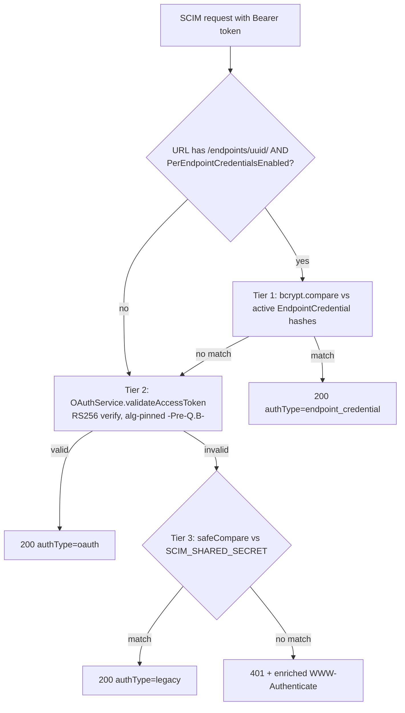

# OAuth Discovery + Bearer-Error Enrichment + the 3-Tier Chain (Q0)

> Step **Q0** of the authentication build ([AUTHENTICATION_ARCHITECTURE.md section 13](AUTHENTICATION_ARCHITECTURE.md#13-step-by-step-execution-plan--estimates--dependencies), tracked in [EXECUTION_LEDGER.md](EXECUTION_LEDGER.md)). Enabling step that closes three small interop gaps: an enriched `WWW-Authenticate` header, an `aud` claim on issued tokens, and a published RFC 8414 metadata document. It also documents the shipped 3-tier resource-plane chain.

## 1. The 3-tier resource-plane chain (documented)

Every SCIM call is authorized by [shared-secret.guard.ts](../../api/src/modules/auth/shared-secret.guard.ts), which tries three acceptors in order and authorizes on the first match:



| Tier | Acceptor | Credential | Status |
|---|---|---|---|
| 1 | Per-endpoint bcrypt bearer | `EndpointCredential.credentialHash` | SHIPPED (G11) |
| 2 | OAuth 2.0 JWT (RS256, alg-pinned) | issued by the global issuer | SHIPPED; asymmetric since Pre-Q.B |
| 3 | Legacy global bearer | `SCIM_SHARED_SECRET` | SHIPPED |

This chain is the resource plane. The token-mint plane (`POST /scim/oauth/token`) is separate; the WIF token-mint path is added in A3/Q6.

## 2. WWW-Authenticate enrichment (RFC 6750 section 3)

The guard already emitted `WWW-Authenticate: Bearer realm="SCIM"` on a 401. Q0 enriches it per [RFC 6750 section 3](rfcs/RFC_6750_EXPLAINED.md):

| Scenario | `WWW-Authenticate` value |
|---|---|
| Token presented but rejected | `Bearer realm="SCIM", error="invalid_token", error_description="Invalid bearer token."` |
| No token presented | `Bearer realm="SCIM"` (no error code - RFC 6750 section 3 says omit error when credentials are absent) |

The `error`/`error_description` are only added when a token was actually presented and rejected, so a first-contact client that simply did not know auth was required is not handed a misleading error code.

## 3. `aud` claim on issued tokens

Issued access tokens now carry an `aud` claim ([oauth.service.ts](../../api/src/oauth/oauth.service.ts)), identifying the SCIM resource server as the intended audience. Default `scimserver-scim-api`; override with `OAUTH_TOKEN_AUDIENCE`. The claim is **not yet enforced** on verification (that arrives with per-endpoint audiences in Q1) - adding it now is non-breaking and gives downstream consumers an audience to assert against.

## 4. RFC 8414 authorization-server metadata

New public endpoint at the deployment ROOT (excluded from the `scim` global prefix): `GET /.well-known/oauth-authorization-server` ([oauth-metadata.controller.ts](../../api/src/oauth/oauth-metadata.controller.ts)).

```jsonc
{
  "issuer": "scimserver-oauth-server",
  "token_endpoint": "https://<host>/scim/oauth/token",
  "jwks_uri": "https://<host>/scim/oauth/jwks",
  "grant_types_supported": ["client_credentials"],
  "token_endpoint_auth_methods_supported": ["client_secret_post"],
  "scopes_supported": ["scim.read", "scim.write", "scim.manage"]
}
```

- `issuer` is the same constant ([oauth.constants.ts](../../api/src/oauth/oauth.constants.ts) `OAUTH_ISSUER`) the JWT signer stamps as `iss`, so the metadata is self-consistent with issued tokens (RFC 8414 requirement, asserted by a test).
- `token_endpoint` + `jwks_uri` are built from the request host, so the document is correct on any deployment (local, Docker, dev Azure) without configuration.
- `token_endpoint_auth_methods_supported` is `['client_secret_post']` today; `private_key_jwt` is added when WIF lands (Q6).

## Test coverage

| Layer | Test | Covers |
|---|---|---|
| Unit | [oauth-asymmetric.spec.ts](../../api/src/oauth/oauth-asymmetric.spec.ts) "issued token claims (Q0)" | `aud` present + `OAUTH_TOKEN_AUDIENCE` override |
| E2E | [oauth-discovery.e2e-spec.ts](../../api/test/e2e/oauth-discovery.e2e-spec.ts) | WWW-Authenticate enrichment (invalid vs missing), metadata shape + public + cacheable, issuer == token iss |
| Live | `scripts/live-test.ps1` section **9z-AO** | metadata resolves, iss match, aud claim, 401 enriched header, across all 3 form factors |

References: [RFC 6750](rfcs/RFC_6750_EXPLAINED.md) section 3, [RFC 8414](rfcs/RFC_8414_EXPLAINED.md), [RFC 6749](rfcs/RFC_6749_EXPLAINED.md) section 5.2.
